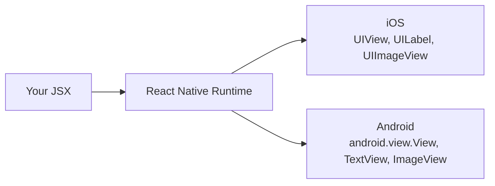
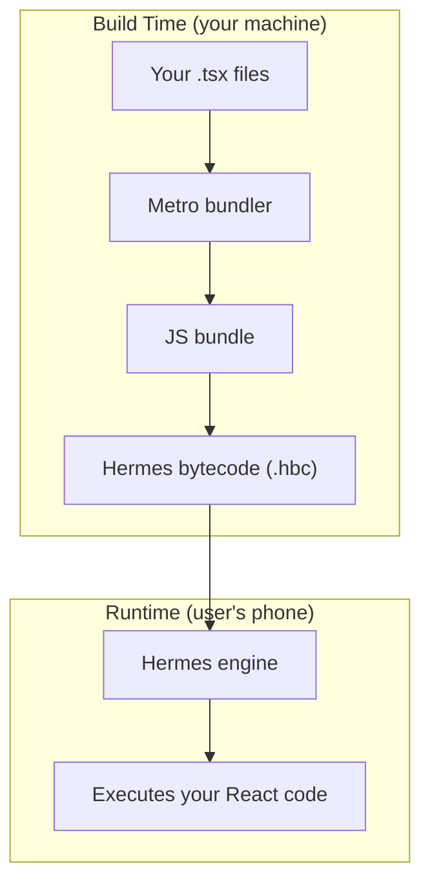
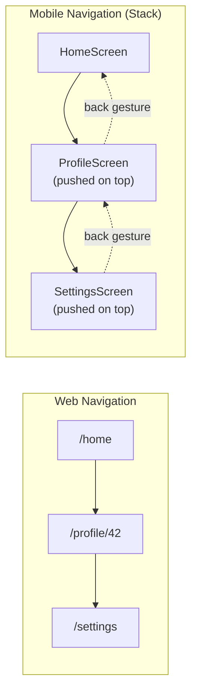
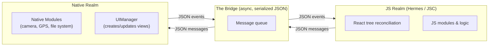
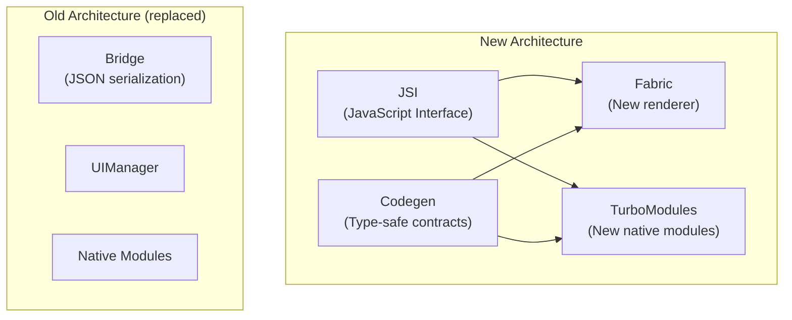
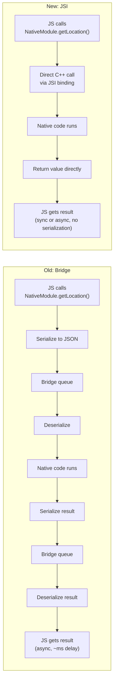
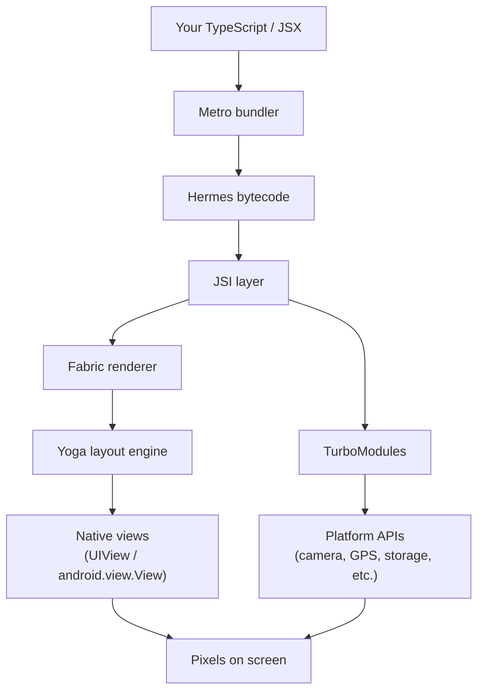

# React Native Fundamentals: Understanding the Runtime

> What React Native actually is under the hood, and the critical mental model shift from web to mobile.

---

## Table of Contents

1. [What React Native Actually Is](#1-what-react-native-actually-is)
2. [Mental Model Shift from Web](#2-mental-model-shift-from-web)
3. [Architecture Overview](#3-architecture-overview)

This chapter assumes you already know React for the web: components, props, state, hooks, JSX. You do not need any prior mobile development experience. By the end you will understand what happens when your JavaScript runs on a phone, why some web instincts will betray you, and how the old and new React Native architectures differ in ways that matter to your daily work.

---

## 1. What React Native Actually Is

### Start with the misconception

Most developers hear "React Native" and picture a WebView — a mini browser embedded inside a phone app, rendering your HTML and CSS like a fancy iframe. That is not what React Native is. If that were the case it would just be Cordova with extra steps, and performance would be terrible.

React Native is a **runtime** that takes your React component tree and renders it to **real, platform-native UI primitives**. When you write `<View>`, you do not get a `<div>` in a hidden browser. On iOS you get a `UIView`. On Android you get an `android.view.View`. The button your user taps is the exact same button every other native app on that phone uses. The scroll physics, the text rendering, the accessibility layer — all native.



This is the key insight: **React is the programming model, not the rendering target.** On the web, React renders to DOM nodes (`div`, `span`, `input`). In React Native, React renders to native platform views. The component lifecycle, hooks, state management, context — all of that works identically. What changes is the set of primitives you compose with.

### The JavaScript engine: Hermes

Your JavaScript has to run somewhere. On the web, that is V8 (Chrome) or JavaScriptCore (Safari). React Native used to ship with JavaScriptCore on both platforms, but since React Native 0.70, the default engine is **Hermes** — a JavaScript engine Meta built specifically for mobile.

Why build a whole new engine? Because mobile constraints are different from desktop browser constraints:

- **Startup time matters more than peak throughput.** Users expect an app to open in under a second. Hermes compiles your JS to bytecode at build time (ahead-of-time compilation), so the engine does not have to parse and compile JavaScript on the user's phone every time the app launches.
- **Memory is tighter.** A phone has 4-8 GB of RAM shared across every running app. Hermes uses less memory than JavaScriptCore by design.
- **Binary size counts.** Hermes produces a smaller engine binary, which means a smaller app download.



You do not interact with Hermes directly. You write normal TypeScript, and the build toolchain handles the rest. But you should know it is there, because it explains why certain things work differently than in a browser:

- `Hermes` does not support every bleeding-edge JavaScript feature. It covers ES2020+ well, but if you use a very new proposal you may hit a syntax error that would not happen in Chrome.
- Debugging connects to Hermes via Chrome DevTools protocol. When you open the debugger, you are talking to Hermes, not to a browser.
- Performance profiling tools (Flipper, React DevTools) are Hermes-aware and can show you bytecode-level information.

> **Note:** You can still opt out of Hermes and use JavaScriptCore if you have a specific reason, but there is almost never a good reason to do so in a new project. Hermes is the recommended default.

### Metro: the bundler

On the web you use Vite or Webpack to bundle your code. In React Native the bundler is **Metro**. It watches your files, resolves imports, transforms TypeScript/JSX, and serves the bundle to the running app over a local HTTP server during development. In production it produces a single optimized bundle that gets embedded in the binary.

Metro is simpler than Webpack (no loaders, no complex config) but also less flexible. You configure it through `metro.config.js`, and for most projects you never touch it.

```bash
# Metro starts automatically when you run:
npx react-native start

# Or if using Expo:
npx expo start
```

### Native primitives, not HTML elements

Here is the mapping that matters most when coming from the web:

| Web (React DOM)       | React Native            | Native result (iOS)        | Native result (Android)         |
|-----------------------|-------------------------|----------------------------|---------------------------------|
| `<div>`               | `<View>`                | `UIView`                   | `android.view.View`             |
| `<span>`, `<p>`, `<h1>` | `<Text>`             | `UILabel`                  | `TextView`                      |
| ``               | `<Image>`               | `UIImageView`              | `ImageView`                     |
| `<input>`             | `<TextInput>`           | `UITextField`              | `EditText`                      |
| `<button>`            | `<Pressable>` / `<TouchableOpacity>` | `UIView` with gesture recognizer | `View` with touch handler |
| `<div style="overflow:scroll">` | `<ScrollView>` | `UIScrollView`            | `ScrollView`                    |
| `<ul>` with virtualization | `<FlatList>`       | `UICollectionView`         | `RecyclerView`                  |

A quick example to feel the difference:

```tsx
// Web React
const WebCard = () => (
  <div className="card">
    <h2>Hello</h2>
    <p>This is a paragraph.</p>
    
    <button onClick={() => alert('clicked')}>Press me</button>
  </div>
);

// React Native
import { View, Text, Image, Pressable, Alert, StyleSheet } from 'react-native';

const NativeCard = () => (
  <View style={styles.card}>
    <Text style={styles.title}>Hello</Text>
    <Text>This is a paragraph.</Text>
    <Image source={{ uri: 'https://example.com/photo.jpg' }} style={styles.image} />
    <Pressable onPress={() => Alert.alert('clicked')}>
      <Text>Press me</Text>
    </Pressable>
  </View>
);

const styles = StyleSheet.create({
  card: { padding: 16, backgroundColor: '#fff', borderRadius: 8 },
  title: { fontSize: 24, fontWeight: 'bold' },
  image: { width: 200, height: 200 },
});
```

Notice: there is no `className`. There is no CSS file. There is no `<div>`. Every piece of text must be inside a `<Text>` component — bare strings outside `<Text>` will crash. These are not cosmetic differences; they are fundamental constraints of the native rendering model.

---

## 2. Mental Model Shift from Web

### There is no DOM

This sounds obvious once stated, but the consequences run deep. On the web, everything is a node in the Document Object Model. You can `document.querySelector` anything, inspect computed styles, measure bounding rects, manipulate the tree imperatively. In React Native, none of that exists. There is no `document`, no `window`, no `navigator.userAgent`, no `localStorage`.

If you have ever written:

```tsx
// This will crash in React Native
const width = window.innerWidth;
localStorage.setItem('token', value);
document.title = 'My App';
```

...you need to replace those with platform APIs:

```tsx
import { Dimensions } from 'react-native';
import AsyncStorage from '@react-native-async-storage/async-storage';

// Screen dimensions
const { width } = Dimensions.get('window');

// Persistent storage (async, not sync like localStorage)
await AsyncStorage.setItem('token', value);

// There is no document.title — mobile apps do not have a title bar controlled by you
```

This also means that any npm package that touches the DOM will not work. Libraries like `react-helmet`, `react-modal` (the web one), or anything that calls `document.createElement` are web-only. Always check that a library supports React Native before installing it.

### There is no URL bar

On the web, navigation is fundamentally about URLs. The user types a URL, clicks a link, hits the back button — all of it is URL-driven. React Router maps URL paths to components.

On mobile, there is no URL bar. Navigation is a **stack of screens** — you push a new screen on top, and the back button (or swipe gesture) pops it off. This is closer to a stack data structure than to URL routing.



The standard navigation library is **React Navigation** (not React Router). It gives you stack navigators, tab navigators, and drawer navigators that behave like native iOS and Android navigation patterns.

```tsx
import { NavigationContainer } from '@react-navigation/native';
import { createNativeStackNavigator } from '@react-navigation/native-stack';

const Stack = createNativeStackNavigator();

const App = () => (
  <NavigationContainer>
    <Stack.Navigator>
      <Stack.Screen name="Home" component={HomeScreen} />
      <Stack.Screen name="Profile" component={ProfileScreen} />
    </Stack.Navigator>
  </NavigationContainer>
);
```

> **Note:** Expo Router is a newer file-based routing solution that brings URL-like routing to React Native. It is built on top of React Navigation and is worth considering, especially if you want deep linking or universal links. But understand the stack model first — it is what happens underneath.

### Flexbox is the default (but flipped)

On the web, the default layout is `display: block` with `flex-direction: row` when you opt into flexbox. In React Native, **every `<View>` is a flex container by default**, and the default `flexDirection` is `column`, not `row`.

This means your mental model needs to flip:

```tsx
// Web: items go left-to-right by default in a flex container
// <div style={{ display: 'flex' }}> -> row

// React Native: items go top-to-bottom by default
// <View> -> column
```

A concrete example:

```tsx
import { View, Text, StyleSheet } from 'react-native';

const FlexExample = () => (
  <View style={styles.container}>
    <Text>First</Text>
    <Text>Second</Text>
    <Text>Third</Text>
  </View>
);

const styles = StyleSheet.create({
  container: {
    flex: 1,
    // These items stack vertically by default (flexDirection: 'column')
    // To make them horizontal, you would add: flexDirection: 'row'
    justifyContent: 'center', // centers along the main axis (vertical)
    alignItems: 'center',     // centers along the cross axis (horizontal)
  },
});
```

The full layout system is a subset of CSS Flexbox. Properties like `justifyContent`, `alignItems`, `flex`, `flexWrap`, and `gap` all work as you expect — just remember the default direction is flipped.

### Unitless values (density-independent pixels)

On the web, you specify `fontSize: '16px'` or `margin: '1rem'`. In React Native, all layout values are **unitless numbers** that represent **density-independent pixels (dp)**.

```tsx
const styles = StyleSheet.create({
  box: {
    width: 100,      // 100dp, not 100px
    height: 100,     // 100dp
    margin: 16,      // 16dp
    fontSize: 14,    // 14dp
    borderRadius: 8, // 8dp
  },
});
```

A density-independent pixel is roughly the same physical size across devices. On a high-DPI phone, 100dp might be 200 or 300 physical pixels — React Native handles the conversion. You never write `px`, `em`, `rem`, `vh`, or `%` (with a few exceptions like `width: '50%'` which is supported as a string).

> **Gotcha:** There is no `calc()`, no `clamp()`, no media queries. For responsive layouts you either use `flex` proportions, the `Dimensions` API, or the `useWindowDimensions` hook. Libraries like `react-native-responsive-screen` can help, but most layouts are done with flex.

### Two threads, not one

On the web, JavaScript and rendering both happen on the main thread (with Web Workers as an opt-in escape hatch). In React Native, there are (at minimum) two threads that matter:


The **JS thread** runs your JavaScript code: component rendering, state updates, API calls, business logic. The **UI thread** (also called the main thread) is where native views are drawn on screen and where touch events originate.

These two threads communicate asynchronously. When your component re-renders and produces new layout instructions, those instructions are serialized and sent to the UI thread, which updates the native views. When the user taps a button, the UI thread sends the touch event to the JS thread, which runs your `onPress` handler.

This separation is mostly invisible to you, but it explains a few things:

- **Animations that run on the JS thread can stutter.** If your JS thread is busy (running a big computation, re-rendering a large list), animations driven by JavaScript will drop frames. This is why React Native's `Animated` API with `useNativeDriver: true` pushes animation logic to the UI thread, keeping it smooth even when JS is busy.
- **Heavy computations block your UI indirectly.** A synchronous `JSON.parse` of a 5MB payload on the JS thread will freeze your app's responsiveness because touch events queue up waiting for the JS thread to be free.
- **`console.log` in production costs more than you think.** Every log statement serializes data across the bridge. Remove them before shipping.

```tsx
import { Animated } from 'react-native';

// Good: animation runs on the UI thread
Animated.timing(opacity, {
  toValue: 1,
  duration: 300,
  useNativeDriver: true, // this is the critical flag
}).start();

// Bad: animation runs on the JS thread (will stutter under load)
Animated.timing(opacity, {
  toValue: 1,
  duration: 300,
  useNativeDriver: false,
}).start();
```

> **Gotcha:** `useNativeDriver: true` only supports a subset of animatable properties — `opacity` and `transform` are safe. You cannot use it for `backgroundColor`, `width`, `height`, or other layout properties. For those, look into `react-native-reanimated`, which provides a more powerful animation library that runs entirely on the UI thread.

---

## 3. Architecture Overview

### The old architecture: the Bridge

Before React Native 0.68, all communication between JavaScript and native code went through a single abstraction called **the Bridge**. Understanding it helps you read older blog posts, debug legacy apps, and appreciate why the new architecture exists.

The Bridge works like this:



Every interaction — creating a view, updating a style, reading the GPS coordinates, handling a touch — is a JSON message passed through this queue. The Bridge is:

1. **Asynchronous.** Messages are batched and sent in chunks. This means you cannot call a native function and get a synchronous return value.
2. **Serialized.** Every message is converted to JSON and parsed on the other side. Passing a large array means serializing it, copying it across the bridge, and deserializing it.
3. **Single-bottleneck.** All native module calls and all UI updates share the same queue. A burst of rapid UI updates can delay a camera access call sitting behind them.

This worked well enough for many apps, but it introduced measurable overhead:

- **Startup penalty.** All native modules had to be initialized at launch, even ones the user might never use.
- **Serialization cost.** Frequent, small messages (like those during a scroll) meant constant JSON encoding and decoding.
- **No synchronous calls.** Some APIs (like getting the screen dimensions) are inherently synchronous, but the bridge forced them to be async or required workarounds.

### The new architecture: JSI, Fabric, and TurboModules

Starting with React Native 0.68 and stabilized in 0.73+, the **New Architecture** replaces the Bridge with three interconnected pieces:



**JSI (JavaScript Interface)** is the foundation. Instead of serializing messages to JSON and passing them through a queue, JSI lets JavaScript hold **direct references to C++ host objects**. Your JS code can call a native function as if it were a regular JavaScript function — no serialization, no async queue, no bridge.

Think of it this way: the old bridge was like two people in separate rooms passing notes under a door. JSI is like knocking down the wall so they can talk face to face.



**Fabric** is the new rendering system that replaces the old `UIManager`. With the Bridge, creating and updating native views required sending JSON messages across the bridge. With Fabric:

- The **shadow tree** (React Native's layout tree, analogous to the browser's layout engine) can be created and updated synchronously from JavaScript via JSI.
- Layout is computed using **Yoga** (a cross-platform Flexbox engine written in C++) and the results are accessible to both JS and native code without serialization.
- **Concurrent rendering** is supported — Fabric works with React 18's concurrent features, allowing interruptible rendering and transitions.

**TurboModules** replace the old Native Modules system. The key improvements:

- **Lazy loading.** A TurboModule is only initialized when your code first imports it, not at app startup. If your app has 50 native modules but a given user flow only touches 5, only those 5 get loaded.
- **Synchronous access.** Because TurboModules are bound via JSI, you can make synchronous calls when the API makes sense (reading a value from storage, getting device info).
- **Type safety via Codegen.** You define the module's interface in a TypeScript or Flow spec file, and React Native's Codegen generates the native boilerplate (Objective-C++ on iOS, Java/Kotlin on Android) and the JSI bindings automatically. This eliminates an entire class of runtime errors where JS and native disagreed on argument types.

```tsx
// A TurboModule spec (simplified)
// This TypeScript interface generates native code via Codegen
import type { TurboModule } from 'react-native';
import { TurboModuleRegistry } from 'react-native';

export interface Spec extends TurboModule {
  getDeviceName(): string;           // synchronous — returns immediately
  getBatteryLevel(): Promise<number>; // async when it makes sense
}

export default TurboModuleRegistry.getEnforcing<Spec>('DeviceInfo');
```

### What this means for you in practice

If you are starting a new React Native project today (especially with Expo SDK 51+ or bare React Native 0.73+), you are on the New Architecture by default. Here is what that changes in your day-to-day work:

1. **Faster startup.** TurboModules' lazy loading means your app loads only what it needs.
2. **Smoother interactions.** Fabric's synchronous layout means fewer dropped frames during complex UI updates.
3. **Better library compatibility.** The ecosystem is migrating to the New Architecture. Libraries like `react-native-reanimated`, `react-native-gesture-handler`, and `react-native-screens` already support it. Check a library's compatibility before adopting it — a few older libraries still depend on the Bridge.
4. **Type-safe native modules.** If you ever write your own native module (to access a device sensor, for example), Codegen catches type mismatches at build time instead of crashing at runtime.

> **Gotcha:** Some older tutorials and Stack Overflow answers reference `NativeModules` from `react-native` — that is the old Bridge-based API. It still works (there is a compatibility layer), but for new code, use TurboModules. If you are using Expo managed workflow, you rarely write native modules yourself — Expo's module system handles the abstraction.

### Putting it all together: the full picture

Here is the complete runtime picture of a React Native app on the New Architecture:



You write React components in TypeScript. Metro bundles them. Hermes executes the bytecode. When your components render, React's reconciler produces a tree of native view descriptions. Fabric, via JSI, creates and updates the actual native views on the UI thread. Yoga computes the Flexbox layout. TurboModules, also via JSI, give your JS code access to platform capabilities like the camera, file system, or sensors — lazily, type-safely, and without the serialization overhead of the old Bridge.

That is the full stack from your `.tsx` file to the pixels on the user's screen.

---