# React Native Fundamentals: Understanding the Runtime

> What React Native actually is under the hood, and the critical mental model shift from web to mobile.

---

## Table of Contents

1. [What React Native Actually Is](#1-what-react-native-actually-is)
2. [Mental Model Shift from Web](#2-mental-model-shift-from-web)
3. [Architecture Overview](#3-architecture-overview)

This chapter assumes you already know React for the web: components, props, state, hooks, JSX. You do not need any prior mobile development experience. By the end you will understand what happens when your JavaScript runs on a phone, why some web instincts will betray you, and how the old and new React Native architectures differ in ways that matter to your daily work.

> **How to read this chapter:** Do not try to memorize the names (Hermes, Metro, JSI, Fabric, Yoga). Instead, build the mental movie of "my `.tsx` file becomes pixels on a phone." Each section adds one frame to that movie. By section 3 you will be able to narrate the whole journey yourself.

---

## 1. What React Native Actually Is

### Start with the misconception

Most developers hear "React Native" and picture a WebView — a mini browser embedded inside a phone app, rendering your HTML and CSS like a fancy iframe. That is not what React Native is. If that were the case it would just be Cordova with extra steps, and performance would be terrible.

React Native is a **runtime** that takes your React component tree and renders it to **real, platform-native UI primitives**. When you write `<View>`, you do not get a `<div>` in a hidden browser. On iOS you get a `UIView`. On Android you get an `android.view.View`. The button your user taps is the exact same button every other native app on that phone uses. The scroll physics, the text rendering, the accessibility layer — all native.

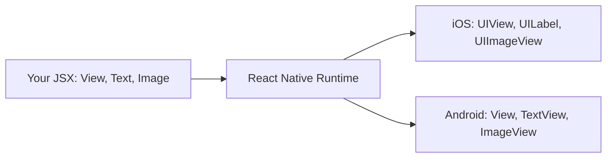

This is the key insight: **React is the programming model, not the rendering target.** On the web, React renders to DOM nodes (`div`, `span`, `input`). In React Native, React renders to native platform views. The component lifecycle, hooks, state management, context — all of that works identically. What changes is the set of primitives you compose with.

### An analogy: the same driver, a different car

Think of React (the library) as a skilled driver, and the rendering target as the car. On the web, the driver sits in a "browser car" whose controls are DOM nodes. In React Native, the same driver sits in a "native car" whose controls are `UIView` and `TextView`. The driving skills (your knowledge of components, props, state, hooks) transfer completely. You only have to learn the new dashboard. This is why React Native is so approachable for React developers — and also why the few differences that *do* exist are so surprising when you hit them.

### Three families of "React"

It helps to be precise about which "React" does what, because the names blur together:

| Package | Role | Analogy |
|---|---|---|
| `react` | The core engine: components, hooks, reconciliation. Knows nothing about screens. | The driver's brain |
| `react-dom` | The web renderer. Turns React output into DOM nodes. | The browser car |
| `react-native` | The native renderer. Turns React output into native views. | The native car |

You import `useState` and `useEffect` from `react` in *both* worlds — identical code. You import `View` and `Text` from `react-native` instead of writing `div` and `span`. That single substitution is most of what changes at the component level.

### The JavaScript engine: Hermes

Your JavaScript has to run somewhere. On the web, that is V8 (Chrome) or JavaScriptCore (Safari). React Native used to ship with JavaScriptCore on both platforms, but since React Native 0.70, the default engine is **Hermes** — a JavaScript engine Meta built specifically for mobile.

Why build a whole new engine? Because mobile constraints are different from desktop browser constraints:

- **Startup time matters more than peak throughput.** Users expect an app to open in under a second. Hermes compiles your JS to bytecode at build time (ahead-of-time compilation), so the engine does not have to parse and compile JavaScript on the user's phone every time the app launches.
- **Memory is tighter.** A phone has 4-8 GB of RAM shared across every running app. Hermes uses less memory than JavaScriptCore by design.
- **Binary size counts.** Hermes produces a smaller engine binary, which means a smaller app download.

Here is the crucial difference in *when* the work happens. A browser ships your raw JavaScript text and parses it on the user's device every single launch. Hermes does that parsing once, on your build machine, and ships compact bytecode instead — so the phone skips straight to executing.

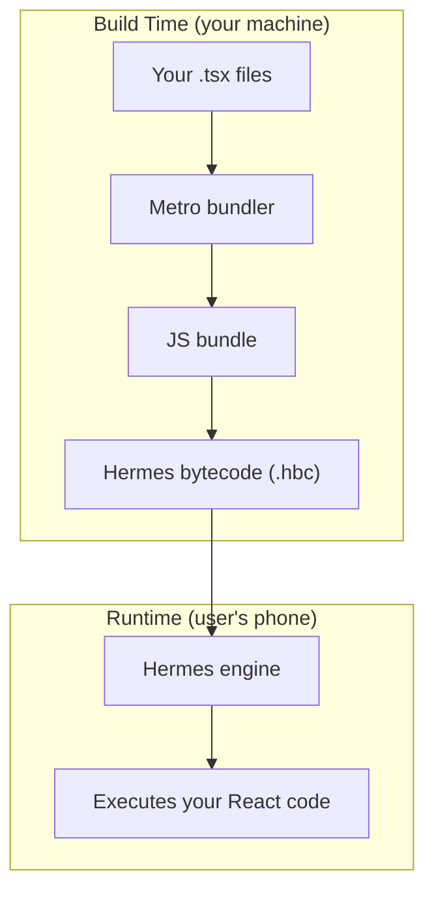

| | Browser (V8/JSC) | Hermes (mobile) |
|---|---|---|
| When is JS compiled? | On the device, every launch | Ahead of time, on your build machine |
| Ships to device as | Source text | Compact bytecode |
| Optimized for | Peak throughput on long sessions | Fast startup, low memory |
| Startup cost | Parse + compile at launch | Almost none — bytecode is ready |

You do not interact with Hermes directly. You write normal TypeScript, and the build toolchain handles the rest. But you should know it is there, because it explains why certain things work differently than in a browser:

- Hermes does not support every bleeding-edge JavaScript feature. It covers ES2020+ well, but if you use a very new proposal you may hit a syntax error that would not happen in Chrome.
- Debugging connects to Hermes via the Chrome DevTools protocol. When you open the debugger, you are talking to Hermes, not to a browser.
- Performance profiling tools (React DevTools, the built-in Hermes profiler) are Hermes-aware and can show you bytecode-level information.

> **Pro tip:** You can confirm Hermes is active at runtime by checking the global `HermesInternal` object — `const isHermes = !!(global as any).HermesInternal;`. If it is truthy, you are running on Hermes.

> **Note:** You can still opt out of Hermes and use JavaScriptCore if you have a specific reason, but there is almost never a good reason to do so in a new project. Hermes is the recommended default.

### Metro: the bundler

On the web you use Vite or Webpack to bundle your code. In React Native the bundler is **Metro**. It watches your files, resolves imports, transforms TypeScript/JSX, and serves the bundle to the running app over a local HTTP server during development. In production it produces a single optimized bundle that gets embedded in the binary.

Why does React Native need its *own* bundler instead of reusing Webpack or Vite? Because the output target is different. A web bundler produces files a browser downloads over HTTP and code-splits across many requests. Metro produces one bundle tailored for a JS engine on a phone, with platform-specific resolution baked in: when you import `./Button`, Metro can transparently pick `Button.ios.tsx` or `Button.android.tsx` based on the build target. Web bundlers have no concept of that.

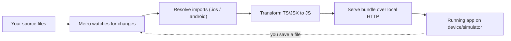

Metro is simpler than Webpack (no loaders, no complex config) but also less flexible. You configure it through `metro.config.js`, and for most projects you never touch it.

```bash
# Metro starts automatically when you run:
npx react-native start

# Or if using Expo:
npx expo start

# Press 'r' in the terminal to reload, 'i' to open iOS, 'a' to open Android
```

| Concern | Web (Webpack/Vite) | React Native (Metro) |
|---|---|---|
| Output | Browser-ready assets, code-split | One bundle for a JS engine |
| Platform-specific files | Not a built-in concept | `.ios.tsx` / `.android.tsx` auto-resolution |
| Dev delivery | HMR over dev server | Fast Refresh over local HTTP |
| Config surface | Large (loaders, plugins) | Small (`metro.config.js`, rarely touched) |

> **Gotcha:** If Metro starts behaving strangely after installing a package or switching branches (stale modules, "unable to resolve module" errors), the fix is almost always to clear its cache: `npx react-native start --reset-cache` (or `npx expo start -c`). This is the React Native equivalent of "turn it off and on again."

### Native primitives, not HTML elements

Here is the mapping that matters most when coming from the web:

| Web (React DOM)       | React Native            | Native result (iOS)        | Native result (Android)         |
|-----------------------|-------------------------|----------------------------|---------------------------------|
| `<div>`               | `<View>`                | `UIView`                   | `android.view.View`             |
| `<span>`, `<p>`, `<h1>` | `<Text>`             | `UILabel`                  | `TextView`                      |
| ``               | `<Image>`               | `UIImageView`              | `ImageView`                     |
| `<input>`             | `<TextInput>`           | `UITextField`              | `EditText`                      |
| `<button>`            | `<Pressable>` / `<TouchableOpacity>` | `UIView` with gesture recognizer | `View` with touch handler |
| `<div style="overflow:scroll">` | `<ScrollView>` | `UIScrollView`            | `ScrollView`                    |
| `<ul>` with virtualization | `<FlatList>`       | `UICollectionView`         | `RecyclerView`                  |

A quick example to feel the difference:

```tsx
// Web React
const WebCard = () => (
  <div className="card">
    <h2>Hello</h2>
    <p>This is a paragraph.</p>
    
    <button onClick={() => alert('clicked')}>Press me</button>
  </div>
);

// React Native
import { View, Text, Image, Pressable, Alert, StyleSheet } from 'react-native';

const NativeCard = () => (
  <View style={styles.card}>
    <Text style={styles.title}>Hello</Text>
    <Text>This is a paragraph.</Text>
    <Image source={{ uri: 'https://example.com/photo.jpg' }} style={styles.image} />
    <Pressable onPress={() => Alert.alert('clicked')}>
      <Text>Press me</Text>
    </Pressable>
  </View>
);

const styles = StyleSheet.create({
  card: { padding: 16, backgroundColor: '#fff', borderRadius: 8 },
  title: { fontSize: 24, fontWeight: 'bold' },
  image: { width: 200, height: 200 },
});
```

Notice the differences, and *why* each one exists:

- **There is no `className` and no CSS file.** Native views have no stylesheet engine, so styles are plain JavaScript objects passed via the `style` prop. `StyleSheet.create` is just an optimization wrapper around those objects (more on that in the styling chapter).
- **There is no `<div>` or `<span>`.** Those are HTML concepts. Native UIs are built from `View` (a generic container) and `Text` (a text-drawing primitive).
- **Every piece of text must be inside a `<Text>` component.** A bare string outside `<Text>` — like `<View>Hello</View>` — throws an error. On the web a `<div>` can hold raw text because the browser knows how to render text nodes anywhere. Native `UIView`/`View` cannot draw text; only a `UILabel`/`TextView` (i.e. `<Text>`) can. So the rule is a direct consequence of the native primitives.
- **`<Image>` needs an explicit width and height.** A remote image has no intrinsic size until it downloads, and native layout will not "reflow" around it the way a browser does, so you size it up front.

> **Common mistake:** `Text strings must be rendered within a <Text> component.` is one of the first errors every React Native beginner hits. If you see it, look for a stray string, a `{' '}` space, or a `{condition && 'some text'}` sitting directly inside a `<View>`. Wrap it in `<Text>`.

These are not cosmetic differences; they are fundamental constraints of the native rendering model.

---

## 2. Mental Model Shift from Web

This is the most important section in the chapter. The architecture is interesting trivia, but *these* shifts are what will trip you up on day one. Each subsection is a web instinct that quietly breaks on mobile, and the native replacement for it.

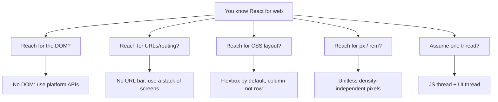

### There is no DOM

This sounds obvious once stated, but the consequences run deep. On the web, everything is a node in the Document Object Model. You can `document.querySelector` anything, inspect computed styles, measure bounding rects, manipulate the tree imperatively. In React Native, none of that exists. There is no `document`, no `window`, no `navigator.userAgent`, no `localStorage`.

The reason is simple: those globals are *browser* APIs, provided by the browser. React Native does not run inside a browser, so they were never there to begin with. Your JavaScript runs in a bare engine (Hermes) with only the standard language built-ins plus whatever React Native injects.

If you have ever written:

```tsx
// This will crash in React Native
const width = window.innerWidth;
localStorage.setItem('token', value);
document.title = 'My App';
```

...you need to replace those with platform APIs:

```tsx
import { Dimensions } from 'react-native';
import AsyncStorage from '@react-native-async-storage/async-storage';

// Screen dimensions
const { width } = Dimensions.get('window');

// Persistent storage (async, not sync like localStorage)
await AsyncStorage.setItem('token', value);

// There is no document.title — mobile apps do not have a title bar controlled by you
```

Here is a cheat sheet of the most common web globals and their React Native replacements:

| Web API | What it does | React Native replacement |
|---|---|---|
| `window.innerWidth/Height` | Viewport size | `Dimensions.get('window')` or `useWindowDimensions()` |
| `localStorage` (sync) | Persistent key-value store | `AsyncStorage` (async) or `react-native-mmkv` (sync, fast) |
| `fetch` | Network requests | `fetch` — this one *does* exist (RN provides it) |
| `document.querySelector` | Find/measure DOM nodes | `ref` + `measure()` on the component |
| `navigator.geolocation` | Location | `expo-location` or `@react-native-community/geolocation` |
| `document.cookie` | Cookies | Handled by the native networking layer; or a cookie library |
| `alert()` | Dialog | `Alert.alert()` from `react-native` |

> **Gotcha:** `localStorage` is *synchronous* — you read a value and get it immediately. `AsyncStorage` is *asynchronous* — every read and write returns a Promise. Code that assumed instant reads (`const t = localStorage.getItem('token')`) must become `const t = await AsyncStorage.getItem('token')`. Forgetting the `await` is a classic bug that returns a Promise object where you expected a string.

This also means that any npm package that touches the DOM will not work. Libraries like `react-helmet`, `react-modal` (the web one), or anything that calls `document.createElement` are web-only. Always check that a library supports React Native before installing it — look for "React Native" in its README, or a `react-native` entry in its `package.json`.

### There is no URL bar

On the web, navigation is fundamentally about URLs. The user types a URL, clicks a link, hits the back button — all of it is URL-driven. React Router maps URL paths to components, and the browser maintains the history stack for you.

On mobile, there is no URL bar. Navigation is a **stack of screens** — you push a new screen on top, and the back button (or swipe gesture) pops it off. This is closer to a stack data structure (last in, first out) than to URL routing. The screen you are looking at is always the one on top of the stack.

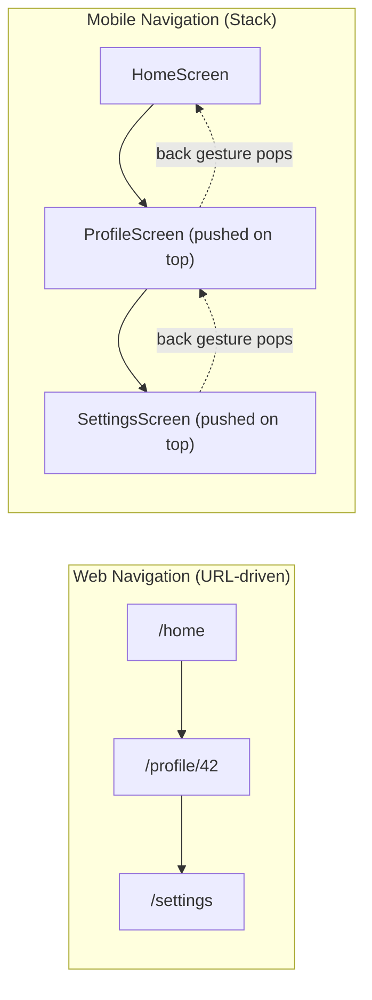

The standard navigation library is **React Navigation** (not React Router). It gives you stack navigators, tab navigators, and drawer navigators that behave like native iOS and Android navigation patterns — including the platform-correct transitions and the iOS swipe-from-edge-to-go-back gesture, which you get for free.

```tsx
import { NavigationContainer } from '@react-navigation/native';
import { createNativeStackNavigator } from '@react-navigation/native-stack';

const Stack = createNativeStackNavigator();

const App = () => (
  <NavigationContainer>
    <Stack.Navigator>
      <Stack.Screen name="Home" component={HomeScreen} />
      <Stack.Screen name="Profile" component={ProfileScreen} />
    </Stack.Navigator>
  </NavigationContainer>
);

// Inside a screen, you move around imperatively instead of changing a URL:
const HomeScreen = ({ navigation }) => (
  <Pressable onPress={() => navigation.navigate('Profile', { userId: 42 })}>
    <Text>Go to profile</Text>
  </Pressable>
);
```

Here is how the core navigation concepts map across the divide:

| Web (React Router) | Mobile (React Navigation) | Note |
|---|---|---|
| `<Link to="/profile/42">` | `navigation.navigate('Profile', { userId: 42 })` | Params are passed as objects, not URL segments |
| `useParams()` | `route.params` | |
| Browser back button | OS back button / swipe gesture | Handled natively by the stack |
| `useNavigate()` | `useNavigation()` | |
| URL is the source of truth | The navigation state tree is the source of truth | |

> **Note:** Expo Router is a newer file-based routing solution that brings URL-like routing to React Native — you create a file in an `app/` folder and it becomes a screen, just like Next.js. It is built on top of React Navigation and is excellent for deep linking and universal links. But understand the stack model first — it is what happens underneath, no matter which API you use.

### Flexbox is the default (but flipped)

On the web, the default layout is `display: block` with `flex-direction: row` when you opt into flexbox. In React Native, **every `<View>` is a flex container by default**, and the default `flexDirection` is `column`, not `row`.

Why `column`? Because phones are tall and narrow, and the overwhelmingly common layout is a vertical stack of content scrolling down the screen. Defaulting to `column` matches the grain of mobile UI, so most layouts need no `flexDirection` at all.

This means your mental model needs to flip:

```tsx
// Web: items go left-to-right by default in a flex container
// <div style={{ display: 'flex' }}> -> row (horizontal)

// React Native: items go top-to-bottom by default
// <View> -> column (vertical) — no need to write display:'flex', it is always on
```

A concrete example:

```tsx
import { View, Text, StyleSheet } from 'react-native';

const FlexExample = () => (
  <View style={styles.container}>
    <Text>First</Text>
    <Text>Second</Text>
    <Text>Third</Text>
  </View>
);

const styles = StyleSheet.create({
  container: {
    flex: 1,
    // These items stack vertically by default (flexDirection: 'column')
    // To make them horizontal, you would add: flexDirection: 'row'
    justifyContent: 'center', // centers along the MAIN axis (vertical here)
    alignItems: 'center',     // centers along the CROSS axis (horizontal here)
  },
});
```

The single most important thing to internalize about Flexbox is the **main axis vs cross axis**, because `justifyContent` and `alignItems` swap meaning depending on `flexDirection`:

| flexDirection | Main axis | `justifyContent` controls | `alignItems` controls |
|---|---|---|---|
| `column` (default) | Vertical | Vertical position | Horizontal position |
| `row` | Horizontal | Horizontal position | Vertical position |

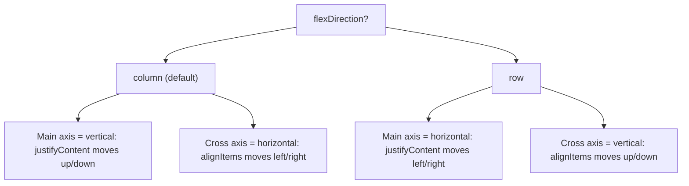

The full layout system is a subset of CSS Flexbox. Properties like `justifyContent`, `alignItems`, `flex`, `flexWrap`, and `gap` all work as you expect — just remember the default direction is flipped.

> **Gotcha:** Coming from the web, people reach for `flexDirection: 'row'` and then wonder why `alignItems: 'center'` no longer centers things horizontally. It is not broken — the axes flipped. When in doubt, say out loud which direction is the main axis, and the two properties will sort themselves out.

### Unitless values (density-independent pixels)

On the web, you specify `fontSize: '16px'` or `margin: '1rem'`. In React Native, all layout values are **unitless numbers** that represent **density-independent pixels (dp)**.

```tsx
const styles = StyleSheet.create({
  box: {
    width: 100,      // 100dp, not 100px
    height: 100,     // 100dp
    margin: 16,      // 16dp
    fontSize: 14,    // 14dp
    borderRadius: 8, // 8dp
  },
});
```

A density-independent pixel is roughly the same *physical* size across devices. Here is the mechanism: phones have wildly different pixel densities. An older phone might pack 160 physical pixels into an inch; a modern flagship packs 460+. If you sized things in raw physical pixels, a 100px button would look fine on the old phone and microscopic on the new one. So React Native measures in `dp` and multiplies by the device's **pixel ratio** at render time. On a 3x-density phone, `width: 100` becomes 300 physical pixels — but it occupies the same fraction of the screen, so it *looks* the same size to the user.

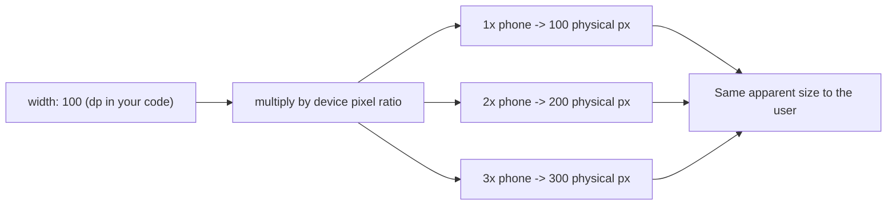

You never write `px`, `em`, `rem`, `vh`, or `%` (with a few exceptions like `width: '50%'`, which is supported as a string). You can read the device's ratio with `PixelRatio.get()` if you ever need the physical-pixel math, but you rarely will.

> **Gotcha:** There is no `calc()`, no `clamp()`, and no media queries. For responsive layouts you either use `flex` proportions (let the layout engine divide space), percentages, the `Dimensions` API, or — best for components that should react to rotation — the `useWindowDimensions` hook, which re-renders your component when the screen size changes:

```tsx
import { useWindowDimensions } from 'react-native';

const Responsive = () => {
  const { width } = useWindowDimensions(); // updates on rotation/resize
  const isTablet = width >= 768;
  return <View style={{ flexDirection: isTablet ? 'row' : 'column' }} />;
};
```

### Two threads, not one

On the web, JavaScript and rendering both happen on the main thread (with Web Workers as an opt-in escape hatch). In React Native, there are (at minimum) two threads that matter:

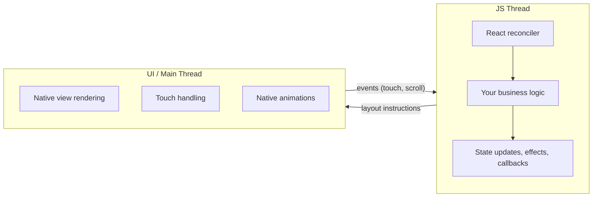

The **JS thread** runs your JavaScript code: component rendering, state updates, API calls, business logic. The **UI thread** (also called the main thread) is where native views are drawn on screen and where touch events originate.

Why split them? Because the screen must refresh smoothly at 60 (or 120) frames per second regardless of what your JavaScript is doing. If drawing and your business logic shared one thread — as they do in a browser — a slow function would freeze the visuals. By giving the UI its own thread, the phone can keep scrolling and animating even while the JS thread is briefly busy.

These two threads communicate asynchronously. When your component re-renders and produces new layout instructions, those instructions are handed to the UI thread, which updates the native views. When the user taps a button, the UI thread sends the touch event to the JS thread, which runs your `onPress` handler.

This separation is mostly invisible to you, but it explains a few things that otherwise seem like magic or like bugs:

- **Animations that run on the JS thread can stutter.** If your JS thread is busy (running a big computation, re-rendering a large list), animations driven by JavaScript will drop frames. This is why React Native's `Animated` API with `useNativeDriver: true` pushes the animation to the UI thread, keeping it smooth even when JS is busy.
- **Heavy computations block your UI indirectly.** A synchronous `JSON.parse` of a 5 MB payload on the JS thread will freeze your app's responsiveness, because touch events queue up waiting for the JS thread to be free again.
- **`console.log` in production costs more than you think.** Each log statement serializes data to be sent to the debugger. Strip them before shipping.

```tsx
import { Animated } from 'react-native';

// Good: animation runs on the UI thread, smooth even if JS is busy
Animated.timing(opacity, {
  toValue: 1,
  duration: 300,
  useNativeDriver: true, // this is the critical flag
}).start();

// Bad: animation runs on the JS thread (will stutter under load)
Animated.timing(opacity, {
  toValue: 1,
  duration: 300,
  useNativeDriver: false,
}).start();
```

> **Gotcha:** `useNativeDriver: true` only supports a subset of animatable properties — `opacity` and `transform` (translate, scale, rotate) are safe. You *cannot* use it for `backgroundColor`, `width`, `height`, or other layout properties, because those require the layout engine to recompute on the UI thread. For those, reach for **`react-native-reanimated`**, a more powerful animation library that runs your animation logic entirely on the UI thread — including layout and color animations — by compiling small "worklets" that execute natively.

---

## 3. Architecture Overview

This section is the "movie" promised at the start: how your code travels from a `.tsx` file to native pixels, and how that journey changed between the old and new versions of React Native. You will not need most of these internals day to day, but knowing them turns confusing error messages and old blog posts into things you can reason about.

### The old architecture: the Bridge

Before React Native 0.68, all communication between JavaScript and native code went through a single abstraction called **the Bridge**. Understanding it helps you read older blog posts, debug legacy apps, and appreciate why the new architecture exists.

The Bridge works like this:

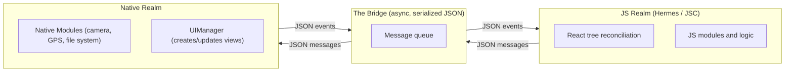

Every interaction — creating a view, updating a style, reading the GPS coordinates, handling a touch — is a JSON message passed through this queue. The Bridge is:

1. **Asynchronous.** Messages are batched and sent in chunks. This means you cannot call a native function and get a synchronous return value.
2. **Serialized.** Every message is converted to JSON text and parsed on the other side. Passing a large array means serializing it, copying it across the bridge, and deserializing it.
3. **A single bottleneck.** All native module calls and all UI updates share the same queue. A burst of rapid UI updates can delay a camera access call sitting behind them.

The clearest way to picture the cost: imagine two people in separate rooms who can only communicate by writing notes, sliding them under a door, and waiting for a reply. Even simple questions take a round trip, and a flood of notes (say, during a fast scroll) clogs the gap under the door.

This worked well enough for many apps, but it introduced measurable overhead:

- **Startup penalty.** All native modules had to be initialized at launch, even ones the user might never use.
- **Serialization cost.** Frequent, small messages (like those fired on every frame of a scroll) meant constant JSON encoding and decoding.
- **No synchronous calls.** Some APIs (like getting the screen dimensions) are inherently synchronous, but the Bridge forced them to be async or required hacky workarounds.

### The new architecture: JSI, Fabric, and TurboModules

Starting with React Native 0.68 and stabilized in 0.73+, the **New Architecture** replaces the Bridge with three interconnected pieces, all built on a common foundation:

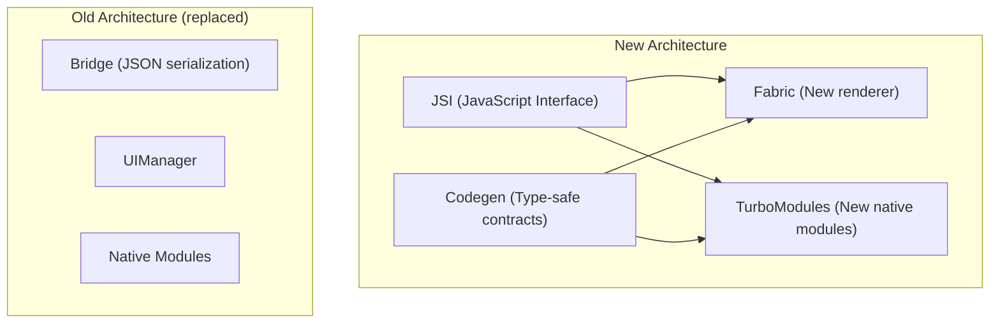

**JSI (JavaScript Interface)** is the foundation. Instead of serializing messages to JSON and passing them through a queue, JSI lets JavaScript hold **direct references to C++ host objects**. Your JS code can call a native function as if it were a regular JavaScript function — no serialization, no async queue, no Bridge.

Going back to the analogy: the old Bridge was two people passing notes under a door. JSI knocks down the wall so they can talk face to face — instantly, and without translating everything into written notes (JSON) first.

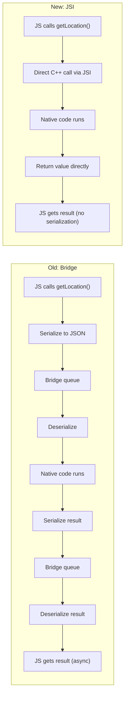

**Fabric** is the new rendering system that replaces the old `UIManager`. With the Bridge, creating and updating native views required sending JSON messages across the bridge. With Fabric:

- The **shadow tree** (React Native's internal layout tree, analogous to the browser's render tree) can be created and updated synchronously from JavaScript via JSI.
- Layout is computed using **Yoga** (a cross-platform Flexbox engine written in C++) and the results are shared between JS and native code without serialization.
- **Concurrent rendering** is supported — Fabric works with React 18's concurrent features, allowing interruptible rendering, transitions, and `Suspense`.

**TurboModules** replace the old Native Modules system. The key improvements:

- **Lazy loading.** A TurboModule is only initialized when your code first imports it, not at app startup. If your app has 50 native modules but a given user flow only touches 5, only those 5 get loaded — directly shrinking startup time.
- **Synchronous access.** Because TurboModules are bound via JSI, you can make synchronous calls when the API makes sense (reading a value from storage, getting device info) instead of forcing everything to be a Promise.
- **Type safety via Codegen.** You define the module's interface in a TypeScript or Flow spec file, and React Native's Codegen generates the native boilerplate (Objective-C++ on iOS, Java/Kotlin on Android) and the JSI bindings automatically. This eliminates an entire class of runtime errors where JS and native disagreed on argument types.

```tsx
// A TurboModule spec (simplified)
// This TypeScript interface generates native code via Codegen
import type { TurboModule } from 'react-native';
import { TurboModuleRegistry } from 'react-native';

export interface Spec extends TurboModule {
  getDeviceName(): string;            // synchronous — returns immediately
  getBatteryLevel(): Promise<number>; // async when it makes sense
}

export default TurboModuleRegistry.getEnforcing<Spec>('DeviceInfo');
```

Here is a side-by-side of the two architectures, so the names stop blurring:

| Concern | Old (Bridge) | New (JSI / Fabric / TurboModules) |
|---|---|---|
| JS ↔ native communication | JSON serialized over a queue | Direct C++ references via JSI |
| Sync calls possible? | No, everything async | Yes, when the API makes sense |
| Native module loading | All at startup | Lazy, on first import |
| Renderer | UIManager | Fabric (concurrent-ready) |
| Type safety JS ↔ native | None (runtime mismatches) | Compile-time via Codegen |
| React 18 concurrent features | Limited | Supported |

### What this means for you in practice

If you are starting a new React Native project today (especially with a recent Expo SDK or bare React Native 0.76+), you are on the New Architecture by default. Here is what that changes in your day-to-day work:

1. **Faster startup.** TurboModules' lazy loading means your app loads only what it needs.
2. **Smoother interactions.** Fabric's synchronous layout means fewer dropped frames during complex UI updates.
3. **Better library compatibility.** The ecosystem has largely migrated. Libraries like `react-native-reanimated`, `react-native-gesture-handler`, and `react-native-screens` already support it. Still, check a library's compatibility before adopting it — a few older libraries lag behind.
4. **Type-safe native modules.** If you ever write your own native module (to access a device sensor, for example), Codegen catches type mismatches at build time instead of crashing at runtime.

> **Gotcha:** Some older tutorials and Stack Overflow answers reference `NativeModules` from `react-native` — that is the old Bridge-based API. It still works (there is a compatibility layer called the "interop layer"), but for new code use TurboModules. If you are using the Expo managed workflow, you rarely write native modules yourself — Expo's module system handles the abstraction for you.

> **Pro tip:** You do not have to understand JSI to *use* the New Architecture — it is on by default and invisible. The reason to learn the vocabulary is debugging: when a library's README says "New Architecture support landed in v3" or an error mentions "Fabric" or "TurboModule," you will know exactly which layer it is talking about.

### Putting it all together: the full picture

Here is the complete runtime picture of a React Native app on the New Architecture — the full movie, start to finish:

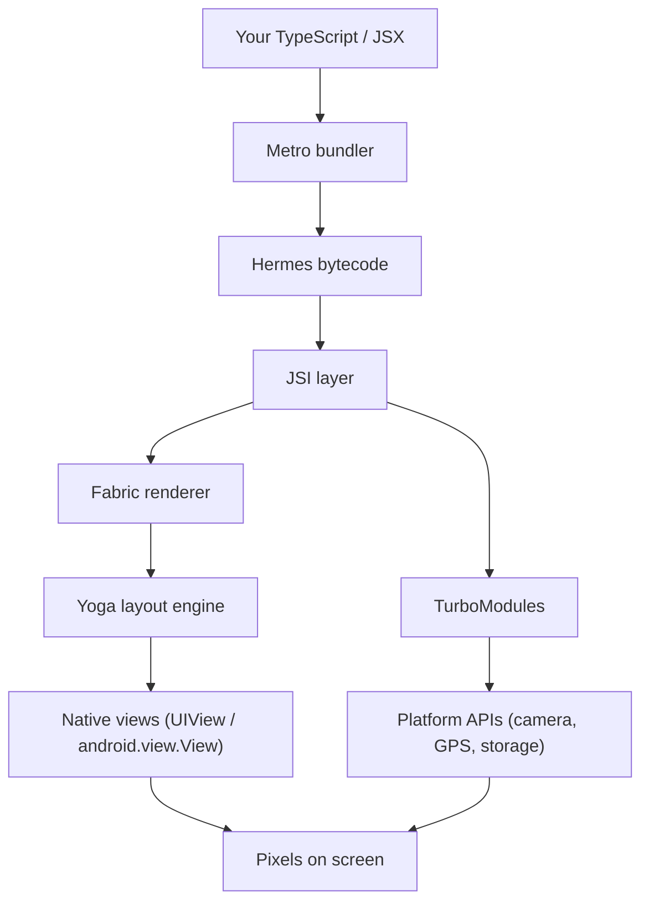

Read it as a story: you write React components in TypeScript. **Metro** bundles them. **Hermes** turns them into bytecode and executes it. When your components render, React's reconciler produces a tree of native view descriptions. **Fabric**, via **JSI**, creates and updates the actual native views on the UI thread. **Yoga** computes the Flexbox layout (the same Flexbox you wrote in section 2). **TurboModules**, also via JSI, give your JS code access to platform capabilities like the camera, file system, or sensors — lazily, type-safely, and without the serialization overhead of the old Bridge.

That is the full stack from your `.tsx` file to the pixels on the user's screen. If you can narrate that paragraph in your own words, you understand what React Native *is* — and every later chapter is just filling in the details of one of these boxes.

---