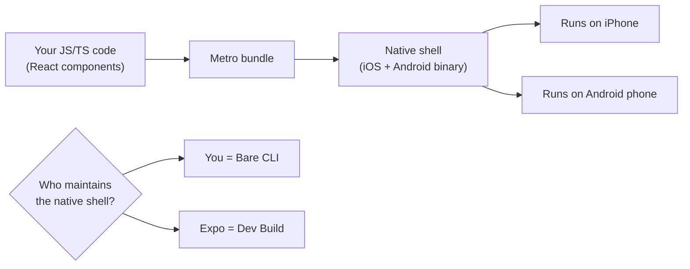
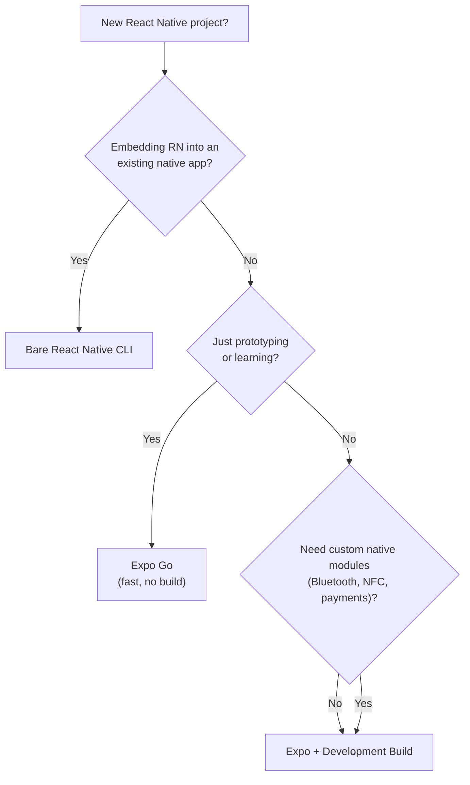
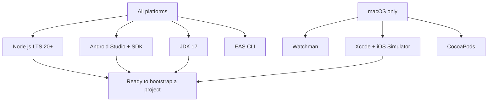
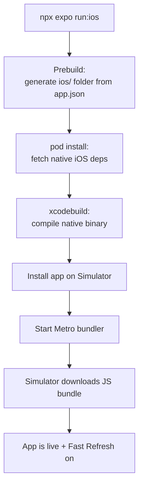
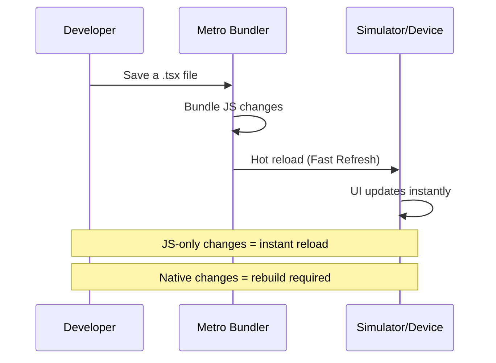
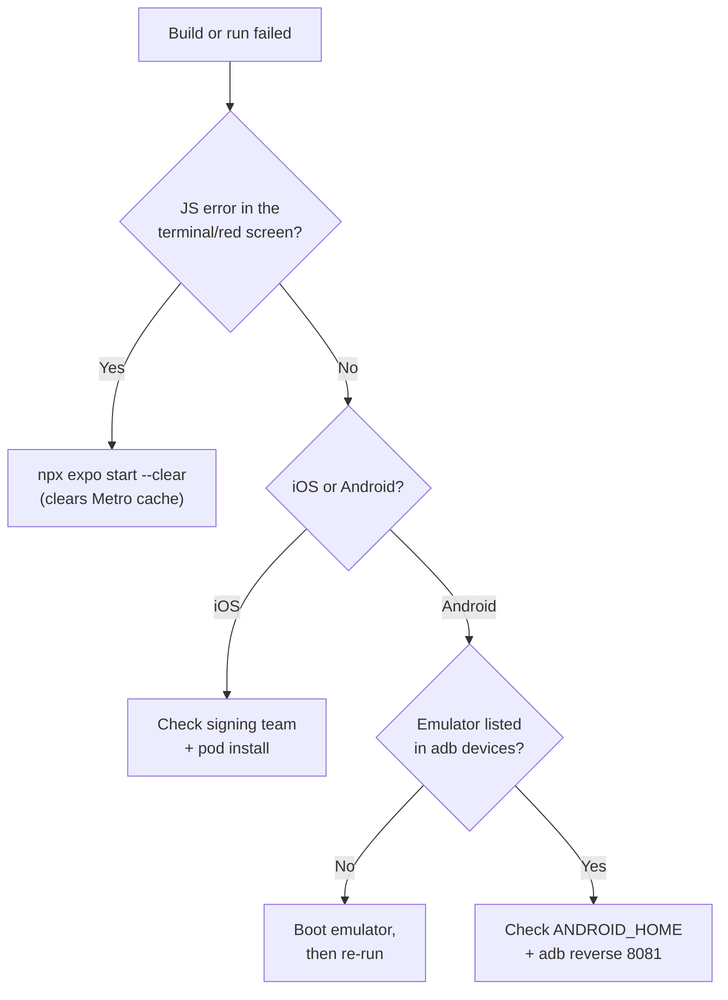

# Environment Setup: From Zero to Running App

> Setting up Expo, simulators, and your first running React Native project in under 10 minutes.

---

## Table of Contents

1. [Expo vs Bare React Native CLI](#1-expo-vs-bare-react-native-cli)
2. [Required Installs](#2-required-installs)
3. [Project Bootstrap](#3-project-bootstrap)

---

## 1. Expo vs Bare React Native CLI

### The first decision nobody explains properly

When you start a web React project, the answer is simple: run `npm create vite@latest` and move on with your life. React Native is not that clean. You are immediately faced with a fork in the road: **Expo** or the **bare React Native CLI**. Pick wrong and you will either eject mid-project or fight tooling you never needed. So let's settle this now.

The React Native CLI (sometimes called "bare" or "vanilla" RN) gives you a raw Xcode project and a raw Android Gradle project sitting right in your repo. You have total control — and total responsibility. You configure Xcode signing, Gradle build variants, CocoaPods, native module linking, and ProGuard rules yourself. This is the equivalent of ejecting from Create React App back in 2018 and wiring Webpack by hand.

**Expo** sits on top of React Native and manages the native projects for you. It started as a closed sandbox (the old "Managed Workflow") but has evolved dramatically. The modern approach — **Expo with Development Builds** — gives you a custom native binary that includes any native modules you actually need, built in the cloud or locally, while Expo handles the build pipeline, OTA updates, and configuration through a single `app.json` file.

### What "managing the native projects" actually means

Here is the mental model. A React Native app is really *two* programs glued together:

1. A **native shell** — an actual iOS app (Swift/Objective-C, compiled by Xcode) and an actual Android app (Kotlin/Java, compiled by Gradle). This shell knows how to launch, draw a window, and talk to the camera, GPS, and filesystem.
2. A **JavaScript bundle** — your React components, business logic, and styles, executed inside that shell by a JS engine (Hermes).

The native shell rarely changes. The JavaScript changes every time you save a file. The whole "Expo vs bare" debate boils down to a single question: **who owns and maintains that native shell — you, or a tool?**



> **Why this matters:** On the web, the "shell" is the browser, and you never maintain it — Chrome ships, you just write JS. Bare React Native makes *you* the browser vendor: you own the shell's source and have to keep it building. Expo gives that job back to a tool, which is closer to the web experience you already know.

### The comparison you actually need

| Criteria | Expo + Dev Build | Bare React Native CLI |
|---|---|---|
| **Setup time** | ~5 minutes | 30-60 minutes |
| **Native code access** | Full (via config plugins + dev client) | Full (you own the Xcode/Android projects) |
| **OTA updates** | Built-in with `expo-updates` | Manual setup with CodePush or custom |
| **Build pipeline** | EAS Build (cloud) or local | Xcode + Gradle locally |
| **Upgrade path** | `npx expo install` handles compatibility | Manual, error-prone `react-native upgrade` |
| **Who owns ios/ & android/** | Expo regenerates them on demand | You commit and maintain them by hand |
| **Best for** | 95% of new projects | Brownfield apps, deeply custom native code |

### A third option you'll hear about: Expo Go

Before Development Builds, there was **Expo Go** — a pre-built app you download from the App Store / Play Store that can run *any* Expo JavaScript without compiling a native binary. It feels magical for the first hour, then hits a wall: it ships a *fixed* set of native modules. The moment you need a library Expo Go didn't bundle (Bluetooth, in-app purchases, a custom SDK), it simply cannot load your app.

| Approach | Native binary you compile? | Can add ANY native module? | Good for |
|---|---|---|---|
| **Expo Go** | No — use the prebuilt app | No — only bundled modules | Quick prototypes, learning, demos |
| **Expo Dev Build** | Yes — your own custom client | Yes — any module + config plugins | Real apps (recommended) |
| **Bare CLI** | Yes — raw Xcode/Gradle | Yes — but you wire it manually | Brownfield, native teams |

> **Common mistake:** Beginners build their whole app in Expo Go, then discover halfway through that the payments library they need won't load. Switching to a Dev Build later is easy, but it's less surprising to start there. Use Expo Go for *learning*; use a Dev Build for anything you intend to ship.

### The recommendation

Use **Expo with Development Builds**. This is not the old "Expo Go" sandbox that could not use custom native modules. The modern Expo stack gives you everything the bare CLI does, minus the maintenance burden of raw Xcode and Gradle projects. You can still write native Objective-C, Swift, Java, or Kotlin when you need to — Expo's config plugin system and `expo-modules-core` make that seamless.

The only situation where the bare CLI makes sense today is if you are integrating React Native into an **existing native app** (a "brownfield" scenario) or if your company has a native build team that insists on owning the Xcode project directly.



> **Note:** If you are coming from web React and used `create-react-app` or Vite, think of Expo as the Vite of React Native — it handles the complex build tooling so you can focus on writing components. The bare CLI is like configuring Webpack, Babel, and PostCSS from scratch.

---

## 2. Required Installs

### The dependency stack is larger than you expect

On the web, you need Node.js and a browser. That is it. React Native compiles to actual native code, so you need the full native toolchain for every platform you want to target. This is the most painful part of getting started — but you only do it once.

The reason the list is long: each target platform has its *own* compiler, *own* package manager, and *own* virtual device. iOS builds only run on macOS (Apple's rule, not React Native's), so the toolchain naturally splits into "everyone" and "macOS-only" buckets.



Here is every tool you need, in order of installation.

### Node.js (LTS 20+)

You already have this if you do web React work. Verify:

```bash
node --version
# Should print v20.x.x or higher
```

If not, install from [nodejs.org](https://nodejs.org) or use a version manager like `nvm` (macOS/Linux) or `nvm-windows`. Expo SDK 52+ requires Node 18 at minimum, but you should be on LTS 20 or 22.

> **Pro tip:** Use a version manager rather than the system installer. Different projects pin different Node versions, and `nvm use 20` beats reinstalling Node by hand. On macOS/Linux a `.nvmrc` file in the repo lets you type just `nvm use`.

### Watchman (macOS only)

Watchman is a file-watching service from Meta that makes the Metro bundler (React Native's equivalent of Vite/Webpack) dramatically faster on macOS. Without it, hot reloads on large projects can lag.

```bash
brew install watchman
```

On Windows and Linux, Metro uses its own file watcher. You do not need Watchman there.

> **Why it exists:** macOS's native file-change API is slow when thousands of files are watched at once (and `node_modules` is exactly that). Watchman keeps an in-memory index so Metro hears about your save in milliseconds instead of polling the disk. Think of it as the difference between someone *telling* you a file changed versus you re-checking every file repeatedly.

### Xcode and iOS Simulator (macOS only)

You **cannot** build iOS apps on Windows or Linux. Period. If you do not have a Mac, skip iOS for now and work with Android only — or use EAS Build in the cloud and test on a physical iPhone.

1. Install Xcode from the Mac App Store (it is ~12 GB, start the download now).
2. Open Xcode at least once and accept the license agreement.
3. Install the Xcode Command Line Tools:

```bash
xcode-select --install
```

4. Install CocoaPods (iOS dependency manager):

```bash
sudo gem install cocoapods
```

> **What CocoaPods is:** It is the `npm` of the iOS world. iOS native libraries are distributed as "pods," and `pod install` wires them into the Xcode project. You rarely call it directly with Expo — `npx expo run:ios` runs it for you — but when an iOS build breaks, a stale Pods folder is a frequent culprit.

> **Gotcha:** If `gem install` fails with a permissions error on newer macOS versions, use `brew install cocoapods` instead. The Homebrew version avoids fighting with Apple's system Ruby.

5. Open Xcode, go to **Settings > Platforms**, and download at least one iOS Simulator runtime (iOS 17+ recommended).

> **Simulator vs emulator — the wording matters:** Apple calls its iOS device "the **Simulator**"; Google calls its Android device "the **Emulator**." They are not interchangeable terms. The iOS Simulator runs your app against a *re-implementation* of iOS frameworks on your Mac (fast, but not a real OS). The Android Emulator boots an *actual* Android OS image inside a virtual machine (slower, more faithful). Knowing which is which saves confusion when reading error messages.

### Android Studio, Android SDK, and Emulator

This is required on **all** operating systems if you want to run on Android.

1. Download and install [Android Studio](https://developer.android.com/studio).
2. During setup, make sure these components are checked:
   - Android SDK
   - Android SDK Platform-Tools
   - Android Virtual Device (AVD)
3. Open Android Studio, go to **SDK Manager** (Settings > Languages & Frameworks > Android SDK), and install:
   - **SDK Platforms tab:** Android 14 (API 34) or newer
   - **SDK Tools tab:** Android SDK Build-Tools, Android Emulator, Android SDK Platform-Tools

4. Create an emulator via **Device Manager**:

```
Device: Pixel 7 (or Pixel 8)
System Image: API 34 (x86_64 or arm64 depending on your machine)
```

> **Pro tip:** Pick the system image that matches your CPU architecture. On Apple Silicon (M1/M2/M3) Macs, choose **arm64**; on Intel Macs and most Windows PCs, choose **x86_64**. The wrong architecture runs through slow software translation and the emulator crawls.

5. Set environment variables. On macOS/Linux, add to your `~/.zshrc` or `~/.bashrc`:

```bash
export ANDROID_HOME=$HOME/Library/Android/sdk
export PATH=$PATH:$ANDROID_HOME/emulator
export PATH=$PATH:$ANDROID_HOME/platform-tools
```

On Windows, set `ANDROID_HOME` to `%LOCALAPPDATA%\Android\Sdk` in your System Environment Variables, and add the `emulator` and `platform-tools` subdirectories to your `PATH`.

> **Why these PATH entries matter:** `platform-tools` contains `adb` (the Android Debug Bridge — the tool that installs and talks to your app on a device). `emulator` contains the command to boot virtual devices from the terminal. If they're not on your `PATH`, Expo can find the SDK but you can't run `adb` yourself when debugging — and half the troubleshooting steps later in this chapter depend on `adb`.

6. Verify it works:

```bash
adb --version
# Should print Android Debug Bridge version
```

### JDK 17

React Native's Android build requires JDK 17. Android Studio bundles a JDK, but it is safer to have a standalone one:

```bash
# macOS
brew install --cask zulu@17

# Windows (via Chocolatey)
choco install zulu17

# Verify
java -version
# Should print openjdk version "17.x.x"
```

> **Why a JDK at all?** Android apps are built by Gradle, and Gradle runs on the Java Virtual Machine. The JDK (Java Development Kit) provides that runtime plus the Java compiler. You won't write Java — but the build toolchain underneath your React Native app is Java all the way down.

> **Gotcha:** JDK 21 might seem like a good idea since it is the latest LTS, but React Native's Gradle configuration targets JDK 17 specifically. Using 21 can produce cryptic build errors. Stick with 17.

### EAS CLI

EAS (Expo Application Services) is how you build and submit apps without wrestling with Xcode and Gradle directly. Install it globally:

```bash
npm install -g eas-cli
```

EAS Build compiles your app on Expo's cloud machines — which means you can produce an **iOS build without owning a Mac**, and an Android build without a beefy local machine. It is the escape hatch for the "I'm on Windows and need an iPhone build" problem.

```bash
# Typical EAS first-run flow (later chapter covers this in depth)
eas login                 # sign into your Expo account
eas build:configure       # creates eas.json with build profiles
eas build --platform ios  # compiles in the cloud, returns an installable build
```

### The complete checklist

```
┌─────────────────────────────────────────────────────────────┐
│                  Required Installs Checklist                │
├─────────────────────────────────────────────────────────────┤
│                                                             │
│  All platforms:                                             │
│  ✓ Node.js LTS 20+                                         │
│  ✓ Android Studio + Android SDK (API 34+)                   │
│  ✓ Android Emulator (Pixel 7, API 34)                       │
│  ✓ JDK 17 (Azul Zulu recommended)                           │
│  ✓ EAS CLI (npm install -g eas-cli)                         │
│                                                             │
│  macOS additional:                                          │
│  ✓ Watchman                                                 │
│  ✓ Xcode + iOS Simulator runtime                            │
│  ✓ CocoaPods                                                │
│  ✓ Xcode Command Line Tools                                 │
│                                                             │
│  Not required:                                              │
│  ✗ Expo Go app (we use Development Builds instead)          │
│  ✗ Ruby version manager (unless CocoaPods demands it)       │
│                                                             │
└─────────────────────────────────────────────────────────────┘
```

> **Pro tip:** Expo ships a one-command diagnostic that checks most of the above for you. Run `npx expo-doctor` inside a project (or `npx expo install --check`) and it flags missing tools, mismatched versions, and SDK problems before they turn into a failed build.

> **Common mistake:** Many tutorials tell you to install the `react-native-cli` package globally. **Do not do this.** It conflicts with the modern Expo workflow and is no longer recommended even for bare projects. The `npx` command handles everything you need.

---

## 3. Project Bootstrap

### From empty folder to running app

On the web, `npm create vite@latest` gives you a working dev server in about 15 seconds. React Native takes a bit longer because it has to install native dependencies and build a native binary — but Expo keeps it as painless as possible.

### Create the project

```bash
npx create-expo-app@latest my-app
cd my-app
```

This scaffolds a new Expo project with TypeScript, file-based routing (via Expo Router), and a sensible default structure. You will see something like this:

```
my-app/
├── app/                    # File-based routes (like Next.js pages/)
│   ├── (tabs)/             # Tab navigator group
│   │   ├── index.tsx       # Home tab
│   │   └── explore.tsx     # Explore tab
│   ├── _layout.tsx         # Root layout
│   └── +not-found.tsx      # 404 screen
├── assets/                 # Images, fonts
├── components/             # Shared components
├── constants/              # Theme colors, config
├── app.json                # Expo configuration
├── package.json
└── tsconfig.json
```

Notice there is no `ios/` or `android/` folder yet. Expo generates those when you create a development build. This is a feature, not a limitation — it means those folders are derived artifacts, not source code you maintain.

> **Web comparison:** `app.json` in Expo is like `vite.config.ts` on the web — it is your central config file. Except it also controls your app icon, splash screen, permissions, and native module settings. One file to rule them all.

### How a "run" command turns into a running app

Before you run anything, it helps to see what `npx expo run:ios` actually orchestrates under the hood. The same shape applies to Android — only the tools differ (Gradle instead of Xcode, APK instead of `.app`).



The slow part is **compile** — turning native source into a binary. That happens once. After that, every edit you make flows through only the bottom two steps (Metro → JS bundle), which is why subsequent reloads feel instant.

### Run on iOS Simulator (macOS only)

```bash
npx expo run:ios
```

The first run takes 3-5 minutes because it is compiling the entire native project. Subsequent runs are much faster thanks to caching. This command:

1. Generates the `ios/` directory if it does not exist
2. Installs CocoaPods dependencies
3. Compiles the native binary via `xcodebuild`
4. Installs the app on the iOS Simulator
5. Starts the Metro bundler (the JS dev server)

You should see the default tab-based app on the simulator.

> **Pro tip:** To launch into a *specific* simulator instead of the default, pass `--device`: `npx expo run:ios --device "iPhone 15 Pro"`. Without a flag, Expo picks whichever simulator booted last.

### Run on Android Emulator

Make sure your Android emulator is running first (start it from Android Studio's Device Manager), then:

```bash
npx expo run:android
```

Same deal: first build is slow, subsequent builds are fast. This generates the `android/` directory, runs `gradlew assembleDebug`, and installs the APK on the emulator.

> **Gotcha:** Unlike `run:ios`, `run:android` does *not* always boot an emulator for you. If no emulator is running and no physical device is plugged in, the build finishes but has nowhere to install the app and fails at the last step. Start the emulator first, then run the command.

Here is the same step-by-step pipeline as iOS, mapped to the Android toolchain so you can see the parallels:

| Step | iOS | Android |
|---|---|---|
| Generate native project | `prebuild` → `ios/` | `prebuild` → `android/` |
| Fetch native deps | `pod install` | Gradle resolves dependencies |
| Compile binary | `xcodebuild` | `gradlew assembleDebug` |
| Output artifact | `.app` | `.apk` |
| Install target | iOS Simulator | Android Emulator / device |
| JS dev server | Metro | Metro (shared) |

### The development loop

Once the app is running, your workflow looks like this:



**Fast Refresh** works exactly like HMR on the web — you save a file, and the component re-renders without losing state. The key difference: if you add a new **native** dependency (like a camera library that includes Objective-C or Java code), you need to rebuild the native binary with `npx expo run:ios` or `npx expo run:android`. Pure JavaScript/TypeScript changes never require a rebuild.

The rule of thumb for "do I need to rebuild?":

| You changed... | Rebuild native binary? | Why |
|---|---|---|
| A `.tsx` component or style | No — Fast Refresh | Pure JS, lives in the Metro bundle |
| App logic, hooks, navigation | No — Fast Refresh | Still JS |
| Added a JS-only npm package | No (usually) | No native code to compile |
| Added a package with native code | **Yes** | New Objective-C/Kotlin must be compiled in |
| Edited `app.json` (icon, permissions, plugins) | **Yes** | Config feeds the native project at prebuild time |
| Changed an environment variable used natively | **Yes** | Baked into the binary at build |

> **Pro tip:** A huge fraction of "why isn't my change showing up?" moments are someone editing `app.json` or installing a native module and expecting Fast Refresh to pick it up. When in doubt, stop the bundler and re-run `npx expo run:ios/android`.

### Verifying everything works

Open `app/(tabs)/index.tsx` in your editor and change some text. Save the file and watch the simulator update within a second or two. If that works, your environment is correctly set up.

Let's go one step further and make sure you can write a component. Replace the contents of `app/(tabs)/index.tsx` with:

```tsx
import { StyleSheet, Text, View } from 'react-native';

export default function HomeScreen() {
  return (
    <View style={styles.container}>
      <Text style={styles.title}>It works!</Text>
      <Text style={styles.subtitle}>
        Your React Native environment is ready.
      </Text>
    </View>
  );
}

const styles = StyleSheet.create({
  container: {
    flex: 1,
    alignItems: 'center',
    justifyContent: 'center',
    backgroundColor: '#fff',
  },
  title: {
    fontSize: 32,
    fontWeight: 'bold',
    marginBottom: 8,
  },
  subtitle: {
    fontSize: 16,
    color: '#666',
  },
});
```

Save. The simulator should show your new screen instantly.

> **Web comparison:** Notice there is no `className` or CSS file. In React Native, you use `StyleSheet.create` with JavaScript objects that look like CSS but use camelCase property names. There is no cascade, no specificity, no `!important`. Every style is scoped to its component. We will cover styling in depth in a later chapter.

Two more things in that snippet that trip up web developers:

- **`<View>` instead of `<div>`, `<Text>` instead of `<span>`/`<p>`.** React Native has no DOM. `View` maps to a native `UIView` (iOS) / `android.view.View` (Android); `Text` maps to a native text element. On the web any text can sit loose inside a `div` — in React Native, *all* text must be wrapped in `<Text>` or it throws.
- **`flex: 1` is doing real work.** React Native uses Flexbox for *all* layout (there is no `block`, `inline`, or `grid`), and crucially `flexDirection` defaults to `column`, not `row` like the web. `flex: 1` here tells the container to fill the whole screen so the content can center in it.

### Troubleshooting common setup issues

When a build fails, work top-down through this decision tree before panicking — most failures are one of a handful of known causes:



**Metro bundler port conflict:**

```bash
# If port 8081 is already in use
npx expo start --port 8082
```

**iOS build fails with "signing" error:**
Open `ios/myapp.xcworkspace` in Xcode, select the project target, and set a valid Development Team under Signing & Capabilities. You need a free or paid Apple Developer account.

> **Why signing exists:** Apple refuses to install an app on a device unless it is cryptographically signed by a known developer. The Simulator is more forgiving, but real devices and some build steps demand a valid team. A *free* Apple ID is enough to sign for local development — you only need the paid ($99/yr) account to ship to the App Store.

**Android emulator not detected:**
Make sure the emulator is fully booted before running `npx expo run:android`. You can verify ADB sees it:

```bash
adb devices
# Should list your emulator
```

**`pod install` fails on macOS:**
This usually means a Ruby or CocoaPods version mismatch. The nuclear fix:

```bash
cd ios
bundle install        # If a Gemfile exists
bundle exec pod install
cd ..
```

**Gradle build fails with "SDK location not found":**
Your `ANDROID_HOME` environment variable is not set or pointing to the wrong path. Double-check it:

```bash
echo $ANDROID_HOME
# macOS/Linux: should print something like /Users/you/Library/Android/sdk
# Windows (PowerShell): echo $env:ANDROID_HOME
```

**"Unable to load script" on Android:**
The Metro bundler might not be reachable from the emulator. Run:

```bash
adb reverse tcp:8081 tcp:8081
```

This forwards the emulator's port 8081 to your machine's port 8081.

> **Why this happens:** The emulator is effectively a separate machine on a virtual network. `localhost:8081` inside the emulator means *the emulator itself*, not your Mac/PC where Metro is running. `adb reverse` punches a tunnel so the emulator's `localhost:8081` reaches your machine's Metro server. (On a *physical* device on the same Wi-Fi, Expo solves this differently — usually via a LAN URL.)

> **Pro tip:** When things go truly sideways, the reset command is your friend:
> ```bash
> npx expo start --clear
> ```
> This clears the Metro cache and often fixes mysterious bundling errors. It is the React Native equivalent of deleting `node_modules` and reinstalling — but faster.

> **The bigger reset hammer:** If `--clear` isn't enough, the native projects themselves may be stale. Because Expo treats `ios/` and `android/` as *generated* artifacts, you can safely delete them and run `npx expo prebuild --clean` to regenerate fresh ones from `app.json`. This fixes a whole class of "it built last week and now it doesn't" problems that would be terrifying in a bare project where those folders are hand-maintained source.

---