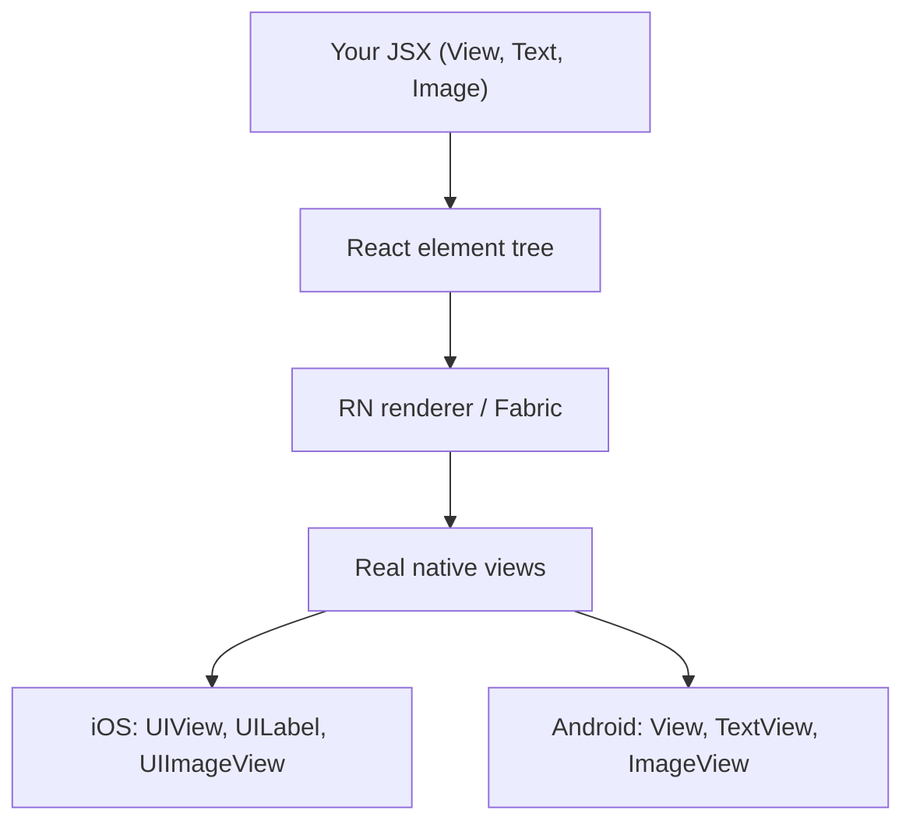
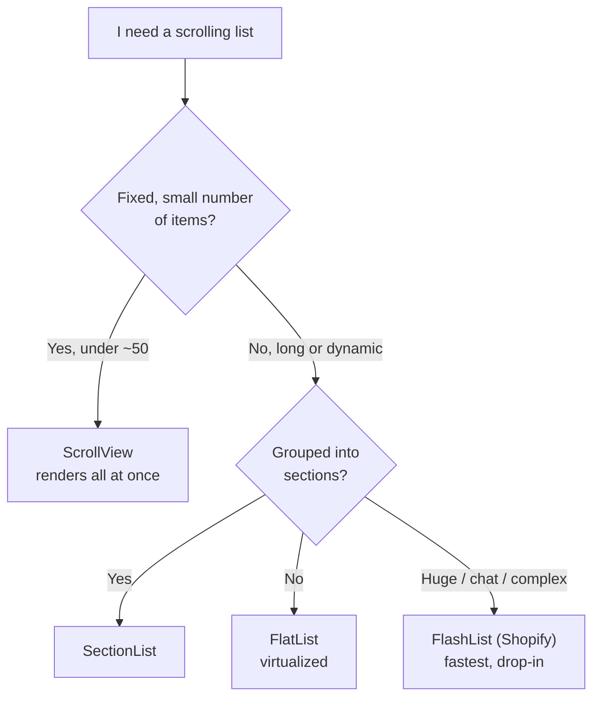
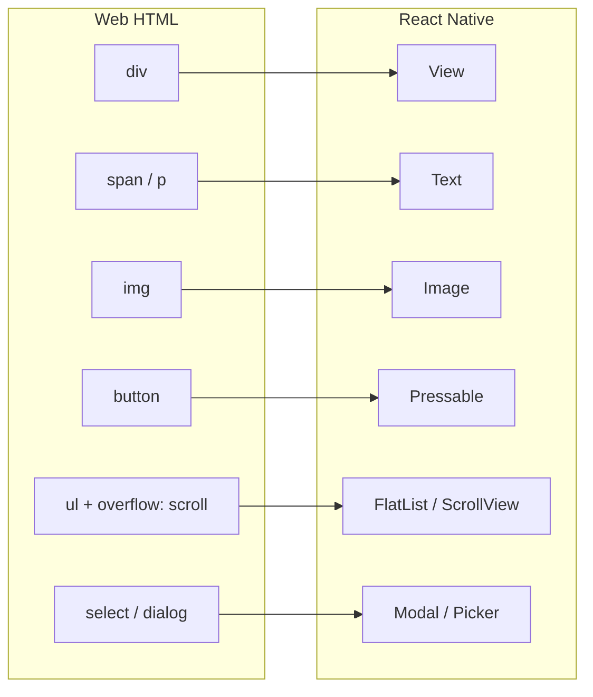
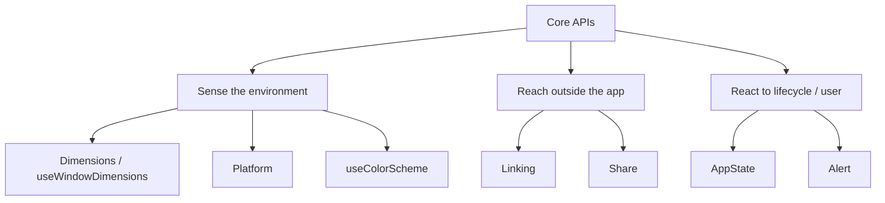
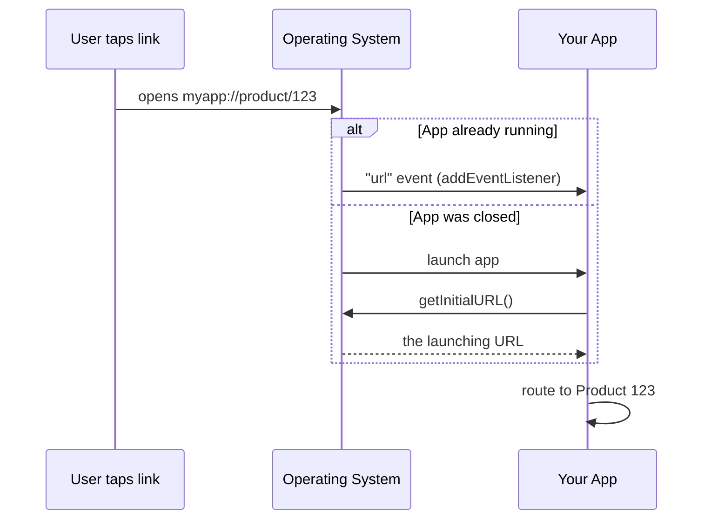
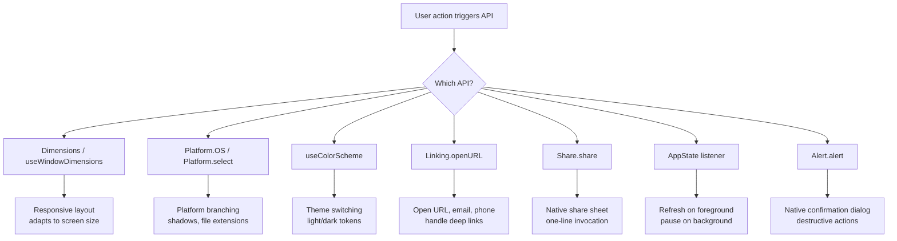

# Core Components and APIs: The Building Blocks

> The native primitives that replace HTML elements, and the platform APIs you will use every day.

---

## Table of Contents
1. [Building-Block Components](#1-building-block-components)
2. [Core APIs to Internalize](#2-core-apis-to-internalize)

---

## 1. Building-Block Components

On the web, you have `<div>`, `<span>`, ``, `<button>`, `<ul>`, and the rest of the HTML spec. In React Native, you have a smaller, more intentional set of primitives. Every pixel on your screen comes from composing these building blocks. Learn them deeply — they are your entire vocabulary.

### Why so few primitives?

On the web, the browser ships hundreds of HTML elements, and the browser engine maps each one to a native rendering behavior. React Native takes a different approach: each core component is a thin JavaScript wrapper around a **real native view** — `UIView` / `RCTView` on iOS, `android.view.View` on Android. When you write `<View>`, the framework instantiates an actual native widget that the operating system draws. There is no DOM, no HTML, no CSS engine in between.

That is the whole mental model shift. On the web you describe a document and the browser paints it. In React Native you assemble a tree of native widgets, and React keeps that native tree in sync with your component state.



> **Mental model:** A React Native component is not "like" a native widget — at runtime it *is* one. This is why your app feels native: there is no web view, no emulated scrolling, no faux buttons. The trade-off is that you only get the primitives the framework exposes, so you compose richer UI out of this small set.

Here is the cheat-sheet that maps the web vocabulary you already know onto the native one:

| Web (HTML/CSS) | React Native | Notes |
| --- | --- | --- |
| `<div>` | `View` | Layout container, no text, no scroll |
| `<span>` / `<p>` | `Text` | The only place strings can live |
| `` | `Image` | Remote images need explicit size |
| `<button>` / `<a onClick>` | `Pressable` | Touch handling + press states |
| `<ul>` with `overflow: scroll` | `ScrollView` / `FlatList` | Small vs. large lists |
| `<input>` / `<textarea>` | `TextInput` | Controlled the same way as web |
| `<dialog>` / modal overlay | `Modal` | Native presentation |
| `<select>` | community `Picker` | Not in core anymore |

### View: The Universal Container

`View` is your `<div>`. It is a non-scrolling container that supports flexbox layout, styling, touch handling, and accessibility. Unlike a div, it does not render text — try putting a raw string inside a `View` and you will get a red screen.

```tsx
import { View, StyleSheet } from "react-native";

function Card({ children }: { children: React.ReactNode }) {
  return <View style={styles.card}>{children}</View>;
}

const styles = StyleSheet.create({
  card: {
    padding: 16,
    borderRadius: 12,
    backgroundColor: "#fff",
    // Shadow on iOS
    shadowColor: "#000",
    shadowOffset: { width: 0, height: 2 },
    shadowOpacity: 0.1,
    shadowRadius: 4,
    // Shadow on Android
    elevation: 3,
  },
});
```

Two things surprise web developers about `View`:

- **Flexbox is the default, and `flexDirection` defaults to `column`, not `row`.** On the web, a `<div>` lays its children out top-to-bottom in document flow, and flexbox is opt-in with `display: flex` (which defaults to `row`). In React Native every `View` is already a flex container, and the main axis runs vertically because phone screens are tall. If your row of buttons stacks vertically when you expected it side-by-side, you forgot `flexDirection: "row"`.
- **There is no `display`, no `float`, no `position: sticky`, no grid.** Layout is flexbox plus absolute positioning, and that is it. This sounds limiting but is actually freeing — there is exactly one layout system to learn.

> **Gotcha:** Shadows work completely differently on iOS vs Android. iOS uses the `shadow*` properties; Android uses `elevation`. You will write both, every time. Libraries like `react-native-shadow-2` exist, but most teams just accept the duplication. (As of recent RN versions, a unified `boxShadow` style prop is arriving — but `elevation` + `shadow*` remains the portable approach today.)

> **Pro tip:** `View` can capture touches without being a button. Add `onStartShouldSetResponder` for raw gesture work, but 95% of the time you want `Pressable` instead — reach for that, not a touch-handling `View`.

### Text: The Only Place Strings Can Live

On the web, you can drop text anywhere — inside a `<div>`, a `<span>`, even directly in the body. React Native is strict: all text must live inside a `<Text>` component. Text components nest, and inner ones inherit styles from their parent, much like `<span>` nesting in HTML.

```tsx
import { Text, StyleSheet } from "react-native";

function Greeting() {
  return (
    <Text style={styles.body}>
      Welcome back, <Text style={styles.bold}>Alex</Text>. You have{" "}
      <Text style={styles.highlight}>3 new messages</Text>.
    </Text>
  );
}

const styles = StyleSheet.create({
  body: { fontSize: 16, color: "#333" },
  bold: { fontWeight: "700" },
  highlight: { color: "#007AFF" },
});
```

**Why the strictness?** Native text rendering is fundamentally different from native view rendering. On iOS a `Text` becomes a text-layout primitive; a `View` becomes a generic container. The framework cannot guess which one a bare string belongs to, so it forces you to be explicit. This also means **style inheritance only happens inside a `Text` tree** — unlike the web, a `color` set on a parent `View` does *not* cascade down to text. The only inheritance in RN is `Text`-inside-`Text`.

```tsx
// This does NOT work the way web developers expect:
<View style={{ color: "red" }}>
  <Text>I am still the default color, not red.</Text>
</View>

// Color must live on the Text itself (or a parent Text):
<Text style={{ color: "red" }}>
  Now I am red, <Text>and so am I (inherited).</Text>
</Text>
```

Key differences from the web:
- No CSS `font-family` cascade. You set `fontFamily` explicitly, and it must be a font you have loaded (via `expo-font` or a native asset link).
- `numberOfLines` with `ellipsizeMode` replaces CSS `text-overflow: ellipsis`.
- Text is not selectable by default. Add the `selectable` prop when you want copy-paste.
- `onPress` works directly on `Text` — handy for inline links inside a paragraph.

```tsx
// Truncate a long title to one line with an ellipsis:
<Text numberOfLines={1} ellipsizeMode="tail" style={{ fontSize: 16 }}>
  This is an extremely long product title that will not fit on one line
</Text>

// Inline tappable link, mid-paragraph:
<Text style={{ fontSize: 15 }}>
  By continuing you agree to our{" "}
  <Text style={{ color: "#007AFF" }} onPress={openTerms}>
    Terms of Service
  </Text>.
</Text>
```

> **Gotcha:** A stray space or `{" "}` between nested `Text` nodes matters — RN does not collapse whitespace the way HTML does. What you write is what renders.

### Image: Local and Remote

`Image` replaces ``. Local images are `require()`-d at build time (the bundler handles resolution suffixes like `@2x` and `@3x`). Remote images **must** have explicit `width` and `height` — there is no intrinsic sizing from a URL.

```tsx
import { Image, StyleSheet } from "react-native";

// Local — dimensions are known at build time
<Image source={require("./assets/logo.png")} style={styles.logo} />

// Remote — you MUST specify dimensions
<Image
  source={{ uri: "https://example.com/avatar.jpg" }}
  style={styles.avatar}
  resizeMode="cover"
/>
```

**Why local and remote behave differently:** when you `require("./logo.png")`, the bundler reads the file *at build time*, knows its pixel dimensions, picks the right `@2x`/`@3x` variant for the device's screen density, and bakes all of that into the bundle. A remote URL is a runtime unknown — the framework has no idea how big the image is until it downloads, so it cannot reserve layout space for you. That is why you must hand it explicit dimensions, exactly like you would set `width`/`height` on a web `` to avoid layout shift.

`resizeMode` controls how the image fills its box — it is the direct analogue of CSS `object-fit`:

| `resizeMode` | CSS equivalent | Behavior |
| --- | --- | --- |
| `cover` | `object-fit: cover` | Scale to fill the box, cropping overflow |
| `contain` | `object-fit: contain` | Scale to fit entirely inside, letterboxing |
| `stretch` | `object-fit: fill` | Distort to fill exactly (rarely what you want) |
| `center` | `object-fit: none` (centered) | No scaling, centered |
| `repeat` | `background-repeat` | Tile the image |

> **Recommendation:** The built-in `Image` has no disk caching for remote URIs on Android. Use `expo-image` or `react-native-fast-image` in any production app. `expo-image` is the modern choice — it uses shared native caching, supports blurhash placeholders, animated formats, and works in both Expo and bare projects.

```tsx
// expo-image with a blurhash placeholder shown while the real image loads:
import { Image } from "expo-image";

<Image
  source={{ uri: avatarUrl }}
  placeholder={{ blurhash: "LEHV6nWB2yk8pyo0adR*..." }}
  contentFit="cover"          // expo-image renames resizeMode -> contentFit
  transition={200}            // fade-in over 200ms
  style={{ width: 64, height: 64, borderRadius: 32 }}
/>
```

### ScrollView: When Everything Fits in Memory

On the web, the browser scrolls the page for free. In React Native, nothing scrolls unless you wrap it in a `ScrollView`. It renders **all** of its children at once, which is fine for a settings screen with 20 items but fatal for a feed with 10,000.

```tsx
import { ScrollView, RefreshControl, Text } from "react-native";

function SettingsScreen() {
  const [refreshing, setRefreshing] = React.useState(false);

  const onRefresh = async () => {
    setRefreshing(true);
    await fetchSettings();
    setRefreshing(false);
  };

  return (
    <ScrollView
      contentContainerStyle={{ padding: 16 }}
      refreshControl={
        <RefreshControl refreshing={refreshing} onRefresh={onRefresh} />
      }
    >
      <Text>Profile</Text>
      <Text>Notifications</Text>
      <Text>Privacy</Text>
      {/* This is fine — bounded, small list */}
    </ScrollView>
  );
}
```

**Why "everything at once" matters:** rendering all children means every child is a live native view occupying memory, even the ones scrolled off-screen. For 20 settings rows that is nothing. For a 10,000-item feed it allocates 10,000 native views, blows up memory, and janks the scroll. The browser hides this cost from you because its engine virtualizes the DOM render under the hood — React Native makes the cost explicit and hands you the choice.

> **Gotcha:** `style` vs `contentContainerStyle` trips up everyone. `style` styles the scroll *viewport* (the visible window). `contentContainerStyle` styles the *content* that scrolls inside it. Padding almost always belongs on `contentContainerStyle`; a `flex: 1` to make the scroll area fill the screen belongs on `style`.

Rule of thumb: if the number of children is bounded and small (under ~50 simple items), `ScrollView` is fine. Otherwise, reach for `FlatList`. Here is the decision in one picture:



### FlatList: Virtualized Lists

`FlatList` is the workhorse of React Native. It only renders items visible on screen (plus a small buffer), recycling views as you scroll. This is your `<ul>` for any dynamic-length list.

**What "virtualized" means:** instead of mounting one native view per data item, `FlatList` mounts only the handful of items inside the visible "window" plus a buffer above and below. As you scroll, items that leave the window are unmounted and their views are reused for items entering it. So a 10,000-row list costs roughly the same memory as a 20-row one. This is the single most important performance tool in React Native, and you reach for it constantly.

```tsx
import { FlatList, Text, View } from "react-native";

type Message = { id: string; text: string; sender: string };

function MessageList({ messages }: { messages: Message[] }) {
  return (
    <FlatList
      data={messages}
      keyExtractor={(item) => item.id}
      renderItem={({ item }) => (
        <View style={{ padding: 12 }}>
          <Text style={{ fontWeight: "600" }}>{item.sender}</Text>
          <Text>{item.text}</Text>
        </View>
      )}
      // Performance essentials
      initialNumToRender={15}
      maxToRenderPerBatch={10}
      windowSize={5}
      // Pull to refresh
      onRefresh={handleRefresh}
      refreshing={isRefreshing}
      // Infinite scroll
      onEndReached={loadMore}
      onEndReachedThreshold={0.5}
    />
  );
}
```

The tuning props look cryptic at first. Here is what each one actually controls:

| Prop | What it does | When to change it |
| --- | --- | --- |
| `initialNumToRender` | Items rendered on first paint | Lower it if first paint is slow |
| `maxToRenderPerBatch` | Items added per scroll batch | Lower for smoother scroll, higher to fill faster |
| `windowSize` | Multiples of the screen kept mounted (default 21) | Lower to save memory, raise to reduce blank flashes |
| `onEndReachedThreshold` | How close to the end (0–1) before `onEndReached` fires | 0.5 means "when half a screen remains" |
| `getItemLayout` | Lets the list skip measurement for fixed-height rows | Always provide it when row height is constant |

```tsx
// If every row is exactly 72px tall, this is a free, large performance win —
// the list no longer has to measure each row to know where it sits:
const ROW_HEIGHT = 72;

<FlatList
  data={messages}
  getItemLayout={(_, index) => ({
    length: ROW_HEIGHT,
    offset: ROW_HEIGHT * index,
    index,
  })}
  renderItem={renderMessage}
/>
```

> **Gotcha:** The single most common FlatList performance mistake is passing an inline arrow function to `renderItem` or creating new objects in `keyExtractor`. These cause re-renders on every frame during scroll. Extract your render function and make sure `keyExtractor` returns a stable string. Wrap the row component in `React.memo` so unchanged rows skip re-rendering entirely.

> **Pro tip:** For very large or complex lists (chat, social feeds), Shopify's `@shopify/flash-list` is a near drop-in replacement that recycles views more aggressively and measures less. Same API shape (`data`, `renderItem`, `keyExtractor`), often dramatically smoother. Start with `FlatList`; switch to `FlashList` when profiling says so.

### SectionList: Grouped Data

`SectionList` is `FlatList` with headers. Think of a contacts list grouped by first letter, or a menu grouped by category. It is virtualized exactly like `FlatList`, but its data is shaped as an array of `{ title, data }` sections instead of a flat array, and it can pin section headers to the top as you scroll.

```tsx
import { SectionList, Text } from "react-native";

const DATA = [
  { title: "Fruits", data: ["Apple", "Banana", "Cherry"] },
  { title: "Vegetables", data: ["Carrot", "Peas", "Spinach"] },
];

function GroceryList() {
  return (
    <SectionList
      sections={DATA}
      keyExtractor={(item, index) => item + index}
      renderItem={({ item }) => <Text style={{ padding: 8 }}>{item}</Text>}
      renderSectionHeader={({ section: { title } }) => (
        <Text style={{ fontWeight: "bold", padding: 8, backgroundColor: "#eee" }}>
          {title}
        </Text>
      )}
      stickySectionHeadersEnabled
    />
  );
}
```

> **Pro tip:** `stickySectionHeadersEnabled` gives you the iOS Contacts-app effect where the letter header stays pinned to the top until the next section pushes it off. It is on by default on iOS, off on Android — set it explicitly if you want consistent behavior across platforms.

### Pressable: The Modern Touch Primitive

Forget `TouchableOpacity`, `TouchableHighlight`, and `TouchableWithoutFeedback`. They are legacy. `Pressable` is the one touch component you should use — it gives you fine-grained control over press states via a style function.

```tsx
import { Pressable, Text, StyleSheet } from "react-native";

function PrimaryButton({ title, onPress }: { title: string; onPress: () => void }) {
  return (
    <Pressable
      onPress={onPress}
      style={({ pressed }) => [
        styles.button,
        pressed && styles.buttonPressed,
      ]}
      android_ripple={{ color: "rgba(0,0,0,0.1)" }}
    >
      <Text style={styles.buttonText}>{title}</Text>
    </Pressable>
  );
}

const styles = StyleSheet.create({
  button: {
    backgroundColor: "#007AFF",
    paddingVertical: 12,
    paddingHorizontal: 24,
    borderRadius: 8,
    alignItems: "center",
  },
  buttonPressed: { opacity: 0.7 },
  buttonText: { color: "#fff", fontWeight: "600", fontSize: 16 },
});
```

The `pressed` state in the style function is the key pattern. **The reason `Pressable` won** is that the old `Touchable*` family each baked in one fixed feedback behavior (opacity fade, highlight color, nothing). `Pressable` is unopinionated: it hands you the raw interaction state — `pressed`, plus `onPressIn`, `onPressOut`, `onLongPress`, and a `hitSlop` to enlarge the tap target — and lets *you* decide the visual. One primitive, any feedback you want.

```tsx
// hitSlop enlarges the touchable area beyond the visible bounds —
// essential for small icons so users do not "miss" the tap:
<Pressable
  onPress={onClose}
  hitSlop={{ top: 12, bottom: 12, left: 12, right: 12 }}
  onLongPress={showContextMenu}
>
  <Icon name="close" size={16} />
</Pressable>
```

On Android, also use `android_ripple` for the native Material ripple effect that users expect — without it, Android taps feel "dead" compared to the rest of the OS. Here is how the legacy components map onto `Pressable`:

| Legacy component | Built-in feedback | `Pressable` equivalent |
| --- | --- | --- |
| `TouchableOpacity` | Fades opacity on press | `style={({pressed}) => pressed && {opacity:0.7}}` |
| `TouchableHighlight` | Overlays a highlight color | `style={({pressed}) => pressed && {backgroundColor:...}}` |
| `TouchableWithoutFeedback` | None | `Pressable` with no pressed styling |
| `TouchableNativeFeedback` | Android ripple | `android_ripple={{ color: ... }}` |

> **Gotcha:** Wrapping a `Pressable` around a large area with no visible feedback makes the app feel broken to users — they tap and nothing acknowledges it. Always give *some* feedback (opacity, ripple, scale) so the press registers visually.

### Modal, SafeAreaView, KeyboardAvoidingView, and ActivityIndicator

These four are utilities you will reach for constantly. Each one solves a problem that simply does not exist on the web, where the browser chrome handles it for you.

```tsx
import {
  Modal,
  SafeAreaView,
  KeyboardAvoidingView,
  ActivityIndicator,
  Platform,
  View,
  Text,
  TextInput,
} from "react-native";

function CreatePostModal({ visible, onClose }: { visible: boolean; onClose: () => void }) {
  return (
    <Modal visible={visible} animationType="slide" onRequestClose={onClose}>
      <SafeAreaView style={{ flex: 1 }}>
        <KeyboardAvoidingView
          behavior={Platform.OS === "ios" ? "padding" : "height"}
          style={{ flex: 1, padding: 16 }}
        >
          <Text style={{ fontSize: 20, fontWeight: "bold" }}>New Post</Text>
          <TextInput
            placeholder="What's on your mind?"
            multiline
            style={{ flex: 1, textAlignVertical: "top", marginTop: 12 }}
          />
        </KeyboardAvoidingView>
      </SafeAreaView>
    </Modal>
  );
}

// Loading spinner — simple, but you will use it everywhere
function LoadingScreen() {
  return (
    <View style={{ flex: 1, justifyContent: "center", alignItems: "center" }}>
      <ActivityIndicator size="large" color="#007AFF" />
    </View>
  );
}
```

What each one is for:

| Component | Problem it solves | Web analogue |
| --- | --- | --- |
| `Modal` | Presents content over the whole app with a native transition | `<dialog>` / a portal overlay |
| `SafeAreaView` | Keeps content clear of the notch, status bar, home indicator | (browser handles this) |
| `KeyboardAvoidingView` | Stops the on-screen keyboard from covering your inputs | (browser scrolls inputs into view) |
| `ActivityIndicator` | Native platform loading spinner | A CSS spinner or `<progress>` |

**Why `SafeAreaView` exists:** modern phones have notches, rounded corners, status bars, and a home-indicator bar at the bottom. If you draw an edge-to-edge screen, content can slide *under* those hardware features and become unreadable or untappable. `SafeAreaView` inserts padding equal to the device's "unsafe" insets so your content stays in the visible region. The browser never makes you think about this because the viewport already excludes system chrome.

> **Recommendation:** The built-in `SafeAreaView` only works on iOS and has known bugs with animations. Use `SafeAreaView` from `react-native-safe-area-context` instead — it works on both platforms, provides the `useSafeAreaInsets()` hook for granular control, and is what every major navigation library depends on.

```tsx
// The hook gives you raw inset values so you can apply them surgically —
// e.g. pad only the bottom for a floating action button:
import { useSafeAreaInsets } from "react-native-safe-area-context";

function FloatingButton() {
  const insets = useSafeAreaInsets();
  return (
    <View style={{ position: "absolute", bottom: insets.bottom + 16, right: 16 }}>
      {/* ... */}
    </View>
  );
}
```

> **Gotcha:** `KeyboardAvoidingView` with `behavior="padding"` works well on iOS. On Android, the default `android:windowSoftInputMode="adjustResize"` in `AndroidManifest.xml` usually handles it, but the interaction between the two can be unpredictable. Test both platforms early. For complex forms, many teams use `react-native-keyboard-aware-scroll-view` or `react-native-keyboard-controller` instead of fighting the built-in.

Here is how the component mapping looks from web to native:



---

## 2. Core APIs to Internalize

Components put things on screen. APIs give you access to the device and operating system underneath. Where a component is something you *render*, an API is something you *call* — most of these are plain functions and hooks, not JSX. These are the ones you will import in almost every project.

A useful way to group them: some report **the environment** (`Dimensions`, `Platform`, `useColorScheme`), some let you **reach out of the app** (`Linking`, `Share`), and some report **the app's own lifecycle** (`AppState`, `Alert`).



### Dimensions and useWindowDimensions

You need the screen size for responsive layouts. There are two ways to get it, and one is better.

```tsx
import { Dimensions, useWindowDimensions, View } from "react-native";

// OLD WAY — static, does not update on rotation or foldables
const { width, height } = Dimensions.get("window");

// RIGHT WAY — reactive hook, updates when dimensions change
function ResponsiveGrid() {
  const { width } = useWindowDimensions();
  const numColumns = width > 768 ? 3 : 2;

  return (
    <FlatList
      data={items}
      numColumns={numColumns}
      key={numColumns} // Force re-mount when columns change
      renderItem={({ item }) => (
        <View style={{ width: width / numColumns, height: 200 }}>
          {/* ... */}
        </View>
      )}
    />
  );
}
```

**Why the hook beats the static call:** `Dimensions.get("window")` reads the size *once*, at the moment that line runs. If the user rotates the device, unfolds a foldable, or splits the screen on a tablet, that value is now stale and your layout is wrong. `useWindowDimensions` is a hook that subscribes to dimension changes and re-renders the component with fresh numbers — the same reactive contract as `useState`. On the web you would attach a `resize` listener and force an update; the hook is RN's built-in version of exactly that.

There is also a subtle distinction between `"window"` and `"screen"`:

| Argument | Means | Use it for |
| --- | --- | --- |
| `"window"` | The app's drawable area (excludes Android status/nav bars) | Almost always — this is your real canvas |
| `"screen"` | The entire physical display | Rare; full-screen calculations including system bars |

Always use `useWindowDimensions` inside components. Use `Dimensions.get()` only in module-level constants where hooks are not available (like defining a static style).

> **Gotcha:** Do not store a `Dimensions.get()` value in a top-level `const` and reuse it as if it were live — it freezes at app launch and never updates. This is the classic "my tablet layout is wrong after rotation" bug.

### Platform: Branching by OS

`Platform.OS` is `"ios"` or `"android"` (or `"web"` if you use React Native Web). `Platform.select` is cleaner than ternaries when you have multiple branches.

```tsx
import { Platform, StyleSheet } from "react-native";

const styles = StyleSheet.create({
  shadow: Platform.select({
    ios: {
      shadowColor: "#000",
      shadowOffset: { width: 0, height: 2 },
      shadowOpacity: 0.15,
      shadowRadius: 4,
    },
    android: {
      elevation: 4,
    },
    default: {
      // Web or other platforms
      boxShadow: "0 2px 4px rgba(0,0,0,0.15)",
    },
  }),
});

// For larger branching, use platform-specific files:
// MyComponent.ios.tsx
// MyComponent.android.tsx
// The bundler automatically resolves the right one.
```

You have three escalating tools for handling platform differences. Reach for the lightest one that fits:

| Tool | Best for | Cost |
| --- | --- | --- |
| `Platform.OS === "ios"` | A single inline branch | Runtime check |
| `Platform.select({...})` | A value with 2–3 platform variants (styles, constants) | Runtime check |
| `*.ios.tsx` / `*.android.tsx` files | Components that diverge a lot | Zero — resolved at build time |

The file-based approach (`*.ios.tsx` / `*.android.tsx`) is powerful for components that differ significantly between platforms. The bundler picks the right file at build time — zero runtime cost, and the unused platform's code is not even shipped in the other bundle.

> **Pro tip:** `Platform.Version` tells you the OS version (an integer API level on Android, a string like `"17.2"` on iOS). Use it to guard features that only exist on newer OS versions, rather than assuming every device runs the latest.

### Appearance and useColorScheme: Dark Mode

Every modern app needs dark mode support. React Native gives you the user's preference out of the box.

```tsx
import { useColorScheme, View, Text, StyleSheet } from "react-native";

function ThemedCard({ title }: { title: string }) {
  const colorScheme = useColorScheme(); // "light" | "dark" | null
  const isDark = colorScheme === "dark";

  return (
    <View
      style={[
        styles.card,
        { backgroundColor: isDark ? "#1c1c1e" : "#ffffff" },
      ]}
    >
      <Text style={{ color: isDark ? "#fff" : "#000" }}>{title}</Text>
    </View>
  );
}

const styles = StyleSheet.create({
  card: { padding: 16, borderRadius: 12, margin: 8 },
});
```

**How it works under the hood:** `useColorScheme` is a thin hook over the `Appearance` API, which reads the *operating system's* light/dark setting and emits a change event when the user flips it in Control Center or Settings. Because it is a hook, your component re-renders the instant the OS theme changes — no app restart, no manual listener. The `null` value means "no preference reported yet," so always treat `null` as a fallback (usually light).

```tsx
// The imperative Appearance API, for non-component code (e.g. a logger or store):
import { Appearance } from "react-native";

const current = Appearance.getColorScheme(); // read once
const sub = Appearance.addChangeListener(({ colorScheme }) => {
  console.log("OS theme is now", colorScheme);
});
// later: sub.remove();
```

> **Recommendation:** Do not scatter `useColorScheme` across every component. Create a theme context or use a library like `@react-navigation/native`'s built-in theme support. Define your color tokens once (`background`, `text`, `accent`...), consume them everywhere. When you later add a manual "Dark / Light / System" toggle, you change one provider instead of hunting down a hundred `isDark` ternaries.

### Linking: URLs and Deep Links

`Linking` is how you open URLs, phone numbers, emails, and how your app responds to incoming deep links. It works in two directions: **outbound** (your app asks the OS to open something) and **inbound** (the OS hands your app a URL that launched or resumed it).

```tsx
import { Linking, Alert, Pressable, Text } from "react-native";

// Opening external URLs
async function openWebsite(url: string) {
  const supported = await Linking.canOpenURL(url);
  if (supported) {
    await Linking.openURL(url);
  } else {
    Alert.alert("Error", `Cannot open URL: ${url}`);
  }
}

// Phone, email, maps
await Linking.openURL("tel:+15551234567");
await Linking.openURL("mailto:support@example.com?subject=Help");
await Linking.openURL("https://maps.apple.com/?q=coffee");

// Listening for incoming deep links
function App() {
  React.useEffect(() => {
    const subscription = Linking.addEventListener("url", (event) => {
      handleDeepLink(event.url); // e.g., "myapp://product/123"
    });

    // Check if app was opened via a deep link (cold start)
    Linking.getInitialURL().then((url) => {
      if (url) handleDeepLink(url);
    });

    return () => subscription.remove();
  }, []);

  // ...
}
```

**The URL-scheme model:** outbound links use the same scheme system the OS uses everywhere — `tel:`, `mailto:`, `sms:`, `https:`, and app-specific schemes like `instagram://`. `canOpenURL` asks the OS "is any installed app registered to handle this scheme?" before you try, so you can gracefully fall back. Inbound deep links are the mirror image: your app registers a scheme (`myapp://`) or a universal/app link (`https://myapp.com/...`), and when something opens such a URL the OS launches your app and delivers it.

There are two distinct inbound cases, and beginners forget the cold-start one:



In production, you will likely use `expo-linking` or a navigation library's deep linking integration rather than the raw API. But understanding the primitive helps you debug when links are not routing correctly — especially the cold-start path, which `getInitialURL` exists specifically to handle.

### Share: The Native Share Sheet

One line to invoke the platform share sheet — something that takes considerable effort on the web. `Share.share()` hands a payload to the OS, which presents its own native sheet listing Messages, Mail, AirDrop, and every app the user has that can receive the content. You do not build any of that UI; you just provide the data.

```tsx
import { Share } from "react-native";

async function shareArticle(title: string, url: string) {
  try {
    const result = await Share.share({
      message: `Check out "${title}": ${url}`,
      // iOS-only: separate url field shows a link preview
      url: url,
      title: title,
    });

    if (result.action === Share.sharedAction) {
      // User shared successfully
    }
  } catch (error) {
    // User cancelled or error occurred
  }
}
```

> **Gotcha:** The payload fields are handled differently per platform. iOS reads `message` *and* `url` (and renders a rich link preview from `url`); Android only reads `message`, so you must concatenate the URL into the message string for it to travel. The `title` field becomes the subject when sharing to email. Always include the URL in `message` if you care about Android.

> **Pro tip:** `Share.share` only shares text and URLs. To share a file, image, or PDF, use `expo-sharing` or `react-native-share`, which accept local file paths and richer payloads.

### AppState: Foreground and Background

On the web, you have `visibilitychange`. In React Native, you have `AppState`. It tells you whether the app is in the foreground (`active`), background (`background`), or transitioning (`inactive` on iOS — e.g. the app switcher is open or a call is incoming).

```tsx
import { AppState } from "react-native";

function useAppStateRefresh(onForeground: () => void) {
  const appState = React.useRef(AppState.currentState);

  React.useEffect(() => {
    const subscription = AppState.addEventListener("change", (nextState) => {
      // App came back to foreground
      if (appState.current.match(/inactive|background/) && nextState === "active") {
        onForeground();
      }
      appState.current = nextState;
    });

    return () => subscription.remove();
  }, [onForeground]);
}

// Usage: refresh data when user returns to app
function HomeScreen() {
  useAppStateRefresh(() => {
    queryClient.invalidateQueries(["notifications"]);
  });
  // ...
}
```

**Why you track the *previous* state:** the event only tells you the new state. To detect the specific transition "came back to the foreground," you must compare against where you were — hence the `useRef` holding the prior value. Firing your refresh on every `active` event without that guard would double-fire in edge cases. Here are the states and what they mean:

| State | iOS | Android | Meaning |
| --- | --- | --- | --- |
| `active` | Yes | Yes | App is in the foreground and receiving events |
| `background` | Yes | Yes | App is not visible (user switched away) |
| `inactive` | Yes | (rare) | Transitioning — app switcher, incoming call, system prompt |

This pattern — "refresh stale data when the user returns" — is one of the most common uses. Libraries like TanStack Query have built-in `focusManager` integration for this, but knowing the underlying API lets you handle custom cases like pausing a video, disconnecting a WebSocket, or stopping a location subscription to save battery when backgrounded.

### Alert: Native Dialogs

`Alert.alert()` triggers the native platform dialog. It is not a React component — it is an imperative API call. You do not render it; you *call* it, and the OS draws its own modal dialog on top of everything.

```tsx
import { Alert } from "react-native";

function confirmDelete(itemName: string, onConfirm: () => void) {
  Alert.alert(
    "Delete Item",
    `Are you sure you want to delete "${itemName}"? This cannot be undone.`,
    [
      { text: "Cancel", style: "cancel" },
      { text: "Delete", style: "destructive", onPress: onConfirm },
    ]
  );
}
```

**Imperative vs. declarative — why it matters:** most of React Native is declarative (you describe UI from state, React renders it). `Alert` is the opposite: it is a fire-and-forget function call, more like the browser's `window.confirm()` than like a JSX `<Modal>`. That makes it perfect for quick yes/no confirmations triggered from event handlers, but it means you cannot style it or put custom content inside — the OS owns the look.

The button `style` values map to native conventions:

| `style` | iOS rendering | Android rendering |
| --- | --- | --- |
| `"default"` | Normal blue text | Normal text |
| `"cancel"` | Bold, dismisses on backdrop tap | Normal text |
| `"destructive"` | Red text | Normal text (style ignored) |

On iOS, the `destructive` style renders the button in red. On Android, it is ignored — buttons always look the same. If you need richer dialogs with custom UI, custom colors, or form fields inside, you will build them with `Modal` and your own components.



> **Common Mistake:** Reaching for a third-party library before trying the built-in API. These core APIs cover 80% of device-interaction needs. Learn what ships with React Native, then add libraries for the remaining 20% — camera, haptics, biometrics, file system — where native modules are genuinely required.

---