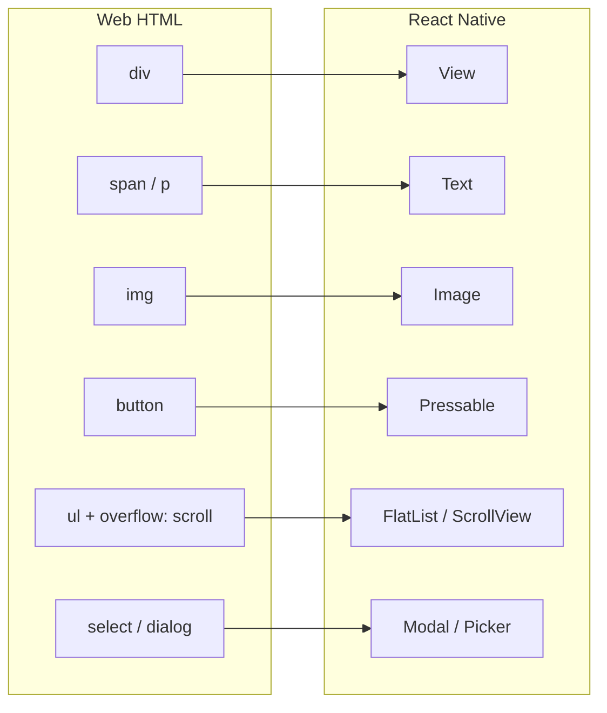
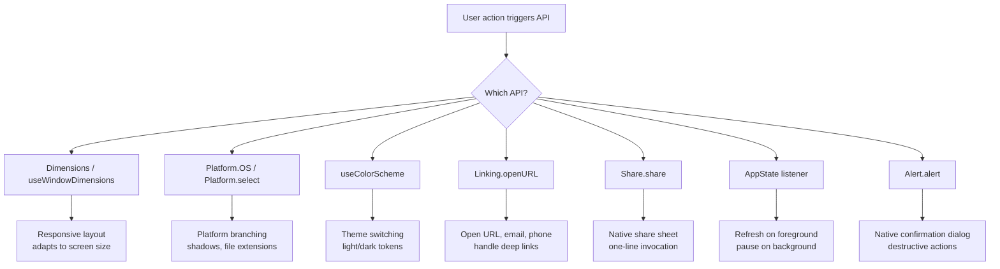

# Core Components and APIs: The Building Blocks

> The native primitives that replace HTML elements, and the platform APIs you will use every day.

---

## Table of Contents
1. [Building-Block Components](#1-building-block-components)
2. [Core APIs to Internalize](#2-core-apis-to-internalize)

---

## 1. Building-Block Components

On the web, you have `<div>`, `<span>`, ``, `<button>`, `<ul>`, and the rest of the HTML spec. In React Native, you have a smaller, more intentional set of primitives. Every pixel on your screen comes from composing these building blocks. Learn them deeply — they are your entire vocabulary.

### View: The Universal Container

`View` is your `<div>`. It is a non-scrolling container that supports flexbox layout, styling, touch handling, and accessibility. Unlike a div, it does not render text — try putting a raw string inside a `View` and you will get a red screen.

```tsx
import { View, StyleSheet } from "react-native";

function Card({ children }: { children: React.ReactNode }) {
  return <View style={styles.card}>{children}</View>;
}

const styles = StyleSheet.create({
  card: {
    padding: 16,
    borderRadius: 12,
    backgroundColor: "#fff",
    // Shadow on iOS
    shadowColor: "#000",
    shadowOffset: { width: 0, height: 2 },
    shadowOpacity: 0.1,
    shadowRadius: 4,
    // Shadow on Android
    elevation: 3,
  },
});
```

> **Gotcha:** Shadows work completely differently on iOS vs Android. iOS uses the `shadow*` properties; Android uses `elevation`. You will write both, every time. Libraries like `react-native-shadow-2` exist, but most teams just accept the duplication.

### Text: The Only Place Strings Can Live

On the web, you can drop text anywhere — inside a `<div>`, a `<span>`, even directly in the body. React Native is strict: all text must live inside a `<Text>` component. Text components nest, and inner ones inherit styles from their parent, much like `<span>` nesting in HTML.

```tsx
import { Text, StyleSheet } from "react-native";

function Greeting() {
  return (
    <Text style={styles.body}>
      Welcome back, <Text style={styles.bold}>Alex</Text>. You have{" "}
      <Text style={styles.highlight}>3 new messages</Text>.
    </Text>
  );
}

const styles = StyleSheet.create({
  body: { fontSize: 16, color: "#333" },
  bold: { fontWeight: "700" },
  highlight: { color: "#007AFF" },
});
```

Key differences from the web:
- No CSS `font-family` cascade. You set `fontFamily` explicitly, and it must be a font you have loaded.
- `numberOfLines` with `ellipsizeMode` replaces CSS `text-overflow: ellipsis`.
- Text is not selectable by default. Add `selectable` prop when you want copy-paste.

### Image: Local and Remote

`Image` replaces ``. Local images are `require()`-d at build time (the bundler handles resolution suffixes like `@2x` and `@3x`). Remote images **must** have explicit `width` and `height` — there is no intrinsic sizing from a URL.

```tsx
import { Image, StyleSheet } from "react-native";

// Local — dimensions are known at build time
<Image source={require("./assets/logo.png")} style={styles.logo} />

// Remote — you MUST specify dimensions
<Image
  source={{ uri: "https://example.com/avatar.jpg" }}
  style={styles.avatar}
  resizeMode="cover"
/>
```

`resizeMode` options: `cover` (crop to fill, like `object-fit: cover`), `contain` (fit inside, like `object-fit: contain`), `stretch`, `repeat`, `center`.

> **Recommendation:** The built-in `Image` has no disk caching for remote URIs on Android. Use `expo-image` or `react-native-fast-image` in any production app. `expo-image` is the modern choice — it uses shared native caching, supports blurhash placeholders, animated formats, and works in both Expo and bare projects.

### ScrollView: When Everything Fits in Memory

On the web, the browser scrolls the page for free. In React Native, nothing scrolls unless you wrap it in a `ScrollView`. It renders **all** of its children at once, which is fine for a settings screen with 20 items but fatal for a feed with 10,000.

```tsx
import { ScrollView, RefreshControl, Text } from "react-native";

function SettingsScreen() {
  const [refreshing, setRefreshing] = React.useState(false);

  const onRefresh = async () => {
    setRefreshing(true);
    await fetchSettings();
    setRefreshing(false);
  };

  return (
    <ScrollView
      contentContainerStyle={{ padding: 16 }}
      refreshControl={
        <RefreshControl refreshing={refreshing} onRefresh={onRefresh} />
      }
    >
      <Text>Profile</Text>
      <Text>Notifications</Text>
      <Text>Privacy</Text>
      {/* This is fine — bounded, small list */}
    </ScrollView>
  );
}
```

Rule of thumb: if the number of children is bounded and small (under ~50 simple items), `ScrollView` is fine. Otherwise, reach for `FlatList`.

### FlatList: Virtualized Lists

`FlatList` is the workhorse of React Native. It only renders items visible on screen (plus a small buffer), recycling views as you scroll. This is your `<ul>` for any dynamic-length list.

```tsx
import { FlatList, Text, View } from "react-native";

type Message = { id: string; text: string; sender: string };

function MessageList({ messages }: { messages: Message[] }) {
  return (
    <FlatList
      data={messages}
      keyExtractor={(item) => item.id}
      renderItem={({ item }) => (
        <View style={{ padding: 12 }}>
          <Text style={{ fontWeight: "600" }}>{item.sender}</Text>
          <Text>{item.text}</Text>
        </View>
      )}
      // Performance essentials
      initialNumToRender={15}
      maxToRenderPerBatch={10}
      windowSize={5}
      // Pull to refresh
      onRefresh={handleRefresh}
      refreshing={isRefreshing}
      // Infinite scroll
      onEndReached={loadMore}
      onEndReachedThreshold={0.5}
    />
  );
}
```

> **Gotcha:** The single most common FlatList performance mistake is passing an inline arrow function to `renderItem` or creating new objects in `keyExtractor`. These cause re-renders on every frame during scroll. Extract your render function and make sure `keyExtractor` returns a stable string.

### SectionList: Grouped Data

`SectionList` is `FlatList` with headers. Think of a contacts list grouped by first letter, or a menu grouped by category.

```tsx
import { SectionList, Text } from "react-native";

const DATA = [
  { title: "Fruits", data: ["Apple", "Banana", "Cherry"] },
  { title: "Vegetables", data: ["Carrot", "Peas", "Spinach"] },
];

function GroceryList() {
  return (
    <SectionList
      sections={DATA}
      keyExtractor={(item, index) => item + index}
      renderItem={({ item }) => <Text style={{ padding: 8 }}>{item}</Text>}
      renderSectionHeader={({ section: { title } }) => (
        <Text style={{ fontWeight: "bold", padding: 8, backgroundColor: "#eee" }}>
          {title}
        </Text>
      )}
      stickySectionHeadersEnabled
    />
  );
}
```

### Pressable: The Modern Touch Primitive

Forget `TouchableOpacity`, `TouchableHighlight`, and `TouchableWithoutFeedback`. They are legacy. `Pressable` is the one touch component you should use — it gives you fine-grained control over press states via a style function.

```tsx
import { Pressable, Text, StyleSheet } from "react-native";

function PrimaryButton({ title, onPress }: { title: string; onPress: () => void }) {
  return (
    <Pressable
      onPress={onPress}
      style={({ pressed }) => [
        styles.button,
        pressed && styles.buttonPressed,
      ]}
      android_ripple={{ color: "rgba(0,0,0,0.1)" }}
    >
      <Text style={styles.buttonText}>{title}</Text>
    </Pressable>
  );
}

const styles = StyleSheet.create({
  button: {
    backgroundColor: "#007AFF",
    paddingVertical: 12,
    paddingHorizontal: 24,
    borderRadius: 8,
    alignItems: "center",
  },
  buttonPressed: { opacity: 0.7 },
  buttonText: { color: "#fff", fontWeight: "600", fontSize: 16 },
});
```

The `pressed` state in the style function is the key pattern. On Android, also use `android_ripple` for the native Material ripple effect that users expect.

### Modal, SafeAreaView, KeyboardAvoidingView, and ActivityIndicator

These four are utilities you will reach for constantly:

```tsx
import {
  Modal,
  SafeAreaView,
  KeyboardAvoidingView,
  ActivityIndicator,
  Platform,
  View,
  Text,
  TextInput,
} from "react-native";

function CreatePostModal({ visible, onClose }: { visible: boolean; onClose: () => void }) {
  return (
    <Modal visible={visible} animationType="slide" onRequestClose={onClose}>
      <SafeAreaView style={{ flex: 1 }}>
        <KeyboardAvoidingView
          behavior={Platform.OS === "ios" ? "padding" : "height"}
          style={{ flex: 1, padding: 16 }}
        >
          <Text style={{ fontSize: 20, fontWeight: "bold" }}>New Post</Text>
          <TextInput
            placeholder="What's on your mind?"
            multiline
            style={{ flex: 1, textAlignVertical: "top", marginTop: 12 }}
          />
        </KeyboardAvoidingView>
      </SafeAreaView>
    </Modal>
  );
}

// Loading spinner — simple, but you will use it everywhere
function LoadingScreen() {
  return (
    <View style={{ flex: 1, justifyContent: "center", alignItems: "center" }}>
      <ActivityIndicator size="large" color="#007AFF" />
    </View>
  );
}
```

> **Recommendation:** The built-in `SafeAreaView` only works on iOS and has known bugs with animations. Use `SafeAreaView` from `react-native-safe-area-context` instead — it works on both platforms, provides the `useSafeAreaInsets()` hook for granular control, and is what every major navigation library depends on.

> **Gotcha:** `KeyboardAvoidingView` with `behavior="padding"` works well on iOS. On Android, the default `android:windowSoftInputMode="adjustResize"` in `AndroidManifest.xml` usually handles it, but the interaction between the two can be unpredictable. Test both platforms early.

Here is how the component mapping looks from web to native:



---

## 2. Core APIs to Internalize

Components put things on screen. APIs give you access to the device and operating system underneath. These are the ones you will import in almost every project.

### Dimensions and useWindowDimensions

You need the screen size for responsive layouts. There are two ways to get it, and one is better.

```tsx
import { Dimensions, useWindowDimensions, View } from "react-native";

// OLD WAY — static, does not update on rotation or foldables
const { width, height } = Dimensions.get("window");

// RIGHT WAY — reactive hook, updates when dimensions change
function ResponsiveGrid() {
  const { width } = useWindowDimensions();
  const numColumns = width > 768 ? 3 : 2;

  return (
    <FlatList
      data={items}
      numColumns={numColumns}
      key={numColumns} // Force re-mount when columns change
      renderItem={({ item }) => (
        <View style={{ width: width / numColumns, height: 200 }}>
          {/* ... */}
        </View>
      )}
    />
  );
}
```

Always use `useWindowDimensions` inside components. Use `Dimensions.get()` only in module-level constants where hooks are not available (like defining a static style).

### Platform: Branching by OS

`Platform.OS` is `"ios"` or `"android"` (or `"web"` if you use React Native Web). `Platform.select` is cleaner than ternaries when you have multiple branches.

```tsx
import { Platform, StyleSheet } from "react-native";

const styles = StyleSheet.create({
  shadow: Platform.select({
    ios: {
      shadowColor: "#000",
      shadowOffset: { width: 0, height: 2 },
      shadowOpacity: 0.15,
      shadowRadius: 4,
    },
    android: {
      elevation: 4,
    },
    default: {
      // Web or other platforms
      boxShadow: "0 2px 4px rgba(0,0,0,0.15)",
    },
  }),
});

// For larger branching, use platform-specific files:
// MyComponent.ios.tsx
// MyComponent.android.tsx
// The bundler automatically resolves the right one.
```

The file-based approach (`*.ios.tsx` / `*.android.tsx`) is powerful for components that differ significantly between platforms. The bundler picks the right file at build time — zero runtime cost.

### Appearance and useColorScheme: Dark Mode

Every modern app needs dark mode support. React Native gives you the user's preference out of the box.

```tsx
import { useColorScheme, View, Text, StyleSheet } from "react-native";

function ThemedCard({ title }: { title: string }) {
  const colorScheme = useColorScheme(); // "light" | "dark" | null
  const isDark = colorScheme === "dark";

  return (
    <View
      style={[
        styles.card,
        { backgroundColor: isDark ? "#1c1c1e" : "#ffffff" },
      ]}
    >
      <Text style={{ color: isDark ? "#fff" : "#000" }}>{title}</Text>
    </View>
  );
}

const styles = StyleSheet.create({
  card: { padding: 16, borderRadius: 12, margin: 8 },
});
```

> **Recommendation:** Do not scatter `useColorScheme` across every component. Create a theme context or use a library like `@react-navigation/native`'s built-in theme support. Define your color tokens once, consume them everywhere.

### Linking: URLs and Deep Links

`Linking` is how you open URLs, phone numbers, emails, and how your app responds to incoming deep links.

```tsx
import { Linking, Alert, Pressable, Text } from "react-native";

// Opening external URLs
async function openWebsite(url: string) {
  const supported = await Linking.canOpenURL(url);
  if (supported) {
    await Linking.openURL(url);
  } else {
    Alert.alert("Error", `Cannot open URL: ${url}`);
  }
}

// Phone, email, maps
await Linking.openURL("tel:+15551234567");
await Linking.openURL("mailto:support@example.com?subject=Help");
await Linking.openURL("https://maps.apple.com/?q=coffee");

// Listening for incoming deep links
function App() {
  React.useEffect(() => {
    const subscription = Linking.addEventListener("url", (event) => {
      handleDeepLink(event.url); // e.g., "myapp://product/123"
    });

    // Check if app was opened via a deep link (cold start)
    Linking.getInitialURL().then((url) => {
      if (url) handleDeepLink(url);
    });

    return () => subscription.remove();
  }, []);

  // ...
}
```

In production, you will likely use `expo-linking` or a navigation library's deep linking integration rather than the raw API. But understanding the primitive helps you debug when links are not routing correctly.

### Share: The Native Share Sheet

One line to invoke the platform share sheet — something that takes considerable effort on the web.

```tsx
import { Share } from "react-native";

async function shareArticle(title: string, url: string) {
  try {
    const result = await Share.share({
      message: `Check out "${title}": ${url}`,
      // iOS-only: separate url field shows a link preview
      url: url,
      title: title,
    });

    if (result.action === Share.sharedAction) {
      // User shared successfully
    }
  } catch (error) {
    // User cancelled or error occurred
  }
}
```

### AppState: Foreground and Background

On the web, you have `visibilitychange`. In React Native, you have `AppState`. It tells you whether the app is in the foreground (`active`), background, or transitioning (`inactive` on iOS).

```tsx
import { AppState } from "react-native";

function useAppStateRefresh(onForeground: () => void) {
  const appState = React.useRef(AppState.currentState);

  React.useEffect(() => {
    const subscription = AppState.addEventListener("change", (nextState) => {
      // App came back to foreground
      if (appState.current.match(/inactive|background/) && nextState === "active") {
        onForeground();
      }
      appState.current = nextState;
    });

    return () => subscription.remove();
  }, [onForeground]);
}

// Usage: refresh data when user returns to app
function HomeScreen() {
  useAppStateRefresh(() => {
    queryClient.invalidateQueries(["notifications"]);
  });
  // ...
}
```

This pattern — "refresh stale data when the user returns" — is one of the most common uses. Libraries like TanStack Query have built-in `focusManager` integration for this, but knowing the underlying API lets you handle custom cases like pausing a video or disconnecting a WebSocket.

### Alert: Native Dialogs

`Alert.alert()` triggers the native platform dialog. It is not a React component — it is an imperative API call.

```tsx
import { Alert } from "react-native";

function confirmDelete(itemName: string, onConfirm: () => void) {
  Alert.alert(
    "Delete Item",
    `Are you sure you want to delete "${itemName}"? This cannot be undone.`,
    [
      { text: "Cancel", style: "cancel" },
      { text: "Delete", style: "destructive", onPress: onConfirm },
    ]
  );
}
```

On iOS, the `destructive` style renders the button in red. On Android, it is ignored — buttons always look the same. If you need richer dialogs with custom UI, you will build them with `Modal` and your own components.



> **Common Mistake:** Reaching for a third-party library before trying the built-in API. These core APIs cover 80% of device-interaction needs. Learn what ships with React Native, then add libraries for the remaining 20% — camera, haptics, biometrics, file system — where native modules are genuinely required.

---