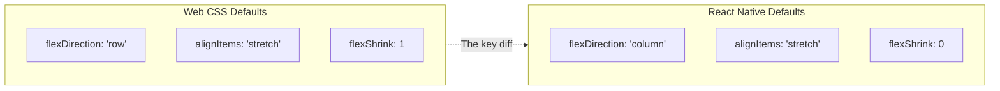

# Styling and Layout: Flexbox Without the Web

> How styling works in React Native — no CSS, no Grid, just Flexbox and density-independent pixels.

---

## Table of Contents

1. [Core Mechanics](#1-core-mechanics)
2. [Responsive Design](#2-responsive-design)
3. [Styling Libraries](#3-styling-libraries)
4. [Theming](#4-theming)
5. [Icons and Assets](#5-icons-and-assets)

---

## 1. Core Mechanics

### The first surprise

If you are coming from web React, your muscle memory says: write a `.css` file, import it, apply class names. In React Native there are no CSS files, no class names, no cascading, no inheritance from parent elements, and no browser to interpret your rules. Every style is a JavaScript object passed directly to a component via the `style` prop. That is the entire system.

This is not a limitation — it is a simplification. On the web, you fight specificity wars, worry about global leaks, and debug why a `div` three levels up is overriding your font size. None of that exists here. Every component styles itself and only itself.

### StyleSheet.create

React Native provides `StyleSheet.create` to define your styles. It looks almost identical to inline objects, but with one important difference: the styles are validated and sent to the native side once at startup, not re-created on every render.

```tsx
import { StyleSheet, View, Text } from 'react-native';

const ProfileCard = () => (
  <View style={styles.card}>
    <Text style={styles.name}>Ada Lovelace</Text>
    <Text style={styles.role}>Engineer</Text>
  </View>
);

const styles = StyleSheet.create({
  card: {
    backgroundColor: '#ffffff',
    borderRadius: 12,
    padding: 16,
    // Shadow on iOS
    shadowColor: '#000',
    shadowOffset: { width: 0, height: 2 },
    shadowOpacity: 0.1,
    shadowRadius: 4,
    // Shadow on Android
    elevation: 3,
  },
  name: {
    fontSize: 18,
    fontWeight: '700',
    color: '#1a1a2e',
  },
  role: {
    fontSize: 14,
    color: '#6b7280',
    marginTop: 4,
  },
});
```

> **Performance hint:** Always define `StyleSheet.create` outside your component body. If you put it inside, you pay the cost of re-creating those objects on every render. Move it to the bottom of the file — it is a convention the entire ecosystem follows.

### Inline objects for dynamic styles

When a style depends on props or state, you cannot put it in `StyleSheet.create` because you do not know the value at definition time. Use an inline object instead, and combine it with your static styles using the array syntax:

```tsx
const Badge = ({ color, large }: { color: string; large?: boolean }) => (
  <View
    style={[
      styles.badge,
      { backgroundColor: color },
      large && styles.badgeLarge,
    ]}
  >
    <Text style={styles.badgeText}>New</Text>
  </View>
);

const styles = StyleSheet.create({
  badge: {
    paddingHorizontal: 8,
    paddingVertical: 4,
    borderRadius: 999,
  },
  badgeLarge: {
    paddingHorizontal: 16,
    paddingVertical: 8,
  },
  badgeText: {
    color: '#fff',
    fontSize: 12,
    fontWeight: '600',
  },
});
```

The `style` prop accepts a single object, an array of objects, or a nested array. Later entries override earlier ones — last writer wins, no specificity calculation.

### Flexbox: same concept, different defaults

React Native uses Flexbox for all layout. There is no CSS Grid, no `float`, no `position: absolute` as a layout hack (though `absolute` positioning exists for overlays). If you know Flexbox from the web, you know 90% of what you need. The other 10% is the defaults.



On the web, flex containers default to `row` — children line up left to right. In React Native, the default is `column` — children stack top to bottom, like a mobile screen naturally reads. This trips up every web developer exactly once. If your layout looks wrong and everything is stacked vertically, you probably forgot to add `flexDirection: 'row'`.

```tsx
const Row = ({ children }: { children: React.ReactNode }) => (
  <View style={{ flexDirection: 'row', alignItems: 'center', gap: 8 }}>
    {children}
  </View>
);
```

> **Gotcha:** The `gap` property works in React Native 0.71+ and Expo SDK 48+. On older versions you need margins. If you are starting a new project in 2026, you have `gap` — use it.

### All values are density-independent pixels

There are no `rem`, `em`, `vh`, `vw`, `%` (except in flex), or `px` units. Every numeric value is a **density-independent pixel (dp)**. The framework maps this to physical pixels using the device's pixel ratio. A `width: 100` looks roughly the same physical size on a phone with a 2x screen and a tablet with a 3x screen. You never write `'16px'` — just `16`.

```tsx
// On the web you write:
//   fontSize: '16px', padding: '1rem'
//
// In React Native you write:
//   fontSize: 16, padding: 16
//
// No units. No strings. Just numbers (except fontWeight, which is a string).
```

---

## 2. Responsive Design

### The problem is different on mobile

On the web, responsive design means adapting from a 320px phone to a 2560px ultrawide. On mobile, the range is narrower — roughly 360dp to 430dp for phones — but you also face tablets (768dp+), foldables with changing screen dimensions mid-session, and landscape versus portrait orientations. The strategy shifts from breakpoints-for-everything to flexible layouts that stretch gracefully plus a few explicit breakpoints for tablets.

### useWindowDimensions

React Native ships a hook that gives you the current screen dimensions. It updates automatically on rotation or when a foldable changes its fold state.

```tsx
import { useWindowDimensions, View, Text } from 'react-native';

const ResponsiveGrid = () => {
  const { width } = useWindowDimensions();
  const isTablet = width >= 768;
  const columns = isTablet ? 3 : 2;

  return (
    <View style={{ flexDirection: 'row', flexWrap: 'wrap' }}>
      {items.map((item) => (
        <View
          key={item.id}
          style={{
            width: `${100 / columns}%` as any,
            padding: 8,
          }}
        >
          <Card item={item} />
        </View>
      ))}
    </View>
  );
};
```

> **Note:** `useWindowDimensions` returns the window size, not the screen size. On iPads with Split View or Slide Over, the window is smaller than the physical screen. This is what you want — your layout should fit the window it actually lives in.

### react-native-responsive-screen

For layouts that need proportional sizing — "this card should be 80% of the screen width, the header should be 7% of the screen height" — the `react-native-responsive-screen` library gives you `widthPercentageToDP` and `heightPercentageToDP` helpers:

```tsx
import {
  widthPercentageToDP as wp,
  heightPercentageToDP as hp,
} from 'react-native-responsive-screen';

const styles = StyleSheet.create({
  container: {
    width: wp('85%'),     // 85% of screen width in dp
    height: hp('7%'),     // 7% of screen height in dp
    borderRadius: wp('3%'),
  },
});
```

This is useful but easy to overuse. If every single value is a percentage, your code becomes unreadable. Use it for the overall layout skeleton — container widths, hero sections, modal sizes — and use fixed dp values for padding, font sizes, and icon dimensions.

### Handling tablets and foldables

For serious tablet support, you need more than a width check. Consider these patterns:

```tsx
import { useWindowDimensions, Platform } from 'react-native';

function useDeviceType() {
  const { width, height } = useWindowDimensions();
  const isLandscape = width > height;

  if (width >= 1024) return 'desktop';    // iPad Pro, desktop web
  if (width >= 768) return 'tablet';
  return 'phone';
}

// Master-detail layout for tablets
const InboxScreen = () => {
  const device = useDeviceType();

  if (device === 'phone') {
    return <InboxList onSelect={navigateToDetail} />;
  }

  // Tablet: show list and detail side by side
  return (
    <View style={{ flexDirection: 'row', flex: 1 }}>
      <View style={{ width: 320, borderRightWidth: 1, borderColor: '#e5e7eb' }}>
        <InboxList onSelect={setSelectedId} />
      </View>
      <View style={{ flex: 1 }}>
        <InboxDetail id={selectedId} />
      </View>
    </View>
  );
};
```

> **Gotcha:** Samsung foldables report a width change when the user folds or unfolds the device. Your layout must handle this mid-session. Components that cache `width` in state and never re-read it will break. Always derive layout from `useWindowDimensions` directly — do not snapshot it once on mount.

---

## 3. Styling Libraries

### Why you might want one

`StyleSheet.create` works, but as your app grows you will notice the pain points: no design tokens built in, verbose syntax for spacing variants, no way to express `:hover` or media queries declaratively. Styling libraries fill these gaps. In 2026 the landscape has settled into clear tiers.


### NativeWind v4 — the default recommendation

NativeWind brings Tailwind CSS syntax to React Native. If your team already knows Tailwind from the web, the learning curve is almost zero. Version 4 compiles class names at build time, so there is no runtime cost for parsing utility strings.

```tsx
import { View, Text } from 'react-native';

const ProfileCard = () => (
  <View className="bg-white rounded-xl p-4 shadow-md">
    <Text className="text-lg font-bold text-gray-900">Ada Lovelace</Text>
    <Text className="text-sm text-gray-500 mt-1">Engineer</Text>
  </View>
);
```

Installation with Expo:

```bash
npx expo install nativewind tailwindcss
```

Why I recommend it as the default choice: it has the largest community, the best documentation, works on web and native through the same class names, and the compiler means you do not pay a runtime tax. The one downside is that debugging styles is harder — you cannot click on `className="p-4"` and see the resulting object without the Tailwind devtools or NativeWind's `styled()` debug mode.

### Tamagui — when you need a design system

Tamagui is a full design-system framework with a compiler. It generates optimized platform-specific code at build time, extracting styles into static objects. It is more opinionated than NativeWind — you get a component library with variants, animations, and responsive props out of the box.

```tsx
import { Button, YStack, Text } from 'tamagui';

const ProfileCard = () => (
  <YStack bg="$background" br="$4" p="$4" elevation="$2">
    <Text fontSize="$5" fontWeight="700" color="$color">
      Ada Lovelace
    </Text>
    <Button mt="$2" theme="blue">Follow</Button>
  </YStack>
);
```

Use Tamagui when you are building a design system from scratch for a product that ships to both web and native, and you want one component library to rule both platforms. It has a steeper setup cost than NativeWind but pays off at scale.

### Restyle (Shopify)

Restyle is Shopify's type-safe styling library. It hooks directly into your theme object and lets you pass style props that are constrained to your design tokens. No utility classes, no tagged templates — just typed props.

```tsx
import { createBox, createText } from '@shopify/restyle';
import { Theme } from './theme';

const Box = createBox<Theme>();
const Typography = createText<Theme>();

const ProfileCard = () => (
  <Box backgroundColor="cardBackground" borderRadius="m" padding="m" shadowOpacity={0.1}>
    <Typography variant="heading">Ada Lovelace</Typography>
    <Typography variant="body" color="textMuted" marginTop="xs">
      Engineer
    </Typography>
  </Box>
);
```

Restyle is excellent if you want strict design-token enforcement with full TypeScript autocompletion. It is lighter than Tamagui and more structured than NativeWind.

### styled-components / Emotion — avoid for new projects

Both libraries work in React Native, but they parse tagged template literals at runtime. On a screen with 200 styled components, the parsing overhead is measurable — you can see it in Hermes flame charts. They were the standard in 2020. In 2026, compile-time solutions have overtaken them. If you inherit a codebase using them, they work fine. If you are starting fresh, pick NativeWind or Restyle instead.

---

## 4. Theming

### Why theming matters early

A theme is a single source of truth for your visual language: colors, spacing, typography, border radii. Without one, developers eyeball hex codes, spacing drifts between 12 and 14 and 16 for no reason, and dark mode becomes a six-week project instead of a one-day toggle. Define your theme on day one.

### A typed theme in TypeScript

```tsx
// theme.ts
export const theme = {
  colors: {
    primary: '#6366f1',
    primaryLight: '#a5b4fc',
    background: '#ffffff',
    surface: '#f9fafb',
    text: '#111827',
    textMuted: '#6b7280',
    border: '#e5e7eb',
    error: '#ef4444',
    success: '#22c55e',
  },
  spacing: {
    xs: 4,
    sm: 8,
    md: 16,
    lg: 24,
    xl: 32,
    '2xl': 48,
  },
  radii: {
    sm: 4,
    md: 8,
    lg: 12,
    xl: 16,
    full: 9999,
  },
  typography: {
    heading: { fontSize: 24, fontWeight: '700' as const, lineHeight: 32 },
    subheading: { fontSize: 18, fontWeight: '600' as const, lineHeight: 26 },
    body: { fontSize: 16, fontWeight: '400' as const, lineHeight: 24 },
    caption: { fontSize: 12, fontWeight: '400' as const, lineHeight: 16 },
  },
} as const;

export type AppTheme = typeof theme;

export const darkTheme: AppTheme = {
  ...theme,
  colors: {
    ...theme.colors,
    background: '#0f172a',
    surface: '#1e293b',
    text: '#f1f5f9',
    textMuted: '#94a3b8',
    border: '#334155',
  },
};
```

### Distributing the theme with Context

The simplest approach is React Context. Wrap your app, consume with a hook.

```tsx
// ThemeContext.tsx
import React, { createContext, useContext, useMemo } from 'react';
import { useColorScheme } from 'react-native';
import { theme, darkTheme, AppTheme } from './theme';

const ThemeContext = createContext<AppTheme>(theme);

export const ThemeProvider = ({ children }: { children: React.ReactNode }) => {
  const colorScheme = useColorScheme(); // 'light' | 'dark' | null
  const activeTheme = useMemo(
    () => (colorScheme === 'dark' ? darkTheme : theme),
    [colorScheme],
  );

  return (
    <ThemeContext.Provider value={activeTheme}>
      {children}
    </ThemeContext.Provider>
  );
};

export const useTheme = () => useContext(ThemeContext);
```

Then use it in any component:

```tsx
const ProfileCard = () => {
  const t = useTheme();

  return (
    <View
      style={{
        backgroundColor: t.colors.surface,
        borderRadius: t.radii.lg,
        padding: t.spacing.md,
      }}
    >
      <Text style={[t.typography.heading, { color: t.colors.text }]}>
        Ada Lovelace
      </Text>
    </View>
  );
};
```

### useColorScheme for dark mode

`useColorScheme` is built into React Native. It reads the device's system-wide dark mode setting. It returns `'light'`, `'dark'`, or `null` (when the OS does not report a preference). On iOS and Android this updates live — if the user toggles dark mode in system settings while your app is open, the value changes and your components re-render.

> **Gotcha:** On Android, `useColorScheme` only reacts to system changes if your `Activity` is configured properly. In Expo this works out of the box. In bare React Native, make sure your `MainActivity` does not lock `uiMode` in the manifest.

### Zustand as an alternative to Context

If your theme changes frequently (say you let users pick an accent color), Context causes re-renders in every consumer. Zustand avoids this by using external state with selectors:

```tsx
import { create } from 'zustand';
import { theme, darkTheme, AppTheme } from './theme';

type ThemeStore = {
  theme: AppTheme;
  setDark: () => void;
  setLight: () => void;
};

export const useThemeStore = create<ThemeStore>((set) => ({
  theme: theme,
  setDark: () => set({ theme: darkTheme }),
  setLight: () => set({ theme: theme }),
}));

// In a component — only re-renders when colors change
const bg = useThemeStore((s) => s.theme.colors.background);
```

This is overkill for most apps. Start with Context. Move to Zustand if you profile and find theme-related re-renders are a bottleneck.

---

## 5. Icons and Assets

### Icons: three good options

On the web you drop an SVG into your JSX and call it a day. In React Native, SVG is not natively supported — you need a library to bridge the gap. Here are the options worth considering in 2026.

**Lucide React Native** is the recommendation for most projects. It provides 1,400+ icons as individual tree-shakeable components. Clean design, consistent stroke widths, TypeScript types, and the icons are rendered as native SVG via `react-native-svg`.

```bash
npx expo install lucide-react-native react-native-svg
```

```tsx
import { Bell, Settings, ChevronRight } from 'lucide-react-native';
import { useTheme } from './ThemeContext';

const IconRow = () => {
  const t = useTheme();

  return (
    <View style={{ flexDirection: 'row', gap: 16 }}>
      <Bell size={24} color={t.colors.text} />
      <Settings size={24} color={t.colors.text} />
      <ChevronRight size={24} color={t.colors.textMuted} />
    </View>
  );
};
```

**@expo/vector-icons** bundles icon sets from FontAwesome, MaterialIcons, Ionicons, and more. The icons are font-based, not SVG-based — they load with the font binary, which means the entire icon set is bundled even if you use three icons. This was the default for years, and it still works, but tree-shaking is worse than Lucide.

```tsx
import { Ionicons } from '@expo/vector-icons';

<Ionicons name="notifications-outline" size={24} color="#111827" />
```

**react-native-svg** is not an icon library — it is the SVG rendering engine that Lucide and other libraries build on. If you have custom SVGs from your design team, use it directly:

```tsx
import Svg, { Path, Circle } from 'react-native-svg';

const CustomLogo = ({ size = 32, color = '#6366f1' }) => (
  <Svg width={size} height={size} viewBox="0 0 24 24" fill="none">
    <Circle cx={12} cy={12} r={10} stroke={color} strokeWidth={2} />
    <Path d="M8 12l3 3 5-5" stroke={color} strokeWidth={2} strokeLinecap="round" />
  </Svg>
);
```

### Images: use expo-image, not the built-in Image

React Native ships an `Image` component. It works, but it lacks caching, progressive loading, blurhash placeholders, and modern format support. The community has settled on `expo-image` as the replacement.

```bash
npx expo install expo-image
```

```tsx
import { Image } from 'expo-image';

const Avatar = ({ uri }: { uri: string }) => (
  <Image
    source={{ uri }}
    style={{ width: 48, height: 48, borderRadius: 24 }}
    placeholder={{ blurhash: 'LGF5]+Yk^6#M@-5c,1J5@[or[Q6.' }}
    contentFit="cover"
    transition={200}
  />
);
```

Why `expo-image` over the core `Image`:

- **Caching**: Built-in disk and memory cache. The core `Image` on Android does not cache network images by default.
- **Blurhash/thumbhash placeholders**: Show a blurred preview while the full image loads — eliminates layout jumps.
- **contentFit**: Uses `cover`, `contain`, `fill`, `none` — same mental model as CSS `object-fit`. The core `Image` uses `resizeMode`, which is less intuitive.
- **Modern formats**: Supports AVIF, WebP, SVG, and animated images out of the box.
- **Performance**: Uses native image libraries (SDWebImage on iOS, Glide on Android) under the hood.

> **Gotcha:** Always set explicit `width` and `height` on images. Unlike the web, React Native does not intrinsically size images — an image with no dimensions renders as 0x0. If you want aspect-ratio-based sizing, set one dimension and use `aspectRatio` in the style.

```tsx
<Image
  source={{ uri: 'https://example.com/hero.jpg' }}
  style={{ width: '100%', aspectRatio: 16 / 9 }}
  contentFit="cover"
/>
```

### Organizing assets in your project

Keep a flat, predictable structure:

```
assets/
  icons/           # Custom SVG icons (if not using Lucide)
  images/          # Static images bundled with the app
    logo.png
    onboarding-1.png
  fonts/           # Custom font files
    Inter-Regular.ttf
    Inter-Bold.ttf
```

For static images bundled with the app, use `require()`:

```tsx
<Image source={require('../assets/images/logo.png')} style={{ width: 120, height: 40 }} />
```

For fonts, Expo handles loading via `expo-font` or the `useFonts` hook. Define your font family once in your theme and reference it everywhere — never hardcode `'Inter-Bold'` in individual components.

---