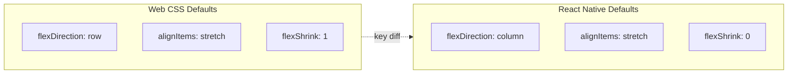
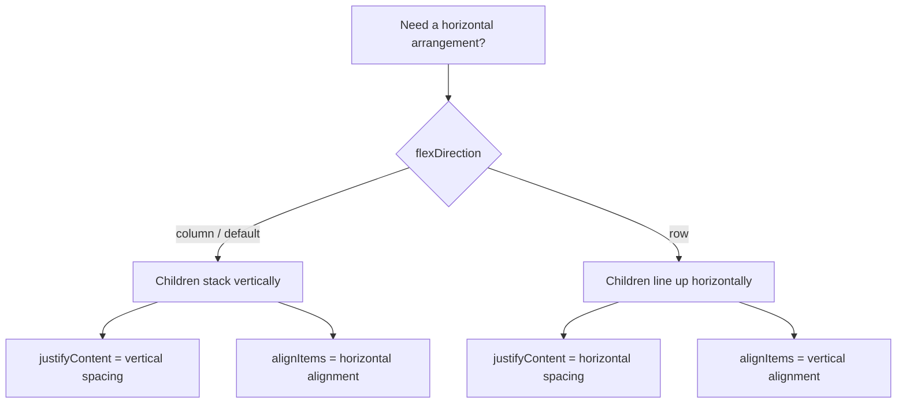
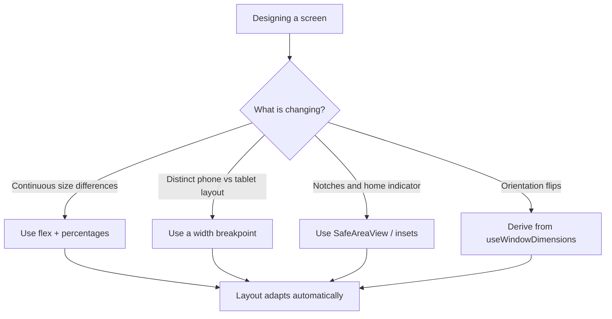
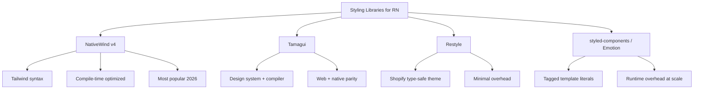
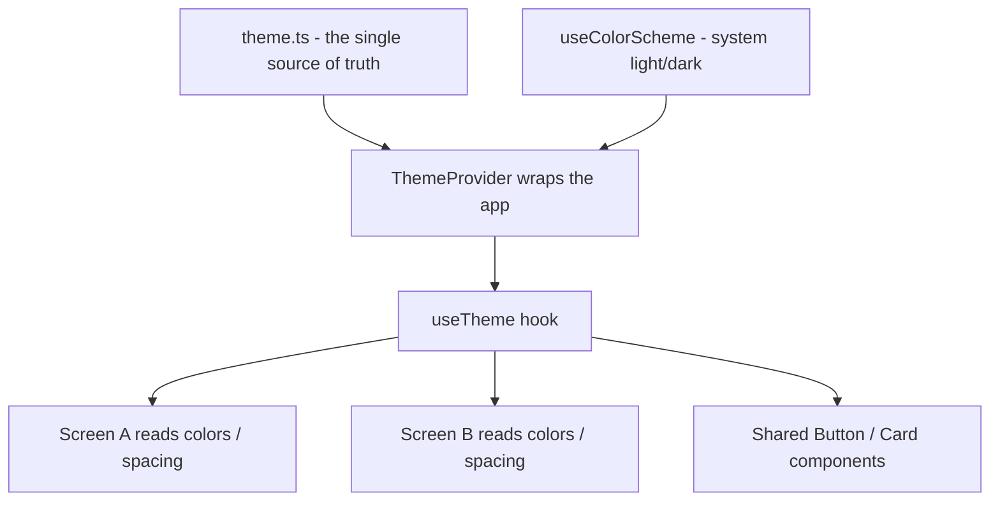
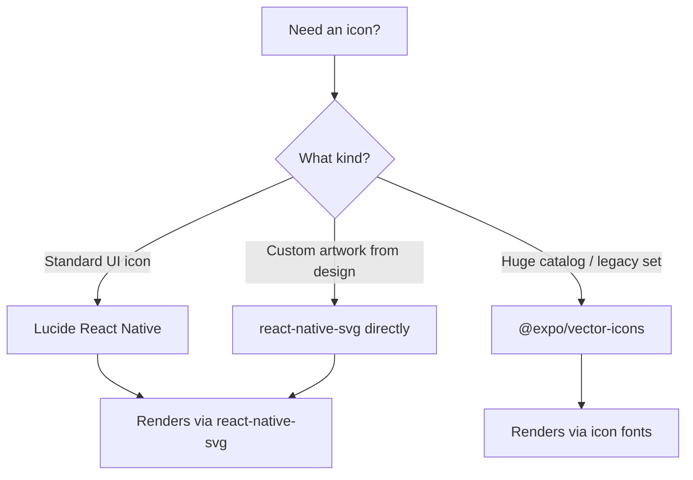

# Styling and Layout: Flexbox Without the Web

> How styling works in React Native — no CSS, no Grid, just Flexbox and density-independent pixels.

---

## Table of Contents

1. [Core Mechanics](#1-core-mechanics)
2. [Responsive Design](#2-responsive-design)
3. [Styling Libraries](#3-styling-libraries)
4. [Theming](#4-theming)
5. [Icons and Assets](#5-icons-and-assets)

---

## 1. Core Mechanics

### The first surprise

If you are coming from web React, your muscle memory says: write a `.css` file, import it, apply class names. In React Native there are no CSS files, no class names, no cascading, no inheritance from parent elements, and no browser to interpret your rules. Every style is a JavaScript object passed directly to a component via the `style` prop. That is the entire system.

This is not a limitation — it is a simplification. On the web, you fight specificity wars, worry about global leaks, and debug why a `div` three levels up is overriding your font size. None of that exists here. Every component styles itself and only itself.

Why does it work this way? There is no browser engine on a phone parsing CSS selectors and building a cascade. React Native talks directly to native UI primitives — an iOS `UIView`, an Android `View`. A native view does not understand "the third child of any element with class `card`." It understands a flat bag of properties: this view has this background, this padding, this corner radius. So React Native gives you exactly that — a plain object of properties — and skips the entire selector-matching machine. Think of it as the difference between writing a recipe with rules ("season everything in the kitchen with salt") versus handing each dish its own finished plate.

> **Mental model shift:** On the web a style sheet is a set of *rules* that get matched against elements. In React Native a style is a *value* that you hand to one element. There is no matching step, so there is nothing to win or lose a specificity fight.

### StyleSheet.create

React Native provides `StyleSheet.create` to define your styles. It looks almost identical to inline objects, but with one important difference: the styles are validated and sent to the native side once at startup, not re-created on every render.

```tsx
import { StyleSheet, View, Text } from 'react-native';

const ProfileCard = () => (
  <View style={styles.card}>
    <Text style={styles.name}>Ada Lovelace</Text>
    <Text style={styles.role}>Engineer</Text>
  </View>
);

const styles = StyleSheet.create({
  card: {
    backgroundColor: '#ffffff',
    borderRadius: 12,
    padding: 16,
    // Shadow on iOS
    shadowColor: '#000',
    shadowOffset: { width: 0, height: 2 },
    shadowOpacity: 0.1,
    shadowRadius: 4,
    // Shadow on Android
    elevation: 3,
  },
  name: {
    fontSize: 18,
    fontWeight: '700',
    color: '#1a1a2e',
  },
  role: {
    fontSize: 14,
    color: '#6b7280',
    marginTop: 4,
  },
});
```

Notice the shadow handling above — it is your first taste of platform divergence. iOS reads the four `shadow*` properties; Android ignores them entirely and only honors `elevation`. There is no single cross-platform shadow primitive in core React Native, so you set both and each platform picks the one it understands. (Libraries and newer APIs like `boxShadow` are smoothing this over, but the two-property habit is still the safe default.)

What does `StyleSheet.create` actually buy you over a plain object? Three things:

- **Validation** — typos and invalid values are caught early rather than silently ignored.
- **A stable identity** — the object is created once, so React can cheaply compare `styles.card === styles.card` across renders instead of seeing a brand-new object each time.
- **Self-documenting code** — named keys (`card`, `name`, `role`) read better than anonymous inline blobs.

> **Performance hint:** Always define `StyleSheet.create` outside your component body. If you put it inside, you pay the cost of re-creating those objects on every render. Move it to the bottom of the file — it is a convention the entire ecosystem follows.

> **Common mistake:** Reaching for `StyleSheet.create` and expecting CSS features. There is no `:hover`, no `::before`, no descendant selectors, no `calc()`, no animations-via-keyframes. Those needs are met by props, state, and the `Animated`/Reanimated APIs instead.

### Inline objects for dynamic styles

When a style depends on props or state, you cannot put it in `StyleSheet.create` because you do not know the value at definition time. Use an inline object instead, and combine it with your static styles using the array syntax:

```tsx
const Badge = ({ color, large }: { color: string; large?: boolean }) => (
  <View
    style={[
      styles.badge,
      { backgroundColor: color },
      large && styles.badgeLarge,
    ]}
  >
    <Text style={styles.badgeText}>New</Text>
  </View>
);

const styles = StyleSheet.create({
  badge: {
    paddingHorizontal: 8,
    paddingVertical: 4,
    borderRadius: 999,
  },
  badgeLarge: {
    paddingHorizontal: 16,
    paddingVertical: 8,
  },
  badgeText: {
    color: '#fff',
    fontSize: 12,
    fontWeight: '600',
  },
});
```

The `style` prop accepts a single object, an array of objects, or a nested array. Later entries override earlier ones — last writer wins, no specificity calculation. This is your replacement for CSS class composition. Where on the web you would write `className="badge badge--large"` and let the cascade sort it out, here you build an array and the array *order* is the only rule.

A few details that trip people up:

- **Falsy entries are skipped.** `large && styles.badgeLarge` evaluates to `false` when `large` is undefined, and React Native ignores `false`, `null`, and `undefined` inside a style array. This is why the `condition && style` pattern is everywhere.
- **Only matching keys override.** Putting `styles.badgeLarge` after `styles.badge` does *not* replace the whole base style — it merges, overriding only the keys it defines (`paddingHorizontal`, `paddingVertical`) and leaving `borderRadius` intact.

```tsx
// Web mental model:           RN equivalent:
// className={clsx(            style={[
//   'badge',                    styles.badge,
//   isLarge && 'badge--large',  isLarge && styles.badgeLarge,
//   `bg-${color}`,              { backgroundColor: color },
// )}                          ]}
```

> **Pro tip:** Reserve inline objects for values that genuinely change at runtime (a color from props, a computed width). Keep everything static in `StyleSheet.create`. Mixing the two with the array syntax gives you the best of both: cheap static styles plus a small dynamic patch on top.

### Flexbox: same concept, different defaults

React Native uses Flexbox for all layout. There is no CSS Grid, no `float`, no `position: absolute` as a layout hack (though `absolute` positioning exists for overlays). If you know Flexbox from the web, you know 90% of what you need. The other 10% is the defaults.

Under the hood, layout is computed by **Yoga**, a cross-platform layout engine written in C++ that ships inside React Native. Yoga implements the Flexbox spec — but because it was designed for app UIs rather than documents, a few defaults were chosen to match how mobile screens naturally behave. That is the source of the surprises below.



On the web, flex containers default to `row` — children line up left to right. In React Native, the default is `column` — children stack top to bottom, like a mobile screen naturally reads. This trips up every web developer exactly once. If your layout looks wrong and everything is stacked vertically, you probably forgot to add `flexDirection: 'row'`.

```tsx
const Row = ({ children }: { children: React.ReactNode }) => (
  <View style={{ flexDirection: 'row', alignItems: 'center', gap: 8 }}>
    {children}
  </View>
);
```

Here is a cheat sheet of the Flexbox properties you will reach for daily, and what each axis means once you remember the default direction is `column`:

| Property | What it controls | Common values |
| --- | --- | --- |
| `flexDirection` | Main axis direction | `'column'` (default), `'row'`, `'row-reverse'` |
| `justifyContent` | Spacing **along** the main axis | `'flex-start'`, `'center'`, `'space-between'`, `'space-around'` |
| `alignItems` | Position **across** the cross axis | `'stretch'` (default), `'center'`, `'flex-start'`, `'flex-end'` |
| `flex` | How much a child grows to fill | `1` (take all free space), `0`, fractions |
| `gap` | Space between children | any dp number |
| `flexWrap` | Whether children wrap to new lines | `'nowrap'` (default), `'wrap'` |

The single most important mental anchor: **`justifyContent` follows `flexDirection`, `alignItems` is perpendicular to it.** In a `column` container, `justifyContent` moves children up/down and `alignItems` moves them left/right. Flip to `row` and the two swap meanings. This is identical to the web — the only thing that changed is which one is vertical by default.



> **Gotcha:** The `gap` property works in React Native 0.71+ and Expo SDK 48+. On older versions you need margins. If you are starting a new project in 2026, you have `gap` — use it.

> **Pro tip:** `flex: 1` on a child means "grow to fill the remaining space on the main axis." It is the single most useful layout trick in the framework — use it to make a content area fill the screen between a fixed header and footer, or to split two columns evenly.

### All values are density-independent pixels

There are no `rem`, `em`, `vh`, `vw`, `%` (except in flex), or `px` units. Every numeric value is a **density-independent pixel (dp)**. The framework maps this to physical pixels using the device's pixel ratio. A `width: 100` looks roughly the same physical size on a phone with a 2x screen and a tablet with a 3x screen. You never write `'16px'` — just `16`.

Why this matters: phone screens have wildly different pixel densities. An old phone might pack 320 physical pixels per inch; a modern flagship packs 460+. If sizes were measured in raw physical pixels, a `100px` button would look comfortably tappable on the old phone and microscopic on the new one. The `dp` unit erases that difference — you design in logical units and the OS multiplies by the device's pixel ratio to figure out the real pixels.

```tsx
// On the web you write:
//   fontSize: '16px', padding: '1rem'
//
// In React Native you write:
//   fontSize: 16, padding: 16
//
// No units. No strings. Just numbers (except fontWeight, which is a string).
```

A quick translation table from the units you know to what you write here:

| Web unit | React Native equivalent | Notes |
| --- | --- | --- |
| `16px` | `16` | Plain number, no unit string |
| `1rem` | a value from your theme spacing scale | Define `spacing.md = 16` and reference it |
| `50%` (sizing) | `'50%'` or `flex` | Percent strings work for width/height; `flex` is usually better |
| `100vh` | `flex: 1` inside a full-height parent | No viewport units — fill the parent instead |
| `0.5px` border | `StyleSheet.hairlineWidth` | The thinnest line the device can draw |

> **Gotcha:** A few properties still take strings even though most take numbers. `fontWeight` is `'700'` not `700`. Percentages for width/height are strings like `'50%'`. And `aspectRatio` takes a number (`16 / 9`). When in doubt, the TypeScript types on the `style` prop will tell you which is which.

> **Pro tip:** Need to know the device's pixel ratio? Import `PixelRatio` from `react-native`. You rarely need it, but `PixelRatio.roundToNearestPixel()` is handy for snapping a computed dimension to a crisp physical pixel boundary so thin lines do not render blurry.

---

## 2. Responsive Design

### The problem is different on mobile

On the web, responsive design means adapting from a 320px phone to a 2560px ultrawide. On mobile, the range is narrower — roughly 360dp to 430dp for phones — but you also face tablets (768dp+), foldables with changing screen dimensions mid-session, and landscape versus portrait orientations. The strategy shifts from breakpoints-for-everything to flexible layouts that stretch gracefully plus a few explicit breakpoints for tablets.

There is also a category of "responsiveness" that does not exist on the web at all: **safe areas**. Notches, punch-hole cameras, rounded corners, the home indicator on gesture-navigation phones, and the status bar all carve out regions of the screen you must not draw important content into. A layout that looks perfect in a simulator can hide its top row behind a notch on a real device. The `react-native-safe-area-context` library gives you the insets to pad around these regions — treat it as a required dependency, not an optional polish step.



### useWindowDimensions

React Native ships a hook that gives you the current screen dimensions. It updates automatically on rotation or when a foldable changes its fold state.

```tsx
import { useWindowDimensions, View, Text } from 'react-native';

const ResponsiveGrid = () => {
  const { width } = useWindowDimensions();
  const isTablet = width >= 768;
  const columns = isTablet ? 3 : 2;

  return (
    <View style={{ flexDirection: 'row', flexWrap: 'wrap' }}>
      {items.map((item) => (
        <View
          key={item.id}
          style={{
            width: `${100 / columns}%` as any,
            padding: 8,
          }}
        >
          <Card item={item} />
        </View>
      ))}
    </View>
  );
};
```

Why a hook and not a one-time read? Because the answer changes while your app is running — the user rotates the phone, unfolds a foldable, or resizes a Split View pane on iPad. A hook re-renders the component whenever the value changes, so your layout always reflects the *current* window. This is the React Native parallel to a CSS media query, except instead of the browser re-matching rules, your component re-runs with new numbers and you branch in JavaScript.

There is an older API, `Dimensions.get('window')`, that returns the size *once*. It is still around, but because it does not re-render on change it is a frequent source of "my layout did not update when I rotated" bugs. Prefer the hook.

| API | Re-renders on change? | When to use |
| --- | --- | --- |
| `useWindowDimensions()` | Yes | Almost always — the default choice |
| `Dimensions.get('window')` | No | One-off reads outside React (e.g. in a utility) |
| `Dimensions.addEventListener` | Manual | Legacy; the hook replaces this |

> **Note:** `useWindowDimensions` returns the window size, not the screen size. On iPads with Split View or Slide Over, the window is smaller than the physical screen. This is what you want — your layout should fit the window it actually lives in.

### react-native-responsive-screen

For layouts that need proportional sizing — "this card should be 80% of the screen width, the header should be 7% of the screen height" — the `react-native-responsive-screen` library gives you `widthPercentageToDP` and `heightPercentageToDP` helpers:

```tsx
import {
  widthPercentageToDP as wp,
  heightPercentageToDP as hp,
} from 'react-native-responsive-screen';

const styles = StyleSheet.create({
  container: {
    width: wp('85%'),     // 85% of screen width in dp
    height: hp('7%'),     // 7% of screen height in dp
    borderRadius: wp('3%'),
  },
});
```

What is the difference between this and just writing `width: '85%'` in the style? A percentage string is resolved *relative to the parent container*, by Yoga, at layout time. `wp('85%')` is resolved *relative to the whole screen*, into a concrete dp number, immediately. So `wp` is the right tool when you want a size that tracks the device — not the box it happens to sit inside — and when you need a real number (for example, to feed into a calculation or an animation).

This is useful but easy to overuse. If every single value is a percentage, your code becomes unreadable. Use it for the overall layout skeleton — container widths, hero sections, modal sizes — and use fixed dp values for padding, font sizes, and icon dimensions.

> **Common mistake:** Sizing text with `hp()`. Scaling font size to screen height makes your typography balloon on tablets and shrink to illegibility on small phones, and it ignores the user's system font-size accessibility setting. Keep font sizes as fixed dp values (ideally from a theme scale), and let the OS handle accessibility scaling.

### Handling tablets and foldables

For serious tablet support, you need more than a width check. Consider these patterns:

```tsx
import { useWindowDimensions, Platform } from 'react-native';

function useDeviceType() {
  const { width, height } = useWindowDimensions();
  const isLandscape = width > height;

  if (width >= 1024) return 'desktop';    // iPad Pro, desktop web
  if (width >= 768) return 'tablet';
  return 'phone';
}

// Master-detail layout for tablets
const InboxScreen = () => {
  const device = useDeviceType();

  if (device === 'phone') {
    return <InboxList onSelect={navigateToDetail} />;
  }

  // Tablet: show list and detail side by side
  return (
    <View style={{ flexDirection: 'row', flex: 1 }}>
      <View style={{ width: 320, borderRightWidth: 1, borderColor: '#e5e7eb' }}>
        <InboxList onSelect={setSelectedId} />
      </View>
      <View style={{ flex: 1 }}>
        <InboxDetail id={selectedId} />
      </View>
    </View>
  );
};
```

The **master-detail** pattern above is the single highest-value tablet adaptation. On a phone, a list and its detail are two separate screens you navigate between (tap an email → push the detail screen). On a tablet there is room to show both at once, side by side, the way a desktop mail client does. The same data, two layouts, switched on one width check. This is exactly how Apple's Mail, Settings, and Notes apps behave when you rotate an iPad.

A decision guide for how far to take tablet support:

| Approach | Effort | When it is enough |
| --- | --- | --- |
| Do nothing (phone layout stretched) | None | Internal tools, MVPs, content that reads fine wide |
| Cap content width + center it | Low | Reading apps, forms — avoids absurdly long line lengths |
| Add a width breakpoint for spacing/columns | Medium | Most consumer apps |
| Master-detail / multi-column layouts | High | Email, chat, dashboards, anything list-heavy |

> **Gotcha:** Samsung foldables report a width change when the user folds or unfolds the device. Your layout must handle this mid-session. Components that cache `width` in state and never re-read it will break. Always derive layout from `useWindowDimensions` directly — do not snapshot it once on mount.

> **Pro tip:** Test orientation and split-screen early, not at the end. A layout built only in portrait on a phone simulator often falls apart the first time someone rotates a tablet. Rotating the simulator (`Cmd+Left/Right` on iOS) takes two seconds and catches most of these.

---

## 3. Styling Libraries

### Why you might want one

`StyleSheet.create` works, but as your app grows you will notice the pain points: no design tokens built in, verbose syntax for spacing variants, no way to express `:hover` or media queries declaratively. Styling libraries fill these gaps. In 2026 the landscape has settled into clear tiers.

Before reaching for a library, be honest about the cost: every styling library is a dependency to keep updated, a build-tool integration that can break on an SDK upgrade, and a layer your teammates must learn. For a small app, raw `StyleSheet` plus a theme object (covered in the next section) is often the right answer. The libraries below earn their keep on larger teams and apps where consistency and velocity matter more than minimalism.



The big architectural divide to understand: **compile-time** versus **runtime** styling. Compile-time libraries (NativeWind, Tamagui, Restyle) do most of their work during the build, turning your styles into plain objects before the app ever runs — so there is little or no cost on the device. Runtime libraries (styled-components, Emotion) parse and compute styles *while the app is running*, every time a styled component mounts. On a screen with hundreds of components, that difference shows up in real frame drops. This single axis explains most of the recommendations below.

### NativeWind v4 — the default recommendation

NativeWind brings Tailwind CSS syntax to React Native. If your team already knows Tailwind from the web, the learning curve is almost zero. Version 4 compiles class names at build time, so there is no runtime cost for parsing utility strings.

```tsx
import { View, Text } from 'react-native';

const ProfileCard = () => (
  <View className="bg-white rounded-xl p-4 shadow-md">
    <Text className="text-lg font-bold text-gray-900">Ada Lovelace</Text>
    <Text className="text-sm text-gray-500 mt-1">Engineer</Text>
  </View>
);
```

Notice what you *did not* write: no `StyleSheet.create`, no `style` prop, no separate styles object at the bottom of the file. The `className` strings are the entire style. This is the same `className` you know from web Tailwind — NativeWind translates each utility (`p-4` → `padding: 16`, `rounded-xl` → `borderRadius: 12`) into the native style object at build time and wires it onto the `style` prop for you.

Installation with Expo:

```bash
npx expo install nativewind tailwindcss
# Then create tailwind.config.js and add the Babel plugin —
# see the NativeWind docs for the exact metro/babel setup.
```

Dark mode is a one-liner with the `dark:` variant, which reads `useColorScheme` for you:

```tsx
// Light text on light bg, automatically swaps in dark mode
<Text className="text-gray-900 dark:text-gray-100">Adapts to system theme</Text>
```

Why I recommend it as the default choice: it has the largest community, the best documentation, works on web and native through the same class names, and the compiler means you do not pay a runtime tax. The one downside is that debugging styles is harder — you cannot click on `className="p-4"` and see the resulting object without the Tailwind devtools or NativeWind's `styled()` debug mode.

### Tamagui — when you need a design system

Tamagui is a full design-system framework with a compiler. It generates optimized platform-specific code at build time, extracting styles into static objects. It is more opinionated than NativeWind — you get a component library with variants, animations, and responsive props out of the box.

```tsx
import { Button, YStack, Text } from 'tamagui';

const ProfileCard = () => (
  <YStack bg="$background" br="$4" p="$4" elevation="$2">
    <Text fontSize="$5" fontWeight="700" color="$color">
      Ada Lovelace
    </Text>
    <Button mt="$2" theme="blue">Follow</Button>
  </YStack>
);
```

The `$`-prefixed values (`$background`, `$4`, `$5`) are **theme tokens** — they reference entries in your Tamagui config rather than hardcoded numbers, which is what makes theming and dark mode automatic. `YStack` is a vertical flex container (Y axis = column) and there is an `XStack` for rows — small ergonomic wins over typing `flexDirection` everywhere.

Use Tamagui when you are building a design system from scratch for a product that ships to both web and native, and you want one component library to rule both platforms. It has a steeper setup cost than NativeWind but pays off at scale.

### Restyle (Shopify)

Restyle is Shopify's type-safe styling library. It hooks directly into your theme object and lets you pass style props that are constrained to your design tokens. No utility classes, no tagged templates — just typed props.

```tsx
import { createBox, createText } from '@shopify/restyle';
import { Theme } from './theme';

const Box = createBox<Theme>();
const Typography = createText<Theme>();

const ProfileCard = () => (
  <Box backgroundColor="cardBackground" borderRadius="m" padding="m" shadowOpacity={0.1}>
    <Typography variant="heading">Ada Lovelace</Typography>
    <Typography variant="body" color="textMuted" marginTop="xs">
      Engineer
    </Typography>
  </Box>
);
```

The standout feature is the TypeScript integration: because `Box` is created with your `Theme` type, `padding="m"` autocompletes to your real spacing keys and `padding="17"` is a *compile error*. You physically cannot use a value that is not in your design system. That guarantee is worth a lot on a team where consistency tends to erode one off-by-two padding at a time.

Restyle is excellent if you want strict design-token enforcement with full TypeScript autocompletion. It is lighter than Tamagui and more structured than NativeWind.

### styled-components / Emotion — avoid for new projects

Both libraries work in React Native, but they parse tagged template literals at runtime. On a screen with 200 styled components, the parsing overhead is measurable — you can see it in Hermes flame charts. They were the standard in 2020. In 2026, compile-time solutions have overtaken them. If you inherit a codebase using them, they work fine. If you are starting fresh, pick NativeWind or Restyle instead.

```tsx
// The runtime-parsing pattern to avoid in new RN code:
const Card = styled.View`
  background-color: ${(props) => props.theme.surface};
  border-radius: 12px;
  padding: 16px;
`;
// Looks like CSS, but that template string is parsed on the device,
// every time a <Card> mounts.
```

Here is the whole landscape on one page:

| Library | Cost model | Best for | Skip if |
| --- | --- | --- | --- |
| **NativeWind v4** | Compile-time | Teams that know Tailwind; web + native | You dislike utility-class strings |
| **Tamagui** | Compile-time | Full design system, web + native parity | You want minimal setup |
| **Restyle** | Compile-time | Strict typed design tokens | You want zero config |
| **styled-components / Emotion** | Runtime | Migrating an existing web codebase | Starting fresh (perf cost) |
| **Plain StyleSheet + theme** | None | Small apps, learning, full control | You need cross-platform tokens at scale |

> **Pro tip:** Do not pick a styling library on day one of learning React Native. Build a couple of screens with plain `StyleSheet` first so you understand what the libraries are actually abstracting away. The concepts (flex, dp, the `style` prop) transfer to every library; the syntax does not.

---

## 4. Theming

### Why theming matters early

A theme is a single source of truth for your visual language: colors, spacing, typography, border radii. Without one, developers eyeball hex codes, spacing drifts between 12 and 14 and 16 for no reason, and dark mode becomes a six-week project instead of a one-day toggle. Define your theme on day one.

Think of a theme as the constants file for your design. The same instinct that stops you from scattering the magic number `86400` through your code (you name it `SECONDS_PER_DAY`) should stop you from scattering `#6366f1` and `16` through your styles. Name them once — `colors.primary`, `spacing.md` — and every screen reads from the same dictionary. The payoff compounds: rebranding becomes a one-file edit, dark mode becomes a swap of one object, and a designer can hand you tokens that map straight onto your theme keys.



### A typed theme in TypeScript

```tsx
// theme.ts
export const theme = {
  colors: {
    primary: '#6366f1',
    primaryLight: '#a5b4fc',
    background: '#ffffff',
    surface: '#f9fafb',
    text: '#111827',
    textMuted: '#6b7280',
    border: '#e5e7eb',
    error: '#ef4444',
    success: '#22c55e',
  },
  spacing: {
    xs: 4,
    sm: 8,
    md: 16,
    lg: 24,
    xl: 32,
    '2xl': 48,
  },
  radii: {
    sm: 4,
    md: 8,
    lg: 12,
    xl: 16,
    full: 9999,
  },
  typography: {
    heading: { fontSize: 24, fontWeight: '700' as const, lineHeight: 32 },
    subheading: { fontSize: 18, fontWeight: '600' as const, lineHeight: 26 },
    body: { fontSize: 16, fontWeight: '400' as const, lineHeight: 24 },
    caption: { fontSize: 12, fontWeight: '400' as const, lineHeight: 16 },
  },
} as const;

export type AppTheme = typeof theme;

export const darkTheme: AppTheme = {
  ...theme,
  colors: {
    ...theme.colors,
    background: '#0f172a',
    surface: '#1e293b',
    text: '#f1f5f9',
    textMuted: '#94a3b8',
    border: '#334155',
  },
};
```

The `as const` at the end is doing real work. Without it, TypeScript widens `fontWeight: '700'` to the generic type `string`, and the `style` prop — which expects a specific union like `'normal' | 'bold' | '700' | ...` — would reject it. `as const` freezes every value to its literal type, so `spacing.md` is the literal `16` (not `number`) and your editor autocompletes the exact keys. Note how `darkTheme` reuses the light theme with spread (`...theme`) and only overrides the colors that actually change — spacing, radii, and typography are identical in both modes, so there is no reason to duplicate them.

> **Pro tip:** Keep *semantic* color names (`surface`, `textMuted`, `border`) rather than literal ones (`gray100`, `lightBlue`). Semantic names survive a redesign — `surface` can change from white to slate without renaming a single usage. Literal names lie the moment the value changes.

### Distributing the theme with Context

The simplest approach is React Context. Wrap your app, consume with a hook.

```tsx
// ThemeContext.tsx
import React, { createContext, useContext, useMemo } from 'react';
import { useColorScheme } from 'react-native';
import { theme, darkTheme, AppTheme } from './theme';

const ThemeContext = createContext<AppTheme>(theme);

export const ThemeProvider = ({ children }: { children: React.ReactNode }) => {
  const colorScheme = useColorScheme(); // 'light' | 'dark' | null
  const activeTheme = useMemo(
    () => (colorScheme === 'dark' ? darkTheme : theme),
    [colorScheme],
  );

  return (
    <ThemeContext.Provider value={activeTheme}>
      {children}
    </ThemeContext.Provider>
  );
};

export const useTheme = () => useContext(ThemeContext);
```

This is the exact same Context pattern you would use in web React — `createContext`, a provider near the root, a `useContext` hook to read it. Nothing here is React-Native-specific except `useColorScheme`. The `useMemo` matters: it ensures `activeTheme` keeps a stable object identity as long as `colorScheme` does not change, so consumers do not re-render on unrelated parent updates.

Then use it in any component:

```tsx
const ProfileCard = () => {
  const t = useTheme();

  return (
    <View
      style={{
        backgroundColor: t.colors.surface,
        borderRadius: t.radii.lg,
        padding: t.spacing.md,
      }}
    >
      <Text style={[t.typography.heading, { color: t.colors.text }]}>
        Ada Lovelace
      </Text>
    </View>
  );
};
```

> **Common mistake:** Calling `StyleSheet.create` with theme values *outside* the component. Because `StyleSheet.create` runs once at module load, it captures whatever theme was current then and will not update when the theme changes. If a style depends on the theme, build it inside the component (often with `useMemo`) so it re-reads `useTheme()` on each render.

### useColorScheme for dark mode

`useColorScheme` is built into React Native. It reads the device's system-wide dark mode setting. It returns `'light'`, `'dark'`, or `null` (when the OS does not report a preference). On iOS and Android this updates live — if the user toggles dark mode in system settings while your app is open, the value changes and your components re-render.

This is the React Native counterpart to the CSS `@media (prefers-color-scheme: dark)` query. On the web the browser re-applies matching rules; here the hook re-renders your components with a new value and your `ThemeProvider` swaps the theme object. Same intent, JavaScript mechanism.

```tsx
import { useColorScheme } from 'react-native';

const StatusDot = () => {
  const scheme = useColorScheme();          // 'light' | 'dark' | null
  const isDark = scheme === 'dark';
  return (
    <View
      style={{
        width: 12,
        height: 12,
        borderRadius: 6,
        backgroundColor: isDark ? '#22c55e' : '#16a34a',
      }}
    />
  );
};
```

> **Gotcha:** On Android, `useColorScheme` only reacts to system changes if your `Activity` is configured properly. In Expo this works out of the box. In bare React Native, make sure your `MainActivity` does not lock `uiMode` in the manifest.

> **Pro tip:** Real apps usually offer three choices: Light, Dark, and "System." Store the user's preference (Light/Dark/System) yourself, and only fall back to `useColorScheme()` when they pick "System." That way a user who prefers dark can override a phone that is set to light.

### Zustand as an alternative to Context

If your theme changes frequently (say you let users pick an accent color), Context causes re-renders in every consumer. Zustand avoids this by using external state with selectors:

```tsx
import { create } from 'zustand';
import { theme, darkTheme, AppTheme } from './theme';

type ThemeStore = {
  theme: AppTheme;
  setDark: () => void;
  setLight: () => void;
};

export const useThemeStore = create<ThemeStore>((set) => ({
  theme: theme,
  setDark: () => set({ theme: darkTheme }),
  setLight: () => set({ theme: theme }),
}));

// In a component — only re-renders when colors change
const bg = useThemeStore((s) => s.theme.colors.background);
```

Why does this re-render less than Context? With Context, *every* consumer of the provider re-renders whenever the context value changes, even a component that only cares about one color. Zustand instead lets each component subscribe to a *slice* via a selector (`s => s.theme.colors.background`); the component re-renders only when that specific slice changes. It is the difference between a building-wide fire alarm and a sensor in each room.

| Concern | Context | Zustand |
| --- | --- | --- |
| Setup complexity | Built in, zero deps | Tiny library |
| Re-render scope | All consumers | Only selected slices |
| Best for | Theme that rarely changes (light/dark) | Frequently changing theme (live accent picker) |
| Reading outside React | Awkward | Easy (`useThemeStore.getState()`) |

This is overkill for most apps. Start with Context. Move to Zustand if you profile and find theme-related re-renders are a bottleneck.

---

## 5. Icons and Assets

### Icons: three good options

On the web you drop an SVG into your JSX and call it a day. In React Native, SVG is not natively supported — you need a library to bridge the gap. The reason is the same one from Section 1: there is no browser. A native view has no concept of an `<svg>` element with `<path>` children, so something has to translate that vector description into native drawing calls. `react-native-svg` is that translator, and the icon libraries below sit on top of it (or on top of fonts). Here are the options worth considering in 2026.



**Lucide React Native** is the recommendation for most projects. It provides 1,400+ icons as individual tree-shakeable components. Clean design, consistent stroke widths, TypeScript types, and the icons are rendered as native SVG via `react-native-svg`.

```bash
npx expo install lucide-react-native react-native-svg
```

```tsx
import { Bell, Settings, ChevronRight } from 'lucide-react-native';
import { useTheme } from './ThemeContext';

const IconRow = () => {
  const t = useTheme();

  return (
    <View style={{ flexDirection: 'row', gap: 16 }}>
      <Bell size={24} color={t.colors.text} />
      <Settings size={24} color={t.colors.text} />
      <ChevronRight size={24} color={t.colors.textMuted} />
    </View>
  );
};
```

The key phrase above is **tree-shakeable**: because each icon is its own component (`import { Bell }`), the bundler includes only the icons you actually import. Three icons cost roughly three icons' worth of bytes. Note also that `color` is driven from the theme — icons are vector shapes, so they recolor instantly for dark mode without needing a second asset.

**@expo/vector-icons** bundles icon sets from FontAwesome, MaterialIcons, Ionicons, and more. The icons are font-based, not SVG-based — they load with the font binary, which means the entire icon set is bundled even if you use three icons. This was the default for years, and it still works, but tree-shaking is worse than Lucide.

```tsx
import { Ionicons } from '@expo/vector-icons';

<Ionicons name="notifications-outline" size={24} color="#111827" />
```

**react-native-svg** is not an icon library — it is the SVG rendering engine that Lucide and other libraries build on. If you have custom SVGs from your design team, use it directly:

```tsx
import Svg, { Path, Circle } from 'react-native-svg';

const CustomLogo = ({ size = 32, color = '#6366f1' }) => (
  <Svg width={size} height={size} viewBox="0 0 24 24" fill="none">
    <Circle cx={12} cy={12} r={10} stroke={color} strokeWidth={2} />
    <Path d="M8 12l3 3 5-5" stroke={color} strokeWidth={2} strokeLinecap="round" />
  </Svg>
);
```

Here is how the three compare:

| Option | How it renders | Tree-shaking | Best for |
| --- | --- | --- | --- |
| **Lucide React Native** | SVG via `react-native-svg` | Excellent (per-icon imports) | Most apps; clean modern icon set |
| **@expo/vector-icons** | Icon fonts | Poor (whole set bundled) | Needing a specific brand set (FontAwesome, etc.) |
| **react-native-svg** | SVG (you supply paths) | N/A | Custom/branded artwork from designers |

> **Pro tip:** Designers usually hand you raw `.svg` files. Tools like `react-native-svg-transformer` or `SVGR` convert them into ready-to-use React Native components at build time, so you can `import Logo from './logo.svg'` and treat it like any other component — colorable, sizeable, no manual path copying.

### Images: use expo-image, not the built-in Image

React Native ships an `Image` component. It works, but it lacks caching, progressive loading, blurhash placeholders, and modern format support. The community has settled on `expo-image` as the replacement.

```bash
npx expo install expo-image
```

```tsx
import { Image } from 'expo-image';

const Avatar = ({ uri }: { uri: string }) => (
  <Image
    source={{ uri }}
    style={{ width: 48, height: 48, borderRadius: 24 }}
    placeholder={{ blurhash: 'LGF5]+Yk^6#M@-5c,1J5@[or[Q6.' }}
    contentFit="cover"
    transition={200}
  />
);
```

A **blurhash** is a tiny string (often under 30 characters) that encodes a blurred, low-resolution preview of an image. `expo-image` decodes it instantly and shows that soft placeholder while the real image downloads, then cross-fades to the full picture (`transition={200}` = a 200ms fade). The result is the smooth, no-layout-jump loading you see in apps like Instagram and Unsplash — and it costs almost nothing because the placeholder is generated from a string, not a second network request.

Why `expo-image` over the core `Image`:

- **Caching**: Built-in disk and memory cache. The core `Image` on Android does not cache network images by default.
- **Blurhash/thumbhash placeholders**: Show a blurred preview while the full image loads — eliminates layout jumps.
- **contentFit**: Uses `cover`, `contain`, `fill`, `none` — same mental model as CSS `object-fit`. The core `Image` uses `resizeMode`, which is less intuitive.
- **Modern formats**: Supports AVIF, WebP, SVG, and animated images out of the box.
- **Performance**: Uses native image libraries (SDWebImage on iOS, Glide on Android) under the hood.

If you have used CSS `object-fit`, `contentFit` will feel familiar:

| `contentFit` | CSS equivalent | Effect |
| --- | --- | --- |
| `cover` | `object-fit: cover` | Fills the box, cropping overflow (default for photos) |
| `contain` | `object-fit: contain` | Fits entirely inside, may leave empty space |
| `fill` | `object-fit: fill` | Stretches to fill, ignoring aspect ratio |
| `none` | `object-fit: none` | Original size, no scaling |

> **Gotcha:** Always set explicit `width` and `height` on images. Unlike the web, React Native does not intrinsically size images — an image with no dimensions renders as 0x0. If you want aspect-ratio-based sizing, set one dimension and use `aspectRatio` in the style.

```tsx
<Image
  source={{ uri: 'https://example.com/hero.jpg' }}
  style={{ width: '100%', aspectRatio: 16 / 9 }}
  contentFit="cover"
/>
```

### Organizing assets in your project

Keep a flat, predictable structure:

```
assets/
  icons/           # Custom SVG icons (if not using Lucide)
  images/          # Static images bundled with the app
    logo.png
    onboarding-1.png
  fonts/           # Custom font files
    Inter-Regular.ttf
    Inter-Bold.ttf
```

There are two fundamentally different ways an image gets into your app, and they use different `source` syntax:

- **Bundled assets** ship inside the app binary and are referenced with `require()`. The bundler sees the `require` at build time, so it knows the asset's intrinsic size — these are the one case where you can sometimes skip explicit dimensions.
- **Remote images** live on a server and are referenced with `{ uri: '...' }`. The app does not know their size until they download, which is why explicit `width`/`height` (or `aspectRatio`) is required to avoid layout jumps.

For static images bundled with the app, use `require()`:

```tsx
<Image source={require('../assets/images/logo.png')} style={{ width: 120, height: 40 }} />
```

For fonts, Expo handles loading via `expo-font` or the `useFonts` hook. Fonts load asynchronously, so you typically render a splash/loading state until they are ready:

```tsx
import { useFonts } from 'expo-font';

const App = () => {
  const [loaded] = useFonts({
    'Inter-Regular': require('./assets/fonts/Inter-Regular.ttf'),
    'Inter-Bold': require('./assets/fonts/Inter-Bold.ttf'),
  });

  if (!loaded) return null; // or a splash screen

  // Reference the family name (the key) in your theme — never per component
  return <Text style={{ fontFamily: 'Inter-Bold' }}>Loaded font</Text>;
};
```

Define your font family once in your theme and reference it everywhere — never hardcode `'Inter-Bold'` in individual components.

> **Gotcha:** Unlike the web, React Native has no `font-weight` shortcut that maps onto a custom font. Loading `Inter-Regular` does not give you bold via `fontWeight: '700'` — you must load `Inter-Bold` as its own family and reference it by name. This is the single most common custom-font surprise. Bake the regular/medium/bold family names into your typography theme so individual screens never have to think about it.

---