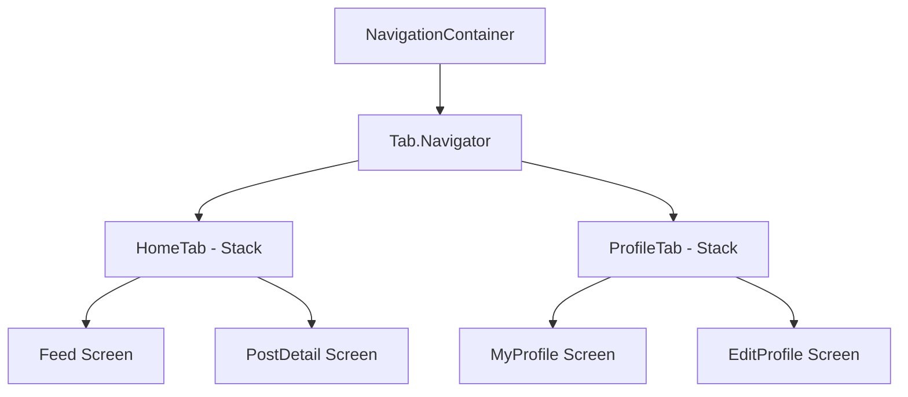
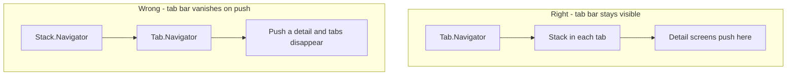
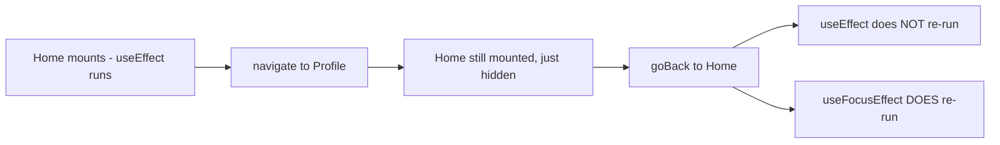
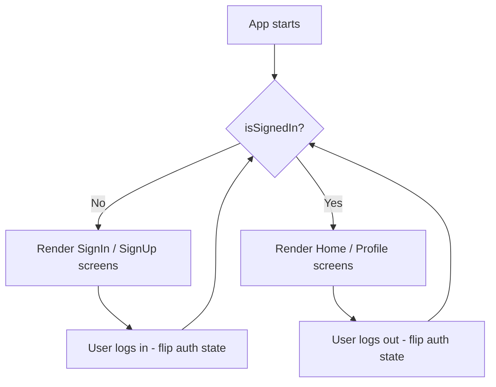
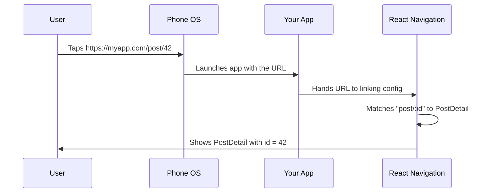
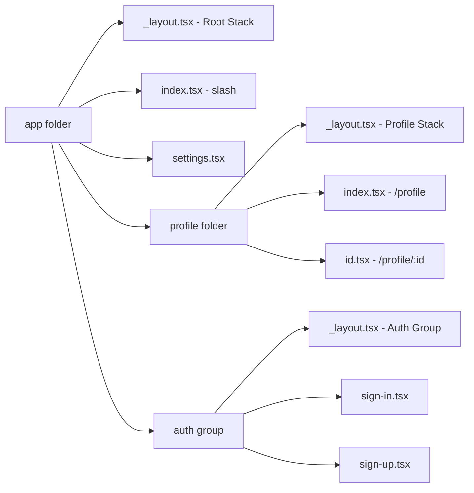
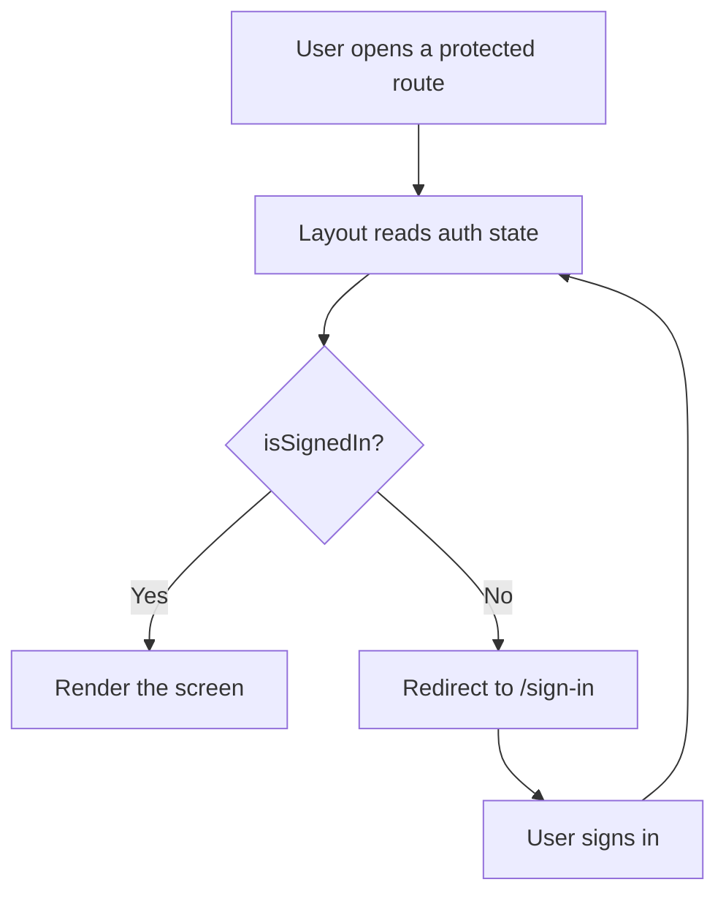
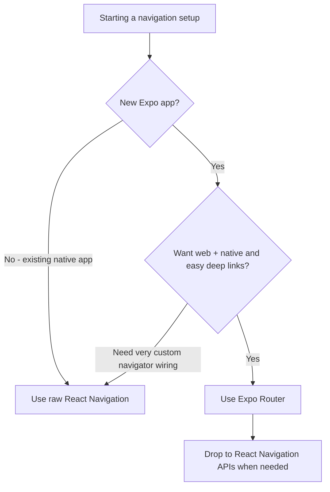

# N.` headings exactly while expanding each section, removing hardcoded mermaid colors, and adding diagrams.

# Navigation: Stacks, Tabs, and Deep Links

> How screens connect in mobile — React Navigation v7, Expo Router, and the patterns that replace URL-based routing.

---

## Table of Contents

1. [React Navigation v7](#1-react-navigation-v7)
2. [Concepts to Master](#2-concepts-to-master)
3. [Expo Router](#3-expo-router)

---

## 1. React Navigation v7

On the web, navigation is simple: the browser has a URL bar, you change the URL, a new page appears. There is no URL bar on a phone. There is no browser history stack managed for you. When a user taps a row in a list and a detail screen slides in from the right, *your code* is responsible for that animation, the gesture to swipe back, the memory of where the user came from, and what happens when they press the hardware back button on Android.

React Navigation is the library that handles all of this. It has been the community standard since 2017, and version 7 (released with React Navigation 7.x) brought static configuration, better TypeScript support, and tighter Expo integration. If you are building a React Native app in 2025+, this is what you use.

### The Mental Model: A Stack of Cards

The word "stack" is literal. Think of a deck of cards on a table. Every time you navigate to a new screen, you place a new card *on top* of the pile. The screen the user sees is always the top card. When they press back (or swipe), you remove the top card and the one underneath is revealed again — exactly where they left it.

This is the same data structure as the browser's history. The difference is what you push onto it:

| Concept | Web (browser) | React Navigation (native) |
| --- | --- | --- |
| The "page" identifier | A URL string (`/profile/42`) | A screen name + params object (`"Profile", { id: 42 }`) |
| Who manages history | The browser, for free | The library, which you configure |
| Going back | Browser back button / `history.back()` | Swipe gesture, header arrow, Android hardware button, or `navigation.goBack()` |
| The animation | Instant page swap | A native push/pop transition you get for free |

> **Analogy:** A `Stack.Navigator` is like a pile of papers on a desk. `navigate`/`push` drops a new sheet on top; `goBack`/`pop` lifts the top sheet off. The user only ever reads the sheet on top, but the whole pile is still there underneath, remembering its scroll position and form input.

### Installation

```bash
# Core + native stack (the one you almost always want)
npx expo install @react-navigation/native @react-navigation/native-stack

# Required peer dependencies in Expo
npx expo install react-native-screens react-native-safe-area-context
```

If you also need tabs or a drawer:

```bash
npx expo install @react-navigation/bottom-tabs
npx expo install @react-navigation/drawer react-native-gesture-handler react-native-reanimated
npx expo install @react-navigation/material-top-tabs react-native-tab-view react-native-pager-view
```

> **Why `npx expo install` and not `npm install`?** `expo install` picks the exact dependency version that matches your Expo SDK. Navigation libraries lean on native modules (`react-native-screens`, `reanimated`) whose versions must line up with the SDK, or the app crashes on launch. Plain `npm install` grabs the newest version, which may be incompatible.

> **Why `native-stack` instead of `stack`?** The `@react-navigation/native-stack` navigator uses the platform's native navigation primitives (`UINavigationController` on iOS, `Fragment` on Android). This gives you 60fps push/pop transitions for free. The older JS-based `@react-navigation/stack` renders everything in React — useful if you need heavy customization, but slower. Default to native stack.

| Navigator | Rendered by | Speed | Use when |
| --- | --- | --- | --- |
| `native-stack` | Native OS primitives | Fastest (60fps free) | Almost always — the default choice |
| `stack` (JS) | React + Reanimated | Slower | You need fully custom transitions/gestures the native one can't do |
| `bottom-tabs` | Native tab bar | Fast | A persistent bar at the bottom (Home / Search / Profile) |
| `drawer` | JS + gesture handler | Medium | A slide-in side menu (hamburger menu) |
| `material-top-tabs` | Pager view | Fast | Swipeable tabs at the top (like Twitter's Following/For You) |

### Your First Navigator

```tsx
import { NavigationContainer } from "@react-navigation/native";
import { createNativeStackNavigator } from "@react-navigation/native-stack";

// 1. Define param types for every screen
type RootStackParamList = {
  Home: undefined;
  Profile: { userId: string };
  Settings: undefined;
};

const Stack = createNativeStackNavigator<RootStackParamList>();

export default function App() {
  return (
    <NavigationContainer>
      <Stack.Navigator initialRouteName="Home">
        <Stack.Screen name="Home" component={HomeScreen} />
        <Stack.Screen name="Profile" component={ProfileScreen} />
        <Stack.Screen name="Settings" component={SettingsScreen} />
      </Stack.Navigator>
    </NavigationContainer>
  );
}
```

The `NavigationContainer` is the root — it manages the navigation state tree. You only ever render one of these, at the top of your app. Every navigator (`Stack.Navigator`, `Tab.Navigator`, etc.) lives inside it.

> **Think of `<Stack.Screen>` as a *registration*, not a render.** Listing a screen does not mount it. It tells the navigator "this name is allowed, and here is the component to mount *when someone navigates to it*." Only the active screen (and recently-visited ones) are actually mounted. This is why declaring 30 screens has near-zero startup cost.

### Moving Between Screens

Inside any screen component you get a `navigation` object (via props or the `useNavigation` hook). These are the verbs you'll use constantly:

```tsx
import { useNavigation } from "@react-navigation/native";

function HomeScreen() {
  const navigation = useNavigation();

  return (
    <>
      {/* Go to Profile, passing data via params */}
      <Button title="Open profile" onPress={() => navigation.navigate("Profile", { userId: "42" })} />

      {/* Always push a NEW card, even if Profile is already showing */}
      <Button title="Push profile" onPress={() => navigation.push("Profile", { userId: "43" })} />

      {/* Remove the top card */}
      <Button title="Back" onPress={() => navigation.goBack()} />

      {/* Jump all the way back to the first screen in this stack */}
      <Button title="Home" onPress={() => navigation.popToTop()} />
    </>
  );
}
```

> **`navigate` vs `push` — a classic gotcha.** `navigate("Profile")` is smart: if a Profile screen is already in the stack, it jumps back to it instead of stacking a duplicate. `push("Profile")` always adds a new copy on top. For a "next chapter" or "reply to a reply" flow where the same screen type stacks on itself, you want `push`. For normal navigation, prefer `navigate`.

### Bottom Tabs

Most apps combine a tab bar with stacks inside each tab. Here is the pattern:

```tsx
import { createBottomTabNavigator } from "@react-navigation/bottom-tabs";
import { createNativeStackNavigator } from "@react-navigation/native-stack";

const Tab = createBottomTabNavigator();
const HomeStack = createNativeStackNavigator();
const ProfileStack = createNativeStackNavigator();

function HomeStackScreen() {
  return (
    <HomeStack.Navigator>
      <HomeStack.Screen name="Feed" component={FeedScreen} />
      <HomeStack.Screen name="PostDetail" component={PostDetailScreen} />
    </HomeStack.Navigator>
  );
}

function ProfileStackScreen() {
  return (
    <ProfileStack.Navigator>
      <ProfileStack.Screen name="MyProfile" component={MyProfileScreen} />
      <ProfileStack.Screen name="EditProfile" component={EditProfileScreen} />
    </ProfileStack.Navigator>
  );
}

export default function App() {
  return (
    <NavigationContainer>
      <Tab.Navigator>
        <Tab.Screen
          name="HomeTab"
          component={HomeStackScreen}
          options={{ headerShown: false }}
        />
        <Tab.Screen
          name="ProfileTab"
          component={ProfileStackScreen}
          options={{ headerShown: false }}
        />
      </Tab.Navigator>
    </NavigationContainer>
  );
}
```

> Set `headerShown: false` on the tab screens when each tab contains its own stack navigator — otherwise you get a double header. The outer tab navigator wants to draw a header, and so does the inner stack, giving you two stacked title bars.



This diagram is the mental model you need: **NavigationContainer wraps a Tab Navigator, and each tab wraps a Stack Navigator.** Navigators nest. Stacks go inside tabs. Tabs go inside drawers. Drawers go inside the container. The composition is what gives mobile apps their multi-layered navigation feel.

Here is what nesting actually buys you: each tab keeps its *own independent history*. If you drill from Feed into a PostDetail in the Home tab, switch to the Profile tab, then switch back — the Home tab is still showing PostDetail, right where you left it. Each tab is a separate pile of cards.

### Common Gotcha: Navigator Nesting Order

A frequent mistake is putting Tabs inside a Stack. This works technically, but it means the tab bar disappears when you push a new screen onto the stack. Usually you want Stacks *inside* Tabs so the tab bar stays visible as users drill into sub-screens. The rule: **the navigator whose UI you want persistently visible should be the outer one.**



> **Decision rule of thumb:** ask "should this UI chrome stay on screen while the user drills deeper?" If yes (tab bar, drawer handle), it goes *outside*. If it should slide away to give the detail screen the whole display (a full-screen article, a checkout flow), put the stack outside and the persistent UI inside it.

---

## 2. Concepts to Master

### Route Params and Typed Navigation

Passing data between screens is done through route params, not props. This is the biggest mental shift from web React where you might pass state through context or URL query strings.

```tsx
// Navigating with params
navigation.navigate("Profile", { userId: "abc-123" });

// Reading params in the target screen
import { NativeStackScreenProps } from "@react-navigation/native-stack";

type Props = NativeStackScreenProps<RootStackParamList, "Profile">;

function ProfileScreen({ route }: Props) {
  const { userId } = route.params;
  // ...
}
```

Why params and not props? You never *render* `<ProfileScreen userId="..." />` yourself — the navigator does that, somewhere deep inside its own tree, possibly long after you called `navigate`. Params are the channel the library gives you to hand data across that gap. On the web you'd encode this in the URL (`/profile?userId=abc-123`); in RN, params are that payload, but they can be any serializable object, not just strings.

> **Keep params small — pass IDs, not whole objects.** Params can end up serialized into deep-link URLs and saved in state. Passing a giant object (or worse, a function or a class instance) bloats navigation state and breaks deep linking. Pattern: pass `{ userId }`, then fetch the full user on the target screen (often from a cache, so it's instant).

**Always define your param list types.** Without them, you will pass the wrong params, misspell a screen name, or forget a required field — and nothing will warn you until runtime. The `RootStackParamList` type shown earlier is not optional overhead; it is how you make navigation safe.

```tsx
// Make useNavigation typed everywhere by declaring a global type once:
declare global {
  namespace ReactNavigation {
    interface RootParamList extends RootStackParamList {}
  }
}

// Now this is fully type-checked with no extra annotations:
const navigation = useNavigation();
navigation.navigate("Profile", { userId: "abc-123" }); // ✅ typed
navigation.navigate("Profile", { userld: "abc-123" }); // ❌ TS error: typo + wrong key
```

### useFocusEffect vs useEffect

This trips up every React web developer. On the web, navigating to a new page unmounts the old one. In React Navigation, **screens stay mounted when you navigate away from them.** When you go from Home to Profile and then back to Home, the Home component was never unmounted — `useEffect` with `[]` dependencies will not re-run.

This is a *feature*: it's why the previous screen remembers its scroll position and form state. But it means "run this when the user looks at this screen" is no longer the same as "run this on mount."



```tsx
import { useFocusEffect } from "@react-navigation/native";
import { useCallback } from "react";

function HomeScreen() {
  useFocusEffect(
    useCallback(() => {
      // Runs every time this screen comes into focus
      fetchLatestData();

      return () => {
        // Cleanup when screen loses focus (user navigates away)
      };
    }, [])
  );
}
```

> **Always wrap the callback in `useCallback`.** `useFocusEffect` re-subscribes whenever the callback identity changes. Pass an inline function and it re-runs on *every render*, often causing infinite loops. The `useCallback` with a stable dependency array is mandatory, not stylistic.

| Hook | Fires when | Use for |
| --- | --- | --- |
| `useEffect(fn, [])` | Once, on mount | One-time setup: subscriptions, analytics "screen created" |
| `useFocusEffect` | Every time the screen gains focus | Refreshing data, starting/stopping a timer or video |
| `useIsFocused()` | Returns a boolean you can read in render | Conditionally pausing animations/renders while off-screen |

### Auth Flow Pattern

The standard pattern for auth in React Navigation is **conditional navigator rendering** — you swap the entire navigator tree based on auth state:

```tsx
function RootNavigator() {
  const { isSignedIn } = useAuth();

  return (
    <Stack.Navigator>
      {isSignedIn ? (
        <>
          <Stack.Screen name="Home" component={HomeScreen} />
          <Stack.Screen name="Profile" component={ProfileScreen} />
        </>
      ) : (
        <>
          <Stack.Screen name="SignIn" component={SignInScreen} />
          <Stack.Screen name="SignUp" component={SignUpScreen} />
        </>
      )}
    </Stack.Navigator>
  );
}
```

React Navigation detects that the screen list changed and plays an appropriate transition automatically. Do not try to `navigate("Home")` after login — just flip the auth state and the library handles the rest. This is cleaner and prevents the user from pressing back to reach the login screen after signing in.



> **Why this beats `navigate('Home')`.** If you imperatively navigate after login, the SignIn screen stays in the back stack — press back and you're at the login form again, confusingly. By swapping the *screen list*, the old screens stop existing entirely. There is nothing to go "back" to. The state drives the UI; you don't drive the navigation by hand.

### Modal vs Card Presentation

Native stack supports two presentation modes. The default (`card`) is a horizontal push on iOS, a bottom-to-top slide on Android. Setting `presentation: "modal"` gives you a vertical slide-up with a card-style appearance on iOS (the previous screen shrinks slightly behind it).

```tsx
<Stack.Screen
  name="CreatePost"
  component={CreatePostScreen}
  options={{ presentation: "modal" }}
/>
```

Use modals for self-contained flows: creating a new item, selecting a photo, confirming a destructive action. Use card for drilling deeper into content.

| Presentation | Animation | Mental model | Use for |
| --- | --- | --- | --- |
| `card` (default) | Slide in from the side | "Going deeper" into content | List → detail → sub-detail |
| `modal` | Slide up from the bottom | "Stepping aside" to do one task | Compose, create, pick, confirm |
| `transparentModal` | Fades in over the screen | A floating overlay | Custom dialogs, tooltips, sheets |
| `containedModal` / `fullScreenModal` | Platform modal variants | Fine-tuning the native feel | Forcing modal style on Android |

> **UX heuristic:** if the user is *making something or making a choice* and might cancel, it's a modal (it has a "Cancel"/"X" affordance and slides up). If they're *exploring further into existing content*, it's a card (it has a back arrow and slides sideways). Matching this convention makes your app feel native without the user thinking about it.

### Deep Linking

Deep linking lets external URLs (like `myapp://profile/123` or `https://myapp.com/profile/123`) open specific screens in your app. The configuration maps URL patterns to screen names:

```tsx
const linking = {
  prefixes: ["myapp://", "https://myapp.com"],
  config: {
    screens: {
      HomeTab: {
        screens: {
          Feed: "feed",
          PostDetail: "post/:id",
        },
      },
      ProfileTab: {
        screens: {
          MyProfile: "profile",
        },
      },
    },
  },
};

<NavigationContainer linking={linking}>
  {/* ... */}
</NavigationContainer>
```

The `config.screens` object *mirrors your navigator nesting*. Because `PostDetail` lives inside `HomeTab`'s stack, the link config nests it the same way. When the OS hands your app the URL `myapp://post/42`, React Navigation walks this map, selects the Home tab, pushes PostDetail, and parses `42` into `route.params.id` — reconstructing the whole stack so the back button works correctly.



There are two flavors of deep link, and the difference matters:

| Type | Example | Works without setup? | Notes |
| --- | --- | --- | --- |
| Custom scheme | `myapp://post/42` | Yes (just declare the scheme) | Only works if the app is installed; ugly URLs |
| Universal / App Links | `https://myapp.com/post/42` | No — needs server files | Real https URLs; fall back to website if app not installed |

> **Universal Links (iOS) and App Links (Android)** require server-side configuration (an `apple-app-site-association` file or `assetlinks.json`). The React Navigation config alone is not enough — it only tells the library how to parse the URL once the OS hands it to your app. Setting up the server-side files is what makes `https://myapp.com/post/42` open your app instead of the browser. The host file proves to the OS that you own the domain, so it's allowed to route the link into your app.

### Header and Tab Bar Customization

Customizing headers is done through `options` (per screen) or `screenOptions` (for the whole navigator). `options` overrides `screenOptions`, the same way an inline style overrides a shared one.

```tsx
<Stack.Navigator
  screenOptions={{
    headerStyle: { backgroundColor: "#0f3460" },
    headerTintColor: "#fff",
    headerTitleStyle: { fontWeight: "bold" },
  }}
>
  <Stack.Screen
    name="Home"
    component={HomeScreen}
    options={{
      headerRight: () => (
        <Pressable onPress={openSettings}>
          <Ionicons name="settings-outline" size={24} color="#fff" />
        </Pressable>
      ),
    }}
  />
</Stack.Navigator>
```

Often you need header options that depend on the screen's own state (a save button that's disabled until a form is valid). Set them imperatively from inside the screen:

```tsx
function EditProfileScreen({ navigation }: Props) {
  const [name, setName] = useState("");

  // Re-runs whenever `name` changes, updating the header button live
  useLayoutEffect(() => {
    navigation.setOptions({
      headerRight: () => (
        <Button title="Save" disabled={name.length === 0} onPress={save} />
      ),
    });
  }, [navigation, name]);
}
```

For custom tab bars, use the `tabBar` prop on the Tab Navigator:

```tsx
<Tab.Navigator
  tabBar={(props) => <MyCustomTabBar {...props} />}
>
  {/* ... */}
</Tab.Navigator>
```

This gives you full control over the tab bar UI while React Navigation still manages the state and screen switching. The `props` object carries everything you need: the list of routes, which one is focused (`props.state.index`), and a `navigation` object to switch tabs on press. You draw the pixels; React Navigation keeps the state.

> **Pro tip — respect the safe area.** Custom headers and tab bars can render under the notch, status bar, or home indicator. Wrap them with `useSafeAreaInsets()` from `react-native-safe-area-context` and pad by `insets.top` / `insets.bottom`, or content will be clipped on devices with rounded corners and notches. The default headers handle this for you; custom ones do not.

---

## 3. Expo Router

Expo Router takes everything React Navigation does and wraps it in a file-system routing convention inspired by Next.js. Instead of defining navigators in code, you create files in an `app/` directory and the router generates the navigation tree automatically.

**If you are starting a new Expo project, use Expo Router.** It is the default in `create-expo-app`, it works with React Navigation under the hood, and it gives you deep linking, typed routes, and universal (web + native) support out of the box.

The key idea: **your folder structure *is* your navigation config.** Where React Navigation makes you hand-write the nested `<Stack.Screen>` tree, Expo Router infers it from the files on disk. If you've used Next.js or Remix, this will feel immediately familiar — it's the same convention applied to native apps.

| | Raw React Navigation | Expo Router |
| --- | --- | --- |
| Define routes by | Writing `<Stack.Screen>` in code | Creating files in `app/` |
| Navigate with | Screen names + param objects | URL strings (`/profile/42`) |
| Deep linking | Manual `linking` config | Automatic, from file paths |
| Web support | Extra setup | Built in |
| Best for | Brownfield, full manual control | New apps, web+native, less boilerplate |

### File Structure = Route Structure

```
app/
  _layout.tsx          → Root layout (wraps everything)
  index.tsx            → "/" (Home screen)
  settings.tsx         → "/settings"
  profile/
    _layout.tsx        → Layout for profile section
    index.tsx          → "/profile"
    [id].tsx           → "/profile/123" (dynamic route)
  (auth)/
    _layout.tsx        → Auth group layout
    sign-in.tsx        → "/sign-in"
    sign-up.tsx        → "/sign-up"
```

The naming rules are worth memorizing, because the filename *is* the API:

| File / folder name | Meaning |
| --- | --- |
| `index.tsx` | The route for the folder itself (`/` or `/profile`) |
| `settings.tsx` | A named route (`/settings`) |
| `[id].tsx` | A dynamic segment — matches any value, exposed as a param |
| `[...rest].tsx` | Catch-all — matches `/a/b/c` into an array |
| `_layout.tsx` | The navigator/wrapper for everything in this folder |
| `(group)/` | A group — organizes files without adding to the URL |
| `+not-found.tsx` | The 404 screen for unmatched routes |



### Layout Routes

The `_layout.tsx` file in any directory defines the navigator for that level. It's the Expo Router equivalent of a `Stack.Navigator` or `Tab.Navigator` — but instead of listing screens as children, it just declares the navigator and the router fills in the screens from the sibling files. The root layout typically sets up your main navigation:

```tsx
// app/_layout.tsx
import { Stack } from "expo-router";

export default function RootLayout() {
  return (
    <Stack>
      <Stack.Screen name="index" options={{ title: "Home" }} />
      <Stack.Screen name="settings" options={{ title: "Settings" }} />
      <Stack.Screen name="profile" options={{ headerShown: false }} />
      <Stack.Screen name="(auth)" options={{ headerShown: false }} />
    </Stack>
  );
}
```

Layouts also persist across navigation, just like a layout component in Next.js. A `_layout.tsx` that renders a header, a context provider, or an auth guard wraps *every* screen in its folder and below — and it does not re-mount when you move between those screens. This is the natural home for things that should outlive individual screens (a cart provider, a websocket connection, a theme).

For a tab-based layout:

```tsx
// app/(tabs)/_layout.tsx
import { Tabs } from "expo-router";

export default function TabLayout() {
  return (
    <Tabs>
      <Tabs.Screen
        name="index"
        options={{ title: "Home", tabBarIcon: ({ color }) => (
          <Ionicons name="home" size={24} color={color} />
        )}}
      />
      <Tabs.Screen
        name="search"
        options={{ title: "Search", tabBarIcon: ({ color }) => (
          <Ionicons name="search" size={24} color={color} />
        )}}
      />
    </Tabs>
  );
}
```

### Dynamic Routes

Square brackets in the filename create dynamic segments — exactly like Next.js:

```tsx
// app/profile/[id].tsx
import { useLocalSearchParams } from "expo-router";

export default function ProfileScreen() {
  const { id } = useLocalSearchParams<{ id: string }>();

  return <Text>Profile for user {id}</Text>;
}
```

Navigating to this screen:

```tsx
import { Link } from "expo-router";

// Declarative
<Link href="/profile/abc-123">View Profile</Link>

// Imperative
import { router } from "expo-router";
router.push("/profile/abc-123");
```

Notice the difference from React Navigation: you navigate with **URL strings**, not screen names and param objects. This is the key insight — Expo Router brings the web's URL-based navigation model to native.

> **`useLocalSearchParams` vs `useGlobalSearchParams`.** `useLocalSearchParams` returns the params for *this* screen and only re-renders when this screen is focused — almost always what you want. `useGlobalSearchParams` reads the params of the currently active route from anywhere and re-renders on every navigation change, which can cause surprise re-renders. Reach for `useLocalSearchParams` by default.

> **Passing extra data alongside a path.** You can attach query params just like the web: `router.push({ pathname: "/profile/[id]", params: { id: "42", from: "feed" } })`. Both `id` and `from` arrive in `useLocalSearchParams`. Keep them small and serializable — same rule as React Navigation params, since these literally become part of a URL.

### Groups

Parenthesized folder names like `(auth)` or `(tabs)` create **route groups**. They affect layout organization but do not appear in the URL. This is how you split your app into logical sections with different navigators without polluting the URL structure.

For example, `app/(tabs)/index.tsx` is still just `/`, not `/tabs` — the `(tabs)` folder exists only so you can give those screens a shared tab-bar layout. Groups are purely an organizational tool for *you*; the user never sees them in a URL.

The auth pattern in Expo Router uses groups and conditional redirects:

```tsx
// app/(auth)/_layout.tsx
import { Redirect, Stack } from "expo-router";
import { useAuth } from "../hooks/useAuth";

export default function AuthLayout() {
  const { isSignedIn } = useAuth();

  if (isSignedIn) {
    return <Redirect href="/" />;
  }

  return <Stack />;
}
```



> **`<Redirect>` vs imperative `router.replace()`.** Returning `<Redirect href="/" />` from a layout is declarative — the redirect is part of render, so there's no flash of the wrong screen and no race condition. Calling `router.replace()` inside `useEffect` runs *after* the wrong screen has already painted. For auth guards, prefer the declarative `<Redirect>`.

### Typed Routes

Expo Router can generate route types automatically. Enable it in your config:

```json
// tsconfig.json (or app.json)
{
  "compilerOptions": {
    "strict": true
  }
}
```

Then in `app.json`:

```json
{
  "expo": {
    "experiments": {
      "typedRoutes": true
    }
  }
}
```

Once enabled, `router.push("/profle/123")` (note the typo) becomes a TypeScript error. This catches broken navigation links at build time rather than when a user taps a button and nothing happens.

> **How it works:** Expo Router scans your `app/` folder and generates a type listing every valid path (including dynamic ones like `/profile/[id]`). `Link href` and `router.push` are typed against that union, so a path that doesn't correspond to a real file simply won't compile. It's the file-based equivalent of the `RootStackParamList` you'd hand-write in React Navigation — except you get it for free, and it can never drift out of sync with your actual screens.

### When to Use Expo Router vs Raw React Navigation

Use **Expo Router** when: you are building a new Expo app, you want deep linking with zero configuration, you like file-based routing conventions, or you are targeting web and native from the same codebase.

Use **raw React Navigation** when: you have a brownfield app (React Native added to an existing native app), you need navigation patterns Expo Router does not yet support, or you need fine-grained control over navigator instantiation.



In practice, most new projects should start with Expo Router. It is less boilerplate, deep links just work, and you can always drop down to React Navigation APIs when needed because Expo Router *is* React Navigation underneath. That last point is the reassuring one: choosing Expo Router doesn't lock you out of anything — `useNavigation`, `useFocusEffect`, and the rest still work, because you're using the same engine with a friendlier front door.

> **Common mistake with Expo Router:** Forgetting to add screens to the `_layout.tsx`. If you create `app/notifications.tsx` but do not list it in the nearest `_layout.tsx`, the route may not work as expected. Every route file needs a corresponding entry in its parent layout — or use the `<Stack>` component without explicit children to auto-discover them.

---