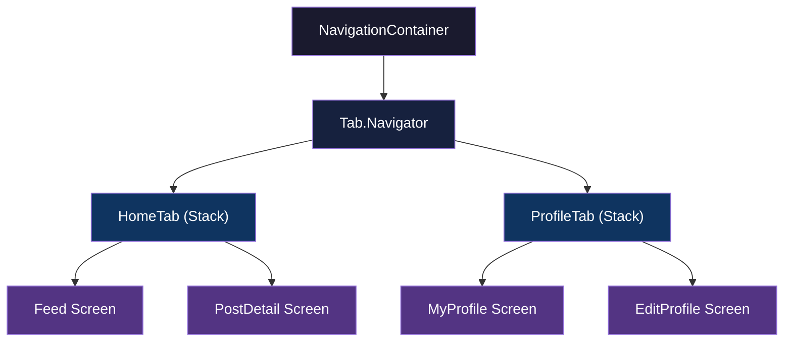
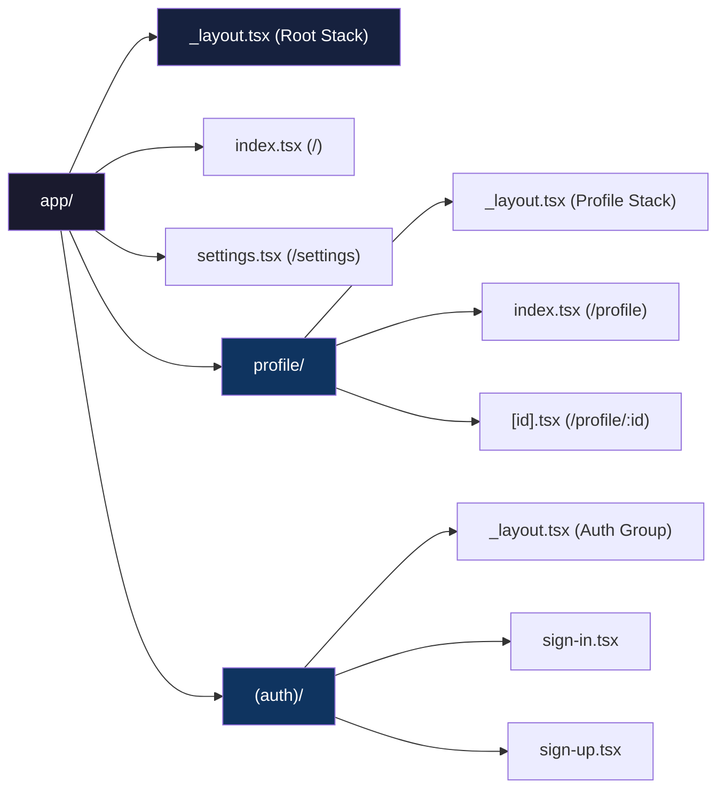

# Navigation: Stacks, Tabs, and Deep Links

> How screens connect in mobile — React Navigation v7, Expo Router, and the patterns that replace URL-based routing.

---

## Table of Contents

1. [React Navigation v7](#1-react-navigation-v7)
2. [Concepts to Master](#2-concepts-to-master)
3. [Expo Router](#3-expo-router)

---

## 1. React Navigation v7

On the web, navigation is simple: the browser has a URL bar, you change the URL, a new page appears. There is no URL bar on a phone. There is no browser history stack managed for you. When a user taps a row in a list and a detail screen slides in from the right, *your code* is responsible for that animation, the gesture to swipe back, the memory of where the user came from, and what happens when they press the hardware back button on Android.

React Navigation is the library that handles all of this. It has been the community standard since 2017, and version 7 (released with React Navigation 7.x) brought static configuration, better TypeScript support, and tighter Expo integration. If you are building a React Native app in 2025+, this is what you use.

### Installation

```bash
# Core + native stack (the one you almost always want)
npx expo install @react-navigation/native @react-navigation/native-stack

# Required peer dependencies in Expo
npx expo install react-native-screens react-native-safe-area-context
```

If you also need tabs or a drawer:

```bash
npx expo install @react-navigation/bottom-tabs
npx expo install @react-navigation/drawer react-native-gesture-handler react-native-reanimated
npx expo install @react-navigation/material-top-tabs react-native-tab-view react-native-pager-view
```

> **Why `native-stack` instead of `stack`?** The `@react-navigation/native-stack` navigator uses the platform's native navigation primitives (`UINavigationController` on iOS, `Fragment` on Android). This gives you 60fps push/pop transitions for free. The older JS-based `@react-navigation/stack` renders everything in React — useful if you need heavy customization, but slower. Default to native stack.

### Your First Navigator

```tsx
import { NavigationContainer } from "@react-navigation/native";
import { createNativeStackNavigator } from "@react-navigation/native-stack";

// 1. Define param types for every screen
type RootStackParamList = {
  Home: undefined;
  Profile: { userId: string };
  Settings: undefined;
};

const Stack = createNativeStackNavigator<RootStackParamList>();

export default function App() {
  return (
    <NavigationContainer>
      <Stack.Navigator initialRouteName="Home">
        <Stack.Screen name="Home" component={HomeScreen} />
        <Stack.Screen name="Profile" component={ProfileScreen} />
        <Stack.Screen name="Settings" component={SettingsScreen} />
      </Stack.Navigator>
    </NavigationContainer>
  );
}
```

The `NavigationContainer` is the root — it manages the navigation state tree. You only ever render one of these, at the top of your app. Every navigator (`Stack.Navigator`, `Tab.Navigator`, etc.) lives inside it.

### Bottom Tabs

Most apps combine a tab bar with stacks inside each tab. Here is the pattern:

```tsx
import { createBottomTabNavigator } from "@react-navigation/bottom-tabs";
import { createNativeStackNavigator } from "@react-navigation/native-stack";

const Tab = createBottomTabNavigator();
const HomeStack = createNativeStackNavigator();
const ProfileStack = createNativeStackNavigator();

function HomeStackScreen() {
  return (
    <HomeStack.Navigator>
      <HomeStack.Screen name="Feed" component={FeedScreen} />
      <HomeStack.Screen name="PostDetail" component={PostDetailScreen} />
    </HomeStack.Navigator>
  );
}

function ProfileStackScreen() {
  return (
    <ProfileStack.Navigator>
      <ProfileStack.Screen name="MyProfile" component={MyProfileScreen} />
      <ProfileStack.Screen name="EditProfile" component={EditProfileScreen} />
    </ProfileStack.Navigator>
  );
}

export default function App() {
  return (
    <NavigationContainer>
      <Tab.Navigator>
        <Tab.Screen
          name="HomeTab"
          component={HomeStackScreen}
          options={{ headerShown: false }}
        />
        <Tab.Screen
          name="ProfileTab"
          component={ProfileStackScreen}
          options={{ headerShown: false }}
        />
      </Tab.Navigator>
    </NavigationContainer>
  );
}
```

> Set `headerShown: false` on the tab screens when each tab contains its own stack navigator — otherwise you get a double header.



This diagram is the mental model you need: **NavigationContainer wraps a Tab Navigator, and each tab wraps a Stack Navigator.** Navigators nest. Stacks go inside tabs. Tabs go inside drawers. Drawers go inside the container. The composition is what gives mobile apps their multi-layered navigation feel.

### Common Gotcha: Navigator Nesting Order

A frequent mistake is putting Tabs inside a Stack. This works technically, but it means the tab bar disappears when you push a new screen onto the stack. Usually you want Stacks *inside* Tabs so the tab bar stays visible as users drill into sub-screens. The rule: **the navigator whose UI you want persistently visible should be the outer one.**

---

## 2. Concepts to Master

### Route Params and Typed Navigation

Passing data between screens is done through route params, not props. This is the biggest mental shift from web React where you might pass state through context or URL query strings.

```tsx
// Navigating with params
navigation.navigate("Profile", { userId: "abc-123" });

// Reading params in the target screen
import { NativeStackScreenProps } from "@react-navigation/native-stack";

type Props = NativeStackScreenProps<RootStackParamList, "Profile">;

function ProfileScreen({ route }: Props) {
  const { userId } = route.params;
  // ...
}
```

**Always define your param list types.** Without them, you will pass the wrong params, misspell a screen name, or forget a required field — and nothing will warn you until runtime. The `RootStackParamList` type shown earlier is not optional overhead; it is how you make navigation safe.

### useFocusEffect vs useEffect

This trips up every React web developer. On the web, navigating to a new page unmounts the old one. In React Navigation, **screens stay mounted when you navigate away from them.** When you go from Home to Profile and then back to Home, the Home component was never unmounted — `useEffect` with `[]` dependencies will not re-run.

```tsx
import { useFocusEffect } from "@react-navigation/native";
import { useCallback } from "react";

function HomeScreen() {
  useFocusEffect(
    useCallback(() => {
      // Runs every time this screen comes into focus
      fetchLatestData();

      return () => {
        // Cleanup when screen loses focus
      };
    }, [])
  );
}
```

Use `useFocusEffect` when you need to refresh data on screen focus. Use `useEffect` for one-time setup that should only happen on mount.

### Auth Flow Pattern

The standard pattern for auth in React Navigation is **conditional navigator rendering** — you swap the entire navigator tree based on auth state:

```tsx
function RootNavigator() {
  const { isSignedIn } = useAuth();

  return (
    <Stack.Navigator>
      {isSignedIn ? (
        <>
          <Stack.Screen name="Home" component={HomeScreen} />
          <Stack.Screen name="Profile" component={ProfileScreen} />
        </>
      ) : (
        <>
          <Stack.Screen name="SignIn" component={SignInScreen} />
          <Stack.Screen name="SignUp" component={SignUpScreen} />
        </>
      )}
    </Stack.Navigator>
  );
}
```

React Navigation detects that the screen list changed and plays an appropriate transition automatically. Do not try to `navigate("Home")` after login — just flip the auth state and the library handles the rest. This is cleaner and prevents the user from pressing back to reach the login screen after signing in.

### Modal vs Card Presentation

Native stack supports two presentation modes. The default (`card`) is a horizontal push on iOS, a bottom-to-top slide on Android. Setting `presentation: "modal"` gives you a vertical slide-up with a card-style appearance on iOS (the previous screen shrinks slightly behind it).

```tsx
<Stack.Screen
  name="CreatePost"
  component={CreatePostScreen}
  options={{ presentation: "modal" }}
/>
```

Use modals for self-contained flows: creating a new item, selecting a photo, confirming a destructive action. Use card for drilling deeper into content.

### Deep Linking

Deep linking lets external URLs (like `myapp://profile/123` or `https://myapp.com/profile/123`) open specific screens in your app. The configuration maps URL patterns to screen names:

```tsx
const linking = {
  prefixes: ["myapp://", "https://myapp.com"],
  config: {
    screens: {
      HomeTab: {
        screens: {
          Feed: "feed",
          PostDetail: "post/:id",
        },
      },
      ProfileTab: {
        screens: {
          MyProfile: "profile",
        },
      },
    },
  },
};

<NavigationContainer linking={linking}>
  {/* ... */}
</NavigationContainer>
```

> **Universal Links (iOS) and App Links (Android)** require server-side configuration (an `apple-app-site-association` file or `assetlinks.json`). The React Navigation config alone is not enough — it only tells the library how to parse the URL once the OS hands it to your app. Setting up the server-side files is what makes `https://myapp.com/post/42` open your app instead of the browser.

### Header and Tab Bar Customization

Customizing headers is done through `options` or `screenOptions`:

```tsx
<Stack.Navigator
  screenOptions={{
    headerStyle: { backgroundColor: "#0f3460" },
    headerTintColor: "#fff",
    headerTitleStyle: { fontWeight: "bold" },
  }}
>
  <Stack.Screen
    name="Home"
    component={HomeScreen}
    options={{
      headerRight: () => (
        <Pressable onPress={openSettings}>
          <Ionicons name="settings-outline" size={24} color="#fff" />
        </Pressable>
      ),
    }}
  />
</Stack.Navigator>
```

For custom tab bars, use the `tabBar` prop on the Tab Navigator:

```tsx
<Tab.Navigator
  tabBar={(props) => <MyCustomTabBar {...props} />}
>
  {/* ... */}
</Tab.Navigator>
```

This gives you full control over the tab bar UI while React Navigation still manages the state and screen switching.

---

## 3. Expo Router

Expo Router takes everything React Navigation does and wraps it in a file-system routing convention inspired by Next.js. Instead of defining navigators in code, you create files in an `app/` directory and the router generates the navigation tree automatically.

**If you are starting a new Expo project, use Expo Router.** It is the default in `create-expo-app`, it works with React Navigation under the hood, and it gives you deep linking, typed routes, and universal (web + native) support out of the box.

### File Structure = Route Structure

```
app/
  _layout.tsx          → Root layout (wraps everything)
  index.tsx            → "/" (Home screen)
  settings.tsx         → "/settings"
  profile/
    _layout.tsx        → Layout for profile section
    index.tsx          → "/profile"
    [id].tsx           → "/profile/123" (dynamic route)
  (auth)/
    _layout.tsx        → Auth group layout
    sign-in.tsx        → "/sign-in"
    sign-up.tsx        → "/sign-up"
```



### Layout Routes

The `_layout.tsx` file in any directory defines the navigator for that level. The root layout typically sets up your main navigation:

```tsx
// app/_layout.tsx
import { Stack } from "expo-router";

export default function RootLayout() {
  return (
    <Stack>
      <Stack.Screen name="index" options={{ title: "Home" }} />
      <Stack.Screen name="settings" options={{ title: "Settings" }} />
      <Stack.Screen name="profile" options={{ headerShown: false }} />
      <Stack.Screen name="(auth)" options={{ headerShown: false }} />
    </Stack>
  );
}
```

For a tab-based layout:

```tsx
// app/(tabs)/_layout.tsx
import { Tabs } from "expo-router";

export default function TabLayout() {
  return (
    <Tabs>
      <Tabs.Screen
        name="index"
        options={{ title: "Home", tabBarIcon: ({ color }) => (
          <Ionicons name="home" size={24} color={color} />
        )}}
      />
      <Tabs.Screen
        name="search"
        options={{ title: "Search", tabBarIcon: ({ color }) => (
          <Ionicons name="search" size={24} color={color} />
        )}}
      />
    </Tabs>
  );
}
```

### Dynamic Routes

Square brackets in the filename create dynamic segments — exactly like Next.js:

```tsx
// app/profile/[id].tsx
import { useLocalSearchParams } from "expo-router";

export default function ProfileScreen() {
  const { id } = useLocalSearchParams<{ id: string }>();

  return <Text>Profile for user {id}</Text>;
}
```

Navigating to this screen:

```tsx
import { Link } from "expo-router";

// Declarative
<Link href="/profile/abc-123">View Profile</Link>

// Imperative
import { router } from "expo-router";
router.push("/profile/abc-123");
```

Notice the difference from React Navigation: you navigate with **URL strings**, not screen names and param objects. This is the key insight — Expo Router brings the web's URL-based navigation model to native.

### Groups

Parenthesized folder names like `(auth)` or `(tabs)` create **route groups**. They affect layout organization but do not appear in the URL. This is how you split your app into logical sections with different navigators without polluting the URL structure.

The auth pattern in Expo Router uses groups and conditional redirects:

```tsx
// app/(auth)/_layout.tsx
import { Redirect, Stack } from "expo-router";
import { useAuth } from "../hooks/useAuth";

export default function AuthLayout() {
  const { isSignedIn } = useAuth();

  if (isSignedIn) {
    return <Redirect href="/" />;
  }

  return <Stack />;
}
```

### Typed Routes

Expo Router can generate route types automatically. Enable it in your config:

```json
// tsconfig.json (or app.json)
{
  "compilerOptions": {
    "strict": true
  }
}
```

Then in `app.json`:

```json
{
  "expo": {
    "experiments": {
      "typedRoutes": true
    }
  }
}
```

Once enabled, `router.push("/profle/123")` (note the typo) becomes a TypeScript error. This catches broken navigation links at build time rather than when a user taps a button and nothing happens.

### When to Use Expo Router vs Raw React Navigation

Use **Expo Router** when: you are building a new Expo app, you want deep linking with zero configuration, you like file-based routing conventions, or you are targeting web and native from the same codebase.

Use **raw React Navigation** when: you have a brownfield app (React Native added to an existing native app), you need navigation patterns Expo Router does not yet support, or you need fine-grained control over navigator instantiation.

In practice, most new projects should start with Expo Router. It is less boilerplate, deep links just work, and you can always drop down to React Navigation APIs when needed because Expo Router *is* React Navigation underneath.

> **Common mistake with Expo Router:** Forgetting to add screens to the `_layout.tsx`. If you create `app/notifications.tsx` but do not list it in the nearest `_layout.tsx`, the route may not work as expected. Every route file needs a corresponding entry in its parent layout — or use the `<Stack>` component without explicit children to auto-discover them.

---