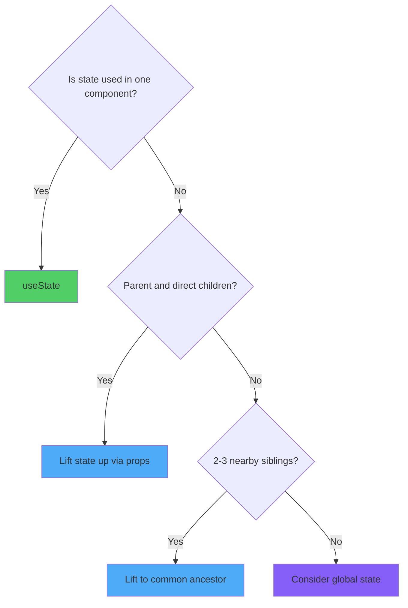
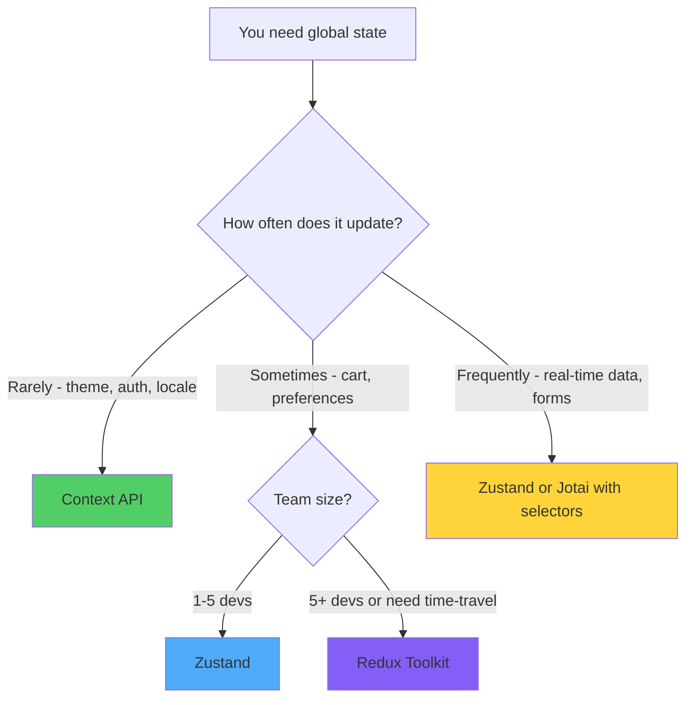
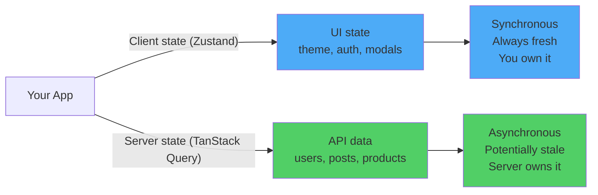
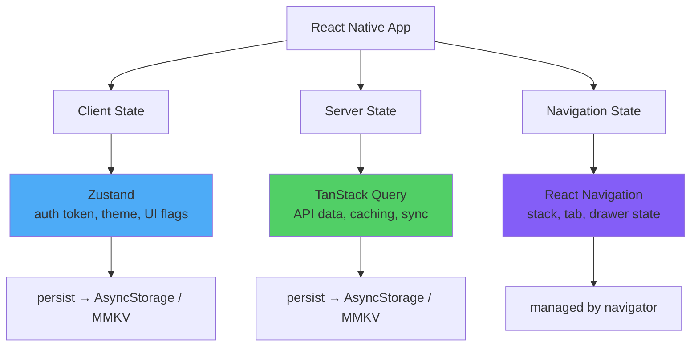

# State Management: Same React, Different Platform

> Local state, global state, and server state in React Native — what transfers from web and what changes.

---

## Table of Contents

1. [Local State](#1-local-state)
2. [Global State](#2-global-state)
3. [Server State](#3-server-state)

---

## 1. Local State

### Everything You Know Still Works

Here is the single most important sentence in this chapter: `useState` and `useReducer` work identically in React Native. No caveats, no asterisks. The component model is the same, the hooks are the same, the rules of hooks are the same. If you already manage local state well on the web, you manage it well on mobile.

The problem is that most developers skip straight to a global store. They install Zustand or Redux before they have written a single screen. On mobile, this hurts more than on the web, because every unnecessary re-render burns battery and drops frames on a 60fps render loop.

### The Colocation Rule

State should live as close as possible to where it is consumed. This is not new advice, but in React Native it is more important because:

1. There is no URL bar to lean on for route state
2. Navigation stacks keep unmounted screens alive in memory
3. Re-renders that are invisible on a desktop browser cause visible jank on a phone



### useState in React Native

```tsx
import { useState } from 'react';
import { View, Text, Pressable, TextInput, StyleSheet } from 'react-native';

// Exactly what you would write on the web, with RN primitives
const Counter = () => {
  const [count, setCount] = useState(0);

  return (
    <View style={styles.container}>
      <Text style={styles.label}>Count: {count}</Text>
      <Pressable onPress={() => setCount(c => c + 1)} style={styles.button}>
        <Text>Increment</Text>
      </Pressable>
    </View>
  );
};

// Form state stays local until submission
const LoginForm = () => {
  const [email, setEmail] = useState('');
  const [password, setPassword] = useState('');

  const handleSubmit = () => {
    // Only touch global auth state after a successful login
    login({ email, password });
  };

  return (
    <View>
      <TextInput
        value={email}
        onChangeText={setEmail}
        placeholder="Email"
        keyboardType="email-address"
        autoCapitalize="none"
      />
      <TextInput
        value={password}
        onChangeText={setPassword}
        placeholder="Password"
        secureTextEntry
      />
      <Pressable onPress={handleSubmit}>
        <Text>Log in</Text>
      </Pressable>
    </View>
  );
};
```

> **Gotcha:** `onChangeText` in React Native gives you the string directly, not an event object. You write `onChangeText={setText}` instead of `onChange={e => setText(e.target.value)}`. This is one of the few ergonomic wins mobile has over the web.

### useReducer for Complex Local State

When a single component owns multiple interrelated values, `useReducer` keeps updates predictable. This transfers from web React one-to-one.

```tsx
import { useReducer } from 'react';
import { View, Text, Pressable } from 'react-native';

type State = {
  quantity: number;
  size: 'S' | 'M' | 'L';
  addOns: string[];
};

type Action =
  | { type: 'SET_QUANTITY'; payload: number }
  | { type: 'SET_SIZE'; payload: 'S' | 'M' | 'L' }
  | { type: 'TOGGLE_ADD_ON'; payload: string }
  | { type: 'RESET' };

const initialState: State = { quantity: 1, size: 'M', addOns: [] };

const reducer = (state: State, action: Action): State => {
  switch (action.type) {
    case 'SET_QUANTITY':
      return { ...state, quantity: Math.max(1, action.payload) };
    case 'SET_SIZE':
      return { ...state, size: action.payload };
    case 'TOGGLE_ADD_ON': {
      const has = state.addOns.includes(action.payload);
      return {
        ...state,
        addOns: has
          ? state.addOns.filter(a => a !== action.payload)
          : [...state.addOns, action.payload],
      };
    }
    case 'RESET':
      return initialState;
    default:
      return state;
  }
};

const ProductConfigurator = () => {
  const [state, dispatch] = useReducer(reducer, initialState);

  return (
    <View>
      <Text>Qty: {state.quantity} | Size: {state.size}</Text>
      <Pressable onPress={() => dispatch({ type: 'SET_QUANTITY', payload: state.quantity + 1 })}>
        <Text>+ Qty</Text>
      </Pressable>
      <Pressable onPress={() => dispatch({ type: 'RESET' })}>
        <Text>Reset</Text>
      </Pressable>
    </View>
  );
};
```

### Component Composition Before Global State

Before you reach for any library, try composing components so that state flows naturally. On the web you might tolerate mild prop drilling because a re-render is cheap. On mobile, you should be more disciplined.

```tsx
// ❌ BAD: Reaching for global state because two siblings need the same value
// (Don't install Zustand for this)

// ✅ GOOD: Lift to the parent, pass down
const ProductScreen = () => {
  const [selectedTab, setSelectedTab] = useState<'details' | 'reviews'>('details');

  return (
    <View>
      <TabBar selected={selectedTab} onSelect={setSelectedTab} />
      {selectedTab === 'details' ? <ProductDetails /> : <ReviewList />}
    </View>
  );
};
```

### When Local State is Not Enough

You know you need global state when:

- The same value is consumed on screens that are not in a direct parent-child relationship (e.g., auth token used by every API call)
- The value must survive navigation stack resets
- Multiple unrelated features need to react to the same change (e.g., a cart badge on the tab bar updating when you add an item three screens deep)

If you are not in one of those situations, stay local.

---

## 2. Global State

### The Landscape

On the web you have the luxury of treating global state as a solved problem with many acceptable answers. In React Native, the constraints are tighter: bundle size matters more (especially on Android), startup time is user-visible, and the bridge (or JSI) means every unnecessary re-render costs more than it does in a browser.

Here is an opinionated comparison of the libraries that actually make sense in React Native today.

```
┌─────────────────────────────────────────────────────────────────────┐
│               Global State Libraries for React Native               │
├─────────────────────────────────────────────────────────────────────┤
│                                                                     │
│  Library          Best For                 Size   Provider  Persist │
│  ──────────────────────────────────────────────────────────────────  │
│  Context API      Theme, auth, locale      0 KB   Yes       No     │
│  Zustand          Default for most apps    ~1 KB  No        Yes*   │
│  Jotai            Fine-grained subs        ~3 KB  Optional  Yes*   │
│  Redux Toolkit    Large teams, devtools    ~9 KB  Yes       Yes*   │
│  Legend State     Reactive + persistence   ~7 KB  No        Built  │
│  Valtio           Mutable-style proxy      ~3 KB  No        Yes*   │
│                                                                     │
│  * = via middleware (zustand/persist, jotai/utils, redux-persist)   │
│                                                                     │
│  Recommendation:                                                    │
│  Start with Zustand. Move to Redux Toolkit only if your team is    │
│  larger than 5 devs or you need time-travel debugging in prod.     │
│  Use Context only for truly low-frequency values (theme, locale).  │
│                                                                     │
└─────────────────────────────────────────────────────────────────────┘
```

### Why Zustand is the Default Choice

Zustand wins in React Native for practical reasons:

1. **No Provider.** You do not wrap your app in `<ZustandProvider>`. This means no provider nesting hell, which is already worse in RN because you also have `NavigationContainer`, `SafeAreaProvider`, `GestureHandlerRootView`, and more.
2. **Selector-based subscriptions.** Components only re-render when the slice they select changes. Context cannot do this without splitting into many contexts.
3. **~1 KB gzipped.** On mobile, every kilobyte matters at startup.
4. **Works outside React.** You can read and write the store from navigation callbacks, push notification handlers, or native module bridges without a hook.

### Zustand Setup in React Native

```bash
npm install zustand
```

```tsx
// store/useAuthStore.ts
import { create } from 'zustand';
import { persist, createJSONStorage } from 'zustand/middleware';
import AsyncStorage from '@react-native-async-storage/async-storage';

type AuthState = {
  token: string | null;
  user: { id: string; name: string } | null;
  isAuthenticated: boolean;
  login: (token: string, user: { id: string; name: string }) => void;
  logout: () => void;
};

export const useAuthStore = create<AuthState>()(
  persist(
    (set) => ({
      token: null,
      user: null,
      isAuthenticated: false,

      login: (token, user) =>
        set({ token, user, isAuthenticated: true }),

      logout: () =>
        set({ token: null, user: null, isAuthenticated: false }),
    }),
    {
      name: 'auth-storage',
      // This is the RN-specific part: use AsyncStorage, not localStorage
      storage: createJSONStorage(() => AsyncStorage),
    }
  )
);
```

> **Key difference from web:** On the web, `zustand/persist` defaults to `localStorage`. In React Native, there is no `localStorage`. You must supply `AsyncStorage` (or MMKV for better performance). Forgetting this is the number one mistake developers make when porting a Zustand store from web to mobile.

```tsx
// screens/ProfileScreen.tsx
import { View, Text, Pressable } from 'react-native';
import { useAuthStore } from '../store/useAuthStore';

const ProfileScreen = () => {
  // Only re-renders when user changes, not when token changes
  const user = useAuthStore((s) => s.user);
  const logout = useAuthStore((s) => s.logout);

  if (!user) return null;

  return (
    <View>
      <Text>Welcome, {user.name}</Text>
      <Pressable onPress={logout}>
        <Text>Log out</Text>
      </Pressable>
    </View>
  );
};
```

```tsx
// Using the store outside React (e.g., in an API interceptor)
import { useAuthStore } from '../store/useAuthStore';

// No hook needed — access state directly
const token = useAuthStore.getState().token;

// Subscribe to changes outside React
const unsubscribe = useAuthStore.subscribe(
  (state) => {
    if (!state.isAuthenticated) {
      // Navigate to login screen from a non-React context
      navigationRef.navigate('Login');
    }
  }
);
```

### Context API: Only for Low-Frequency Values

Context is built in and costs zero bytes. Use it for values that change rarely and are read by many components: theme, locale, feature flags.

```tsx
import { createContext, useContext, useState, ReactNode } from 'react';
import { useColorScheme } from 'react-native';

type Theme = 'light' | 'dark';

const ThemeContext = createContext<{
  theme: Theme;
  toggle: () => void;
} | null>(null);

export const ThemeProvider = ({ children }: { children: ReactNode }) => {
  const systemScheme = useColorScheme() ?? 'light';
  const [theme, setTheme] = useState<Theme>(systemScheme);

  const toggle = () => setTheme((t) => (t === 'light' ? 'dark' : 'light'));

  return (
    <ThemeContext.Provider value={{ theme, toggle }}>
      {children}
    </ThemeContext.Provider>
  );
};

export const useTheme = () => {
  const ctx = useContext(ThemeContext);
  if (!ctx) throw new Error('useTheme must be inside ThemeProvider');
  return ctx;
};
```

> **Do not** use Context for state that updates frequently (typing into a search box, animation values, scroll positions). Every update re-renders every consumer. On the web this might be tolerable; on a phone running at 60fps it will cause dropped frames.

### When to Choose What



### Quick Notes on the Others

**Jotai** — Great when you have many small, independent atoms of state that different screens consume in different combinations. Its atomic model means components only subscribe to exactly the atoms they read. Good for apps with complex filter/settings screens where dozens of independent toggles exist.

**Redux Toolkit** — The right call when your team is large, you need strict unidirectional data flow enforced by code review, or you rely on Redux DevTools and time-travel debugging in production. The boilerplate tax is real but pays for itself in large codebases.

**Legend State** — Worth watching. It has built-in persistence and reactive fine-grained updates without selectors. If you hate writing selectors and want automatic persistence to MMKV, this is the most ergonomic option.

**Valtio** — Proxy-based, so you mutate state directly and subscriptions are tracked automatically. Feels natural for developers coming from MobX or Vue. Smaller community in the RN space than Zustand.

---

## 3. Server State

### Server State is Not Client State

This is the mental model shift that matters most. Data from your API is fundamentally different from UI state like "is the modal open" or "what tab is selected." Server data is:

- **Owned remotely** — your app has a cached copy, not the source of truth
- **Asynchronous** — fetching it takes time and can fail
- **Potentially stale** — another user or process can change it while you are looking at a cached version
- **Shared** — multiple screens may display the same entity

Treating server data as regular client state (storing it in Redux or Zustand) means you are responsible for caching, invalidation, deduplication, background refetching, retry logic, and pagination. These are hard problems that specialized libraries have already solved.



### TanStack Query as the Standard

TanStack Query (formerly React Query) is the dominant server state library in both web and React Native. It works identically on both platforms with one important difference: how it detects that your app has come back into focus.

```bash
npm install @tanstack/react-query
```

#### Basic Setup for React Native

```tsx
// App.tsx
import { QueryClient, QueryClientProvider } from '@tanstack/react-query';

const queryClient = new QueryClient({
  defaultOptions: {
    queries: {
      staleTime: 1000 * 60 * 5, // 5 minutes
      retry: 2,
      // Do NOT set refetchOnWindowFocus here — it doesn't work on RN
      // We handle focus refetching manually below
    },
  },
});

export default function App() {
  return (
    <QueryClientProvider client={queryClient}>
      <NavigationContainer>
        <RootNavigator />
      </NavigationContainer>
    </QueryClientProvider>
  );
}
```

#### The AppState Focus Hook (RN-Specific)

On the web, TanStack Query listens to the `window` focus event to refetch stale data when the user returns to the tab. React Native has no `window`. Instead, you listen to `AppState` to detect when the app returns from the background.

```tsx
// hooks/useAppStateRefetch.ts
import { useEffect } from 'react';
import { AppState, AppStateStatus } from 'react-native';
import { focusManager } from '@tanstack/react-query';

export function useAppStateRefetch() {
  useEffect(() => {
    const subscription = AppState.addEventListener(
      'change',
      (status: AppStateStatus) => {
        // Tell TanStack Query whether the app is focused
        focusManager.setFocused(status === 'active');
      }
    );

    return () => subscription.remove();
  }, []);
}

// Use it once at the root of your app
// App.tsx
export default function App() {
  useAppStateRefetch();

  return (
    <QueryClientProvider client={queryClient}>
      {/* ... */}
    </QueryClientProvider>
  );
}
```

> **This is the single most important RN-specific setup step for TanStack Query.** Without it, stale data will never refresh when the user backgrounds and foregrounds your app. On the web this is automatic; on mobile you must opt in.

#### Online Status (RN-Specific)

Similarly, TanStack Query uses `navigator.onLine` on the web. In React Native, wire up NetInfo:

```bash
npm install @react-native-community/netinfo
```

```tsx
// hooks/useOnlineManager.ts
import { useEffect } from 'react';
import NetInfo from '@react-native-community/netinfo';
import { onlineManager } from '@tanstack/react-query';

export function useOnlineManager() {
  useEffect(() => {
    return NetInfo.addEventListener((state) => {
      onlineManager.setOnline(
        state.isConnected != null &&
        state.isConnected &&
        Boolean(state.isInternetReachable)
      );
    });
  }, []);
}
```

#### Fetching Data

Queries work exactly the same as on the web. No changes needed.

```tsx
// hooks/useProducts.ts
import { useQuery } from '@tanstack/react-query';
import { api } from '../lib/api';

type Product = {
  id: string;
  name: string;
  price: number;
  imageUrl: string;
};

const fetchProducts = async (): Promise<Product[]> => {
  const response = await api.get('/products');
  return response.data;
};

export const useProducts = () => {
  return useQuery({
    queryKey: ['products'],
    queryFn: fetchProducts,
  });
};
```

```tsx
// screens/ProductListScreen.tsx
import { FlatList, Text, View, ActivityIndicator } from 'react-native';
import { useProducts } from '../hooks/useProducts';

const ProductListScreen = () => {
  const { data: products, isLoading, isError, error, refetch } = useProducts();

  if (isLoading) {
    return <ActivityIndicator size="large" />;
  }

  if (isError) {
    return (
      <View>
        <Text>Error: {error.message}</Text>
        <Pressable onPress={() => refetch()}>
          <Text>Retry</Text>
        </Pressable>
      </View>
    );
  }

  return (
    <FlatList
      data={products}
      keyExtractor={(item) => item.id}
      renderItem={({ item }) => (
        <View>
          <Text>{item.name}</Text>
          <Text>${item.price}</Text>
        </View>
      )}
      // Pull-to-refresh wired to TanStack Query
      onRefresh={refetch}
      refreshing={isLoading}
    />
  );
};
```

#### Mutations

```tsx
import { useMutation, useQueryClient } from '@tanstack/react-query';

const useAddToCart = () => {
  const queryClient = useQueryClient();

  return useMutation({
    mutationFn: (productId: string) =>
      api.post('/cart/items', { productId, quantity: 1 }),

    onSuccess: () => {
      // Invalidate the cart query so the badge updates
      queryClient.invalidateQueries({ queryKey: ['cart'] });
    },
  });
};
```

### Common Gotchas in React Native

```
┌─────────────────────────────────────────────────────────────────────┐
│           TanStack Query + React Native Gotchas                     │
├─────────────────────────────────────────────────────────────────────┤
│                                                                     │
│  1. refetchOnWindowFocus does nothing out of the box.              │
│     You MUST wire up AppState manually (see useAppStateRefetch).   │
│                                                                     │
│  2. No navigator.onLine — wire up NetInfo to onlineManager.        │
│                                                                     │
│  3. Screens in a stack are not unmounted. If Screen A and Screen B │
│     both use useQuery(['user', id]), the query stays alive when    │
│     you navigate. This is usually what you want, but it means      │
│     cacheTime matters more than on the web.                         │
│                                                                     │
│  4. FlatList + useInfiniteQuery is the standard pattern for        │
│     infinite scroll. Use onEndReached to call fetchNextPage().     │
│                                                                     │
│  5. DevTools: @tanstack/react-query-devtools does not work in RN.  │
│     Use react-native-react-query-devtools or Flipper plugin.       │
│                                                                     │
│  6. Background fetch: on iOS/Android the OS can kill your app      │
│     while backgrounded. Persisting the query cache to AsyncStorage │
│     (or MMKV) means the user sees data instantly on cold start.    │
│                                                                     │
└─────────────────────────────────────────────────────────────────────┘
```

### Persisting the Query Cache

For a fast cold-start experience, persist the TanStack Query cache so users see data before the first network request completes.

```bash
npm install @tanstack/react-query-persist-client @tanstack/query-async-storage-persister
npm install @react-native-async-storage/async-storage
```

```tsx
import AsyncStorage from '@react-native-async-storage/async-storage';
import { QueryClient } from '@tanstack/react-query';
import { PersistQueryClientProvider } from '@tanstack/react-query-persist-client';
import { createAsyncStoragePersister } from '@tanstack/query-async-storage-persister';

const queryClient = new QueryClient({
  defaultOptions: {
    queries: {
      gcTime: 1000 * 60 * 60 * 24, // 24 hours
    },
  },
});

const asyncStoragePersister = createAsyncStoragePersister({
  storage: AsyncStorage,
});

export default function App() {
  return (
    <PersistQueryClientProvider
      client={queryClient}
      persistOptions={{ persister: asyncStoragePersister }}
    >
      <NavigationContainer>
        <RootNavigator />
      </NavigationContainer>
    </PersistQueryClientProvider>
  );
}
```

### Putting It All Together

The clean architecture for a React Native app separates concerns clearly:



You do not need one tool to rule them all. Use Zustand (or Context) for the 5-10 truly global client values. Use TanStack Query for everything that comes from a server. Let React Navigation own the navigation state. Each tool does one job well, and they do not step on each other.