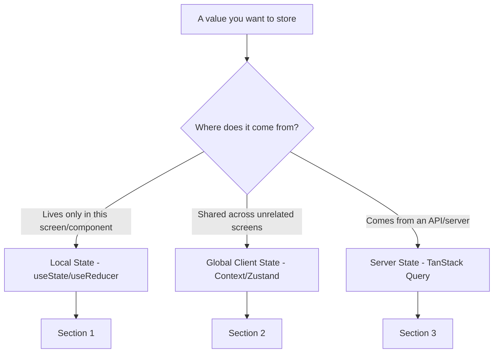
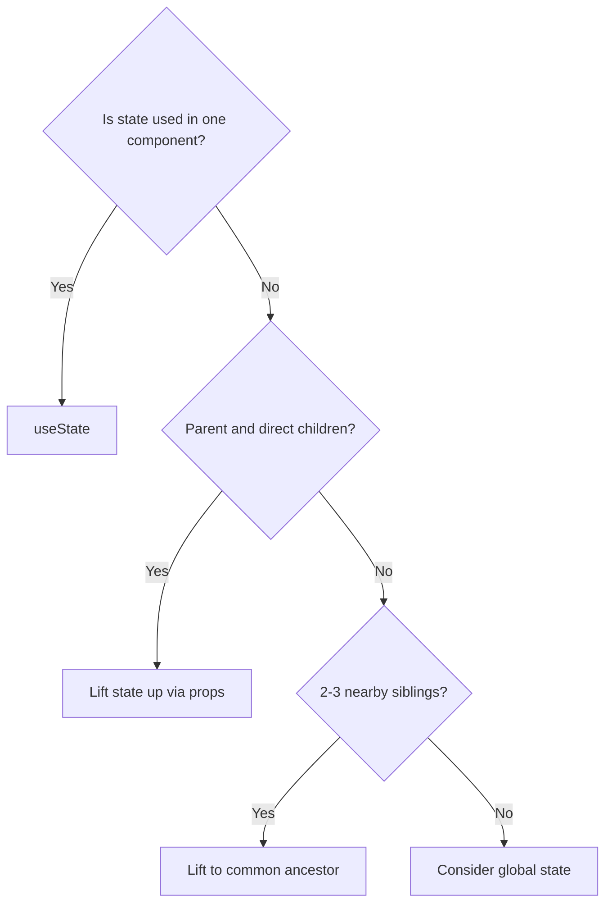
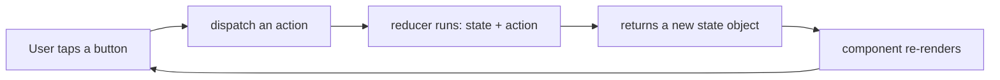
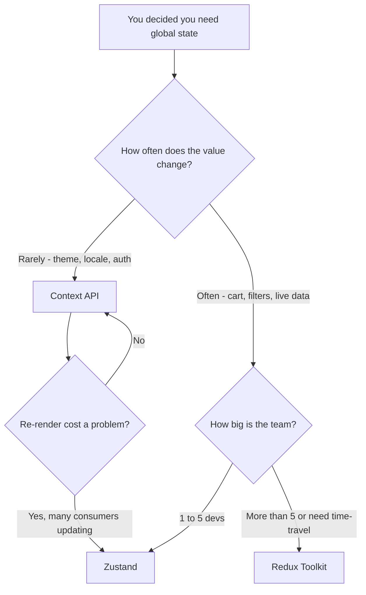
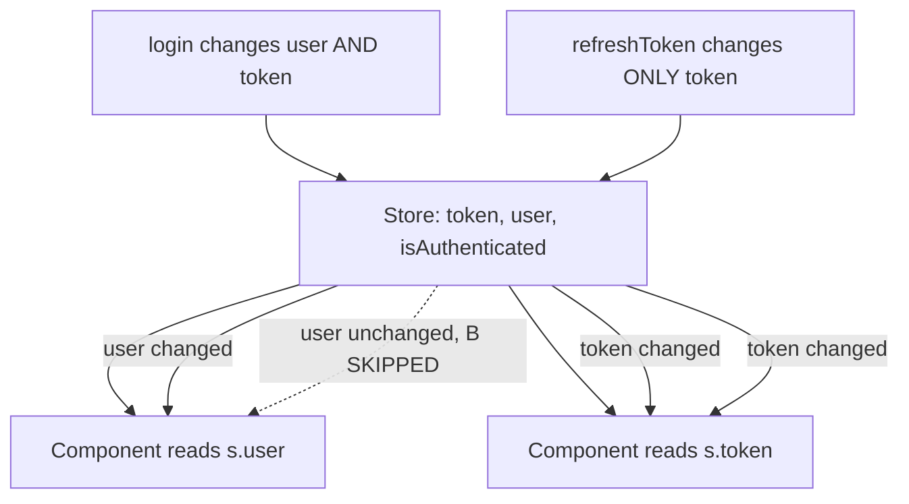
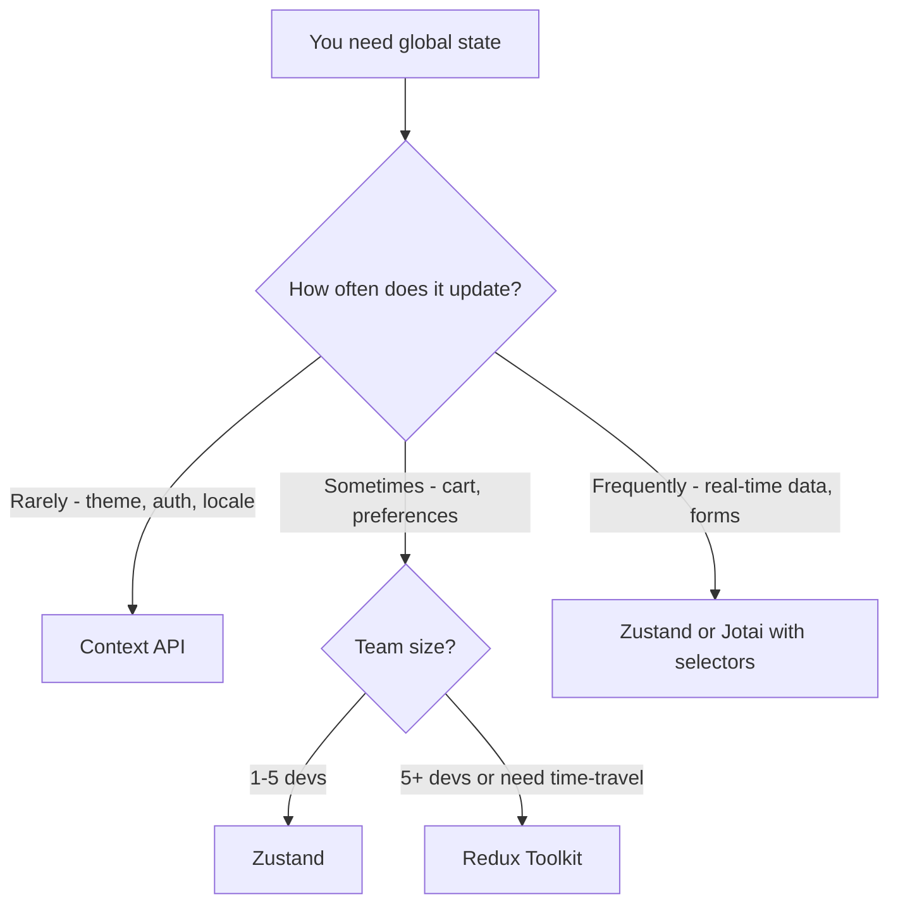
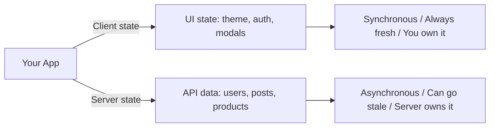
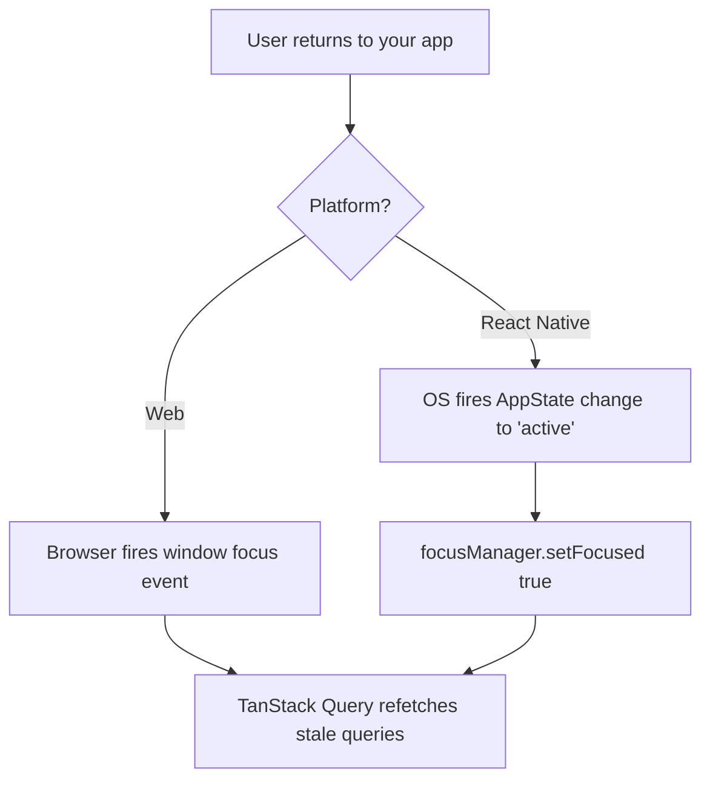
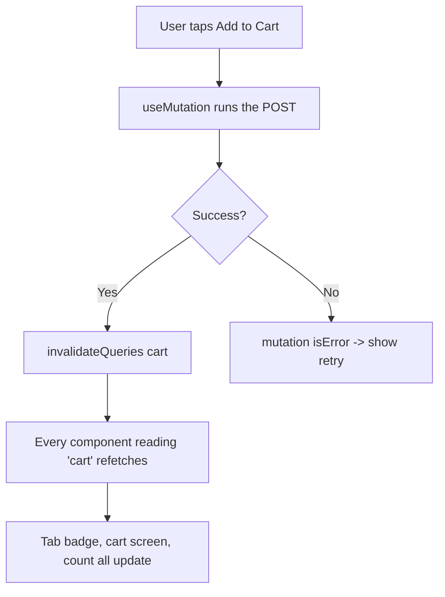
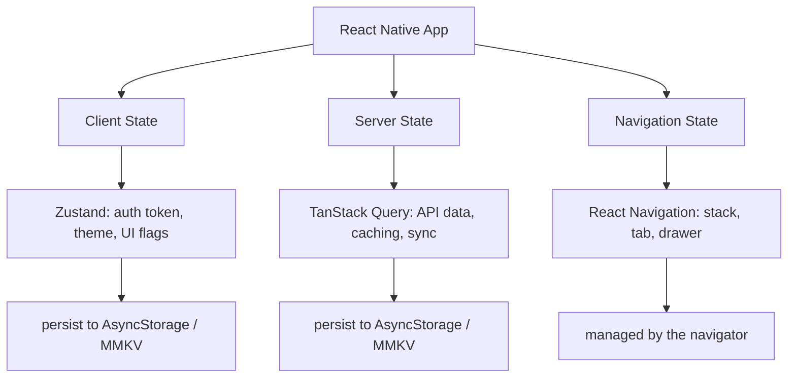

# State Management: Same React, Different Platform

> Local state, global state, and server state in React Native — what transfers from web and what changes.

---

## Table of Contents

1. [Local State](#1-local-state)
2. [Global State](#2-global-state)
3. [Server State](#3-server-state)

---

## 1. Local State

### Everything You Know Still Works

Here is the single most important sentence in this chapter: `useState` and `useReducer` work identically in React Native. No caveats, no asterisks. The component model is the same, the hooks are the same, the rules of hooks are the same. If you already manage local state well on the web, you manage it well on mobile.

Why is this true? React Native and React-DOM share the **same React core** (the reconciler, the hooks dispatcher, the fiber tree). What differs is only the *renderer* — the layer that turns your component tree into actual pixels. On the web that renderer talks to the DOM; on mobile it talks to native iOS/Android views. State management lives entirely in the shared core, so it is completely renderer-agnostic. Think of it like a car engine: `useState` is the engine, and the renderer is just whether the wheels are on asphalt or on a dirt track. The engine does not know or care.

The problem is that most developers skip straight to a global store. They install Zustand or Redux before they have written a single screen. On mobile, this hurts more than on the web, because every unnecessary re-render burns battery and drops frames on a 60fps render loop. A web app that re-renders sloppily just feels a touch slow; a mobile app that does the same drains the battery, heats the device, and visibly stutters during scrolling and animation.

> **Pro tip:** "60fps" means the screen redraws 60 times per second — roughly once every **16 milliseconds**. If a re-render and its layout work take longer than 16ms, the frame is missed and the user sees a stutter ("jank"). Keeping state local and re-renders small is the cheapest way to stay inside that budget.

### The Three Kinds of State

Before choosing a tool, name what you are holding. Almost every value in an app falls into one of three buckets, and each bucket has a different right answer. The rest of this chapter is organized around exactly these three.



> **Common mistake:** treating server data (a list of products fetched from an API) as if it were client state and stuffing it into Zustand or Redux. It looks like it works, but you have just signed up to manually handle caching, refetching, and staleness. We fix this in Section 3.

### The Colocation Rule

State should live as close as possible to where it is consumed. This is not new advice, but in React Native it is more important because:

1. There is no URL bar to lean on for route state. On the web, `?tab=reviews` in the URL is a free, shareable, persistent piece of state. Mobile has no address bar, so that state has to live *somewhere* in React.
2. Navigation stacks keep unmounted screens alive in memory. When you push Screen B on top of Screen A, Screen A does **not** unmount — it stays mounted underneath. So its state (and its re-renders) keep costing you.
3. Re-renders that are invisible on a desktop browser cause visible jank on a phone, because mobile CPUs are weaker and you are fighting the 16ms frame budget.

The mental rule: **start a value as `useState` inside the component that uses it. Only move it outward (up to a parent, then to a global store) when a second consumer actually needs it.** Premature globalization is the most common state-management mistake in real codebases.



### useState in React Native

```tsx
import { useState } from 'react';
import { View, Text, Pressable, TextInput, StyleSheet } from 'react-native';

// Exactly what you would write on the web, with RN primitives
const Counter = () => {
  const [count, setCount] = useState(0);

  return (
    <View style={styles.container}>
      <Text style={styles.label}>Count: {count}</Text>
      {/* Use the updater form (c => c + 1) when the next value
          depends on the previous one — avoids stale-closure bugs */}
      <Pressable onPress={() => setCount(c => c + 1)} style={styles.button}>
        <Text>Increment</Text>
      </Pressable>
    </View>
  );
};

// Form state stays local until submission
const LoginForm = () => {
  const [email, setEmail] = useState('');
  const [password, setPassword] = useState('');

  const handleSubmit = () => {
    // Only touch global auth state after a successful login
    login({ email, password });
  };

  return (
    <View>
      <TextInput
        value={email}
        onChangeText={setEmail}
        placeholder="Email"
        keyboardType="email-address"   // shows the @-friendly keyboard
        autoCapitalize="none"          // emails are lowercase
      />
      <TextInput
        value={password}
        onChangeText={setPassword}
        placeholder="Password"
        secureTextEntry                // masks input (the RN equivalent of type="password")
      />
      <Pressable onPress={handleSubmit}>
        <Text>Log in</Text>
      </Pressable>
    </View>
  );
};
```

Notice the deliberate choice above: `email` and `password` are **local**. There is no reason for the rest of the app to know what someone is half-way through typing. The value only escapes the component — by calling `login()` — once submission succeeds. This "keep it local until the last possible moment" discipline is what keeps re-renders cheap.

#### Web vs React Native: the input handler

| Concept | Web (React DOM) | React Native |
| --- | --- | --- |
| Read the current value | `value={text}` | `value={text}` (same) |
| Handle a change | `onChange={e => setText(e.target.value)}` | `onChangeText={setText}` |
| What the handler receives | a synthetic **event** | the **string** directly |
| Password masking | `type="password"` | `secureTextEntry` |
| Email keyboard | (none — desktop keyboard) | `keyboardType="email-address"` |

> **Gotcha:** `onChangeText` in React Native gives you the string directly, not an event object. You write `onChangeText={setText}` instead of `onChange={e => setText(e.target.value)}`. This is one of the few ergonomic wins mobile has over the web. There *is* an `onChange` prop on `TextInput`, but it hands you a native event object — almost always you want `onChangeText`.

### useReducer for Complex Local State

When a single component owns multiple interrelated values, `useReducer` keeps updates predictable. This transfers from web React one-to-one.

When should you reach for `useReducer` instead of several `useState` calls? Use this rule of thumb:

| Situation | Prefer |
| --- | --- |
| One or two independent values (`count`, `isOpen`) | `useState` |
| Several values that change *together* in defined ways | `useReducer` |
| The next state depends on the previous state in non-trivial logic | `useReducer` |
| You want all update logic in one testable, pure function | `useReducer` |

The advantage of `useReducer` is that the *how* of every update lives in one pure function (the reducer), separate from the *what triggers it* (the `dispatch` calls in your JSX). That separation is exactly what makes Redux feel familiar — `useReducer` is essentially "Redux for a single component."

```tsx
import { useReducer } from 'react';
import { View, Text, Pressable } from 'react-native';

type State = {
  quantity: number;
  size: 'S' | 'M' | 'L';
  addOns: string[];
};

// Every possible update is enumerated as a typed action — TypeScript
// will now flag any dispatch that doesn't match one of these shapes.
type Action =
  | { type: 'SET_QUANTITY'; payload: number }
  | { type: 'SET_SIZE'; payload: 'S' | 'M' | 'L' }
  | { type: 'TOGGLE_ADD_ON'; payload: string }
  | { type: 'RESET' };

const initialState: State = { quantity: 1, size: 'M', addOns: [] };

// A reducer is a PURE function: same (state, action) in -> same state out.
// No side effects, no fetching, no setState. This is why it's easy to test.
const reducer = (state: State, action: Action): State => {
  switch (action.type) {
    case 'SET_QUANTITY':
      return { ...state, quantity: Math.max(1, action.payload) }; // never below 1
    case 'SET_SIZE':
      return { ...state, size: action.payload };
    case 'TOGGLE_ADD_ON': {
      const has = state.addOns.includes(action.payload);
      return {
        ...state,
        addOns: has
          ? state.addOns.filter(a => a !== action.payload) // remove
          : [...state.addOns, action.payload],             // add
      };
    }
    case 'RESET':
      return initialState;
    default:
      return state;
  }
};

const ProductConfigurator = () => {
  const [state, dispatch] = useReducer(reducer, initialState);

  return (
    <View>
      <Text>Qty: {state.quantity} | Size: {state.size}</Text>
      <Pressable onPress={() => dispatch({ type: 'SET_QUANTITY', payload: state.quantity + 1 })}>
        <Text>+ Qty</Text>
      </Pressable>
      <Pressable onPress={() => dispatch({ type: 'RESET' })}>
        <Text>Reset</Text>
      </Pressable>
    </View>
  );
};
```

Here is the data flow a reducer enforces — a strict one-way loop, which is what makes it predictable:



> **Gotcha (shared with web, but worth repeating):** never mutate `state` inside a reducer. `state.addOns.push(x)` and then `return state` will often *not* re-render, because React compares the object identity and sees the same reference. Always return a **new** object/array (`{ ...state }`, `[...state.addOns]`). This is also why every branch above spreads the old state.

### Component Composition Before Global State

Before you reach for any library, try composing components so that state flows naturally. On the web you might tolerate mild prop drilling because a re-render is cheap. On mobile, you should be more disciplined — but the first tool to reach for is still *structure*, not a store.

```tsx
// ❌ BAD: Reaching for global state because two siblings need the same value
// (Don't install Zustand for this)

// ✅ GOOD: Lift to the parent, pass down
const ProductScreen = () => {
  const [selectedTab, setSelectedTab] = useState<'details' | 'reviews'>('details');

  return (
    <View>
      {/* Parent owns the state; children receive exactly what they need */}
      <TabBar selected={selectedTab} onSelect={setSelectedTab} />
      {selectedTab === 'details' ? <ProductDetails /> : <ReviewList />}
    </View>
  );
};
```

Two patterns let you avoid global state far longer than you'd expect:

- **Lifting state up:** move the value to the closest common ancestor of everything that needs it, then pass it down as props. The example above does this for `selectedTab`.
- **Composition over drilling:** if you find yourself passing a prop through three layers that don't use it, consider passing the *rendered component* as `children` instead, so the prop only travels where it's actually consumed.

> **Pro tip:** prop drilling is only a real problem when it crosses *many* layers or *many* unrelated branches. Passing a prop down one or two levels is not a code smell — it's the normal, cheap, explicit way to share state. Reach for a store when the drilling gets genuinely painful, not at the first prop.

### When Local State is Not Enough

You know you need global state when:

- The same value is consumed on screens that are not in a direct parent-child relationship (e.g., auth token used by every API call)
- The value must survive navigation stack resets
- Multiple unrelated features need to react to the same change (e.g., a cart badge on the tab bar updating when you add an item three screens deep)

If you are not in one of those situations, stay local. A good gut check: *can I draw a straight line of props from where this value lives to where it's used, without it feeling absurd?* If yes, stay local. If the line zig-zags across the whole tree, it's time for Section 2.

---

## 2. Global State

### The Landscape

On the web you have the luxury of treating global state as a solved problem with many acceptable answers. In React Native, the constraints are tighter: bundle size matters more (especially on Android, where users on cheaper devices and slower networks feel every extra kilobyte at install and startup), startup time is user-visible, and the architecture (the legacy *bridge*, or the newer *JSI*) means every unnecessary re-render costs more than it does in a browser.

A quick word on *why* re-renders are more expensive here. On the web, your JavaScript and the renderer (the DOM) live in the same place. In React Native, your JavaScript runs in one engine and the actual native views live on another thread; communicating between them has a cost. Sloppy global state that re-renders dozens of components on every keystroke turns that cost into visible jank far faster than it would in a browser.

Here is an opinionated comparison of the libraries that actually make sense in React Native today.

| Library | Best for | Approx. size | Needs a Provider? | Persistence | When to use |
| --- | --- | --- | --- | --- | --- |
| **Context API** | Theme, auth, locale | 0 KB (built in) | Yes | No (DIY) | Low-frequency values read by many components |
| **Zustand** | The default for most apps | ~1 KB | No | Yes (middleware) | Your first reach for any real global state |
| **Jotai** | Fine-grained, atomic subscriptions | ~3 KB | Optional | Yes (middleware) | Many small independent pieces of state |
| **Redux Toolkit** | Large teams, strict data flow, devtools | ~9 KB | Yes | Yes (redux-persist) | 5+ devs or you need time-travel debugging |
| **Legend State** | Reactive + built-in persistence | ~7 KB | No | Built in | You want auto-persist and no selectors |
| **Valtio** | Mutable-style proxy state | ~3 KB | No | Yes (middleware) | Coming from MobX/Vue, like mutating directly |

> **Recommendation in one line:** start with **Zustand**. Move to **Redux Toolkit** only if your team is larger than ~5 devs or you need time-travel debugging in production. Use **Context** only for truly low-frequency values (theme, locale, auth identity).

Here is how to pick, as a decision flow:



### Why Zustand is the Default Choice

Zustand wins in React Native for practical reasons:

1. **No Provider.** You do not wrap your app in `<ZustandProvider>`. This matters more than it sounds, because RN apps already drown in providers: `NavigationContainer`, `SafeAreaProvider`, `GestureHandlerRootView`, `QueryClientProvider`, a theme provider… Zustand adds zero to that pile. The store is just a hook you import wherever you need it.
2. **Selector-based subscriptions.** Components only re-render when the *specific slice* they select changes. With `useAuthStore(s => s.user)`, that component ignores every change to `token`. Context cannot do this without splitting into many separate contexts.
3. **~1 KB gzipped.** On mobile, every kilobyte matters at startup and install size.
4. **Works outside React.** You can read and write the store from navigation callbacks, push-notification handlers, deep-link handlers, or native module bridges — places where there is no component and therefore no hook. This is genuinely hard with Context.

Here's the mental model of how a selector saves re-renders:



### Zustand Setup in React Native

```bash
npm install zustand
```

```tsx
// store/useAuthStore.ts
import { create } from 'zustand';
import { persist, createJSONStorage } from 'zustand/middleware';
import AsyncStorage from '@react-native-async-storage/async-storage';

type AuthState = {
  token: string | null;
  user: { id: string; name: string } | null;
  isAuthenticated: boolean;
  login: (token: string, user: { id: string; name: string }) => void;
  logout: () => void;
};

// `create` returns a hook. The `persist` middleware wraps the store so
// every change is mirrored to storage, and the store is rehydrated on launch.
export const useAuthStore = create<AuthState>()(
  persist(
    (set) => ({
      token: null,
      user: null,
      isAuthenticated: false,

      // Actions live INSIDE the store, alongside the data they change.
      login: (token, user) =>
        set({ token, user, isAuthenticated: true }),

      logout: () =>
        set({ token: null, user: null, isAuthenticated: false }),
    }),
    {
      name: 'auth-storage', // the key under which this is saved
      // This is the RN-specific part: use AsyncStorage, not localStorage
      storage: createJSONStorage(() => AsyncStorage),
    }
  )
);
```

> **Key difference from web:** On the web, `zustand/persist` defaults to `localStorage`. In React Native, there is no `localStorage` — it simply does not exist in the JS runtime. You must supply `AsyncStorage` (or **MMKV** for much better performance). Forgetting this is the number one mistake developers make when porting a Zustand store from web to mobile, and it usually surfaces as a confusing "storage is not defined" crash on launch.

#### A note on storage backends

| Backend | Speed | API | When to use |
| --- | --- | --- | --- |
| `AsyncStorage` | Async, moderate | Promise-based | The default; fine for small auth/preference data |
| `react-native-mmkv` | Synchronous, very fast | Sync | Frequent writes, larger data, or you want instant cold-start reads |

```tsx
// screens/ProfileScreen.tsx
import { View, Text, Pressable } from 'react-native';
import { useAuthStore } from '../store/useAuthStore';

const ProfileScreen = () => {
  // Each selector subscribes to ONE slice.
  // This component only re-renders when `user` changes, not when `token` changes.
  const user = useAuthStore((s) => s.user);
  const logout = useAuthStore((s) => s.logout);

  if (!user) return null;

  return (
    <View>
      <Text>Welcome, {user.name}</Text>
      <Pressable onPress={logout}>
        <Text>Log out</Text>
      </Pressable>
    </View>
  );
};
```

> **Gotcha:** avoid selecting the *whole* store (`const state = useAuthStore()`), and avoid returning a fresh object/array from a selector (`s => ({ a: s.a, b: s.b })`) without a shallow-equality check — both make the component re-render on *every* store change, defeating the entire point of Zustand. Select primitives one at a time, or use `useShallow` for multi-field selectors.

```tsx
// Using the store OUTSIDE React (e.g., in an axios interceptor or a
// push-notification handler) — there is no component here, so no hook.
import { useAuthStore } from '../store/useAuthStore';

// Read state imperatively, with no subscription:
const token = useAuthStore.getState().token;

// Subscribe to changes from a non-React context:
const unsubscribe = useAuthStore.subscribe(
  (state) => {
    if (!state.isAuthenticated) {
      // Kick the user to Login from outside the component tree
      navigationRef.navigate('Login');
    }
  }
);
```

This "works outside React" property is a big deal on mobile, where a lot of important things (deep links, notification taps, background events) happen *outside* a rendered screen.

### Context API: Only for Low-Frequency Values

Context is built in and costs zero bytes. Use it for values that change rarely and are read by many components: theme, locale, feature flags, the logged-in user's identity.

To understand the limitation, you need to understand the mechanism. Context has **no selectors**. When the `value` you pass to a Provider changes, **every** component that calls `useContext` for it re-renders — there is no way to subscribe to just a slice. For a theme that flips twice a day that is totally fine. For a search box that updates on every keystroke it is a performance disaster.

```tsx
import { createContext, useContext, useState, ReactNode } from 'react';
import { useColorScheme } from 'react-native';

type Theme = 'light' | 'dark';

const ThemeContext = createContext<{
  theme: Theme;
  toggle: () => void;
} | null>(null);

export const ThemeProvider = ({ children }: { children: ReactNode }) => {
  // useColorScheme reads the OS-level light/dark setting — a nice RN built-in
  const systemScheme = useColorScheme() ?? 'light';
  const [theme, setTheme] = useState<Theme>(systemScheme);

  const toggle = () => setTheme((t) => (t === 'light' ? 'dark' : 'light'));

  return (
    <ThemeContext.Provider value={{ theme, toggle }}>
      {children}
    </ThemeContext.Provider>
  );
};

// A custom hook gives a clean API AND a runtime guard against
// using the context outside its provider.
export const useTheme = () => {
  const ctx = useContext(ThemeContext);
  if (!ctx) throw new Error('useTheme must be inside ThemeProvider');
  return ctx;
};
```

#### Context vs Zustand at a glance

| | Context API | Zustand |
| --- | --- | --- |
| Provider needed | Yes | No |
| Selective re-renders | No (all consumers re-render) | Yes (selectors) |
| Bundle cost | 0 KB | ~1 KB |
| Usable outside React | Awkward | Yes, natively |
| Best for | Theme, locale, auth identity | Cart, preferences, anything that changes often |

> **Do not** use Context for state that updates frequently (typing into a search box, animation values, scroll positions). Every update re-renders every consumer. On the web this might be tolerable; on a phone running at 60fps it will cause dropped frames. The fix is either Zustand/Jotai (selectors) or — for a single fast value — keeping it `useState` and lifting it only as far as it needs to go.

### When to Choose What



### Quick Notes on the Others

**Jotai** — Great when you have many small, independent atoms of state that different screens consume in different combinations. Its atomic model means components only subscribe to exactly the atoms they read, so a change to one toggle never re-renders a screen that reads a different toggle. Good for apps with complex filter/settings screens where dozens of independent switches exist. Mentally, Jotai is "many tiny `useState`s that live outside the component tree and can be shared."

**Redux Toolkit** — The right call when your team is large, you need strict unidirectional data flow enforced by code review, or you rely on Redux DevTools and time-travel debugging in production. Redux Toolkit (RTK) cut most of the historical boilerplate, but a Provider, slices, and the action/reducer ceremony are still there. The tax is real but pays for itself in large codebases where *consistency across many contributors* matters more than minimalism.

**Legend State** — Worth watching. It has built-in persistence and reactive, fine-grained updates without you writing selectors at all — it tracks which fields each component actually reads. If you hate writing selectors and want automatic persistence to MMKV, this is the most ergonomic option in the list.

**Valtio** — Proxy-based, so you mutate state directly (`state.count++`) and subscriptions are tracked automatically. Feels natural for developers coming from MobX or Vue's reactivity. Smaller community in the RN space than Zustand, so you'll find fewer ready-made examples.

> **Pro tip:** you do not have to pick exactly one global-state library and use it for everything. A very common, healthy setup is **Context for theme/locale + Zustand for the handful of frequently-changing client values + TanStack Query for everything from the server** (next section). Each tool does the one job it's best at.

---

## 3. Server State

### Server State is Not Client State

This is the mental model shift that matters most in the whole chapter. Data from your API is fundamentally different from UI state like "is the modal open" or "what tab is selected." Server data is:

- **Owned remotely** — your app holds a *cached copy*, not the source of truth. The real value lives on a server you don't control.
- **Asynchronous** — fetching it takes time and can fail (timeout, 500, no signal in a tunnel).
- **Potentially stale** — another user or process can change it the instant after you fetched it, so your copy is "probably right, for now."
- **Shared** — multiple screens may display the same entity (the same product appears in a list, on a detail screen, and in the cart).

Treating server data as regular client state (storing it in Redux or Zustand) means *you* are now personally responsible for caching, invalidation, deduplication, background refetching, retry logic, loading/error flags, and pagination. These are genuinely hard problems — invalidation especially — that specialized libraries have already solved and battle-tested. Writing them yourself is how a "simple" Zustand store grows into a 600-line caching engine with subtle bugs.



> **The litmus test:** ask "does this value come from a `fetch`/API call?" If yes, it is server state — use a server-state library, not Zustand. If it was born inside the app (a toggle, a selected tab, the auth token *after* you stored it), it is client state.

### TanStack Query as the Standard

TanStack Query (formerly React Query) is the dominant server state library in both web and React Native. It gives you a tiny API — mostly `useQuery` (read) and `useMutation` (write) — and in exchange handles caching, deduplication, background refetching, retries, and the `isLoading`/`isError`/`data` bookkeeping you'd otherwise write by hand.

It works **identically** on web and React Native with one category of difference: the things TanStack Query normally reads off the *browser* (the window-focus event and the online/offline status) don't exist in React Native, so you wire up the RN equivalents yourself. That's the entire RN-specific story, and we cover it below.

```bash
npm install @tanstack/react-query
```

#### Basic Setup for React Native

```tsx
// App.tsx
import { QueryClient, QueryClientProvider } from '@tanstack/react-query';

// The QueryClient holds the cache. One instance for the whole app.
const queryClient = new QueryClient({
  defaultOptions: {
    queries: {
      staleTime: 1000 * 60 * 5, // data is considered "fresh" for 5 minutes
      retry: 2,                 // retry a failed request twice before erroring
      // Do NOT rely on refetchOnWindowFocus here — there is no window on RN.
      // We wire focus refetching to AppState manually below.
    },
  },
});

export default function App() {
  return (
    <QueryClientProvider client={queryClient}>
      <NavigationContainer>
        <RootNavigator />
      </NavigationContainer>
    </QueryClientProvider>
  );
}
```

> **Concept — `staleTime` vs `gcTime`:** `staleTime` is how long data is trusted as *fresh* (no automatic refetch). `gcTime` (garbage-collection time, formerly `cacheTime`) is how long an *unused* query is kept in memory before being discarded. On the web, unused screens unmount and their queries become eligible for GC. On mobile, screens stay mounted in the stack — so `gcTime` behaves a little differently (see gotcha #3 below).

#### The AppState Focus Hook (RN-Specific)

On the web, TanStack Query listens to the browser's `window` focus event to refetch stale data when the user returns to the tab. React Native has no `window` and no tabs. The mobile equivalent of "the user came back" is **the app returning from the background**, which you detect with `AppState`.

```tsx
// hooks/useAppStateRefetch.ts
import { useEffect } from 'react';
import { AppState, AppStateStatus } from 'react-native';
import { focusManager } from '@tanstack/react-query';

export function useAppStateRefetch() {
  useEffect(() => {
    const subscription = AppState.addEventListener(
      'change',
      (status: AppStateStatus) => {
        // Tell TanStack Query whether the app is "focused".
        // 'active' = foreground; 'background'/'inactive' = not.
        focusManager.setFocused(status === 'active');
      }
    );

    return () => subscription.remove(); // always clean up the listener
  }, []);
}

// Use it once at the root of your app
// App.tsx
export default function App() {
  useAppStateRefetch();

  return (
    <QueryClientProvider client={queryClient}>
      {/* ... */}
    </QueryClientProvider>
  );
}
```

> **This is the single most important RN-specific setup step for TanStack Query.** Without it, stale data never refreshes when the user backgrounds and foregrounds your app — a thing mobile users do constantly. On the web this is automatic; on mobile you must opt in.

Here's the difference in one diagram:



#### Online Status (RN-Specific)

Similarly, on the web TanStack Query reads `navigator.onLine` to know whether to bother fetching. React Native has no `navigator.onLine`, so you wire up **NetInfo**, the standard RN connectivity library.

```bash
npm install @react-native-community/netinfo
```

```tsx
// hooks/useOnlineManager.ts
import { useEffect } from 'react';
import NetInfo from '@react-native-community/netinfo';
import { onlineManager } from '@tanstack/react-query';

export function useOnlineManager() {
  useEffect(() => {
    // Feed real device connectivity into TanStack Query's onlineManager.
    return NetInfo.addEventListener((state) => {
      onlineManager.setOnline(
        state.isConnected != null &&
        state.isConnected &&
        Boolean(state.isInternetReachable) // connected to wifi != actually online
      );
    });
  }, []);
}
```

> **Why `isInternetReachable` matters:** on mobile, "connected to a network" and "has working internet" are different things. A user on captive-portal hotel wifi, or in a tunnel with a phantom signal, is `isConnected` but not `isInternetReachable`. Checking both prevents firing requests that are doomed to time out.

#### Fetching Data

Queries themselves work exactly the same as on the web. No RN changes needed.

```tsx
// hooks/useProducts.ts
import { useQuery } from '@tanstack/react-query';
import { api } from '../lib/api';

type Product = {
  id: string;
  name: string;
  price: number;
  imageUrl: string;
};

const fetchProducts = async (): Promise<Product[]> => {
  const response = await api.get('/products');
  return response.data;
};

export const useProducts = () => {
  return useQuery({
    // queryKey is the cache identity. Same key anywhere in the app = same
    // cached data, fetched once, shared everywhere.
    queryKey: ['products'],
    queryFn: fetchProducts,
  });
};
```

```tsx
// screens/ProductListScreen.tsx
import { FlatList, Text, View, ActivityIndicator, Pressable } from 'react-native';
import { useProducts } from '../hooks/useProducts';

const ProductListScreen = () => {
  // TanStack Query hands you the loading/error bookkeeping for free.
  const { data: products, isLoading, isError, error, refetch } = useProducts();

  if (isLoading) {
    return <ActivityIndicator size="large" />; // RN's built-in spinner
  }

  if (isError) {
    return (
      <View>
        <Text>Error: {error.message}</Text>
        <Pressable onPress={() => refetch()}>
          <Text>Retry</Text>
        </Pressable>
      </View>
    );
  }

  return (
    <FlatList
      data={products}
      keyExtractor={(item) => item.id}
      renderItem={({ item }) => (
        <View>
          <Text>{item.name}</Text>
          <Text>${item.price}</Text>
        </View>
      )}
      // Pull-to-refresh, wired straight to TanStack Query
      onRefresh={refetch}
      refreshing={isLoading}
    />
  );
};
```

> **RN ergonomic win:** `FlatList`'s built-in `onRefresh`/`refreshing` props give you native pull-to-refresh with about two lines, wired directly to `refetch`. On the web you'd hand-build a pull-to-refresh gesture; on mobile it's a first-class primitive.

#### Mutations

Reads use `useQuery`; **writes** (create/update/delete) use `useMutation`. The key pattern: after a successful write, *invalidate* the affected queries so any screen showing that data refetches automatically.

```tsx
import { useMutation, useQueryClient } from '@tanstack/react-query';

const useAddToCart = () => {
  const queryClient = useQueryClient();

  return useMutation({
    mutationFn: (productId: string) =>
      api.post('/cart/items', { productId, quantity: 1 }),

    onSuccess: () => {
      // Mark the cart query stale -> any screen reading ['cart'] refetches.
      // This is how the tab-bar cart badge updates from 3 screens deep.
      queryClient.invalidateQueries({ queryKey: ['cart'] });
    },
  });
};
```

This is the payoff of treating server data as server state: the cart badge in the tab bar, the cart screen, and the "items in cart" count on the product page all read `['cart']`, so invalidating that one key updates **all of them** — no manual wiring, no Zustand cart store to keep in sync.



### Common Gotchas in React Native

| # | Gotcha | What to do |
| --- | --- | --- |
| 1 | `refetchOnWindowFocus` does nothing out of the box — there's no `window`. | Wire up `AppState` → `focusManager` (see `useAppStateRefetch`). |
| 2 | No `navigator.onLine`. | Wire `NetInfo` → `onlineManager` (see `useOnlineManager`). |
| 3 | Screens in a stack are **not** unmounted. If Screen A and Screen B both use `useQuery(['user', id])`, the query stays alive across navigation. | Usually what you want, but it means `gcTime` matters more than on the web — tune it deliberately. |
| 4 | Infinite scroll needs the right pairing. | `FlatList` + `useInfiniteQuery`; call `fetchNextPage()` from `onEndReached`. |
| 5 | The web devtools package doesn't render in RN. | Use `react-native-react-query-devtools`, or the Flipper plugin. |
| 6 | The OS can kill a backgrounded app, losing the in-memory cache. | Persist the query cache to AsyncStorage/MMKV so users see data instantly on cold start (next section). |

### Persisting the Query Cache

For a fast cold-start experience, persist the TanStack Query cache so users see data *before* the first network request even completes. This is the difference between opening an app to a blank spinner versus opening it to yesterday's content that quietly refreshes in the background — the latter is what makes well-built mobile apps feel instant.

```bash
npm install @tanstack/react-query-persist-client @tanstack/query-async-storage-persister
npm install @react-native-async-storage/async-storage
```

```tsx
import AsyncStorage from '@react-native-async-storage/async-storage';
import { QueryClient } from '@tanstack/react-query';
import { PersistQueryClientProvider } from '@tanstack/react-query-persist-client';
import { createAsyncStoragePersister } from '@tanstack/query-async-storage-persister';

const queryClient = new QueryClient({
  defaultOptions: {
    queries: {
      // Keep cached data on disk for a day so cold starts are instant.
      gcTime: 1000 * 60 * 60 * 24, // 24 hours
    },
  },
});

const asyncStoragePersister = createAsyncStoragePersister({
  storage: AsyncStorage, // swap for an MMKV persister for faster reads
});

export default function App() {
  return (
    // Note: PersistQueryClientProvider replaces the plain QueryClientProvider.
    <PersistQueryClientProvider
      client={queryClient}
      persistOptions={{ persister: asyncStoragePersister }}
    >
      <NavigationContainer>
        <RootNavigator />
      </NavigationContainer>
    </PersistQueryClientProvider>
  );
}
```

> **Gotcha:** for the cache to actually persist, your queries need a `gcTime` long enough to outlive the app being closed (the 24h above), and you should set a sensible cache `buster`/`maxAge` so a user on an old app version doesn't get stuck with incompatible stale data after an update.

### Putting It All Together

The clean architecture for a React Native app separates the three kinds of state clearly, and lets a purpose-built tool own each one:



You do not need one tool to rule them all — in fact, trying to is the classic mistake. Use **`useState`/`useReducer`** for anything that belongs to a single screen. Use **Zustand (or Context)** for the 5–10 truly global client values. Use **TanStack Query** for everything that comes from a server. Let **React Navigation** own the navigation state. Each tool does one job well, they don't step on each other, and a newcomer reading your code can tell at a glance which kind of state they're looking at — which is the real goal of good state management.