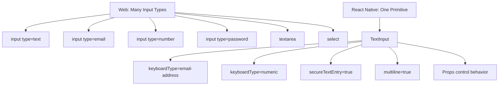
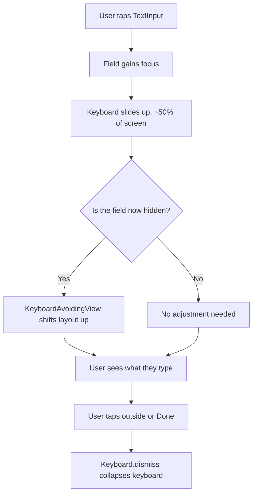
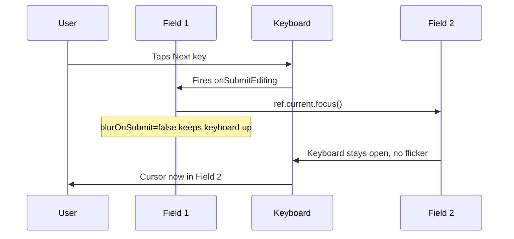
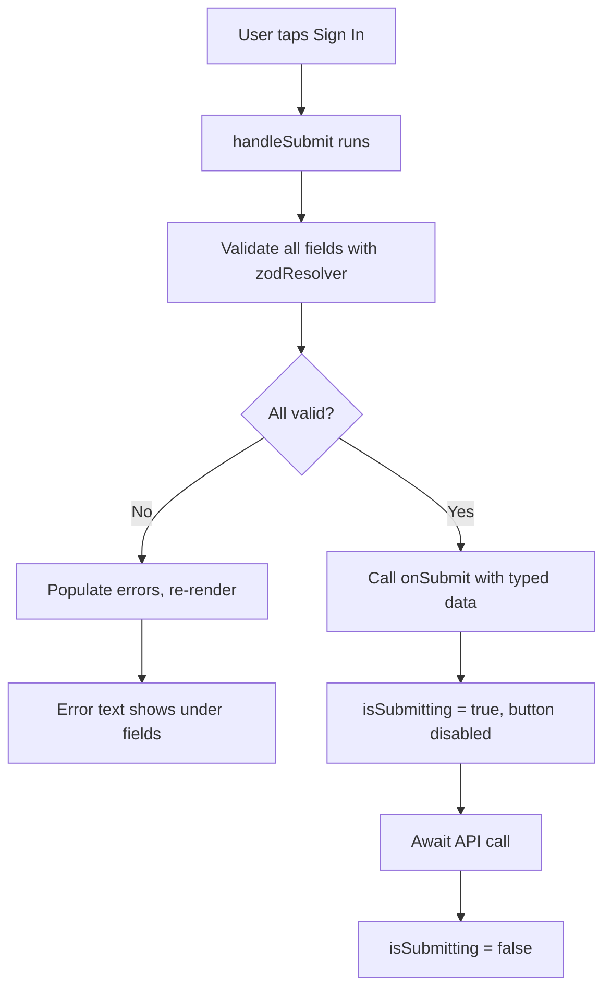
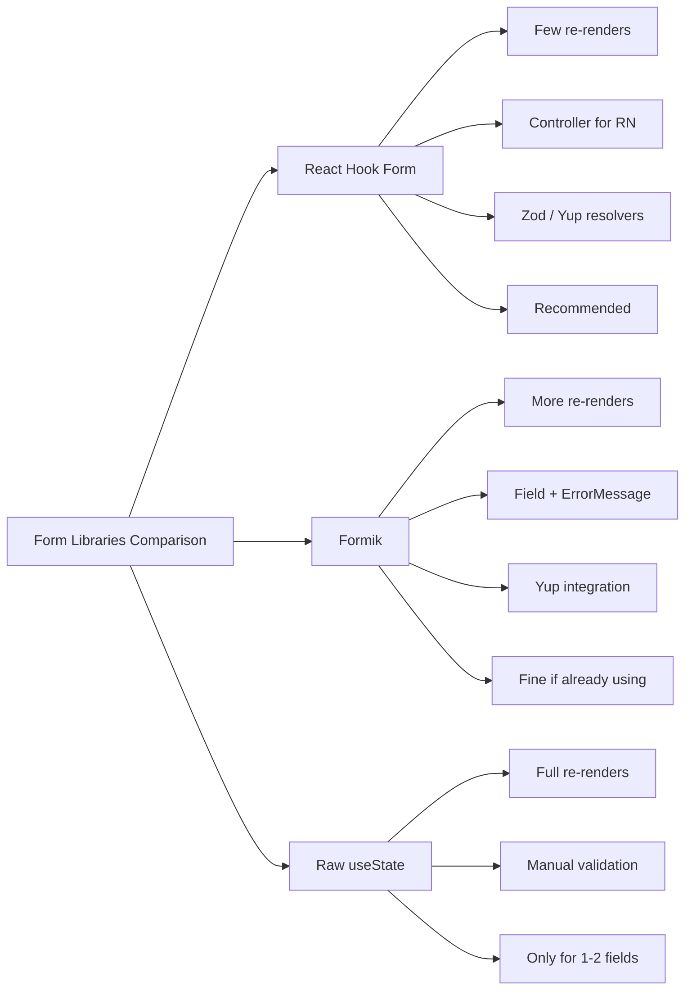
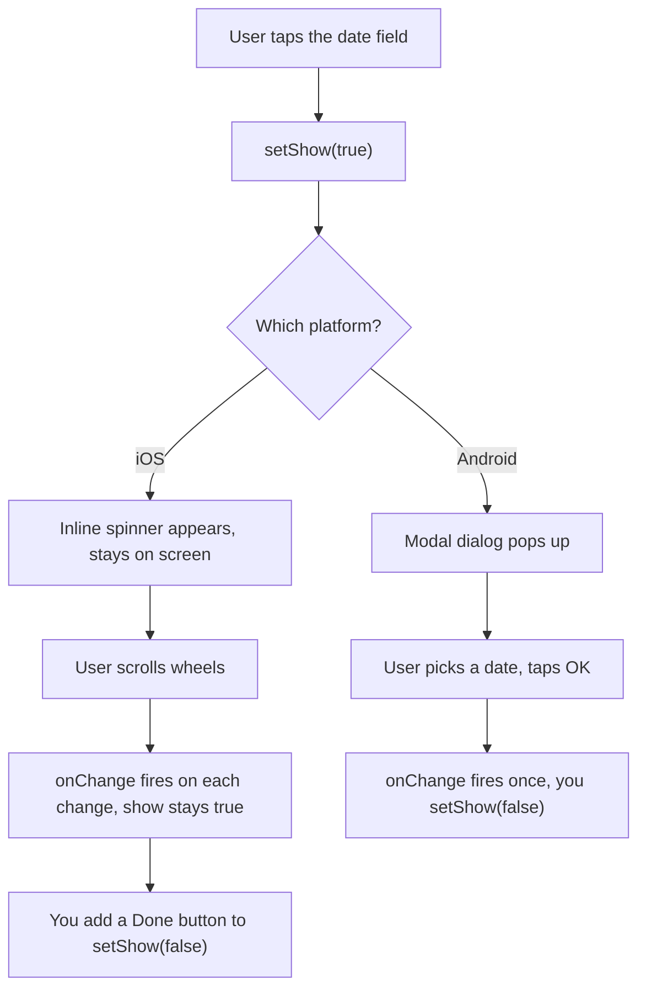
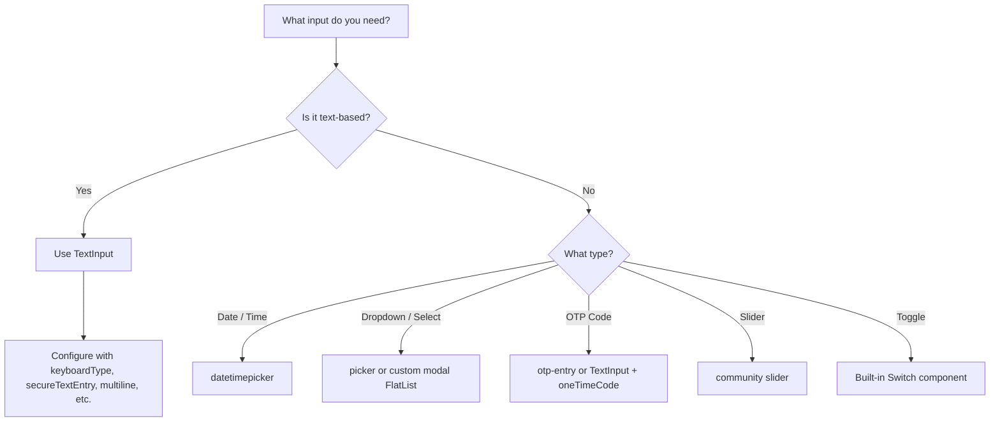
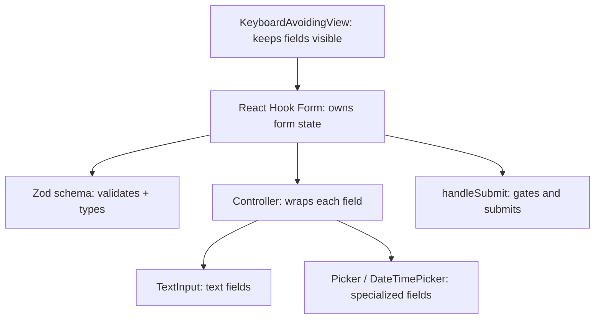

# Forms and Input: TextInput and Beyond

> The single input primitive, keyboard management, and form handling in a mobile-first world.

---

## Table of Contents

1. [Core Input Primitives](#1-core-input-primitives)
2. [Form Libraries](#2-form-libraries)
3. [Specialized Inputs](#3-specialized-inputs)

---

## 1. Core Input Primitives

### The Single Input to Rule Them All

On the web, you have a buffet of input types: `<input type="text">`, `<input type="email">`, `<input type="number">`, `<input type="password">`, `<textarea>`, `<select>`, and a dozen more. Each one renders a different native widget and carries its own validation behavior.

React Native throws all of that away and gives you exactly one component: `TextInput`.

That is not a limitation — it is a reflection of how mobile platforms actually work. On iOS and Android, there is one text field widget. You change its *behavior* (what keyboard appears, whether text is obscured, how auto-correct behaves) through props, not by swapping components. Once you internalize this, forms in React Native feel simpler than on the web, not harder.

#### Why one primitive, really?

Think of `TextInput` as a single physical typewriter where you swap out the *paper* and the *keyboard layout* depending on the job, rather than buying a brand-new typewriter for every task. The underlying machine — the cursor, the text buffer, the selection handles, the copy/paste menu — is identical everywhere. What changes is configuration.

This matters because on the web, the browser *and* the operating system both ship their own native widgets, and they often disagree. A `<input type="date">` looks completely different in Chrome on Windows vs Safari on iOS vs Firefox on Android — you have almost no control. React Native sidesteps that by exposing the raw native text field directly and letting *you* compose the rest (date pickers, dropdowns) out of explicit components you can see and style.



#### The web type → RN prop cheat sheet

| Web | React Native equivalent |
| --- | --- |
| `<input type="text">` | `<TextInput />` |
| `<input type="email">` | `<TextInput keyboardType="email-address" autoCapitalize="none" />` |
| `<input type="number">` | `<TextInput keyboardType="numeric" />` |
| `<input type="tel">` | `<TextInput keyboardType="phone-pad" />` |
| `<input type="password">` | `<TextInput secureTextEntry />` |
| `<input type="url">` | `<TextInput keyboardType="url" autoCapitalize="none" />` |
| `<textarea>` | `<TextInput multiline numberOfLines={4} />` |
| `<input type="date">` / `type="checkbox"` / `<select>` | No core component — use a community package (see Section 3) |

### TextInput Props That Matter

Here is a `TextInput` configured for an email field. Notice how props replace what the web does with `type` attributes:

```tsx
import { TextInput, StyleSheet } from "react-native";
import { useState } from "react";

function EmailField() {
  const [email, setEmail] = useState("");

  return (
    <TextInput
      value={email}
      onChangeText={setEmail}
      placeholder="you@example.com"
      keyboardType="email-address"
      autoCapitalize="none"
      autoCorrect={false}
      autoComplete="email"
      returnKeyType="next"
      textContentType="emailAddress"
      style={styles.input}
    />
  );
}

const styles = StyleSheet.create({
  input: {
    borderWidth: 1,
    borderColor: "#ccc",
    borderRadius: 8,
    padding: 12,
    fontSize: 16,
  },
});
```

Let's break down the props you will use constantly:

- **`keyboardType`** — Controls which keyboard layout appears. Options include `"default"`, `"email-address"`, `"numeric"`, `"phone-pad"`, `"decimal-pad"`, `"number-pad"`, and `"url"`. This is the closest equivalent to web input types.
- **`returnKeyType`** — Changes the label on the keyboard's return key: `"done"`, `"next"`, `"search"`, `"go"`, `"send"`. Use `"next"` when you have another field below, `"done"` for the last field.
- **`autoCapitalize`** — Set to `"none"` for emails and usernames, `"sentences"` for normal text, `"words"` for names, `"characters"` for all-caps.
- **`autoCorrect`** — Turn it off for emails, usernames, codes. Leave it on for freeform text.
- **`secureTextEntry`** — Obscures text for passwords. This replaces `<input type="password">`.
- **`textContentType`** (iOS) / **`autoComplete`** (Android + iOS 12+) — Enables autofill from the OS keychain. Use `"emailAddress"`, `"password"`, `"newPassword"`, `"oneTimeCode"`, etc.

> **Pro tip:** `keyboardType="numeric"` makes a numeric keyboard *appear*, but it does **not** stop the user from pasting letters or using a hardware keyboard to type them. Never trust the keyboard as validation — always validate the value itself (see Zod in Section 2). The keyboard is a UX hint, not a constraint.

#### The reference table

| Prop | What it does | Typical values | Use it for |
| --- | --- | --- | --- |
| `keyboardType` | Picks the on-screen keyboard | `email-address`, `numeric`, `phone-pad`, `url` | Matching the keyboard to the data |
| `returnKeyType` | Labels the return key | `next`, `done`, `search`, `go`, `send` | Guiding the user to the next action |
| `autoCapitalize` | Auto-uppercasing | `none`, `sentences`, `words`, `characters` | Off for emails/codes, on for prose |
| `autoCorrect` | Spell/auto-correct | `true` / `false` | Off for emails, usernames, passwords |
| `secureTextEntry` | Masks characters | `true` / `false` | Passwords, PINs |
| `multiline` | Allows wrapping + Enter | `true` / `false` | Comments, bios, notes |
| `maxLength` | Hard character cap | number | Tweet-style limits, codes |
| `editable` | Allow/block editing | `true` / `false` | Read-only display fields |

### onChangeText vs onChange

This catches people coming from the web. On the web you write `onChange={(e) => setValue(e.target.value)}`. React Native gives you two options:

```tsx
// Preferred: onChangeText gives you the string directly
<TextInput onChangeText={(text) => setName(text)} />

// Also available: onChange gives you a native event
<TextInput
  onChange={(e) => {
    const text = e.nativeEvent.text;
    setName(text);
  }}
/>
```

Use `onChangeText` in 99% of cases. It is simpler and it is what form libraries expect. The only time you need `onChange` is when you need metadata from the native event (cursor position, for instance).

#### Controlled vs uncontrolled — the same mental model as the web

Just like web React, a `TextInput` is **controlled** when you pass both `value` and `onChangeText`. State is the single source of truth: the input only shows what state says it shows.

```tsx
// Controlled — React state drives the input
const [name, setName] = useState("");
<TextInput value={name} onChangeText={setName} />

// Uncontrolled — the native field holds its own text; you read it via a ref
<TextInput defaultValue="" ref={inputRef} />
```

> **Common mistake:** Passing `value` *without* `onChangeText`. The field becomes frozen — the user types and nothing appears, because every keystroke re-renders back to the unchanged `value`. This is the exact same trap as a read-only controlled `<input>` on the web. Either add `onChangeText`, or use `defaultValue` for an uncontrolled field.

### Keyboard Management

The keyboard on mobile is not a quiet popup — it slides up and covers roughly half the screen. If your input is in the bottom half, the user cannot see what they are typing. This is the single biggest source of frustration in mobile forms, and React Native gives you tools to handle it.

On the web, the browser scrolls focused inputs into view for you and the keyboard (if any) is the OS's problem. On mobile, **nothing happens automatically** — the keyboard slides over your layout and it is entirely your job to push content out of the way.



**KeyboardAvoidingView** wraps your form and adjusts layout when the keyboard appears:

```tsx
import {
  KeyboardAvoidingView,
  Platform,
  TouchableWithoutFeedback,
  Keyboard,
  ScrollView,
} from "react-native";

function LoginForm() {
  return (
    <KeyboardAvoidingView
      behavior={Platform.OS === "ios" ? "padding" : "height"}
      style={{ flex: 1 }}
    >
      <TouchableWithoutFeedback onPress={Keyboard.dismiss}>
        <ScrollView
          contentContainerStyle={{ flexGrow: 1, padding: 20 }}
          keyboardShouldPersistTaps="handled"
        >
          {/* Your form fields here */}
        </ScrollView>
      </TouchableWithoutFeedback>
    </KeyboardAvoidingView>
  );
}
```

> **Gotcha:** The `behavior` prop on `KeyboardAvoidingView` is different per platform. Use `"padding"` on iOS and `"height"` on Android. Getting this wrong is the number one reason people think KeyboardAvoidingView "doesn't work" and abandon it. It works fine — it just needs the right behavior for each OS.

The `TouchableWithoutFeedback` wrapper with `Keyboard.dismiss` is the "tap outside to close keyboard" pattern. On the web, clicking outside an input naturally blurs it. On mobile, the keyboard stays open until you explicitly dismiss it. You need this wrapper.

The `keyboardShouldPersistTaps="handled"` prop on ScrollView is critical: without it, tapping a button while the keyboard is open dismisses the keyboard *instead of* pressing the button. Your users will tap "Submit" and nothing will happen — the keyboard just closes. They have to tap again. Setting this to `"handled"` lets buttons receive taps even when the keyboard is visible.

#### The `behavior` values, decoded

| `behavior` | What it does | Best on |
| --- | --- | --- |
| `"padding"` | Adds bottom padding equal to the keyboard height, pushing content up | iOS |
| `"height"` | Shrinks the view's height so content reflows above the keyboard | Android |
| `"position"` | Slides the whole view up via absolute positioning (can be janky) | Rarely — legacy cases |
| `undefined` | No adjustment | When you handle it manually |

> **Pro tip:** For anything beyond a simple form, consider the community package `react-native-keyboard-controller`. It gives smoother, more native-feeling keyboard animations and a `KeyboardAwareScrollView` that "just works" across platforms without per-OS `behavior` juggling. `KeyboardAvoidingView` is the built-in baseline; this is the upgrade when it isn't smooth enough.

### Focusing the Next Field

On the web, pressing Tab moves to the next field automatically. On mobile, there is no Tab key. You wire this up yourself using refs and the `onSubmitEditing` callback:

```tsx
import { useRef } from "react";
import { TextInput } from "react-native";

function SignupForm() {
  const lastNameRef = useRef<TextInput>(null);
  const emailRef = useRef<TextInput>(null);

  return (
    <>
      <TextInput
        placeholder="First name"
        returnKeyType="next"
        onSubmitEditing={() => lastNameRef.current?.focus()}
        blurOnSubmit={false}
      />
      <TextInput
        ref={lastNameRef}
        placeholder="Last name"
        returnKeyType="next"
        onSubmitEditing={() => emailRef.current?.focus()}
        blurOnSubmit={false}
      />
      <TextInput
        ref={emailRef}
        placeholder="Email"
        returnKeyType="done"
        keyboardType="email-address"
      />
    </>
  );
}
```

Set `blurOnSubmit={false}` on all fields except the last one. Without it, pressing "Next" on the keyboard blurs the current field before focusing the next one, causing an ugly keyboard flicker as it briefly hides and reappears.

Here is the chain of events when the user taps "Next" on the keyboard:



> **Gotcha:** `ref.current?.focus()` only works if the ref points at the *actual* `TextInput`. If you wrap your input in a custom component, you must forward the ref with `forwardRef`, or the `.focus()` call silently does nothing. This is the most common reason "next field focusing" appears broken.

---

## 2. Form Libraries

### Why You Need One

Managing a couple of inputs with `useState` is fine. Managing a form with 8 fields, validation, error messages, dirty/touched tracking, and submit handling with raw state is a nightmare — the same nightmare you already know from web React. The good news: the same libraries work.

To make it concrete, here is everything a "real" form has to track. Doing this by hand means a `useState` (or reducer branch) for *each* row, multiplied across every field:

| Concern | What it means | Hand-rolled cost |
| --- | --- | --- |
| Values | Current text in each field | One state per field |
| Errors | Validation messages | Re-run validation on every change |
| Touched | Has the user visited this field? | Track focus/blur per field |
| Dirty | Has the value changed from default? | Compare against initial values |
| Submitting | Is the async submit in flight? | Manual loading boolean + try/catch |
| Submit gating | Block submit while invalid | Wire validity into the button |

A form library collapses all of that into one hook. That is the whole pitch.

### React Hook Form — The Clear Winner

React Hook Form works in React Native with zero changes to its core API. You swap HTML elements for RN components and use `Controller` instead of `register` (since `register` relies on DOM refs). That is the only difference.

> **Why `Controller`?** On the web, `register` works by attaching a ref directly to a DOM `<input>` and reading `.value` off it — no React state needed, which is what makes RHF so fast. React Native components do not expose a DOM node with a `.value` property, so that trick can't work. `Controller` bridges the gap: it turns the field into a controlled component, feeding `value`/`onChange` into your `TextInput` while RHF keeps managing everything else under the hood.

```tsx
import { useForm, Controller } from "react-hook-form";
import {
  View,
  Text,
  TextInput,
  Pressable,
  StyleSheet,
} from "react-native";
import { z } from "zod";
import { zodResolver } from "@hookform/resolvers/zod";

const schema = z.object({
  email: z.string().email("Enter a valid email"),
  password: z.string().min(8, "At least 8 characters"),
});

type FormData = z.infer<typeof schema>;

function LoginForm() {
  const {
    control,
    handleSubmit,
    formState: { errors, isSubmitting },
  } = useForm<FormData>({
    resolver: zodResolver(schema),
    defaultValues: { email: "", password: "" },
  });

  const onSubmit = async (data: FormData) => {
    // Call your API
    console.log(data);
  };

  return (
    <View style={styles.container}>
      <Text style={styles.label}>Email</Text>
      <Controller
        control={control}
        name="email"
        render={({ field: { onChange, onBlur, value } }) => (
          <TextInput
            style={[styles.input, errors.email && styles.inputError]}
            value={value}
            onChangeText={onChange}
            onBlur={onBlur}
            placeholder="you@example.com"
            keyboardType="email-address"
            autoCapitalize="none"
            autoCorrect={false}
            returnKeyType="next"
          />
        )}
      />
      {errors.email && (
        <Text style={styles.error}>{errors.email.message}</Text>
      )}

      <Text style={styles.label}>Password</Text>
      <Controller
        control={control}
        name="password"
        render={({ field: { onChange, onBlur, value } }) => (
          <TextInput
            style={[styles.input, errors.password && styles.inputError]}
            value={value}
            onChangeText={onChange}
            onBlur={onBlur}
            placeholder="Min. 8 characters"
            secureTextEntry
            returnKeyType="done"
          />
        )}
      />
      {errors.password && (
        <Text style={styles.error}>{errors.password.message}</Text>
      )}

      <Pressable
        style={[styles.button, isSubmitting && styles.buttonDisabled]}
        onPress={handleSubmit(onSubmit)}
        disabled={isSubmitting}
      >
        <Text style={styles.buttonText}>
          {isSubmitting ? "Signing in..." : "Sign In"}
        </Text>
      </Pressable>
    </View>
  );
}

const styles = StyleSheet.create({
  container: { padding: 20 },
  label: { fontSize: 14, fontWeight: "600", marginBottom: 4, marginTop: 16 },
  input: {
    borderWidth: 1,
    borderColor: "#ccc",
    borderRadius: 8,
    padding: 12,
    fontSize: 16,
  },
  inputError: { borderColor: "#e53e3e" },
  error: { color: "#e53e3e", fontSize: 12, marginTop: 4 },
  button: {
    backgroundColor: "#3b82f6",
    padding: 16,
    borderRadius: 8,
    alignItems: "center",
    marginTop: 24,
  },
  buttonDisabled: { opacity: 0.6 },
  buttonText: { color: "#fff", fontSize: 16, fontWeight: "600" },
});
```

#### How a submit actually flows

`handleSubmit` is a gate. It runs validation first, and *only* calls your `onSubmit` if every field passes. If anything fails, it populates `errors` and your `onSubmit` never runs — so you never have to check validity by hand inside the submit handler.



#### A reusable `ControlledInput` to kill the boilerplate

Writing `<Controller>` around every field gets verbose. In real apps you extract it once:

```tsx
import { Controller, Control, FieldValues, Path } from "react-hook-form";
import { TextInput, Text, TextInputProps } from "react-native";

type Props<T extends FieldValues> = {
  control: Control<T>;
  name: Path<T>;
  error?: string;
} & TextInputProps;

function ControlledInput<T extends FieldValues>({
  control,
  name,
  error,
  ...inputProps
}: Props<T>) {
  return (
    <>
      <Controller
        control={control}
        name={name}
        render={({ field: { onChange, onBlur, value } }) => (
          <TextInput
            value={value}
            onChangeText={onChange}
            onBlur={onBlur}
            {...inputProps}
          />
        )}
      />
      {error ? <Text style={{ color: "#e53e3e" }}>{error}</Text> : null}
    </>
  );
}

// Usage shrinks to a single line per field:
// <ControlledInput control={control} name="email" error={errors.email?.message} />
```

### Zod for Validation

Notice the Zod schema in the example above. Zod is the validation library I recommend because it does two things at once: it validates data *and* it infers TypeScript types from the schema. You define your form shape once, and you get runtime validation plus compile-time type safety for free:

```tsx
const schema = z.object({
  email: z.string().email(),
  password: z.string().min(8),
  age: z.coerce.number().min(13).max(120),
});

// This type is derived automatically — no duplication
type FormData = z.infer<typeof schema>;
// { email: string; password: string; age: number }
```

The key insight: a `TextInput` *always* gives you a string. A field like "age" comes in as `"25"`, not `25`. `z.coerce.number()` converts it for you during validation, so your `onSubmit` receives a real `number`. This is why Zod pairs so well with RN — it absorbs the "everything is text" reality of `TextInput`.

The `zodResolver` from `@hookform/resolvers` bridges Zod and React Hook Form. Install both:

```bash
npm install react-hook-form zod @hookform/resolvers
```

A few validation patterns you'll reach for constantly:

```tsx
const schema = z.object({
  // Custom error messages live in the validator
  username: z.string().min(3, "Too short").max(20, "Too long"),
  // Cross-field validation: confirm-password must match
  password: z.string().min(8),
  confirm: z.string(),
}).refine((data) => data.password === data.confirm, {
  message: "Passwords don't match",
  path: ["confirm"], // attaches the error to the confirm field
});
```

> **Pro tip:** Set `useForm({ mode: "onBlur" })` so validation fires when a field loses focus, not on every keystroke. Validating on every character is jarring — the user sees "invalid email" while they're still halfway through typing it. `"onBlur"` waits until they move on, which feels far more polite.

### What About Formik?

Formik was the standard for years and it still works. But React Hook Form is faster (fewer re-renders since it uses uncontrolled inputs under the hood where possible), has a smaller bundle, and the `Controller` API is cleaner than Formik's `<Field>` + `<ErrorMessage>` pattern. If you are starting a new project, use React Hook Form. If your existing codebase uses Formik, there is no urgent reason to migrate — it is slower but not broken.



| Approach | Re-renders | Validation | Boilerplate | When to use |
| --- | --- | --- | --- | --- |
| **React Hook Form** | Minimal (isolates fields) | Zod / Yup resolver | Low | Default for any real form — start here |
| **Formik** | More (re-renders on each keystroke) | Yup | Medium | Already in your codebase; no need to migrate |
| **Raw `useState`** | Full component re-render per keystroke | Manual `if` checks | High and grows fast | A single search box or 1–2 trivial fields |

> **Common mistake:** Do not build your own form state management with `useReducer` and a bunch of `useState` calls just to avoid a dependency. Form libraries handle dirty tracking, touched state, async validation, field arrays, and a dozen edge cases you will eventually need. The dependency is worth it.

---

## 3. Specialized Inputs

### Beyond TextInput

TextInput handles text. But mobile forms often need date pickers, dropdowns, sliders, OTP codes, and phone numbers. None of these exist in core React Native — you reach for community packages.

Why aren't these built in? The React Native core team deliberately keeps the surface area small. A date picker, a slider, a dropdown — these all wrap *native* platform widgets, and maintaining them across iOS and Android version churn is a lot of work. So the core team hands that off to community packages, most of which live under the `@react-native-community` org and are effectively semi-official. Reaching for a package here is normal and expected, not a workaround.

| Need | Package | Renders as |
| --- | --- | --- |
| Date / time | `@react-native-community/datetimepicker` | Native iOS/Android picker |
| Dropdown / select | `@react-native-picker/picker` | Wheel (iOS) / dropdown (Android) |
| OTP code | `react-native-otp-entry` | Row of single-digit boxes |
| Slider | `@react-native-community/slider` | Native slider track |
| Toggle | `Switch` (built into core!) | Native on/off switch |
| Phone number | `react-native-phone-number-input` | Field + country-code selector |

### Date and Time Pickers

The go-to package is `@react-native-community/datetimepicker`. It renders the native iOS and Android date/time picker dialogs:

```bash
npm install @react-native-community/datetimepicker
```

```tsx
import { useState } from "react";
import { View, Text, Pressable, Platform } from "react-native";
import DateTimePicker, {
  DateTimePickerEvent,
} from "@react-native-community/datetimepicker";

function DateField() {
  const [date, setDate] = useState(new Date());
  const [show, setShow] = useState(false);

  const onChange = (event: DateTimePickerEvent, selectedDate?: Date) => {
    // On Android, the picker is a dialog — it closes automatically
    if (Platform.OS === "android") {
      setShow(false);
    }
    if (selectedDate) {
      setDate(selectedDate);
    }
  };

  return (
    <View>
      <Pressable onPress={() => setShow(true)}>
        <Text style={{ fontSize: 16, padding: 12, borderWidth: 1, borderColor: "#ccc", borderRadius: 8 }}>
          {date.toLocaleDateString()}
        </Text>
      </Pressable>

      {show && (
        <DateTimePicker
          value={date}
          mode="date"
          display={Platform.OS === "ios" ? "spinner" : "default"}
          onChange={onChange}
          maximumDate={new Date()}
        />
      )}
    </View>
  );
}
```

> **Platform difference:** On iOS, the picker is an inline spinner that stays visible. On Android, it is a modal dialog that disappears after selection. Your show/hide logic needs to account for this — on Android, always set `show` to `false` in `onChange`. On iOS, you may want a "Done" button to dismiss it.

This split-personality behavior is the single most confusing thing about this package. Here it is as a flow:



> **Gotcha:** On Android, the user can tap "Cancel". In that case `onChange` still fires, but `event.type === "dismissed"` and `selectedDate` is `undefined`. Always guard with `if (selectedDate)` before saving — otherwise you may overwrite a good date with nothing.

### Picker / Select Dropdown

The web `<select>` element has no equivalent in core React Native. Use `@react-native-picker/picker`:

```bash
npm install @react-native-picker/picker
```

```tsx
import { Picker } from "@react-native-picker/picker";
import { useState } from "react";

function CountryPicker() {
  const [country, setCountry] = useState("us");

  return (
    <Picker
      selectedValue={country}
      onValueChange={(value) => setCountry(value)}
    >
      <Picker.Item label="United States" value="us" />
      <Picker.Item label="Canada" value="ca" />
      <Picker.Item label="United Kingdom" value="uk" />
      <Picker.Item label="France" value="fr" />
    </Picker>
  );
}
```

On iOS this renders a spinning wheel; on Android it renders a dropdown menu. If you want a consistent cross-platform look, many teams build a custom modal picker with a FlatList instead. But for standard forms, the native picker is fine and accessible out of the box.

| Approach | Look | Effort | When to use |
| --- | --- | --- | --- |
| `@react-native-picker/picker` | Native wheel (iOS) / dropdown (Android) | Low | Standard forms, accessibility matters, OK with platform differences |
| Custom `Modal` + `FlatList` | Identical on both platforms, fully styleable | High | Brand-consistent UI, long lists, search-as-you-type |
| Third-party "select" libs | Varies | Medium | You want search/multi-select without building it |

> **Pro tip:** Notice the `Picker` is *controlled* exactly like a `TextInput` — `selectedValue` is your "value" and `onValueChange` is your "onChange". The same controlled-component pattern from Section 1 applies to almost every input in the ecosystem. Learn it once, apply it everywhere.

### OTP / Verification Code Input

OTP inputs — those 4-6 separate boxes for verification codes — are surprisingly tricky to build from scratch. You need to manage focus between boxes, handle paste from clipboard, and support the OS auto-fill for SMS codes. Use a library:

```bash
npm install react-native-otp-entry
```

```tsx
import { OtpInput } from "react-native-otp-entry";

function VerificationScreen() {
  const handleOtpFilled = (code: string) => {
    // Verify the code with your API
    console.log("OTP entered:", code);
  };

  return (
    <OtpInput
      numberOfDigits={6}
      onFilled={handleOtpFilled}
      autoFocus
      theme={{
        pinCodeContainerStyle: {
          borderWidth: 2,
          borderColor: "#ccc",
          borderRadius: 8,
          width: 48,
          height: 56,
        },
        focusedPinCodeContainerStyle: {
          borderColor: "#3b82f6",
        },
      }}
    />
  );
}
```

Why is this "surprisingly tricky" to hand-roll? Because the six boxes you *see* are an illusion of six inputs, but the behavior users expect spans all of them at once:

- Typing a digit must auto-advance focus to the next box.
- Pressing backspace on an empty box must jump *back* and clear the previous one.
- Pasting "123456" must distribute one digit per box, not dump it all in box one.
- iOS must offer the SMS code from the notification banner (`oneTimeCode`).

A library handles all four. That is why it earns its place.

> **Tip:** Set `textContentType="oneTimeCode"` on a regular TextInput if you want iOS to suggest the SMS code from the notification banner without using a full OTP library. This works well enough for simple cases.

### Phone Number Input

Phone inputs need country code selection, formatting, and validation. The `react-native-phone-number-input` package handles this, but you can also pair a regular TextInput with a library like `libphonenumber-js` for validation:

```tsx
import { TextInput } from "react-native";
import { parsePhoneNumberFromString } from "libphonenumber-js";

function PhoneField() {
  const [phone, setPhone] = useState("");
  const [error, setError] = useState("");

  const validate = (text: string) => {
    setPhone(text);
    const parsed = parsePhoneNumberFromString(text, "US");
    if (parsed && parsed.isValid()) {
      setError("");
    } else if (text.length > 5) {
      setError("Enter a valid phone number");
    }
  };

  return (
    <>
      <TextInput
        value={phone}
        onChangeText={validate}
        keyboardType="phone-pad"
        placeholder="(555) 123-4567"
        textContentType="telephoneNumber"
        autoComplete="tel"
      />
      {error ? <Text style={{ color: "red" }}>{error}</Text> : null}
    </>
  );
}
```

> **Pro tip:** Never validate phone numbers with a regex you wrote yourself. Phone formats vary wildly by country (length, grouping, leading zeros, country codes), and a homegrown regex *will* reject valid numbers. `libphonenumber-js` is Google's battle-tested phone-parsing logic ported to JavaScript — it knows the rules for every country. Use it.

### Putting It All Together

Here is a mental model for choosing the right input approach:



The general rule: start with `TextInput` and its props. You will be surprised how far it takes you. Reach for community packages only when you need a genuinely different interaction model — date wheels, dropdown lists, sliders. And always wrap everything in React Hook Form with Zod validation. That stack — TextInput + community pickers + React Hook Form + Zod — handles every form you will build in production.

#### The production stack, in one picture



Every form you ship in production is some arrangement of these six pieces. Master them and there is no mobile form you cannot build.