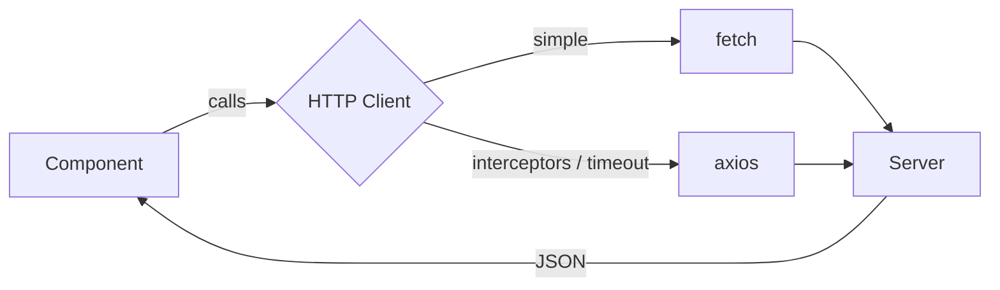
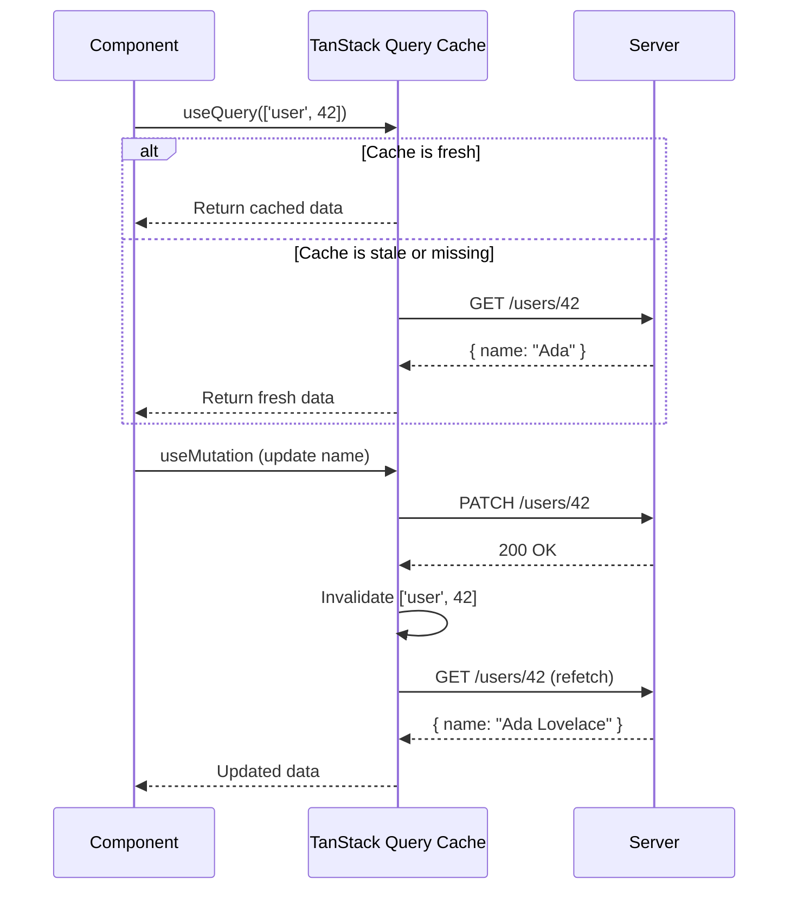
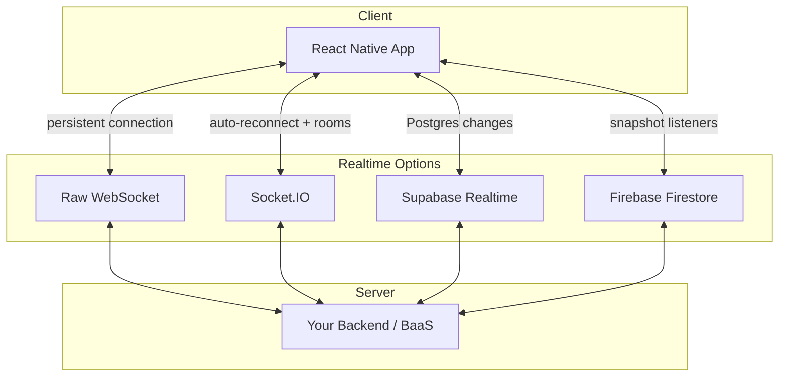
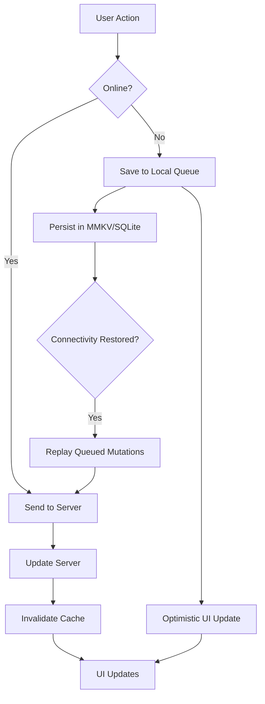

# Networking and Data: Fetching, Caching, and Going Offline

> HTTP requests, server state management, real-time connections, and offline-first patterns for mobile.

---

## Table of Contents

1. [HTTP](#1-http)
2. [Server State with TanStack Query](#2-server-state-with-tanstack-query)
3. [GraphQL](#3-graphql)
4. [Realtime](#4-realtime)
5. [Offline-First Patterns](#5-offline-first-patterns)

---

## 1. HTTP

On the web, you reach for `fetch` or `axios` without thinking twice. React Native ships with `fetch` built into its JavaScript runtime — no polyfill, no import, just call it. That is both the good news and the trap. Mobile networking is fundamentally different from the browser: connections drop in elevators, switch from Wi-Fi to cellular mid-request, and users expect your app to handle all of it gracefully.

### fetch: The Built-In Default

React Native's `fetch` follows the same WHATWG spec you know from the browser. It works identically for basic GET/POST calls:

```tsx
const response = await fetch('https://api.example.com/users/42');
const user = await response.json();
```

The catch — and this trips up nearly every newcomer — is that `fetch` does **not** reject on HTTP error status codes. A 404 or 500 gives you a resolved promise. You must check `response.ok` yourself:

```tsx
async function getUser(id: number) {
  const response = await fetch(`https://api.example.com/users/${id}`);
  if (!response.ok) {
    throw new Error(`HTTP ${response.status}: ${response.statusText}`);
  }
  return response.json();
}
```

For simple apps, `fetch` is all you need. But once you want request interceptors, automatic retries, or upload progress tracking, you will start building your own wrapper. That is when you should reach for a library instead.

### axios: When fetch Is Not Enough

`axios` gives you interceptors, automatic JSON transforms, request cancellation, and configurable timeouts out of the box. Set up a shared instance with your base URL and default headers once, then import it everywhere:

```tsx
// api/client.ts
import axios from 'axios';
import { getToken } from '../auth/storage';

const client = axios.create({
  baseURL: 'https://api.example.com',
  timeout: 10_000, // 10 seconds — generous for mobile
  headers: { 'Content-Type': 'application/json' },
});

// Attach auth token to every request
client.interceptors.request.use(async (config) => {
  const token = await getToken();
  if (token) {
    config.headers.Authorization = `Bearer ${token}`;
  }
  return config;
});

// Normalize error handling
client.interceptors.response.use(
  (response) => response,
  (error) => {
    if (error.response?.status === 401) {
      // Redirect to login or refresh token
    }
    return Promise.reject(error);
  },
);

export default client;
```

> **Gotcha:** Never hardcode your API base URL. Use environment variables (via `react-native-config` or Expo's `.env` support) so you can swap staging and production without rebuilding.

### Which Should You Pick?

Use `fetch` for prototypes and apps with one or two API calls. Use `axios` the moment you need interceptors, centralized error handling, or timeout control. Either way, neither `fetch` nor `axios` solve the real problem: managing the **state** of server data in your components. That is what the next section is for.



---

## 2. Server State with TanStack Query

Here is the problem raw `fetch` or `axios` cannot solve: you fetch a list of users, display it, navigate to a detail screen, go back, and the list re-fetches. Or worse, it doesn't re-fetch and shows stale data. You end up writing `isLoading`, `isError`, and caching logic by hand in every component. TanStack Query (formerly React Query) eliminates all of that and adds mobile-specific superpowers.

### Setup

```bash
npx expo install @tanstack/react-query
```

Wrap your app in a `QueryClientProvider`:

```tsx
import { QueryClient, QueryClientProvider } from '@tanstack/react-query';

const queryClient = new QueryClient({
  defaultOptions: {
    queries: {
      staleTime: 1000 * 60 * 5, // 5 minutes before data is "stale"
      gcTime: 1000 * 60 * 30,   // garbage-collect unused cache after 30 min
      retry: 2,
    },
  },
});

export default function App() {
  return (
    <QueryClientProvider client={queryClient}>
      <RootNavigator />
    </QueryClientProvider>
  );
}
```

### Queries and Mutations

A **query** fetches data. A **mutation** changes it.

```tsx
import { useQuery, useMutation, useQueryClient } from '@tanstack/react-query';
import client from '../api/client';

// Query: fetch a user
function useUser(id: number) {
  return useQuery({
    queryKey: ['user', id],
    queryFn: () => client.get(`/users/${id}`).then((r) => r.data),
  });
}

// Mutation: update a user
function useUpdateUser() {
  const queryClient = useQueryClient();
  return useMutation({
    mutationFn: (data: { id: number; name: string }) =>
      client.patch(`/users/${data.id}`, data),
    onSuccess: (_data, variables) => {
      // Invalidate so the query re-fetches
      queryClient.invalidateQueries({ queryKey: ['user', variables.id] });
    },
  });
}
```

### Optimistic Updates

Users on mobile expect instant feedback. Don't wait for the server — update the UI immediately and roll back if the request fails:

```tsx
useMutation({
  mutationFn: toggleLike,
  onMutate: async (postId) => {
    await queryClient.cancelQueries({ queryKey: ['post', postId] });
    const previous = queryClient.getQueryData(['post', postId]);
    queryClient.setQueryData(['post', postId], (old: Post) => ({
      ...old,
      liked: !old.liked,
    }));
    return { previous };
  },
  onError: (_err, postId, context) => {
    queryClient.setQueryData(['post', postId], context?.previous);
  },
  onSettled: (_data, _err, postId) => {
    queryClient.invalidateQueries({ queryKey: ['post', postId] });
  },
});
```

### Infinite Queries for Paginated Lists

Feeds, search results, message histories — mobile apps are full of paginated lists. `useInfiniteQuery` handles the cursor logic:

```tsx
function useFeed() {
  return useInfiniteQuery({
    queryKey: ['feed'],
    queryFn: ({ pageParam = 0 }) =>
      client.get(`/feed?cursor=${pageParam}`).then((r) => r.data),
    getNextPageParam: (lastPage) => lastPage.nextCursor ?? undefined,
    initialPageParam: 0,
  });
}
```

Pair this with a `FlatList` and `onEndReached` for seamless infinite scrolling.

### Key Configuration Knobs

| Option | What It Does | Recommended Default |
|---|---|---|
| `staleTime` | How long data is "fresh" (no refetch) | 5 min for most apps |
| `gcTime` | How long unused cache entries survive | 30 min |
| `refetchOnWindowFocus` | Refetch when app comes to foreground | `true` (use `focusManager` from TanStack for RN) |
| `retry` | Retry failed requests | 2 for queries, 0 for mutations |

> **Mobile-specific setup:** TanStack Query's `focusManager` and `onlineManager` don't automatically detect app state or network changes in React Native. You need to wire them up to `AppState` and `@react-native-community/netinfo` yourself. The official docs provide the exact snippet — do not skip this step.



---

## 3. GraphQL

REST works for most apps. But if your mobile client constantly over-fetches or under-fetches — hitting three endpoints to assemble a single screen — GraphQL starts making sense. It lets you ask for exactly the shape of data your component needs in one request.

### Apollo Client

Apollo is the most mature GraphQL client in the React Native ecosystem. It has its own cache, its own state management, and its own opinions. If you are going all-in on GraphQL, Apollo is the safe choice.

```bash
npx expo install @apollo/client graphql
```

```tsx
import { ApolloClient, InMemoryCache, ApolloProvider } from '@apollo/client';

const apolloClient = new ApolloClient({
  uri: 'https://api.example.com/graphql',
  cache: new InMemoryCache(),
});

export default function App() {
  return (
    <ApolloProvider client={apolloClient}>
      <RootNavigator />
    </ApolloProvider>
  );
}
```

Querying is component-local and declarative:

```tsx
import { gql, useQuery } from '@apollo/client';

const GET_USER = gql`
  query GetUser($id: ID!) {
    user(id: $id) {
      name
      avatar
      posts {
        id
        title
      }
    }
  }
`;

function UserProfile({ userId }: { userId: string }) {
  const { data, loading, error } = useQuery(GET_USER, {
    variables: { id: userId },
  });

  if (loading) return <LoadingSkeleton />;
  if (error) return <ErrorScreen message={error.message} />;

  return <ProfileCard user={data.user} />;
}
```

### urql: The Lighter Alternative

If Apollo feels heavy, `urql` is a lighter option with a plugin-based architecture. It has excellent React Native support and a smaller bundle:

```bash
npx expo install urql graphql @urql/exchange-persisted-fetch
```

The API surface is intentionally smaller. You get `useQuery`, `useMutation`, `useSubscription`, and exchanges (middleware) for caching, auth, and persistence. Pick `urql` if you want GraphQL without the weight. Pick Apollo if your team already uses it or you need its advanced cache normalization.

### Subscriptions via WebSockets

Both Apollo and urql support GraphQL subscriptions for real-time data. This uses WebSockets under the hood:

```tsx
import { gql, useSubscription } from '@apollo/client';

const ON_MESSAGE = gql`
  subscription OnMessage($channelId: ID!) {
    messageAdded(channelId: $channelId) {
      id
      text
      sender { name }
    }
  }
`;

function ChatMessages({ channelId }: { channelId: string }) {
  const { data } = useSubscription(ON_MESSAGE, {
    variables: { channelId },
  });
  // data.messageAdded updates every time the server pushes
}
```

> **Gotcha:** GraphQL is not free. You add a build step for code generation, a heavier client library, and your backend must support it. If your API is simple CRUD with a handful of endpoints, REST + TanStack Query is simpler and equally performant. Use GraphQL when the data graph is genuinely complex.

---

## 4. Realtime

Push notifications tell users something happened. Realtime connections let them **watch** it happen. Chat messages appearing instantly, live scoreboards, collaborative editing — these demand a persistent connection between client and server.

### Raw WebSocket API

React Native includes the WebSocket API, identical to the browser's:

```tsx
useEffect(() => {
  const ws = new WebSocket('wss://api.example.com/ws');

  ws.onopen = () => ws.send(JSON.stringify({ type: 'subscribe', channel: 'scores' }));
  ws.onmessage = (event) => {
    const data = JSON.parse(event.data);
    setScores((prev) => [...prev, data]);
  };
  ws.onerror = (e) => console.error('WebSocket error:', e);
  ws.onclose = () => console.log('Connection closed');

  return () => ws.close();
}, []);
```

This works but you are responsible for reconnection logic, heartbeats, and message serialization. For anything beyond a demo, use a higher-level library.

### Socket.IO

Socket.IO adds automatic reconnection, room-based channels, acknowledgments, and fallback transports:

```bash
npm install socket.io-client
```

```tsx
import { io } from 'socket.io-client';

const socket = io('https://api.example.com', {
  transports: ['websocket'], // Skip HTTP polling on mobile
  auth: { token: userToken },
});

socket.on('new-message', (msg) => {
  queryClient.setQueryData(['messages', msg.channelId], (old: Message[]) => [
    ...old,
    msg,
  ]);
});
```

> **Tip:** Always set `transports: ['websocket']` on mobile. The default HTTP long-polling fallback wastes bandwidth and battery.

### Backend-as-a-Service: Supabase and Firebase

If you don't want to run your own WebSocket server, managed services handle the infrastructure:

**Supabase Realtime** listens to Postgres changes:

```tsx
import { supabase } from '../lib/supabase';

useEffect(() => {
  const channel = supabase
    .channel('public:messages')
    .on('postgres_changes', { event: 'INSERT', schema: 'public', table: 'messages' },
      (payload) => setMessages((prev) => [...prev, payload.new])
    )
    .subscribe();

  return () => { supabase.removeChannel(channel); };
}, []);
```

**Firebase Firestore** snapshots provide real-time sync with offline persistence built in:

```tsx
import firestore from '@react-native-firebase/firestore';

useEffect(() => {
  const unsubscribe = firestore()
    .collection('messages')
    .where('channelId', '==', channelId)
    .orderBy('createdAt', 'desc')
    .onSnapshot((snapshot) => {
      const msgs = snapshot.docs.map((doc) => ({ id: doc.id, ...doc.data() }));
      setMessages(msgs);
    });

  return unsubscribe;
}, [channelId]);
```



Pick raw WebSockets only if you need full control. Pick Socket.IO for custom backends with rooms and acknowledgments. Pick Supabase or Firebase if you want managed infrastructure and your data model fits their paradigm.

---

## 5. Offline-First Patterns

Here is where mobile diverges most sharply from the web. A web app can show a "you're offline" banner and call it a day. A mobile app that stops working in a subway or a rural area is an uninstalled app. Offline-first means your app works without a connection and synchronizes when connectivity returns.

### Detecting Connectivity

The `@react-native-community/netinfo` library tells you the network state:

```bash
npx expo install @react-native-community/netinfo
```

```tsx
import NetInfo from '@react-native-community/netinfo';

// One-time check
const state = await NetInfo.fetch();
console.log(state.isConnected); // true or false

// Subscribe to changes
const unsubscribe = NetInfo.addEventListener((state) => {
  console.log('Connected:', state.isConnected);
  console.log('Type:', state.type); // wifi, cellular, none
});
```

Wire this into TanStack Query's `onlineManager` so queries automatically pause when offline and resume when connectivity returns:

```tsx
import NetInfo from '@react-native-community/netinfo';
import { onlineManager } from '@tanstack/react-query';

onlineManager.setEventListener((setOnline) =>
  NetInfo.addEventListener((state) => {
    setOnline(!!state.isConnected);
  }),
);
```

### Persisting the Query Cache

TanStack Query keeps its cache in memory. Kill the app and it's gone. On mobile, you want the cache to survive restarts so users see data immediately on cold launch. Persist the cache to MMKV (fast, synchronous) or AsyncStorage (slower, async):

```bash
npx expo install @tanstack/react-query-persist-client react-native-mmkv
```

```tsx
import { MMKV } from 'react-native-mmkv';
import { createSyncStoragePersister } from '@tanstack/query-sync-storage-persister';
import { PersistQueryClientProvider } from '@tanstack/react-query-persist-client';

const storage = new MMKV();

const mmkvPersister = createSyncStoragePersister({
  storage: {
    getItem: (key) => storage.getString(key) ?? null,
    setItem: (key, value) => storage.set(key, value),
    removeItem: (key) => storage.delete(key),
  },
});

export default function App() {
  return (
    <PersistQueryClientProvider
      client={queryClient}
      persistOptions={{ persister: mmkvPersister, maxAge: 1000 * 60 * 60 * 24 }}
    >
      <RootNavigator />
    </PersistQueryClientProvider>
  );
}
```

Now your app opens instantly with cached data, even in airplane mode.

### Offline Mutation Queue

Reading cached data offline is easy. Writing is harder. If a user likes a post while offline, that mutation needs to queue and replay when connectivity returns. TanStack Query supports this natively with `networkMode`:

```tsx
const queryClient = new QueryClient({
  defaultOptions: {
    mutations: {
      networkMode: 'offlineFirst', // Queue mutations when offline
    },
  },
});
```

For full control, you can build a custom mutation queue backed by MMKV that persists across app restarts:

```tsx
// Simplified pattern
function useOfflineMutation<T>(mutationFn: (data: T) => Promise<unknown>) {
  const netInfo = useNetInfo();

  return useMutation({
    mutationFn: async (data: T) => {
      if (!netInfo.isConnected) {
        // Persist to local queue
        addToQueue({ fn: mutationFn.name, data, timestamp: Date.now() });
        return; // Optimistically succeed
      }
      return mutationFn(data);
    },
  });
}
```

### True Offline-First: Local Databases

If your app needs to work extensively offline — field service apps, note-taking tools, collaborative editors — caching API responses is not enough. You need a local database that syncs with your server.

**WatermelonDB** is built for React Native. It uses a SQLite backend, lazy loading, and observable queries that re-render components when data changes:

```tsx
import { Database } from '@nozbe/watermelondb';
import SQLiteAdapter from '@nozbe/watermelondb/adapters/sqlite';

const adapter = new SQLiteAdapter({ schema, migrations });
const database = new Database({ adapter, modelClasses: [Post, Comment] });
```

**PowerSync** is a newer option that syncs a local SQLite database with your Postgres backend using a sync protocol. It handles conflict resolution and gives you a SQL interface locally:

```tsx
import { PowerSyncDatabase } from '@powersync/react-native';

const db = new PowerSyncDatabase({
  schema: AppSchema,
  database: { dbFilename: 'app.db' },
});

await db.connect(new SupabaseConnector());
```

> **When to use what:** Most apps need only TanStack Query + MMKV persistence. Reach for WatermelonDB or PowerSync when your app must create, edit, and query complex data locally while offline for extended periods. The sync complexity is real — don't adopt it prematurely.



The golden rule of offline-first: **always update the UI immediately.** Whether the data goes to the server now or later is an implementation detail the user should never notice.

---