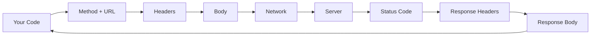
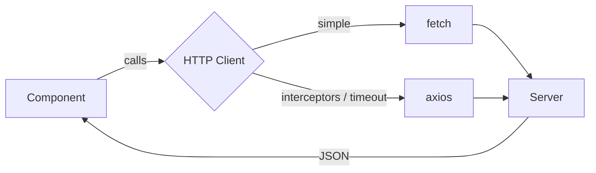
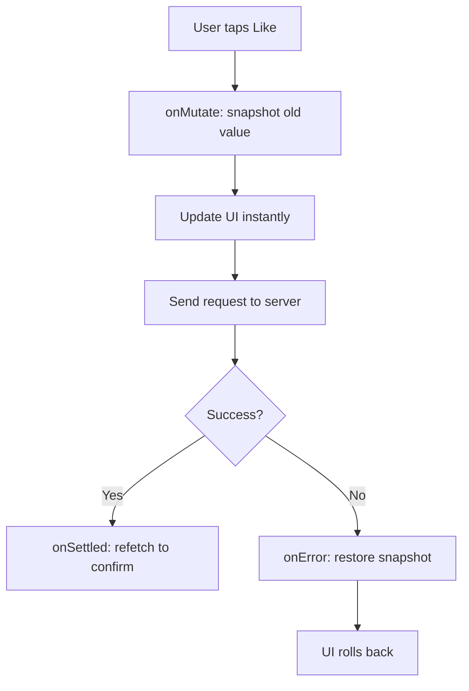
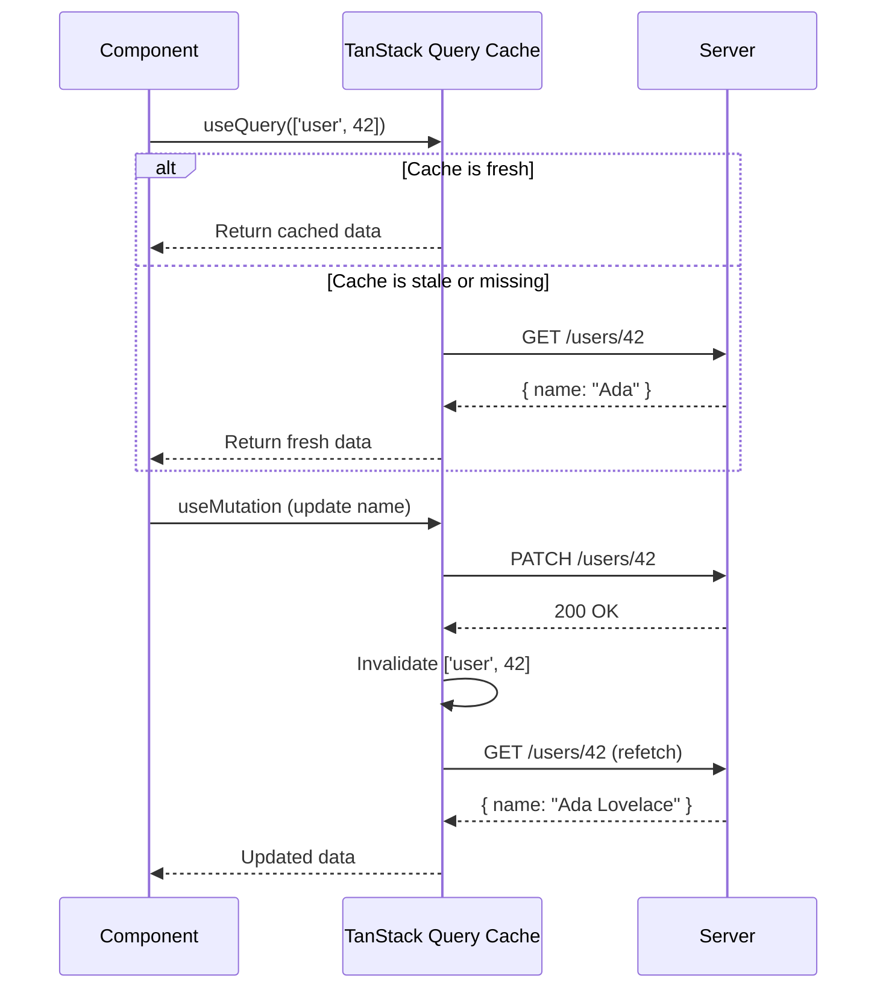
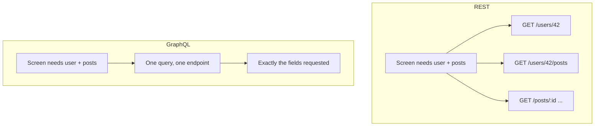
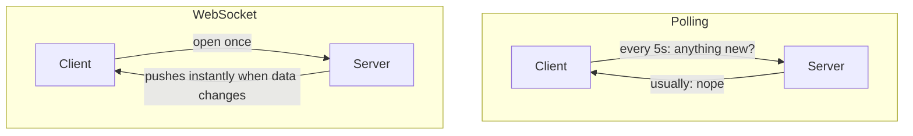
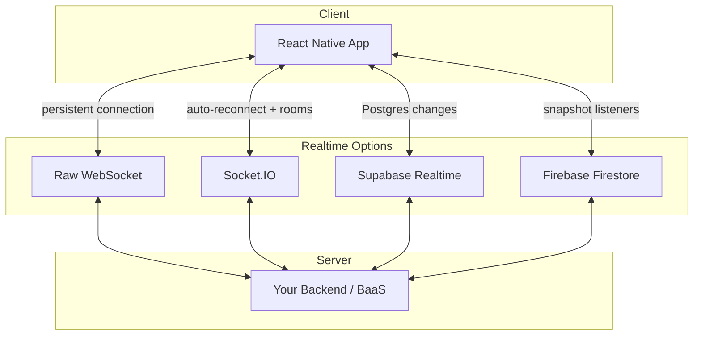
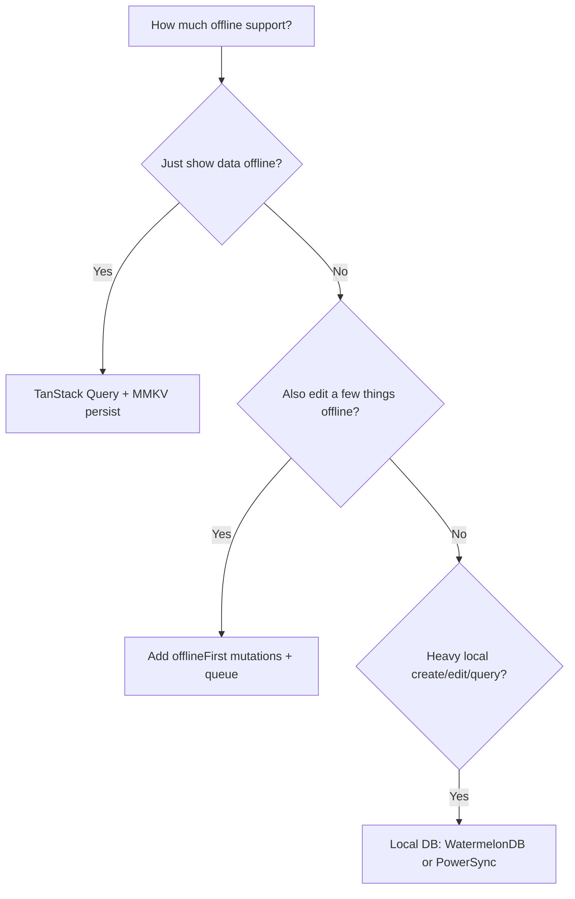
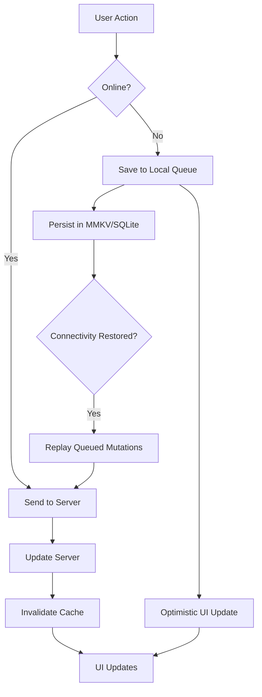

# Networking and Data: Fetching, Caching, and Going Offline

> HTTP requests, server state management, real-time connections, and offline-first patterns for mobile.

---

## Table of Contents

1. [HTTP](#1-http)
2. [Server State with TanStack Query](#2-server-state-with-tanstack-query)
3. [GraphQL](#3-graphql)
4. [Realtime](#4-realtime)
5. [Offline-First Patterns](#5-offline-first-patterns)

---

## 1. HTTP

On the web, you reach for `fetch` or `axios` without thinking twice. React Native ships with `fetch` built into its JavaScript runtime — no polyfill, no import, just call it. That is both the good news and the trap. Mobile networking is fundamentally different from the browser: connections drop in elevators, switch from Wi-Fi to cellular mid-request, and users expect your app to handle all of it gracefully.

### Why mobile networking is different

In a browser tab, the network is mostly stable: the user is on Wi-Fi or a wired connection, the tab stays open, and a failed request usually means the server is down. On a phone, the network is a moving target. Picture a commuter opening your app on the train: full LTE at the platform, dead zone in the tunnel, patchy 3G as the train surfaces, then a handoff to station Wi-Fi. Your request might *start* on cellular and *finish* on Wi-Fi — or never finish at all.

This is why three things matter far more on mobile than on the web:

- **Timeouts** — a hung request on a flaky connection should fail fast, not spin forever and drain the battery.
- **Retries** — a transient failure (one dropped packet) is normal, not exceptional. Retrying once or twice often "just works."
- **Error UI** — every screen that fetches needs a visible loading, error, and empty state, because all three *will* happen in the real world.

> **Think of it like this:** a browser request is a phone call on a landline. A mobile request is a walkie-talkie conversation while walking through a building — you plan for static and dropped words.

### The anatomy of an HTTP request

Whatever client you use, every request has the same moving parts. Understanding them makes debugging far easier when something returns the wrong data.



- **Method** — `GET` (read), `POST` (create), `PATCH`/`PUT` (update), `DELETE` (remove).
- **Headers** — metadata: `Content-Type`, `Authorization`, etc.
- **Body** — the payload (usually JSON) sent with `POST`/`PATCH`.
- **Status code** — `2xx` success, `3xx` redirect, `4xx` your mistake (bad request, unauthorized), `5xx` the server's mistake.

### fetch: The Built-In Default

React Native's `fetch` follows the same WHATWG spec you know from the browser. It works identically for basic GET/POST calls:

```tsx
const response = await fetch('https://api.example.com/users/42');
const user = await response.json();
```

The catch — and this trips up nearly every newcomer — is that `fetch` does **not** reject on HTTP error status codes. A 404 or 500 gives you a resolved promise. You must check `response.ok` yourself:

```tsx
async function getUser(id: number) {
  const response = await fetch(`https://api.example.com/users/${id}`);
  if (!response.ok) {
    throw new Error(`HTTP ${response.status}: ${response.statusText}`);
  }
  return response.json();
}
```

> **Common mistake:** assuming `try/catch` around `fetch` catches a 500. It does not. The `catch` block only fires for *network-level* failures (no connection, DNS failure, timeout). An HTTP 500 is a *successful* network round-trip that happened to carry an error status — so you must inspect `response.ok` explicitly. This is the single most common `fetch` bug for newcomers.

A more complete `fetch` with a timeout (mobile-essential) and a typed body looks like this:

```tsx
async function postJson<T>(url: string, body: unknown): Promise<T> {
  // AbortController lets us cancel a hung request after 10s
  const controller = new AbortController();
  const timeout = setTimeout(() => controller.abort(), 10_000);

  try {
    const res = await fetch(url, {
      method: 'POST',
      headers: { 'Content-Type': 'application/json' },
      body: JSON.stringify(body),
      signal: controller.signal, // wires the timeout to the request
    });
    if (!res.ok) throw new Error(`HTTP ${res.status}`);
    return (await res.json()) as T;
  } finally {
    clearTimeout(timeout); // always clean up the timer
  }
}
```

> **Gotcha:** plain `fetch` has **no built-in timeout**. Without an `AbortController`, a request on a dead connection can hang indefinitely. On the web you might never notice; on mobile it's a frozen spinner and a wasted battery.

For simple apps, `fetch` is all you need. But once you want request interceptors, automatic retries, or upload progress tracking, you will start building your own wrapper. That is when you should reach for a library instead.

### axios: When fetch Is Not Enough

`axios` gives you interceptors, automatic JSON transforms, request cancellation, and configurable timeouts out of the box. The killer feature is the **interceptor** — a function that runs on *every* request or response, so you can attach an auth token or normalize errors in exactly one place instead of repeating it in every call.

Set up a shared instance with your base URL and default headers once, then import it everywhere:

```tsx
// api/client.ts
import axios from 'axios';
import { getToken } from '../auth/storage';

const client = axios.create({
  baseURL: 'https://api.example.com',
  timeout: 10_000, // 10 seconds — generous for mobile
  headers: { 'Content-Type': 'application/json' },
});

// Attach auth token to every request
client.interceptors.request.use(async (config) => {
  const token = await getToken();
  if (token) {
    config.headers.Authorization = `Bearer ${token}`;
  }
  return config;
});

// Normalize error handling
client.interceptors.response.use(
  (response) => response,
  (error) => {
    if (error.response?.status === 401) {
      // Redirect to login or refresh token
    }
    return Promise.reject(error);
  },
);

export default client;
```

Two `axios` conveniences that save real boilerplate versus `fetch`:

```tsx
// 1. axios THROWS on 4xx/5xx automatically — no response.ok check needed
try {
  const { data } = await client.get('/users/42'); // data is already parsed JSON
} catch (err) {
  // fires for HTTP errors AND network errors
}

// 2. Response is already JSON — no `await res.json()` second step
```

> **Gotcha:** Never hardcode your API base URL. Use environment variables (via `react-native-config` or Expo's `.env` support) so you can swap staging and production without rebuilding.

> **Pro tip:** Interceptors are the right place to handle token refresh. When a `401` comes back, the response interceptor can transparently fetch a new token and retry the original request — the calling component never even knows it happened.

### Which Should You Pick?

| Need | `fetch` | `axios` |
|---|---|---|
| Bundle size | Zero (built in) | ~13 KB |
| Errors on 4xx/5xx | No — check `response.ok` | Yes — throws automatically |
| Auto JSON parse | No — `await res.json()` | Yes — `response.data` |
| Timeout | Manual (`AbortController`) | Built-in (`timeout` option) |
| Interceptors | Build your own wrapper | First-class |
| Upload progress | Not supported | Supported |
| **When to use** | Prototypes, 1–2 API calls | Real apps, auth, shared config |

Use `fetch` for prototypes and apps with one or two API calls. Use `axios` the moment you need interceptors, centralized error handling, or timeout control. Either way, neither `fetch` nor `axios` solve the real problem: managing the **state** of server data in your components. That is what the next section is for.



---

## 2. Server State with TanStack Query

Here is the problem raw `fetch` or `axios` cannot solve: you fetch a list of users, display it, navigate to a detail screen, go back, and the list re-fetches. Or worse, it doesn't re-fetch and shows stale data. You end up writing `isLoading`, `isError`, and caching logic by hand in every component. TanStack Query (formerly React Query) eliminates all of that and adds mobile-specific superpowers.

### Server state is not client state

The mental shift that makes TanStack Query click: **server data is not your data — it's a cached copy of someone else's data.** The user's name lives in the database on a server. Your app holds a temporary snapshot that can go stale the moment another device edits it. That is fundamentally different from a toggle or a form field (client state), which only your app owns.

| | Client state | Server state |
|---|---|---|
| Owned by | Your app | A remote server |
| Can go stale | No | Yes — anytime |
| Tools | `useState`, Zustand, Redux | TanStack Query, Apollo |
| Key questions | What is the value? | Is it fresh? Should I refetch? |

Trying to manage server state with `useState` + `useEffect` means reinventing caching, deduplication, retries, and refetch-on-focus by hand. TanStack Query is the library that already solved all of it.

> **Analogy:** Think of TanStack Query as a smart fridge. You ask for milk (data) by name (the query key). If the fridge has fresh milk, you get it instantly. If it's past the "best before" date (`staleTime`), the fridge quietly restocks in the background while still handing you what it has. If nobody drinks a carton for a while, it gets thrown out (`gcTime`).

### Setup

```bash
npx expo install @tanstack/react-query
```

Wrap your app in a `QueryClientProvider`:

```tsx
import { QueryClient, QueryClientProvider } from '@tanstack/react-query';

const queryClient = new QueryClient({
  defaultOptions: {
    queries: {
      staleTime: 1000 * 60 * 5, // 5 minutes before data is "stale"
      gcTime: 1000 * 60 * 30,   // garbage-collect unused cache after 30 min
      retry: 2,
    },
  },
});

export default function App() {
  return (
    <QueryClientProvider client={queryClient}>
      <RootNavigator />
    </QueryClientProvider>
  );
}
```

### The query key: the heart of the cache

Every query is identified by a **query key** — a serializable array like `['user', 42]`. This is the address in the cache. Two components asking for `['user', 42]` share *one* request and *one* cached result automatically (this is called deduplication). When you change a piece of the key — `['user', 43]` — it's a different address, a different cache entry, a different fetch.

```tsx
// Same key anywhere in the app = same cache entry, one network request
useQuery({ queryKey: ['user', 42], queryFn: ... }); // ScreenA
useQuery({ queryKey: ['user', 42], queryFn: ... }); // ScreenB — no second fetch!

// Keys are hierarchical — invalidate broadly or narrowly
['todos']            // all todos
['todos', { done: true }] // a filtered subset
['todos', 42]        // a single todo
```

> **Pro tip:** put every value the `queryFn` depends on into the key. If your fetch uses `userId` and `locale`, the key should be `['user', userId, locale]`. Forget one, and switching locale will show you stale data from the wrong language.

### Queries and Mutations

A **query** fetches data (a read). A **mutation** changes it (a write). The split mirrors HTTP: queries are your `GET`s, mutations are your `POST`/`PATCH`/`DELETE`s.

```tsx
import { useQuery, useMutation, useQueryClient } from '@tanstack/react-query';
import client from '../api/client';

// Query: fetch a user
function useUser(id: number) {
  return useQuery({
    queryKey: ['user', id],
    queryFn: () => client.get(`/users/${id}`).then((r) => r.data),
  });
}

// Mutation: update a user
function useUpdateUser() {
  const queryClient = useQueryClient();
  return useMutation({
    mutationFn: (data: { id: number; name: string }) =>
      client.patch(`/users/${data.id}`, data),
    onSuccess: (_data, variables) => {
      // Invalidate so the query re-fetches
      queryClient.invalidateQueries({ queryKey: ['user', variables.id] });
    },
  });
}
```

A query gives you everything a component needs to render all three states without any `useState`:

```tsx
function UserScreen({ id }: { id: number }) {
  const { data, isLoading, isError, refetch } = useUser(id);

  if (isLoading) return <Spinner />;        // first load
  if (isError) return <RetryButton onPress={refetch} />; // failed
  return <Text>{data.name}</Text>;          // success
}
```

> **Compared to the web:** on a web app you might get away with refetching on every mount because navigation is a full remount anyway. In React Native, screens stay mounted in the navigation stack — so without a cache you'd either over-fetch or show stale data. TanStack Query's staleness model is what makes native navigation feel instant.

### Optimistic Updates

Users on mobile expect instant feedback. Don't wait for the server — update the UI immediately and roll back if the request fails. The pattern has three hooks: snapshot the old value (`onMutate`), restore it on failure (`onError`), and re-sync with the server when done (`onSettled`).

```tsx
useMutation({
  mutationFn: toggleLike,
  onMutate: async (postId) => {
    await queryClient.cancelQueries({ queryKey: ['post', postId] });
    const previous = queryClient.getQueryData(['post', postId]);
    queryClient.setQueryData(['post', postId], (old: Post) => ({
      ...old,
      liked: !old.liked,
    }));
    return { previous }; // hand the snapshot to onError
  },
  onError: (_err, postId, context) => {
    queryClient.setQueryData(['post', postId], context?.previous); // roll back
  },
  onSettled: (_data, _err, postId) => {
    queryClient.invalidateQueries({ queryKey: ['post', postId] }); // re-sync
  },
});
```



> **Why this matters on mobile:** a like button that waits 400ms for a round-trip feels broken. Optimistic updates make the tap feel native and instant — the network work happens invisibly in the background.

### Infinite Queries for Paginated Lists

Feeds, search results, message histories — mobile apps are full of paginated lists. Rather than loading 10,000 rows at once (which would blow up memory and scroll performance), you load one **page** at a time and fetch the next page as the user scrolls. `useInfiniteQuery` handles the cursor logic:

```tsx
function useFeed() {
  return useInfiniteQuery({
    queryKey: ['feed'],
    queryFn: ({ pageParam = 0 }) =>
      client.get(`/feed?cursor=${pageParam}`).then((r) => r.data),
    getNextPageParam: (lastPage) => lastPage.nextCursor ?? undefined,
    initialPageParam: 0,
  });
}
```

Pair this with a `FlatList` and `onEndReached` for seamless infinite scrolling:

```tsx
function Feed() {
  const { data, fetchNextPage, hasNextPage, isFetchingNextPage } = useFeed();
  // flatten the array of pages into one list of items
  const items = data?.pages.flatMap((p) => p.items) ?? [];

  return (
    <FlatList
      data={items}
      keyExtractor={(item) => item.id}
      renderItem={({ item }) => <PostCard post={item} />}
      onEndReached={() => hasNextPage && fetchNextPage()} // load next page near the bottom
      onEndReachedThreshold={0.5} // trigger when 50% from the end
      ListFooterComponent={isFetchingNextPage ? <Spinner /> : null}
    />
  );
}
```

> **Gotcha:** a query returns one object; an infinite query returns `data.pages` — an *array of pages*. You almost always want `data.pages.flatMap(...)` to feed a flat list into `FlatList`.

### Key Configuration Knobs

| Option | What It Does | Recommended Default |
|---|---|---|
| `staleTime` | How long data is "fresh" (no refetch) | 5 min for most apps |
| `gcTime` | How long unused cache entries survive | 30 min |
| `refetchOnWindowFocus` | Refetch when app comes to foreground | `true` (use `focusManager` from TanStack for RN) |
| `retry` | Retry failed requests | 2 for queries, 0 for mutations |

> **`staleTime` vs `gcTime` — the confusing pair:** `staleTime` controls *freshness* (when to refetch in the background). `gcTime` controls *memory* (when to delete an entry no component is using). A query can be stale but still cached, or fresh but garbage-collected after you leave the screen. They answer different questions: "should I refetch?" vs "can I forget?"

> **Mobile-specific setup:** TanStack Query's `focusManager` and `onlineManager` don't automatically detect app state or network changes in React Native. On the web, "window focus" and `navigator.onLine` are built into the browser — in RN there's no window and no `navigator.onLine`, so you must wire them to `AppState` and `@react-native-community/netinfo` yourself. The official docs provide the exact snippet — do not skip this step.



---

## 3. GraphQL

REST works for most apps. But if your mobile client constantly over-fetches or under-fetches — hitting three endpoints to assemble a single screen — GraphQL starts making sense. It lets you ask for exactly the shape of data your component needs in one request.

### REST vs GraphQL: the core difference

With REST, the *server* decides the shape of each response. Want a user's name, avatar, and their last five posts? That might be `GET /users/42`, then `GET /users/42/posts`, then a request per post. This is **under-fetching** (too few fields per call, so you make many calls) and **over-fetching** (an endpoint returns 30 fields when you needed 3). On a slow mobile connection, every extra round-trip hurts.

With GraphQL, the *client* describes the exact tree of data it wants, and the server returns precisely that — in a single request to a single endpoint.



| | REST | GraphQL |
|---|---|---|
| Endpoints | Many (`/users`, `/posts`…) | One (`/graphql`) |
| Response shape | Fixed by server | Chosen by client |
| Over/under-fetching | Common | Avoided by design |
| Round-trips per screen | Often several | Usually one |
| Setup cost | Low | Higher (schema, codegen, client) |
| **Best for** | Simple CRUD APIs | Complex, deeply nested data graphs |

### Apollo Client

Apollo is the most mature GraphQL client in the React Native ecosystem. It has its own cache, its own state management, and its own opinions. If you are going all-in on GraphQL, Apollo is the safe choice.

```bash
npx expo install @apollo/client graphql
```

```tsx
import { ApolloClient, InMemoryCache, ApolloProvider } from '@apollo/client';

const apolloClient = new ApolloClient({
  uri: 'https://api.example.com/graphql',
  cache: new InMemoryCache(),
});

export default function App() {
  return (
    <ApolloProvider client={apolloClient}>
      <RootNavigator />
    </ApolloProvider>
  );
}
```

Querying is component-local and declarative:

```tsx
import { gql, useQuery } from '@apollo/client';

const GET_USER = gql`
  query GetUser($id: ID!) {
    user(id: $id) {
      name
      avatar
      posts {
        id
        title
      }
    }
  }
`;

function UserProfile({ userId }: { userId: string }) {
  const { data, loading, error } = useQuery(GET_USER, {
    variables: { id: userId },
  });

  if (loading) return <LoadingSkeleton />;
  if (error) return <ErrorScreen message={error.message} />;

  return <ProfileCard user={data.user} />;
}
```

Notice the shape of `data` mirrors the shape of your query exactly — if you asked for `name` and `posts.title`, that's precisely what comes back. Apollo also normalizes results into its cache by object ID, so editing a user in one screen updates every other screen showing that user, automatically.

> **Pro tip:** pair GraphQL with **GraphQL Code Generator** to turn your `.graphql` queries into fully typed React hooks. You get autocomplete on `data.user.name` and a compile error the moment the schema changes — a huge safety net on a moving backend.

### urql: The Lighter Alternative

If Apollo feels heavy, `urql` is a lighter option with a plugin-based architecture. It has excellent React Native support and a smaller bundle:

```bash
npx expo install urql graphql @urql/exchange-persisted-fetch
```

The API surface is intentionally smaller. You get `useQuery`, `useMutation`, `useSubscription`, and **exchanges** (middleware) for caching, auth, and persistence. Think of exchanges like axios interceptors: small, composable functions that each request flows through. Pick `urql` if you want GraphQL without the weight. Pick Apollo if your team already uses it or you need its advanced cache normalization.

| | Apollo Client | urql |
|---|---|---|
| Bundle size | Larger | Smaller |
| Cache | Normalized by default | Document cache (normalized via add-on) |
| Configuration | More opinionated | Plugin-based (exchanges) |
| **When to use** | Complex caching, big teams | Lean apps, simpler needs |

### Subscriptions via WebSockets

Both Apollo and urql support GraphQL subscriptions for real-time data. Where a query is a one-time pull, a **subscription** is an open pipe — the server pushes new data as events happen. This uses WebSockets under the hood (the same persistent-connection idea covered in the next section):

```tsx
import { gql, useSubscription } from '@apollo/client';

const ON_MESSAGE = gql`
  subscription OnMessage($channelId: ID!) {
    messageAdded(channelId: $channelId) {
      id
      text
      sender { name }
    }
  }
`;

function ChatMessages({ channelId }: { channelId: string }) {
  const { data } = useSubscription(ON_MESSAGE, {
    variables: { channelId },
  });
  // data.messageAdded updates every time the server pushes
}
```

> **Gotcha:** GraphQL is not free. You add a build step for code generation, a heavier client library, and your backend must support it. If your API is simple CRUD with a handful of endpoints, REST + TanStack Query is simpler and equally performant. Use GraphQL when the data graph is genuinely complex.

---

## 4. Realtime

Push notifications tell users something happened. Realtime connections let them **watch** it happen. Chat messages appearing instantly, live scoreboards, collaborative editing — these demand a persistent connection between client and server.

### Why polling isn't enough

Your first instinct might be to call an endpoint every few seconds to check for new data ("polling"). It works, but it's wasteful: most requests return "nothing new," and on mobile that means burned battery, wasted cellular data, and a delay of up to your polling interval. A **persistent connection** flips the model — instead of the client repeatedly asking "anything new?", the server *pushes* the moment something changes.



A WebSocket starts life as a normal HTTP request, then "upgrades" into a long-lived, two-way channel that stays open. Both sides can send messages at any time, with almost no per-message overhead. That's what makes chat feel instant.

### Raw WebSocket API

React Native includes the WebSocket API, identical to the browser's:

```tsx
useEffect(() => {
  const ws = new WebSocket('wss://api.example.com/ws');

  ws.onopen = () => ws.send(JSON.stringify({ type: 'subscribe', channel: 'scores' }));
  ws.onmessage = (event) => {
    const data = JSON.parse(event.data);
    setScores((prev) => [...prev, data]);
  };
  ws.onerror = (e) => console.error('WebSocket error:', e);
  ws.onclose = () => console.log('Connection closed');

  return () => ws.close(); // ALWAYS close on unmount to avoid leaks
}, []);
```

This works but you are responsible for the hard parts that a real app needs:

- **Reconnection** — when the train enters a tunnel, the socket dies silently. You must detect the close and reconnect with backoff.
- **Heartbeats** — send a periodic ping so you (and any proxy in between) know the connection is still alive.
- **Message serialization** — every message is a string you `JSON.parse` by hand, with no type safety.

For anything beyond a demo, use a higher-level library that handles these for you.

> **Gotcha:** forgetting `return () => ws.close()` in your `useEffect` leaks a connection every time the screen mounts. After a few navigations you can have a pile of zombie sockets all pushing into dead components.

### Socket.IO

Socket.IO adds automatic reconnection, room-based channels, acknowledgments, and fallback transports:

```bash
npm install socket.io-client
```

```tsx
import { io } from 'socket.io-client';

const socket = io('https://api.example.com', {
  transports: ['websocket'], // Skip HTTP polling on mobile
  auth: { token: userToken },
});

socket.on('new-message', (msg) => {
  queryClient.setQueryData(['messages', msg.channelId], (old: Message[]) => [
    ...old,
    msg,
  ]);
});
```

Notice how the realtime event writes directly into the TanStack Query cache with `setQueryData` — this is the common pattern: let your normal queries render the data, and let the socket *push updates into that same cache* so every screen stays in sync.

> **Tip:** Always set `transports: ['websocket']` on mobile. The default HTTP long-polling fallback wastes bandwidth and battery.

### Backend-as-a-Service: Supabase and Firebase

If you don't want to run your own WebSocket server, managed services handle the infrastructure:

**Supabase Realtime** listens to Postgres changes:

```tsx
import { supabase } from '../lib/supabase';

useEffect(() => {
  const channel = supabase
    .channel('public:messages')
    .on('postgres_changes', { event: 'INSERT', schema: 'public', table: 'messages' },
      (payload) => setMessages((prev) => [...prev, payload.new])
    )
    .subscribe();

  return () => { supabase.removeChannel(channel); };
}, []);
```

**Firebase Firestore** snapshots provide real-time sync with offline persistence built in:

```tsx
import firestore from '@react-native-firebase/firestore';

useEffect(() => {
  const unsubscribe = firestore()
    .collection('messages')
    .where('channelId', '==', channelId)
    .orderBy('createdAt', 'desc')
    .onSnapshot((snapshot) => {
      const msgs = snapshot.docs.map((doc) => ({ id: doc.id, ...doc.data() }));
      setMessages(msgs);
    });

  return unsubscribe;
}, [channelId]);
```



Use this table to choose:

| Option | Reconnection / rooms | You run the server? | Best for |
|---|---|---|---|
| Raw WebSocket | You build it | Yes | Full control, learning, tiny scope |
| Socket.IO | Built in | Yes | Custom backends with rooms + acks |
| Supabase Realtime | Managed | No | Postgres-backed apps |
| Firebase Firestore | Managed | No | Offline-first sync out of the box |

Pick raw WebSockets only if you need full control. Pick Socket.IO for custom backends with rooms and acknowledgments. Pick Supabase or Firebase if you want managed infrastructure and your data model fits their paradigm.

---

## 5. Offline-First Patterns

Here is where mobile diverges most sharply from the web. A web app can show a "you're offline" banner and call it a day. A mobile app that stops working in a subway or a rural area is an uninstalled app. Offline-first means your app works without a connection and synchronizes when connectivity returns.

### The offline-first mindset

The core shift: treat the **local device as the source of truth for the UI**, and the network as a background sync process. The user taps, the local store updates, the screen re-renders — all without touching the network. Sending those changes to the server is a separate, asynchronous concern that can happen now, in five seconds, or when the train leaves the tunnel.

This is the opposite of the naive model where every action waits on a server response. The payoff: your app feels instant and never "breaks" when the signal drops.

There are three layers to get right, in increasing order of effort:

1. **Detect connectivity** — know when you're online or offline.
2. **Persist reads** — show cached data instantly on cold launch.
3. **Queue writes** — let users make changes offline and replay them later.

### Detecting Connectivity

The `@react-native-community/netinfo` library tells you the network state. (On the web you'd read `navigator.onLine`; that doesn't exist in React Native, so this library fills the gap and adds far more detail — Wi-Fi vs cellular, signal strength, and more.)

```bash
npx expo install @react-native-community/netinfo
```

```tsx
import NetInfo from '@react-native-community/netinfo';

// One-time check
const state = await NetInfo.fetch();
console.log(state.isConnected); // true or false

// Subscribe to changes
const unsubscribe = NetInfo.addEventListener((state) => {
  console.log('Connected:', state.isConnected);
  console.log('Type:', state.type); // wifi, cellular, none
});
```

Wire this into TanStack Query's `onlineManager` so queries automatically pause when offline and resume when connectivity returns:

```tsx
import NetInfo from '@react-native-community/netinfo';
import { onlineManager } from '@tanstack/react-query';

onlineManager.setEventListener((setOnline) =>
  NetInfo.addEventListener((state) => {
    setOnline(!!state.isConnected);
  }),
);
```

> **Gotcha:** `isConnected` means "attached to a network," not "the internet works." A captive-portal Wi-Fi (hotel, airport) can report `isConnected: true` while every request fails. For certainty, check `state.isInternetReachable`, which actually probes for reachability.

### Persisting the Query Cache

TanStack Query keeps its cache in memory. Kill the app and it's gone. On mobile, you want the cache to survive restarts so users see data immediately on cold launch. Persist the cache to MMKV (fast, synchronous) or AsyncStorage (slower, async):

```bash
npx expo install @tanstack/react-query-persist-client react-native-mmkv
```

```tsx
import { MMKV } from 'react-native-mmkv';
import { createSyncStoragePersister } from '@tanstack/query-sync-storage-persister';
import { PersistQueryClientProvider } from '@tanstack/react-query-persist-client';

const storage = new MMKV();

const mmkvPersister = createSyncStoragePersister({
  storage: {
    getItem: (key) => storage.getString(key) ?? null,
    setItem: (key, value) => storage.set(key, value),
    removeItem: (key) => storage.delete(key),
  },
});

export default function App() {
  return (
    <PersistQueryClientProvider
      client={queryClient}
      persistOptions={{ persister: mmkvPersister, maxAge: 1000 * 60 * 60 * 24 }}
    >
      <RootNavigator />
    </PersistQueryClientProvider>
  );
}
```

Now your app opens instantly with cached data, even in airplane mode.

| Storage | Speed | API | Best for |
|---|---|---|---|
| MMKV | Very fast | Synchronous | Query cache, key-value settings |
| AsyncStorage | Slower | Async (Promise) | Simple needs, max compatibility |
| SQLite (Watermelon/PowerSync) | Fast for queries | SQL | Large relational offline data |

> **Pro tip:** set a sensible `maxAge` (here, 24 hours). You don't want to hydrate a week-old cache on launch and show wildly stale prices or messages before the refetch lands.

### Offline Mutation Queue

Reading cached data offline is easy. Writing is harder. If a user likes a post while offline, that mutation needs to queue and replay when connectivity returns. TanStack Query supports this natively with `networkMode`:

```tsx
const queryClient = new QueryClient({
  defaultOptions: {
    mutations: {
      networkMode: 'offlineFirst', // Queue mutations when offline
    },
  },
});
```

For full control, you can build a custom mutation queue backed by MMKV that persists across app restarts:

```tsx
// Simplified pattern
function useOfflineMutation<T>(mutationFn: (data: T) => Promise<unknown>) {
  const netInfo = useNetInfo();

  return useMutation({
    mutationFn: async (data: T) => {
      if (!netInfo.isConnected) {
        // Persist to local queue
        addToQueue({ fn: mutationFn.name, data, timestamp: Date.now() });
        return; // Optimistically succeed
      }
      return mutationFn(data);
    },
  });
}
```

> **Gotcha — conflict resolution:** the hard part of offline writes isn't queuing, it's *conflicts*. If you edit a note offline and someone else edits the same note on the server, whose version wins? Common strategies are "last write wins" (simple, can lose data) or merge-on-field (complex). Decide this *before* you ship, not after a user reports lost work.

### True Offline-First: Local Databases

If your app needs to work extensively offline — field service apps, note-taking tools, collaborative editors — caching API responses is not enough. You need a local database that syncs with your server. The difference: a query cache stores *responses* you fetched; a local database lets you *create, edit, relate, and query* records locally, then reconciles with the server later.

**WatermelonDB** is built for React Native. It uses a SQLite backend, lazy loading, and observable queries that re-render components when data changes:

```tsx
import { Database } from '@nozbe/watermelondb';
import SQLiteAdapter from '@nozbe/watermelondb/adapters/sqlite';

const adapter = new SQLiteAdapter({ schema, migrations });
const database = new Database({ adapter, modelClasses: [Post, Comment] });
```

**PowerSync** is a newer option that syncs a local SQLite database with your Postgres backend using a sync protocol. It handles conflict resolution and gives you a SQL interface locally:

```tsx
import { PowerSyncDatabase } from '@powersync/react-native';

const db = new PowerSyncDatabase({
  schema: AppSchema,
  database: { dbFilename: 'app.db' },
});

await db.connect(new SupabaseConnector());
```

> **When to use what:** Most apps need only TanStack Query + MMKV persistence. Reach for WatermelonDB or PowerSync when your app must create, edit, and query complex data locally while offline for extended periods. The sync complexity is real — don't adopt it prematurely.

Use this decision guide to pick your offline strategy:



And here is the full lifecycle of an action in an offline-first app:



The golden rule of offline-first: **always update the UI immediately.** Whether the data goes to the server now or later is an implementation detail the user should never notice.

---