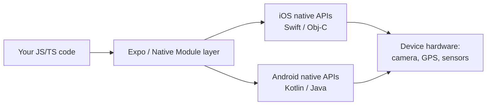
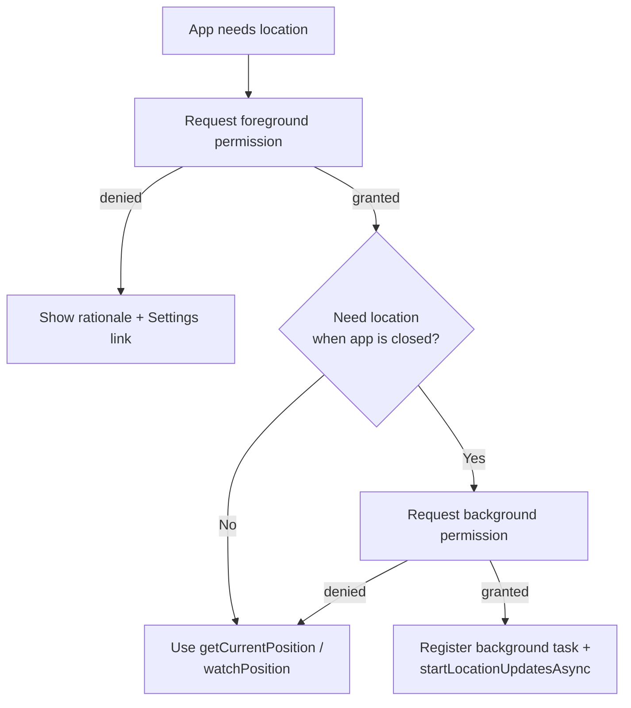
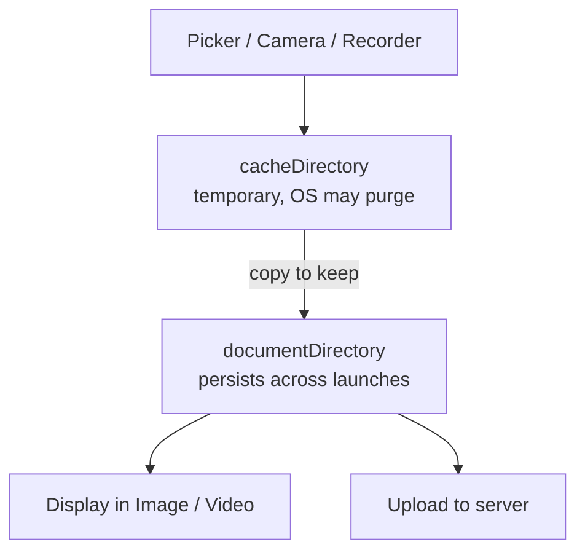
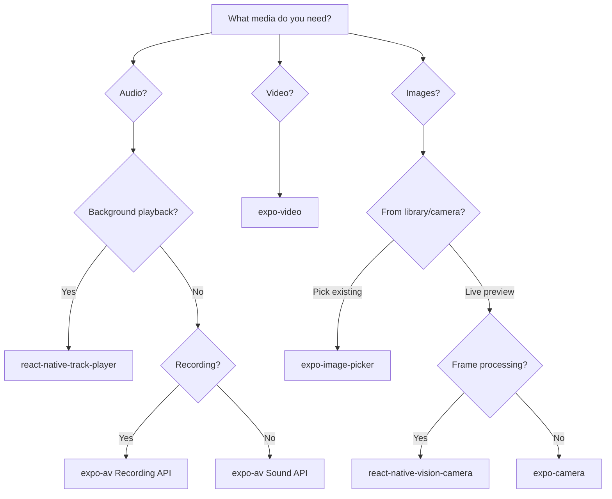
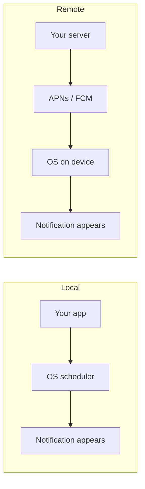
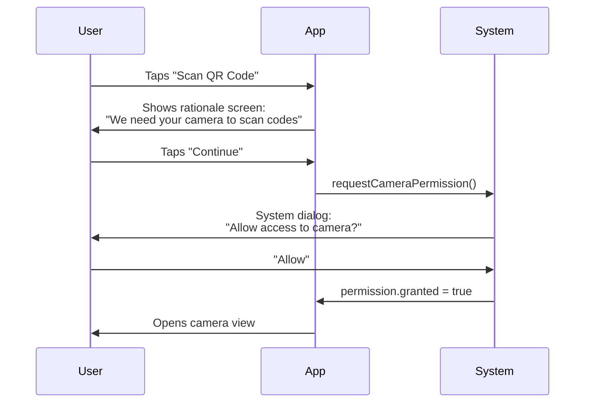
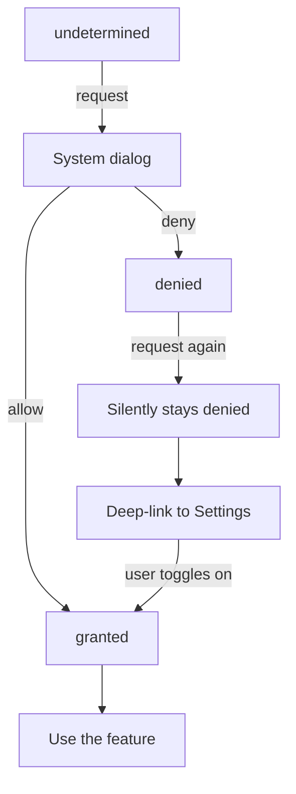

# Native Device APIs: The Leap from Web

> Camera, location, biometrics, sensors, and media — the capabilities that make mobile apps mobile.

---

## Table of Contents
1. [Hardware and Sensors](#1-hardware-and-sensors)
2. [Media](#2-media)
3. [System APIs](#3-system-apis)
4. [Permissions Philosophy](#4-permissions-philosophy)

---

## 1. Hardware and Sensors

On the web, hardware access is an afterthought. You might use `navigator.geolocation` or the experimental `DeviceMotionEvent`, but you're always fighting sandboxed browser APIs that feel bolted on — gated behind HTTPS, throttled, and inconsistently supported across browsers. In React Native, hardware is the *point*. Your app lives on a device packed with sensors, and users expect you to use them.

### Why is native hardware access different from the web?

The mental shift is this: on the web, the **browser** is a referee standing between your code and the metal. It exposes a tiny, deliberately neutered slice of the device because any random website could be hostile. A native app is different — the user *chose* to install it, the OS knows exactly who it is (it's signed and sandboxed by app identity, not by origin), and the OS can therefore hand over far more powerful capabilities, guarded by **explicit per-feature permission prompts** instead of a blanket "this site wants to know your location."

So instead of one anemic `navigator.*` namespace, you get a whole ecosystem of native modules. Most are exposed through **Expo's unified packages** (`expo-camera`, `expo-location`, …), which wrap the messy platform-specific Objective-C/Swift and Kotlin/Java code behind one clean JavaScript API.



> **Mental model**: A native module is a translator. You speak JavaScript; the device's camera speaks Swift or Kotlin. Expo packages are pre-built translators for the most common hardware so you rarely write native code yourself.

Let's walk through the big ones.

### Camera

For most apps, **expo-camera** gets you a live preview and basic photo/video capture with minimal setup. But if you're building anything production-grade — barcode scanning, frame processing, ML overlays — reach for **react-native-vision-camera**. It's the gold standard.

```tsx
import { CameraView, useCameraPermissions } from 'expo-camera';
import { useState } from 'react';
import { Button, View, StyleSheet } from 'react-native';

export default function CameraScreen() {
  const [permission, requestPermission] = useCameraPermissions();
  const [facing, setFacing] = useState<'front' | 'back'>('back');

  if (!permission) return <View />; // permissions still loading

  if (!permission.granted) {
    return (
      <View style={styles.container}>
        <Button title="Grant Camera Access" onPress={requestPermission} />
      </View>
    );
  }

  return (
    <CameraView style={styles.camera} facing={facing}>
      <Button
        title="Flip"
        onPress={() => setFacing(f => (f === 'back' ? 'front' : 'back'))}
      />
    </CameraView>
  );
}

const styles = StyleSheet.create({
  container: { flex: 1, justifyContent: 'center' },
  camera: { flex: 1 },
});
```

Capturing an actual photo uses a ref to the camera:

```tsx
import { CameraView } from 'expo-camera';
import { useRef } from 'react';

function Capture() {
  const cameraRef = useRef<CameraView>(null);

  const takePhoto = async () => {
    // Returns a local URI plus width/height and (optionally) base64
    const photo = await cameraRef.current?.takePictureAsync({ quality: 0.7 });
    console.log(photo?.uri); // file:///.../Camera/abc.jpg
  };

  return <CameraView ref={cameraRef} style={{ flex: 1 }} />;
}
```

**expo-camera vs react-native-vision-camera** — choosing the right tool:

| Library | Strengths | Limitations | When to use |
|---|---|---|---|
| **expo-camera** | Zero native setup in Expo, simple photo/video, basic barcode scanning | No frame processors, less control over format/FPS | Profile photo, document capture, occasional scanning |
| **react-native-vision-camera** | Frame processors (run JS per frame), ML/QR/face overlays, fine format control | Steeper setup, needs a dev build (no Expo Go) | Real-time scanning, AR, on-device ML, anything performance-critical |

> **Gotcha**: On Android, the camera preview can crash if you mount it before permissions are granted. Always gate the `<CameraView>` behind a permission check.

> **Web comparison**: On the web you'd use `navigator.mediaDevices.getUserMedia()` and pipe a `MediaStream` into a `<video>` element. In RN there's no DOM — `<CameraView>` is a native view, and you grab frames through a ref, not a canvas.

### Location

**expo-location** handles both foreground and background tracking. Foreground is straightforward — request permission, get coordinates. Background location is where it gets tricky: iOS and Android both throttle it aggressively (to save battery), and you need to declare a registered background task.

```tsx
import * as Location from 'expo-location';

// Foreground — simple one-shot
async function getPosition() {
  const { status } = await Location.requestForegroundPermissionsAsync();
  if (status !== 'granted') return null;

  return Location.getCurrentPositionAsync({
    accuracy: Location.Accuracy.High,
  });
}

// Foreground — continuous stream (like watchPosition on the web)
async function watch(onMove: (coords: Location.LocationObjectCoords) => void) {
  const sub = await Location.watchPositionAsync(
    { accuracy: Location.Accuracy.Balanced, distanceInterval: 10 },
    (loc) => onMove(loc.coords)
  );
  return sub; // call sub.remove() to stop
}

// Background — requires additional config in app.json
async function startBackgroundTracking() {
  const { status } = await Location.requestBackgroundPermissionsAsync();
  if (status !== 'granted') return;

  await Location.startLocationUpdatesAsync('BACKGROUND_LOCATION_TASK', {
    accuracy: Location.Accuracy.Balanced,
    distanceInterval: 50, // meters
    showsBackgroundLocationIndicator: true, // iOS blue bar
  });
}
```

Foreground vs background permission is a **two-stage** flow on modern OSes — you must earn foreground access first, then separately ask to be upgraded to background ("Always Allow"):



The accuracy setting is a direct **battery vs precision** trade — higher accuracy keeps the GPS chip powered longer:

| Accuracy level | Roughly | Battery cost | Typical use |
|---|---|---|---|
| `Lowest` / `Low` | ~1–3 km (cell/wifi) | Tiny | Weather, region detection |
| `Balanced` | ~100 m | Moderate | Nearby places, geofencing |
| `High` | ~10 m | High | Maps, directions |
| `BestForNavigation` | Best possible | Highest | Turn-by-turn navigation |

> **Web comparison**: `navigator.geolocation.watchPosition` gives you foreground updates only. There's no web equivalent to background location — a website is killed the moment its tab closes. Background tracking is purely native territory, and it's exactly why ride-share and fitness apps must be native.

> **Pro tip**: Background location is the single most-scrutinized permission in App Store and Play Store review. If your app asks for "Always Allow," you must show a concrete, ongoing feature (live trip tracking, geofenced reminders). "Maybe useful later" gets rejected.

### Motion Sensors

**expo-sensors** gives you accelerometer, gyroscope, magnetometer, barometer, and pedometer. Each follows the same **subscribe/unsubscribe** pattern — you add a listener that fires on an interval, and you *must* remove it on cleanup or it keeps draining the battery in the background.

What each sensor actually measures:

| Sensor | Measures | Example use |
|---|---|---|
| Accelerometer | Linear acceleration incl. gravity (x/y/z in g) | Shake-to-undo, step counting, tilt |
| Gyroscope | Rotation rate around each axis | 360° photo viewers, games, AR stabilization |
| Magnetometer | Magnetic field → compass heading | Compass, map orientation |
| Barometer | Air pressure → relative altitude | Stairs-climbed, hiking elevation |
| Pedometer | OS-computed step count | Fitness trackers |

```tsx
import { Accelerometer } from 'expo-sensors';
import { useEffect, useState } from 'react';

export function useShakeDetection(threshold = 1.8) {
  const [shook, setShook] = useState(false);

  useEffect(() => {
    Accelerometer.setUpdateInterval(100); // ms between readings
    const sub = Accelerometer.addListener(({ x, y, z }) => {
      // Magnitude of the acceleration vector; ~1.0 at rest (gravity)
      const force = Math.sqrt(x * x + y * y + z * z);
      if (force > threshold) setShook(true);
    });
    return () => sub.remove(); // CRITICAL: stop the sensor on unmount
  }, [threshold]);

  return shook;
}
```

> **Gotcha**: Forgetting `sub.remove()` is the #1 sensor bug. The listener survives the component, keeps the sensor powered, and silently eats battery. On the web the analog is forgetting to `removeEventListener('devicemotion', …)` — same class of leak, bigger consequences on a phone.

> **Pro tip**: Don't set the update interval lower than you need. `16ms` (~60fps) is great for a game but murders battery for a step counter that only needs `1000ms`.

### Biometrics

**expo-local-authentication** wraps Face ID, Touch ID, and Android BiometricPrompt behind one call. It doesn't store secrets — it just confirms "this is the device owner." For actual credential storage, pair it with **expo-secure-store** (which keeps values in the iOS Keychain / Android Keystore).

```tsx
import * as LocalAuthentication from 'expo-local-authentication';

async function authenticate() {
  // 1. Does the device even have biometric hardware?
  const hasHardware = await LocalAuthentication.hasHardwareAsync();
  if (!hasHardware) return false;

  // 2. Has the user enrolled a face/fingerprint?
  const isEnrolled = await LocalAuthentication.isEnrolledAsync();
  if (!isEnrolled) return false;

  // 3. Prompt
  const result = await LocalAuthentication.authenticateAsync({
    promptMessage: 'Confirm your identity',
    fallbackLabel: 'Use passcode', // shown if biometrics fail
  });

  return result.success;
}
```

Pairing biometrics with secure storage to gate a saved token:

```tsx
import * as SecureStore from 'expo-secure-store';

// Save once, after login
await SecureStore.setItemAsync('authToken', token);

// Later: unlock with biometrics, THEN read the secret
async function getTokenIfVerified() {
  const ok = await authenticate();
  if (!ok) return null;
  return SecureStore.getItemAsync('authToken');
}
```

> **Gotcha**: Biometrics prove *presence of the device owner*, not a server-side identity. Never treat a successful Face ID as "logged in" on its own — it unlocks a token you already stored; it doesn't authenticate against your backend.

> **Web comparison**: The closest web analog is WebAuthn / passkeys, which are powerful but far more involved to set up. In RN, biometric verification is a single `authenticateAsync()` call.

### Haptics

Haptic feedback is the difference between an app that feels native and one that feels like a web view. **expo-haptics** gives you three impact levels: light, medium, heavy — plus notification patterns (success, warning, error).

```tsx
import * as Haptics from 'expo-haptics';

// On a successful action (a distinct "ta-da" pattern)
Haptics.notificationAsync(Haptics.NotificationFeedbackType.Success);

// On a button press (a single subtle tap)
Haptics.impactAsync(Haptics.ImpactFeedbackStyle.Light);

// On an error
Haptics.notificationAsync(Haptics.NotificationFeedbackType.Error);
```

| Call | Feel | Use for |
|---|---|---|
| `impactAsync(Light)` | Tiny tap | Toggle switch, selection |
| `impactAsync(Medium/Heavy)` | Firmer thud | Button press, drag snap |
| `notificationAsync(Success)` | Two-beat positive buzz | Payment done, save succeeded |
| `notificationAsync(Warning/Error)` | Sharp alert buzz | Failed action, invalid input |

> **Opinion**: Add haptics to *every* destructive action confirmation and every toggle switch. It's a one-liner that dramatically improves perceived quality.

> **Gotcha**: Haptics are a no-op on most Android emulators and on the iOS Simulator — they only fire on real hardware. Don't assume they're "broken" because you feel nothing in the simulator.

---

## 2. Media

Web developers are used to `<input type="file">` and the `<video>` tag. In React Native, media is richer, more complex, and more capable — and a recurring theme appears immediately: **media lives as files on disk, referenced by a `uri` string**, not as DOM elements or `Blob`s in memory.

### The URI mental model

Almost every media API in RN hands you back a string like `file:///var/mobile/.../IMG_0001.jpg`. That URI is just a pointer to a file in one of the device's storage areas. Understanding *which* area matters, because some are temporary and the OS can delete them at any time:



> **Mental model**: On the web a picked file is a `File`/`Blob` you hold in JS memory. In RN it's a *path to a file on disk*. If you need it after this session, you must copy it from the temporary cache to `documentDirectory` yourself.

### Image Picker

**expo-image-picker** lets users select from their photo library or take a new photo. It returns a local URI you can display or upload.

```tsx
import * as ImagePicker from 'expo-image-picker';
import { Image, Button, View } from 'react-native';
import { useState } from 'react';

export function AvatarPicker() {
  const [uri, setUri] = useState<string | null>(null);

  const pick = async () => {
    const result = await ImagePicker.launchImageLibraryAsync({
      mediaTypes: ['images'],
      allowsEditing: true, // built-in crop UI
      aspect: [1, 1],      // square crop for an avatar
      quality: 0.8,        // 0–1 JPEG compression
    });

    if (!result.canceled) {
      setUri(result.assets[0].uri);
    }
  };

  return (
    <View>
      {uri && <Image source={{ uri }} style={{ width: 120, height: 120 }} />}
      <Button title="Choose Photo" onPress={pick} />
    </View>
  );
}
```

To open the camera instead of the library, swap one call:

```tsx
// Same shape of result, but launches the camera
const result = await ImagePicker.launchCameraAsync({ quality: 0.8 });
```

> **Gotcha**: The URI returned is temporary on iOS. If you need to persist it, copy the file to your app's document directory using `expo-file-system` before the OS reclaims it.

> **Web comparison**: `launchImageLibraryAsync` is the spiritual cousin of `<input type="file" accept="image/*">`, but it also gives you a native crop/edit UI and EXIF data for free — things you'd hand-build on the web.

### Audio

For simple playback (sound effects, short clips), **expo-av** works fine. For anything resembling a music player — background playback, lock screen controls, queue management — use **react-native-track-player**. This isn't a close call; `expo-av` was never designed for background audio.

```tsx
// Simple sound effect with expo-av
import { Audio } from 'expo-av';

async function playSound() {
  const { sound } = await Audio.Sound.createAsync(
    require('./assets/notification.mp3')
  );
  await sound.playAsync();
  // Don't forget cleanup — an unloaded sound leaks native memory
  sound.setOnPlaybackStatusUpdate((status) => {
    if (status.isLoaded && status.didJustFinish) {
      sound.unloadAsync();
    }
  });
}
```

> **Note**: `expo-av` is being split into `expo-audio` and `expo-video` in newer SDKs. The concepts are identical — a `Sound` object you load, play, and must unload — but check your SDK version for the exact import.

| Library | Background playback | Lock-screen controls | Queue | When to use |
|---|---|---|---|---|
| **expo-av / expo-audio** | No | No | No | Sound effects, short clips, UI feedback |
| **react-native-track-player** | Yes | Yes | Yes | Podcast/music players, audiobooks |

### Video

**expo-video** is the modern replacement for the video component in expo-av. It gives you a native player with controls, picture-in-picture support, and DRM capabilities.

```tsx
import { useVideoPlayer, VideoView } from 'expo-video';
import { StyleSheet } from 'react-native';

export function VideoScreen() {
  // The player is an imperative object you create once and reuse
  const player = useVideoPlayer(
    'https://example.com/video.mp4',
    (player) => {
      player.loop = true;
      player.play(); // autoplay
    }
  );

  return <VideoView style={styles.video} player={player} allowsPictureInPicture />;
}

const styles = StyleSheet.create({
  video: { width: '100%', aspectRatio: 16 / 9 },
});
```

> **Web comparison**: On the web `<video src="…" controls>` is fully declarative. In RN you create an imperative **player object** with `useVideoPlayer` and attach it to a `<VideoView>`. The split exists because one player can drive picture-in-picture, lock-screen controls, and the on-screen view at once.

### Recording Audio

**expo-av** handles recording too. The key detail: you must configure the audio mode *before* starting to record, otherwise iOS will silently fail or produce garbled output — iOS treats "playing" and "recording" as different audio sessions and won't let the mic in until you ask.

```tsx
import { Audio } from 'expo-av';

async function startRecording() {
  await Audio.requestPermissionsAsync(); // microphone permission
  await Audio.setAudioModeAsync({
    allowsRecordingIOS: true,   // unlock the mic on iOS
    playsInSilentModeIOS: true, // record even if silent switch is on
  });

  const { recording } = await Audio.Recording.createAsync(
    Audio.RecordingOptionsPresets.HIGH_QUALITY
  );
  return recording;
}

async function stopRecording(recording: Audio.Recording) {
  await recording.stopAndUnloadAsync();
  const uri = recording.getURI(); // local file path (in cacheDirectory)
  return uri;
}
```

> **Gotcha**: The recording lands in the temporary cache directory. Per the URI mental model above, copy it to `documentDirectory` (or upload it immediately) if you need it later.

Here's a decision map for choosing the right media library:



---

## 3. System APIs

This is where mobile truly diverges from web. The browser gives you cookies, localStorage, and fetch. A mobile device gives you access to the entire operating system — the user's contacts, their calendar, the system clipboard, the file system, the share sheet, the printer. Each is a native module gated by its own permission.

### Contacts and Calendar

**expo-contacts** and **expo-calendar** let you read and write to the device's address book and calendar. Both require explicit permissions, and both return rich structured data.

```tsx
import * as Contacts from 'expo-contacts';

async function getFirstContact() {
  const { status } = await Contacts.requestPermissionsAsync();
  if (status !== 'granted') return null;

  const { data } = await Contacts.getContactsAsync({
    // Only request the fields you need — fetching everything is slow
    fields: [Contacts.Fields.Emails, Contacts.Fields.PhoneNumbers],
    pageSize: 1,
  });

  return data[0];
}
```

Writing an event to the calendar follows the same permission-then-act shape:

```tsx
import * as Calendar from 'expo-calendar';

async function addEvent(calendarId: string) {
  const { status } = await Calendar.requestCalendarPermissionsAsync();
  if (status !== 'granted') return;

  await Calendar.createEventAsync(calendarId, {
    title: 'Dentist',
    startDate: new Date('2026-07-01T09:00:00'),
    endDate: new Date('2026-07-01T09:30:00'),
    timeZone: 'Europe/Paris',
  });
}
```

> **Pro tip**: Request only the contact `fields` you actually use. Pulling every field for a 5,000-contact address book is noticeably slow and signals to privacy-conscious reviewers that you're over-reaching.

### Notifications

Push notifications are the killer feature of mobile. **expo-notifications** handles both **local** (scheduled by the app, no server needed) and **remote** (sent from your server) notifications. The setup is straightforward for local, but remote notifications require configuring FCM (Android) and APNs (iOS).

```tsx
import * as Notifications from 'expo-notifications';

// Schedule a local notification — fires entirely on-device
async function scheduleReminder() {
  await Notifications.requestPermissionsAsync();
  await Notifications.scheduleNotificationAsync({
    content: {
      title: 'Time to stretch',
      body: "You've been coding for 2 hours.",
    },
    trigger: {
      type: Notifications.SchedulableTriggerInputTypes.TIME_INTERVAL,
      seconds: 7200,
    },
  });
}
```

The difference between local and remote is *who decides when it fires*:



| Type | Trigger source | Needs a server? | Needs APNs/FCM setup? | Example |
|---|---|---|---|---|
| **Local** | The app, on-device | No | No | "Stretch reminder in 2h" |
| **Remote (push)** | Your backend | Yes | Yes | "You have a new message" |

> **Web comparison**: The Web Push API exists, but adoption is spotty and the UX is hostile (browsers actively discourage notification prompts, and iOS Safari only added it recently and grudgingly). On mobile, notifications are a first-class citizen and a primary re-engagement channel.

### Clipboard, File System, and Sharing

These are one-liners, but they matter:

```tsx
// Clipboard
import * as Clipboard from 'expo-clipboard';
await Clipboard.setStringAsync('Copied text');
const text = await Clipboard.getStringAsync();

// File System
import * as FileSystem from 'expo-file-system';
const content = await FileSystem.readAsStringAsync(fileUri);
await FileSystem.writeAsStringAsync(
  FileSystem.documentDirectory + 'data.json',
  JSON.stringify(myData)
);
// Copy a temporary picked file somewhere permanent
await FileSystem.copyAsync({
  from: tempUri,
  to: FileSystem.documentDirectory + 'avatar.jpg',
});

// Sharing — opens the native share sheet
import * as Sharing from 'expo-sharing';
await Sharing.shareAsync(fileUri, {
  mimeType: 'application/pdf',
  dialogTitle: 'Share report',
});
```

> **Web comparison**: `expo-clipboard` mirrors `navigator.clipboard`, and `Sharing.shareAsync` is the native cousin of the Web Share API (`navigator.share`) — except on mobile it's universally supported and surfaces the full OS share sheet (AirDrop, Messages, every installed app).

### Document Picker and Print

**expo-document-picker** is the mobile equivalent of `<input type="file">`, and **expo-print** lets you generate PDFs and send them to a printer or save them as a file.

```tsx
import * as DocumentPicker from 'expo-document-picker';
import * as Print from 'expo-print';

// Pick a document — copyToCacheDirectory makes the URI readable by your app
const result = await DocumentPicker.getDocumentAsync({
  type: 'application/pdf',
  copyToCacheDirectory: true,
});

// Generate and print a PDF from HTML
await Print.printAsync({
  html: '<h1>Invoice #1234</h1><p>Total: $99.00</p>',
});

// Or render the HTML to a PDF file you can share/upload
const { uri } = await Print.printToFileAsync({
  html: '<h1>Invoice #1234</h1><p>Total: $99.00</p>',
});
```

> **Common mistake**: Assuming file URIs are stable. On both platforms, files picked via document picker or image picker may live in temporary directories. Always copy them to `FileSystem.documentDirectory` if you need them beyond the current session.

---

## 4. Permissions Philosophy

This is the section most tutorials skip, and it's the one that gets apps rejected from the App Store. Permissions aren't a technical hurdle to clear — they're a **conversation** with the user, and how you frame that conversation determines whether they say yes.

### Why permissions are a UX problem, not a code problem

Here's the mechanism that makes this matter so much: **the OS gives you exactly one good shot.** When you call `requestPermission()`, the system shows its own dialog — text you can barely customize, two buttons. If the user taps "Deny," that answer is *sticky*. On iOS, calling request again does nothing; the dialog never reappears. On Android, you get a second chance, then "Don't ask again" locks it. There is no "ask me later that actually re-prompts." So every wasted prompt is a permission you may have lost forever — and your only recovery path is begging the user to dig through Settings.

That asymmetry is why timing and framing dominate. You're not writing an `if`-check; you're spending a one-time resource.

### The Golden Rule: Just-in-Time

Never request permissions on launch. Never. Not even if you "need" them. The user just opened your app for the first time — they have no context for why you want their camera, location, and contacts. The denial rate for upfront permission prompts is over 50%.

Instead, request permissions at the *moment of intent*. The user taps the camera button? Now ask for camera access. They open the map tab? Now ask for location. The context makes the request self-explanatory.



> **Web comparison**: Browsers learned this lesson the hard way — sites that prompt for notifications/location on load get auto-blocked by Chrome and trained users to reflexively deny. Mobile stores enforce the same etiquette, except here a bad prompt can get your whole app rejected.

### The Rationale Screen

Both iOS and Android give you exactly one shot at the system permission dialog (well, Android gives two before "Don't ask again" kicks in). That's why you show a *rationale screen* first — a custom UI **you fully control** that explains why you need the permission, with a clear benefit statement, *before* you fire the irreversible system prompt.

```tsx
import { Alert } from 'react-native';
import * as Location from 'expo-location';

async function requestLocationWithRationale() {
  const { status: existing } = await Location.getForegroundPermissionsAsync();

  if (existing === 'granted') return true;

  // Show YOUR rationale before the system's one-shot prompt
  const userAccepted = await new Promise<boolean>((resolve) => {
    Alert.alert(
      'Location Access',
      'We use your location to show nearby restaurants. Your location is never shared or stored on our servers.',
      [
        { text: 'Not Now', onPress: () => resolve(false) },
        { text: 'Enable', onPress: () => resolve(true) },
      ]
    );
  });

  if (!userAccepted) return false;

  const { status } = await Location.requestForegroundPermissionsAsync();
  return status === 'granted';
}
```

> **Pro tip**: The rationale screen also protects your "one shot." If the user taps "Not Now" on *your* screen, you never fire the system prompt — so it stays available for later when they're more motivated. You only spend the real prompt on users who already said "yes" to the soft ask.

### Handling "Don't Ask Again"

Once a user selects "Don't ask again" (Android) or denies on iOS, calling `requestPermissionsAsync()` will silently return `denied` without showing any dialog. Your only option is to deep-link to the app's settings page so they can flip it manually.

```tsx
import { Linking, Platform } from 'react-native';
import { View, Text, Button, StyleSheet } from 'react-native';

function openAppSettings() {
  if (Platform.OS === 'ios') {
    Linking.openURL('app-settings:'); // jumps straight to your app's settings
  } else {
    Linking.openSettings();
  }
}

// Use it in your denied state
function PermissionDeniedBanner() {
  return (
    <View style={styles.banner}>
      <Text>Camera access was denied.</Text>
      <Button title="Open Settings" onPress={openAppSettings} />
    </View>
  );
}

const styles = StyleSheet.create({
  banner: { padding: 16 },
});
```

The full lifecycle of a permission, including the dead-end you must design for:



> **App Store rejection trap**: If you request a permission your app doesn't visibly use, Apple will reject you. Every `NSUsageDescription` key in your `Info.plist` must correspond to a feature the reviewer can trigger during review. This means your camera permission string better lead to an actual camera screen, not a "coming soon" placeholder.

### Permission States to Handle

Every permission request can return one of these states. Handle all of them:

| Status | Meaning | Your Action |
|---|---|---|
| `undetermined` | Never asked | Show rationale, then request |
| `granted` | User said yes | Proceed with feature |
| `denied` | User said no | Show explanation + "Open Settings" link |
| `limited` (iOS) | Partial access (e.g., selected photos only) | Work with what you have |

> **Gotcha**: Don't forget `limited`. On modern iOS, a user can grant access to *some* photos rather than the whole library. Code that only checks `granted` will treat this as a failure and break for a perfectly happy user.

The discipline here is simple: treat permissions as a UX feature, not a technical checkbox. A well-timed, well-explained permission request converts at 85%+. A lazy upfront spray of prompts on first launch converts at under 40% and trains users to reflexively deny everything.

---