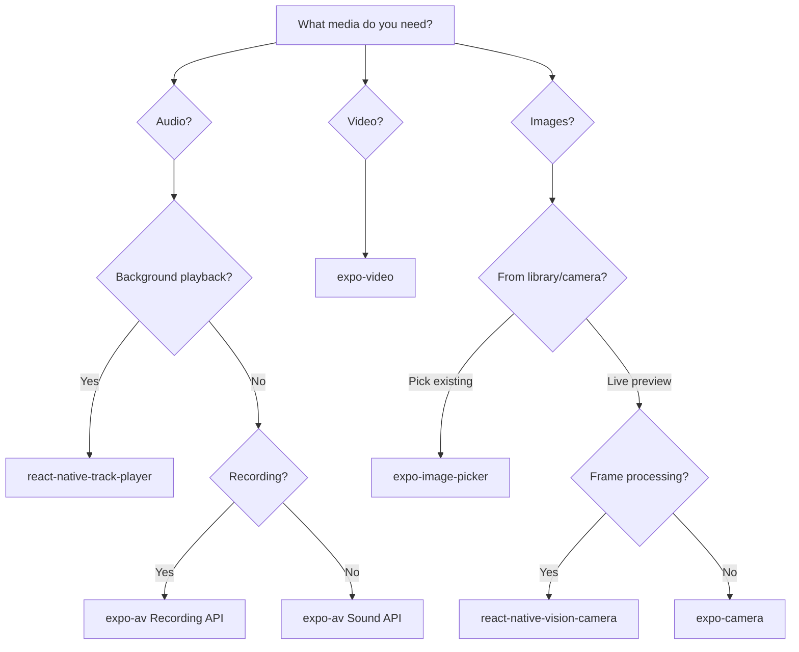
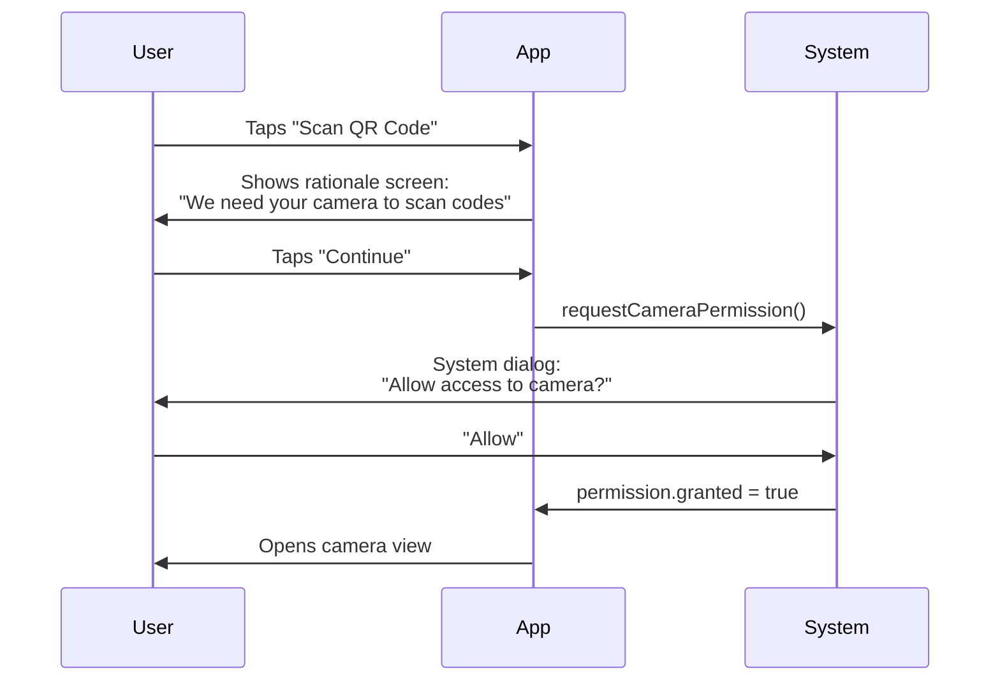

# Native Device APIs: The Leap from Web

> Camera, location, biometrics, sensors, and media — the capabilities that make mobile apps mobile.

---

## Table of Contents
1. [Hardware and Sensors](#1-hardware-and-sensors)
2. [Media](#2-media)
3. [System APIs](#3-system-apis)
4. [Permissions Philosophy](#4-permissions-philosophy)

---

## 1. Hardware and Sensors

On the web, hardware access is an afterthought. You might use `navigator.geolocation` or the experimental `DeviceMotionEvent`, but you're always fighting sandboxed browser APIs that feel bolted on. In React Native, hardware is the *point*. Your app lives on a device packed with sensors, and users expect you to use them.

Let's walk through the big ones.

### Camera

For most apps, **expo-camera** gets you a live preview and basic photo/video capture with minimal setup. But if you're building anything production-grade — barcode scanning, frame processing, ML overlays — reach for **react-native-vision-camera**. It's the gold standard.

```tsx
import { CameraView, useCameraPermissions } from 'expo-camera';
import { useState } from 'react';
import { Button, View, StyleSheet } from 'react-native';

export default function CameraScreen() {
  const [permission, requestPermission] = useCameraPermissions();
  const [facing, setFacing] = useState<'front' | 'back'>('back');

  if (!permission) return <View />;

  if (!permission.granted) {
    return (
      <View style={styles.container}>
        <Button title="Grant Camera Access" onPress={requestPermission} />
      </View>
    );
  }

  return (
    <CameraView style={styles.camera} facing={facing}>
      <Button
        title="Flip"
        onPress={() => setFacing(f => (f === 'back' ? 'front' : 'back'))}
      />
    </CameraView>
  );
}

const styles = StyleSheet.create({
  container: { flex: 1, justifyContent: 'center' },
  camera: { flex: 1 },
});
```

> **Gotcha**: On Android, the camera preview can crash if you mount it before permissions are granted. Always gate the `<CameraView>` behind a permission check.

### Location

**expo-location** handles both foreground and background tracking. Foreground is straightforward — request permission, get coordinates. Background location is where it gets tricky: iOS and Android both throttle it aggressively, and you need to declare a background task.

```tsx
import * as Location from 'expo-location';

// Foreground — simple one-shot
async function getPosition() {
  const { status } = await Location.requestForegroundPermissionsAsync();
  if (status !== 'granted') return null;

  return Location.getCurrentPositionAsync({
    accuracy: Location.Accuracy.High,
  });
}

// Background — requires additional config in app.json
async function startBackgroundTracking() {
  const { status } = await Location.requestBackgroundPermissionsAsync();
  if (status !== 'granted') return;

  await Location.startLocationUpdatesAsync('BACKGROUND_LOCATION_TASK', {
    accuracy: Location.Accuracy.Balanced,
    distanceInterval: 50, // meters
    showsBackgroundLocationIndicator: true, // iOS blue bar
  });
}
```

> **Web comparison**: `navigator.geolocation.watchPosition` gives you foreground updates. There's no web equivalent to background location — this is purely native territory.

### Motion Sensors

**expo-sensors** gives you accelerometer, gyroscope, magnetometer, barometer, and pedometer. Each follows the same subscribe/unsubscribe pattern:

```tsx
import { Accelerometer } from 'expo-sensors';
import { useEffect, useState } from 'react';

export function useShakeDetection(threshold = 1.8) {
  const [shook, setShook] = useState(false);

  useEffect(() => {
    Accelerometer.setUpdateInterval(100);
    const sub = Accelerometer.addListener(({ x, y, z }) => {
      const force = Math.sqrt(x * x + y * y + z * z);
      if (force > threshold) setShook(true);
    });
    return () => sub.remove();
  }, [threshold]);

  return shook;
}
```

### Biometrics

**expo-local-authentication** wraps Face ID, Touch ID, and Android BiometricPrompt behind one call. It doesn't store secrets — it just confirms "this is the device owner." For actual credential storage, pair it with `expo-secure-store`.

```tsx
import * as LocalAuthentication from 'expo-local-authentication';

async function authenticate() {
  const hasHardware = await LocalAuthentication.hasHardwareAsync();
  if (!hasHardware) return false;

  const result = await LocalAuthentication.authenticateAsync({
    promptMessage: 'Confirm your identity',
    fallbackLabel: 'Use passcode',
  });

  return result.success;
}
```

### Haptics

Haptic feedback is the difference between an app that feels native and one that feels like a web view. **expo-haptics** gives you three levels: light, medium, heavy — plus notification patterns (success, warning, error).

```tsx
import * as Haptics from 'expo-haptics';

// On a successful action
Haptics.notificationAsync(Haptics.NotificationFeedbackType.Success);

// On a button press
Haptics.impactAsync(Haptics.ImpactFeedbackStyle.Light);
```

> **Opinion**: Add haptics to *every* destructive action confirmation and every toggle switch. It's a one-liner that dramatically improves perceived quality.

---

## 2. Media

Web developers are used to `<input type="file">` and the `<video>` tag. In React Native, media is richer, more complex, and more capable.

### Image Picker

**expo-image-picker** lets users select from their photo library or take a new photo. It returns a local URI you can display or upload.

```tsx
import * as ImagePicker from 'expo-image-picker';
import { Image, Button, View } from 'react-native';
import { useState } from 'react';

export function AvatarPicker() {
  const [uri, setUri] = useState<string | null>(null);

  const pick = async () => {
    const result = await ImagePicker.launchImageLibraryAsync({
      mediaTypes: ['images'],
      allowsEditing: true,
      aspect: [1, 1],
      quality: 0.8,
    });

    if (!result.canceled) {
      setUri(result.assets[0].uri);
    }
  };

  return (
    <View>
      {uri && <Image source={{ uri }} style={{ width: 120, height: 120 }} />}
      <Button title="Choose Photo" onPress={pick} />
    </View>
  );
}
```

> **Gotcha**: The URI returned is temporary on iOS. If you need to persist it, copy the file to your app's document directory using `expo-file-system` before the OS reclaims it.

### Audio

For simple playback (sound effects, short clips), **expo-av** works fine. For anything resembling a music player — background playback, lock screen controls, queue management — use **react-native-track-player**. This isn't a close call; `expo-av` was never designed for background audio.

```tsx
// Simple sound effect with expo-av
import { Audio } from 'expo-av';

async function playSound() {
  const { sound } = await Audio.Sound.createAsync(
    require('./assets/notification.mp3')
  );
  await sound.playAsync();
  // Don't forget cleanup
  sound.setOnPlaybackStatusUpdate((status) => {
    if (status.isLoaded && status.didJustFinish) {
      sound.unloadAsync();
    }
  });
}
```

### Video

**expo-video** is the modern replacement for the video component in expo-av. It gives you a native player with controls, picture-in-picture support, and DRM capabilities.

```tsx
import { useVideoPlayer, VideoView } from 'expo-video';
import { StyleSheet } from 'react-native';

export function VideoScreen() {
  const player = useVideoPlayer(
    'https://example.com/video.mp4',
    (player) => {
      player.loop = true;
    }
  );

  return <VideoView style={styles.video} player={player} allowsPictureInPicture />;
}

const styles = StyleSheet.create({
  video: { width: '100%', aspectRatio: 16 / 9 },
});
```

### Recording Audio

**expo-av** handles recording too. The key detail: you must configure the audio mode *before* starting to record, otherwise iOS will silently fail or produce garbled output.

```tsx
import { Audio } from 'expo-av';

async function startRecording() {
  await Audio.requestPermissionsAsync();
  await Audio.setAudioModeAsync({
    allowsRecordingIOS: true,
    playsInSilentModeIOS: true,
  });

  const { recording } = await Audio.Recording.createAsync(
    Audio.RecordingOptionsPresets.HIGH_QUALITY
  );
  return recording;
}

async function stopRecording(recording: Audio.Recording) {
  await recording.stopAndUnloadAsync();
  const uri = recording.getURI(); // local file path
  return uri;
}
```

Here's a decision map for choosing the right media library:



---

## 3. System APIs

This is where mobile truly diverges from web. The browser gives you cookies, localStorage, and fetch. A mobile device gives you access to the entire operating system.

### Contacts and Calendar

**expo-contacts** and **expo-calendar** let you read and write to the device's address book and calendar. Both require explicit permissions, and both return rich structured data.

```tsx
import * as Contacts from 'expo-contacts';

async function getFirstContact() {
  const { status } = await Contacts.requestPermissionsAsync();
  if (status !== 'granted') return null;

  const { data } = await Contacts.getContactsAsync({
    fields: [Contacts.Fields.Emails, Contacts.Fields.PhoneNumbers],
    pageSize: 1,
  });

  return data[0];
}
```

### Notifications

Push notifications are the killer feature of mobile. **expo-notifications** handles both local (scheduled by the app) and remote (sent from your server) notifications. The setup is straightforward for local, but remote notifications require configuring FCM (Android) and APNs (iOS).

```tsx
import * as Notifications from 'expo-notifications';

// Schedule a local notification
async function scheduleReminder() {
  await Notifications.scheduleNotificationAsync({
    content: {
      title: 'Time to stretch',
      body: "You've been coding for 2 hours.",
    },
    trigger: {
      type: Notifications.SchedulableTriggerInputTypes.TIME_INTERVAL,
      seconds: 7200,
    },
  });
}
```

> **Web comparison**: The Web Push API exists, but adoption is spotty and the UX is hostile (browsers actively discourage notification prompts). On mobile, notifications are a first-class citizen.

### Clipboard, File System, and Sharing

These are one-liners, but they matter:

```tsx
// Clipboard
import * as Clipboard from 'expo-clipboard';
await Clipboard.setStringAsync('Copied text');
const text = await Clipboard.getStringAsync();

// File System
import * as FileSystem from 'expo-file-system';
const content = await FileSystem.readAsStringAsync(fileUri);
await FileSystem.writeAsStringAsync(
  FileSystem.documentDirectory + 'data.json',
  JSON.stringify(myData)
);

// Sharing
import * as Sharing from 'expo-sharing';
await Sharing.shareAsync(fileUri, {
  mimeType: 'application/pdf',
  dialogTitle: 'Share report',
});
```

### Document Picker and Print

**expo-document-picker** is the mobile equivalent of `<input type="file">`, and **expo-print** lets you generate PDFs and send them to a printer.

```tsx
import * as DocumentPicker from 'expo-document-picker';
import * as Print from 'expo-print';

// Pick a document
const result = await DocumentPicker.getDocumentAsync({
  type: 'application/pdf',
  copyToCacheDirectory: true,
});

// Generate and print a PDF
await Print.printAsync({
  html: '<h1>Invoice #1234</h1><p>Total: $99.00</p>',
});
```

> **Common mistake**: Assuming file URIs are stable. On both platforms, files picked via document picker or image picker may live in temporary directories. Always copy them to `FileSystem.documentDirectory` if you need them beyond the current session.

---

## 4. Permissions Philosophy

This is the section most tutorials skip, and it's the one that gets apps rejected from the App Store.

### The Golden Rule: Just-in-Time

Never request permissions on launch. Never. Not even if you "need" them. The user just opened your app for the first time — they have no context for why you want their camera, location, and contacts. The denial rate for upfront permission prompts is over 50%.

Instead, request permissions at the *moment of intent*. The user taps the camera button? Now ask for camera access. They open the map tab? Now ask for location. The context makes the request self-explanatory.



### The Rationale Screen

Both iOS and Android give you exactly one shot at the system permission dialog (well, Android gives two before "Don't ask again" kicks in). That's why you show a *rationale screen* first — a custom UI that explains why you need the permission, with a clear benefit statement.

```tsx
import { Alert, Linking, Platform } from 'react-native';
import * as Location from 'expo-location';

async function requestLocationWithRationale() {
  const { status: existing } = await Location.getForegroundPermissionsAsync();

  if (existing === 'granted') return true;

  // Show rationale before the system prompt
  const userAccepted = await new Promise<boolean>((resolve) => {
    Alert.alert(
      'Location Access',
      'We use your location to show nearby restaurants. Your location is never shared or stored on our servers.',
      [
        { text: 'Not Now', onPress: () => resolve(false) },
        { text: 'Enable', onPress: () => resolve(true) },
      ]
    );
  });

  if (!userAccepted) return false;

  const { status } = await Location.requestForegroundPermissionsAsync();
  return status === 'granted';
}
```

### Handling "Don't Ask Again"

Once a user selects "Don't ask again" (Android) or denies twice (iOS effectively blocks re-prompting), calling `requestPermissionsAsync()` will silently return `denied` without showing any dialog. Your only option is to deep-link to the app's settings page.

```tsx
import { Linking, Platform } from 'react-native';

function openAppSettings() {
  if (Platform.OS === 'ios') {
    Linking.openURL('app-settings:');
  } else {
    Linking.openSettings();
  }
}

// Use it in your denied state
function PermissionDeniedBanner() {
  return (
    <View style={styles.banner}>
      <Text>Camera access was denied.</Text>
      <Button
        title="Open Settings"
        onPress={openAppSettings}
      />
    </View>
  );
}
```

> **App Store rejection trap**: If you request a permission your app doesn't visibly use, Apple will reject you. Every `NSUsageDescription` key in your `Info.plist` must correspond to a feature the reviewer can trigger during review. This means your camera permission string better lead to an actual camera screen, not a "coming soon" placeholder.

### Permission States to Handle

Every permission request can return one of these states. Handle all of them:

| Status | Meaning | Your Action |
|---|---|---|
| `undetermined` | Never asked | Show rationale, then request |
| `granted` | User said yes | Proceed with feature |
| `denied` | User said no | Show explanation + "Open Settings" link |
| `limited` (iOS) | Partial access (e.g., selected photos only) | Work with what you have |

The discipline here is simple: treat permissions as a UX feature, not a technical checkbox. A well-timed, well-explained permission request converts at 85%+. A lazy upfront spray of prompts on first launch converts at under 40% and trains users to reflexively deny everything.

---