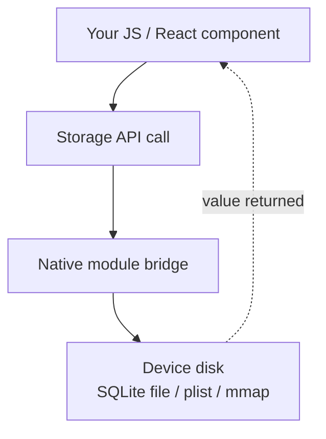
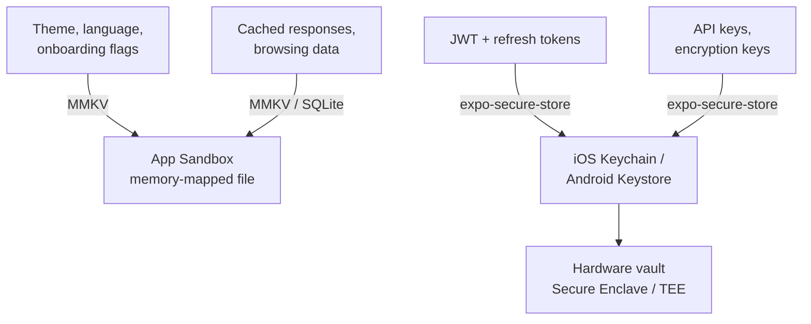
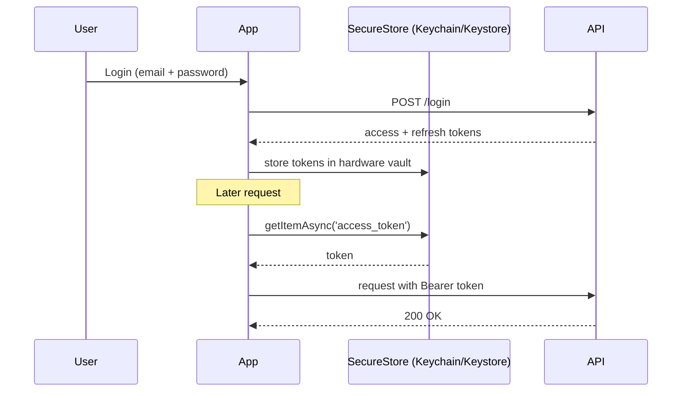
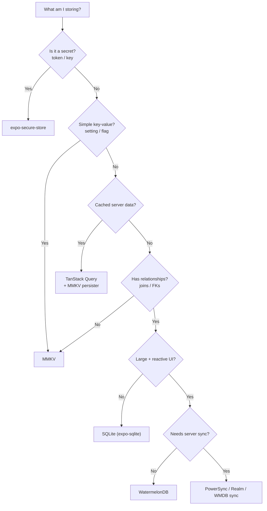

# Storage and Persistence: Keeping Data on the Device

> Key-value stores, secure vaults, relational databases, and when to use each.

---

## Table of Contents
1. [Key-Value Storage](#1-key-value-storage)
2. [Secure Storage](#2-secure-storage)
3. [Relational and Document Storage](#3-relational-and-document-storage)
4. [When to Use What](#4-when-to-use-what)

---

## 1. Key-Value Storage

On the web you have `localStorage` — synchronous, string-only, roughly 5 MB, and dead simple. You call `localStorage.getItem('key')` and the value is *right there*, no waiting. React Native has no `localStorage`. There is no browser, no `window`, no DOM, and therefore no Web Storage API. Your JavaScript runs inside a native app, and the only way to touch the disk is through a **native module** — a bridge to platform code (Objective-C/Swift on iOS, Java/Kotlin on Android). So you need a native replacement, and the ecosystem gives you two real options: **AsyncStorage** and **MMKV**.

### Why "key-value" first?

Think of key-value storage as a single, app-wide dictionary that survives restarts — a `Map<string, value>` written to disk. It is the simplest possible persistence: no schema, no tables, no queries. You put something under a name, you get it back by that name. This is perfect for small, flat data: "what's the user's theme?", "have they finished onboarding?", "how many times have they opened the app?". The moment your data grows relationships (tasks that belong to projects that belong to users), key-value storage stops fitting — but that's section 3's problem.



### AsyncStorage: The Old Default

`@react-native-async-storage/async-storage` is the spiritual successor to the old core `AsyncStorage` that shipped with React Native before it was extracted into a community package. It works, it's stable, and it's everywhere in tutorials. But you should know what you're signing up for.

It serializes everything to JSON strings and writes them to an SQLite table on Android or a plist-backed file on iOS. Every operation is **asynchronous**, which means every read is a promise you have to `await`. Why async? Because the old React Native architecture talked to native code over an asynchronous "bridge" — JS and native ran on separate threads and passed messages back and forth, so nothing native could be read instantly. For a theme preference or a language setting, that async tax creates a **flash-of-default-state** on app launch: your component mounts with the default value, *then* the stored value arrives a few milliseconds later and the UI snaps to it. You'll spend real time papering over that flicker.

```tsx
import AsyncStorage from '@react-native-async-storage/async-storage';

// Write — returns a Promise, must await
await AsyncStorage.setItem('user_language', 'fr');

// Read — always a Promise, value is string | null
const lang = await AsyncStorage.getItem('user_language');

// Store objects — you serialize manually, there is no "setObject"
await AsyncStorage.setItem('preferences', JSON.stringify({ theme: 'dark', fontSize: 16 }));
const prefs = JSON.parse((await AsyncStorage.getItem('preferences')) ?? '{}');

// Batch operations (one round-trip instead of N)
await AsyncStorage.multiSet([
  ['onboarded', 'true'],
  ['last_sync', new Date().toISOString()],
]);

// Read many keys at once
const pairs = await AsyncStorage.multiGet(['onboarded', 'last_sync']);
// pairs = [['onboarded', 'true'], ['last_sync', '2026-06-19T...']]
```

Notice the friction: everything is a string, so booleans and numbers must be stringified (`'true'`, not `true`) and parsed back. It works. But it's slow — benchmarks show 5-10 ms per read on modern devices — and the async-everywhere pattern leaks into every component that reads from it, forcing `useEffect` + `useState` dances just to display a saved setting.

> **Web comparison**: `localStorage.getItem()` is synchronous and returns instantly. `AsyncStorage.getItem()` returns a Promise. If you mentally port web code 1:1, every storage read suddenly needs an `await` — and any code path that wasn't already async has to become async. That ripple effect surprises beginners.

### MMKV: The 2026 Default

**react-native-mmkv** wraps Tencent's MMKV library — a memory-mapped key-value store originally built for WeChat to handle billions of reads. "Memory-mapped" (`mmap`) is the trick: the OS maps the storage file directly into the app's memory address space, so reading a value is essentially reading RAM. There is no async bridge round-trip, no JSON parsing tax for primitives — the value is already in memory. The differences are significant:

| | AsyncStorage | MMKV |
|---|---|---|
| **Speed** | ~5-10 ms/read | ~0.01 ms/read (memory-mapped) |
| **API** | Async (Promises) | **Synchronous** |
| **Types** | Strings only (JSON.stringify) | String, number, boolean, Buffer |
| **Encryption** | No | AES-128, AES-256 |
| **Size limit** | ~6 MB default Android | Limited by disk |
| **Multi-process** | No | Yes (e.g. share with a widget) |
| **Works in Expo Go** | Yes | No (needs a dev build) |

The synchronous API is the killer feature. No `await`, no flicker, no `useEffect` gymnastics on mount. You read a value and you have it, right there in the render path — exactly like `localStorage` on the web, but faster.

```tsx
import { MMKV } from 'react-native-mmkv';

// Create a default instance (usually one shared module-level instance)
const storage = new MMKV();

// Write — synchronous, no await, typed
storage.set('user_language', 'fr');
storage.set('onboarded', true);     // real boolean, not 'true'
storage.set('launch_count', 42);    // real number

// Read — synchronous, typed getters (undefined if missing)
const lang: string | undefined = storage.getString('user_language');
const onboarded: boolean = storage.getBoolean('onboarded') ?? false;
const count: number = storage.getNumber('launch_count') ?? 0;

// Existence + cleanup
if (storage.contains('user_language')) {
  storage.delete('user_language');
}

// List all keys (handy for debugging / migrations)
const keys = storage.getAllKeys();

// Encrypted instance for semi-sensitive (but NOT secret) data
const encrypted = new MMKV({
  id: 'encrypted-storage',
  encryptionKey: 'my-encryption-key',
});
```

You can also create multiple named instances to keep data domains separate — for example one instance per user, or a throwaway cache instance you can wipe in one call:

```tsx
const userCache = new MMKV({ id: `user-${userId}-cache` });
userCache.clearAll(); // nuke everything in just this instance
```

To integrate MMKV with React state, use the built-in `useMMKVString`, `useMMKVBoolean`, and `useMMKVNumber` hooks. They subscribe to a key and re-render the component whenever that key changes — anywhere in the app — giving you a tiny reactive store for free:

```tsx
import { useMMKVString } from 'react-native-mmkv';

function LanguagePicker() {
  // Behaves like useState, but the value is persisted and shared app-wide.
  const [language, setLanguage] = useMMKVString('user_language');

  return (
    <Picker
      selectedValue={language ?? 'en'}
      onValueChange={(val) => setLanguage(val)}
    >
      <Picker.Item label="English" value="en" />
      <Picker.Item label="French" value="fr" />
    </Picker>
  );
}
```

You can also pair MMKV with Zustand's `persist` middleware to back an entire global store with synchronous, persisted storage:

```tsx
import { create } from 'zustand';
import { persist, createJSONStorage } from 'zustand/middleware';
import { MMKV } from 'react-native-mmkv';

const storage = new MMKV();

export const useSettings = create(
  persist(
    (set) => ({ theme: 'light', setTheme: (t: string) => set({ theme: t }) }),
    {
      name: 'settings',
      storage: createJSONStorage(() => ({
        getItem: (k) => storage.getString(k) ?? null,
        setItem: (k, v) => storage.set(k, v),
        removeItem: (k) => storage.delete(k),
      })),
    },
  ),
);
```

> **Gotcha**: MMKV requires native modules — it won't work in **Expo Go** (the prebuilt sandbox app). You need a **development build** (`npx expo prebuild` then run, or use EAS Build). This is a non-issue in production but trips up beginners who prototype in Expo Go and hit a cryptic "MMKV native module not found" error.

> **Gotcha**: MMKV is synchronous, which is wonderful — but a value written under a key with one *type* and read back with a different getter returns `undefined`, not a thrown error. `storage.set('count', 42)` then `storage.getString('count')` gives `undefined`. Pick a consistent type per key.

> **Opinion**: Unless you're maintaining a legacy codebase already on AsyncStorage, start with MMKV. The synchronous API alone justifies the switch. AsyncStorage isn't deprecated, but it's the `var` of React Native storage — it works, but nobody chooses it for new projects.

---

## 2. Secure Storage

Here's a rule that gets broken constantly: **never store authentication tokens, API keys, or secrets in AsyncStorage or unencrypted MMKV**. Why does it matter so much? Because regular key-value storage lives inside your app's sandbox as ordinary files. AsyncStorage on Android is a plain SQLite database that anyone with a rooted phone (or a stolen, unlocked device, or a malware sample) can open and read in plaintext. MMKV with an `encryptionKey` is better, but it's still **app-level** encryption — the key has to live somewhere your JS can reach it, which usually means baked into your bundle. Anyone who can read your bundle can read the key, and anyone with the key can decrypt the data. It's a lock with the key taped to the door.

Real secure storage means using the platform's **hardware-backed** secure storage. Instead of your app holding an encryption key, the *operating system* holds it inside dedicated security hardware that the app — and even the OS itself — cannot directly extract:

- **iOS**: **Keychain Services** — encrypted at the OS level, protected by the device passcode and the **Secure Enclave**, a separate security chip. Items can be configured to require Face ID / Touch ID or device unlock before they're released.
- **Android**: **Android Keystore** — keys are generated and used inside the **TEE (Trusted Execution Environment)** or a dedicated security chip. The key material *never leaves* the secure hardware; your app asks the hardware to encrypt/decrypt on its behalf.

The mental model: with MMKV you hold the safe *and* the combination. With secure storage, you hand the OS your valuables and it locks them in a vault you can't pick — you can only ask it to open the vault, and only after the device proves it's really you.



### expo-secure-store

The simplest path to platform-secure storage in the Expo ecosystem. It wraps **Keychain** on iOS and **EncryptedSharedPreferences** (backed by Android Keystore) on Android, behind one tiny async API. You don't think about enclaves or TEEs — you just call set/get/delete and the OS does the hard part.

```tsx
import * as SecureStore from 'expo-secure-store';

// Store tokens after login
async function saveTokens(access: string, refresh: string) {
  await SecureStore.setItemAsync('access_token', access);
  await SecureStore.setItemAsync('refresh_token', refresh);
}

// Retrieve on app launch
async function getAccessToken(): Promise<string | null> {
  return SecureStore.getItemAsync('access_token');
}

// Clear on logout
async function clearAuth() {
  await SecureStore.deleteItemAsync('access_token');
  await SecureStore.deleteItemAsync('refresh_token');
}
```

You can also gate access behind biometrics, so the token is only released after a Face ID / fingerprint check — ideal for "unlock to view" flows:

```tsx
// Require biometric / passcode auth at read time
await SecureStore.setItemAsync('access_token', access, {
  requireAuthentication: true,            // prompt on read
  keychainAccessible: SecureStore.WHEN_UNLOCKED, // only available while device unlocked
});
```

A full auth token management pattern combines secure storage with an Axios interceptor, so every request automatically carries the token and a `401` automatically refreshes it:

```tsx
import axios from 'axios';
import * as SecureStore from 'expo-secure-store';

const api = axios.create({ baseURL: 'https://api.example.com' });

// Attach token to every outgoing request
api.interceptors.request.use(async (config) => {
  const token = await SecureStore.getItemAsync('access_token');
  if (token) {
    config.headers.Authorization = `Bearer ${token}`;
  }
  return config;
});

// On 401, refresh once and replay the original request
api.interceptors.response.use(
  (response) => response,
  async (error) => {
    if (error.response?.status === 401) {
      const refresh = await SecureStore.getItemAsync('refresh_token');
      if (!refresh) throw error;

      const { data } = await axios.post('https://api.example.com/refresh', {
        refresh_token: refresh,
      });

      await SecureStore.setItemAsync('access_token', data.access_token);
      error.config.headers.Authorization = `Bearer ${data.access_token}`;
      return api.request(error.config); // retry with fresh token
    }
    throw error;
  },
);
```

The login-to-request token lifecycle looks like this:



> **Web comparison**: The web has no real equivalent. Browsers use **httpOnly cookies** for token storage precisely because JavaScript *cannot* read them — the browser attaches them automatically and XSS can't steal them. In React Native there are no cookies and no browser, so you own the token lifecycle yourself: store it, attach it, refresh it, clear it. That's more work but also more control.

> **Gotcha**: `expo-secure-store` has a **2048-byte value limit** on some Android versions. A normal JWT fits easily, but some identity providers pack claims aggressively and blow past it. Test with your *actual* tokens, not a toy string. If you exceed it, store a reference and keep the bulk elsewhere — or split the value.

> **Gotcha**: Secure storage is **async-only** (there is no synchronous read — the hardware call takes time). You therefore *cannot* know at the first frame of startup whether the user is logged in. Plan for a brief "checking auth…" splash/loading screen while you `await getItemAsync`. This is normal and expected in production apps, not a bug to design around.

> **Bare RN note**: Outside Expo, the equivalent library is **react-native-keychain**, which exposes the same Keychain/Keystore primitives with more knobs (access groups, biometric prompts, accessibility levels).

---

## 3. Relational and Document Storage

Key-value stores hit a wall when your data has **relationships**. A task management app with projects, tasks, subtasks, tags, and collaborators doesn't fit into `storage.set('tasks', JSON.stringify(tasks))`. Why not? Because the moment you ask questions like "give me all incomplete tasks in project X, sorted by due date, that are tagged 'urgent'", a flat JSON blob forces you to load *everything* into memory and filter it by hand on every query. That's slow, memory-hungry, and impossible to do efficiently as the data grows. You need a real database — something that can **index**, **query**, and **join** data on disk without loading it all.


### SQLite: The Foundation

SQLite is the most deployed database in the world — it's inside your browser, your phone, your car, and probably your fridge. It's **already on every iOS and Android device**. You're not installing a database server; you're just opening a connection to a single file that *is* the database. If you know SQL from the web/backend world, you already know how to use it.

**expo-sqlite** (Expo SDK 52+) provides a modern async API with prepared statements and transactions. For bare RN, **op-sqlite** (or the older **react-native-quick-sqlite**) offers synchronous C++ bindings via **JSI** (the modern JS-to-native interface that replaces the old async bridge) for maximum performance.

```tsx
import * as SQLite from 'expo-sqlite';

// Open or create a database file in the app's sandbox
const db = await SQLite.openDatabaseAsync('myapp.db');

// Create tables — note the foreign key linking tasks -> projects
await db.execAsync(`
  PRAGMA foreign_keys = ON;

  CREATE TABLE IF NOT EXISTS projects (
    id TEXT PRIMARY KEY,
    name TEXT NOT NULL,
    created_at INTEGER DEFAULT (unixepoch())
  );

  CREATE TABLE IF NOT EXISTS tasks (
    id TEXT PRIMARY KEY,
    project_id TEXT REFERENCES projects(id),
    title TEXT NOT NULL,
    completed INTEGER DEFAULT 0,   -- SQLite has no boolean; 0/1
    position INTEGER DEFAULT 0
  );

  -- Index the column we filter/sort by, so queries stay fast
  CREATE INDEX IF NOT EXISTS idx_tasks_project ON tasks(project_id);
`);

// Insert with a parameterized query — the ? placeholders prevent SQL injection
await db.runAsync(
  'INSERT INTO tasks (id, project_id, title) VALUES (?, ?, ?)',
  [crypto.randomUUID(), projectId, 'Buy groceries']
);

// Query with a typed result — SQLite does the filtering/sorting on disk
const incompleteTasks = await db.getAllAsync<{
  id: string;
  title: string;
  completed: number;
}>(
  'SELECT * FROM tasks WHERE project_id = ? AND completed = 0 ORDER BY position',
  [projectId]
);

// A JOIN — the thing key-value storage simply can't do
const withProject = await db.getAllAsync(
  `SELECT t.title, p.name AS project
   FROM tasks t
   JOIN projects p ON p.id = t.project_id
   WHERE t.completed = 0`
);

// Transaction — all inserts succeed together or roll back together
await db.withTransactionAsync(async () => {
  for (const task of tasksToInsert) {
    await db.runAsync(
      'INSERT INTO tasks (id, project_id, title, position) VALUES (?, ?, ?, ?)',
      [task.id, task.projectId, task.title, task.position]
    );
  }
});
```

A **transaction** is the database equivalent of "all or nothing": if inserting task #7 fails, tasks #1–6 are rolled back too, so you never end up with half-written data. **Parameterized queries** (the `?` placeholders) are non-negotiable — never build SQL by string concatenation, or a malicious title like `'); DROP TABLE tasks; --` could wreck your database.

SQLite is excellent when you control the schema, need complex queries (joins, aggregations, full-text search), and want something battle-tested. The downside: **it's not reactive**. When you write a row, your UI doesn't automatically update — SQLite has no idea React exists. You have to manually re-run queries or build a notification layer to know when data changed. That's the gap the next tool fills.

### WatermelonDB: Reactive ORM for Offline-Heavy Apps

**WatermelonDB** solves the reactivity problem. Built on SQLite under the hood, it adds three things that matter for big, data-heavy apps:

- **Lazy loading**: It only reads records when they're actually rendered. A list of 100,000 tasks won't freeze your app, because it fetches just the visible slice instead of loading everything up front.
- **Reactive queries**: You *observe* a query, and your component automatically re-renders whenever the underlying data changes — anywhere, from any write. Think of it as TanStack Query, but pointed at a local database instead of a server.
- **Sync primitives**: A built-in pull/push sync protocol you can wire to any backend, with hooks for resolving conflicts.

It's opinionated — you define models as classes, use decorators for fields, and interact through an ORM layer rather than raw SQL:

```tsx
// model/Task.ts
import { Model } from '@nozbe/watermelondb';
import { field, text, relation } from '@nozbe/watermelondb/decorators';

export class Task extends Model {
  static table = 'tasks';

  @text('title') title!: string;
  @field('completed') completed!: boolean;
  @relation('projects', 'project_id') project!: any;
}

// In a component — re-renders automatically when matching rows change
import { withObservables } from '@nozbe/watermelondb/react';

const enhance = withObservables(['project'], ({ project }) => ({
  tasks: project.tasks.observe(), // observable query
}));
```

That trade-off — classes and decorators instead of plain SQL — buys you significant productivity on data-heavy, offline-first apps.

### Other Options Worth Knowing

**RxDB** (Reactive Database) takes the "offline-first" philosophy further. It's database-agnostic (can use SQLite, IndexedDB, or memory as a backend), ships with multiple sync plugins (CouchDB, GraphQL, WebSocket), and is fully reactive via **RxJS** observables. A good fit if you're already in the RxJS ecosystem or need flexible sync targets.

**Realm** (now part of MongoDB's Atlas ecosystem) provides a proprietary **object database** — you work with live objects, not rows and SQL — with tight MongoDB Atlas Device Sync integration. If your backend is already MongoDB and you want turnkey cloud sync without building a sync protocol yourself, Realm is compelling. The trade-off: vendor lock-in and a non-SQLite data format that makes ad-hoc debugging harder.

**PowerSync** sits in front of an existing Postgres (or MongoDB) backend and streams changes to an on-device SQLite database, giving you offline-first sync without rewriting your data layer — you keep querying plain SQLite while PowerSync handles the replication and conflict resolution.

Here's how these tiers compare:

| Library | Built on | Reactive? | Sync built in? | Best when |
|---|---|---|---|---|
| **expo-sqlite** | SQLite | No (manual) | No | You want full SQL control, simple needs |
| **WatermelonDB** | SQLite | Yes | Yes (DIY backend) | Large datasets, reactive UI, offline-first |
| **RxDB** | Pluggable | Yes (RxJS) | Yes (plugins) | Flexible sync targets, RxJS shop |
| **Realm** | Proprietary | Yes | Yes (Atlas) | MongoDB backend, turnkey cloud sync |
| **PowerSync** | SQLite + Postgres | Via SQLite | Yes (managed) | Existing Postgres, want offline sync fast |

> **Gotcha**: All database libraries require native modules. **None of them work in Expo Go.** Plan for development builds from day one if your app needs a real database — discovering this halfway through is a painful pivot.

> **Gotcha**: SQLite stores have **no native boolean or date type**. Booleans are `0`/`1` integers and dates are usually Unix timestamps or ISO strings. Decide a convention early and stick to it, or you'll get subtle `completed = true` (never matches `1`) bugs.

> **Web comparison**: The web has **IndexedDB** (key-value, async, famously painful API) and the experimental Origin Private File System for running SQLite via WASM. Neither approaches the maturity or performance of native SQLite on mobile. This is one area where mobile has a genuine advantage over the browser.

---

## 4. When to Use What

This is the decision that actually matters. Picking the wrong storage layer early means a painful migration later — moving thousands of records from a JSON blob into a relational schema after launch is exactly the kind of work you want to avoid. Here's the pragmatic guide:

| **Data Type** | **Best Choice** | **Why** |
|---|---|---|
| App settings (theme, language, flags) | **MMKV** | Synchronous reads, no UI flicker, fast |
| Onboarding / feature flags | **MMKV** | Boolean flags, read on every launch |
| Auth tokens (JWT, refresh) | **expo-secure-store** | Hardware-backed encryption, OS-level protection |
| API keys, encryption keys | **expo-secure-store** | Never in plain storage |
| Cached API responses | **TanStack Query + MMKV persister** | Automatic cache invalidation, stale-while-revalidate |
| Simple user data (<50 records) | **MMKV** (JSON serialized) | Overhead of SQLite not justified |
| Primary data model (relational) | **SQLite** (expo-sqlite) | Joins, indexes, FTS, transactions |
| Large datasets + reactive UI | **WatermelonDB** | Lazy loading, observable queries, 100k+ records |
| Offline-first with cloud sync | **PowerSync** or **WatermelonDB sync** | Built-in conflict resolution |
| MongoDB backend + sync | **Realm (Atlas Device Sync)** | Turnkey if you're already in the MongoDB ecosystem |

### The Decision Flowchart

Ask yourself these questions **in order** — stop at the first one that fits:

1. **Is it a secret?** (tokens, keys, credentials) — Use `expo-secure-store`. Full stop. Security beats convenience here, always.
2. **Is it a simple key-value pair?** (setting, flag, counter) — Use MMKV.
3. **Is it cached server data?** — Use TanStack Query with an MMKV (or AsyncStorage) persister. Don't manually cache API responses in SQLite; you'd be reinventing cache invalidation badly.
4. **Does it have relationships?** (foreign keys, joins, many-to-many) — Use SQLite.
5. **Is the dataset large and does the UI need to react to changes?** — Use WatermelonDB.
6. **Does it need to sync with a server?** — Evaluate PowerSync, WatermelonDB sync, or Realm Sync based on your backend.



### The TanStack Query + MMKV Persister Pattern

This deserves a special mention because it's the most common "storage" need in practice — and beginners often reach for the wrong tool here. The need is: **persist the API cache across app restarts** so the user sees data *instantly* on launch instead of a loading spinner. The naive instinct is to write API responses into SQLite by hand and re-read them on boot. Don't. TanStack Query already manages the cache, freshness, and refetching — you just need to *persist* that cache to disk and rehydrate it on startup. MMKV's synchronous reads make the rehydration instant.

```tsx
import { QueryClient } from '@tanstack/react-query';
import { createSyncStoragePersister } from '@tanstack/query-sync-storage-persister';
import { PersistQueryClientProvider } from '@tanstack/react-query-persist-client';
import { MMKV } from 'react-native-mmkv';

const queryClient = new QueryClient({
  defaultOptions: {
    queries: { gcTime: 1000 * 60 * 60 * 24 }, // keep cache for 24h
  },
});

const storage = new MMKV();

// MMKV implements exactly the synchronous get/set/remove interface TanStack expects
const persister = createSyncStoragePersister({
  storage: {
    getItem: (key) => storage.getString(key) ?? null,
    setItem: (key, value) => storage.set(key, value),
    removeItem: (key) => storage.delete(key),
  },
});

function App() {
  return (
    <PersistQueryClientProvider
      client={queryClient}
      persistOptions={{ persister }}
    >
      {/* Your app — queries rehydrate from MMKV on launch */}
    </PersistQueryClientProvider>
  );
}
```

This gives you persistent cache with **zero manual storage management**. The data is stale-aware (TanStack refetches in the background while showing the cached data), and it leverages MMKV's synchronous reads so the persisted cache loads on the very first frame — the user sees real content immediately, then it quietly updates.

> **Pro tip**: This pattern is why "persisting server data" almost never means "put it in SQLite". Reserve SQLite/WatermelonDB for data your app *owns and queries locally*, not for caching responses you fetched from an API. Cache → TanStack; local data model → database.

> **Final opinion**: Most React Native apps need exactly three storage layers: **MMKV** for preferences and flags, **expo-secure-store** for auth tokens, and **TanStack Query with an MMKV persister** for server data. You only add SQLite or WatermelonDB when you have a genuine local data model — and you'll know when you do, because key-value storage will start feeling like stuffing a spreadsheet into a filing cabinet.