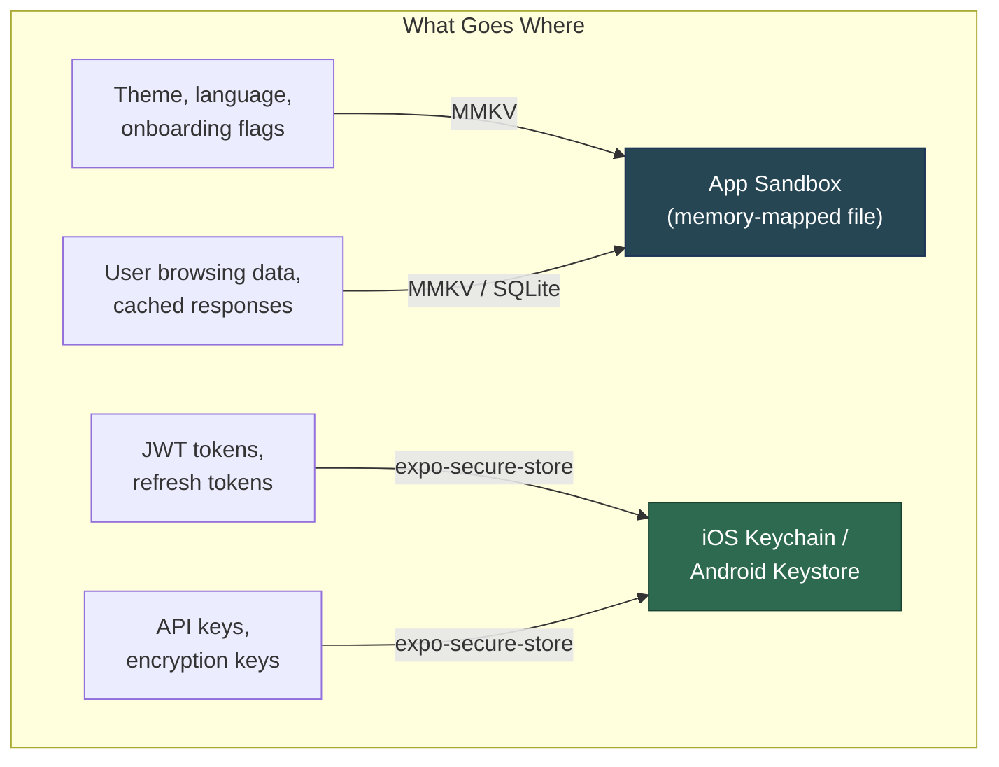
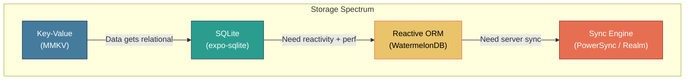

# Storage and Persistence: Keeping Data on the Device

> Key-value stores, secure vaults, relational databases, and when to use each.

---

## Table of Contents
1. [Key-Value Storage](#1-key-value-storage)
2. [Secure Storage](#2-secure-storage)
3. [Relational and Document Storage](#3-relational-and-document-storage)
4. [When to Use What](#4-when-to-use-what)

---

## 1. Key-Value Storage

On the web you have `localStorage` — synchronous, string-only, roughly 5 MB, and dead simple. React Native has no `localStorage`. The browser isn't there. So you need a native replacement, and the ecosystem gives you two real options: **AsyncStorage** and **MMKV**.

### AsyncStorage: The Old Default

`@react-native-async-storage/async-storage` is the spiritual successor to the old core `AsyncStorage` that shipped with React Native before it was extracted. It works, it's stable, and it's everywhere in tutorials. But you should know what you're signing up for.

It serializes everything to JSON strings and writes them to an SQLite table on Android or a plist-backed file on iOS. Every operation is **asynchronous**, which means every read is a promise you have to await. For a theme preference or a language setting, that async tax creates a flash-of-default-state on app launch that you'll spend time papering over.

```tsx
import AsyncStorage from '@react-native-async-storage/async-storage';

// Write
await AsyncStorage.setItem('user_language', 'fr');

// Read
const lang = await AsyncStorage.getItem('user_language'); // string | null

// Store objects (manual serialization)
await AsyncStorage.setItem('preferences', JSON.stringify({ theme: 'dark', fontSize: 16 }));
const prefs = JSON.parse((await AsyncStorage.getItem('preferences')) ?? '{}');

// Batch operations
await AsyncStorage.multiSet([
  ['onboarded', 'true'],
  ['last_sync', new Date().toISOString()],
]);
```

It works. But it's slow (benchmarks show 5-10 ms per read on modern devices), and the async-everywhere pattern leaks into every component that reads from it.

### MMKV: The 2026 Default

**react-native-mmkv** wraps Tencent's MMKV library — a memory-mapped key-value store originally built for WeChat. The differences are significant:

| | AsyncStorage | MMKV |
|---|---|---|
| **Speed** | ~5-10 ms/read | ~0.01 ms/read (memory-mapped) |
| **API** | Async (Promises) | **Synchronous** |
| **Types** | Strings only (JSON.stringify) | String, number, boolean, Buffer |
| **Encryption** | No | AES-128, AES-256 |
| **Size limit** | ~6 MB default Android | Limited by disk |
| **Multi-process** | No | Yes |

The synchronous API is the killer feature. No `await`, no flicker, no `useEffect` gymnastics on mount. You read a value and you have it, right there in the render path.

```tsx
import { MMKV } from 'react-native-mmkv';

// Create a default instance
const storage = new MMKV();

// Write — synchronous, no await
storage.set('user_language', 'fr');
storage.set('onboarded', true);
storage.set('launch_count', 42);

// Read — synchronous, typed
const lang: string | undefined = storage.getString('user_language');
const onboarded: boolean = storage.getBoolean('onboarded') ?? false;
const count: number = storage.getNumber('launch_count') ?? 0;

// Delete
storage.delete('user_language');

// Encrypted instance for semi-sensitive data
const encrypted = new MMKV({
  id: 'encrypted-storage',
  encryptionKey: 'my-encryption-key',
});
```

To integrate MMKV with React state, use the `useMMKVString`, `useMMKVBoolean`, and `useMMMKVNumber` hooks, or pair it with Zustand's persist middleware:

```tsx
import { useMMKVString } from 'react-native-mmkv';

function LanguagePicker() {
  const [language, setLanguage] = useMMKVString('user_language');

  return (
    <Picker
      selectedValue={language ?? 'en'}
      onValueChange={(val) => setLanguage(val)}
    >
      <Picker.Item label="English" value="en" />
      <Picker.Item label="French" value="fr" />
    </Picker>
  );
}
```

> **Gotcha**: MMKV requires native modules — it won't work in Expo Go. You need a development build (`npx expo prebuild` or EAS Build). This is a non-issue in production but trips up beginners using Expo Go for prototyping.

> **Opinion**: Unless you're maintaining a legacy codebase already on AsyncStorage, start with MMKV. The synchronous API alone justifies the switch. AsyncStorage isn't deprecated, but it's the `var` of React Native storage — it works, but nobody chooses it for new projects.

---

## 2. Secure Storage

Here's a rule that gets broken constantly: **never store authentication tokens, API keys, or secrets in AsyncStorage or unencrypted MMKV**. AsyncStorage on Android is a plain SQLite database anyone with a rooted phone can read. MMKV with encryption is better, but it's still app-level encryption — the key lives in your JS bundle.

Real secure storage means using the platform's hardware-backed secure enclave:

- **iOS**: Keychain Services — encrypted at the OS level, protected by the device passcode and Secure Enclave.
- **Android**: Android Keystore — hardware-backed encryption, keys never leave the TEE (Trusted Execution Environment).



### expo-secure-store

The simplest path to platform-secure storage in the Expo ecosystem. It wraps Keychain on iOS and EncryptedSharedPreferences (backed by Android Keystore) on Android.

```tsx
import * as SecureStore from 'expo-secure-store';

// Store a token after login
async function saveTokens(access: string, refresh: string) {
  await SecureStore.setItemAsync('access_token', access);
  await SecureStore.setItemAsync('refresh_token', refresh);
}

// Retrieve on app launch
async function getAccessToken(): Promise<string | null> {
  return SecureStore.getItemAsync('access_token');
}

// Clear on logout
async function clearAuth() {
  await SecureStore.deleteItemAsync('access_token');
  await SecureStore.deleteItemAsync('refresh_token');
}
```

A full auth token management pattern combines secure storage with an Axios interceptor:

```tsx
import axios from 'axios';
import * as SecureStore from 'expo-secure-store';

const api = axios.create({ baseURL: 'https://api.example.com' });

// Attach token to every request
api.interceptors.request.use(async (config) => {
  const token = await SecureStore.getItemAsync('access_token');
  if (token) {
    config.headers.Authorization = `Bearer ${token}`;
  }
  return config;
});

// Refresh on 401
api.interceptors.response.use(
  (response) => response,
  async (error) => {
    if (error.response?.status === 401) {
      const refresh = await SecureStore.getItemAsync('refresh_token');
      if (!refresh) throw error;

      const { data } = await axios.post('https://api.example.com/refresh', {
        refresh_token: refresh,
      });

      await SecureStore.setItemAsync('access_token', data.access_token);
      error.config.headers.Authorization = `Bearer ${data.access_token}`;
      return api.request(error.config);
    }
    throw error;
  },
);
```

> **Web comparison**: The web has no equivalent. Browsers use httpOnly cookies for secure token storage because JavaScript can't touch them. In React Native, there are no cookies (no browser), so you handle token lifecycle yourself. This is both more work and more control.

> **Gotcha**: `expo-secure-store` has a **2048-byte value limit** on some Android versions. If your JWT is unusually large (it shouldn't be, but some identity providers pack claims aggressively), you might hit this. Test with your actual tokens. For bare React Native projects without Expo, **react-native-keychain** is the equivalent library.

> **Gotcha**: Secure storage is async-only. You can't read a token synchronously at app startup. Plan for a brief "loading auth state" screen — this is normal and expected in production apps.

---

## 3. Relational and Document Storage

Key-value stores hit a wall when your data has relationships. A task management app with projects, tasks, subtasks, tags, and collaborators doesn't fit into `storage.set('tasks', JSON.stringify(tasks))`. You need a real database.



### SQLite: The Foundation

SQLite is the most deployed database in the world. It's already on every iOS and Android device. You're just opening a connection to it.

**expo-sqlite** (Expo SDK 52+) provides a modern async API with prepared statements and transactions. For bare RN, **react-native-quick-sqlite** or **op-sqlite** offer synchronous C++ bindings via JSI for maximum performance.

```tsx
import * as SQLite from 'expo-sqlite';

// Open or create a database
const db = await SQLite.openDatabaseAsync('myapp.db');

// Create tables
await db.execAsync(`
  CREATE TABLE IF NOT EXISTS projects (
    id TEXT PRIMARY KEY,
    name TEXT NOT NULL,
    created_at INTEGER DEFAULT (unixepoch())
  );

  CREATE TABLE IF NOT EXISTS tasks (
    id TEXT PRIMARY KEY,
    project_id TEXT REFERENCES projects(id),
    title TEXT NOT NULL,
    completed INTEGER DEFAULT 0,
    position INTEGER DEFAULT 0
  );
`);

// Insert with parameterized query (prevents SQL injection)
await db.runAsync(
  'INSERT INTO tasks (id, project_id, title) VALUES (?, ?, ?)',
  [crypto.randomUUID(), projectId, 'Buy groceries']
);

// Query
const incompleteTasks = await db.getAllAsync<{
  id: string;
  title: string;
  completed: number;
}>(
  'SELECT * FROM tasks WHERE project_id = ? AND completed = 0 ORDER BY position',
  [projectId]
);

// Transaction for batch operations
await db.withTransactionAsync(async () => {
  for (const task of tasksToInsert) {
    await db.runAsync(
      'INSERT INTO tasks (id, project_id, title, position) VALUES (?, ?, ?, ?)',
      [task.id, task.projectId, task.title, task.position]
    );
  }
});
```

SQLite is excellent when you control the schema, need complex queries (joins, aggregations, full-text search), and want something battle-tested. The downside: it's not reactive. When you write a row, your UI doesn't automatically update. You need to manually invalidate queries or build a notification layer.

### WatermelonDB: Reactive ORM for Offline-Heavy Apps

**WatermelonDB** solves the reactivity problem. Built on SQLite under the hood, it provides:

- **Lazy loading**: Only loads records when they're actually rendered. A list of 100,000 tasks won't freeze your app because it only fetches the visible slice.
- **Reactive queries**: Observe a query, and your component re-renders when underlying data changes. Think of it as TanStack Query but for a local database.
- **Sync primitives**: A built-in pull/push sync protocol you can wire to any backend.

It's opinionated — you define models as classes, use decorators for fields, and interact through an ORM layer rather than raw SQL. That trade-off buys you significant productivity on data-heavy apps.

### Other Options Worth Knowing

**RxDB** (Reactive Database) takes the "offline-first" philosophy further. It's database-agnostic (can use SQLite, IndexedDB, or memory as a backend), ships with multiple sync plugins (CouchDB, GraphQL, WebSocket), and is fully reactive via RxJS observables. Good fit if you're already in the RxJS ecosystem or need flexible sync targets.

**Realm** (now part of MongoDB's Atlas ecosystem) provides a proprietary object database with tight MongoDB Atlas Device Sync integration. If your backend is already MongoDB and you want turnkey cloud sync without building a sync protocol, Realm is compelling. The trade-off: vendor lock-in and a non-SQLite data format that makes debugging harder.

> **Gotcha**: All database libraries require native modules. None of them work in Expo Go. Plan for development builds from day one if your app needs a real database.

> **Web comparison**: The web has IndexedDB (key-value, async, painful API) and the experimental Origin Private File System for SQLite via WASM. Neither approaches the maturity or performance of native SQLite on mobile. This is an area where mobile has a genuine advantage.

---

## 4. When to Use What

This is the decision that actually matters. Picking the wrong storage layer early means a painful migration later. Here's the pragmatic guide:

| **Data Type** | **Best Choice** | **Why** |
|---|---|---|
| App settings (theme, language, flags) | **MMKV** | Synchronous reads, no UI flicker, fast |
| Onboarding / feature flags | **MMKV** | Boolean flags, read on every launch |
| Auth tokens (JWT, refresh) | **expo-secure-store** | Hardware-backed encryption, OS-level protection |
| API keys, encryption keys | **expo-secure-store** | Never in plain storage |
| Cached API responses | **TanStack Query + MMKV persister** | Automatic cache invalidation, stale-while-revalidate |
| Simple user data (<50 records) | **MMKV** (JSON serialized) | Overhead of SQLite not justified |
| Primary data model (relational) | **SQLite** (expo-sqlite) | Joins, indexes, FTS, transactions |
| Large datasets + reactive UI | **WatermelonDB** | Lazy loading, observable queries, 100k+ records |
| Offline-first with cloud sync | **PowerSync** or **WatermelonDB sync** | Built-in conflict resolution |
| MongoDB backend + sync | **Realm (Atlas Device Sync)** | Turnkey if you're already in the MongoDB ecosystem |

### The Decision Flowchart

Ask yourself these questions in order:

1. **Is it a secret?** (tokens, keys, credentials) — Use `expo-secure-store`. Full stop.
2. **Is it a simple key-value pair?** (setting, flag, counter) — Use MMKV.
3. **Is it cached server data?** — Use TanStack Query with an MMKV or AsyncStorage persister. Don't manually cache API responses in SQLite.
4. **Does it have relationships?** (foreign keys, joins, many-to-many) — Use SQLite.
5. **Is the dataset large and does the UI need to react to changes?** — Use WatermelonDB.
6. **Does it need to sync with a server?** — Evaluate PowerSync, WatermelonDB sync, or Realm Sync based on your backend.

### The TanStack Query + MMKV Persister Pattern

This deserves a special mention because it's the most common "storage" need in practice — persisting API cache across app restarts so the user sees data instantly on launch instead of a loading spinner:

```tsx
import { QueryClient } from '@tanstack/react-query';
import { createSyncStoragePersister } from '@tanstack/query-sync-storage-persister';
import { PersistQueryClientProvider } from '@tanstack/react-query-persist-client';
import { MMKV } from 'react-native-mmkv';

const queryClient = new QueryClient({
  defaultOptions: {
    queries: { gcTime: 1000 * 60 * 60 * 24 }, // 24 hours
  },
});

const storage = new MMKV();

// MMKV implements the sync storage interface TanStack expects
const persister = createSyncStoragePersister({
  storage: {
    getItem: (key) => storage.getString(key) ?? null,
    setItem: (key, value) => storage.set(key, value),
    removeItem: (key) => storage.delete(key),
  },
});

function App() {
  return (
    <PersistQueryClientProvider
      client={queryClient}
      persistOptions={{ persister }}
    >
      {/* Your app */}
    </PersistQueryClientProvider>
  );
}
```

This gives you persistent cache with zero manual storage management. The data is stale-aware (TanStack handles refetching), and it leverages MMKV's synchronous reads so the persisted cache loads instantly on startup.

> **Final opinion**: Most React Native apps need exactly three storage layers: MMKV for preferences and flags, expo-secure-store for auth tokens, and TanStack Query with an MMKV persister for server data. You only add SQLite or WatermelonDB when you have a genuine local data model — and you'll know when you do, because key-value storage will start feeling like stuffing a spreadsheet into a filing cabinet.
