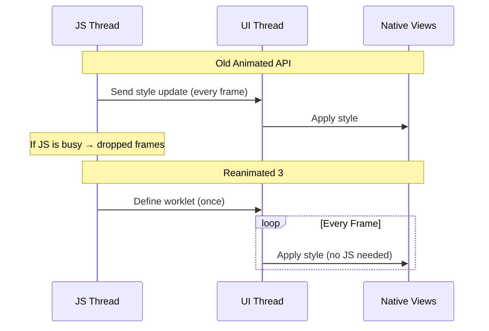
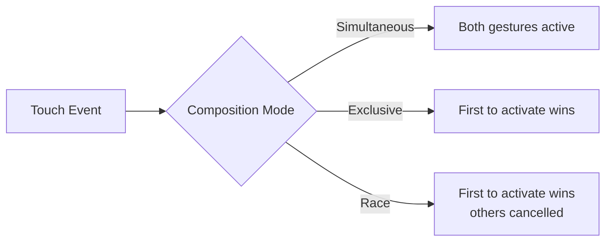
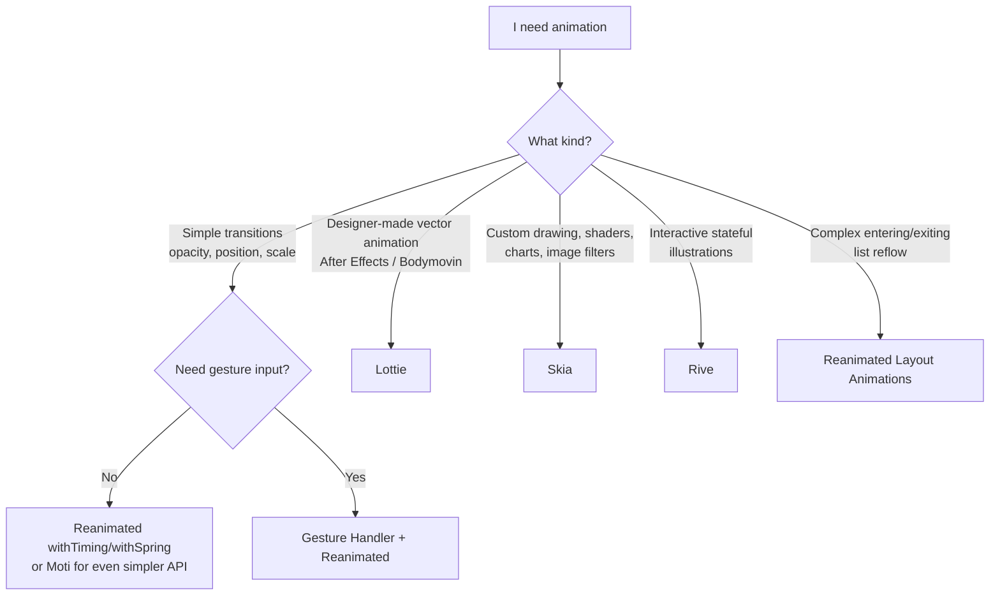

# Animations and Gestures: 60fps on the UI Thread

> Reanimated 3, Gesture Handler, and the tools that replace CSS transitions with native performance.

---

## Table of Contents

1. [Reanimated 3](#1-reanimated-3)
2. [Gesture Handler](#2-gesture-handler)
3. [Other Animation Tools](#3-other-animation-tools)
4. [When to Reach for What](#4-when-to-reach-for-what)

---

## 1. Reanimated 3

### The Problem with Animated from React Native

On the web, you slap a `transition: transform 0.3s ease` on a div and call it a day. The browser handles interpolation on the compositor thread, your JavaScript never wakes up, and you get 60fps for free.

React Native ships with an `Animated` API that *looks* similar but has a fatal flaw: most of the work runs on the JS thread. Every frame, your JavaScript bridge sends a new style value to native. One heavy render, one slow API call, one garbage collection pause — and your animation stutters. Users notice. They always notice.

Reanimated 3 fixes this by running animation logic directly on the **UI thread** using small functions called **worklets**. Your JS thread can freeze entirely and the animation keeps going at 60fps.



### Shared Values: The Core Primitive

A `useSharedValue` is like `useRef` but accessible from both the JS thread and the UI thread. It does not trigger re-renders. It is the beating heart of every Reanimated animation.

```tsx
import Animated, {
  useSharedValue,
  useAnimatedStyle,
  withTiming,
  withSpring,
} from 'react-native-reanimated';

function FadeInBox() {
  const opacity = useSharedValue(0);

  const animatedStyle = useAnimatedStyle(() => ({
    opacity: opacity.value,
  }));

  const show = () => {
    opacity.value = withTiming(1, { duration: 400 });
  };

  return (
    <Animated.View style={[styles.box, animatedStyle]}>
      <Button title="Show" onPress={show} />
    </Animated.View>
  );
}
```

When you write `opacity.value = withTiming(1)`, you are not setting the value to 1 immediately. You are telling the UI thread: "interpolate from the current value to 1 over 400ms using an easing curve." The JS thread fires and forgets.

### The Animation Toolkit

Reanimated gives you composable animation modifiers:

| Function | What It Does | Web Equivalent |
|---|---|---|
| `withTiming` | Duration-based easing | `transition: 0.3s ease` |
| `withSpring` | Physics-based spring | `spring()` in Framer Motion |
| `withDecay` | Momentum with friction | No direct CSS equivalent |
| `withRepeat` | Loop any animation | `animation-iteration-count` |
| `withSequence` | Chain animations in order | `@keyframes` with multiple stops |

Compose them freely:

```tsx
// Bounce in: scale up with spring, then pulse forever
scale.value = withSequence(
  withSpring(1, { damping: 4, stiffness: 200 }),
  withRepeat(
    withSequence(
      withTiming(1.05, { duration: 600 }),
      withTiming(1, { duration: 600 })
    ),
    -1, // -1 = infinite
    true // reverse each iteration
  )
);
```

### Crossing the Thread Boundary

Worklets run on the UI thread. Sometimes you need to call back to JS — maybe to update state or fire an analytics event. That is what `runOnJS` is for:

```tsx
import { runOnJS } from 'react-native-reanimated';

function SwipeCard() {
  const translateX = useSharedValue(0);

  const onSwipeComplete = (direction: string) => {
    // This runs on JS thread — safe to setState, fetch, etc.
    console.log(`Swiped ${direction}`);
  };

  const animatedStyle = useAnimatedStyle(() => {
    if (Math.abs(translateX.value) > 200) {
      runOnJS(onSwipeComplete)(
        translateX.value > 0 ? 'right' : 'left'
      );
    }
    return { transform: [{ translateX: translateX.value }] };
  });

  return <Animated.View style={animatedStyle} />;
}
```

> **Gotcha:** Never call a regular JS function directly inside `useAnimatedStyle` or a gesture handler callback. The worklet executes on the UI thread — it has no access to closures, state, or modules from the JS thread. Always wrap JS-side calls with `runOnJS`. Forgetting this is the single most common Reanimated bug.

The reverse also exists: `runOnUI` lets you trigger a worklet from the JS thread when you need to kick off an imperative animation from, say, a button press handler that already lives in JS.

### useAnimatedReaction: Watching Values

Sometimes you need side effects when a shared value changes — like triggering a haptic when a drag crosses a threshold. `useAnimatedReaction` is your tool:

```tsx
import { useAnimatedReaction } from 'react-native-reanimated';

useAnimatedReaction(
  () => translateY.value,           // what to watch
  (current, previous) => {          // what to do when it changes
    if (previous && previous < 100 && current >= 100) {
      runOnJS(triggerHaptic)();
    }
  }
);
```

### Layout Animations: Zero-Effort Transitions

Reanimated ships with pre-built entering and exiting animations. Think of them as the React Native equivalent of `<Transition>` from Vue or `AnimatePresence` from Framer Motion:

```tsx
import Animated, { FadeIn, FadeOut, SlideInRight } from 'react-native-reanimated';

function TodoItem({ item, onRemove }) {
  return (
    <Animated.View
      entering={SlideInRight.duration(300)}
      exiting={FadeOut.duration(200)}
      layout={LinearTransition.springify()}
    >
      <Text>{item.text}</Text>
    </Animated.View>
  );
}
```

The `layout` prop is the real gem — when sibling items reflow (say an item is deleted from a list), Reanimated automatically animates every remaining item to its new position. On the web, this requires libraries like `auto-animate` or FLIP techniques. Here it is one prop.

---

## 2. Gesture Handler

### Why Not Just onTouchStart?

React Native's built-in touch system (`PanResponder`, `onTouchStart`) runs through the JS bridge. It also has no concept of gesture composition — what happens when a scroll view contains a draggable card that also has a tap handler? The built-in system falls apart.

`react-native-gesture-handler` solves both problems. Gestures are recognized on the native thread and compose declaratively.

### The Core Gestures

```tsx
import { Gesture, GestureDetector } from 'react-native-gesture-handler';
import Animated, {
  useSharedValue,
  useAnimatedStyle,
  withSpring,
} from 'react-native-reanimated';

function DraggableCard() {
  const translateX = useSharedValue(0);
  const translateY = useSharedValue(0);
  const savedX = useSharedValue(0);
  const savedY = useSharedValue(0);

  const pan = Gesture.Pan()
    .onStart(() => {
      savedX.value = translateX.value;
      savedY.value = translateY.value;
    })
    .onUpdate((event) => {
      translateX.value = savedX.value + event.translationX;
      translateY.value = savedY.value + event.translationY;
    })
    .onEnd(() => {
      translateX.value = withSpring(0);
      translateY.value = withSpring(0);
    });

  const animatedStyle = useAnimatedStyle(() => ({
    transform: [
      { translateX: translateX.value },
      { translateY: translateY.value },
    ],
  }));

  return (
    <GestureDetector gesture={pan}>
      <Animated.View style={[styles.card, animatedStyle]} />
    </GestureDetector>
  );
}
```

Notice something important: the `onUpdate` callback writes directly to shared values. No bridge crossing, no JS thread involvement. The gesture feeds position data to the animation on the UI thread, every frame.

The five primary gesture recognizers:

| Gesture | Use Case |
|---|---|
| `Gesture.Pan()` | Drag, swipe, pull-to-refresh |
| `Gesture.Pinch()` | Zoom in/out |
| `Gesture.Tap()` | Single, double, or N-tap |
| `Gesture.LongPress()` | Press-and-hold menus |
| `Gesture.Fling()` | Quick directional flick |

### Gesture Composition

Real UIs need multiple gestures on the same element. Gesture Handler gives you three composition modes:

```tsx
// Both gestures run at the same time (e.g., pinch + pan for a photo viewer)
const composed = Gesture.Simultaneous(pinchGesture, panGesture);

// First gesture to activate wins, others are cancelled
const exclusive = Gesture.Exclusive(doubleTap, singleTap);

// First gesture to activate wins (same as Exclusive for most cases)
const race = Gesture.Race(swipeGesture, scrollGesture);
```



> **Common Mistake:** Wrapping `Gesture.Exclusive(singleTap, doubleTap)` in the wrong order. The exclusive resolver picks the *first* gesture that meets its activation criteria. A single tap always fires before a double tap. You must put `doubleTap` first so it gets priority:
>
> ```tsx
> // Correct: double tap checked first
> const gesture = Gesture.Exclusive(doubleTap, singleTap);
> ```

### Connecting Gestures to Reanimated

The power of this ecosystem is that Gesture Handler and Reanimated share the same UI-thread worklet runtime. A gesture callback can write to a shared value, and an animated style reads it — all without the JS thread ever knowing:

```tsx
const scale = useSharedValue(1);

const pinch = Gesture.Pinch()
  .onUpdate((event) => {
    scale.value = event.scale;  // UI thread, every frame
  })
  .onEnd(() => {
    scale.value = withSpring(1); // snap back
  });

const animatedStyle = useAnimatedStyle(() => ({
  transform: [{ scale: scale.value }],
}));
```

This is how apps like Instagram, Telegram, and Airbnb build their gesture-driven interfaces. The pattern is always the same: gesture writes to shared value, animated style reads from shared value.

---

## 3. Other Animation Tools

Reanimated and Gesture Handler handle 80% of animation needs. The remaining 20% is where specialized tools shine.

### Lottie: Vector Animations from After Effects

If your designer hands you an After Effects file and says "make it move," you want [Lottie](https://github.com/lottie-react-native/lottie-react-native). Designers export animations as JSON, and Lottie renders them natively at 60fps.

```bash
npx expo install lottie-react-native
```

```tsx
import LottieView from 'lottie-react-native';

function SuccessAnimation() {
  return (
    <LottieView
      source={require('./checkmark.json')}
      autoPlay
      loop={false}
      style={{ width: 150, height: 150 }}
    />
  );
}
```

Lottie is perfect for: loading spinners, success/error states, onboarding illustrations, icon animations. It is **not** good for: interactive animations that respond to user input (use Reanimated for that) or heavy full-screen animations (use Skia or Rive).

> **Tip:** You can control Lottie progress with a Reanimated shared value by using the `progress` prop. This lets you scrub through an animation based on scroll position or gesture input.

### Skia: A 2D Rendering Engine

`@shopify/react-native-skia` gives you a GPU-accelerated canvas with shaders, blur, gradients, path drawing, and image filters — all at 60fps. Think of it as `<canvas>` on steroids.

```tsx
import { Canvas, Circle, LinearGradient, vec } from '@shopify/react-native-skia';

function GradientOrb() {
  return (
    <Canvas style={{ width: 200, height: 200 }}>
      <Circle cx={100} cy={100} r={80}>
        <LinearGradient
          start={vec(0, 0)}
          end={vec(200, 200)}
          colors={['#6366f1', '#ec4899']}
        />
      </Circle>
    </Canvas>
  );
}
```

Use Skia when you need: custom drawing (charts, graphs, signatures), image processing (blur, color matrix), shader effects, or anything that would be a `<canvas>` on the web. Skia integrates with Reanimated shared values, so you can animate shader uniforms and path properties on the UI thread.

### Moti: Declarative Animations

[Moti](https://moti.fyi) wraps Reanimated with a Framer Motion-like API. Less control, less boilerplate:

```tsx
import { MotiView } from 'moti';

function FadeInCard() {
  return (
    <MotiView
      from={{ opacity: 0, translateY: 20 }}
      animate={{ opacity: 1, translateY: 0 }}
      transition={{ type: 'timing', duration: 350 }}
    />
  );
}
```

Moti is excellent for simple enter/exit animations where you do not need gesture integration or fine-grained control. It is a convenience layer — if you outgrow it, drop down to Reanimated directly.

### Rive: Interactive State Machines

[Rive](https://rive.app) is like Lottie but with built-in state machines. Your designer can define states (idle, hover, pressed, loading) in the Rive editor, and you trigger transitions from code. Useful for complex interactive illustrations and game-like UI elements.

---

## 4. When to Reach for What

Here is the decision framework. Do not overthink it — pick the simplest tool that solves your problem.



### The Decision in Plain English

**"I want a button to fade in."**
Use `withTiming` from Reanimated, or a `MotiView` if you want less code. Do not import Lottie for this.

**"I want a card the user can drag and fling."**
Gesture Handler `Gesture.Pan()` writing to Reanimated shared values. This is the bread-and-butter pattern.

**"I want a pinch-to-zoom photo viewer."**
`Gesture.Simultaneous(pinch, pan)` with Reanimated. Store scale and translation in shared values.

**"My designer gave me an After Effects animation."**
Lottie. Export as JSON, drop it in. If you need to scrub it with a gesture, connect the `progress` prop to a shared value.

**"I need a custom chart with animated paths."**
Skia. Draw paths, animate them with Reanimated shared values driving Skia properties.

**"I need animated illustrations that respond to app state."**
Rive. Define state machines in the editor, trigger them from React.

### Performance Rules of Thumb

1. **Keep animations on the UI thread.** If you see `useNativeDriver: false` in old code, that is a red flag. Reanimated is UI-thread by default.
2. **Avoid `runOnJS` in hot paths.** Crossing the bridge once per gesture event defeats the purpose. Only call back to JS for discrete events (swipe complete, threshold crossed).
3. **Use `cancelAnimation` to clean up.** If a component unmounts during an animation, cancel it. Reanimated will warn you if you forget.
4. **Measure with Perf Monitor.** Enable the React Native performance overlay (`Cmd+D` > "Show Perf Monitor") to verify you are hitting 60fps. If the UI thread drops below 60, your worklet is doing too much work.

> **The Golden Rule:** If an animation is driven by user touch, it *must* run on the UI thread. There is no amount of optimization that will make JS-thread animations feel native during gestures. Reanimated + Gesture Handler is not optional for production apps — it is the baseline.