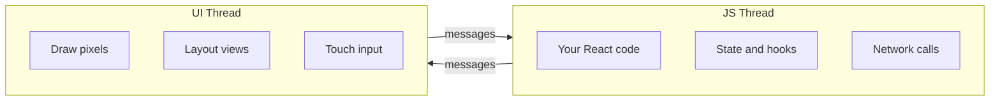
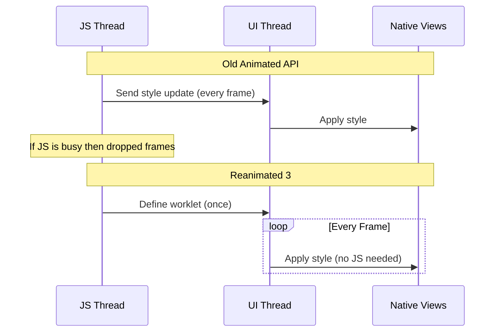
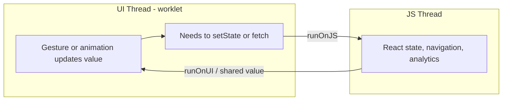
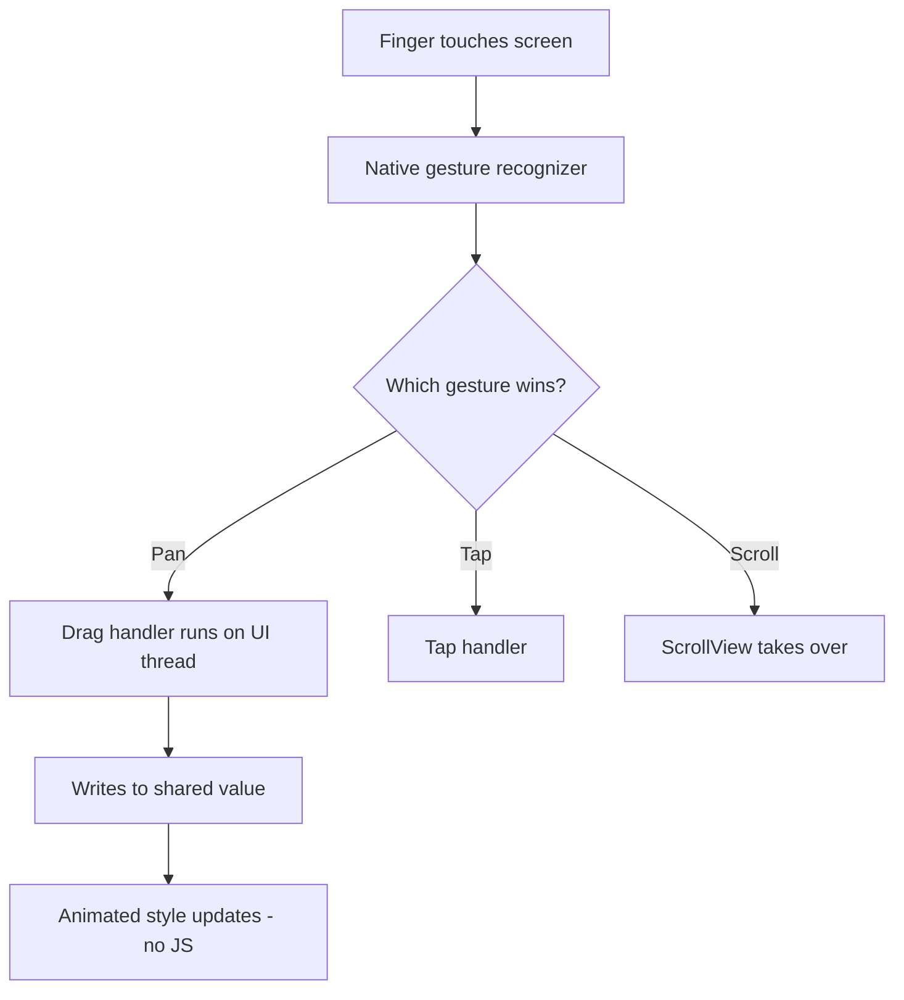
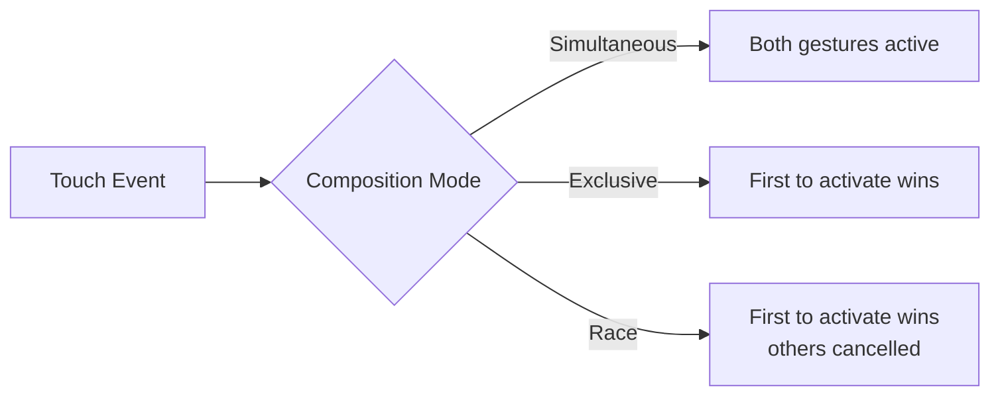
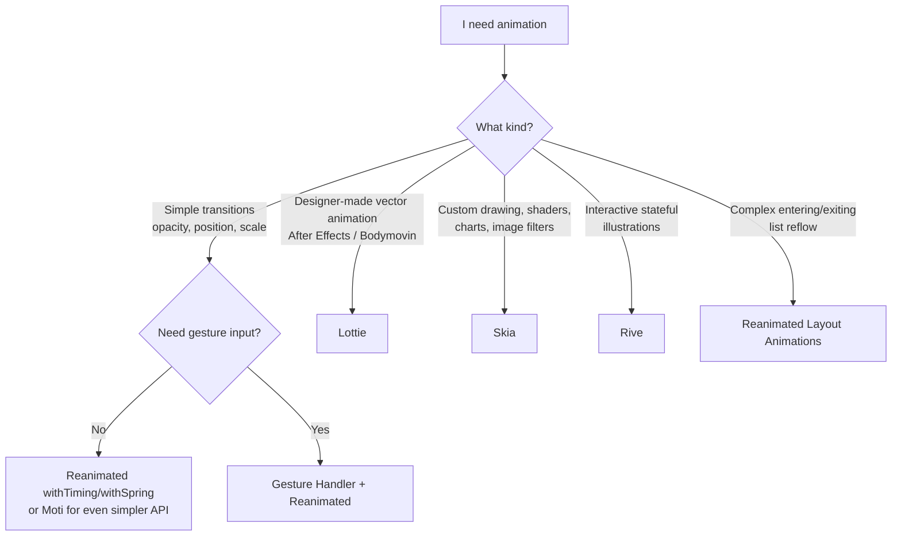

# Animations and Gestures: 60fps on the UI Thread

> Reanimated 3, Gesture Handler, and the tools that replace CSS transitions with native performance.

---

## Table of Contents

1. [Reanimated 3](#1-reanimated-3)
2. [Gesture Handler](#2-gesture-handler)
3. [Other Animation Tools](#3-other-animation-tools)
4. [When to Reach for What](#4-when-to-reach-for-what)

---

## 1. Reanimated 3

### Two Threads, and Why You Should Care

Before any of this makes sense, you need a mental model of how a React Native app actually runs. Unlike a web page, which lives in a single rendering pipeline the browser manages for you, a React Native app runs your code across **two main threads** that talk to each other:

- **The JS thread** — where your React components, hooks, state, `fetch` calls, and business logic all run. This is "your" code.
- **The UI thread** (also called the *main* or *native* thread) — where the operating system actually draws pixels, lays out views, and processes touch input. This thread must stay free, because if it ever stalls, the screen literally freezes.

The two communicate by passing messages. Think of it like two people in separate rooms passing notes under a door. That door is the bottleneck.



Why does this matter for animations? Because an animation is just a value changing 60 times per second. The question is: *which thread is doing that math?* If it is the JS thread, every other thing the JS thread does competes with your animation. If it is the UI thread, the animation is insulated from your app's busyness.

> **Mental model:** The UI thread is the projectionist running the film; the JS thread is the screenwriter. You do not want the projectionist pausing the movie every time the screenwriter wants to scribble a new line.

### The Problem with Animated from React Native

On the web, you slap a `transition: transform 0.3s ease` on a div and call it a day. The browser handles interpolation on the compositor thread, your JavaScript never wakes up, and you get 60fps for free.

React Native ships with an `Animated` API that *looks* similar but has a fatal flaw: most of the work runs on the JS thread. Every frame, your JavaScript bridge sends a new style value to native. One heavy render, one slow API call, one garbage collection pause — and your animation stutters. Users notice. They always notice.

The `Animated` API tried to mitigate this with a flag called `useNativeDriver: true`, which moves *some* animations to the native side. But it only works for a narrow set of properties (`opacity`, `transform`) and it cannot react to gestures or run conditional logic mid-animation. The moment you need anything dynamic, you fall back to the JS thread and the jank returns.

Reanimated 3 fixes this by running animation logic directly on the **UI thread** using small functions called **worklets**. Your JS thread can freeze entirely and the animation keeps going at 60fps.



### What Exactly Is a Worklet?

A **worklet** is a small JavaScript function that Reanimated copies over to run on the UI thread instead of the JS thread. When you mark a function as a worklet (Reanimated's Babel plugin does this automatically for `useAnimatedStyle`, gesture callbacks, etc.), it gets a special `'worklet';` directive and a serialized copy of the variables it needs.

The catch: because a worklet runs in a *separate* JavaScript context on the UI thread, it does **not** share memory with your normal JS code. It cannot see your component's regular variables, imported modules, or state — only the specific "shared values" and serialized primitives Reanimated hands it.

```tsx
// This whole function body becomes a worklet — it runs on the UI thread.
const animatedStyle = useAnimatedStyle(() => {
  'worklet'; // usually auto-injected by the Babel plugin, shown here for clarity
  return { opacity: opacity.value };
});
```

> **Why the separation exists:** The UI thread cannot "reach into" the JS heap safely while the JS thread might be mutating it. So Reanimated runs a second, isolated JS runtime on the UI thread. This is the price of 60fps independence — and it is why crossing back to JS requires the explicit `runOnJS` helper you will meet shortly.

### Shared Values: The Core Primitive

A `useSharedValue` is like `useRef` but accessible from both the JS thread and the UI thread. It does not trigger re-renders. It is the beating heart of every Reanimated animation.

The key insight: a shared value is a *single piece of memory* both threads can read and write. When the UI thread updates `opacity.value` 60 times a second, your React component never re-renders — because you read that value inside a worklet, not in JSX. On the web, the equivalent would be mutating a DOM node's style directly via a ref instead of going through React state; here it is the default, optimized path.

```tsx
import Animated, {
  useSharedValue,
  useAnimatedStyle,
  withTiming,
  withSpring,
} from 'react-native-reanimated';

function FadeInBox() {
  const opacity = useSharedValue(0);

  const animatedStyle = useAnimatedStyle(() => ({
    opacity: opacity.value,
  }));

  const show = () => {
    opacity.value = withTiming(1, { duration: 400 });
  };

  return (
    <Animated.View style={[styles.box, animatedStyle]}>
      <Button title="Show" onPress={show} />
    </Animated.View>
  );
}
```

When you write `opacity.value = withTiming(1)`, you are not setting the value to 1 immediately. You are telling the UI thread: "interpolate from the current value to 1 over 400ms using an easing curve." The JS thread fires and forgets.

> **Gotcha:** You must always read and write the `.value` property, never the shared value object itself. `opacity = 1` does nothing useful; `opacity.value = 1` is what moves things. And reading `opacity.value` *inside JSX* (outside a worklet) gives you a stale snapshot and won't update — that's exactly what `useAnimatedStyle` is for.

### Driving Styles from Values: useAnimatedStyle and interpolate

`useAnimatedStyle` returns a style object that the UI thread recomputes every frame from your shared values. You almost never animate `.value` directly into a final style number — instead you keep a "raw" driver value and **interpolate** it into the styles you actually want. This is the single most reusable pattern in Reanimated.

```tsx
import { interpolate, Extrapolation } from 'react-native-reanimated';

const progress = useSharedValue(0); // one driver, 0 -> 1

const cardStyle = useAnimatedStyle(() => ({
  // map progress 0..1 onto several visual properties at once
  opacity: interpolate(progress.value, [0, 1], [0, 1]),
  transform: [
    { translateY: interpolate(progress.value, [0, 1], [40, 0]) },
    { scale: interpolate(progress.value, [0, 1], [0.95, 1]) },
  ],
  // clamp so values never overshoot the ends of the range
  borderRadius: interpolate(
    progress.value,
    [0, 1],
    [24, 8],
    Extrapolation.CLAMP
  ),
}));

// later, one line animates the whole card in:
progress.value = withTiming(1, { duration: 300 });
```

`interpolate` is the RN cousin of CSS `@keyframes` mixed with a value-mapping function: you give it an input range and an output range, and it linearly maps between them. Drive ten style properties from one `progress` value and your animations stay perfectly in sync.

### The Animation Toolkit

Reanimated gives you composable animation modifiers:

| Function | What It Does | Web Equivalent |
|---|---|---|
| `withTiming` | Duration-based easing | `transition: 0.3s ease` |
| `withSpring` | Physics-based spring | `spring()` in Framer Motion |
| `withDecay` | Momentum with friction | No direct CSS equivalent |
| `withRepeat` | Loop any animation | `animation-iteration-count` |
| `withSequence` | Chain animations in order | `@keyframes` with multiple stops |
| `withDelay` | Wait, then run an animation | `animation-delay` |

**Timing vs spring — which feels right?** Use `withTiming` when you want a precise, predictable duration (a tooltip that fades in over exactly 200ms). Use `withSpring` when you want something to feel *physical* — buttons springing back, cards snapping into place, anything a finger just let go of. Springs have no fixed duration; they settle based on physics parameters:

| Spring param | What it controls | Higher value means |
|---|---|---|
| `damping` | How quickly oscillation dies out | Less bouncy, settles faster |
| `stiffness` | How strong the spring pull is | Snappier, faster motion |
| `mass` | The "weight" of the object | Slower, heavier feel |

Compose them freely:

```tsx
// Bounce in: scale up with spring, then pulse forever
scale.value = withSequence(
  withSpring(1, { damping: 4, stiffness: 200 }),
  withRepeat(
    withSequence(
      withTiming(1.05, { duration: 600 }),
      withTiming(1, { duration: 600 })
    ),
    -1, // -1 = infinite
    true // reverse each iteration
  )
);
```

> **Pro tip:** Animation modifiers accept a *callback* that fires when they finish: `withTiming(1, { duration: 400 }, (finished) => { ... })`. The callback runs on the UI thread, so if you need to do JS work when an animation ends (navigate, setState), wrap it: `withTiming(1, {}, () => runOnJS(onDone)())`.

### Crossing the Thread Boundary

Worklets run on the UI thread. Sometimes you need to call back to JS — maybe to update state or fire an analytics event. That is what `runOnJS` is for:

```tsx
import { runOnJS } from 'react-native-reanimated';

function SwipeCard() {
  const translateX = useSharedValue(0);

  const onSwipeComplete = (direction: string) => {
    // This runs on JS thread — safe to setState, fetch, etc.
    console.log(`Swiped ${direction}`);
  };

  const animatedStyle = useAnimatedStyle(() => {
    if (Math.abs(translateX.value) > 200) {
      runOnJS(onSwipeComplete)(
        translateX.value > 0 ? 'right' : 'left'
      );
    }
    return { transform: [{ translateX: translateX.value }] };
  });

  return <Animated.View style={animatedStyle} />;
}
```



> **Gotcha:** Never call a regular JS function directly inside `useAnimatedStyle` or a gesture handler callback. The worklet executes on the UI thread — it has no access to closures, state, or modules from the JS thread. Always wrap JS-side calls with `runOnJS`. Forgetting this is the single most common Reanimated bug, and it often shows up as a cryptic error like *"Tried to synchronously call a non-worklet function on the UI thread."*

The reverse also exists: `runOnUI` lets you trigger a worklet from the JS thread when you need to kick off an imperative animation from, say, a button press handler that already lives in JS.

> **Pro tip:** `runOnJS` has a real cost — it marshals the call across the thread boundary. Calling it *every frame* (e.g. inside `onUpdate` for a drag) recreates exactly the jank Reanimated was built to avoid. Only call it for *discrete* events: gesture finished, threshold crossed, animation complete.

### useAnimatedReaction: Watching Values

Sometimes you need side effects when a shared value changes — like triggering a haptic when a drag crosses a threshold. `useAnimatedReaction` is your tool. Think of it as a `useEffect` that lives entirely on the UI thread: the first function says *what to watch*, the second says *what to do when it changes*, and it hands you both the current and previous value so you can detect a crossing rather than just a state.

```tsx
import { useAnimatedReaction } from 'react-native-reanimated';

useAnimatedReaction(
  () => translateY.value,           // what to watch
  (current, previous) => {          // what to do when it changes
    // fire only when we cross 100 going down — not every frame past 100
    if (previous && previous < 100 && current >= 100) {
      runOnJS(triggerHaptic)();
    }
  }
);
```

> **Common mistake:** Putting the threshold check as `current >= 100` *without* comparing to `previous`. That fires on every single frame while the value stays above 100, spamming dozens of haptics. Always compare against `previous` to detect the *edge* (the moment of crossing), not the *state*.

### Layout Animations: Zero-Effort Transitions

Reanimated ships with pre-built entering and exiting animations. Think of them as the React Native equivalent of `<Transition>` from Vue or `AnimatePresence` from Framer Motion:

```tsx
import Animated, {
  FadeIn,
  FadeOut,
  SlideInRight,
  LinearTransition,
} from 'react-native-reanimated';

function TodoItem({ item }: { item: { text: string } }) {
  return (
    <Animated.View
      entering={SlideInRight.duration(300)}  // plays when mounted
      exiting={FadeOut.duration(200)}         // plays when removed
      layout={LinearTransition.springify()}   // plays when neighbors move
    >
      <Text>{item.text}</Text>
    </Animated.View>
  );
}
```

The `layout` prop is the real gem — when sibling items reflow (say an item is deleted from a list), Reanimated automatically animates every remaining item to its new position. On the web, this requires libraries like `auto-animate` or FLIP techniques. Here it is one prop.

> **Gotcha:** For `exiting` animations to actually play, the item must be removed from a parent that keeps the `Animated.View` mounted long enough to animate out. Inside `FlatList`/`FlashList` virtualization can short-circuit exit animations; for animated lists you often animate items in a plain mapped list or use the library's documented patterns. Also: each animated child in a list needs a **stable `key`**, or Reanimated cannot tell which item moved versus which was replaced.

---

## 2. Gesture Handler

### Why Not Just onTouchStart?

React Native's built-in touch system (`PanResponder`, `onTouchStart`) runs through the JS bridge. It also has no concept of gesture composition — what happens when a scroll view contains a draggable card that also has a tap handler? The built-in system falls apart.

To make this concrete: on the web, the browser has a sophisticated, decades-old system for deciding whether your finger-drag is a scroll, a text selection, or a link tap — and it does it natively, off your JS. React Native's basic touch responder gives you almost none of that. `react-native-gesture-handler` brings that native gesture-arbitration back. Gestures are recognized on the native (UI) thread and compose declaratively.



> **Setup gotcha:** Gesture Handler requires your app to be wrapped in a `<GestureHandlerRootView style={{ flex: 1 }}>` at the very top of your component tree (Expo Router and the navigation libraries often do this for you). If gestures silently do nothing — especially on Android — a missing root view is the usual culprit.

### The Core Gestures

```tsx
import { Gesture, GestureDetector } from 'react-native-gesture-handler';
import Animated, {
  useSharedValue,
  useAnimatedStyle,
  withSpring,
} from 'react-native-reanimated';

function DraggableCard() {
  const translateX = useSharedValue(0);
  const translateY = useSharedValue(0);
  const savedX = useSharedValue(0);
  const savedY = useSharedValue(0);

  const pan = Gesture.Pan()
    .onStart(() => {
      // remember where the card was when the drag began
      savedX.value = translateX.value;
      savedY.value = translateY.value;
    })
    .onUpdate((event) => {
      // saved position + how far the finger has moved so far
      translateX.value = savedX.value + event.translationX;
      translateY.value = savedY.value + event.translationY;
    })
    .onEnd(() => {
      // let go: spring back to center
      translateX.value = withSpring(0);
      translateY.value = withSpring(0);
    });

  const animatedStyle = useAnimatedStyle(() => ({
    transform: [
      { translateX: translateX.value },
      { translateY: translateY.value },
    ],
  }));

  return (
    <GestureDetector gesture={pan}>
      <Animated.View style={[styles.card, animatedStyle]} />
    </GestureDetector>
  );
}
```

Notice something important: the `onUpdate` callback writes directly to shared values. No bridge crossing, no JS thread involvement. The gesture feeds position data to the animation on the UI thread, every frame.

Why the `savedX`/`savedY` pattern? Because `event.translationX` is measured *from where the finger first touched*, not from the card's last resting position. Without saving the start position, every new drag would snap the card back to where translation was zero. This "save on start, add translation on update" pattern is the canonical way to make drags resumable — memorize it.

The five primary gesture recognizers:

| Gesture | Use Case | Key event fields |
|---|---|---|
| `Gesture.Pan()` | Drag, swipe, pull-to-refresh | `translationX/Y`, `velocityX/Y` |
| `Gesture.Pinch()` | Zoom in/out | `scale`, `focalX/Y` |
| `Gesture.Tap()` | Single, double, or N-tap | `x`, `y`, `numberOfTaps` |
| `Gesture.LongPress()` | Press-and-hold menus | `duration` |
| `Gesture.Fling()` | Quick directional flick | `direction` |

> **Pro tip:** `Gesture.Pan()` gives you `velocityX`/`velocityY` in `onEnd`. Feed that velocity into `withDecay({ velocity: event.velocityX })` and the card keeps gliding after the finger lifts, decelerating with friction — exactly how native scroll momentum feels. This is how you build a "fling to dismiss" card.

### Gesture Composition

Real UIs need multiple gestures on the same element. Gesture Handler gives you three composition modes:

```tsx
// Both gestures run at the same time (e.g., pinch + pan for a photo viewer)
const composed = Gesture.Simultaneous(pinchGesture, panGesture);

// First gesture to activate wins, others are cancelled
const exclusive = Gesture.Exclusive(doubleTap, singleTap);

// First gesture to activate wins (same as Exclusive for most cases)
const race = Gesture.Race(swipeGesture, scrollGesture);
```



| Mode | Behavior | When to use |
|---|---|---|
| `Simultaneous` | All gestures active at once | Pinch + pan + rotate on a photo |
| `Exclusive` | Priority order; earlier gesture wins | Double-tap takes priority over single-tap |
| `Race` | Whichever activates first, others cancel | Swipe-to-dismiss vs scroll |

> **Common Mistake:** Wrapping `Gesture.Exclusive(singleTap, doubleTap)` in the wrong order. The exclusive resolver picks the *first* gesture that meets its activation criteria. A single tap always fires before a double tap. You must put `doubleTap` first so it gets priority:
>
> ```tsx
> // Correct: double tap checked first
> const gesture = Gesture.Exclusive(doubleTap, singleTap);
> ```

### Connecting Gestures to Reanimated

The power of this ecosystem is that Gesture Handler and Reanimated share the same UI-thread worklet runtime. A gesture callback can write to a shared value, and an animated style reads it — all without the JS thread ever knowing:

```tsx
const scale = useSharedValue(1);

const pinch = Gesture.Pinch()
  .onUpdate((event) => {
    scale.value = event.scale;  // UI thread, every frame
  })
  .onEnd(() => {
    scale.value = withSpring(1); // snap back
  });

const animatedStyle = useAnimatedStyle(() => ({
  transform: [{ scale: scale.value }],
}));
```

This is how apps like Instagram, Telegram, and Airbnb build their gesture-driven interfaces. The pattern is always the same: **gesture writes to shared value, animated style reads from shared value.** Internalize that one sentence and 90% of gesture animations become formulaic.

> **Gotcha:** Gesture callbacks (`.onUpdate`, `.onStart`, etc.) are worklets — same rules as `useAnimatedStyle`. You cannot call `setState` or any regular JS function inside them without `runOnJS`. If you need to flip a React state when a gesture ends, that's `runOnJS(setX)(value)` inside `.onEnd`.

---

## 3. Other Animation Tools

Reanimated and Gesture Handler handle 80% of animation needs. The remaining 20% is where specialized tools shine. Here is the landscape at a glance before we dig in:

| Tool | Best for | Interactive? | Source |
|---|---|---|---|
| Reanimated | Transitions, gesture-driven motion | Yes | Code |
| Lottie | Designer-made vector animations | Limited (scrub via progress) | After Effects JSON |
| Skia | Custom drawing, shaders, charts | Yes | Code |
| Moti | Simple declarative enter/exit | No (wraps Reanimated) | Code |
| Rive | Stateful interactive illustrations | Yes (state machines) | Rive editor |

### Lottie: Vector Animations from After Effects

If your designer hands you an After Effects file and says "make it move," you want [Lottie](https://github.com/lottie-react-native/lottie-react-native). Designers export animations as JSON (via the Bodymovin/Lottie plugin), and Lottie renders them natively at 60fps — no need for you to recreate the motion in code.

```bash
npx expo install lottie-react-native
```

```tsx
import LottieView from 'lottie-react-native';

function SuccessAnimation() {
  return (
    <LottieView
      source={require('./checkmark.json')}
      autoPlay
      loop={false}
      style={{ width: 150, height: 150 }}
    />
  );
}
```

Lottie is perfect for: loading spinners, success/error states, onboarding illustrations, icon animations. It is **not** good for: interactive animations that respond to user input (use Reanimated for that) or heavy full-screen animations (use Skia or Rive).

> **Tip:** You can control Lottie progress with a Reanimated shared value by using the `progress` prop with `Animated.createAnimatedComponent(LottieView)`. This lets you *scrub* through an animation based on scroll position or gesture input — for example, a pull-to-refresh spinner that fills as the user pulls down rather than just looping on its own.

### Skia: A 2D Rendering Engine

`@shopify/react-native-skia` gives you a GPU-accelerated canvas with shaders, blur, gradients, path drawing, and image filters — all at 60fps. Think of it as `<canvas>` on steroids. (Skia is, in fact, the same rendering engine that powers Google Chrome and Flutter — so it is battle-tested at massive scale.)

```tsx
import { Canvas, Circle, LinearGradient, vec } from '@shopify/react-native-skia';

function GradientOrb() {
  return (
    <Canvas style={{ width: 200, height: 200 }}>
      <Circle cx={100} cy={100} r={80}>
        <LinearGradient
          start={vec(0, 0)}
          end={vec(200, 200)}
          colors={['#6366f1', '#ec4899']}
        />
      </Circle>
    </Canvas>
  );
}
```

The mental shift from regular RN here: instead of composing `<View>`s that the OS lays out, you are *drawing primitives onto a canvas* yourself — circles, paths, text, images — exactly like the web Canvas 2D/WebGL APIs. That power is also the cost: Skia children are not normal views, so flexbox and standard styling do not apply inside `<Canvas>`.

Use Skia when you need: custom drawing (charts, graphs, signatures), image processing (blur, color matrix), shader effects, or anything that would be a `<canvas>` on the web. Skia integrates with Reanimated shared values, so you can animate shader uniforms and path properties on the UI thread.

> **Gotcha:** Skia is a heavier dependency and adds to your bundle/binary size. Don't pull it in just to draw a rounded rectangle — a styled `<View>` does that for free. Reach for Skia only when you genuinely need pixel-level drawing or effects that the view system cannot express.

### Moti: Declarative Animations

[Moti](https://moti.fyi) wraps Reanimated with a Framer Motion-like API. Less control, less boilerplate:

```tsx
import { MotiView } from 'moti';

function FadeInCard() {
  return (
    <MotiView
      from={{ opacity: 0, translateY: 20 }}      // initial state
      animate={{ opacity: 1, translateY: 0 }}     // target state
      transition={{ type: 'timing', duration: 350 }}
    />
  );
}
```

If you have used Framer Motion on the web, this will feel instantly familiar — `from`/`animate`/`transition` map almost one-to-one to Framer's `initial`/`animate`/`transition`. Moti is excellent for simple enter/exit animations where you do not need gesture integration or fine-grained control. It is a convenience layer built *on top of* Reanimated (not a competitor) — if you outgrow it, you can drop down to Reanimated directly within the same app, no migration required.

| Choice | Boilerplate | Control | Reach for it when |
|---|---|---|---|
| Moti | Minimal | Lower | Simple fade/slide enter-exit, prototyping |
| Reanimated directly | More | Full | Gestures, interpolation, complex sequences |

### Rive: Interactive State Machines

[Rive](https://rive.app) is like Lottie but with built-in **state machines**. Your designer can define states (idle, hover, pressed, loading) in the Rive editor and wire up the transitions between them; you then trigger those transitions from code by setting "inputs." Where Lottie plays a fixed timeline start-to-finish, Rive responds to your app's state and the user's input in real time.

```tsx
import Rive, { useRive } from 'rive-react-native';

function LikeButton() {
  const [riveRef, setInput] = useRive();
  return (
    <Rive
      ref={riveRef}
      resourceName="like_button"
      stateMachineName="State Machine 1"
      // fire a trigger input defined in the Rive editor
      onPress={() => setInput?.('State Machine 1', 'pressed', true)}
    />
  );
}
```

Useful for complex interactive illustrations and game-like UI elements — animated like-buttons, character avatars that react to taps, progress mascots — where hand-coding every state transition in Reanimated would be painful and the designer can own the motion instead.

---

## 4. When to Reach for What

Here is the decision framework. Do not overthink it — pick the simplest tool that solves your problem.



### The Decision in Plain English

**"I want a button to fade in."**
Use `withTiming` from Reanimated, or a `MotiView` if you want less code. Do not import Lottie for this.

**"I want a card the user can drag and fling."**
Gesture Handler `Gesture.Pan()` writing to Reanimated shared values, with `withDecay` (fed `event.velocityX`) on release for momentum. This is the bread-and-butter pattern.

**"I want a pinch-to-zoom photo viewer."**
`Gesture.Simultaneous(pinch, pan)` with Reanimated. Store scale and translation in shared values.

**"My designer gave me an After Effects animation."**
Lottie. Export as JSON, drop it in. If you need to scrub it with a gesture, connect the `progress` prop to a shared value.

**"I need a custom chart with animated paths."**
Skia. Draw paths, animate them with Reanimated shared values driving Skia properties.

**"I need animated illustrations that respond to app state."**
Rive. Define state machines in the editor, trigger them from React via inputs.

### Performance Rules of Thumb

1. **Keep animations on the UI thread.** If you see `useNativeDriver: false` in old code, that is a red flag. Reanimated is UI-thread by default.
2. **Avoid `runOnJS` in hot paths.** Crossing the bridge once per gesture event defeats the purpose. Only call back to JS for discrete events (swipe complete, threshold crossed).
3. **Use `cancelAnimation` to clean up.** If a component unmounts during an animation, cancel it. Reanimated will warn you if you forget.
4. **Measure with Perf Monitor.** Enable the React Native performance overlay (`Cmd+D` > "Show Perf Monitor") to verify you are hitting 60fps. Watch the **UI** FPS row specifically — if it drops below 60 during a gesture, your worklet is doing too much work per frame.
5. **Profile on a real low-end device, not the simulator.** The iOS Simulator runs on your Mac's powerful CPU and will hide jank. A three-year-old Android phone is the truth-teller.

> **The Golden Rule:** If an animation is driven by user touch, it *must* run on the UI thread. There is no amount of optimization that will make JS-thread animations feel native during gestures. Reanimated + Gesture Handler is not optional for production apps — it is the baseline.