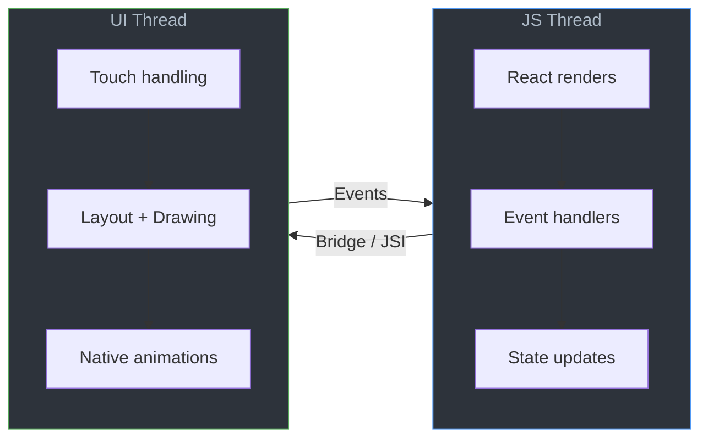
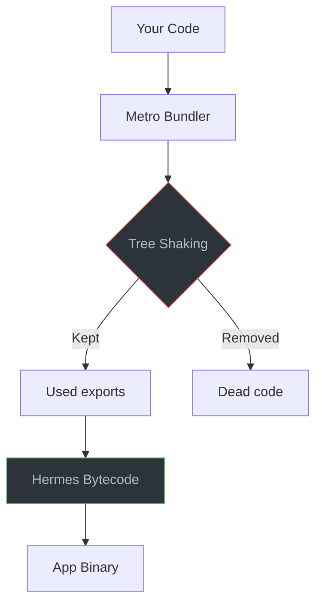

# Performance Engineering: Keeping Both Threads Happy

> The two-thread mental model, list optimization, re-render prevention, and profiling tools.

---

## Table of Contents

1. [The Two-Thread Mental Model](#1-the-two-thread-mental-model)
2. [Lists](#2-lists)
3. [Re-Renders](#3-re-renders)
4. [Images](#4-images)
5. [JS Engine](#5-js-engine)
6. [Performance Tools](#6-performance-tools)
7. [Bundle Size](#7-bundle-size)

---

## 1. The Two-Thread Mental Model

On the web, you have one main thread. Block it and everything freezes — animations, scrolling, input. React Native is different. Your app runs across **two primary threads**, and understanding the boundary between them is the single most important performance concept you will learn.

### The JS Thread

This is where your React code lives. Component renders, `useEffect` callbacks, event handlers, state updates — all JavaScript, all here. When you write `onPress={() => doSomething()}`, that function executes on the JS thread.

### The UI Thread (Main Thread)

This is the native side. It handles drawing pixels, processing touch gestures, and running native animations. On iOS it is the main thread; on Android it is the UI thread. Native scroll views, Reanimated worklets, and native driver animations all run here — independent of JavaScript.

### What Happens When One Blocks



**JS thread blocked → taps feel frozen.** The user presses a button but nothing happens for 200ms because your JS thread is busy computing something. Meanwhile, a Reanimated-driven animation may keep running smoothly because it lives on the UI thread. This is the disorienting experience where animations look fine but the app feels unresponsive.

**UI thread blocked → frame drops and jank.** This is rarer with typical React Native code, but it happens when you push expensive layout calculations or synchronous native module calls onto the main thread. You will see stuttering scrolls and choppy animations.

### The Practical Rule

Keep the JS thread free for interaction. Offload heavy work to:

- **`InteractionManager.runAfterInteractions()`** — delays non-urgent work until animations finish.
- **Reanimated worklets** — run animation logic directly on the UI thread.
- **Background threads** — use libraries like `react-native-multithreading` or move work to native modules.

```tsx
import { InteractionManager } from "react-native";

function onScreenFocus() {
  // Let the transition animation finish first
  InteractionManager.runAfterInteractions(() => {
    loadExpensiveData();
  });
}
```

> **Gotcha:** `console.log` in production slows the JS thread more than you think. Every log serializes data across the bridge. Strip logs in production builds or use `__DEV__` guards.

---

## 2. Lists

If your app shows a list of more than about 20 items, how you render that list will make or break your perceived performance. On the web, you might reach for `react-window` or `react-virtuoso`. In React Native, the built-in `FlatList` was the standard for years — but it has real limitations.

### FlatList vs FlashList

`FlatList` creates and destroys views as you scroll. `FlashList` from Shopify **recycles** them, reusing off-screen cells the way `UICollectionView` and `RecyclerView` work natively. The result is dramatically fewer blank cells and smoother scrolling.

```bash
npx expo install @shopify/flash-list
```

```tsx
import { FlashList } from "@shopify/flash-list";

function Feed({ posts }: { posts: Post[] }) {
  return (
    <FlashList
      data={posts}
      estimatedItemSize={120}       // Required — measure a typical row height
      keyExtractor={(item) => item.id}
      renderItem={({ item }) => <PostCard post={item} />}
    />
  );
}
```

### The Rules for Fast Lists

**1. Always provide `estimatedItemSize`.** FlashList uses this to pre-allocate recycled cells. Measure a representative row and provide the pixel height. Getting it wrong by 2x still beats not providing it.

**2. Memoize your row component.** If `renderItem` returns `<PostCard />`, make sure `PostCard` is wrapped in `React.memo`. Without this, every scroll event re-renders every visible row.

**3. Never use inline arrow functions in `renderItem`.**

```tsx
// Bad — creates a new function reference every render
renderItem={({ item }) => <PostCard post={item} onPress={() => handlePress(item.id)} />}

// Good — stable references
const handlePress = useCallback((id: string) => {
  navigation.navigate("Detail", { id });
}, [navigation]);

const renderPost = useCallback(({ item }: { item: Post }) => (
  <PostCard post={item} onPress={handlePress} />
), [handlePress]);

// ...
<FlashList renderItem={renderPost} />
```

**4. Use `keyExtractor` with stable, unique IDs.** Never use array index as the key for dynamic lists. When items shift position, index-based keys cause the wrong cell to be recycled with the wrong data.

**5. Flatten your row layout.** Deeply nested `View` hierarchies inside each row are expensive. Each native view is a real platform view — unlike the web where divs are cheap. Keep row components shallow.

> **Gotcha:** FlashList will warn you in development if your blank area (visible empty space while scrolling fast) exceeds a threshold. Pay attention to these warnings — they are actionable performance diagnostics.

---

## 3. Re-Renders

React's reconciliation model is the same in React Native as on the web. The difference is cost: on the web, a wasted re-render updates a virtual DOM and maybe touches some cheap DOM nodes. In React Native, a wasted re-render can trigger layout recalculations on real native views and cross the JS-to-native bridge unnecessarily.

### React.memo for Components

Wrap any component that receives stable-ish props and is rendered inside a list or a frequently-updating parent:

```tsx
const PostCard = React.memo(function PostCard({ post, onPress }: Props) {
  return (
    <Pressable onPress={() => onPress(post.id)}>
      <Text>{post.title}</Text>
    </Pressable>
  );
});
```

`React.memo` does a shallow comparison of props. If `post` is a new object reference every render (common when mapping over fresh API data), the memo is useless. Fix the data layer first.

### useCallback and useMemo

```tsx
// Stable function reference — only recreated when deps change
const handleLike = useCallback((postId: string) => {
  dispatch(likePost(postId));
}, [dispatch]);

// Expensive derived data — only recomputed when posts change
const sortedPosts = useMemo(
  () => posts.slice().sort((a, b) => b.score - a.score),
  [posts]
);
```

Do not wrap every function in `useCallback`. Only do it when the function is passed as a prop to a memoized child or used as a dependency in another hook.

### State Management Selectors

Global state is the biggest source of unnecessary re-renders. If you use Zustand, use selectors:

```tsx
// Bad — re-renders on ANY store change
const store = useStore();

// Good — re-renders only when `user.name` changes
const userName = useStore((s) => s.user.name);
```

With Jotai, the atom model gives you this granularity by default — each atom is its own subscription. This is why atom-based state is naturally performant for React Native.

### React Compiler

The React Compiler (formerly React Forget) auto-memoizes components and hooks at build time. When it stabilizes, it will eliminate most manual `useMemo`/`useCallback` usage. Until then, memoize the hot paths yourself — lists, modals, tabs — and do not bother memoizing leaf components that render once.

> **Gotcha:** Object and array literals in JSX are re-render killers: `style={{ flex: 1 }}` creates a new object every render. Move styles to `StyleSheet.create` outside the component.

---

## 4. Images

Images are the most common cause of memory issues and perceived slowness in React Native apps. On the web, browsers handle caching, lazy loading, and progressive decoding transparently. In React Native, you are responsible for all of it.

### Always Specify Dimensions

Unlike `` on the web, React Native's `<Image>` does not know the dimensions of a remote image before it loads. If you do not provide `width` and `height`, the layout engine cannot reserve space, and your UI will jump when images pop in.

```tsx
// Bad — layout shift guaranteed
<Image source={{ uri: url }} style={{ flex: 1 }} />

// Good — space reserved before load
<Image source={{ uri: url }} style={{ width: 200, height: 200 }} />
```

### Use expo-image

The built-in `Image` component has no disk caching for remote images and no placeholder support. Use `expo-image` instead:

```bash
npx expo install expo-image
```

```tsx
import { Image } from "expo-image";

<Image
  source={url}
  style={{ width: 200, height: 200 }}
  placeholder={{ blurhash: "LKO2?U%2Tw=w]~RBVZRi};RPxuwH" }}
  contentFit="cover"
  transition={200}
/>
```

`expo-image` gives you:

- **Disk and memory caching** — images load instantly on revisit.
- **Blurhash / Thumbhash placeholders** — a blurred preview renders instantly while the full image downloads. Generate blurhashes server-side and send them with your API response.
- **Animated format support** — GIF, APNG, WebP animations without extra libraries.
- **Transition animations** — smooth fade-in when the image loads.

### Memory Management

Large images consume real device memory. A 4000x3000 photo decoded into memory takes roughly 48 MB (4000 × 3000 × 4 bytes per pixel). Resize images server-side or use CDN transforms to serve images at the display size you actually need.

> **Gotcha:** Rendering 50 full-resolution user avatars in a chat list will eat hundreds of megabytes of RAM and crash low-end Android devices. Serve thumbnails.

---

## 5. JS Engine

React Native apps run JavaScript through an engine, and which engine you use has a massive impact on startup time, memory usage, and runtime performance.

### Hermes Is the Default

Since React Native 0.70, Hermes is the default JavaScript engine for both iOS and Android. It is purpose-built for React Native with three key advantages:

1. **Ahead-of-time compilation** — Hermes compiles your JS to bytecode at build time, not at runtime. This cuts app startup time significantly compared to JSC (JavaScriptCore).
2. **Lower memory footprint** — Hermes uses less memory, which matters on budget Android devices.
3. **Garbage collection optimized for mobile** — fewer long pauses during GC.

You do not need to configure anything — Expo and bare React Native projects use Hermes by default. Verify it is active:

```tsx
const isHermes = () => !!(global as any).HermesInternal;
console.log("Hermes enabled:", isHermes());
```

### Avoid Heavy JS Thread Work

Even with Hermes, the JS thread is single-threaded. Operations that block it:

- **`JSON.parse` on large payloads** — parsing a 2 MB JSON response blocks the JS thread for hundreds of milliseconds. Paginate your API responses. If you must handle large data, consider streaming JSON parsers or moving parsing to a native module.
- **Complex regex on large strings** — compile regexes outside render and test on bounded input.
- **Synchronous storage reads** — use async alternatives like `expo-secure-store` instead of synchronous MMKV reads in the render path.

```tsx
// Bad — blocks JS thread during render
function UserList() {
  const data = JSON.parse(someMassiveString); // freezes UI
  return <FlashList data={data} />;
}

// Good — parse asynchronously, show loading state
function UserList() {
  const [data, setData] = useState<User[]>([]);

  useEffect(() => {
    async function load() {
      const raw = await fetchUsers();
      setData(raw); // already parsed by fetch
    }
    load();
  }, []);

  if (!data.length) return <ActivityIndicator />;
  return <FlashList data={data} estimatedItemSize={72} renderItem={renderUser} />;
}
```

> **Gotcha:** The Hermes profiler outputs a Chrome-compatible `.cpuprofile` trace. Use it to find exactly which function is hogging the JS thread — it is far more useful than guessing.

---

## 6. Performance Tools

You cannot optimize what you cannot measure. Here are the tools that actually matter, in order of how often you will use them.

### React DevTools Profiler

Works identically to the web version. Connect via the standalone `react-devtools` package:

```bash
npx react-devtools
```

Enable "Highlight updates when components render" to visually see which components re-render on every interaction. Look for components that flash on every keystroke or scroll — those are your optimization targets.

### React Native DevTools (0.76+)

Starting with React Native 0.76, the new Chrome-based DevTools replace the old debugging experience. Access them from the in-app dev menu or by pressing `j` in the Metro terminal. These give you:

- JavaScript console
- Network inspector
- Component tree
- Performance timeline

This is the successor to Flipper, which is now legacy. If you are on 0.76 or later, do not bother setting up Flipper.

### Reassure — CI Performance Regression Testing

Reassure, from Callstack, measures render times in your test suite and fails CI if performance regresses:

```bash
npm install --save-dev reassure
```

```tsx
import { measurePerformance } from "reassure";

test("FeedScreen renders efficiently", async () => {
  await measurePerformance(<FeedScreen posts={mockPosts} />, {
    runs: 20,
  });
});
```

Reassure generates a markdown comparison report showing render count and duration changes between your baseline and current branch. It is the closest thing React Native has to web Lighthouse CI.

### Why Did You Render

This library patches `React.createElement` to log unnecessary re-renders with detailed reasons:

```bash
npm install @welldone-software/why-did-you-render --save-dev
```

Configure it in your app entry point (dev only) and it will tell you exactly which prop changed and whether the change was meaningful. Invaluable for hunting down "new object reference" re-render bugs.

> **Gotcha:** Never ship Why Did You Render or verbose profiling tools in production. Gate them behind `__DEV__` checks. They add significant overhead themselves.

---

## 7. Bundle Size

Every kilobyte in your JavaScript bundle is a kilobyte that must be parsed and compiled at startup. On a budget Android device, a 3 MB bundle can add a full second to cold start. Unlike the web, there is no CDN caching between app updates — the user downloads the entire bundle with each app update (or OTA update).

### Measure First

Use Metro's bundle visualizer to see exactly what is in your bundle:

```bash
# For Expo projects
npx expo export --platform ios --dump-sourcemap
npx react-native-bundle-visualizer
```

This generates a treemap showing every module and its size. You will almost always be surprised by what you find.

### Common Offenders

**moment.js** — 300 KB+ with locales. Replace with `date-fns` (tree-shakeable, import only what you use) or `dayjs` (2 KB).

**lodash** — Full import pulls in the entire library. Use individual imports:

```tsx
// Bad — imports all of lodash
import { debounce } from "lodash";

// Good — imports only debounce
import debounce from "lodash/debounce";

// Better — use the native equivalent when possible
// debounce is simple enough to write yourself
```

**Icon libraries** — `@expo/vector-icons` includes multiple icon sets. Import only the set you use:

```tsx
// Bad — may bundle all icon sets depending on your setup
import { Ionicons, MaterialIcons, FontAwesome } from "@expo/vector-icons";

// Good — import only what you need
import Ionicons from "@expo/vector-icons/Ionicons";
```

### __DEV__ Guards

Code wrapped in `__DEV__` checks is stripped entirely from production bundles by Metro:

```tsx
if (__DEV__) {
  // This entire block is removed in production
  const whyDidYouRender = require("@welldone-software/why-did-you-render");
  whyDidYouRender(React);
}
```

Use this pattern for debug tools, verbose logging, and development-only validation.

### Tree Shaking

Metro's tree shaking is improving but is not as mature as webpack or Rollup on the web. Help it by:

- Preferring libraries that export ES modules.
- Avoiding `require()` when `import` works.
- Checking if a library supports `sideEffects: false` in its `package.json`.



> **Gotcha:** `require()` calls with dynamic strings (`require(someVariable)`) cannot be tree-shaken or statically analyzed. Metro must include everything that could possibly match. Avoid dynamic requires entirely.

---