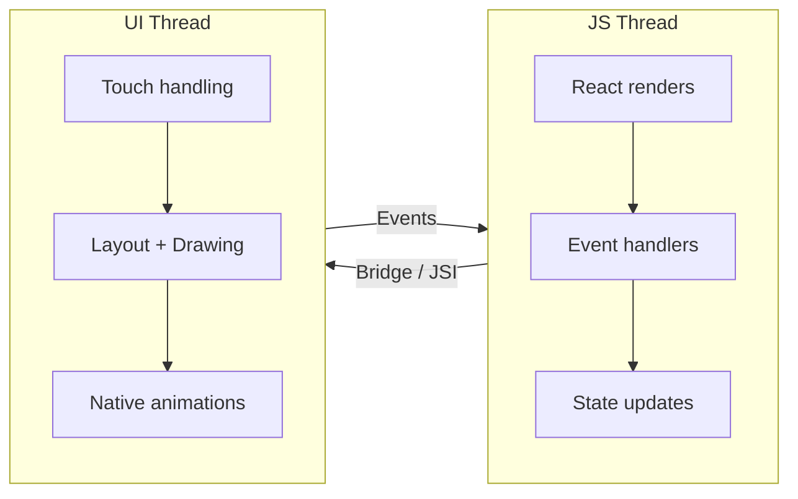
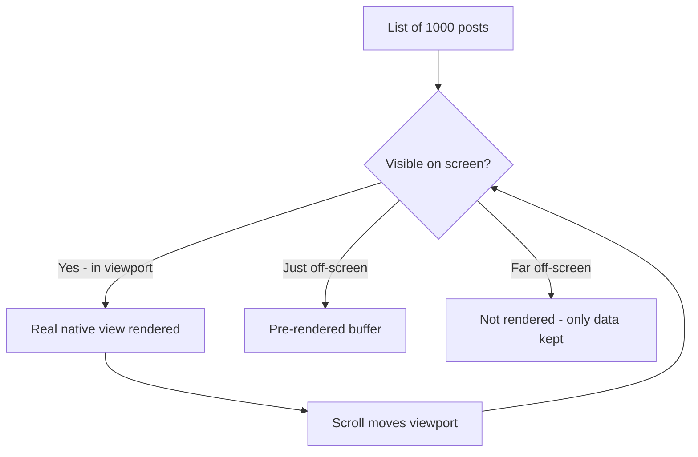
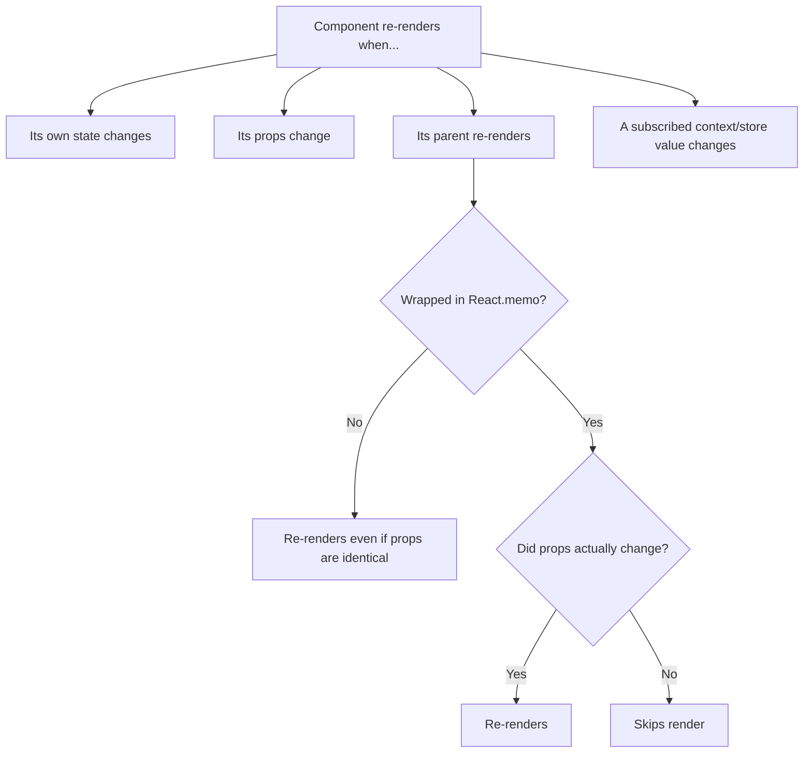
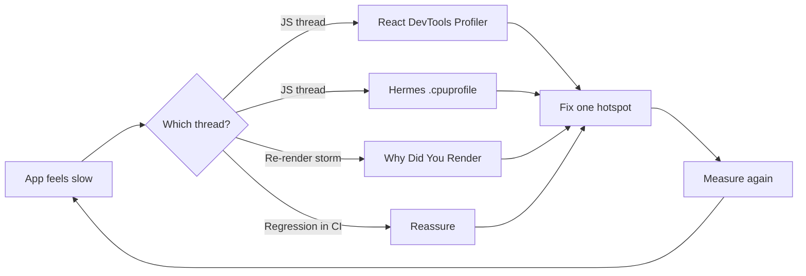
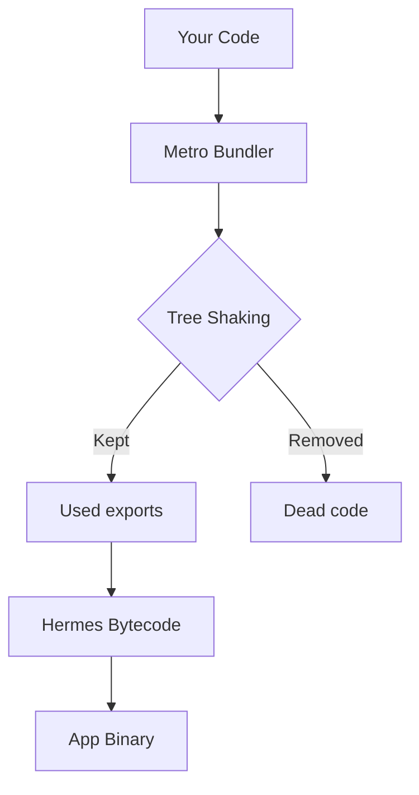

# Performance Engineering: Keeping Both Threads Happy

> The two-thread mental model, list optimization, re-render prevention, and profiling tools.

---

## Table of Contents

1. [The Two-Thread Mental Model](#1-the-two-thread-mental-model)
2. [Lists](#2-lists)
3. [Re-Renders](#3-re-renders)
4. [Images](#4-images)
5. [JS Engine](#5-js-engine)
6. [Performance Tools](#6-performance-tools)
7. [Bundle Size](#7-bundle-size)

---

## 1. The Two-Thread Mental Model

On the web, you have one main thread. Block it and everything freezes — animations, scrolling, input. React Native is different. Your app runs across **two primary threads**, and understanding the boundary between them is the single most important performance concept you will learn.

Think of it like a restaurant. The **JS thread** is the chef deciding *what* to cook (your logic, your React tree, what should be on screen). The **UI thread** is the waiter who actually carries plates to the table and responds to the customer (drawing pixels, handling taps). If the chef gets stuck deep-frying one giant order, the waiter can sometimes keep clearing tables — but no *new* dishes come out. If the waiter trips, even a fast chef can't get food to anyone. Both can stall, and they stall in different, recognizable ways.

> **Why two threads at all?** Touch handling and scrolling must feel instant — under ~16ms per frame to hit 60fps. JavaScript is single-threaded and unpredictable (you might run a sort, parse a payload, fire effects). By keeping the native UI work on its own thread, the OS can keep scrolling and gestures buttery even while your JS is momentarily busy. The web has no equivalent split, which is why a heavy `for` loop on the web freezes *everything*, including scroll.

### The JS Thread

This is where your React code lives. Component renders, `useEffect` callbacks, event handlers, state updates — all JavaScript, all here. When you write `onPress={() => doSomething()}`, that function executes on the JS thread.

It is **single-threaded**, exactly like the browser's main thread. There is one queue, and tasks run one at a time. If a render takes 300ms, nothing else on the JS thread — no other event handler, no timer, no promise resolution — can run during those 300ms.

### The UI Thread (Main Thread)

This is the native side. It handles drawing pixels, processing touch gestures, and running native animations. On iOS it is the main thread; on Android it is the UI thread. Native scroll views, Reanimated worklets, and native driver animations all run here — independent of JavaScript.

The crucial insight: a `ScrollView` scrolls *natively*. When you drag, the list moves on the UI thread without asking the JS thread for permission. That is why a list can keep scrolling smoothly even while your JS thread is jammed — but also why new rows may appear *blank*, because rendering their content needs the (busy) JS thread.

### What Happens When One Blocks



**JS thread blocked → taps feel frozen.** The user presses a button but nothing happens for 200ms because your JS thread is busy computing something. Meanwhile, a Reanimated-driven animation may keep running smoothly because it lives on the UI thread. This is the disorienting experience where animations look fine but the app feels unresponsive.

**UI thread blocked → frame drops and jank.** This is rarer with typical React Native code, but it happens when you push expensive layout calculations or synchronous native module calls onto the main thread. You will see stuttering scrolls and choppy animations.

| Symptom | Likely blocked thread | Typical cause |
| --- | --- | --- |
| Taps don't respond, but animations are smooth | JS thread | Heavy render, `JSON.parse`, big sort/filter |
| Scroll stutters, animation choppy | UI thread | Synchronous native call, expensive layout |
| List scrolls but rows show blank then fill in | JS thread (can't keep up) | Unmemoized rows, heavy `renderItem` |
| Everything frozen at once | Both (or a deadlock) | Synchronous bridge call from JS during heavy render |

### The Old Bridge vs The New Architecture

Historically, JS and native communicated over an asynchronous **bridge** that serialized every message to JSON — slow and a common bottleneck. The **New Architecture** (Fabric + JSI) lets JavaScript hold direct references to native objects and call them synchronously, removing most of that serialization cost. You don't need to master this yet, but know the trend: the boundary between the two threads is getting cheaper to cross, not the threads themselves getting merged.

### The Practical Rule

Keep the JS thread free for interaction. Offload heavy work to:

- **`InteractionManager.runAfterInteractions()`** — delays non-urgent work until animations finish.
- **Reanimated worklets** — run animation logic directly on the UI thread.
- **Background threads** — use libraries like `react-native-multithreading` or move work to native modules.

```tsx
import { InteractionManager } from "react-native";

function onScreenFocus() {
  // The screen-transition animation is playing. If we load heavy data NOW,
  // the JS thread jams and the push animation stutters. So we wait.
  InteractionManager.runAfterInteractions(() => {
    loadExpensiveData(); // runs once the transition animation finishes
  });
}
```

Another everyday pattern: break large synchronous work into chunks so the JS thread can "breathe" between them and still respond to taps.

```tsx
// Instead of processing 10,000 items in one blocking loop,
// yield to the event loop periodically so taps can be handled.
async function processInChunks<T>(items: T[], fn: (item: T) => void) {
  for (let i = 0; i < items.length; i++) {
    fn(items[i]);
    if (i % 100 === 0) {
      // Let the JS thread handle pending events (taps, gestures) before continuing
      await new Promise((resolve) => setTimeout(resolve, 0));
    }
  }
}
```

> **Gotcha:** `console.log` in production slows the JS thread more than you think. Every log serializes data across the bridge. Strip logs in production builds or use `__DEV__` guards.

> **Pro tip:** When something "feels slow," your first question should always be *which thread?* The fix is completely different. JS-thread jank = memoize / chunk / move work off the render path. UI-thread jank = stop doing synchronous native work, use the native animation driver.

---

## 2. Lists

If your app shows a list of more than about 20 items, how you render that list will make or break your perceived performance. On the web, you might reach for `react-window` or `react-virtuoso`. In React Native, the built-in `FlatList` was the standard for years — but it has real limitations.

### Why Not Just Render Everything?

On the web, a `div` is cheap and the browser is highly optimized at hiding off-screen content. In React Native, **every row is a real native view** — an actual `UIView` (iOS) or `View` (Android) allocated in memory. Render 1,000 rows and you allocate 1,000 native views plus all their children. That is how you exhaust memory and crash a budget Android phone.

The solution is **virtualization**: only the rows currently on (or near) the screen actually exist as native views. As you scroll, rows that leave the screen are torn down (FlatList) or *recycled* (FlashList).



### FlatList vs FlashList

`FlatList` creates and destroys views as you scroll. `FlashList` from Shopify **recycles** them, reusing off-screen cells the way `UICollectionView` and `RecyclerView` work natively. The result is dramatically fewer blank cells and smoother scrolling.

Recycling is the key mental model: instead of throwing away a row that scrolled off the top and building a brand-new one at the bottom, FlashList takes the *same* native view, swaps in new data, and repositions it. Allocating native views is expensive; reusing them is nearly free.

| Component | Strategy | When to use |
| --- | --- | --- |
| `ScrollView` | Renders ALL children at once, no virtualization | Small, fixed sets (a settings screen, < ~20 simple items) |
| `FlatList` | Virtualizes — mounts/unmounts views | Built-in, no dependency; fine for moderate lists |
| `FlashList` | Virtualizes **and recycles** views | Long, scrollable feeds; chat; anything where scroll perf matters |
| `SectionList` | Virtualized, with section headers | Grouped data (contacts A-Z, settings sections) |

> **Gotcha:** Never put a `FlatList`/`FlashList` inside a `ScrollView` of the same scroll direction. The outer `ScrollView` forces the inner list to render *all* its items (it gives the list infinite height), destroying virtualization entirely. Use the list's own `ListHeaderComponent` / `ListFooterComponent` props instead of wrapping it.

```bash
npx expo install @shopify/flash-list
```

```tsx
import { FlashList } from "@shopify/flash-list";

function Feed({ posts }: { posts: Post[] }) {
  return (
    <FlashList
      data={posts}
      estimatedItemSize={120}       // Required — measure a typical row height
      keyExtractor={(item) => item.id}
      renderItem={({ item }) => <PostCard post={item} />}
    />
  );
}
```

### The Rules for Fast Lists

**1. Always provide `estimatedItemSize`.** FlashList uses this to pre-allocate recycled cells. Measure a representative row and provide the pixel height. Getting it wrong by 2x still beats not providing it.

**2. Memoize your row component.** If `renderItem` returns `<PostCard />`, make sure `PostCard` is wrapped in `React.memo`. Without this, every scroll event re-renders every visible row.

**3. Never use inline arrow functions in `renderItem`.**

```tsx
// Bad — creates a new function reference every render
renderItem={({ item }) => <PostCard post={item} onPress={() => handlePress(item.id)} />}

// Good — stable references
const handlePress = useCallback((id: string) => {
  navigation.navigate("Detail", { id });
}, [navigation]);

const renderPost = useCallback(({ item }: { item: Post }) => (
  <PostCard post={item} onPress={handlePress} />
), [handlePress]);

// ...
<FlashList renderItem={renderPost} />
```

Why does this matter so much? A new arrow function is a *new reference* on every render. That new reference flows into `PostCard` as a prop, which defeats `React.memo` (the shallow prop comparison sees "different function") and re-renders every visible row on every scroll frame. Stable references are the whole game.

**4. Use `keyExtractor` with stable, unique IDs.** Never use array index as the key for dynamic lists. When items shift position, index-based keys cause the wrong cell to be recycled with the wrong data. This is the same `key` rule as React on the web — but in RN the cost of getting it wrong is visible: avatars and text from one row "smear" onto another during fast scrolls.

**5. Flatten your row layout.** Deeply nested `View` hierarchies inside each row are expensive. Each native view is a real platform view — unlike the web where divs are cheap. Keep row components shallow.

**6. Reset recycled state with the right hooks.** Because FlashList reuses a view, local state inside a row can "leak" from the previous item. If a row holds local state (e.g. an expanded/collapsed toggle), key it to the item id or use FlashList's `getItemType` so different-shaped rows don't recycle into each other.

```tsx
<FlashList
  data={feed}
  estimatedItemSize={120}
  // Tell FlashList these rows are structurally different so it recycles
  // a "text" cell only into another "text" cell, not into an "ad" cell.
  getItemType={(item) => item.type} // "text" | "image" | "ad"
  renderItem={({ item }) => <FeedRow item={item} />}
/>
```

> **Gotcha:** FlashList will warn you in development if your blank area (visible empty space while scrolling fast) exceeds a threshold. Pay attention to these warnings — they are actionable performance diagnostics, usually pointing at a wrong `estimatedItemSize` or an unmemoized row.

---

## 3. Re-Renders

React's reconciliation model is the same in React Native as on the web. The difference is cost: on the web, a wasted re-render updates a virtual DOM and maybe touches some cheap DOM nodes. In React Native, a wasted re-render can trigger layout recalculations on real native views and cross the JS-to-native bridge unnecessarily.

A re-render in React means: React re-runs your component function to produce a new element tree, then diffs it against the old one. The re-run itself is JS-thread work; any resulting changes become native view updates. Most performance problems here are not *one* expensive render — they are *hundreds* of cheap renders firing when they shouldn't, each one nibbling at your frame budget.

### Why Components Re-Render



The one beginners miss most: **a parent re-rendering re-renders all its children by default**, even children whose props didn't change. `React.memo` is how you opt a child out of that.

### React.memo for Components

Wrap any component that receives stable-ish props and is rendered inside a list or a frequently-updating parent:

```tsx
const PostCard = React.memo(function PostCard({ post, onPress }: Props) {
  return (
    <Pressable onPress={() => onPress(post.id)}>
      <Text>{post.title}</Text>
    </Pressable>
  );
});
```

`React.memo` does a shallow comparison of props. If `post` is a new object reference every render (common when mapping over fresh API data), the memo is useless. Fix the data layer first. "Shallow" means it compares each prop with `===` — same string, same number, *same object reference*. Two objects with identical contents but different references are "not equal" to a shallow check.

### useCallback and useMemo

```tsx
// Stable function reference — only recreated when deps change
const handleLike = useCallback((postId: string) => {
  dispatch(likePost(postId));
}, [dispatch]);

// Expensive derived data — only recomputed when posts change
const sortedPosts = useMemo(
  () => posts.slice().sort((a, b) => b.score - a.score),
  [posts]
);
```

The two hooks solve the same underlying problem — *reference stability* — for two kinds of values:

| Hook | Returns | Use it when |
| --- | --- | --- |
| `useCallback` | A stable **function** reference | The function is passed as a prop to a memoized child, or is a dependency of another hook |
| `useMemo` | A stable **value** (object/array/computed result) | The value is expensive to compute, OR it's an object/array passed to a memoized child |
| `React.memo` | A memoized **component** | A child re-renders too often because its parent re-renders |

Do not wrap every function in `useCallback`. Only do it when the function is passed as a prop to a memoized child or used as a dependency in another hook. Memoization is not free — it costs memory and a dependency comparison on every render. Memoizing a leaf component that renders once is pure overhead.

### State Management Selectors

Global state is the biggest source of unnecessary re-renders. If you use Zustand, use selectors:

```tsx
// Bad — re-renders on ANY store change
const store = useStore();

// Good — re-renders only when `user.name` changes
const userName = useStore((s) => s.user.name);
```

The mechanism: a selector tells the store library "I only care about *this* slice." The component re-subscribes to just that value, so a change to some unrelated part of the store (say, a `theme` toggle) won't wake it up. Subscribing to the whole store is like subscribing to every notification on your phone when you only wanted texts from one person.

With Jotai, the atom model gives you this granularity by default — each atom is its own subscription. This is why atom-based state is naturally performant for React Native.

```tsx
// Zustand: select only what you read, and select primitives where possible
const name = useStore((s) => s.user.name);     // re-renders only on name change
const count = useStore((s) => s.cart.length);  // re-renders only on length change

// Selecting an object recomputes a new reference each call — pair with
// a shallow-equality comparator so it doesn't re-render every store update.
import { useShallow } from "zustand/react/shallow";
const { name, avatar } = useStore(useShallow((s) => ({ name: s.user.name, avatar: s.user.avatar })));
```

### React Compiler

The React Compiler (formerly React Forget) auto-memoizes components and hooks at build time. When it stabilizes, it will eliminate most manual `useMemo`/`useCallback` usage. Until then, memoize the hot paths yourself — lists, modals, tabs — and do not bother memoizing leaf components that render once.

Mentally: the compiler does what a disciplined developer would do by hand — wrap values and components in memoization so references stay stable — but it does it everywhere, automatically, without you cluttering the code. It does **not** change *which* threads do work or fix a bad data layer; it just removes the manual `useMemo`/`useCallback` bookkeeping.

> **Gotcha:** Object and array literals in JSX are re-render killers: `style={{ flex: 1 }}` creates a new object every render. Move styles to `StyleSheet.create` outside the component. The same applies to `data={[...]}` and `options={{ ... }}` passed to memoized children — a fresh literal each render silently defeats the memo.

> **Pro tip:** Before reaching for memoization, ask *"is this component even rendering more than necessary?"* Use the React DevTools "Highlight updates" feature (see section 6) to confirm there's a real problem. Memoizing things that don't re-render is wasted effort and added complexity.

---

## 4. Images

Images are the most common cause of memory issues and perceived slowness in React Native apps. On the web, browsers handle caching, lazy loading, and progressive decoding transparently. In React Native, you are responsible for all of it.

Here's the mental model that explains *why*: an image on disk or on the network is **compressed** (a 200 KB JPEG). To draw it, the device must **decode** it into raw pixels in memory. That decoded form is enormous and uncompressed. So image cost is two separate problems — download/cache cost (network + disk) and decode cost (RAM + UI-thread time). The web's browser handles both for you. React Native does not, by default.

### Always Specify Dimensions

Unlike `` on the web, React Native's `<Image>` does not know the dimensions of a remote image before it loads. If you do not provide `width` and `height`, the layout engine cannot reserve space, and your UI will jump when images pop in.

```tsx
// Bad — layout shift guaranteed
<Image source={{ uri: url }} style={{ flex: 1 }} />

// Good — space reserved before load
<Image source={{ uri: url }} style={{ width: 200, height: 200 }} />
```

This is the RN equivalent of the web's Cumulative Layout Shift problem — reserving the box up front keeps content from jumping as images arrive.

### Use expo-image

The built-in `Image` component has no disk caching for remote images and no placeholder support. Use `expo-image` instead:

```bash
npx expo install expo-image
```

```tsx
import { Image } from "expo-image";

<Image
  source={url}
  style={{ width: 200, height: 200 }}
  placeholder={{ blurhash: "LKO2?U%2Tw=w]~RBVZRi};RPxuwH" }}
  contentFit="cover"
  transition={200}
/>
```

`expo-image` gives you:

- **Disk and memory caching** — images load instantly on revisit.
- **Blurhash / Thumbhash placeholders** — a blurred preview renders instantly while the full image downloads. Generate blurhashes server-side and send them with your API response.
- **Animated format support** — GIF, APNG, WebP animations without extra libraries.
- **Transition animations** — smooth fade-in when the image loads.

A **blurhash** is a tiny (~20-30 character) string that encodes a blurred preview of the image. It costs almost nothing to send in your API JSON and renders an instant, recognizable color smear while the real image downloads — eliminating the "gray box then pop" effect. This is the trick Instagram, Signal, and Unsplash use.

| Need | Built-in `Image` | `expo-image` |
| --- | --- | --- |
| Disk cache for remote images | No | Yes |
| Placeholder (blurhash/thumbhash) | No | Yes |
| Fade-in transition | Manual | Built-in (`transition`) |
| Animated WebP / AVIF | Limited | Yes |
| `contentFit` (object-fit equivalent) | `resizeMode` | `contentFit` |

### Memory Management

Large images consume real device memory. A 4000x3000 photo decoded into memory takes roughly 48 MB (4000 × 3000 × 4 bytes per pixel). Resize images server-side or use CDN transforms to serve images at the display size you actually need.

That math is worth internalizing: memory cost is `width × height × 4 bytes`, and it depends on the image's **pixel dimensions, not its file size**. A heavily-compressed 200 KB JPEG that happens to be 4000×3000 still explodes to ~48 MB once decoded. Ten of them on screen = ~480 MB = a crash on a low-end device.

```tsx
// Request the size you'll actually display, via a CDN transform.
// Serving a 200x200 avatar means ~0.16 MB decoded instead of ~48 MB.
const avatarUrl = `https://cdn.example.com/u/${id}.jpg?w=200&h=200&fit=cover`;

<Image source={avatarUrl} style={{ width: 100, height: 100 }} />;
```

> **Gotcha:** Rendering 50 full-resolution user avatars in a chat list will eat hundreds of megabytes of RAM and crash low-end Android devices. Serve thumbnails.

> **Pro tip:** `style` dimensions control *display* size, not *decode* size. A `style={{ width: 100 }}` on a 4000px source still decodes the full 4000px into memory. The display style does NOT save you RAM — only serving a smaller source (CDN/server resize) does.

---

## 5. JS Engine

React Native apps run JavaScript through an engine, and which engine you use has a massive impact on startup time, memory usage, and runtime performance.

A JavaScript engine is the program that actually *runs* your JS — the same role V8 plays in Chrome. In React Native, the two contenders are **Hermes** (built by Meta specifically for RN) and **JSC** (JavaScriptCore, the engine inside Safari, used by RN historically).

### Hermes Is the Default

Since React Native 0.70, Hermes is the default JavaScript engine for both iOS and Android. It is purpose-built for React Native with three key advantages:

1. **Ahead-of-time compilation** — Hermes compiles your JS to bytecode at build time, not at runtime. This cuts app startup time significantly compared to JSC (JavaScriptCore).
2. **Lower memory footprint** — Hermes uses less memory, which matters on budget Android devices.
3. **Garbage collection optimized for mobile** — fewer long pauses during GC.

The AOT point deserves unpacking. A typical engine receives your raw JS text at startup, then has to parse and compile it *on the device, every launch* — slow, especially on cheap hardware. Hermes does that compilation **once, at build time**, shipping pre-compiled bytecode in the app. The device just loads and runs it. That is the bulk of the startup win.

| | Hermes | JSC (JavaScriptCore) |
| --- | --- | --- |
| Startup time | Faster (ships precompiled bytecode) | Slower (parses + compiles JS on launch) |
| Memory usage | Lower | Higher |
| Peak throughput on long-running JS | Good | Sometimes higher (JIT) |
| Default since RN 0.70 | Yes | Legacy / opt-in |
| Best for | Most apps, esp. budget Android | Edge cases needing JIT-heavy compute |

You do not need to configure anything — Expo and bare React Native projects use Hermes by default. Verify it is active:

```tsx
const isHermes = () => !!(global as any).HermesInternal;
console.log("Hermes enabled:", isHermes());
```

### Avoid Heavy JS Thread Work

Even with Hermes, the JS thread is single-threaded. Operations that block it:

- **`JSON.parse` on large payloads** — parsing a 2 MB JSON response blocks the JS thread for hundreds of milliseconds. Paginate your API responses. If you must handle large data, consider streaming JSON parsers or moving parsing to a native module.
- **Complex regex on large strings** — compile regexes outside render and test on bounded input.
- **Synchronous storage reads** — use async alternatives like `expo-secure-store` instead of synchronous MMKV reads in the render path.

Remember section 1: a faster engine does not make the thread less single-threaded. Hermes runs your blocking sort faster, but it still blocks. Engine choice changes the *constant factor*; it does not change *which thread* the work runs on.

```tsx
// Bad — blocks JS thread during render
function UserList() {
  const data = JSON.parse(someMassiveString); // freezes UI
  return <FlashList data={data} />;
}

// Good — parse asynchronously, show loading state
function UserList() {
  const [data, setData] = useState<User[]>([]);

  useEffect(() => {
    async function load() {
      const raw = await fetchUsers();
      setData(raw); // already parsed by fetch
    }
    load();
  }, []);

  if (!data.length) return <ActivityIndicator />;
  return <FlashList data={data} estimatedItemSize={72} renderItem={renderUser} />;
}
```

> **Gotcha:** The Hermes profiler outputs a Chrome-compatible `.cpuprofile` trace. Use it to find exactly which function is hogging the JS thread — it is far more useful than guessing.

> **Pro tip:** If your app feels slow *to launch* specifically (cold start), suspect three things: Hermes not enabled, a huge JS bundle to load (section 7), or heavy synchronous work running at module top-level / in your root component's first render. Move that work behind `InteractionManager` or into an effect.

---

## 6. Performance Tools

You cannot optimize what you cannot measure. Here are the tools that actually matter, in order of how often you will use them.

A good loop to internalize: **measure → find the hotspot → fix one thing → measure again.** Guessing is the single most common way developers waste hours optimizing code that was never the bottleneck. Every tool below exists to replace a guess with a fact.



### React DevTools Profiler

Works identically to the web version. Connect via the standalone `react-devtools` package:

```bash
npx react-devtools
```

Enable "Highlight updates when components render" to visually see which components re-render on every interaction. Look for components that flash on every keystroke or scroll — those are your optimization targets. This is your fastest first check for the section 3 problem: if the whole screen flashes when you type one character, you have a re-render storm.

### React Native DevTools (0.76+)

Starting with React Native 0.76, the new Chrome-based DevTools replace the old debugging experience. Access them from the in-app dev menu or by pressing `j` in the Metro terminal. These give you:

- JavaScript console
- Network inspector
- Component tree
- Performance timeline

This is the successor to Flipper, which is now legacy. If you are on 0.76 or later, do not bother setting up Flipper.

### Reassure — CI Performance Regression Testing

Reassure, from Callstack, measures render times in your test suite and fails CI if performance regresses:

```bash
npm install --save-dev reassure
```

```tsx
import { measurePerformance } from "reassure";

test("FeedScreen renders efficiently", async () => {
  await measurePerformance(<FeedScreen posts={mockPosts} />, {
    runs: 20,
  });
});
```

Reassure generates a markdown comparison report showing render count and duration changes between your baseline and current branch. It is the closest thing React Native has to web Lighthouse CI. The value is *catching regressions automatically* — once you've optimized a screen, Reassure fails the PR if a future change quietly re-introduces the slowness.

### Why Did You Render

This library patches `React.createElement` to log unnecessary re-renders with detailed reasons:

```bash
npm install @welldone-software/why-did-you-render --save-dev
```

Configure it in your app entry point (dev only) and it will tell you exactly which prop changed and whether the change was meaningful. Invaluable for hunting down "new object reference" re-render bugs — it will literally print "props.style changed: {} !== {}" so you can see a fresh literal defeating a memo.

```tsx
// index.js / App entry — DEV ONLY
if (__DEV__) {
  const whyDidYouRender = require("@welldone-software/why-did-you-render");
  whyDidYouRender(require("react"), { trackAllPureComponents: true });
}
```

| Tool | Answers the question | Use during |
| --- | --- | --- |
| React DevTools Profiler | "Which components render, and how often?" | Active debugging |
| Why Did You Render | "*Why* did this component re-render?" | Hunting re-render bugs |
| Hermes `.cpuprofile` | "Which function is eating the JS thread?" | CPU/jank investigation |
| Reassure | "Did this PR make things slower?" | CI / every PR |

> **Gotcha:** Never ship Why Did You Render or verbose profiling tools in production. Gate them behind `__DEV__` checks. They add significant overhead themselves.

---

## 7. Bundle Size

Every kilobyte in your JavaScript bundle is a kilobyte that must be parsed and compiled at startup. On a budget Android device, a 3 MB bundle can add a full second to cold start. Unlike the web, there is no CDN caching between app updates — the user downloads the entire bundle with each app update (or OTA update).

There is a second, web-specific contrast: on the web, code-splitting lets you ship a tiny initial bundle and lazy-load routes on demand. A mobile app is a *single shipped binary* — historically the whole JS bundle loads at launch. So unused code isn't just a download cost; it is parse/compile time on every cold start. Trimming the bundle directly buys you a faster launch.

### Measure First

Use Metro's bundle visualizer to see exactly what is in your bundle:

```bash
# For Expo projects
npx expo export --platform ios --dump-sourcemap
npx react-native-bundle-visualizer
```

This generates a treemap showing every module and its size. You will almost always be surprised by what you find — usually one or two dependencies dwarf everything else. Fix those first; don't hand-optimize a 4 KB utility while a 300 KB date library sits untouched.

### Common Offenders

**moment.js** — 300 KB+ with locales. Replace with `date-fns` (tree-shakeable, import only what you use) or `dayjs` (2 KB).

**lodash** — Full import pulls in the entire library. Use individual imports:

```tsx
// Bad — imports all of lodash
import { debounce } from "lodash";

// Good — imports only debounce
import debounce from "lodash/debounce";

// Better — use the native equivalent when possible
// debounce is simple enough to write yourself
```

**Icon libraries** — `@expo/vector-icons` includes multiple icon sets. Import only the set you use:

```tsx
// Bad — may bundle all icon sets depending on your setup
import { Ionicons, MaterialIcons, FontAwesome } from "@expo/vector-icons";

// Good — import only what you need
import Ionicons from "@expo/vector-icons/Ionicons";
```

| Offender | Approx cost | Lighter swap |
| --- | --- | --- |
| `moment` | 300 KB+ | `date-fns` (per-function) or `dayjs` (~2 KB) |
| `lodash` (full) | 70 KB+ | `lodash/<fn>` deep imports, or hand-write small utils |
| Multiple icon sets | tens of KB each | Import one set deeply (`@expo/vector-icons/Ionicons`) |
| Whole-library UI kits | varies | Import individual components if supported |

### __DEV__ Guards

Code wrapped in `__DEV__` checks is stripped entirely from production bundles by Metro:

```tsx
if (__DEV__) {
  // This entire block is removed in production
  const whyDidYouRender = require("@welldone-software/why-did-you-render");
  whyDidYouRender(React);
}
```

`__DEV__` is a global boolean that Metro replaces with a literal `true`/`false` at build time. In production it becomes `if (false) { ... }`, and the dead branch is dropped entirely — so debug-only dependencies never reach your users. Use this pattern for debug tools, verbose logging, and development-only validation.

### Tree Shaking

Metro's tree shaking is improving but is not as mature as webpack or Rollup on the web. Help it by:

- Preferring libraries that export ES modules.
- Avoiding `require()` when `import` works.
- Checking if a library supports `sideEffects: false` in its `package.json`.

Tree shaking is the bundler's "dead code elimination": if you import only `debounce`, a good bundler drops the rest of the library. It only works on **static** `import`/`export` it can analyze at build time — which is exactly why dynamic `require()` defeats it.



> **Gotcha:** `require()` calls with dynamic strings (`require(someVariable)`) cannot be tree-shaken or statically analyzed. Metro must include everything that could possibly match. Avoid dynamic requires entirely.

> **Pro tip:** Bundle size and startup performance are tightly linked (section 5). After trimming a big dependency, re-measure cold start, not just bundle bytes — that's the metric your users actually feel.

---