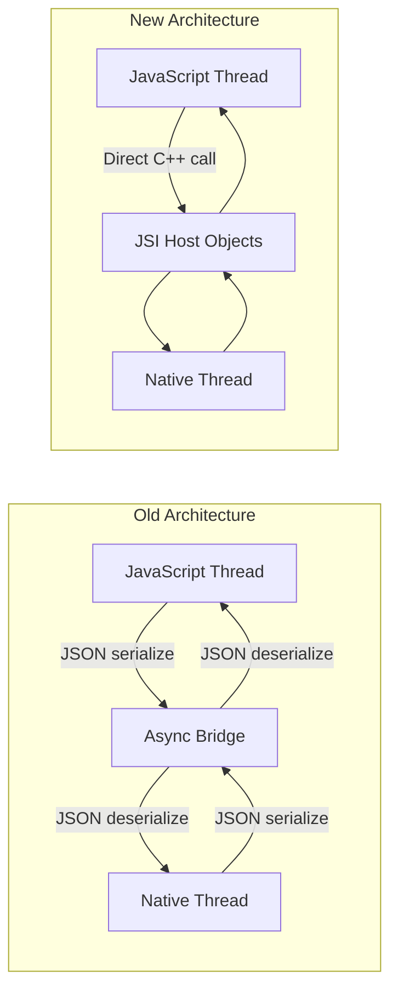
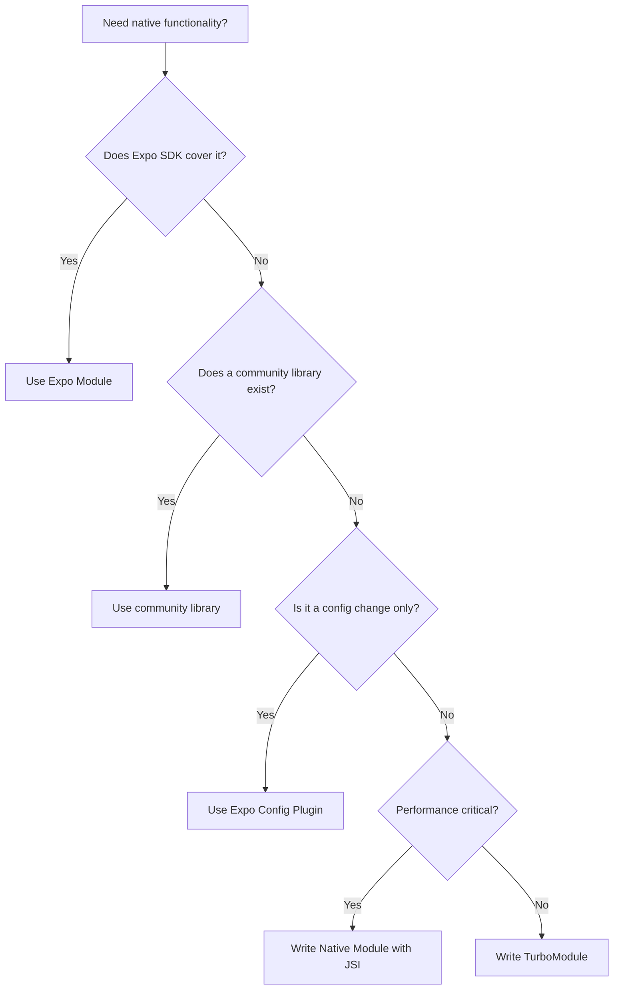
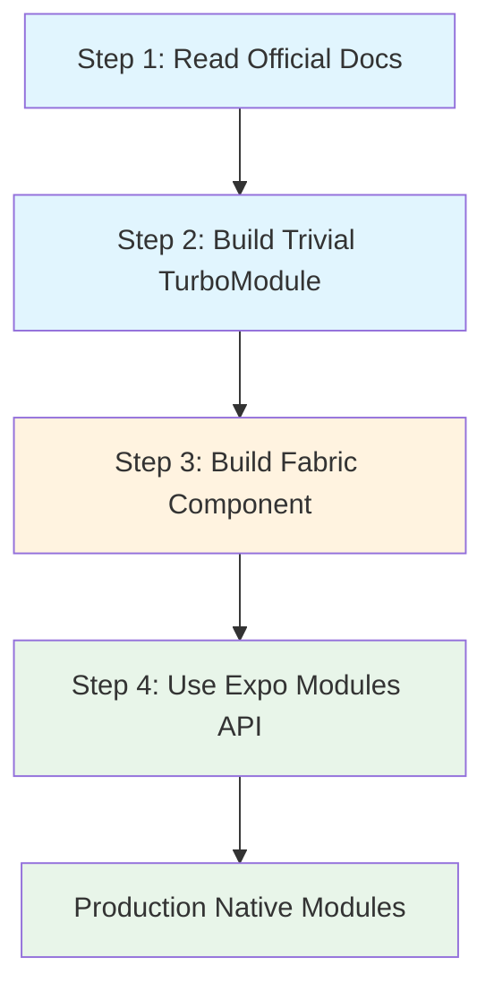

# Native Modules and the New Architecture

> JSI, Fabric, TurboModules, and Codegen — what they are and when you need to write your own.

---

## Table of Contents

1. [The New Architecture](#1-the-new-architecture)
2. [When to Write a Native Module](#2-when-to-write-a-native-module)
3. [Skills Needed](#3-skills-needed)
4. [Recommended Path](#4-recommended-path)

---

## 1. The New Architecture

### The Old Bridge Problem

To understand *why* React Native rebuilt its internals, you need to understand what was slow.

In the old architecture, JavaScript and native code lived in two separate worlds. Every time JS wanted to tell native "render this view" or "call this Bluetooth function," the request was serialized to JSON, dropped onto an asynchronous message queue (the "bridge"), and deserialized on the other side. The response traveled back the same way.

Think of it like two people in separate rooms communicating by sliding notes under a door. It works, but it is slow, asynchronous by default, and you cannot have a real-time conversation.

This caused real problems: dropped frames during fast scrolling, visible delays when measuring layouts, and the inability to do synchronous operations that the native platform expects.



### JSI: JavaScript Interface

JSI is the foundation of everything new. It is a thin C++ layer that lets JavaScript hold direct references to C++ objects — and call methods on them synchronously. No serialization. No bridge. No queue.

On the web, this is similar to how your JS code can call `document.createElement()` and get back an actual DOM node reference, not a serialized copy. JSI gives React Native the same kind of direct binding.

```tsx
// Conceptual: what JSI enables under the hood
// JS can now hold a direct reference to a native object
const nativeModule = global.__turboModuleProxy('MyModule');
// This call goes directly to C++ -> Swift/Kotlin, no bridge
const result = nativeModule.computeExpensiveThing(data);
```

You will rarely write JSI code directly. But every new feature — TurboModules, Fabric, Codegen — is built on top of it.

### TurboModules: Native Modules, Rebuilt

TurboModules replace the old `NativeModules` system. Two key improvements:

**Lazy loading.** Old native modules were all initialized at app startup, whether you used them or not. TurboModules load on first access. If your app has 40 native modules but a given screen only uses 3, you only pay for 3.

**Type safety.** Each TurboModule is defined by a TypeScript spec file. Codegen (more on that below) reads this spec and generates typed C++ interfaces. If your JS calls a method with the wrong argument types, you get a build-time error instead of a mysterious runtime crash.

```tsx
// src/NativeMyModule.ts — a TurboModule spec file
import type { TurboModule } from 'react-native';
import { TurboModuleRegistry } from 'react-native';

export interface Spec extends TurboModule {
  multiply(a: number, b: number): number;
  getDeviceName(): Promise<string>;
}

export default TurboModuleRegistry.getEnforcing<Spec>('MyModule');
```

### Fabric: The New Renderer

Fabric replaces the old rendering system (called "Paper" retroactively). The biggest wins:

- **Synchronous layout.** On the old architecture, measuring a view required an async round trip. Fabric can measure synchronously, which eliminates the layout flicker you sometimes saw on first render.
- **Concurrent React support.** Fabric is designed to work with React 18 features like `useTransition` and `Suspense`. The old renderer could not support these because it was fundamentally asynchronous.
- **Multi-threaded rendering.** Fabric can create and update shadow trees on any thread, not just the dedicated "shadow thread" from the old architecture.

On the web, this is analogous to how React 18's concurrent renderer replaced the old synchronous `ReactDOM.render`. The underlying engine had to change for new features to work.

### Codegen: The Glue Generator

Codegen is the build-time tool that reads your TypeScript spec files and generates the C++ scaffolding that connects JS to native code. You write a `.ts` spec, and Codegen produces:

- C++ header files with the correct method signatures
- Platform-specific adapter code for iOS (Objective-C++) and Android (JNI)
- Type validation that catches mismatches at compile time

This is the piece that makes the new architecture practical. Without it, you would be hand-writing C++ bridge code for every module — which is exactly what early adopters had to do, and it was miserable.

> **Key fact:** The New Architecture is the default starting with Expo SDK 52 and React Native 0.76+. If you start a new project today, you are already on it. You do not need to opt in.

---

## 2. When to Write a Native Module

### The 95% Rule

Here is the honest truth: **most React Native developers never need to write a native module.** The ecosystem covers the vast majority of use cases:

- **Expo Modules** handle camera, file system, notifications, haptics, sensors, secure storage, and dozens more.
- **Community libraries** like `react-native-reanimated`, `react-native-mmkv`, `react-native-ble-plx`, and `react-native-vision-camera` cover performance-critical domains.
- **Expo Config Plugins** let you modify native project configuration without writing native code.

Before you write a single line of Swift or Kotlin, search the Expo SDK docs and the React Native Directory (reactnative.directory). Seriously. The cost of maintaining your own native module across iOS and Android versions, React Native upgrades, and Expo SDK bumps is much higher than people expect.

### The 5% Where You Must Go Native

There are legitimate cases where you need to write your own:

**1. Proprietary SDKs.** Your company has an internal C++ library for fraud detection, or a vendor gives you a closed-source `.xcframework` and `.aar`. No community wrapper exists, and you need to expose it to JS.

**2. Hot-path native code.** You are building real-time audio DSP, custom image processing pipelines, or BLE communication with a specific protocol. JavaScript, even with Hermes, cannot meet the latency or throughput requirements.

**3. Custom native UI.** You need to wrap a platform-specific UI component — a native map with custom overlays, a hardware-accelerated video player, or a platform widget that has no React Native equivalent.



### A Real Example: When You Cross the Line

Say you are integrating a proprietary audio processing SDK that your hardware team built in C++. Here is what the integration looks like at a high level:

```tsx
// Step 1: Define the TypeScript spec
// src/NativeAudioProcessor.ts
import type { TurboModule } from 'react-native';
import { TurboModuleRegistry } from 'react-native';

export interface Spec extends TurboModule {
  initialize(sampleRate: number, bufferSize: number): boolean;
  processBuffer(inputBuffer: number[]): number[];
  setParameter(name: string, value: number): void;
  dispose(): void;
}

export default TurboModuleRegistry.getEnforcing<Spec>(
  'AudioProcessor'
);
```

```tsx
// Step 2: Use it in your component
import AudioProcessor from './NativeAudioProcessor';

function AudioScreen() {
  useEffect(() => {
    const ok = AudioProcessor.initialize(44100, 512);
    if (!ok) console.error('Failed to initialize audio processor');
    return () => AudioProcessor.dispose();
  }, []);

  // ...
}
```

The native implementations (Swift for iOS, Kotlin for Android) then link against your C++ library and implement the spec methods. Codegen handles the glue between the spec and your native code.

> **Common mistake:** Reaching for a native module when a JavaScript solution works fine. `react-native-reanimated` runs animations on the UI thread without you writing native code. `expo-camera` wraps the full camera API. Check what exists before committing to native maintenance burden.

---

## 3. Skills Needed

### The Uncomfortable Truth

Writing native modules means writing native code. There is no way around it. You need to be competent in the platform languages, build systems, and IDEs. Here is what that actually means.

### iOS

- **Swift** (or Objective-C for older codebases). You need to understand value types vs reference types, optionals, closures, and the concurrency model (`async/await`, actors). The Expo Modules API uses Swift, so this is the more practical choice.
- **UIKit** for wrapping existing native views. SwiftUI knowledge helps for newer components, but most React Native native view wrappers still use UIKit under the hood.
- **Xcode.** You will debug native crashes in Xcode. You will read stack traces in Xcode. You will deal with signing, entitlements, and capabilities in Xcode. There is no shortcut.
- **CocoaPods and/or SPM.** React Native uses CocoaPods for dependency management on iOS. You need to understand Podfiles, podspecs, and how linking works.

```bash
# Typical iOS native module workflow
cd ios
pod install
open MyApp.xcworkspace  # Not .xcodeproj!

# Common gotcha: if you edit the Podfile, always run:
cd ios && pod install && cd ..
# NOT pod update (which upgrades all dependencies)
```

### Android

- **Kotlin** (or Java for legacy code). Kotlin is the default for new Android development and what the Expo Modules API uses. You need to understand coroutines, extension functions, null safety, and the Android lifecycle.
- **Android SDK.** Activities, Fragments, Views, the Context system, permissions model, intents. Even if you are wrapping a simple SDK, you will interact with these.
- **Gradle.** Android's build system. You will edit `build.gradle` files, manage dependencies, and troubleshoot build failures that produce 200-line error messages. This is the part most web developers find most painful.
- **Android Studio.** Like Xcode for Android. You will debug native crashes here, inspect view hierarchies, and profile performance.

```bash
# Typical Android native module workflow
# Open Android Studio with:
# File -> Open -> select android/ directory

# Common gotcha: Gradle caches aggressively. When things break:
cd android && ./gradlew clean && cd ..

# Nuclear option when Gradle is truly stuck:
cd android
./gradlew clean
rm -rf .gradle
rm -rf app/build
cd ..
```

### C++ Basics for JSI

If you are writing a JSI module (direct C++ binding for maximum performance), you need:

- Basic C++ syntax (headers, source files, namespaces)
- Smart pointers (`std::shared_ptr`, `std::unique_ptr`)
- Understanding of the `jsi::Runtime` API
- CMake for cross-platform builds

Most developers do not need this. TurboModules with Swift/Kotlin are sufficient for 99% of native module work. JSI-level C++ is for when you are building something like a database engine (`react-native-mmkv`) or an animation runtime (`react-native-reanimated`).

> **Honest assessment:** If you have never opened Xcode or Android Studio, budget 2-4 weeks of learning before attempting your first native module. The React Native side is the easy part. The platform-specific tooling, debugging, and build systems are where the real complexity lives.

### The Expo Modules API Advantage

The Expo Modules API significantly lowers the barrier. Instead of implementing raw TurboModule interfaces in Objective-C++ and Java/JNI, you write Swift and Kotlin with a clean, declarative API:

```tsx
// ios/MyModule.swift — using Expo Modules API
import ExpoModulesCore

public class MyModule: Module {
  public func definition() -> ModuleDefinition {
    Name("MyModule")

    Function("multiply") { (a: Double, b: Double) -> Double in
      return a * b
    }

    AsyncFunction("getDeviceName") { () -> String in
      return UIDevice.current.name
    }
  }
}
```

```tsx
// android/src/main/java/MyModule.kt — using Expo Modules API
package com.myapp.mymodule

import expo.modules.kotlin.modules.Module
import expo.modules.kotlin.modules.ModuleDefinition

class MyModule : Module() {
  override fun definition() = ModuleDefinition {
    Name("MyModule")

    Function("multiply") { a: Double, b: Double ->
      a * b
    }

    AsyncFunction("getDeviceName") {
      android.os.Build.MODEL
    }
  }
}
```

This is dramatically simpler than the raw TurboModule approach and is what I recommend for production use unless you have a specific reason to go lower-level.

---

## 4. Recommended Path

### A Concrete Learning Sequence

Do not try to learn everything at once. The New Architecture is a deep topic, and trying to absorb JSI, Fabric, TurboModules, and Codegen simultaneously leads to confusion. Here is the order that works.

### Step 1: Read the Official Docs End-to-End

The React Native team rewrote the architecture documentation in 2024. Read these pages in order:

1. **Architecture Overview** — understand the pillars (JSI, Fabric, TurboModules, Codegen)
2. **Rendering Pipeline** — how Fabric renders: Render → Commit → Mount phases
3. **Threading Model** — which work happens on which thread

Do not skim. Read every page. The docs are well-written now and explain the *why* behind each design decision.



### Step 2: Build a Trivial TurboModule

Start with something embarrassingly simple. A module that takes two numbers and returns their sum. The goal is not to build something useful — it is to understand the full pipeline:

1. Write the TypeScript spec
2. Run Codegen and see what it produces
3. Implement the native side on iOS (Swift)
4. Implement the native side on Android (Kotlin)
5. Call it from a React component
6. Verify it works on both platforms

```bash
# If using Expo, create a local module:
npx create-expo-module@latest --local my-turbo-module

# This scaffolds the full structure:
# modules/my-turbo-module/
#   src/            <- TypeScript spec and JS interface
#   ios/            <- Swift implementation
#   android/        <- Kotlin implementation
#   expo-module.config.json
```

> **Common mistake:** Trying to integrate a complex SDK as your first native module. If your first module is also your first time using Xcode, you will not know whether the bug is in your module code, your build configuration, your linking, or your understanding of the platform. Start trivial. Confirm the pipeline works. Then add complexity.

### Step 3: Build a Fabric Component

A Fabric component is a native UI view exposed to React. This is harder than a TurboModule because you are dealing with the rendering pipeline, view properties, and event handling.

Start with a simple native view — maybe a colored box that accepts a `color` prop and an `onPress` event. Again, the goal is to understand the machinery:

1. Define the component spec with Codegen
2. Implement the native view on iOS
3. Implement the native view on Android
4. Use it as a React component with typed props

This step teaches you how Fabric's shadow tree works, how props flow from JS to native views, and how events bubble back up.

### Step 4: Use the Expo Modules API for Production

Once you understand the underlying concepts from Steps 2 and 3, switch to the Expo Modules API for real work. It abstracts away the boilerplate while still using TurboModules and Fabric under the hood.

The Expo Modules API gives you:

- A single Swift/Kotlin API instead of Objective-C++ and JNI
- Built-in support for views, events, shared objects, and lifecycle hooks
- Integration with EAS Build and Expo's config plugin system
- Automatic Codegen integration

```tsx
// The production workflow:
// 1. Create the module
npx create-expo-module@latest my-real-module

// 2. Write your Swift and Kotlin implementations
// 3. Add native SDK dependencies in the podspec / build.gradle
// 4. Build and test
npx expo prebuild --clean
npx expo run:ios
npx expo run:android
```

### What to Skip (For Now)

- **Raw JSI bindings.** Unless you are building a performance-critical shared C++ core, the Expo Modules API or standard TurboModule approach is sufficient.
- **Writing your own Fabric renderer.** This is deep internals territory. Use the component wrapper APIs instead.
- **Bridgeless mode internals.** It is the default now. You benefit from it automatically. You do not need to understand its implementation to use it.

The New Architecture is powerful, but it is infrastructure. Your goal as an app developer is to understand it well enough to make informed decisions — and to write native modules when (and only when) the ecosystem does not cover your needs.

---