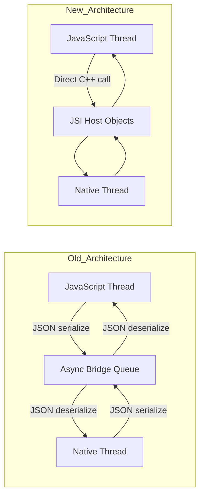
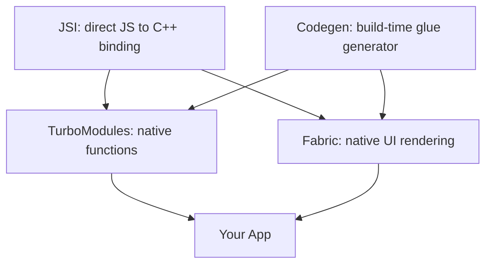
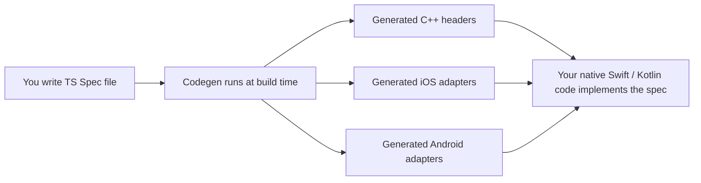
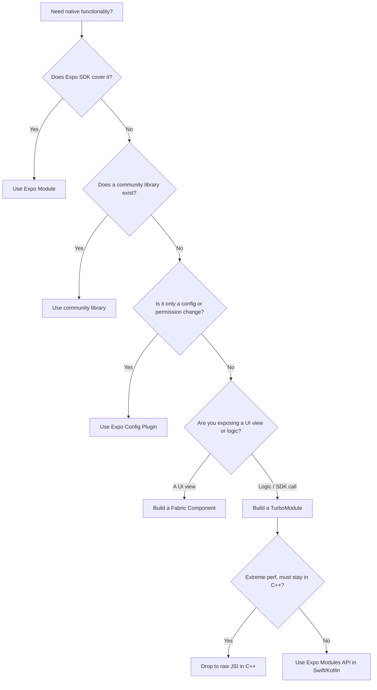
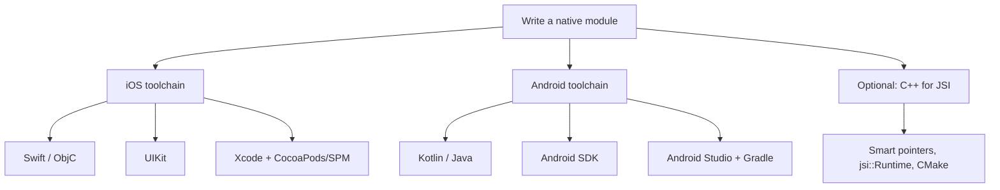
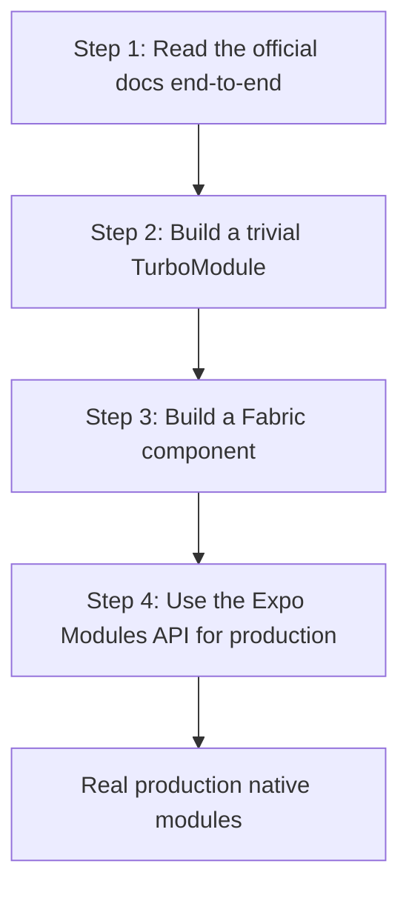

# Native Modules and the New Architecture

> JSI, Fabric, TurboModules, and Codegen — what they are and when you need to write your own.

---

## Table of Contents

1. [The New Architecture](#1-the-new-architecture)
2. [When to Write a Native Module](#2-when-to-write-a-native-module)
3. [Skills Needed](#3-skills-needed)
4. [Recommended Path](#4-recommended-path)

---

## 1. The New Architecture

### The Old Bridge Problem

To understand *why* React Native rebuilt its internals, you need to understand what was slow.

In the old architecture, JavaScript and native code lived in two separate worlds. Your JavaScript runs in a JS engine (Hermes or JSC). Your UI, your Bluetooth radio, your camera — all of that lives in native land (Swift/Objective-C on iOS, Kotlin/Java on Android). These two worlds do not share memory and do not speak the same language. So every time JS wanted to tell native "render this view" or "call this Bluetooth function," the request was serialized to a JSON string, dropped onto an asynchronous message queue (the famous "bridge"), and deserialized on the other side. The response traveled back the same way.

Think of it like two people in separate rooms communicating by sliding handwritten notes under a door. It works, but it is slow, it is asynchronous by default (you slide a note and wait — you cannot get an instant answer), and you cannot have a real-time conversation.

Three properties of that bridge caused real, visible problems:

- **Everything was async.** Even a question with an instant answer ("how wide is this view?") forced a round trip. You could not block and get the value *now*.
- **Everything was serialized.** Passing a 5 MB image meant stringifying 5 MB into JSON and parsing it back — pure overhead.
- **It was a single shared queue.** Heavy traffic (fast scrolling, lots of touches) congested the bridge, and frames got dropped.

> **Analogy that sticks:** the old bridge is like calling a REST API for *every* function call between your own modules — JSON in, JSON out, over a network you can't avoid. The New Architecture is like replacing those HTTP calls with a normal in-process function call.

On the web, you never had this problem: your JS *is* the same process as the DOM. Calling `element.offsetWidth` is instant and synchronous. React Native's New Architecture is, in large part, an effort to make native feel that immediate too.



The New Architecture stands on four pillars. Here is the map before we walk through each one:



| Pillar | What it replaces | One-line job |
| --- | --- | --- |
| **JSI** | The JSON bridge itself | Lets JS hold and call C++ objects directly, synchronously |
| **TurboModules** | `NativeModules` | Native *functions/logic* exposed to JS (lazy + typed) |
| **Fabric** | The "Paper" renderer | Native *UI views* exposed to React |
| **Codegen** | Hand-written bridge glue | Generates the C++/native scaffolding from your TS specs |

### JSI: JavaScript Interface

JSI is the foundation of everything new. It is a thin C++ layer that lets JavaScript hold direct references to C++ objects — and call methods on them synchronously. No serialization. No bridge. No queue.

The mechanism: JSI exposes the concept of a **Host Object** — a C++ object that JavaScript treats like a normal JS object. When your JS reads a property or calls a method on it, that access is routed straight into C++ code in the same process. No JSON string is ever created.

On the web, this is similar to how your JS code can call `document.createElement()` and get back an actual live DOM node reference, not a serialized copy of it. You hold the real thing and poke at it directly. JSI gives React Native that same kind of direct binding to native objects.

```tsx
// Conceptual: what JSI enables under the hood.
// JS can now hold a direct reference to a native (C++-backed) object.
const nativeModule = global.__turboModuleProxy('MyModule');

// This call goes directly to C++ -> Swift/Kotlin, no bridge, no JSON.
// It can return synchronously because there is no async queue in between.
const result = nativeModule.computeExpensiveThing(data);
```

Two consequences flow from "direct C++ binding":

- **Synchronous calls become possible.** A method can return a value immediately, like a normal function. (The old bridge physically could not do this.)
- **The JS engine becomes swappable.** Because JSI is an abstraction over "some JS runtime," React Native can run on Hermes, JSC, or even V8 without changing the rest of the system.

> **Pro tip:** You will almost never write raw JSI/C++ yourself. Think of JSI as the *plumbing*. TurboModules, Fabric, and Codegen are the *appliances* built on top of it that you actually interact with. If a library README brags about being "JSI-based," it usually just means "fast, synchronous, no bridge overhead."

### TurboModules: Native Modules, Rebuilt

TurboModules replace the old `NativeModules` system. A TurboModule is the New Architecture way to expose **native logic** (a function, an SDK call, a sensor read) to JavaScript. Two key improvements over the old system:

**1. Lazy loading.** Old native modules were *all* initialized at app startup, whether you used them or not — every one paid an init cost before your first screen even appeared. TurboModules load on first access. If your app registers 40 native modules but the current screen only touches 3, you only pay for those 3. This directly improves startup time, which matters a lot on lower-end Android devices.

**2. Type safety via Codegen.** Each TurboModule is described by a TypeScript spec file. Codegen reads this spec and generates typed C++/native interfaces from it. If your JS calls a method with the wrong argument types, you get a *build-time* error instead of a mysterious runtime crash deep in native code.

```tsx
// src/NativeMyModule.ts — a TurboModule spec file.
// By convention the filename starts with "Native" so Codegen finds it.
import type { TurboModule } from 'react-native';
import { TurboModuleRegistry } from 'react-native';

// The Spec interface is the contract between JS and native.
// Codegen turns each method below into a typed native signature.
export interface Spec extends TurboModule {
  multiply(a: number, b: number): number;        // synchronous, returns a number
  getDeviceName(): Promise<string>;              // async, returns a Promise
}

// getEnforcing throws a clear error if the native module isn't linked,
// instead of silently giving you `undefined` at the first call site.
export default TurboModuleRegistry.getEnforcing<Spec>('MyModule');
```

| Aspect | Old `NativeModules` | New TurboModules |
| --- | --- | --- |
| Loading | All eagerly at startup | Lazily on first access |
| Type checking | None (runtime crashes) | Compile-time via Codegen |
| Calls | Always async (bridge) | Sync *and* async supported |
| Data transfer | JSON-serialized | Direct via JSI |

> **Gotcha:** A synchronous TurboModule method runs *on the JS thread*. If you do something genuinely slow (a 200 ms file parse) synchronously, you block the JS thread and freeze your UI. Use synchronous methods for fast lookups; use `Promise`-returning (`AsyncFunction`) methods for anything heavy.

### Fabric: The New Renderer

Fabric replaces the old rendering system (called "Paper" retroactively). Where TurboModules expose native *logic*, Fabric exposes native *UI views* to React and is responsible for turning your `<View>`/`<Text>` tree into real native widgets. The biggest wins:

- **Synchronous layout & measurement.** On the old architecture, measuring a view required an async round trip. Fabric can measure synchronously, which eliminates the layout flicker you sometimes saw on the very first render (where content briefly appeared in the wrong place, then snapped into position).
- **Concurrent React support.** Fabric is built to work with React 18 features like `useTransition`, `useDeferredValue`, and `Suspense`. The old renderer could not support these because it was fundamentally asynchronous and could not interrupt or re-prioritize work.
- **Multi-threaded rendering.** Fabric can create and update its **shadow tree** (the lightweight C++ copy of your view hierarchy used to compute layout) on any thread, not just one dedicated "shadow thread."

Fabric renders in three phases. Understanding this lifecycle helps you reason about when props and layout actually hit the screen:


- **Render** — React runs your components and produces a tree of elements (pure JS).
- **Commit** — Fabric builds/diffs the shadow tree and runs layout (Yoga, in C++) to assign every node a position and size.
- **Mount** — the computed result is applied to actual native views on the UI thread.

On the web, this is analogous to how React 18's concurrent renderer replaced the old synchronous `ReactDOM.render`. The underlying engine had to change before the new features could exist. In the browser, your "mount" target is the DOM; in Fabric, it is native `UIView`/`android.view.View` objects.

### Codegen: The Glue Generator

Codegen is the build-time tool that reads your TypeScript spec files and generates the C++ scaffolding that connects JS to native code. You write a `.ts` spec, and Codegen produces:

- C++ header files with the correct method signatures
- Platform-specific adapter code for iOS (Objective-C++) and Android (JNI/C++)
- Type validation that catches mismatches between your JS contract and native implementation at compile time

Here is where Codegen sits in the build:



Why this matters: the TypeScript spec becomes the **single source of truth**. The types you declare in JS and the types native code must implement are guaranteed to agree, because both sides are generated from the same file. Change the spec, rebuild, and any native code that no longer matches fails to compile.

This is the piece that makes the New Architecture practical. Without it, you would be hand-writing C++ bridge code for every module — which is exactly what early adopters had to do, and it was miserable and error-prone.

> **When does Codegen run?** It runs automatically during the native build (`pod install` on iOS, the Gradle build on Android, or `expo prebuild`). You normally never invoke it by hand — but when a native build fails with a complaint about a missing generated header, a stale Codegen cache is a prime suspect. A clean rebuild usually fixes it.

> **Key fact:** The New Architecture is the default starting with Expo SDK 52 and React Native 0.76+. If you start a new project today, you are already on it — bridgeless mode, Fabric, and TurboModules are on out of the box. You do not need to opt in.

---

## 2. When to Write a Native Module

### The 95% Rule

Here is the honest truth: **most React Native developers never need to write a native module.** The ecosystem already covers the vast majority of use cases:

- **Expo Modules** handle camera, file system, notifications, haptics, sensors, secure storage, location, and dozens more.
- **Community libraries** like `react-native-reanimated`, `react-native-mmkv`, `react-native-ble-plx`, and `react-native-vision-camera` cover performance-critical domains that would be painful to build yourself.
- **Expo Config Plugins** let you modify native project configuration (permissions, entitlements, build settings) *without writing native code at all*.

Before you write a single line of Swift or Kotlin, search the Expo SDK docs and the React Native Directory (reactnative.directory). Seriously. The cost of *maintaining* your own native module across iOS and Android OS versions, React Native upgrades, and Expo SDK bumps is much higher than people expect — every yearly platform release is a potential breakage you now own.

> **Reframe the decision:** writing the module is the cheap part. *Owning* it for three years across six OS releases and four RN upgrades is the expensive part. Always price in maintenance, not just the initial build.

### The 5% Where You Must Go Native

There are legitimate cases where you genuinely need to write your own:

**1. Proprietary SDKs.** Your company has an internal C++ library for fraud detection, or a vendor hands you a closed-source `.xcframework` (iOS) and `.aar` (Android). No community wrapper exists, and you need to expose it to JS. This is the most common legitimate reason.

**2. Hot-path native code.** You are building real-time audio DSP, a custom image-processing pipeline, or BLE communication with a specific binary protocol at high frequency. JavaScript, even with Hermes, cannot meet the latency or throughput requirements, and the work must stay in native (often C++).

**3. Custom native UI.** You need to wrap a platform-specific UI component — a native map with custom overlays, a hardware-accelerated video player, or an OEM widget that has no React Native equivalent. This is a **Fabric component** rather than a TurboModule, because you are exposing a *view*, not a *function*.

Use this decision tree before committing:



| Your need | Right tool | Why |
| --- | --- | --- |
| Camera, notifications, storage, sensors | Expo Module | Already built, maintained for you |
| High-perf animation, fast key-value store | Community library | Battle-tested, JSI-based |
| Add a permission / entitlement / build flag | Config Plugin | No native code to maintain |
| Expose a vendor SDK function to JS | TurboModule (Expo Modules API) | Typed, lazy, manageable |
| Wrap a native UI widget | Fabric Component | Integrates with the renderer |
| Real-time C++ hot path | Raw JSI | Maximum throughput, no overhead |

### A Real Example: When You Cross the Line

Say you are integrating a proprietary audio-processing SDK that your hardware team built in C++. No public wrapper will ever exist for it. Here is what the integration looks like at a high level.

```tsx
// Step 1: Define the TypeScript spec — the contract.
// src/NativeAudioProcessor.ts
import type { TurboModule } from 'react-native';
import { TurboModuleRegistry } from 'react-native';

export interface Spec extends TurboModule {
  initialize(sampleRate: number, bufferSize: number): boolean; // sync setup
  processBuffer(inputBuffer: number[]): number[];              // hot path
  setParameter(name: string, value: number): void;            // fire-and-forget
  dispose(): void;                                            // cleanup
}

export default TurboModuleRegistry.getEnforcing<Spec>(
  'AudioProcessor'
);
```

```tsx
// Step 2: Use it in your component — it looks like any TS module.
import { useEffect } from 'react';
import AudioProcessor from './NativeAudioProcessor';

function AudioScreen() {
  useEffect(() => {
    // Synchronous call returning a boolean — only possible on the New Arch.
    const ok = AudioProcessor.initialize(44100, 512);
    if (!ok) console.error('Failed to initialize audio processor');

    // Always release native resources on unmount, or you leak them.
    return () => AudioProcessor.dispose();
  }, []);

  // ...render UI that calls AudioProcessor.processBuffer / setParameter
}
```

The native implementations (Swift for iOS, Kotlin for Android) then link against your C++ library and implement the spec methods. Codegen handles the glue between the spec and your native code, so the JS contract above and the native code are guaranteed to match types.

> **Common mistake:** Reaching for a native module when a JavaScript solution works fine. `react-native-reanimated` runs animations on the UI thread *without you writing any native code*. `expo-camera` wraps the entire camera API. Check what exists before committing to native maintenance burden — the best native module is the one you didn't have to write.

> **On the web equivalent:** This is like deciding whether to write a custom browser extension / native messaging host versus using an existing JS library. You only build the heavyweight native thing when no library can reach the capability you need.

---

## 3. Skills Needed

### The Uncomfortable Truth

Writing native modules means writing native code. There is no way around it. You need to be competent in the platform languages, build systems, and IDEs — and critically, you need *both* platforms, because a module that only works on iOS is half a module. Here is what that actually means, by platform.



### iOS

- **Swift** (or Objective-C for older codebases). You need value types vs reference types, optionals, closures, and the concurrency model (`async/await`, actors). The Expo Modules API is Swift-first, so Swift is the practical choice.
- **UIKit** for wrapping existing native views. SwiftUI knowledge helps for newer components, but most React Native view wrappers still sit on UIKit under the hood.
- **Xcode.** You will debug native crashes here, read native stack traces here, and wrestle with code signing, entitlements, and capabilities here. There is no shortcut around the IDE.
- **CocoaPods and/or SPM.** React Native uses CocoaPods for iOS dependencies. You need to understand `Podfile`, `podspec`, and how linking works.

```bash
# Typical iOS native module workflow
cd ios
pod install                 # links native deps AND runs Codegen
open MyApp.xcworkspace      # open the WORKSPACE, not the .xcodeproj!

# Common gotcha: after editing the Podfile or adding a native dep, run:
cd ios && pod install && cd ..
# Use pod install (respects your lockfile), NOT pod update
# (which silently upgrades EVERY dependency and can break your build).
```

> **The single most common iOS beginner mistake:** opening `MyApp.xcodeproj` instead of `MyApp.xcworkspace`. The `.xcworkspace` is the one that knows about your CocoaPods. Open the wrong one and nothing links.

### Android

- **Kotlin** (or Java for legacy code). Kotlin is the default for new Android work and what the Expo Modules API uses. You need coroutines, extension functions, null safety, and an understanding of the Android lifecycle.
- **Android SDK.** Activities, Fragments, Views, the `Context` system, the runtime permissions model, intents. Even wrapping a simple SDK pulls you into these.
- **Gradle.** Android's build system. You will edit `build.gradle` files, manage dependencies, and decode 200-line error messages. Most web developers find this the single most painful part of native work.
- **Android Studio.** The Android equivalent of Xcode: debug native crashes, inspect the view hierarchy, profile performance.

```bash
# Typical Android native module workflow:
# In Android Studio: File -> Open -> select the android/ directory

# Common gotcha: Gradle caches very aggressively. When a build breaks
# for no obvious reason, clean first before debugging deeper:
cd android && ./gradlew clean && cd ..

# Nuclear option when Gradle is truly stuck (wipes caches + build output):
cd android
./gradlew clean
rm -rf .gradle
rm -rf app/build
cd ..
```

| | iOS | Android |
| --- | --- | --- |
| Language | Swift / Objective-C | Kotlin / Java |
| UI framework | UIKit (some SwiftUI) | Android View system |
| IDE | Xcode | Android Studio |
| Build / deps | CocoaPods, SPM | Gradle |
| Most painful for web devs | Signing & provisioning | Gradle error messages |

### C++ Basics for JSI

If you are writing a *raw JSI module* (a direct C++ binding for maximum performance), you additionally need:

- Basic C++ syntax (headers, source files, namespaces)
- Smart pointers (`std::shared_ptr`, `std::unique_ptr`) and a feel for manual memory ownership
- Understanding of the `jsi::Runtime` API (how you read/write JS values from C++)
- CMake for cross-platform native builds

Most developers do not need any of this. TurboModules with Swift/Kotlin are sufficient for ~99% of native module work. JSI-level C++ is for when you are building something like a storage engine (`react-native-mmkv`) or an animation runtime (`react-native-reanimated`) — a shared core that must run identically and fast on both platforms.

> **Honest assessment:** If you have never opened Xcode or Android Studio, budget 2–4 weeks of learning before attempting your first native module. The React Native side is the easy part. The platform-specific tooling, debugging, and build systems are where the real complexity lives — and where you will lose the most time.

### The Expo Modules API Advantage

The Expo Modules API significantly lowers the barrier. Instead of implementing raw TurboModule interfaces in Objective-C++ and Java/JNI, you write idiomatic Swift and Kotlin against a clean, declarative API. It still uses TurboModules and Fabric (and JSI) under the hood — it just hides the boilerplate.

```tsx
// ios/MyModule.swift — using the Expo Modules API
import ExpoModulesCore

public class MyModule: Module {
  // A declarative "definition" describes what you expose to JS.
  public func definition() -> ModuleDefinition {
    Name("MyModule")                                   // JS-visible name

    Function("multiply") { (a: Double, b: Double) -> Double in
      return a * b                                     // runs synchronously
    }

    AsyncFunction("getDeviceName") { () -> String in
      return UIDevice.current.name                     // returns a Promise to JS
    }
  }
}
```

```tsx
// android/src/main/java/MyModule.kt — using the Expo Modules API
package com.myapp.mymodule

import expo.modules.kotlin.modules.Module
import expo.modules.kotlin.modules.ModuleDefinition

class MyModule : Module() {
  // Same declarative shape as iOS — the API is intentionally symmetric.
  override fun definition() = ModuleDefinition {
    Name("MyModule")

    Function("multiply") { a: Double, b: Double ->
      a * b
    }

    AsyncFunction("getDeviceName") {
      android.os.Build.MODEL
    }
  }
}
```

Notice how the iOS and Android definitions mirror each other — same method names, same shapes. That symmetry is the whole point: you reason about one mental model and apply it twice. This is dramatically simpler than the raw TurboModule approach, and it is what to use for production work unless you have a specific reason to go lower-level.

| Approach | You write | Boilerplate | When to use |
| --- | --- | --- | --- |
| Raw JSI (C++) | C++ against `jsi::Runtime` | Maximum | Shared perf-critical core only |
| Raw TurboModule | Obj-C++ + Java/JNI | High | Rarely — learning, or special cases |
| Expo Modules API | Swift + Kotlin | Low | **Default for production** |

> **Pro tip:** Even if you ship raw TurboModules in a learning exercise, migrate real production modules to the Expo Modules API. The amount of glue code it removes is the difference between a module one person can maintain and one that needs a native specialist.

---

## 4. Recommended Path

### A Concrete Learning Sequence

Do not try to learn everything at once. The New Architecture is a deep topic, and trying to absorb JSI, Fabric, TurboModules, and Codegen simultaneously leads to confusion. Learn it in the order below — each step builds the mental model the next one needs.



### Step 1: Read the Official Docs End-to-End

The React Native team rewrote the architecture documentation in 2024. Read these pages, in order:

1. **Architecture Overview** — understand the four pillars (JSI, Fabric, TurboModules, Codegen)
2. **Rendering Pipeline** — how Fabric renders: the Render → Commit → Mount phases
3. **Threading Model** — which work happens on which thread (JS thread, UI thread, background)

Do not skim. Read every page. The docs are genuinely well-written now and explain the *why* behind each design decision, not just the API surface. Reading them first will save you days of confusion later.

### Step 2: Build a Trivial TurboModule

Start with something embarrassingly simple. A module that takes two numbers and returns their sum. The goal is not to build something useful — it is to experience the *full pipeline* end to end at least once:

1. Write the TypeScript spec
2. Run Codegen and actually look at what it produces
3. Implement the native side on iOS (Swift)
4. Implement the native side on Android (Kotlin)
5. Call it from a React component
6. Verify it works on both platforms

```bash
# If using Expo, scaffold a local module (lives inside your app):
npx create-expo-module@latest --local my-turbo-module

# This generates the full structure for you:
# modules/my-turbo-module/
#   src/            <- TypeScript spec and JS interface
#   ios/            <- Swift implementation
#   android/        <- Kotlin implementation
#   expo-module.config.json
```

> **Common mistake:** Trying to integrate a complex vendor SDK as your *first* native module. If your first module is also your first time using Xcode, you will not be able to tell whether a bug is in your module code, your build config, your linking, or just your misunderstanding of the platform. Start trivial. Confirm the pipeline works. Then add complexity one layer at a time.

### Step 3: Build a Fabric Component

A Fabric component is a native UI view exposed to React. This is harder than a TurboModule because you are now dealing with the rendering pipeline, view props, and event handling — not just function calls.

Start with a simple native view — maybe a colored box that accepts a `color` prop and fires an `onPress` event. Again, the goal is to understand the machinery, not to build anything shippable:

1. Define the component spec with Codegen
2. Implement the native view on iOS
3. Implement the native view on Android
4. Use it as a React component with typed props and events

This step teaches you how Fabric's shadow tree works, how props flow from JS down into native views, and how events bubble back up to JS. These are exactly the moving parts you'll debug in real component work.

> **Why TurboModule first, then Fabric?** A TurboModule is "call a native function and get a value back" — a single concept. A Fabric component adds props, layout, lifecycle, and events on top of that. Learning the simpler one first means each new idea lands on solid ground.

### Step 4: Use the Expo Modules API for Production

Once you understand the underlying concepts from Steps 2 and 3, switch to the Expo Modules API for real work. It abstracts away the boilerplate while still using TurboModules and Fabric (and JSI) under the hood — so the mental model you built still applies; you're just writing far less glue.

The Expo Modules API gives you:

- A single Swift/Kotlin API instead of Objective-C++ and JNI
- Built-in support for views, events, shared objects, and lifecycle hooks
- Integration with EAS Build and Expo's config plugin system
- Automatic Codegen integration (you don't run it by hand)

```bash
# The production workflow:

# 1. Create the module (standalone, publishable package)
npx create-expo-module@latest my-real-module

# 2. Write your Swift and Kotlin implementations
# 3. Add native SDK dependencies in the .podspec (iOS) / build.gradle (Android)

# 4. Regenerate native projects, then build & run on each platform
npx expo prebuild --clean   # regenerates ios/ and android/ from config
npx expo run:ios
npx expo run:android
```

### What to Skip (For Now)

- **Raw JSI bindings.** Unless you are building a performance-critical shared C++ core, the Expo Modules API or a standard TurboModule is sufficient — and far easier to maintain.
- **Writing your own Fabric renderer.** This is deep internals territory. Use the component-wrapper APIs; do not reimplement the renderer.
- **Bridgeless-mode internals.** It is the default now. You benefit from it automatically. You do not need to understand its implementation to ship apps on top of it.

| Topic | Learn now? | Reason |
| --- | --- | --- |
| TurboModule via Expo Modules API | Yes | Your day-to-day tool |
| Fabric component basics | Yes | Needed for custom native UI |
| Codegen behavior (what it emits) | Lightly | Helps debug build failures |
| Raw JSI / C++ | Later / maybe never | Only for shared perf cores |
| Custom Fabric renderer | No | Pure internals |

The New Architecture is powerful, but remember what it is: **infrastructure**. Your goal as an app developer is to understand it well enough to make informed decisions — and to write a native module when (and *only* when) the ecosystem genuinely does not cover your needs.

---