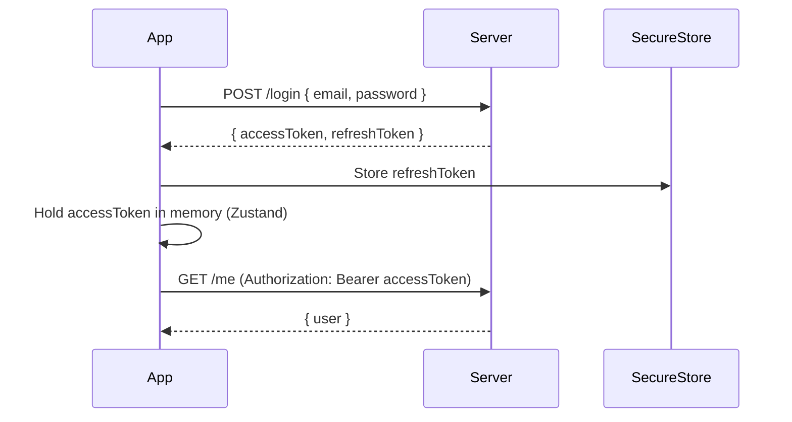
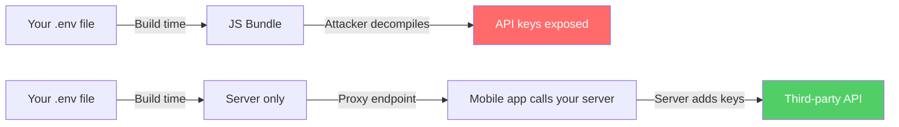

# Authentication and Security: Protecting Your Mobile App

> Auth patterns, token storage, biometric unlock, and the security hardening that separates toy apps from production.

---

## Table of Contents

1. [Auth Patterns](#1-auth-patterns)
2. [Auth Providers](#2-auth-providers)
3. [Token Handling](#3-token-handling)
4. [Security Hardening](#4-security-hardening)

---

## 1. Auth Patterns

On the web, authentication is relatively straightforward: you set an HttpOnly cookie or store a JWT in memory, and the browser handles the rest. Mobile is a different animal. There is no browser sandbox, no cookie jar managed by a trusted runtime. Your app is a binary sitting on a device you do not control, running on an OS that might be rooted, patched, or three versions behind. The auth patterns you choose have to account for all of that.

Let's walk through the patterns that matter, from the most common to the emerging.

### Email + Password with JWT

The classic. The user sends credentials, your server validates them, and returns an access token (short-lived) plus a refresh token (long-lived). This is the baseline you should understand even if you never implement it from scratch.



```tsx
// Simplified login flow
import * as SecureStore from "expo-secure-store";
import { useAuthStore } from "@/stores/auth";

async function login(email: string, password: string) {
  const res = await fetch(`${API_URL}/auth/login`, {
    method: "POST",
    headers: { "Content-Type": "application/json" },
    body: JSON.stringify({ email, password }),
  });

  const { accessToken, refreshToken } = await res.json();

  // Refresh token goes to encrypted storage — never plain AsyncStorage
  await SecureStore.setItemAsync("refreshToken", refreshToken);

  // Access token stays in memory — fast, and dies with the process
  useAuthStore.getState().setAccessToken(accessToken);
}
```

> **Gotcha:** Never store the access token in AsyncStorage or MMKV unencrypted. On a rooted Android device, those are plain text files. Use `expo-secure-store` for anything sensitive — it uses the Keychain on iOS and EncryptedSharedPreferences on Android.

### OAuth (Google, Apple, Facebook, GitHub)

OAuth on mobile is not the same as OAuth on the web. You cannot just redirect to a URL and read query params from the callback. Instead, you use `expo-auth-session`, which handles the system browser handoff and deep-link return for you.

```tsx
import * as AuthSession from "expo-auth-session";
import * as Google from "expo-auth-session/providers/google";

export function useGoogleAuth() {
  const [request, response, promptAsync] = Google.useAuthRequest({
    iosClientId: process.env.EXPO_PUBLIC_GOOGLE_IOS_CLIENT_ID,
    androidClientId: process.env.EXPO_PUBLIC_GOOGLE_ANDROID_CLIENT_ID,
  });

  useEffect(() => {
    if (response?.type === "success") {
      const { id_token } = response.params;
      // Send id_token to YOUR server — never trust it client-side alone
      authenticateWithServer(id_token);
    }
  }, [response]);

  return { promptAsync, isReady: !!request };
}
```

### Sign in with Apple

If your app offers any third-party social login on iOS, Apple requires you to also offer Sign in with Apple. This is not optional — your app will be rejected in review without it. The good news: `expo-apple-authentication` makes it painless.

### Biometric Unlock

Biometrics are not an auth method — they are a convenience layer. The user authenticates once with credentials, and you store the refresh token in secure storage behind a biometric gate. Next launch, you prompt for Face ID / fingerprint before reading the token.

```tsx
import * as LocalAuthentication from "expo-local-authentication";
import * as SecureStore from "expo-secure-store";

async function biometricUnlock(): Promise<string | null> {
  const hasHardware = await LocalAuthentication.hasHardwareAsync();
  const isEnrolled = await LocalAuthentication.isEnrolledAsync();

  if (!hasHardware || !isEnrolled) return null;

  const result = await LocalAuthentication.authenticateAsync({
    promptMessage: "Unlock to continue",
    fallbackLabel: "Use password",
  });

  if (result.success) {
    return SecureStore.getItemAsync("refreshToken");
  }

  return null;
}
```

### Magic Links and Passkeys

Magic links work the same as on the web — send an email, user clicks it, deep link opens the app. Just make sure you validate the deep link domain with Universal Links (iOS) and App Links (Android), otherwise any app could intercept that link.

Passkeys (WebAuthn) are the emerging standard. Both iOS and Android now support them natively, and libraries like `react-native-passkey` are maturing. They eliminate passwords entirely. If you are starting a new app in 2026, passkeys deserve serious consideration.

---

## 2. Auth Providers

You could build auth yourself. You should not. The surface area — password hashing, token rotation, rate limiting, email verification, account recovery, OAuth state management, MFA — is enormous, and one mistake creates a real vulnerability. Use a provider.

Here is an opinionated ranking for React Native projects.

### Clerk — Best for Most RN Apps

Clerk is purpose-built for modern frontend frameworks and has a first-class Expo SDK. You get prebuilt UI components, session management, multi-factor auth, and organization support out of the box. The DX is outstanding.

```tsx
// app/_layout.tsx with Clerk
import { ClerkProvider, ClerkLoaded } from "@clerk/clerk-expo";
import { tokenCache } from "@/lib/token-cache";

export default function RootLayout() {
  return (
    <ClerkProvider
      publishableKey={process.env.EXPO_PUBLIC_CLERK_PUBLISHABLE_KEY!}
      tokenCache={tokenCache}
    >
      <ClerkLoaded>
        <Slot />
      </ClerkLoaded>
    </ClerkProvider>
  );
}
```

```tsx
// lib/token-cache.ts — Clerk needs you to provide secure storage
import * as SecureStore from "expo-secure-store";
import { TokenCache } from "@clerk/clerk-expo";

export const tokenCache: TokenCache = {
  async getToken(key: string) {
    return SecureStore.getItemAsync(key);
  },
  async saveToken(key: string, value: string) {
    await SecureStore.setItemAsync(key, value);
  },
};
```

**Tradeoff:** Clerk is a hosted service with a free tier up to 10,000 MAUs. Beyond that, you pay. If vendor lock-in worries you, look elsewhere.

### Supabase Auth — Best Open Source Option

Supabase gives you a Postgres database, realtime, storage, and auth in one package. The auth module supports email/password, OAuth, phone OTP, and magic links. It is open source and self-hostable. The free tier is generous (50,000 MAUs).

### Firebase Auth — Battle-Tested at Scale

Firebase Auth has been around for years and handles billions of authentications. The React Native integration via `@react-native-firebase/auth` is solid. The downside: Firebase pulls in native dependencies that make EAS builds heavier, and you are locked into the Google Cloud ecosystem.

### Auth0 — Enterprise Play

Auth0 (now part of Okta) is what you reach for when the requirements include SAML, LDAP, or enterprise SSO. It is overkill for most indie apps but indispensable if your users are companies.

### Better Auth — The Newcomer

Better Auth is a newer, TypeScript-first, self-hostable auth library. It is framework-agnostic and has a growing plugin ecosystem. If you want full control over your auth server without building from scratch, it is worth evaluating.

> **Recommendation:** Start with Clerk if you want to ship fast. Move to Supabase if you need an integrated backend. Use Better Auth or self-hosted Supabase if you need full data sovereignty.

---

## 3. Token Handling

Getting tokens is the easy part. Managing them correctly across the app lifecycle — background, foreground, expired, revoked, multiple tabs — is where most auth bugs live.

### The Golden Rule

**Access token in memory. Refresh token in secure storage. Nothing sensitive in AsyncStorage, MMKV, or the JS bundle.**

On the web, you might store tokens in an HttpOnly cookie and let the browser handle refresh. In React Native there is no browser. You are the browser. You manage every aspect of the token lifecycle.

### Zustand Store for Auth State

```tsx
// stores/auth.ts
import { create } from "zustand";

interface AuthState {
  accessToken: string | null;
  user: User | null;
  setAccessToken: (token: string | null) => void;
  setUser: (user: User | null) => void;
  logout: () => void;
}

export const useAuthStore = create<AuthState>((set) => ({
  accessToken: null,
  user: null,
  setAccessToken: (token) => set({ accessToken: token }),
  setUser: (user) => set({ user }),
  logout: () => set({ accessToken: null, user: null }),
}));
```

### Auto-Refresh Interceptor

Your access token will expire. When it does, you need to silently refresh it using the refresh token, retry the failed request, and queue any other requests that fired while the refresh was in flight. This is the trickiest part of client-side auth.

```tsx
// lib/api.ts — Axios interceptor with refresh queue
import axios from "axios";
import * as SecureStore from "expo-secure-store";
import { useAuthStore } from "@/stores/auth";

const api = axios.create({ baseURL: API_URL });

let isRefreshing = false;
let failedQueue: Array<{
  resolve: (token: string) => void;
  reject: (err: unknown) => void;
}> = [];

function processQueue(error: unknown, token: string | null) {
  failedQueue.forEach(({ resolve, reject }) => {
    error ? reject(error) : resolve(token!);
  });
  failedQueue = [];
}

api.interceptors.request.use((config) => {
  const token = useAuthStore.getState().accessToken;
  if (token) {
    config.headers.Authorization = `Bearer ${token}`;
  }
  return config;
});

api.interceptors.response.use(
  (response) => response,
  async (error) => {
    const originalRequest = error.config;

    if (error.response?.status !== 401 || originalRequest._retry) {
      return Promise.reject(error);
    }

    if (isRefreshing) {
      // Queue this request — it will retry after refresh completes
      return new Promise((resolve, reject) => {
        failedQueue.push({
          resolve: (token) => {
            originalRequest.headers.Authorization = `Bearer ${token}`;
            resolve(api(originalRequest));
          },
          reject,
        });
      });
    }

    originalRequest._retry = true;
    isRefreshing = true;

    try {
      const refreshToken = await SecureStore.getItemAsync("refreshToken");
      const { data } = await axios.post(`${API_URL}/auth/refresh`, {
        refreshToken,
      });

      useAuthStore.getState().setAccessToken(data.accessToken);
      await SecureStore.setItemAsync("refreshToken", data.refreshToken);

      processQueue(null, data.accessToken);

      originalRequest.headers.Authorization = `Bearer ${data.accessToken}`;
      return api(originalRequest);
    } catch (refreshError) {
      processQueue(refreshError, null);
      // Refresh failed — force logout
      await SecureStore.deleteItemAsync("refreshToken");
      useAuthStore.getState().logout();
      return Promise.reject(refreshError);
    } finally {
      isRefreshing = false;
    }
  }
);

export default api;
```

### Logout Done Right

Logout is not just clearing state. It is a checklist:

```tsx
async function logout() {
  // 1. Revoke the refresh token server-side
  try {
    const refreshToken = await SecureStore.getItemAsync("refreshToken");
    await api.post("/auth/logout", { refreshToken });
  } catch {
    // Best-effort — proceed even if server call fails
  }

  // 2. Clear secure storage
  await SecureStore.deleteItemAsync("refreshToken");

  // 3. Reset in-memory state
  useAuthStore.getState().logout();

  // 4. Reset navigation to login screen
  router.replace("/login");
}
```

> **Common mistake:** Forgetting to revoke the refresh token server-side. If the token leaks, an attacker can mint new access tokens indefinitely. Always revoke on logout and on password change.

---

## 4. Security Hardening

Authentication tells you who the user is. Security hardening protects the entire app — the network layer, the binary, the runtime. These are the measures that separate a side project from something you would trust with real user data.

### Never Ship API Keys in the JS Bundle

This is the single most common mobile security mistake. Everything in your JavaScript bundle can be extracted in minutes. Even Hermes bytecode can be decompiled. Environment variables baked into the bundle via `EXPO_PUBLIC_*` are not secrets — they are public configuration.



**Rule:** If losing a key would cost you money or compromise user data, that key belongs on your server. The mobile app talks to your server, and your server talks to the third-party API.

### Certificate Pinning

By default, your app trusts any certificate signed by a trusted CA. This means a man-in-the-middle attacker with a rogue CA cert (common on corporate networks or compromised devices) can intercept all traffic. Certificate pinning locks your app to your server's specific certificate or public key.

```tsx
// Using react-native-ssl-pinning
import { fetch as pinnedFetch } from "react-native-ssl-pinning";

const response = await pinnedFetch(`${API_URL}/me`, {
  method: "GET",
  headers: {
    Authorization: `Bearer ${accessToken}`,
  },
  sslPinning: {
    certs: ["my-server-cert"], // .cer file in your app bundle
  },
});
```

> **Gotcha:** Certificate pinning breaks when your certificate rotates. Use public key pinning instead of certificate pinning — keys survive cert renewals. And always include a backup pin for your next key, so you can rotate without shipping an app update.

### Jailbreak and Root Detection

A jailbroken iOS device or rooted Android device has bypassed OS-level security. Secure storage may no longer be secure. You cannot prevent users from jailbreaking, but you can detect it and respond — show a warning, disable sensitive features, or refuse to run.

```tsx
import JailMonkey from "jail-monkey";

function SecurityGate({ children }: { children: React.ReactNode }) {
  if (JailMonkey.isJailBroken()) {
    return (
      <View style={styles.warning}>
        <Text>
          This device appears to be jailbroken. For your security, some features
          are disabled.
        </Text>
      </View>
    );
  }

  return <>{children}</>;
}
```

> **Be careful:** Jailbreak detection is a cat-and-mouse game. Sophisticated users can bypass it. Treat it as a speed bump, not a wall. Never rely solely on client-side checks for anything critical.

### Code Obfuscation

On Android, enable ProGuard/R8 in your release builds — it minifies and obfuscates native code. Hermes bytecode provides some obscurity for your JavaScript, but it is not encryption. For apps handling sensitive logic (payments, DRM), consider moving critical code to a native module.

```groovy
// android/app/build.gradle
android {
    buildTypes {
        release {
            minifyEnabled true
            shrinkResources true
            proguardFiles getDefaultProguardFile('proguard-android-optimize.txt'), 'proguard-rules.pro'
        }
    }
}
```

### Deep Link Validation

If your app handles deep links (and it should, for magic links and OAuth callbacks), validate them. An attacker can register a similar scheme and intercept links intended for your app.

- Use Universal Links (iOS) and App Links (Android) with verified domains — not custom schemes.
- Always validate the `state` parameter in OAuth flows.
- Never pass tokens directly in deep link URLs; use one-time authorization codes instead.

### The Security Checklist

Before shipping to production, verify each of these:

| Check | Why |
|---|---|
| Refresh tokens in `expo-secure-store` | Encrypted at rest by the OS |
| Access tokens in memory only | Gone when the process dies |
| No secrets in JS bundle | Decompilable in minutes |
| Certificate pinning enabled | Stops MITM on compromised networks |
| Jailbreak detection active | Warns users on insecure devices |
| ProGuard / R8 on Android release | Obfuscates native code |
| Deep links use Universal/App Links | Prevents link interception |
| OAuth state parameter validated | Stops CSRF in auth flows |
| Refresh token revoked on logout | Prevents token reuse after logout |
| Rate limiting on auth endpoints | Stops brute-force attacks |

> **Final thought:** Security is not a feature you add at the end. It is a property of every decision you make — from where you store a token to which dependency you install. Get the fundamentals right from day one, and hardening becomes incremental instead of a rewrite.