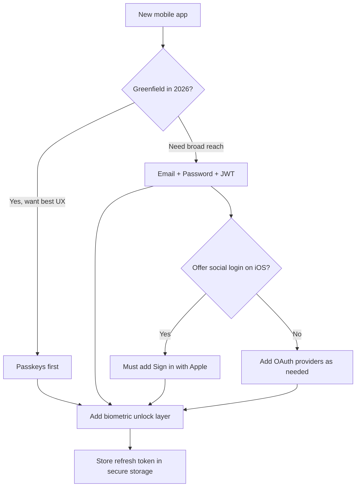
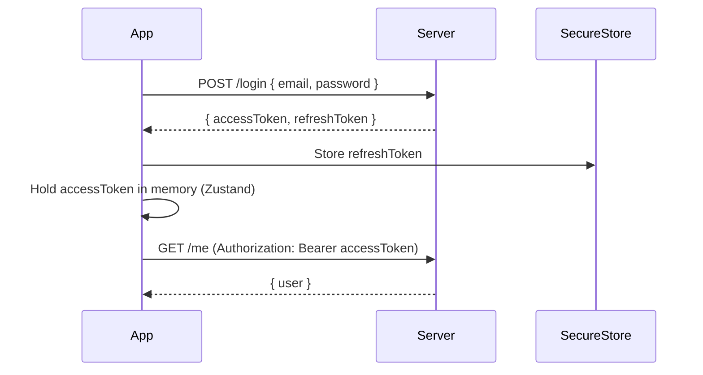
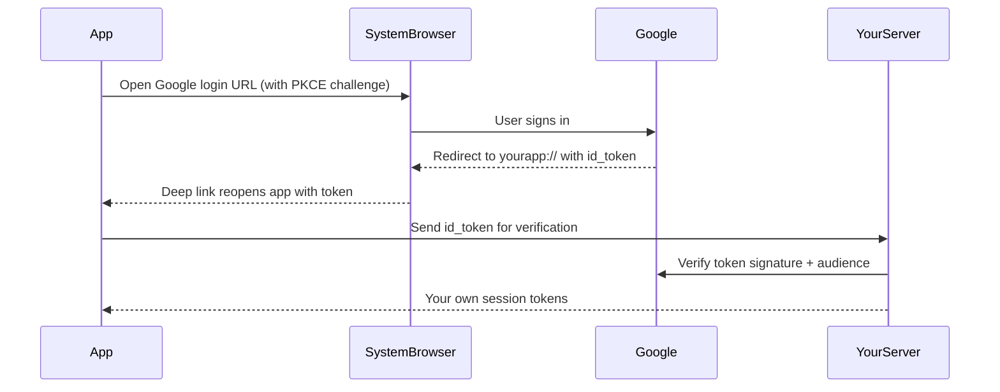
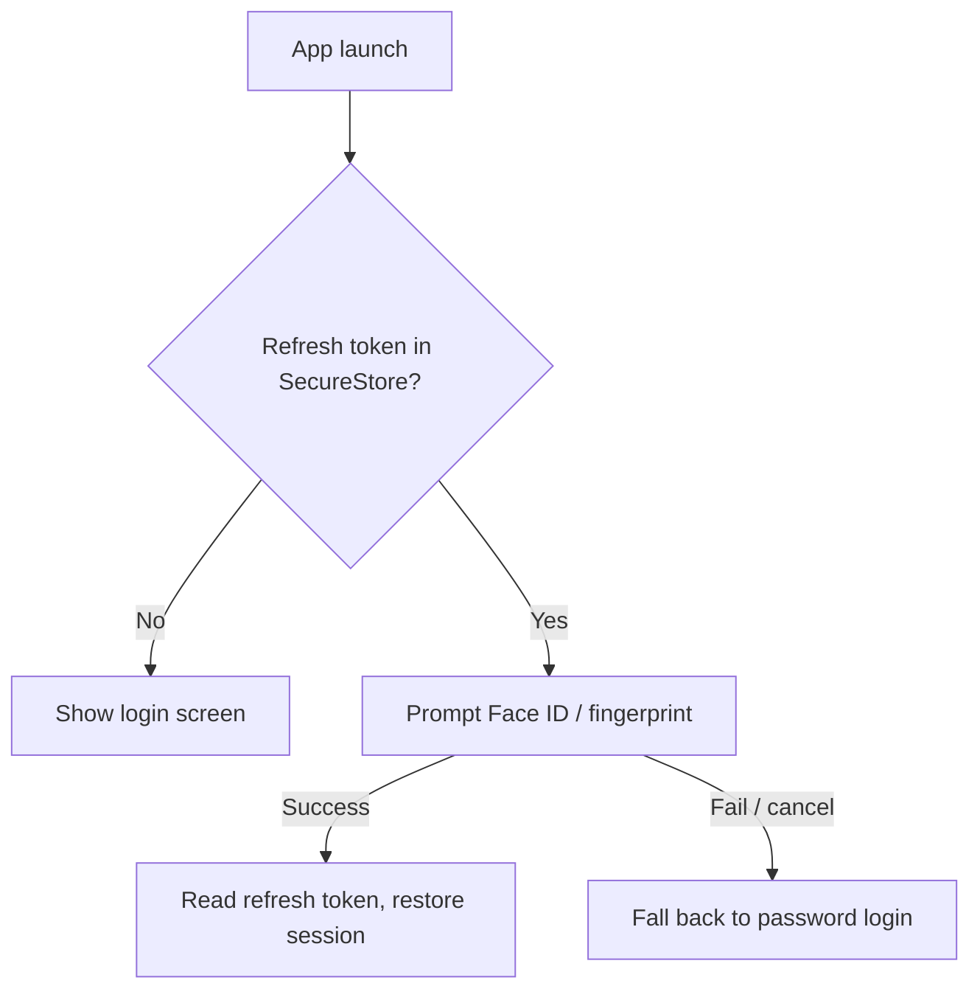
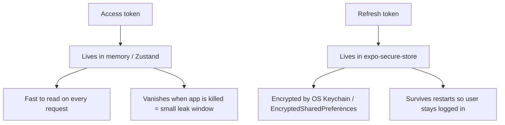
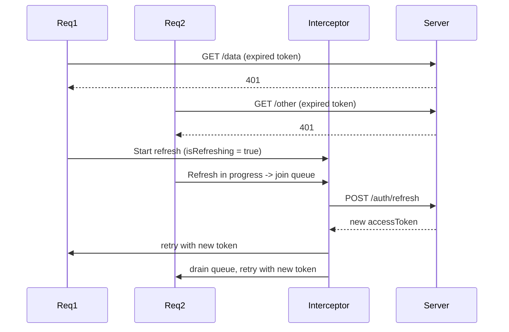
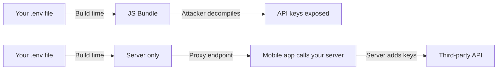
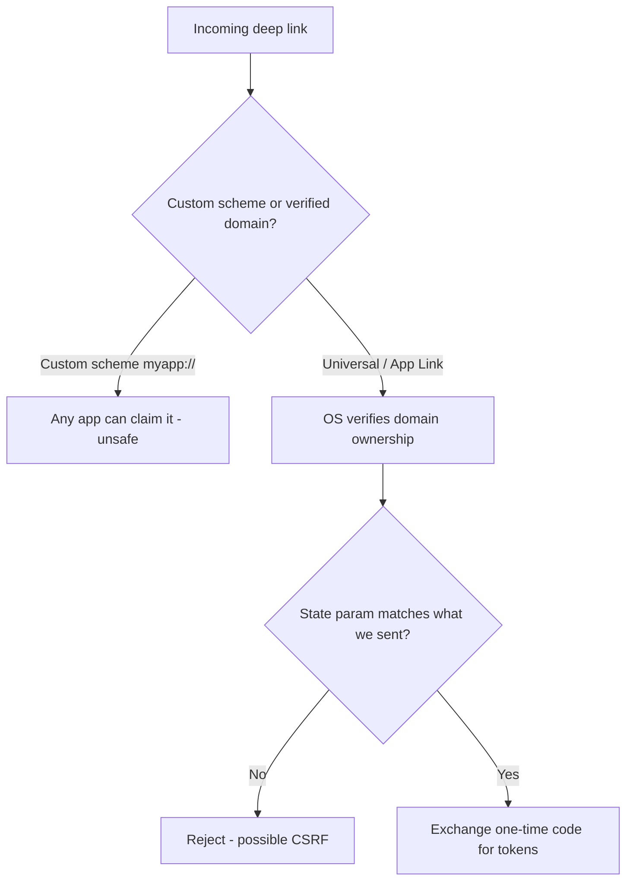

# Authentication and Security: Protecting Your Mobile App

> Auth patterns, token storage, biometric unlock, and the security hardening that separates toy apps from production.

---

## Table of Contents

1. [Auth Patterns](#1-auth-patterns)
2. [Auth Providers](#2-auth-providers)
3. [Token Handling](#3-token-handling)
4. [Security Hardening](#4-security-hardening)

---

## 1. Auth Patterns

On the web, authentication is relatively straightforward: you set an HttpOnly cookie or store a JWT in memory, and the browser handles the rest. Mobile is a different animal. There is no browser sandbox, no cookie jar managed by a trusted runtime. Your app is a binary sitting on a device you do not control, running on an OS that might be rooted, patched, or three versions behind. The auth patterns you choose have to account for all of that.

### Why mobile auth is fundamentally different

Think of the web browser as a rented apartment with a strict landlord. The landlord (the browser) enforces rules you cannot bypass: cookies marked `HttpOnly` are invisible to JavaScript, `Secure` cookies only travel over HTTPS, and the same-origin policy walls off other sites. You inherit a huge amount of security for free just by living there.

A mobile app is a house you own outright on land you do not control. There is no landlord enforcing rules. There are no cookies in the browser sense — your HTTP client (fetch/axios) does not automatically attach credentials, persist them, or expire them. **You are the browser now.** Every guarantee the web gave you for free, you must rebuild by hand: where the token lives, when it expires, how it refreshes, and who can read it off disk.

> **Mental model:** On the web, the runtime is your bodyguard. On mobile, you ARE the bodyguard, and the user's device might be working against you (rooted, jailbroken, malware-laden, or being inspected with a debugger). Assume the device is hostile and design accordingly.

Here is the high-level decision flow most teams follow when picking an auth pattern:



Let's walk through the patterns that matter, from the most common to the emerging.

### Email + Password with JWT

The classic. The user sends credentials, your server validates them, and returns an access token (short-lived) plus a refresh token (long-lived). This is the baseline you should understand even if you never implement it from scratch.

Why two tokens instead of one? It is a deliberate trade-off between security and convenience:

- The **access token** is short-lived (minutes). It is sent on every API request. Because it expires fast, a leaked access token is only useful for a tiny window.
- The **refresh token** is long-lived (days/weeks). It is used *only* to mint new access tokens, and it lives behind your strongest storage. It is rarely transmitted, so it rarely leaks.

This is the same logic as a hotel: your room key card (access token) expires at checkout and only opens one door, while your passport at the front desk (refresh token) is what proves who you are when you need a new card.



```tsx
// Simplified login flow
import * as SecureStore from "expo-secure-store";
import { useAuthStore } from "@/stores/auth";

async function login(email: string, password: string) {
  const res = await fetch(`${API_URL}/auth/login`, {
    method: "POST",
    headers: { "Content-Type": "application/json" },
    body: JSON.stringify({ email, password }),
  });

  if (!res.ok) {
    // Surface a generic error — never leak "wrong password" vs "no such user",
    // that tells an attacker which emails are registered.
    throw new Error("Invalid credentials");
  }

  const { accessToken, refreshToken } = await res.json();

  // Refresh token goes to encrypted storage — never plain AsyncStorage
  await SecureStore.setItemAsync("refreshToken", refreshToken);

  // Access token stays in memory — fast, and dies with the process
  useAuthStore.getState().setAccessToken(accessToken);
}
```

> **Gotcha:** Never store the access token in AsyncStorage or MMKV unencrypted. On a rooted Android device, those are plain text files sitting in `/data/data/your.app/`. Use `expo-secure-store` for anything sensitive — it uses the Keychain on iOS and EncryptedSharedPreferences on Android, both backed by hardware-level encryption.

> **Pro tip:** Always return the same generic error for "user not found" and "wrong password." Different messages let an attacker enumerate which emails have accounts — a free reconnaissance gift before a credential-stuffing attack.

### OAuth (Google, Apple, Facebook, GitHub)

OAuth on mobile is not the same as OAuth on the web. On the web you redirect the whole page to Google, and Google redirects back to a URL you read query params from. A mobile app has no "page" to redirect and no server callback URL the OS will hand back to you automatically. Instead, you use `expo-auth-session`, which opens the login in the **system browser** (not a fake in-app webview — Google blocks those) and catches the **deep-link return** back into your app.

Here is what actually happens under the hood:



```tsx
import * as AuthSession from "expo-auth-session";
import * as Google from "expo-auth-session/providers/google";

export function useGoogleAuth() {
  const [request, response, promptAsync] = Google.useAuthRequest({
    iosClientId: process.env.EXPO_PUBLIC_GOOGLE_IOS_CLIENT_ID,
    androidClientId: process.env.EXPO_PUBLIC_GOOGLE_ANDROID_CLIENT_ID,
  });

  useEffect(() => {
    if (response?.type === "success") {
      const { id_token } = response.params;
      // Send id_token to YOUR server — never trust it client-side alone.
      // The server verifies the signature, issuer, audience, and expiry
      // before it trusts the identity claim.
      authenticateWithServer(id_token);
    }
  }, [response]);

  return { promptAsync, isReady: !!request };
}
```

> **Why send it to your server?** The `id_token` is a signed claim from Google saying "this is user X." Anyone can craft a *fake* JSON that says the same thing. Only your server, by cryptographically verifying Google's signature, can know it is genuine. Trusting an `id_token` client-side alone is like accepting a photocopied passport — verify it at the source.

### Sign in with Apple

If your app offers any third-party social login on iOS, Apple requires you to also offer Sign in with Apple. This is not optional — your app will be rejected in review without it (App Store Review Guideline 4.8). The good news: `expo-apple-authentication` makes it painless.

```tsx
import * as AppleAuthentication from "expo-apple-authentication";

async function signInWithApple() {
  const credential = await AppleAuthentication.signInAsync({
    requestedScopes: [
      AppleAuthentication.AppleAuthenticationScope.FULL_NAME,
      AppleAuthentication.AppleAuthenticationScope.EMAIL,
    ],
  });
  // credential.identityToken -> send to your server to verify
  return credential.identityToken;
}
```

> **Gotcha:** Apple only sends the user's name and email **once** — on the very first authorization. If you do not persist them then, they are gone forever (subsequent sign-ins return `null` for those fields). Save them server-side on first login.

### Biometric Unlock

This is the single most misunderstood concept in mobile auth, so read it twice: **biometrics are not an authentication method — they are a local convenience gate.**

Face ID does not log you into your server. Your server has never seen the user's face. What actually happens is: the user authenticates *once* with real credentials, you store the refresh token in secure storage, and on later launches you require a Face ID / fingerprint scan before you are willing to *read that token back out*. The biometric check is a lock on the drawer where you keep the key, not the key itself.



```tsx
import * as LocalAuthentication from "expo-local-authentication";
import * as SecureStore from "expo-secure-store";

async function biometricUnlock(): Promise<string | null> {
  const hasHardware = await LocalAuthentication.hasHardwareAsync();
  const isEnrolled = await LocalAuthentication.isEnrolledAsync();

  // Always check BOTH: the device may have a sensor but no enrolled face/finger
  if (!hasHardware || !isEnrolled) return null;

  const result = await LocalAuthentication.authenticateAsync({
    promptMessage: "Unlock to continue",
    fallbackLabel: "Use password", // shown after a failed scan
  });

  if (result.success) {
    return SecureStore.getItemAsync("refreshToken");
  }

  return null;
}
```

> **Pro tip:** `expo-secure-store` can bind a stored value directly to biometric authentication via `requireAuthentication: true`. That way the OS itself refuses to release the value without a successful scan — stronger than checking `authenticateAsync()` yourself and then reading an unprotected entry, because there is no gap an attacker can slip through.

### Magic Links and Passkeys

Magic links work the same as on the web — send an email, user clicks it, deep link opens the app. Just make sure you validate the deep link domain with Universal Links (iOS) and App Links (Android), otherwise any app could register your custom scheme and intercept that link (covered in Section 4).

Passkeys (WebAuthn) are the emerging standard. Instead of a password, the device generates a public/private key pair; the private key never leaves the secure hardware, and login is a cryptographic challenge unlocked by Face ID or fingerprint. There is no shared secret to phish, leak, or reuse. Both iOS and Android now support them natively, and libraries like `react-native-passkey` are maturing. They eliminate passwords entirely. If you are starting a new app in 2026, passkeys deserve serious consideration.

| Pattern | UX friction | Phishing-resistant | When to use |
|---|---|---|---|
| Email + Password | Medium | No | Baseline; broad reach; you control everything |
| OAuth (Google/etc.) | Low | Partial | Fast onboarding, no password to manage |
| Sign in with Apple | Low | Partial | Mandatory on iOS if you offer any social login |
| Magic link | Low | Partial | Passwordless without new infra; email-centric users |
| Passkeys | Very low | Yes | New apps wanting best-in-class security + UX |
| Biometric unlock | Very low | N/A (local gate) | Layer ON TOP of any of the above for re-entry |

---

## 2. Auth Providers

You could build auth yourself. You should not. The surface area — password hashing, token rotation, rate limiting, email verification, account recovery, OAuth state management, MFA — is enormous, and one mistake creates a real vulnerability. This is the canonical "do not roll your own crypto" situation: the failure modes are silent (your app works fine right up until you are breached) and the consequences are catastrophic. Use a provider.

Think of an auth provider like a bank vault company. You *could* weld your own safe, but a single overlooked weak hinge defeats the whole thing, and you will not discover the flaw until someone exploits it. Specialists who do nothing but build vaults will get the hinges right.

Here is an opinionated ranking for React Native projects.

### Clerk — Best for Most RN Apps

Clerk is purpose-built for modern frontend frameworks and has a first-class Expo SDK. You get prebuilt UI components, session management, multi-factor auth, and organization support out of the box. The DX is outstanding — for many apps you can be fully authenticated in under an hour.

```tsx
// app/_layout.tsx with Clerk
import { ClerkProvider, ClerkLoaded } from "@clerk/clerk-expo";
import { tokenCache } from "@/lib/token-cache";

export default function RootLayout() {
  return (
    <ClerkProvider
      publishableKey={process.env.EXPO_PUBLIC_CLERK_PUBLISHABLE_KEY!}
      tokenCache={tokenCache}
    >
      <ClerkLoaded>
        <Slot />
      </ClerkLoaded>
    </ClerkProvider>
  );
}
```

```tsx
// lib/token-cache.ts — Clerk needs you to provide secure storage
import * as SecureStore from "expo-secure-store";
import { TokenCache } from "@clerk/clerk-expo";

export const tokenCache: TokenCache = {
  async getToken(key: string) {
    return SecureStore.getItemAsync(key);
  },
  async saveToken(key: string, value: string) {
    await SecureStore.setItemAsync(key, value);
  },
};
```

> **Note the pattern:** even with a managed provider, *you* still own where the token physically lives. Clerk handles the protocol; you hand it a secure storage adapter. This is the recurring theme of mobile auth — the provider can never assume your storage for you.

**Tradeoff:** Clerk is a hosted service with a free tier up to 10,000 MAUs. Beyond that, you pay. If vendor lock-in worries you, look elsewhere.

### Supabase Auth — Best Open Source Option

Supabase gives you a Postgres database, realtime, storage, and auth in one package. The auth module supports email/password, OAuth, phone OTP, and magic links, and it ties directly into Postgres Row Level Security so your database enforces "users can only read their own rows." It is open source and self-hostable. The free tier is generous (50,000 MAUs).

```tsx
import { createClient } from "@supabase/supabase-js";
import AsyncStorage from "@react-native-async-storage/async-storage";

// Supabase wants a storage adapter; for the session it persists, use a
// secure-store-backed adapter rather than plain AsyncStorage in production.
export const supabase = createClient(URL, ANON_KEY, {
  auth: { storage: AsyncStorage, autoRefreshToken: true, persistSession: true },
});

const { data, error } = await supabase.auth.signInWithPassword({
  email,
  password,
});
```

### Firebase Auth — Battle-Tested at Scale

Firebase Auth has been around for years and handles billions of authentications. The React Native integration via `@react-native-firebase/auth` is solid. The downside: Firebase pulls in native dependencies that make EAS builds heavier and require a custom dev client (it does not run in Expo Go), and you are locked into the Google Cloud ecosystem.

### Auth0 — Enterprise Play

Auth0 (now part of Okta) is what you reach for when the requirements include SAML, LDAP, or enterprise SSO. It is overkill for most indie apps but indispensable if your users are companies whose IT departments demand "log in with our corporate identity provider."

### Better Auth — The Newcomer

Better Auth is a newer, TypeScript-first, self-hostable auth library. It is framework-agnostic and has a growing plugin ecosystem. If you want full control over your auth server without building from scratch, it is worth evaluating — you get the structure of a library without surrendering your data to a hosted service.

| Provider | Hosting | Free tier | Best when |
|---|---|---|---|
| Clerk | Hosted | 10k MAU | You want to ship the fastest with great DX |
| Supabase | Hosted or self-host | 50k MAU | You also need a database + storage in one stack |
| Firebase | Hosted | Generous | You are already in Google Cloud / need huge scale |
| Auth0 | Hosted | Small | Enterprise SSO, SAML, LDAP requirements |
| Better Auth | Self-host | N/A (your infra) | Full data sovereignty, TypeScript control |

> **Recommendation:** Start with Clerk if you want to ship fast. Move to Supabase if you need an integrated backend. Use Better Auth or self-hosted Supabase if you need full data sovereignty. Whatever you choose, do not let "I'll just build it myself" creep back in — the time you save is paid back with interest the first time a security audit or breach forces a rewrite.

---

## 3. Token Handling

Getting tokens is the easy part. Managing them correctly across the app lifecycle — background, foreground, expired, revoked, many requests firing at once — is where most auth bugs live. This section is where "it works on my machine" apps quietly fall apart in production.

### The Golden Rule

**Access token in memory. Refresh token in secure storage. Nothing sensitive in AsyncStorage, MMKV, or the JS bundle.**

On the web, you might store tokens in an HttpOnly cookie and let the browser handle refresh. In React Native there is no browser. You are the browser. You manage every aspect of the token lifecycle.

Why these specific homes for each token?



The access token is read on *every single request*, so it needs to be fast — memory is instant. It is also the more frequently exposed token (it travels the network constantly), so keeping it ephemeral limits the blast radius if it leaks. The refresh token is read rarely but must survive app restarts, so it earns its place in encrypted, OS-backed storage.

### Zustand Store for Auth State

```tsx
// stores/auth.ts
import { create } from "zustand";

interface AuthState {
  accessToken: string | null;
  user: User | null;
  setAccessToken: (token: string | null) => void;
  setUser: (user: User | null) => void;
  logout: () => void;
}

export const useAuthStore = create<AuthState>((set) => ({
  accessToken: null,
  user: null,
  setAccessToken: (token) => set({ accessToken: token }),
  setUser: (user) => set({ user }),
  logout: () => set({ accessToken: null, user: null }),
}));
```

> **Why Zustand and not React Context for the access token?** The interceptor below needs to read the token *outside* React's render tree (`useAuthStore.getState()`), in a plain async function. Context can only be read inside components/hooks. A store you can read imperatively is exactly what an HTTP layer needs.

### Auto-Refresh Interceptor

Your access token will expire. When it does, you need to silently refresh it using the refresh token, retry the failed request, and queue any other requests that fired while the refresh was in flight. This is the trickiest part of client-side auth, and the queueing is the part most tutorials get wrong.

The classic bug: ten requests fire at once, all get a `401`, and all ten independently try to refresh. Now you have ten concurrent refresh calls — and if your server rotates refresh tokens (it should), nine of them fail because the first one already invalidated the token. The fix is a single `isRefreshing` flag plus a queue: the first `401` does the refresh, everyone else waits in line and gets retried with the new token.



```tsx
// lib/api.ts — Axios interceptor with refresh queue
import axios from "axios";
import * as SecureStore from "expo-secure-store";
import { useAuthStore } from "@/stores/auth";

const api = axios.create({ baseURL: API_URL });

let isRefreshing = false;
let failedQueue: Array<{
  resolve: (token: string) => void;
  reject: (err: unknown) => void;
}> = [];

// Drain everyone who was waiting: either hand them the fresh token, or
// reject them all if the refresh itself failed.
function processQueue(error: unknown, token: string | null) {
  failedQueue.forEach(({ resolve, reject }) => {
    error ? reject(error) : resolve(token!);
  });
  failedQueue = [];
}

api.interceptors.request.use((config) => {
  const token = useAuthStore.getState().accessToken;
  if (token) {
    config.headers.Authorization = `Bearer ${token}`;
  }
  return config;
});

api.interceptors.response.use(
  (response) => response,
  async (error) => {
    const originalRequest = error.config;

    // Only handle auth failures, and never retry the same request twice
    if (error.response?.status !== 401 || originalRequest._retry) {
      return Promise.reject(error);
    }

    if (isRefreshing) {
      // A refresh is already happening — queue this request to retry after
      return new Promise((resolve, reject) => {
        failedQueue.push({
          resolve: (token) => {
            originalRequest.headers.Authorization = `Bearer ${token}`;
            resolve(api(originalRequest));
          },
          reject,
        });
      });
    }

    originalRequest._retry = true;
    isRefreshing = true;

    try {
      const refreshToken = await SecureStore.getItemAsync("refreshToken");
      const { data } = await axios.post(`${API_URL}/auth/refresh`, {
        refreshToken,
      });

      useAuthStore.getState().setAccessToken(data.accessToken);
      // Rotate: store the NEW refresh token the server just issued
      await SecureStore.setItemAsync("refreshToken", data.refreshToken);

      processQueue(null, data.accessToken); // wake up the queued requests

      originalRequest.headers.Authorization = `Bearer ${data.accessToken}`;
      return api(originalRequest);
    } catch (refreshError) {
      processQueue(refreshError, null);
      // Refresh failed — the session is dead. Force logout.
      await SecureStore.deleteItemAsync("refreshToken");
      useAuthStore.getState().logout();
      return Promise.reject(refreshError);
    } finally {
      isRefreshing = false; // always release the lock
    }
  }
);

export default api;
```

> **Common mistake:** Using `axios` (the configured `api` instance) to call `/auth/refresh`. That request also has the interceptor attached — if the refresh endpoint returns `401`, you trigger an infinite refresh loop. Call refresh with a *bare* `axios.post`, as shown, so it bypasses the interceptor.

> **Background/foreground gotcha:** A token can expire while your app is suspended in the background. When the user returns, the first request may `401`. The interceptor above handles this transparently, but it is worth also refreshing proactively on `AppState` change from `background` to `active` so the user never sees a flash of stale data.

### Logout Done Right

Logout is not just clearing state. A half-finished logout that leaves a valid refresh token on disk or alive on the server is a real vulnerability. It is a checklist:

```tsx
async function logout() {
  // 1. Revoke the refresh token server-side so it can never mint tokens again
  try {
    const refreshToken = await SecureStore.getItemAsync("refreshToken");
    await api.post("/auth/logout", { refreshToken });
  } catch {
    // Best-effort — proceed even if the server call fails (e.g. offline)
  }

  // 2. Clear secure storage
  await SecureStore.deleteItemAsync("refreshToken");

  // 3. Reset in-memory state
  useAuthStore.getState().logout();

  // 4. Reset navigation to login screen (replace, so back can't return)
  router.replace("/login");
}
```

> **Common mistake:** Forgetting to revoke the refresh token server-side. If the token leaks, an attacker can mint new access tokens indefinitely — local deletion does nothing to a copy they already exfiltrated. Always revoke on logout *and* on password change, and consider revoking all sessions on password change so a stolen token everywhere goes dead at once.

---

## 4. Security Hardening

Authentication tells you who the user is. Security hardening protects the entire app — the network layer, the binary, the runtime. These are the measures that separate a side project from something you would trust with real user data. The guiding principle is **defense in depth**: no single layer is trusted to be perfect, so you stack several so that one failure does not become a breach.

### Never Ship API Keys in the JS Bundle

This is the single most common mobile security mistake. Everything in your JavaScript bundle ships *on the device, in the user's hands*. Unlike a web server where your secret code stays on the server, a mobile app's entire bundle is downloaded onto every device that installs it — and anyone can pull the `.ipa`/`.apk` apart. Even Hermes bytecode can be decompiled. Environment variables baked into the bundle via `EXPO_PUBLIC_*` are not secrets — by design they are **public configuration**, embedded in plain sight.

The fix is the **backend-for-frontend / proxy** pattern: the secret lives only on your server, and the app calls your server, which attaches the secret before talking to the third party.



**Rule:** If losing a key would cost you money or compromise user data, that key belongs on your server. The mobile app talks to your server, and your server talks to the third-party API. Publishable/anon keys designed to be public (Stripe publishable key, Clerk publishable key, Supabase anon key) are the only "keys" that belong in the bundle — and those are safe precisely because they grant no privileged access on their own.

> **Quick test:** Ask "if I tweeted this key, what is the worst that happens?" If the answer is "nothing, it is meant to be public" it can ship. If the answer is "someone drains my account," it goes server-side.

### Certificate Pinning

By default, your app trusts any certificate signed by a trusted Certificate Authority (CA). This means a man-in-the-middle attacker with a rogue CA cert (common on corporate networks, school WiFi, or a compromised device with a user-installed CA) can sit between your app and your server, decrypt all traffic, and read tokens in flight. Certificate pinning locks your app to your server's specific certificate or public key, so anything else — even a "valid" cert from a trusted CA — is rejected.

Think of it as: instead of trusting "anyone wearing a police uniform," you trust "officer Badge #4471 specifically." A counterfeit uniform no longer works.

```tsx
// Using react-native-ssl-pinning
import { fetch as pinnedFetch } from "react-native-ssl-pinning";

const response = await pinnedFetch(`${API_URL}/me`, {
  method: "GET",
  headers: {
    Authorization: `Bearer ${accessToken}`,
  },
  sslPinning: {
    certs: ["my-server-cert"], // .cer file bundled in your app
  },
});
```

> **Gotcha:** Certificate pinning breaks when your certificate rotates — and certs rotate every 90 days with Let's Encrypt. If you pin the cert and forget to ship an update before it renews, *every user is locked out simultaneously*. Pin the **public key** instead of the certificate; keys survive cert renewals. And always include a **backup pin** for your next key, so you can rotate without an emergency app release.

### Jailbreak and Root Detection

A jailbroken iOS device or rooted Android device has bypassed OS-level security. The encryption guarantees of `expo-secure-store` rest on the OS being intact — on a rooted device, those guarantees weaken. You cannot prevent users from jailbreaking, but you can detect it and respond — show a warning, disable sensitive features (payments, secret storage), or refuse to run.

```tsx
import JailMonkey from "jail-monkey";

function SecurityGate({ children }: { children: React.ReactNode }) {
  if (JailMonkey.isJailBroken()) {
    return (
      <View style={styles.warning}>
        <Text>
          This device appears to be jailbroken. For your security, some features
          are disabled.
        </Text>
      </View>
    );
  }

  return <>{children}</>;
}
```

> **Be careful:** Jailbreak detection is a cat-and-mouse game. Sophisticated users run tools (e.g. Shadow, Liberty Lite) specifically to defeat these checks. Treat it as a speed bump, not a wall. Never rely solely on client-side checks for anything critical — the server must independently authorize every sensitive action, because a determined attacker controls the entire client.

### Code Obfuscation

On Android, enable ProGuard/R8 in your release builds — it minifies and obfuscates native code, renaming classes and methods so a decompiled binary is far harder to read. Hermes bytecode provides some obscurity for your JavaScript, but it is **obfuscation, not encryption** — it slows an attacker, it does not stop one. For apps handling genuinely sensitive logic (payments, DRM, license checks), move the critical code into a native module, where it is much harder to inspect than JS.

```groovy
// android/app/build.gradle
android {
    buildTypes {
        release {
            minifyEnabled true
            shrinkResources true
            proguardFiles getDefaultProguardFile('proguard-android-optimize.txt'), 'proguard-rules.pro'
        }
    }
}
```

> **Reality check:** Obfuscation buys time, not safety. Assume any logic that ships on the device *will* eventually be understood by someone determined. The only truly secret logic is logic that runs on your server.

### Deep Link Validation

If your app handles deep links (and it should, for magic links and OAuth callbacks), validate them. The danger: with a custom scheme like `myapp://`, *any* app on the device can register the same scheme. A malicious app could intercept the link — and any token inside it — meant for you.



- Use Universal Links (iOS) and App Links (Android) with verified domains — not custom schemes. The OS checks a file you host on your domain, so no other app can hijack your links.
- Always validate the `state` parameter in OAuth flows — it ties the callback to the request *you* started, stopping CSRF.
- Never pass tokens directly in deep link URLs; use one-time authorization codes instead, exchanged server-side for the real tokens.

### The Security Checklist

Before shipping to production, verify each of these. Treat it as defense in depth — each row is a layer, and you want all of them, because each assumes the one above it might fail:

| Check | Why |
|---|---|
| Refresh tokens in `expo-secure-store` | Encrypted at rest by the OS |
| Access tokens in memory only | Gone when the process dies |
| No secrets in JS bundle | Decompilable in minutes |
| Certificate (public-key) pinning enabled | Stops MITM on compromised networks |
| Jailbreak detection active | Warns/limits on insecure devices |
| ProGuard / R8 on Android release | Obfuscates native code |
| Deep links use Universal/App Links | Prevents link interception |
| OAuth state parameter validated | Stops CSRF in auth flows |
| Refresh token revoked on logout | Prevents token reuse after logout |
| Rate limiting on auth endpoints | Stops brute-force attacks |
| Generic auth error messages | Prevents account enumeration |
| Server re-authorizes every sensitive action | Client can't be trusted, ever |

> **Final thought:** Security is not a feature you add at the end. It is a property of every decision you make — from where you store a token to which dependency you install. Get the fundamentals right from day one, and hardening becomes incremental instead of a rewrite. And remember the one rule that survives every other: the client is hostile territory — trust is something only your server can grant.