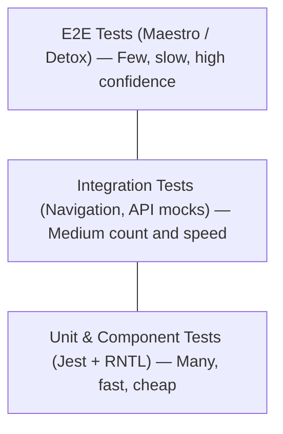
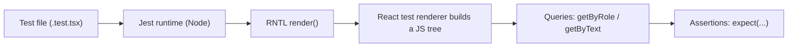
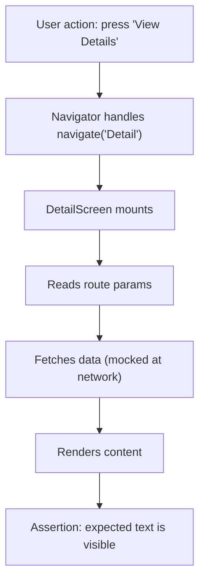
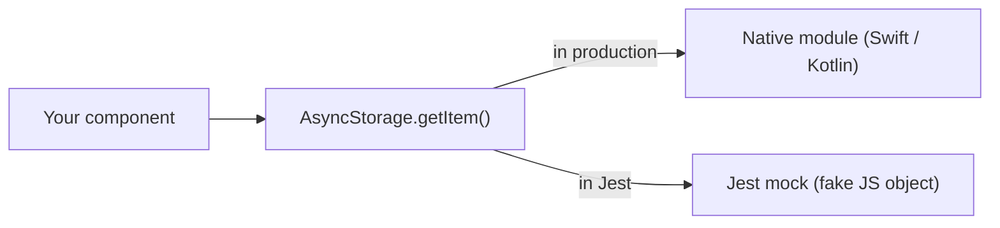
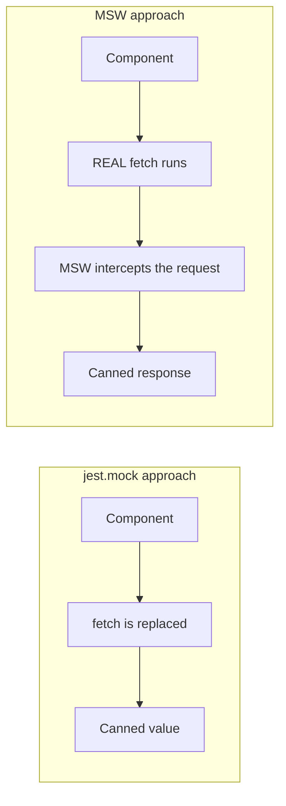
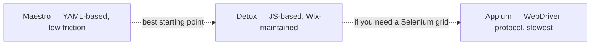
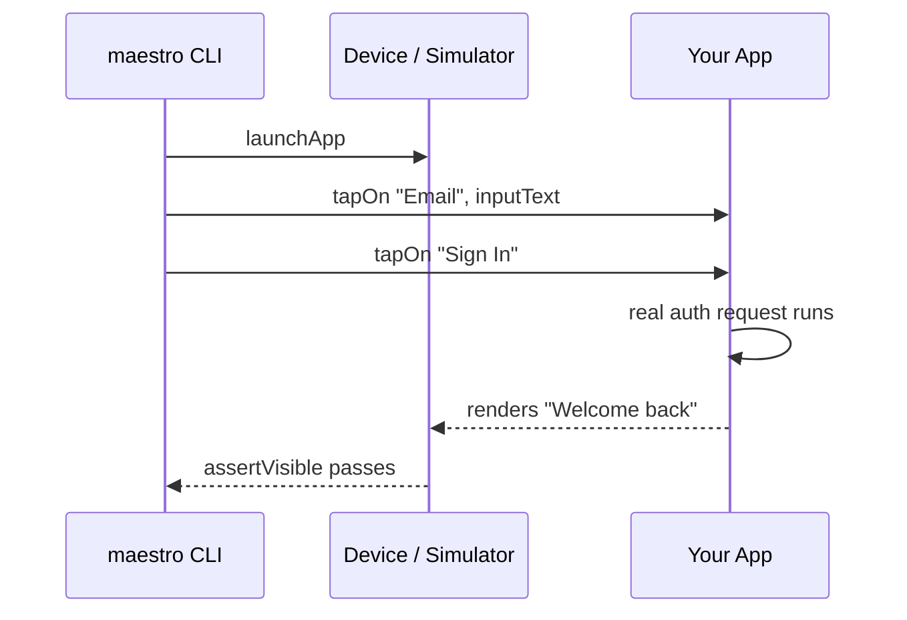
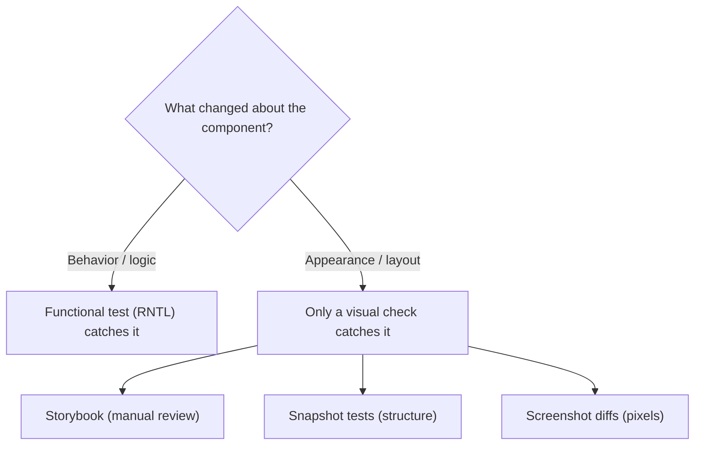
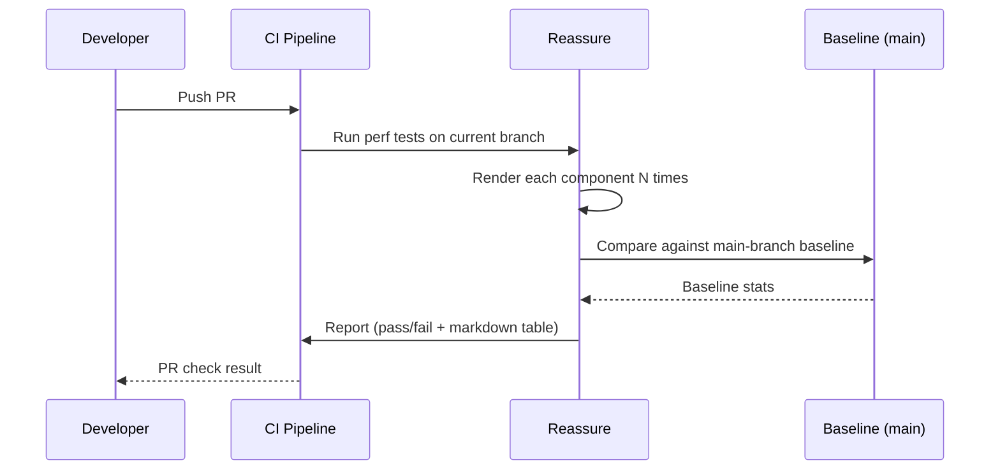

# Testing: From Unit Tests to Device Automation

> Jest, React Native Testing Library, Maestro, and the testing pyramid for mobile apps.

---

## Table of Contents
1. [Unit and Component Testing](#1-unit-and-component-testing)
2. [Integration Testing](#2-integration-testing)
3. [End-to-End Testing](#3-end-to-end-testing)
4. [Visual Regression](#4-visual-regression)
5. [Performance Regression](#5-performance-regression)

---

## 1. Unit and Component Testing

On the web, you've probably already written tests with Jest and React Testing Library. Good news: React Native testing looks almost identical. The mental model is the same — render a component, query the tree, assert on what the user would see. The differences are in the renderer and the queries you reach for.

### Why Test at All? (The First-Principles Argument)

A test is a tiny program that runs your real code and screams if the output is wrong. That's it. The value isn't in the test passing today — it's in the test *failing tomorrow* when a teammate (or future you) changes something and breaks a behavior they didn't know existed. Think of tests as **tripwires**: you set them once around the behaviors you care about, and they fire automatically every time someone walks past.

The reason testing matters *more* on mobile than on the web is the feedback loop. On the web, you save a file and see the result in a browser tab in 200ms. On mobile, verifying a change by hand means rebuilding the app, waiting for the bundler, reinstalling on a simulator, and tapping through screens — sometimes a 2-3 minute round trip per check. A unit test runs the same logic in **milliseconds, in Node, with no device at all**. That speed difference is why a strong test suite is one of the highest-leverage investments a mobile team can make.

### The Testing Pyramid for Mobile

Before writing a single test, understand where your effort pays off. The "testing pyramid" is a rule of thumb about *proportion*: many cheap tests at the bottom, few expensive tests at the top.



Each layer trades **speed** for **realism**. Why not just write all E2E tests, since they're the most realistic? Because they're slow, flaky, and when one fails it often doesn't tell you *where* the bug is — only that *something* broke somewhere in a long flow. A unit test that fails points at one function. Most of your tests should live at the bottom; move up the pyramid only when the lower layers genuinely can't cover a scenario — like testing that a real swipe gesture navigates between screens.

| Layer | What it proves | Speed | Failure points at | When you reach for it |
|-------|----------------|-------|-------------------|-----------------------|
| Unit / Component | One piece works in isolation | Milliseconds | A single function/component | Always — your default |
| Integration | Pieces work together | Tens of ms | A wiring/contract between parts | Navigation, forms, API flows |
| E2E | The real app works on a device | Seconds–minutes | "Something in this flow" | Critical paths only (login, checkout) |

> **Pro tip:** The pyramid is a guide, not a law. A useful sanity check: if a test is slow *and* flaky *and* hard to debug, push that coverage down a layer. If a behavior can only exist on a real device (gestures, push notifications, deep links), that's exactly when moving up is justified.

### Setup

React Native ships with Jest pre-configured. You only need to add the testing library:

```bash
npm install --save-dev @testing-library/react-native
```

That's it. No browser, no jsdom. React Native Testing Library (RNTL) renders your components using React's test renderer and gives you queries that mirror what a real user would do: find elements by their role, label, or visible text.

Here's the mental model of what happens when a test runs — note that **no device or simulator is involved**:



Compared to the web: on the web, React Testing Library renders into **jsdom**, a fake DOM made of `<div>` and `<button>` nodes. In React Native there is no DOM at all — RNTL renders into a tree of native component descriptors (`View`, `Text`, `Pressable`). The queries feel the same, but the tree underneath is React Native's, not HTML's.

### Writing Your First Component Test

Say you have a simple `Counter` component:

```tsx
// Counter.tsx
import { View, Text, Pressable } from "react-native";
import { useState } from "react";

export function Counter() {
  const [count, setCount] = useState(0);

  return (
    <View>
      <Text accessibilityRole="text">Count: {count}</Text>
      <Pressable
        accessibilityRole="button"
        accessibilityLabel="Increment"
        onPress={() => setCount((c) => c + 1)}
      >
        <Text>+1</Text>
      </Pressable>
    </View>
  );
}
```

```tsx
// Counter.test.tsx
import { render, screen, fireEvent } from "@testing-library/react-native";
import { Counter } from "./Counter";

test("increments the count on press", () => {
  render(<Counter />);

  // Arrange is done by render(); now Assert the starting state
  expect(screen.getByText("Count: 0")).toBeTruthy();

  // Act: simulate the user pressing the button
  fireEvent.press(screen.getByRole("button", { name: "Increment" }));

  // Assert: the screen now reflects the new state
  expect(screen.getByText("Count: 1")).toBeTruthy();
});
```

Every test follows the same **Arrange → Act → Assert** rhythm: set up the world, do the thing, check the result. Once you see this shape, every test in this chapter reads the same way.

Notice: you're querying by `role` and `name`, not by test ID. This is intentional. If you query by `testID`, your tests pass even when the accessibility tree is broken. Query by role and label, and you get accessibility coverage **for free** — a screen-reader user finds the button the same way your test does. There's a priority order worth memorizing for which query to reach for:

| Query | Finds elements by | Use it for | Priority |
|-------|-------------------|------------|----------|
| `getByRole` | Accessibility role + name | Buttons, headers, interactive elements | Highest — most user-like |
| `getByText` | Visible text content | Labels, messages, any rendered copy | High |
| `getByLabelText` | `accessibilityLabel` | Inputs and icons with no visible text | High |
| `getByPlaceholderText` | TextInput placeholder | Empty form fields | Medium |
| `getByTestId` | `testID` prop | Last resort when nothing else works | Lowest — invisible to users |

> **Gotcha:** React Native's accessibility roles are not the same as web ARIA roles. `<Pressable>` does not automatically have `role="button"` — you need to set `accessibilityRole="button"` explicitly. Forget this and your `getByRole` queries will silently fail. (On the web, `<button>` is a button for free; in RN, *you* declare the role.)

There's also a key difference between query prefixes that trips up beginners:

| Prefix | If not found | If found | Waits for async? |
|--------|--------------|----------|------------------|
| `getBy...` | Throws immediately | Returns element | No |
| `queryBy...` | Returns `null` | Returns element | No |
| `findBy...` | Throws after timeout | Returns a Promise | **Yes** |

Use `queryBy` when you want to assert something is **absent** (`expect(screen.queryByText("Error")).toBeNull()`), and `findBy` when the element appears **after** an async update (a fetch, a navigation, a timer).

### Testing Custom Hooks

For hooks that don't render UI, use `renderHook` from RNTL:

```tsx
import { renderHook, act } from "@testing-library/react-native";
import { useCounter } from "./useCounter";

test("useCounter increments", () => {
  const { result } = renderHook(() => useCounter(0));

  // result.current always points at the hook's latest return value
  act(() => {
    result.current.increment();
  });

  expect(result.current.count).toBe(1);
});
```

A hook can't be called outside a component — React would throw. `renderHook` solves this by mounting a tiny invisible host component that calls your hook and exposes its return value on `result.current`. The `act()` wrapper tells React "I'm about to trigger a state update; flush all the resulting re-renders before I make assertions." Skip `act()` around a state change and React warns that an update happened outside of `act`, meaning your assertion may run against a stale value.

On the web you'd install `@testing-library/react-hooks` as a separate package. In React Native, `renderHook` ships directly inside `@testing-library/react-native` since v12. One less dependency to manage.

### Common Mistakes

- **Wrapping everything in `testID` queries.** This makes tests pass when the component is visually broken. Prefer `getByRole`, `getByText`, `getByLabelText`.
- **Not wrapping state updates in `act()`.** If your test warns about state updates not being wrapped, you have an async update that needs `waitFor` or `findBy*`.
- **Testing implementation details.** Don't assert on internal state. Assert on what appears on screen. The test should survive a refactor that keeps behavior identical — if renaming a state variable breaks your test, the test was watching the wrong thing.
- **Over-mocking.** If you mock so much that the test only exercises mocks, it proves nothing. Mock the *boundaries* (network, native modules), run the *real* component code.

---

## 2. Integration Testing

Unit tests prove individual components work. Integration tests prove they work *together* — that pressing a button navigates to the right screen, that submitting a form sends the right API request and displays the response.

The mental shift is this: a unit test puts one component on a stage alone. An integration test assembles several real pieces — a navigator, a few screens, a data layer — and checks that the **contracts between them** hold. Bugs love to hide in those seams: a screen name misspelled in a `navigate()` call, a route param the destination screen expects but never receives, a response shape the UI doesn't handle. None of those show up when each piece is tested alone.



### Testing Navigation Flows

React Navigation provides a testing utility that lets you render a full navigator in a test. You don't need a simulator:

```tsx
import { render, screen, fireEvent } from "@testing-library/react-native";
import { NavigationContainer } from "@react-navigation/native";
import { createNativeStackNavigator } from "@react-navigation/native-stack";
import { HomeScreen } from "./HomeScreen";
import { DetailScreen } from "./DetailScreen";

const Stack = createNativeStackNavigator();

// A real, fully-wired navigator — the same one your app would use
function TestApp() {
  return (
    <NavigationContainer>
      <Stack.Navigator>
        <Stack.Screen name="Home" component={HomeScreen} />
        <Stack.Screen name="Detail" component={DetailScreen} />
      </Stack.Navigator>
    </NavigationContainer>
  );
}

test("navigates from Home to Detail on item press", async () => {
  render(<TestApp />);

  fireEvent.press(screen.getByText("View Details"));

  // findBy* WAITS — the transition is async, so getBy* would throw too early
  expect(await screen.findByText("Detail Screen")).toBeTruthy();
});
```

The key insight: you render the entire navigator stack, not just one screen. This catches bugs where navigation params are wrong or the screen name is misspelled — things a unit test on a single screen would miss. Because navigation animations and screen mounts happen asynchronously, you **must** use `findByText` (which polls until the element appears or times out) rather than `getByText` (which checks once and throws instantly).

### Mocking Native Modules

React Native code often depends on native modules — the camera, storage, biometrics. These are written in Swift/Kotlin and compiled into the app binary; they simply **do not exist** in the pure-JavaScript Jest environment. When your code calls `AsyncStorage.getItem()`, there's no native side to answer, so the call would throw. A *mock* is a stand-in: a fake JS object that satisfies the same shape the real module exposes, returning canned values.

```tsx
// jest.setup.js
// Silence the native animation driver that Jest can't load
jest.mock("react-native/Libraries/Animated/NativeAnimatedHelper");

// Most good libraries ship an official mock — use it
jest.mock("@react-native-async-storage/async-storage", () =>
  require("@react-native-async-storage/async-storage/jest/async-storage-mock")
);

// Hand-rolled mock: only do this when the library has no official one
jest.mock("react-native-camera", () => ({
  RNCamera: {
    Constants: { Type: { back: "back", front: "front" } },
  },
}));
```



> **Tip:** Most well-maintained native libraries ship their own Jest mock. Check the library's docs before writing your own. A manual mock that drifts from the real API is worse than no mock at all — it can make a broken integration *look* green.

### Mocking Network Requests with MSW

On the web, Mock Service Worker (msw) has become the standard for mocking API calls. It works in React Native too, with one extra setup step:

```bash
npm install --save-dev msw
```

```tsx
// mocks/handlers.ts
import { http, HttpResponse } from "msw";

// Describe what the fake server returns for each endpoint
export const handlers = [
  http.get("https://api.example.com/user", () => {
    return HttpResponse.json({ id: 1, name: "Ada Lovelace" });
  }),
];
```

```tsx
// mocks/server.ts
import { setupServer } from "msw/node";
import { handlers } from "./handlers";

export const server = setupServer(...handlers);
```

```tsx
// jest.setup.js
import { server } from "./mocks/server";

beforeAll(() => server.listen());      // start intercepting
afterEach(() => server.resetHandlers()); // undo per-test overrides
afterAll(() => server.close());         // stop intercepting
```

Why MSW over `jest.mock("fetch")`? Because of **where** the interception happens. `jest.mock` replaces a function in your code — so your test is coupled to *how* you fetch. MSW intercepts one layer lower, at the network request itself. Your component runs its real `fetch` (or `axios`) call, and MSW catches the outgoing request and answers it.



The payoff: if you later refactor from `fetch` to `axios`, the MSW tests **still pass** because they mock the *boundary* (the HTTP request), not the *implementation* (which function you called). Mock the thing that won't change.

> **Pro tip:** Override a handler inside a single test with `server.use(...)` to simulate an error response (e.g. a 500 or a network timeout). Because `afterEach` resets handlers, that override only affects the one test — perfect for verifying your error and loading states.

### Common Mistakes

- **Mocking `navigation.navigate` instead of rendering the real navigator.** You lose coverage on the actual navigation wiring. Only mock navigation when testing a deeply nested component where rendering the full stack is impractical.
- **Forgetting to `await findBy*` after navigation.** Screen transitions are async. Use `findByText` (which waits) instead of `getByText` (which throws immediately).
- **Leaking state between tests.** Forgetting `afterEach(() => server.resetHandlers())` (or not clearing a mocked store) lets one test's setup contaminate the next, producing failures that vanish when you run the test alone.

---

## 3. End-to-End Testing

Unit and integration tests run in Node. They can't test real gestures, real animations, real native module behavior on a device. That's what E2E tests are for.

An E2E test is the closest a robot gets to being a human QA tester. It launches the **actual compiled app** on a real device or simulator, then taps, types, and swipes through the UI exactly as a person would — and asserts that the right things appear. Nothing is mocked; the real navigation, the real network (or a real staging backend), the real native modules all run. That realism is the whole point — and also why E2E tests are slow and occasionally flaky.

### The E2E Landscape in 2026



**Maestro** is the tool I'd recommend for most teams in 2026. It uses YAML to describe flows, requires almost zero setup, and runs on both iOS and Android with the same test file. You don't need to add test IDs everywhere — Maestro can find elements by visible text. It also has built-in tolerance for flakiness: it automatically retries and waits for elements, which removes the single biggest source of E2E pain.

**Detox** is more powerful. It's JavaScript-based, *synchronizes with the app's idle state* (so fewer flaky waits), and gives you fine-grained control. The tradeoff: significantly more setup, especially on CI. Choose Detox if you need complex assertion logic or need to integrate deeply with your JS test infrastructure.

**Appium** uses the WebDriver protocol. It's the most flexible (works with native apps, hybrid apps, even Flutter), but it's also the slowest and most brittle. Unless you're in an organization that already has Appium infrastructure, skip it.

| Tool | Language | Setup effort | Speed | Flakiness handling | When to use |
|------|----------|--------------|-------|--------------------|-------------|
| Maestro | YAML | Minimal | Fast | Built-in retries/waits | Default for most teams; start here |
| Detox | JavaScript | High | Fast | App-idle sync | Complex logic, deep JS test integration |
| Appium | Many (WebDriver) | Very high | Slow | Manual waits | Only if you already run Appium/Selenium |

### Maestro in Practice

Install Maestro:

```bash
# macOS / Linux
curl -Ls "https://get.maestro.mobile.dev" | bash
```

Write a flow in YAML:

```yaml
# flows/login.yaml
appId: com.myapp
---
- launchApp
- tapOn: "Email"
- inputText: "user@example.com"
- tapOn: "Password"
- inputText: "s3cure-pass!"
- tapOn: "Sign In"
- assertVisible: "Welcome back"
```

Run it:

```bash
maestro test flows/login.yaml
```

That's the entire setup. No test IDs required. No build configuration. Maestro finds the "Email" field by its visible text or accessibility label, types into it, and asserts the result. Read the YAML top to bottom and it reads like a manual test script you'd hand to a human tester — that legibility is Maestro's superpower. On CI, Maestro Cloud runs your flows against real devices and gives you video recordings of failures, which turns "it failed on CI but works on my machine" into a watchable replay.



### Detox: When You Need More Control

```tsx
// e2e/login.test.ts
describe("Login flow", () => {
  beforeAll(async () => {
    await device.launchApp();
  });

  it("should log in successfully", async () => {
    await element(by.text("Email")).tap();
    await element(by.text("Email")).typeText("user@example.com");
    await element(by.text("Password")).tap();
    await element(by.text("Password")).typeText("s3cure-pass!");
    await element(by.text("Sign In")).tap();
    await expect(element(by.text("Welcome back"))).toBeVisible();
  });
});
```

Notice there are almost no explicit waits in that test. That's the heart of Detox: **gray-box synchronization**. Detox can see inside the app and knows when animations, timers, and network requests have settled, so it automatically waits for the app to be *idle* before running the next step. Compare to Appium, which is *black-box* — it can only poke at the UI from outside and guess when to proceed, which is why Appium tests are littered with manual `sleep()` calls and still flake.

That same synchronization is also Detox's footgun: an app that's *never* idle — a looping animation, an infinite polling timer, a websocket that never closes — makes Detox wait forever. When a Detox test hangs, the cause is almost always "something in the app never told Detox it was done."

> **Gotcha:** E2E tests are expensive. A full Detox suite on CI can take 20-40 minutes. Keep your E2E suite small — cover critical paths (login, purchase, onboarding) and leave the rest to lower layers of the pyramid. A good rule: if a bug in this flow would page someone at 3am, it deserves an E2E test. Otherwise, push it down.

---

## 4. Visual Regression

Functional tests tell you the component *works*. Visual regression tests tell you it still *looks right*. A button can pass every functional test while being invisible because someone set its opacity to 0, gave it white text on a white background, or pushed it off-screen with a stray margin. Functional assertions check *behavior*; visual checks guard *appearance* — and on a polished mobile app, appearance is the product.



### Storybook for React Native

Storybook works in React Native, and it's your best tool for visual testing. The core idea: a **story** is one component frozen in one specific state (a primary button, a disabled button, a button mid-loading). Instead of clicking through your real app to reach that state, you jump straight to it in an isolated gallery. You write stories once, then view them on-device or in a web-based UI:

```bash
npx storybook@latest init --type react_native
```

```tsx
// Button.stories.tsx
import type { Meta, StoryObj } from "@storybook/react";
import { Button } from "./Button";

const meta: Meta<typeof Button> = {
  title: "Button",
  component: Button,
};
export default meta;

type Story = StoryObj<typeof Button>;

// Each export is one state of the component, ready to eyeball
export const Primary: Story = {
  args: {
    label: "Submit",
    variant: "primary",
  },
};

export const Disabled: Story = {
  args: {
    label: "Submit",
    variant: "primary",
    disabled: true,
  },
};
```

This isolation also speeds up *development*: building a loading state is far faster when you can render it directly than when you have to trigger a slow network call in the real app to see it.

### Snapshot Testing

Jest snapshot tests capture the rendered output of a component and flag when it changes:

```tsx
import { render } from "@testing-library/react-native";
import { Button } from "./Button";

test("Button matches snapshot", () => {
  const tree = render(<Button label="Submit" variant="primary" />);
  // First run: writes a .snap file. Later runs: compares against it.
  expect(tree.toJSON()).toMatchSnapshot();
});
```

How it works: the first time the test runs, Jest serializes the rendered tree to a `__snapshots__/*.snap` file and commits it. On every later run, Jest re-renders and diffs against that saved file — any difference fails the test. To accept an intentional change, you run `jest -u` to update the snapshot.

The danger is that snapshots catch *every* change, including intentional ones, which trains developers to reflexively run `jest -u` without reading the diff — at which point the snapshot guards nothing. And critically, a structural snapshot does **not** prove the component *looks* right: it records that a `View` with certain props exists, not that the pixels are correct. Use them sparingly — they're best for small, stable components like icons or badges, not for entire screens.

| Approach | What it actually compares | Catches a color/opacity bug? | Maintenance cost |
|----------|---------------------------|------------------------------|------------------|
| Storybook (manual) | A human's eyes | Yes (if someone looks) | Low, but not automated |
| Snapshot test | Serialized component tree (structure) | No — only structural changes | Low, but noisy |
| Screenshot diff | Actual rendered pixels | Yes, automatically | Higher (baselines, flaky pixels) |

> **On the web** you'd use Chromatic or Percy for pixel-level visual diffs. For React Native, the ecosystem is less mature. Chromatic supports Storybook for RN in a web rendering mode, but it can't capture native-specific rendering (shadows, platform fonts). For true native visual regression, teams typically screenshot on CI with Detox or Maestro and diff the images with tools like `pixelmatch` or `reg-suit`.

### A Practical Approach

Don't try to achieve pixel-perfect visual coverage on day one. Start here:

1. **Storybook** for component development and manual visual review.
2. **Snapshot tests** for small, stable primitives.
3. **Maestro screenshots** on CI for critical screens — capture a screenshot at the end of an E2E flow and compare against a baseline.

That gives you three layers of visual safety without requiring a mature (and expensive) visual regression platform. Add pixel diffing only once the cheaper layers stop catching the bugs that actually reach users — paying the maintenance cost of flaky-pixel baselines before you need it is a classic premature optimization.

---

## 5. Performance Regression

Your app works. It looks right. But does it *stay fast*? A seemingly innocent change — wrapping a component in an extra `View`, adding a context provider, dropping a `useMemo` — can double render time. You won't notice in development on your flagship phone, but your users will notice on a three-year-old mid-range Android. A **performance regression** is exactly this: code that's still correct and still pretty, but measurably slower than before.

The reason this needs automation is that performance erodes *invisibly and gradually*. No single PR makes the app "feel slow"; a hundred PRs each adding 3ms do. A human reviewer can't eyeball a 6% render regression in a diff. A machine, measuring every PR against a baseline, can.

### Reassure: Performance Testing in CI

Reassure, built by Callstack, measures how long your components take to render and fails your CI pipeline if a change causes a regression:

```bash
npm install --save-dev reassure
```

Write a performance test — it looks almost like a regular test:

```tsx
// FeedList.perf-test.tsx
import { measurePerformance } from "reassure";
import { FeedList } from "./FeedList";

// Realistic data volume matters — 5 items won't reveal a list regression
const mockItems = Array.from({ length: 200 }, (_, i) => ({
  id: String(i),
  title: `Post ${i}`,
  body: "Lorem ipsum dolor sit amet.",
}));

test("FeedList renders 200 items", async () => {
  await measurePerformance(<FeedList items={mockItems} />);
});
```

Reassure runs the render multiple times, collects statistics, and compares against a baseline. The reason it renders *many* times rather than once is **statistical noise**: any single render time is jittery (the OS scheduler, garbage collection, CPU throttling all interfere). By sampling repeatedly and comparing distributions, Reassure can tell a real regression apart from random variance. On CI, it generates a markdown report:

```
| Component         | Baseline (ms) | Current (ms) | Change |
|-------------------|---------------|--------------|--------|
| FeedList (200)    | 45.2          | 48.1         | +6.4%  |
| UserCard          | 2.1           | 2.0          | -4.8%  |
```

You configure a threshold — say, fail the PR if any component regresses by more than 20%. This catches performance problems before they ship.

### How It Works

The crucial mechanic is the **baseline**: Reassure first measures the `main` branch and saves those numbers, then measures your PR branch and compares. It's a before-and-after photo, not an absolute speed limit — which is what makes it portable across CI machines of different speeds.



### What to Measure

Don't measure everything — a sprawling suite that takes 20 minutes gets ignored, and an ignored test catches nothing. Focus on where render cost actually concentrates:

- **Lists with many items.** A `FlatList` rendering 100+ items is where regressions hurt most.
- **Screens that re-render often.** Chat screens, live dashboards, anything with real-time data.
- **Expensive components.** Charts, maps, media players.

A small, focused suite of 10-15 performance tests catches more regressions than a sprawling suite that takes 20 minutes to run and gets ignored.

> **Gotcha:** Reassure measures *render time in the JS thread*, not native-side performance. It won't catch a regression caused by a heavy native animation or a bridge bottleneck. For native-side profiling, you still need React Native DevTools, Flipper, or Xcode Instruments — but those are manual tools, not CI-friendly. In short: green Reassure means "your JS didn't get slower," not "your app is fast."

### Combining the Layers

Here's a testing strategy that works for most React Native teams. Notice how it mirrors the pyramid from Section 1 — cheap and plentiful at the bottom, expensive and sparse at the top:

| Layer | Tool | Count | Runs In |
|-------|------|-------|---------|
| Unit / Component | Jest + RNTL | 100+ | CI (seconds) |
| Integration | Jest + RNTL + MSW | 20-50 | CI (seconds) |
| E2E | Maestro | 5-15 | CI (minutes) |
| Visual | Storybook + snapshots | Per component | CI + manual |
| Performance | Reassure | 10-15 | CI (seconds) |

The bottom layers run fast, catch most bugs, and give you confidence to ship. The top layers run slower but catch the real-world issues that no unit test can. Together, they form a safety net that lets you move fast without breaking your users' experience — the entire point of testing is not to prove the app works *today*, but to make it *safe to change tomorrow*.