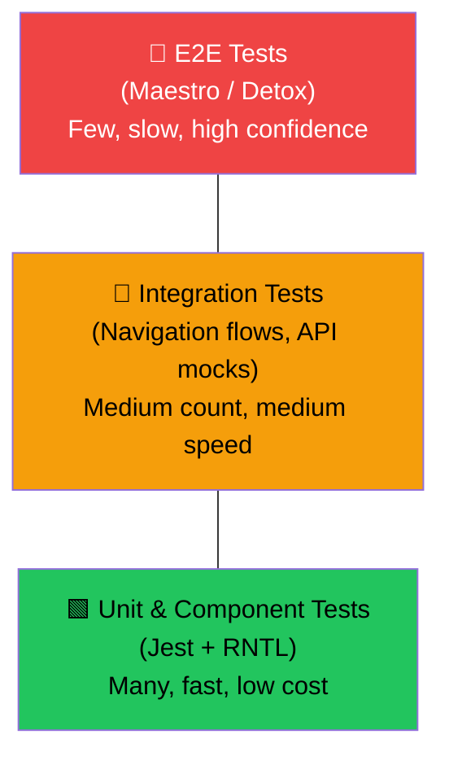
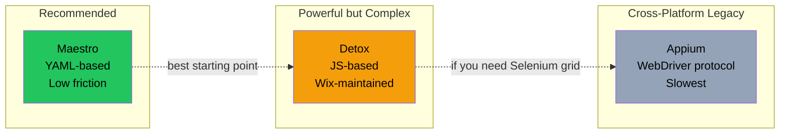
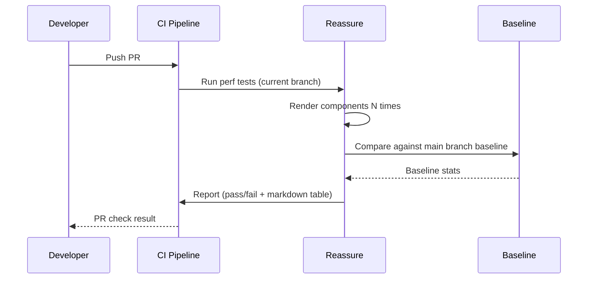

# Testing: From Unit Tests to Device Automation

> Jest, React Native Testing Library, Maestro, and the testing pyramid for mobile apps.

---

## Table of Contents
1. [Unit and Component Testing](#1-unit-and-component-testing)
2. [Integration Testing](#2-integration-testing)
3. [End-to-End Testing](#3-end-to-end-testing)
4. [Visual Regression](#4-visual-regression)
5. [Performance Regression](#5-performance-regression)

---

## 1. Unit and Component Testing

On the web, you've probably already written tests with Jest and React Testing Library. Good news: React Native testing looks almost identical. The mental model is the same — render a component, query the tree, assert on what the user would see. The differences are in the renderer and the queries you reach for.

### The Testing Pyramid for Mobile

Before writing a single test, understand where your effort pays off:



Most of your tests should live at the bottom. Unit and component tests are fast, cheap, and catch the majority of regressions. Move up the pyramid only when the lower layers can't cover a scenario — like testing that a real gesture navigates between screens.

### Setup

React Native ships with Jest pre-configured. You only need to add the testing library:

```bash
npm install --save-dev @testing-library/react-native
```

That's it. No browser, no jsdom. React Native Testing Library (RNTL) renders your components using React's test renderer and gives you queries that mirror what a real user would do: find elements by their role, label, or visible text.

### Writing Your First Component Test

Say you have a simple `Counter` component:

```tsx
// Counter.tsx
import { View, Text, Pressable } from "react-native";
import { useState } from "react";

export function Counter() {
  const [count, setCount] = useState(0);

  return (
    <View>
      <Text accessibilityRole="text">Count: {count}</Text>
      <Pressable
        accessibilityRole="button"
        accessibilityLabel="Increment"
        onPress={() => setCount((c) => c + 1)}
      >
        <Text>+1</Text>
      </Pressable>
    </View>
  );
}
```

```tsx
// Counter.test.tsx
import { render, screen, fireEvent } from "@testing-library/react-native";
import { Counter } from "./Counter";

test("increments the count on press", () => {
  render(<Counter />);

  expect(screen.getByText("Count: 0")).toBeTruthy();

  fireEvent.press(screen.getByRole("button", { name: "Increment" }));

  expect(screen.getByText("Count: 1")).toBeTruthy();
});
```

Notice: you're querying by `role` and `name`, not by test ID. This is intentional. If you query by `testID`, your tests pass even when the accessibility tree is broken. Query by role and label, and you get accessibility coverage for free.

> **Gotcha:** React Native's accessibility roles are not the same as web ARIA roles. `<Pressable>` does not automatically have `role="button"` — you need to set `accessibilityRole="button"` explicitly. Forget this and your `getByRole` queries will silently fail.

### Testing Custom Hooks

For hooks that don't render UI, use `renderHook` from RNTL:

```tsx
import { renderHook, act } from "@testing-library/react-native";
import { useCounter } from "./useCounter";

test("useCounter increments", () => {
  const { result } = renderHook(() => useCounter(0));

  act(() => {
    result.current.increment();
  });

  expect(result.current.count).toBe(1);
});
```

On the web you'd install `@testing-library/react-hooks` as a separate package. In React Native, `renderHook` ships directly inside `@testing-library/react-native` since v12. One less dependency to manage.

### Common Mistakes

- **Wrapping everything in `testID` queries.** This makes tests pass when the component is visually broken. Prefer `getByRole`, `getByText`, `getByLabelText`.
- **Not wrapping state updates in `act()`.** If your test warns about state updates not being wrapped, you have an async update that needs `waitFor`.
- **Testing implementation details.** Don't assert on internal state. Assert on what appears on screen.

---

## 2. Integration Testing

Unit tests prove individual components work. Integration tests prove they work *together* — that pressing a button navigates to the right screen, that submitting a form sends the right API request and displays the response.

### Testing Navigation Flows

React Navigation provides a testing utility that lets you render a full navigator in a test. You don't need a simulator:

```tsx
import { render, screen, fireEvent } from "@testing-library/react-native";
import { NavigationContainer } from "@react-navigation/native";
import { createNativeStackNavigator } from "@react-navigation/native-stack";
import { HomeScreen } from "./HomeScreen";
import { DetailScreen } from "./DetailScreen";

const Stack = createNativeStackNavigator();

function TestApp() {
  return (
    <NavigationContainer>
      <Stack.Navigator>
        <Stack.Screen name="Home" component={HomeScreen} />
        <Stack.Screen name="Detail" component={DetailScreen} />
      </Stack.Navigator>
    </NavigationContainer>
  );
}

test("navigates from Home to Detail on item press", async () => {
  render(<TestApp />);

  fireEvent.press(screen.getByText("View Details"));

  expect(await screen.findByText("Detail Screen")).toBeTruthy();
});
```

The key insight: you render the entire navigator stack, not just one screen. This catches bugs where navigation params are wrong or the screen name is misspelled — things a unit test on a single screen would miss.

### Mocking Native Modules

React Native code often depends on native modules — the camera, storage, biometrics. These don't exist in the Jest environment. You mock them:

```tsx
// jest.setup.js
jest.mock("react-native/Libraries/Animated/NativeAnimatedHelper");

jest.mock("@react-native-async-storage/async-storage", () =>
  require("@react-native-async-storage/async-storage/jest/async-storage-mock")
);

jest.mock("react-native-camera", () => ({
  RNCamera: {
    Constants: { Type: { back: "back", front: "front" } },
  },
}));
```

> **Tip:** Most well-maintained native libraries ship their own Jest mock. Check the library's docs before writing your own. A manual mock that drifts from the real API is worse than no mock at all.

### Mocking Network Requests with MSW

On the web, Mock Service Worker (msw) has become the standard for mocking API calls. It works in React Native too, with one extra setup step:

```bash
npm install --save-dev msw
```

```tsx
// mocks/handlers.ts
import { http, HttpResponse } from "msw";

export const handlers = [
  http.get("https://api.example.com/user", () => {
    return HttpResponse.json({ id: 1, name: "Ada Lovelace" });
  }),
];
```

```tsx
// mocks/server.ts
import { setupServer } from "msw/node";
import { handlers } from "./handlers";

export const server = setupServer(...handlers);
```

```tsx
// jest.setup.js
import { server } from "./mocks/server";

beforeAll(() => server.listen());
afterEach(() => server.resetHandlers());
afterAll(() => server.close());
```

Why MSW over `jest.mock("fetch")`? Because MSW intercepts at the network level. Your component code uses the real `fetch` call. If you refactor from `fetch` to `axios`, the tests still pass. Mock the boundary, not the implementation.

### Common Mistakes

- **Mocking `navigation.navigate` instead of rendering the real navigator.** You lose coverage on the actual navigation wiring. Only mock navigation when testing a deeply nested component where rendering the full stack is impractical.
- **Forgetting to `await findBy*` after navigation.** Screen transitions are async. Use `findByText` (which waits) instead of `getByText` (which throws immediately).

---

## 3. End-to-End Testing

Unit and integration tests run in Node. They can't test real gestures, real animations, real native module behavior on a device. That's what E2E tests are for.

### The E2E Landscape in 2026



**Maestro** is the tool I'd recommend for most teams in 2026. It uses YAML to describe flows, requires almost zero setup, and runs on both iOS and Android with the same test file. You don't need to add test IDs everywhere — Maestro can find elements by visible text.

**Detox** is more powerful. It's JavaScript-based, synchronizes with the app's idle state (so fewer flaky waits), and gives you fine-grained control. The tradeoff: significantly more setup, especially on CI. Choose Detox if you need complex assertion logic or need to integrate deeply with your JS test infrastructure.

**Appium** uses the WebDriver protocol. It's the most flexible (works with native apps, hybrid apps, even Flutter), but it's also the slowest and most brittle. Unless you're in an organization that already has Appium infrastructure, skip it.

### Maestro in Practice

Install Maestro:

```bash
# macOS / Linux
curl -Ls "https://get.maestro.mobile.dev" | bash
```

Write a flow in YAML:

```yaml
# flows/login.yaml
appId: com.myapp
---
- launchApp
- tapOn: "Email"
- inputText: "user@example.com"
- tapOn: "Password"
- inputText: "s3cure-pass!"
- tapOn: "Sign In"
- assertVisible: "Welcome back"
```

Run it:

```bash
maestro test flows/login.yaml
```

That's the entire setup. No test IDs required. No build configuration. Maestro finds the "Email" field by its visible text or accessibility label, types into it, and asserts the result. On CI, Maestro Cloud runs your flows against real devices and gives you video recordings of failures.

### Detox: When You Need More Control

```tsx
// e2e/login.test.ts
describe("Login flow", () => {
  beforeAll(async () => {
    await device.launchApp();
  });

  it("should log in successfully", async () => {
    await element(by.text("Email")).tap();
    await element(by.text("Email")).typeText("user@example.com");
    await element(by.text("Password")).tap();
    await element(by.text("Password")).typeText("s3cure-pass!");
    await element(by.text("Sign In")).tap();
    await expect(element(by.text("Welcome back"))).toBeVisible();
  });
});
```

Detox synchronizes with your app — it waits for animations and network calls to finish before proceeding. This makes tests less flaky than Appium, but the synchronization system itself can be a source of confusion when it waits forever on a polling timer or a looping animation.

> **Gotcha:** E2E tests are expensive. A full Detox suite on CI can take 20-40 minutes. Keep your E2E suite small — cover critical paths (login, purchase, onboarding) and leave the rest to lower layers of the pyramid.

---

## 4. Visual Regression

Functional tests tell you the component *works*. Visual regression tests tell you it still *looks right*. A button can pass every functional test while being invisible because someone set its opacity to 0.

### Storybook for React Native

Storybook works in React Native, and it's your best tool for visual testing. You write stories for your components, then view them on-device or in a web-based UI:

```bash
npx storybook@latest init --type react_native
```

```tsx
// Button.stories.tsx
import type { Meta, StoryObj } from "@storybook/react";
import { Button } from "./Button";

const meta: Meta<typeof Button> = {
  title: "Button",
  component: Button,
};
export default meta;

type Story = StoryObj<typeof Button>;

export const Primary: Story = {
  args: {
    label: "Submit",
    variant: "primary",
  },
};

export const Disabled: Story = {
  args: {
    label: "Submit",
    variant: "primary",
    disabled: true,
  },
};
```

### Snapshot Testing

Jest snapshot tests capture the rendered output of a component and flag when it changes:

```tsx
import { render } from "@testing-library/react-native";
import { Button } from "./Button";

test("Button matches snapshot", () => {
  const tree = render(<Button label="Submit" variant="primary" />);
  expect(tree.toJSON()).toMatchSnapshot();
});
```

Snapshots are blunt instruments. They catch *every* change, including intentional ones, which leads to developers blindly updating snapshots. Use them sparingly — they're best for small, stable components like icons or badges, not for entire screens.

> **On the web** you'd use Chromatic or Percy for pixel-level visual diffs. For React Native, the ecosystem is less mature. Chromatic supports Storybook for RN in a web rendering mode, but it can't capture native-specific rendering (shadows, platform fonts). For true native visual regression, teams typically screenshot on CI with Detox or Maestro and diff the images with tools like `pixelmatch` or `reg-suit`.

### A Practical Approach

Don't try to achieve pixel-perfect visual coverage on day one. Start here:

1. **Storybook** for component development and manual visual review.
2. **Snapshot tests** for small, stable primitives.
3. **Maestro screenshots** on CI for critical screens — capture a screenshot at the end of an E2E flow and compare against a baseline.

That gives you three layers of visual safety without requiring a mature (and expensive) visual regression platform.

---

## 5. Performance Regression

Your app works. It looks right. But does it *stay fast*? A seemingly innocent change — wrapping a component in an extra `View`, adding a context provider — can double render time. You won't notice in development, but your users will notice on a three-year-old Android phone.

### Reassure: Performance Testing in CI

Reassure, built by Callstack, measures how long your components take to render and fails your CI pipeline if a change causes a regression:

```bash
npm install --save-dev reassure
```

Write a performance test — it looks almost like a regular test:

```tsx
// FeedList.perf-test.tsx
import { measurePerformance } from "reassure";
import { FeedList } from "./FeedList";

const mockItems = Array.from({ length: 200 }, (_, i) => ({
  id: String(i),
  title: `Post ${i}`,
  body: "Lorem ipsum dolor sit amet.",
}));

test("FeedList renders 200 items", async () => {
  await measurePerformance(<FeedList items={mockItems} />);
});
```

Reassure runs the render multiple times, collects statistics, and compares against a baseline. On CI, it generates a markdown report:

```
| Component         | Baseline (ms) | Current (ms) | Change |
|-------------------|---------------|--------------|--------|
| FeedList (200)    | 45.2          | 48.1         | +6.4%  |
| UserCard          | 2.1           | 2.0          | -4.8%  |
```

You configure a threshold — say, fail the PR if any component regresses by more than 20%. This catches performance problems before they ship.

### How It Works



### What to Measure

Don't measure everything. Focus on:

- **Lists with many items.** FlatList rendering 100+ items is where regressions hurt most.
- **Screens that re-render often.** Chat screens, live dashboards, anything with real-time data.
- **Expensive components.** Charts, maps, media players.

A small, focused suite of 10-15 performance tests catches more regressions than a sprawling suite that takes 20 minutes to run and gets ignored.

> **Gotcha:** Reassure measures *render time in the JS thread*, not native-side performance. It won't catch a regression caused by a heavy native animation or a bridge bottleneck. For native-side profiling, you still need Flipper or Xcode Instruments — but those are manual tools, not CI-friendly.

### Combining the Layers

Here's a testing strategy that works for most React Native teams:

| Layer | Tool | Count | Runs In |
|-------|------|-------|---------|
| Unit / Component | Jest + RNTL | 100+ | CI (seconds) |
| Integration | Jest + RNTL + MSW | 20-50 | CI (seconds) |
| E2E | Maestro | 5-15 | CI (minutes) |
| Visual | Storybook + snapshots | Per component | CI + manual |
| Performance | Reassure | 10-15 | CI (seconds) |

The bottom layers run fast, catch most bugs, and give you confidence to ship. The top layers run slower but catch the real-world issues that no unit test can. Together, they form a safety net that lets you move fast without breaking your users' experience.