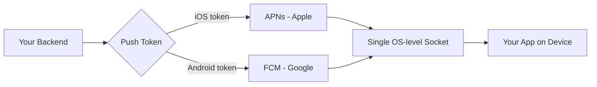
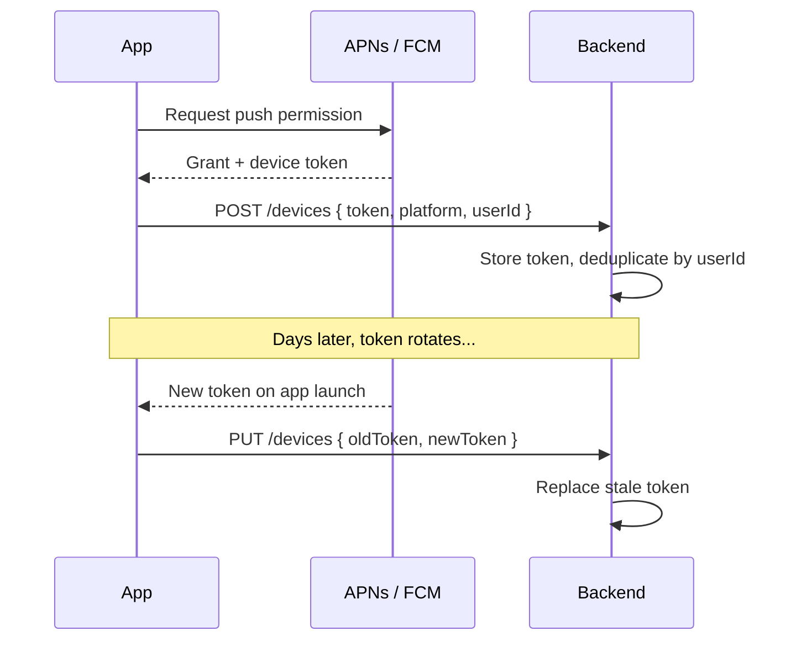
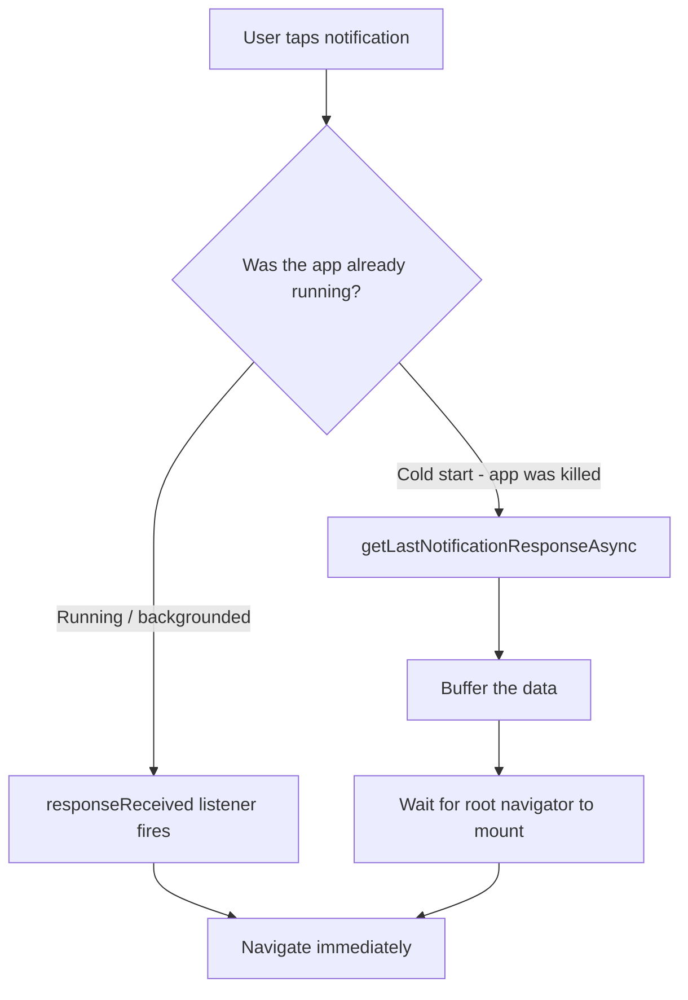
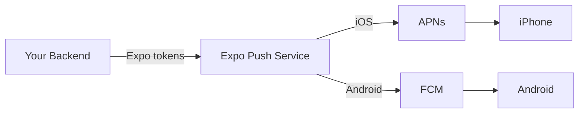
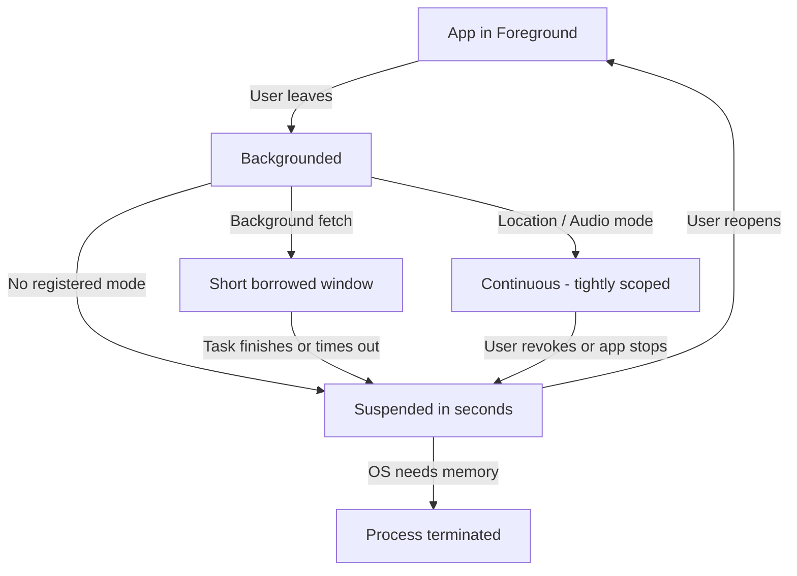
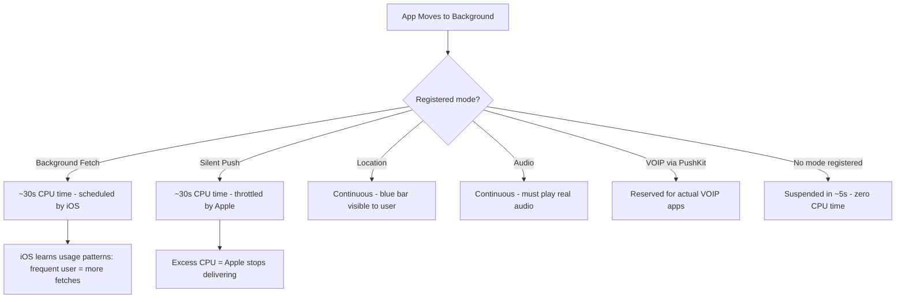

# Push Notifications and Background Tasks

> APNs, FCM, background fetch, and the platform constraints that shape how mobile apps wake up.

---

## Table of Contents

1. [Push Notifications](#1-push-notifications)
2. [Backend Services](#2-backend-services)
3. [Background Work](#3-background-work)
4. [Background Limits](#4-background-limits)

---

## 1. Push Notifications

On the web, you have the Push API and service workers. You register a service worker, subscribe for push events, and the browser handles delivery. It works reasonably well. Now forget all of that.

On mobile, every single push notification on iOS goes through Apple Push Notification service (APNs). Every notification on Android goes through Firebase Cloud Messaging (FCM). There is no alternative. You cannot open a persistent WebSocket from the background and deliver your own alerts. The OS owns the notification pipeline, and it decides when your app wakes up.

This design exists for a reason: battery life. If every app maintained its own persistent connection, your phone would die by lunch. APNs and FCM maintain a single system-level connection and multiplex all app notifications over it.

### The Mental Model: Who Actually Delivers the Notification?

The single biggest shift from web is that **your server never talks to the user's device directly**. Think of APNs and FCM as the only two post offices in the country. You (your backend) cannot drive a truck to someone's house and drop off a letter. You hand the letter to the post office, with the recipient's mailbox address (the *push token*), and the post office decides when and whether it gets delivered.

That single system-level connection is the key insight. Your phone holds exactly one always-on socket to Apple's servers and one to Google's. When a notification arrives for *any* app, it comes down that shared pipe and the OS fans it out to the right app. This is why you cannot "just keep a WebSocket open" — a thousand apps each holding a socket open would drain the battery in hours.



> **Web vs RN:** On the web, the browser is the gatekeeper and push generally "just works" once the user subscribes. On mobile, the *operating system* is the gatekeeper, and it is far stricter — it can throttle, delay, or silently drop your notifications based on battery state, user habits, and how well-behaved your app has been.

### The Easiest Path: expo-notifications

If you are using Expo (and for most React Native projects, you should be), `expo-notifications` abstracts APNs and FCM behind one API. You request permission, get a push token, and listen for incoming notifications without writing a line of native code.

```bash
npx expo install expo-notifications expo-device expo-constants
```

```tsx
import * as Notifications from "expo-notifications";
import * as Device from "expo-device";
import { Platform } from "react-native";

// Configure foreground notification behavior
Notifications.setNotificationHandler({
  handleNotification: async () => ({
    shouldShowAlert: true,
    shouldPlaySound: true,
    shouldSetBadge: true,
  }),
});

async function registerForPushNotifications(): Promise<string | null> {
  // Push only works on physical devices
  if (!Device.isDevice) {
    console.warn("Push notifications require a physical device");
    return null;
  }

  const { status: existing } = await Notifications.getPermissionsAsync();
  let finalStatus = existing;

  if (existing !== "granted") {
    const { status } = await Notifications.requestPermissionsAsync();
    finalStatus = status;
  }

  if (finalStatus !== "granted") return null;

  // Android requires an explicit notification channel
  if (Platform.OS === "android") {
    await Notifications.setNotificationChannelAsync("default", {
      name: "Default",
      importance: Notifications.AndroidImportance.MAX,
      vibrationPattern: [0, 250, 250, 250],
    });
  }

  const token = (
    await Notifications.getExpoPushTokenAsync({
      projectId: "your-expo-project-id",
    })
  ).data;

  return token;
}
```

#### Why each step exists

Beginners often copy this function without understanding *why* it is shaped this way. Each line is defending against a real-world failure:

- **`Device.isDevice` check** — Push tokens cannot be issued on a simulator/emulator (there is no real APNs/FCM registration). If you forget this, your code throws a confusing error on the iOS Simulator.
- **Check existing permission before asking** — On iOS, you only get to *prompt* the user once. If they say no, calling `requestPermissionsAsync` again does nothing — the prompt never reappears. So you check the current state first and only prompt when you genuinely have not asked yet.
- **Android notification channels** — Since Android 8 (Oreo), every notification must belong to a *channel*. A channel bundles sound, vibration, and importance settings that the **user** can override in system settings. No channel means your notification silently fails to display on modern Android.
- **`getExpoPushTokenAsync`** — This returns an *Expo* push token (`ExponentPushToken[...]`), not a raw APNs/FCM token. Expo's backend translates it later. If you go bare React Native, you would instead get the native device token directly.

> **Common mistake:** Requesting notification permission on the very first app launch, before the user understands why. Conversion rates are far higher if you show a *pre-permission* explainer screen first ("Get notified when someone replies"), and only then trigger the real OS prompt. You get exactly one shot at the iOS prompt — do not waste it on a cold open.

### Token Management

Most tutorials gloss over this part, and it is where the real bugs live. A push token is not permanent. It rotates when the user reinstalls, restores from backup, or when the OS refreshes it silently. Your architecture must treat the token as ephemeral.

Think of the token like a phone number that can change without warning. If you mail letters to an old number, they bounce — and if you keep mailing dead numbers, the post office (APNs/FCM) starts treating *you* as a spammer and throttles your whole account.



The non-negotiable rules:

- **Register on every launch.** Do not cache the token client-side and assume it is still valid. Call `getExpoPushTokenAsync` on each cold start and send it to your backend.
- **Deduplicate server-side.** Associate tokens with user IDs. One user may have multiple devices. One device may change tokens.
- **Prune dead tokens.** When APNs returns a 410 (Gone) or FCM returns "NotRegistered," delete that token immediately. Repeated sends to dead tokens will get your service throttled.

Here is a minimal client-side registration call you would run on every cold start:

```tsx
async function syncPushToken(userId: string) {
  const token = await registerForPushNotifications();
  if (!token) return; // permission denied or simulator

  // Idempotent: the backend upserts by (userId, token).
  // Sending the same token twice is harmless and expected.
  await fetch("https://api.example.com/devices", {
    method: "POST",
    headers: { "Content-Type": "application/json" },
    body: JSON.stringify({
      token,
      platform: Platform.OS, // "ios" | "android"
      userId,
    }),
  });
}
```

A simple backend table shape that satisfies all three rules:

| Column | Why it exists |
| --- | --- |
| `token` (unique) | The mailbox address; uniqueness lets you upsert safely |
| `user_id` | One user, many devices — group by this to fan out |
| `platform` | Route `ios` vs `android` and pick the right payload shape |
| `last_seen_at` | Prune tokens not refreshed in N days as likely dead |
| `failed_count` | Increment on 410/NotRegistered; delete past a threshold |

> **Pro tip:** Make the registration call *idempotent*. The client will send the same token on most launches — that should be a no-op, not a duplicate row. Upsert on the token, never blind-insert.

### Categories, Actions, and Rich Notifications

Notifications can carry action buttons, inline text replies, and images. You define categories at app startup and reference them from your backend payloads.

A *category* is a reusable template of buttons. You register "what a message notification looks like" once on the device, give it an identifier, and then your server just references that identifier — it never has to re-describe the buttons each time.

```tsx
// Define once at app startup
Notifications.setNotificationCategoryAsync("message", [
  {
    identifier: "reply",
    buttonTitle: "Reply",
    textInput: { submitButtonTitle: "Send", placeholder: "Type a reply..." },
  },
  {
    identifier: "mark-read",
    buttonTitle: "Mark as Read",
    options: { isDestructive: false },
  },
]);
```

Your backend then includes `categoryId: "message"` in the push payload. The OS renders the action buttons without your app needing to be open.

The magic here is that the **OS draws and handles those buttons** — your JavaScript is not running when the user long-presses the notification and taps "Reply." The text they type is delivered to your app the next time it wakes, via the response listener. This is why you can reply to a message from the lock screen of an app that was force-quit.

### Silent Pushes for Cache Invalidation

Not every push needs to show a banner. Silent (data-only) pushes wake your app briefly so it can pull fresh data. This is how chat apps pre-load conversations before the user opens the app.

The distinction is about *who sees it*:

| Push type | Shows a banner? | Wakes your code? | Typical use |
| --- | --- | --- | --- |
| **Alert push** | Yes | Only on tap | "You have a new message" |
| **Silent (data-only) push** | No | Yes, briefly in background | Pre-sync data before the user opens the app |
| **Alert + data** | Yes | On tap (and sometimes background) | Banner *and* preload the relevant screen |

```tsx
// Backend sends: { to: token, data: { type: "sync", resource: "messages" }, priority: "high" }

Notifications.addNotificationReceivedListener((notification) => {
  const data = notification.request.content.data;
  if (data.type === "sync") {
    syncResource(data.resource);
  }
});
```

> **Gotcha:** iOS throttles silent pushes aggressively. Apple decides when they arrive, and if your app uses too much CPU during background execution, delivery stops entirely. Never rely on silent pushes for time-critical sync. On iOS the silent-push flag is `content-available: 1`, and the system may coalesce or delay them for hours when the device is in Low Power Mode.

### Deep Linking from Notification Taps

When the user taps a notification, you want to land them on the right screen, not the home page.

There are two distinct cases, and they trip up almost everyone:



```tsx
// Handle taps when the app is already running
Notifications.addNotificationResponseReceivedListener((response) => {
  const data = response.notification.request.content.data;
  if (data.screen === "chat" && data.threadId) {
    navigationRef.navigate("ChatThread", { id: data.threadId });
  }
});

// Handle taps from a cold start (app was killed)
const initialResponse = await Notifications.getLastNotificationResponseAsync();
if (initialResponse) {
  const data = initialResponse.notification.request.content.data;
  // Navigate after your root navigator mounts
}
```

The cold start case is the one that catches people. Your navigation tree does not exist yet when the OS hands you the initial notification. You need to buffer the deep link data and process it after the root navigator mounts.

> **Common mistake:** Calling `navigate()` directly inside the cold-start branch. At that moment your navigator may not be mounted, so the call silently no-ops and the user lands on the home screen — making it look like deep linking "randomly" fails. Store the pending route in a variable or state, then navigate from inside an `onReady` callback once the navigator exists.

---

## 2. Backend Services

You need something between your server and APNs/FCM. You could talk to both APIs directly, but you will spend weeks wrestling with token formats, certificate rotation for APNs, retry logic, and delivery receipts. Use a service.

To make this concrete, here is what you are *actually* signing up for if you talk to Apple and Google directly:

- **APNs** speaks HTTP/2 with a JWT (or certificate) you must sign and rotate, expects a binary-ish payload with specific headers (`apns-priority`, `apns-push-type`), and returns terse status codes you must map to actions.
- **FCM** is a separate REST API with its own auth (a service-account key), its own payload shape, and its own error vocabulary (`NotRegistered`, `MismatchSenderId`).
- You must implement **batching, retries with backoff, and receipt polling** yourself.

A push *service* collapses both of those into one API and one payload shape. That is the value.

### Expo Push Service

Free, integrated into the Expo ecosystem, and the obvious choice if you are already using `expo-notifications`. You POST a JSON payload to Expo's API, and it routes to APNs or FCM based on the token format.

```tsx
// Server-side (Node.js)
const { Expo } = require("expo-server-sdk");
const expo = new Expo();

const messages = [
  {
    to: "ExponentPushToken[xxxxxxxxxxxx]",
    title: "New message",
    body: "Hey, are you coming tonight?",
    data: { screen: "chat", threadId: "abc123" },
    sound: "default",
    categoryId: "message",
  },
];

const chunks = expo.chunkPushNotifications(messages);
for (const chunk of chunks) {
  const tickets = await expo.sendPushNotificationsAsync(chunk);
  // Save ticket IDs, check receipts later for delivery status
}
```

The Expo Push Service is a thin proxy. It does not store tokens, segment users, or run analytics. Your backend owns all that logic. For many teams, this simplicity is a feature, not a limitation.

#### Tickets vs receipts — the part people skip

Expo's delivery is *two-phase*, and understanding this is how you find out a notification actually failed:

1. **Ticket** — returned immediately when you send. It only confirms Expo *accepted* the request. A ticket can say `ok` and the notification can still fail later.
2. **Receipt** — fetched later (after ~15+ minutes) using the ticket ID. This is where you learn the real outcome, including `DeviceNotRegistered`, which is your signal to delete the token.

```tsx
// Later: poll receipts to find dead tokens
const receiptIds = tickets.filter((t) => t.id).map((t) => t.id);
const chunks = expo.chunkPushNotificationReceiptIds(receiptIds);

for (const chunk of chunks) {
  const receipts = await expo.getPushNotificationReceiptsAsync(chunk);
  for (const [id, receipt] of Object.entries(receipts)) {
    if (receipt.status === "error") {
      if (receipt.details?.error === "DeviceNotRegistered") {
        await deleteTokenByReceiptId(id); // prune the dead token
      }
    }
  }
}
```



> **Pro tip:** `chunkPushNotifications` exists because Expo caps how many messages you can send per request. Always send through the chunker rather than POSTing a giant array — it splits the batch for you and keeps you under the limit.

### Comparison

| Service | Best For | Cost | Key Strength |
| ------- | -------- | ---- | ------------ |
| **Expo Push Service** | Expo apps, straightforward delivery | Free | Zero config, just works |
| **Firebase Cloud Messaging** | Android-heavy apps, existing Firebase stack | Free | Direct FCM access, Topics API |
| **OneSignal** | Teams that need segmentation, A/B testing | Free tier, paid at scale | Analytics dashboard, journeys |
| **Knock / Courier** | Multi-channel (push + email + SMS + in-app) | Usage-based | Unified notification orchestration |

**My recommendation:** Start with Expo Push Service. It costs nothing and handles routing for you. Graduate to OneSignal when you need user segmentation or delivery analytics, or to Knock when push is just one channel in a broader notification system. Do not start with the complex option "just in case."

Here is how to think about *when* to move up the ladder:

| You are feeling this pain... | ...graduate to |
| --- | --- |
| "I just need to deliver pushes to my Expo app" | Expo Push Service |
| "I'm Android-first and already use Firebase for everything else" | FCM directly |
| "Marketing wants to send to 'users in France who opened the app this week'" | OneSignal |
| "Push is one of five channels and product wants one orchestration layer" | Knock / Courier |

> **Gotcha:** Even if you use FCM to deliver iOS pushes (FCM can proxy to APNs), you still need to upload your APNs authentication key to Firebase. There is no path that avoids Apple's infrastructure on iOS. Every road to an iPhone ends at Apple's servers.

---

## 3. Background Work

On the web, you have service workers. They can run in the background, handle push events, cache assets, and sync data. The browser gives them a generous execution window.

Mobile is a different world. Both iOS and Android kill background processes aggressively to protect battery life. Your app does not "run in the background" in any meaningful sense. It gets short, tightly controlled execution windows that the OS can revoke at any moment.

### The Mental Model: Borrowed Time, Not Owned Time

On the web, a tab keeps running until you close it. On mobile, the moment your app leaves the foreground, the OS starts a countdown to *suspend* it — freeze it in place, using zero CPU. Any background execution you get is **time the OS lends you**, on its schedule, and it can stop lending at any moment.



The practical consequence: **the foreground is the only execution window you fully control.** Everything else is best-effort. Design accordingly.

### expo-task-manager + expo-background-fetch

This is the managed approach. You define a named task, register it for periodic background execution, and the OS invokes it when it sees fit.

```bash
npx expo install expo-task-manager expo-background-fetch
```

```tsx
import * as BackgroundFetch from "expo-background-fetch";
import * as TaskManager from "expo-task-manager";

const BACKGROUND_SYNC_TASK = "background-sync";

// Define the task OUTSIDE any component — this runs headlessly
TaskManager.defineTask(BACKGROUND_SYNC_TASK, async () => {
  try {
    const newData = await fetchLatestFromAPI();
    if (newData.length > 0) {
      await persistToLocalStorage(newData);
      return BackgroundFetch.BackgroundFetchResult.NewData;
    }
    return BackgroundFetch.BackgroundFetchResult.NoData;
  } catch {
    return BackgroundFetch.BackgroundFetchResult.Failed;
  }
});

// Register once (e.g., in your root layout)
async function registerBackgroundSync() {
  const status = await BackgroundFetch.getStatusAsync();
  if (status === BackgroundFetch.BackgroundFetchStatus.Available) {
    await BackgroundFetch.registerTaskAsync(BACKGROUND_SYNC_TASK, {
      minimumInterval: 15 * 60, // 15 minutes (a hint, not a guarantee)
      stopOnTerminate: false,    // Android: keep running after app is swiped
      startOnBoot: true,         // Android: restart after reboot
    });
  }
}
```

#### Why the task must live outside your components

Notice `defineTask` is called at the top level of a module, not inside a React component. This is essential. When the OS wakes your app in the background, it spins up the JavaScript engine **without rendering any UI** — there is no component tree, no `App` mounted, no navigation. The OS looks up your task by its string name and runs it headlessly. If you defined the task inside a component, that code would never have executed, so the OS would find nothing to run.

This is the closest mobile gets to a web service worker: a named, UI-less function the system can invoke on its own schedule.

The return value matters too. iOS uses it to grade your app's behavior:

| Return value | Meaning | Effect over time |
| --- | --- | --- |
| `NewData` | You fetched something useful | iOS schedules you more often |
| `NoData` | Nothing changed | Neutral |
| `Failed` | Your task errored | iOS may back off scheduling |

> **Critical:** That `minimumInterval` is a suggestion, not a contract. iOS will invoke your task when it decides to, based on the user's usage patterns. If the user opens your app every morning at 8am, iOS learns this and schedules fetches before 8am. If the user never opens your app, iOS stops scheduling entirely.

> **Common mistake:** Doing heavy work in the task and assuming it will finish. You have on the order of 30 seconds. Keep background tasks small and resumable — fetch a little, persist it, return. Long-running work should be deferred to the next foreground session.

### Background Location

Location tracking is the one background mode both platforms treat as first-class, because navigation apps depend on it.

```tsx
import * as Location from "expo-location";
import * as TaskManager from "expo-task-manager";

const LOCATION_TASK = "background-location";

TaskManager.defineTask(LOCATION_TASK, ({ data, error }) => {
  if (error) return;
  const { locations } = data as { locations: Location.LocationObject[] };
  uploadLocations(locations);
});

async function startTracking() {
  const { status: fg } = await Location.requestForegroundPermissionsAsync();
  const { status: bg } = await Location.requestBackgroundPermissionsAsync();

  if (fg === "granted" && bg === "granted") {
    await Location.startLocationUpdatesAsync(LOCATION_TASK, {
      accuracy: Location.Accuracy.Balanced,
      distanceInterval: 100,
      showsBackgroundLocationIndicator: true, // iOS blue status bar
    });
  }
}
```

Note the **two-step permission dance**: you must be granted *foreground* location before you can even request *background* location. The OS enforces this order — you cannot jump straight to "always" access. This mirrors a broader mobile principle: the more invasive the capability, the more gradual and visible the consent must be.

The `accuracy` and `distanceInterval` settings are not just tuning knobs — they are a battery budget. Higher accuracy means more frequent GPS wakeups, which means a hotter phone and a worse battery rating in Settings:

| Accuracy | Battery cost | Good for |
| --- | --- | --- |
| `Lowest` / significant changes | Minimal | "City changed" geofencing, weather |
| `Balanced` | Moderate | Run/ride tracking, ~100m granularity |
| `BestForNavigation` | Heavy | Turn-by-turn navigation only |

> **Warning:** Both app stores scrutinize background location. Apple will reject your app if you request `Always` location permission without a clear, visible reason. "We might need it later" does not pass review. Request foreground-only until you have a concrete, user-facing feature that genuinely needs background tracking.

### Android Foreground Services

Android allows genuine long-running background work, but only if you show a persistent notification (a foreground service). This is how music players, workout trackers, and file uploaders stay alive. You need a library like `react-native-background-actions` since Expo does not expose this directly.

The persistent notification is the *deal*: Android says, "I will let you keep running indefinitely, but the user must always be able to see that you are running and stop you." The visible notification is the price of the privilege. This is a deliberate trade — transparency in exchange for continuous execution.

```tsx
import BackgroundService from "react-native-background-actions";

const syncTask = async (taskData: { interval: number }) => {
  while (BackgroundService.isRunning()) {
    await performSync();
    await sleep(taskData.interval);
  }
};

await BackgroundService.start(syncTask, {
  taskName: "DataSync",
  taskTitle: "Syncing your data",
  taskDesc: "Uploading offline changes...",
  taskIcon: { name: "ic_launcher", type: "mipmap" },
  parameters: { interval: 30_000 },
});
```

This is **Android only**. iOS has no equivalent. It does not allow arbitrary long-running background processes, full stop. The closest iOS analog is a tightly scoped background mode (audio, location, VOIP) that must reflect real, observable activity — playing actual audio, tracking actual location. There is no "just keep my code running" escape hatch.

### Headless JS (Android Only)

Under the hood, React Native on Android supports `AppRegistry.registerHeadlessTask`, which lets JavaScript execute without any UI in response to system events. This is the primitive that `react-native-background-actions` builds on. You rarely call it directly, but knowing it exists helps debug background execution issues.

"Headless" simply means *running JavaScript with no UI thread attached* — your business logic executes, but nothing renders. It is the same idea behind background fetch tasks: a named function the OS can invoke when your app is not on screen. Android exposes this primitive openly; iOS keeps the equivalent locked behind a handful of audited background modes, which is the recurring theme of this whole chapter.

---

## 4. Background Limits

This section exists to save you from making promises your app cannot keep. If your product manager asks for "real-time background sync," show them this.

### iOS: The Walled Garden

iOS is relentlessly aggressive about background execution. Here is the reality:



Non-negotiable facts:

- **Background fetch gives roughly 30 seconds of CPU time**, triggered at intervals iOS chooses. On a fresh install, it might not trigger for hours.
- **You cannot keep a WebSocket alive.** iOS suspends your process and drops the connection. Use push notifications to signal new data.
- **Xcode Background Modes (audio, location, VOIP, Bluetooth, fetch) are audited.** If Apple's review team determines you enabled a mode you do not actually use, they will reject your app.
- **Battery usage is user-visible.** If your app tops the battery consumption list in Settings, users will uninstall it.

The mental model for iOS is a **walled garden with a few guarded gates**. Each background mode is a gate Apple opens only for a specific, observable purpose. There is no general-purpose "run in background" gate, and trying to fake one (e.g., playing silent audio just to stay alive) is a well-known way to get your app rejected or removed.

### Android: More Permissive, But Tightening

Android gives you more rope, and it has been pulling it back with each release:

- **Android 8+ (Oreo):** Background services are killed after minutes unless promoted to foreground services.
- **Android 12+:** You cannot start a foreground service from the background without a user interaction or push notification trigger.
- **Android 13+:** Notification permission is opt-in. The user must explicitly grant it.
- **Doze mode:** When the device is stationary and unplugged, Android batches all background work into infrequent maintenance windows. Your timers will not fire when you expect.

The trend line is unmistakable: **Android is converging toward iOS.** Each release tightens what background code can do. If you are writing code today, assume the stricter future — design as if Android were as restrictive as iOS, and you will not be caught out by the next OS update.


### Design Around the Constraints

Do not fight the OS. Build your architecture to work with intermittent, unpredictable background access.

| Instead of... | Do this |
| --- | --- |
| Polling on a timer | Push notifications to signal new data |
| Persistent WebSocket in background | Reconnect on foreground, push for background |
| Sync every 5 minutes | Background fetch with flexible timing |
| Continuous background location | Significant location changes (less battery) |
| Promising instant offline sync | Sync on foreground, push to hint, accept delay |

The unifying pattern across that table: **push notifications are how the server says "something changed," and the foreground is when the client actually catches up.** You stop trying to *pull* data on a schedule (which the OS will block) and instead let the server *signal* you, then do the real work when the user brings the app forward.

```tsx
// WRONG: setInterval does not work in the background
setInterval(() => {
  fetch("/api/updates");
}, 60_000);

// RIGHT: Sync when the user returns, push to signal urgency
import { AppState } from "react-native";

AppState.addEventListener("change", (state) => {
  if (state === "active") {
    syncLatestData(); // foreground is your reliable sync window
  }
});
```

Why does the `setInterval` version fail? The moment your app is backgrounded, the JavaScript event loop is *frozen* — your timer does not fire because the engine running it is suspended. When the user returns, the timer may fire once in a burst, but it never ran on schedule while away. `AppState` is the correct hook because the OS explicitly tells you the instant you are allowed to run again.

> **The golden rule:** The OS is in charge, not your app. Design for intermittent execution. Push notifications are your signaling mechanism, foreground activity is your primary sync window, and background fetch is a best-effort bonus. If a feature requires the app to be "always running," the feature needs to be redesigned.

---