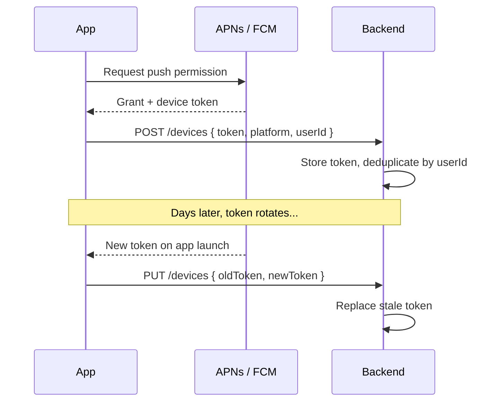
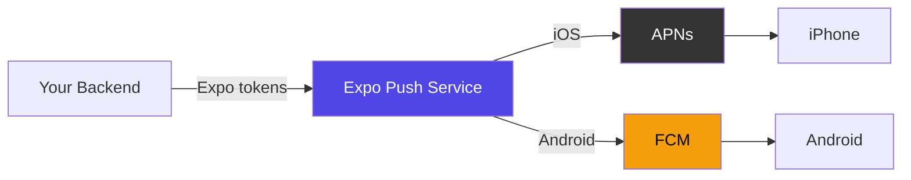
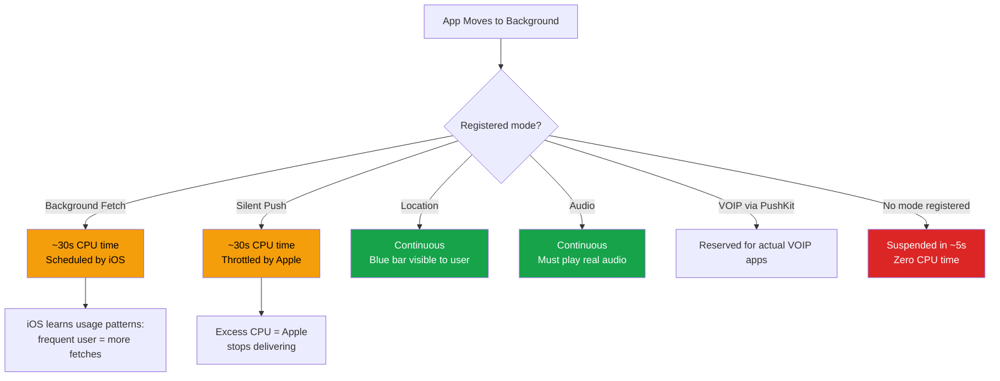

# Push Notifications and Background Tasks

> APNs, FCM, background fetch, and the platform constraints that shape how mobile apps wake up.

---

## Table of Contents

1. [Push Notifications](#1-push-notifications)
2. [Backend Services](#2-backend-services)
3. [Background Work](#3-background-work)
4. [Background Limits](#4-background-limits)

---

## 1. Push Notifications

On the web, you have the Push API and service workers. You register a service worker, subscribe for push events, and the browser handles delivery. It works reasonably well. Now forget all of that.

On mobile, every single push notification on iOS goes through Apple Push Notification service (APNs). Every notification on Android goes through Firebase Cloud Messaging (FCM). There is no alternative. You cannot open a persistent WebSocket from the background and deliver your own alerts. The OS owns the notification pipeline, and it decides when your app wakes up.

This design exists for a reason: battery life. If every app maintained its own persistent connection, your phone would die by lunch. APNs and FCM maintain a single system-level connection and multiplex all app notifications over it.

### The Easiest Path: expo-notifications

If you are using Expo (and for most React Native projects, you should be), `expo-notifications` abstracts APNs and FCM behind one API. You request permission, get a push token, and listen for incoming notifications without writing a line of native code.

```bash
npx expo install expo-notifications expo-device expo-constants
```

```tsx
import * as Notifications from "expo-notifications";
import * as Device from "expo-device";
import { Platform } from "react-native";

// Configure foreground notification behavior
Notifications.setNotificationHandler({
  handleNotification: async () => ({
    shouldShowAlert: true,
    shouldPlaySound: true,
    shouldSetBadge: true,
  }),
});

async function registerForPushNotifications(): Promise<string | null> {
  // Push only works on physical devices
  if (!Device.isDevice) {
    console.warn("Push notifications require a physical device");
    return null;
  }

  const { status: existing } = await Notifications.getPermissionsAsync();
  let finalStatus = existing;

  if (existing !== "granted") {
    const { status } = await Notifications.requestPermissionsAsync();
    finalStatus = status;
  }

  if (finalStatus !== "granted") return null;

  // Android requires an explicit notification channel
  if (Platform.OS === "android") {
    await Notifications.setNotificationChannelAsync("default", {
      name: "Default",
      importance: Notifications.AndroidImportance.MAX,
      vibrationPattern: [0, 250, 250, 250],
    });
  }

  const token = (
    await Notifications.getExpoPushTokenAsync({
      projectId: "your-expo-project-id",
    })
  ).data;

  return token;
}
```

### Token Management

Most tutorials gloss over this part, and it is where the real bugs live. A push token is not permanent. It rotates when the user reinstalls, restores from backup, or when the OS refreshes it silently. Your architecture must treat the token as ephemeral.



The non-negotiable rules:

- **Register on every launch.** Do not cache the token client-side and assume it is still valid. Call `getExpoPushTokenAsync` on each cold start and send it to your backend.
- **Deduplicate server-side.** Associate tokens with user IDs. One user may have multiple devices. One device may change tokens.
- **Prune dead tokens.** When APNs returns a 410 (Gone) or FCM returns "NotRegistered," delete that token immediately. Repeated sends to dead tokens will get your service throttled.

### Categories, Actions, and Rich Notifications

Notifications can carry action buttons, inline text replies, and images. You define categories at app startup and reference them from your backend payloads.

```tsx
// Define once at app startup
Notifications.setNotificationCategoryAsync("message", [
  {
    identifier: "reply",
    buttonTitle: "Reply",
    textInput: { submitButtonTitle: "Send", placeholder: "Type a reply..." },
  },
  {
    identifier: "mark-read",
    buttonTitle: "Mark as Read",
    options: { isDestructive: false },
  },
]);
```

Your backend then includes `categoryId: "message"` in the push payload. The OS renders the action buttons without your app needing to be open.

### Silent Pushes for Cache Invalidation

Not every push needs to show a banner. Silent (data-only) pushes wake your app briefly so it can pull fresh data. This is how chat apps pre-load conversations before the user opens the app.

```tsx
// Backend sends: { to: token, data: { type: "sync", resource: "messages" }, priority: "high" }

Notifications.addNotificationReceivedListener((notification) => {
  const data = notification.request.content.data;
  if (data.type === "sync") {
    syncResource(data.resource);
  }
});
```

> **Gotcha:** iOS throttles silent pushes aggressively. Apple decides when they arrive, and if your app uses too much CPU during background execution, delivery stops entirely. Never rely on silent pushes for time-critical sync.

### Deep Linking from Notification Taps

When the user taps a notification, you want to land them on the right screen, not the home page.

```tsx
// Handle taps when the app is already running
Notifications.addNotificationResponseReceivedListener((response) => {
  const data = response.notification.request.content.data;
  if (data.screen === "chat" && data.threadId) {
    navigationRef.navigate("ChatThread", { id: data.threadId });
  }
});

// Handle taps from a cold start (app was killed)
const initialResponse = await Notifications.getLastNotificationResponseAsync();
if (initialResponse) {
  const data = initialResponse.notification.request.content.data;
  // Navigate after your root navigator mounts
}
```

The cold start case is the one that catches people. Your navigation tree does not exist yet when the OS hands you the initial notification. You need to buffer the deep link data and process it after the root navigator mounts.

---

## 2. Backend Services

You need something between your server and APNs/FCM. You could talk to both APIs directly, but you will spend weeks wrestling with token formats, certificate rotation for APNs, retry logic, and delivery receipts. Use a service.

### Expo Push Service

Free, integrated into the Expo ecosystem, and the obvious choice if you are already using `expo-notifications`. You POST a JSON payload to Expo's API, and it routes to APNs or FCM based on the token format.

```tsx
// Server-side (Node.js)
const { Expo } = require("expo-server-sdk");
const expo = new Expo();

const messages = [
  {
    to: "ExponentPushToken[xxxxxxxxxxxx]",
    title: "New message",
    body: "Hey, are you coming tonight?",
    data: { screen: "chat", threadId: "abc123" },
    sound: "default",
    categoryId: "message",
  },
];

const chunks = expo.chunkPushNotifications(messages);
for (const chunk of chunks) {
  const tickets = await expo.sendPushNotificationsAsync(chunk);
  // Save ticket IDs, check receipts later for delivery status
}
```

The Expo Push Service is a thin proxy. It does not store tokens, segment users, or run analytics. Your backend owns all that logic. For many teams, this simplicity is a feature, not a limitation.



### Comparison

| Service | Best For | Cost | Key Strength |
| ------- | -------- | ---- | ------------ |
| **Expo Push Service** | Expo apps, straightforward delivery | Free | Zero config, just works |
| **Firebase Cloud Messaging** | Android-heavy apps, existing Firebase stack | Free | Direct FCM access, Topics API |
| **OneSignal** | Teams that need segmentation, A/B testing | Free tier, paid at scale | Analytics dashboard, journeys |
| **Knock / Courier** | Multi-channel (push + email + SMS + in-app) | Usage-based | Unified notification orchestration |

**My recommendation:** Start with Expo Push Service. It costs nothing and handles routing for you. Graduate to OneSignal when you need user segmentation or delivery analytics, or to Knock when push is just one channel in a broader notification system. Do not start with the complex option "just in case."

> **Gotcha:** Even if you use FCM to deliver iOS pushes (FCM can proxy to APNs), you still need to upload your APNs authentication key to Firebase. There is no path that avoids Apple's infrastructure on iOS.

---

## 3. Background Work

On the web, you have service workers. They can run in the background, handle push events, cache assets, and sync data. The browser gives them a generous execution window.

Mobile is a different world. Both iOS and Android kill background processes aggressively to protect battery life. Your app does not "run in the background" in any meaningful sense. It gets short, tightly controlled execution windows that the OS can revoke at any moment.

### expo-task-manager + expo-background-fetch

This is the managed approach. You define a named task, register it for periodic background execution, and the OS invokes it when it sees fit.

```bash
npx expo install expo-task-manager expo-background-fetch
```

```tsx
import * as BackgroundFetch from "expo-background-fetch";
import * as TaskManager from "expo-task-manager";

const BACKGROUND_SYNC_TASK = "background-sync";

// Define the task OUTSIDE any component — this runs headlessly
TaskManager.defineTask(BACKGROUND_SYNC_TASK, async () => {
  try {
    const newData = await fetchLatestFromAPI();
    if (newData.length > 0) {
      await persistToLocalStorage(newData);
      return BackgroundFetch.BackgroundFetchResult.NewData;
    }
    return BackgroundFetch.BackgroundFetchResult.NoData;
  } catch {
    return BackgroundFetch.BackgroundFetchResult.Failed;
  }
});

// Register once (e.g., in your root layout)
async function registerBackgroundSync() {
  const status = await BackgroundFetch.getStatusAsync();
  if (status === BackgroundFetch.BackgroundFetchStatus.Available) {
    await BackgroundFetch.registerTaskAsync(BACKGROUND_SYNC_TASK, {
      minimumInterval: 15 * 60, // 15 minutes (a hint, not a guarantee)
      stopOnTerminate: false,    // Android: keep running after app is swiped
      startOnBoot: true,         // Android: restart after reboot
    });
  }
}
```

> **Critical:** That `minimumInterval` is a suggestion, not a contract. iOS will invoke your task when it decides to, based on the user's usage patterns. If the user opens your app every morning at 8am, iOS learns this and schedules fetches before 8am. If the user never opens your app, iOS stops scheduling entirely.

### Background Location

Location tracking is the one background mode both platforms treat as first-class, because navigation apps depend on it.

```tsx
import * as Location from "expo-location";
import * as TaskManager from "expo-task-manager";

const LOCATION_TASK = "background-location";

TaskManager.defineTask(LOCATION_TASK, ({ data, error }) => {
  if (error) return;
  const { locations } = data as { locations: Location.LocationObject[] };
  uploadLocations(locations);
});

async function startTracking() {
  const { status: fg } = await Location.requestForegroundPermissionsAsync();
  const { status: bg } = await Location.requestBackgroundPermissionsAsync();

  if (fg === "granted" && bg === "granted") {
    await Location.startLocationUpdatesAsync(LOCATION_TASK, {
      accuracy: Location.Accuracy.Balanced,
      distanceInterval: 100,
      showsBackgroundLocationIndicator: true, // iOS blue status bar
    });
  }
}
```

> **Warning:** Both app stores scrutinize background location. Apple will reject your app if you request `Always` location permission without a clear, visible reason. "We might need it later" does not pass review.

### Android Foreground Services

Android allows genuine long-running background work, but only if you show a persistent notification (a foreground service). This is how music players, workout trackers, and file uploaders stay alive. You need a library like `react-native-background-actions` since Expo does not expose this directly.

```tsx
import BackgroundService from "react-native-background-actions";

const syncTask = async (taskData: { interval: number }) => {
  while (BackgroundService.isRunning()) {
    await performSync();
    await sleep(taskData.interval);
  }
};

await BackgroundService.start(syncTask, {
  taskName: "DataSync",
  taskTitle: "Syncing your data",
  taskDesc: "Uploading offline changes...",
  taskIcon: { name: "ic_launcher", type: "mipmap" },
  parameters: { interval: 30_000 },
});
```

This is **Android only**. iOS has no equivalent. It does not allow arbitrary long-running background processes, full stop.

### Headless JS (Android Only)

Under the hood, React Native on Android supports `AppRegistry.registerHeadlessTask`, which lets JavaScript execute without any UI in response to system events. This is the primitive that `react-native-background-actions` builds on. You rarely call it directly, but knowing it exists helps debug background execution issues.

---

## 4. Background Limits

This section exists to save you from making promises your app cannot keep. If your product manager asks for "real-time background sync," show them this.

### iOS: The Walled Garden

iOS is relentlessly aggressive about background execution. Here is the reality:



Non-negotiable facts:

- **Background fetch gives roughly 30 seconds of CPU time**, triggered at intervals iOS chooses. On a fresh install, it might not trigger for hours.
- **You cannot keep a WebSocket alive.** iOS suspends your process and drops the connection. Use push notifications to signal new data.
- **Xcode Background Modes (audio, location, VOIP, Bluetooth, fetch) are audited.** If Apple's review team determines you enabled a mode you do not actually use, they will reject your app.
- **Battery usage is user-visible.** If your app tops the battery consumption list in Settings, users will uninstall it.

### Android: More Permissive, But Tightening

Android gives you more rope, and it has been pulling it back with each release:

- **Android 8+ (Oreo):** Background services are killed after minutes unless promoted to foreground services.
- **Android 12+:** You cannot start a foreground service from the background without a user interaction or push notification trigger.
- **Android 13+:** Notification permission is opt-in. The user must explicitly grant it.
- **Doze mode:** When the device is stationary and unplugged, Android batches all background work into infrequent maintenance windows. Your timers will not fire when you expect.

### Design Around the Constraints

Do not fight the OS. Build your architecture to work with intermittent, unpredictable background access.

| Instead of... | Do this |
| --- | --- |
| Polling on a timer | Push notifications to signal new data |
| Persistent WebSocket in background | Reconnect on foreground, push for background |
| Sync every 5 minutes | Background fetch with flexible timing |
| Continuous background location | Significant location changes (less battery) |
| Promising instant offline sync | Sync on foreground, push to hint, accept delay |

```tsx
// WRONG: setInterval does not work in the background
setInterval(() => {
  fetch("/api/updates");
}, 60_000);

// RIGHT: Sync when the user returns, push to signal urgency
import { AppState } from "react-native";

AppState.addEventListener("change", (state) => {
  if (state === "active") {
    syncLatestData(); // foreground is your reliable sync window
  }
});
```

> **The golden rule:** The OS is in charge, not your app. Design for intermittent execution. Push notifications are your signaling mechanism, foreground activity is your primary sync window, and background fetch is a best-effort bonus. If a feature requires the app to be "always running," the feature needs to be redesigned.

---
