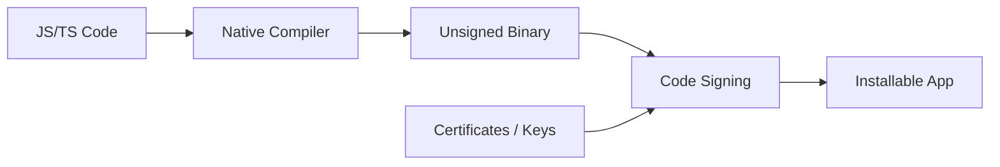
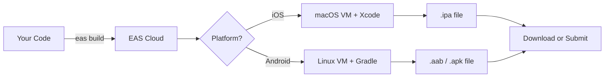
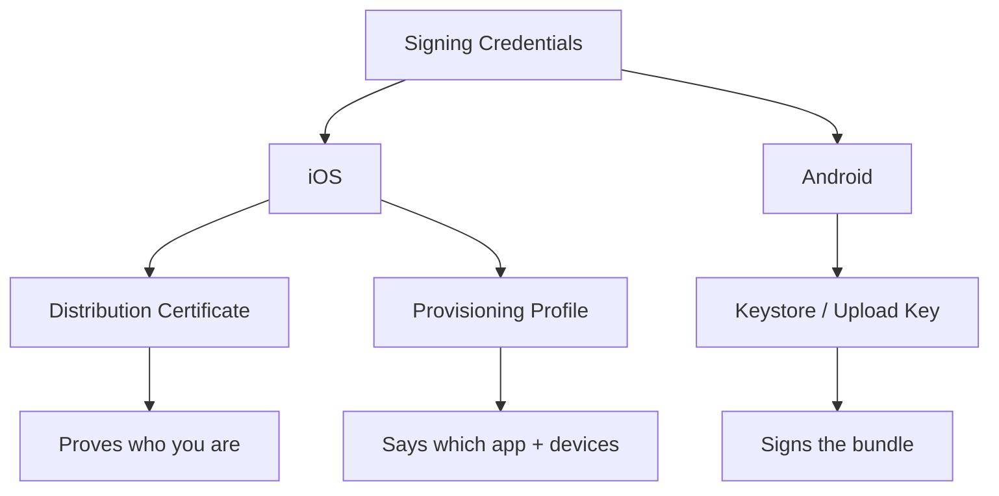
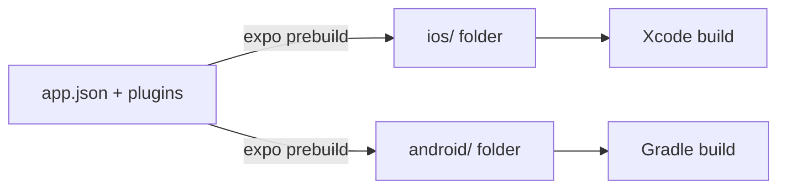
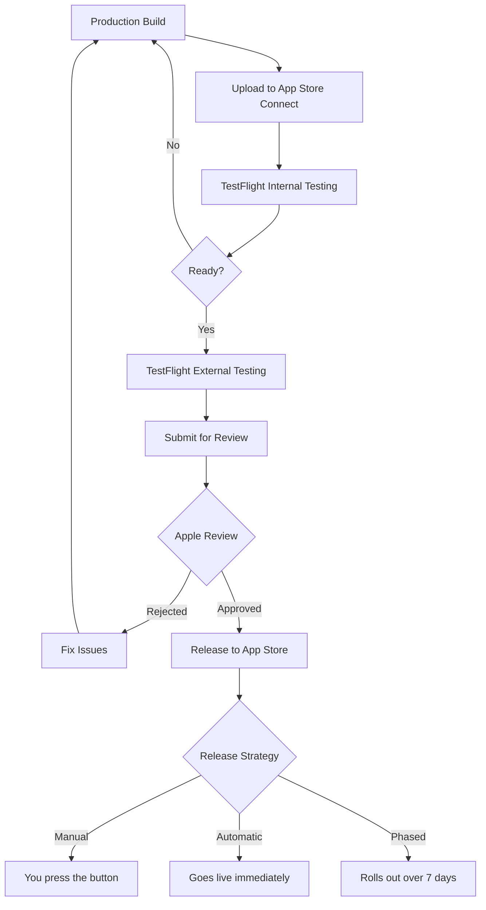
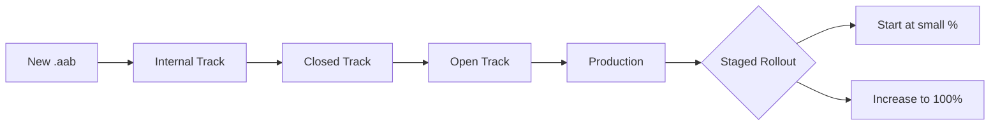
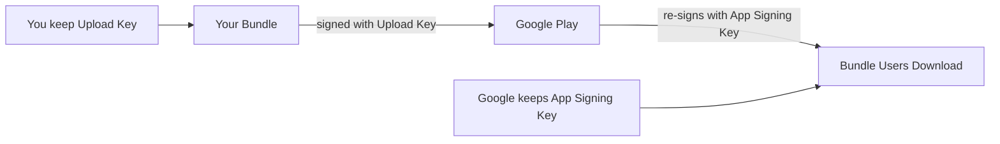
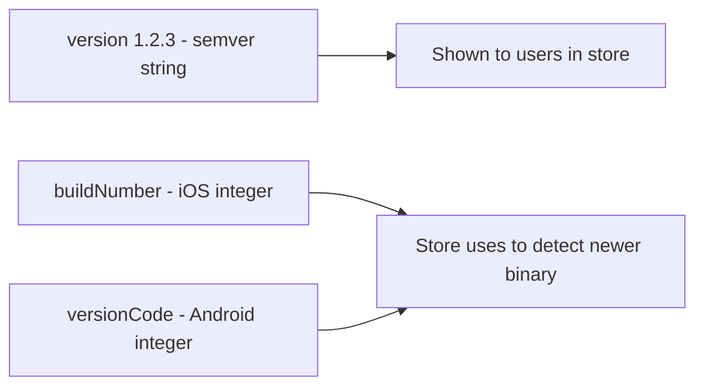
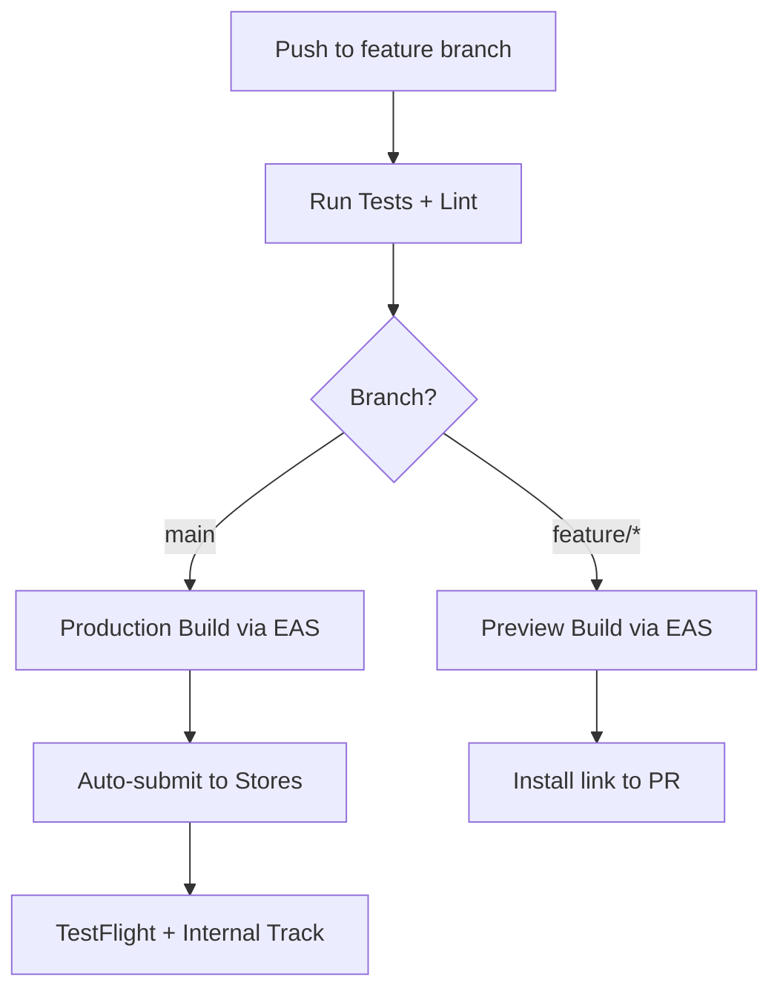
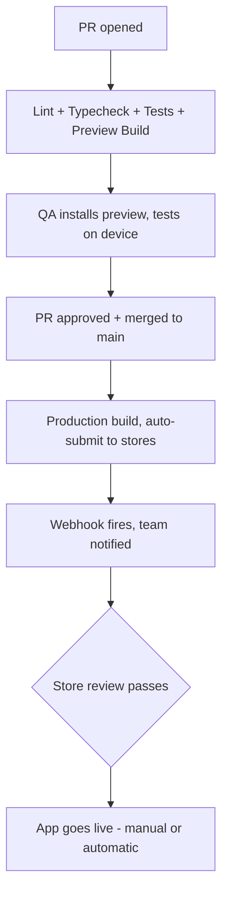

# Build and Deploy: From Code to App Stores

> EAS Build, app store submission, versioning, and CI/CD pipelines for shipping mobile apps.

---

## Table of Contents

1. [EAS Build](#1-eas-build)
2. [Local Builds](#2-local-builds)
3. [iOS Submission](#3-ios-submission)
4. [Android Submission](#4-android-submission)
5. [Versioning](#5-versioning)
6. [CI/CD](#6-cicd)

---

## 1. EAS Build

On the web, deploying is almost trivially simple: run a build command, upload static files to a CDN, done. Mobile is a different universe. You need Xcode (macOS only) for iOS, Android Studio and Gradle for Android, signing certificates, provisioning profiles, keystores... it is a gauntlet. EAS Build exists to make that gauntlet disappear.

### Why Mobile Builds Are Hard in the First Place

Coming from the web, this is the mental shift that trips everyone up. When you deploy a website, the "artifact" is just files — HTML, JS, CSS — that any browser can run. The browser is the runtime, and it's already installed on every device. You never compile anything for a specific machine.

Mobile is the opposite. The artifact is a **native binary** — actual machine-specific code that the operating system runs directly, with no browser in between. And the OS will not run just any binary. It demands proof, cryptographically, that the binary came from a registered developer and was not tampered with. That proof is what "signing" means, and it's the single biggest source of pain for newcomers.



> **Analogy**: A web deploy is like emailing a document — anyone can open it. A mobile build is like minting a passport. It only works if it carries the right official stamps (certificates), and only the bearer (the registered developer) can issue valid ones. EAS Build is the passport office that handles the paperwork for you.

### What EAS Build Actually Does

EAS (Expo Application Services) Build is a cloud-based build service. You push your code, Expo's servers compile your native binaries, and you download the result. No local Xcode. No Gradle daemon eating 8 GB of RAM. No "works on my machine" nightmares.

The key insight: iOS binaries can **only** be built on macOS (Apple's legal requirement). So even if you're on Windows or Linux, EAS spins up a real macOS virtual machine in the cloud, runs Xcode on it, and hands you back the `.ipa`. This is the thing that makes Expo so powerful for non-Mac developers — you get to ship to the App Store without ever owning a Mac.



Here is what each output format means, since the acronyms are not obvious:

| File | Platform | What it is | Used for |
|---|---|---|---|
| `.ipa` | iOS | iOS App archive | Submitting to App Store / TestFlight |
| `.aab` | Android | Android App Bundle | Submitting to Google Play (preferred) |
| `.apk` | Android | Android Package | Direct install on a device / sideloading / QA |

### Getting Started

Install the EAS CLI and configure your project:

```bash
npm install -g eas-cli   # the command-line tool that talks to EAS
eas login                # authenticate with your Expo account
eas build:configure      # scaffold an eas.json for this project
```

That last command generates an `eas.json` file. This is where build profiles live:

```json
{
  "cli": {
    "version": ">= 5.0.0"
  },
  "build": {
    "development": {
      "developmentClient": true,
      "distribution": "internal",
      "ios": {
        "simulator": true
      }
    },
    "preview": {
      "distribution": "internal",
      "ios": {
        "simulator": false
      }
    },
    "production": {
      "autoIncrement": true
    }
  },
  "submit": {
    "production": {
      "ios": {
        "ascAppId": "your-app-store-connect-id"
      }
    }
  }
}
```

Three profiles is the sweet spot. Think of them like the `dev` / `staging` / `prod` environments you already use on the web:

- **development** — includes the dev client, runs on simulators, fast iteration. This build can connect to your Metro bundler and hot-reload, like running `npm run dev` locally.
- **preview** — a real build you can install on physical devices for QA. Think of it like a staging environment. It runs the bundled JS, no Metro server, but is not store-optimized.
- **production** — the store-ready binary, optimized, minified, signed with production credentials. This is the one that goes live.

| Profile | Runs on | Connects to Metro? | Signed with | Web analogy |
|---|---|---|---|---|
| development | Simulator + dev devices | Yes (hot reload) | Dev credentials | `npm run dev` |
| preview | Physical devices (QA) | No (bundled JS) | Internal/ad-hoc | Staging deploy |
| production | App stores | No (optimized) | Production credentials | Prod deploy |

### Running a Build

```bash
# Development build for iOS simulator
eas build --platform ios --profile development

# Production build for both platforms at once
eas build --platform all --profile production
```

After you run this, the build is queued in the cloud. The CLI gives you a URL where you can watch the live logs — the same logs you'd see in a CI dashboard on the web. When it finishes, you get a download link (or it goes straight to the store if you used `--auto-submit`, covered later).

### Credentials Management

This is the killer feature. On the web, there are no signing certificates — you push to Vercel and you're done. In mobile, iOS requires provisioning profiles and distribution certificates; Android requires a keystore. EAS manages all of this for you. On your first build, it will ask whether you want EAS to handle credentials automatically. Say yes. It generates and stores them securely. You never touch a `.p12` file or a `keystore.jks` unless you want to.

Here's the mental model for the two ecosystems, because they differ in an important way:



> **Gotcha**: If you already have existing credentials (maybe from a pre-Expo project), you can import them with `eas credentials`. Do not let EAS generate new ones if you have an existing app in the store — you will not be able to update it. On Android in particular, an app signed with a *new* key is treated as a *different* app by the Play Store, and users cannot update over it.

### Pricing Reality

EAS Build has a free tier: a limited number of builds per month on a shared queue (builds can wait 20-40 minutes in line). For a side project, this is plenty. For a team shipping daily, the paid tiers give priority queues and faster machines. Compared to maintaining your own macOS CI runners (which Apple's license requires for iOS builds — you literally cannot legally build iOS apps on rented Linux), it is a bargain.

> **Pro tip**: Burn your free build minutes on `production` builds and use **local simulator builds** or the **Expo Go / dev client** for day-to-day development. You don't need a cloud build every time you change a button color — only when you need a real installable binary.

---

## 2. Local Builds

Sometimes you need local builds. Maybe you are debugging a native module crash. Maybe your company policy forbids sending code to third-party servers. Maybe you just want faster iteration on native changes.

### The `prebuild` Step: Where the Native Project Comes From

Here's a concept unique to Expo that confuses beginners. In a managed Expo project, there is **no `ios/` or `android/` folder** — your app is configured entirely through `app.json`. To build locally, you first have to *generate* those native folders. That's what `prebuild` does: it reads your `app.json`, applies all your config plugins, and materializes a real Xcode project and a real Gradle project.



> **Gotcha**: Once you run `prebuild` and start hand-editing the `ios/` or `android/` folders, you have left the "managed" workflow and entered the "bare" workflow. Re-running `prebuild` can overwrite your manual native edits. Treat that as a one-way door unless you commit those folders to git and manage them deliberately.

### iOS: Xcode + Fastlane

You need a Mac. There is no way around this — Apple requires Xcode, and Xcode only runs on macOS.

```bash
# Generate the native iOS project from app.json
npx expo prebuild --platform ios

# Open the workspace in Xcode (note: .xcworkspace, not .xcodeproj)
open ios/*.xcworkspace
```

From Xcode, you can build and run on a simulator or a physical device. But for automated builds, Fastlane is the standard tool. Fastlane is a Ruby-based automation toolkit — think of it as the "npm scripts" of the native mobile world, wrapping the painful Xcode and Gradle command lines into named "lanes":

```bash
# Install Fastlane (Homebrew is the common route on macOS)
brew install fastlane

# Inside the ios/ directory, scaffold a Fastfile
cd ios
fastlane init
```

A typical `Fastfile` for building and uploading to TestFlight:

```ruby
# ios/fastlane/Fastfile
default_platform(:ios)

platform :ios do
  desc "Build and upload to TestFlight"
  lane :beta do
    increment_build_number          # bump the integer build number
    build_app(
      workspace: "YourApp.xcworkspace",
      scheme: "YourApp",
      export_method: "app-store"    # signs for distribution, not dev
    )
    upload_to_testflight            # pushes the .ipa to TestFlight
  end
end
```

### Android: Gradle + Fastlane

Android is more forgiving — Gradle runs on any OS (Windows, Mac, Linux), because Android tooling is not legally locked to one platform the way Apple's is.

```bash
# Generate the native Android project
npx expo prebuild --platform android

# Build an APK for testing (sideload-friendly)
cd android
./gradlew assembleRelease

# Or build an AAB for the Play Store
./gradlew bundleRelease
```

The release APK lands in `android/app/build/outputs/apk/release/`. The AAB in `android/app/build/outputs/bundle/release/`.

> **Why AAB over APK?** An `.apk` contains code and assets for *every* device (all screen densities, all CPU architectures), so it's bloated. An `.aab` lets Google Play generate a slimmed-down APK tailored to each user's exact device. Smaller download, same app. That's why Google requires AAB for store uploads but APK is still handy for quick manual installs.

Fastlane works for Android too:

```ruby
# android/fastlane/Fastfile
default_platform(:android)

platform :android do
  desc "Build and upload to Play Store internal track"
  lane :internal do
    gradle(task: "bundleRelease")
    upload_to_play_store(
      track: "internal",
      aab: "app/build/outputs/bundle/release/app-release.aab"
    )
  end
end
```

### When to Use Local vs EAS

| Scenario | Use | Why |
|---|---|---|
| Standard app builds | EAS Build | No machine setup, signing handled |
| Debugging native crashes | Local (Xcode/Android Studio) | Step through native code, native breakpoints |
| Company restricts cloud builds | Local + Fastlane | Code never leaves your infra |
| Custom native module development | Local during dev, EAS for release | Fast inner loop locally, clean release in cloud |
| Open source project | EAS (free tier is generous) | Contributors don't need a Mac |
| No Mac available | EAS | iOS builds require macOS — EAS rents one |

> **Opinion**: Default to EAS Build. Drop to local builds only when you have a specific reason. The time you save not debugging Xcode signing issues alone justifies it. Signing errors in Xcode are famously cryptic ("No profiles for 'com.you.app' were found") and can eat an entire afternoon.

---

## 3. iOS Submission

Shipping to the App Store is a process. Not a difficult one, but a process with specific steps and requirements that, if you miss any of them, will bounce your submission back.

### Prerequisites

- **Apple Developer Program**: $99/year. Non-negotiable. You cannot submit without it. (Unlike Google's one-time fee, this renews annually — let it lapse and your apps get pulled from the store.)
- **App Store Connect**: Apple's web portal for managing apps, TestFlight builds, metadata, and submissions. This is the dashboard you'll live in.
- A production `.ipa` built with a distribution certificate (EAS or Xcode produces this).

### The Submission Flow

The journey from binary to "live in the store" has more gates than a web deploy. The critical one is **Apple Review** — a human (plus automated checks) actually inspects your app before it can go live. There is no equivalent on the web.



### Using EAS Submit

The easiest path:

```bash
# Build and submit in one step (chains build -> upload)
eas build --platform ios --profile production --auto-submit

# Or submit a previously completed build
eas submit --platform ios
```

EAS Submit handles uploading the binary and filling in most of the technical metadata. But you still need to configure everything in App Store Connect: screenshots (at the required device sizes), description, keywords, support URL, privacy policy URL, and the privacy nutrition labels. None of that can be skipped — Apple blocks submission until the listing is complete.

### TestFlight

TestFlight is Apple's beta testing service — the way you get a real build onto a real tester's phone *before* it's public. Two modes:

| Mode | Max testers | Review needed? | Best for |
|---|---|---|---|
| **Internal** | Up to 100 team members | None — instant | Daily QA, your own team |
| **External** | Up to 10,000 | Light beta review (hours) | Public beta programs |

> **Pro tip**: Internal testers must be added as users on your App Store Connect team, but builds reach them in minutes with zero review. This is the fastest way to get a production-signed build onto a device for sanity-checking before you submit for the real review.

### The Privacy Manifest

Since Spring 2024, Apple requires a `PrivacyInfo.xcprivacy` file in your app bundle. This declares which "required reason APIs" your app uses — things like `UserDefaults`, disk space APIs, and system boot time. Apple wants you to justify *why* you touch these, to stop apps from using them to silently fingerprint users. If you use any of these APIs (and you almost certainly do — React Native itself uses some under the hood), you must declare the reason.

```bash
# If using Expo, add the privacy manifest via a config plugin
npx expo install expo-privacy-manifest-polyfill-plugin
```

In your `app.json`:

```json
{
  "expo": {
    "plugins": [
      "expo-privacy-manifest-polyfill-plugin"
    ]
  }
}
```

> **Gotcha**: Apple will reject your build silently if the privacy manifest is missing or incomplete. You will get a generic email about "missing API declarations" with no specifics about which API. Check the Expo docs for the latest required declarations — the list grows over time as Apple tightens the rules.

### App Review Timeline

Expect roughly 24 hours for a straightforward app. Complex apps or first-time submissions can take up to 7 days. Common rejection reasons, and how to dodge them:

| Rejection reason | Fix |
|---|---|
| Crashes on launch | Test the *production* build on a real device, not just the dev build |
| Placeholder / demo content | Ship real content; no "Lorem ipsum" or test data |
| Broken privacy policy link | Verify the URL loads on mobile before submitting |
| Permission with no explanation | Add a clear `NS...UsageDescription` string for each permission |
| Login required with no test account | Provide demo credentials in the review notes |

---

## 4. Android Submission

Google's process is less opaque than Apple's, but has its own set of requirements that trip people up.

### Prerequisites

- **Google Play Console**: $25 one-time fee. Pay once, publish forever. (Contrast with Apple's $99/year — Google is cheaper over time.)
- A signed `.aab` (Android App Bundle) file. Google strongly prefers AAB over APK for store submissions.

### Play Store Tracks

Google uses a track system for gradual rollouts. Instead of one big "go live" button, you promote a build through progressively wider audiences — like feature-flagging a web release to 1%, then 10%, then everyone.

| Track | Purpose | Testers | Review |
|---|---|---|---|
| Internal | Team testing, instant availability | Up to 100 | Minimal |
| Closed | Beta with invite links | Unlimited (via email lists) | Light |
| Open | Public beta, anyone can join | Unlimited | Standard |
| Production | Full release | Everyone | Full |

The smart path: Internal track first for smoke testing, closed track for a wider beta, then production. You can skip straight to production, but you should not — a bug that ships to all users is far harder to recover from than one caught on the internal track.



### EAS Submit for Android

```bash
# Submit to Google Play
eas submit --platform android

# Or auto-submit right after the build finishes
eas build --platform android --profile production --auto-submit
```

For the **first** submission, you need to create the app in the Google Play Console manually and upload the first build through the web UI. This is a Google requirement — the very first bundle must come through the dashboard. After that, EAS Submit can handle every subsequent upload automatically.

### Play App Signing

Google Play App Signing is now required for new apps. There are two keys involved, and understanding the split removes a lot of anxiety:

- **App signing key** — the *real* key that signs what users download. **Google holds this.**
- **Upload key** — the key *you* use to sign the bundle you send to Google. Google verifies it, strips your signature, and re-signs with the app signing key.



The huge benefit: if you **lose your upload key**, Google can reset it for you. Compare this to iOS, where mishandling your distribution certificate is a genuine catastrophe with no easy reset.

```bash
# EAS handles Play App Signing automatically.
# If you ever need to inspect or export the upload keystore:
eas credentials --platform android
```

### Data Safety Form

Google requires a Data Safety form declaring what data your app collects, whether it is shared with third parties, and how it is secured. This is the Android equivalent of Apple's privacy nutrition labels.

You fill this out in the Google Play Console. Common data types to declare for a typical React Native app:

- **Device identifiers** (if you use analytics like Firebase or Amplitude)
- **Crash logs** (if you use Sentry, Crashlytics, etc.)
- **App interactions** (if you track screen views or button taps)

> **Gotcha**: Google does not reject builds for an incorrect Data Safety form — but they will flag your app later in policy reviews, and enforcement can mean app removal with little warning. Fill it out honestly the first time; it's much cheaper than an appeal.

### Target API Level Requirements

Google raises the minimum **target SDK level** annually to push apps onto newer, more secure Android versions. The target SDK is essentially "which version of Android's behavior your app opts into." As of 2025, new apps and updates must target API level 34 (Android 14) or higher. If your `targetSdkVersion` is lower, Google will reject your submission outright.

In your `app.json` (Expo managed workflow):

```json
{
  "expo": {
    "android": {
      "targetSdkVersion": 35
    }
  }
}
```

> **Tip**: Always target one level above the current minimum. When Google bumps the requirement next year, you are already compliant and don't get caught mid-release with a rejected build.

---

## 5. Versioning

On the web, versioning is mostly cosmetic — users always get the latest deploy the next time they refresh. In mobile, versioning is enforced by the stores and determines whether a user can even receive an update.

### Two Numbers, Two Purposes

This is the part everyone gets wrong at first. Every mobile app carries **two** separate version identifiers, and they do completely different jobs:



- **`version`** (e.g., `1.2.3`): What users see in the store listing. Follows semver conventions. You bump this when you ship a meaningful update. This number is for *humans*.
- **`buildNumber`** (iOS) / **`versionCode`** (Android): A monotonically increasing integer. The store uses this internally to decide whether a binary is "newer" than the last one. You bump this on **every single build you upload**, even if the user-facing `version` didn't change. This number is for the *store*.

In `app.json`:

```json
{
  "expo": {
    "version": "1.2.3",
    "ios": {
      "buildNumber": "42"
    },
    "android": {
      "versionCode": 42
    }
  }
}
```

> **Analogy**: `version` is the title on a book's cover ("2nd Edition") — it's marketing. `buildNumber` is the printing run number inside — boring, internal, but it must always count up so the warehouse knows which is the latest stock.

### The Golden Rule

The `buildNumber` / `versionCode` must **always increase**. If you submit build 42, the next submission must be 43 or higher. Submitting 41 will be rejected instantly by the store before any review even starts. The `version` string can technically stay the same across multiple builds (useful when you resubmit a rejected build with a fix and don't want to change what users see), but the build number must always go up.

### Auto-Increment with EAS

Manually tracking build numbers is error-prone — forget once and your upload bounces. Let EAS handle it:

```json
{
  "build": {
    "production": {
      "autoIncrement": true
    }
  }
}
```

With `autoIncrement: true`, EAS queries the app stores for the latest build number on every build and increments from it. You never think about it again.

> **Gotcha**: If you mix local builds and EAS builds, auto-increment can get confused — EAS doesn't know about builds you submitted manually from Xcode or Gradle, so it may try to reuse a number that's already taken. Pick one system (EAS) and stick with it, or you'll hit "this build number already exists" errors.

### A Practical Versioning Strategy

```bash
# Major: breaking changes, big redesigns
1.0.0 -> 2.0.0

# Minor: new features, backward compatible
1.0.0 -> 1.1.0

# Patch: bug fixes only
1.0.0 -> 1.0.1

# Build number: every submission, automated, always up
buildNumber: 1, 2, 3, 4, 5...
```

Unlike the web — where you can hotfix a deploy in minutes and every user has it instantly — a mobile update goes through store review and then has to be *downloaded* by each user. Version thoughtfully: someone on version 1.0.0 might stay there for days until they happen to update. (This is also why over-the-air updates via `eas update`, covered in the CI/CD section, are so valuable for JS-only fixes — they skip the store entirely.)

---

## 6. CI/CD

On the web, CI/CD for deployments is mature and effortless — push to main, and Vercel or Netlify deploys automatically within seconds. In mobile, you can achieve the same push-to-deploy feel, but it takes deliberate setup because of native compilation and store review.

### The Goal

The dream pipeline: a developer pushes code, and the right kind of build happens automatically based on *where* they pushed. Feature branches get a throwaway preview build for QA; `main` gets a real production build that submits itself to the stores.



### GitHub Actions + EAS

Here is a production-ready workflow. A GitHub Actions workflow is just a YAML file describing steps to run on Expo's/GitHub's servers whenever an event (like a push) happens. Create `.github/workflows/build.yml`:

```yaml
name: Mobile Build & Deploy

on:
  push:
    branches: [main]          # production path
  pull_request:
    branches: [main]          # preview path

jobs:
  build:
    runs-on: ubuntu-latest    # Linux runner; iOS still builds on EAS's macOS
    steps:
      - name: Checkout
        uses: actions/checkout@v4

      - name: Setup Node
        uses: actions/setup-node@v4
        with:
          node-version: 20
          cache: npm

      - name: Install dependencies
        run: npm ci            # clean, reproducible install for CI

      - name: Run tests
        run: npm test          # gate the build on a green test suite

      - name: Setup EAS
        uses: expo/expo-github-action@v8
        with:
          eas-version: latest
          token: ${{ secrets.EXPO_TOKEN }}   # auth without interactive login

      - name: Build Preview (PR)
        if: github.event_name == 'pull_request'
        run: eas build --platform all --profile preview --non-interactive

      - name: Build Production (main)
        if: github.ref == 'refs/heads/main'
        run: eas build --platform all --profile production --auto-submit --non-interactive
```

Note the `--non-interactive` flag: it tells EAS never to pause and ask a question (like "generate credentials?"), because there's no human at the keyboard in CI. If EAS would need input it isn't given, it fails fast instead of hanging.

### Setting Up the EXPO_TOKEN

CI runs have no logged-in user, so you authenticate with a **token** instead of `eas login`. A token is a long secret string that proves "this automated job is allowed to act as my Expo account."

```bash
# 1. Generate a personal access token at expo.dev (Account > Access Tokens)
# 2. Add it to your GitHub repo secrets:
#    Settings > Secrets and variables > Actions > New repository secret
#    Name:  EXPO_TOKEN
#    Value: your-token-here
```

> **Gotcha**: Never commit a token to your repo or paste it into the YAML directly. Always reference it as `${{ secrets.EXPO_TOKEN }}`. A leaked Expo token lets anyone publish builds as you.

### Branch-Based Preview Builds

For pull requests, preview builds let QA test changes before they hit main. EAS supports **update channels** that map to branches — a channel is a named "stream" of JS updates that a given build listens to:

```json
{
  "build": {
    "preview": {
      "distribution": "internal",
      "channel": "preview"
    },
    "production": {
      "channel": "production"
    }
  }
}
```

Pair this with `eas update` for OTA (over-the-air) updates to preview builds. This is the secret weapon: a reviewer installs the preview build **once**, and subsequent pushes to the PR branch update the JavaScript inside the already-installed app — no slow native rebuild, no reinstall.

```bash
# In your PR workflow — push new JS to a branch-specific channel
eas update --branch preview-pr-${{ github.event.pull_request.number }} --message "PR #${{ github.event.pull_request.number }}"
```

> **Why OTA works**: A React Native app is native shell + a JavaScript bundle. If you only changed JS (most feature work), you can swap the bundle without rebuilding the shell. Only changes to *native* code or new native dependencies require a full rebuild. This is roughly like swapping the HTML/JS of a web page without reinstalling the browser.

### Auto-Submit on Main Merge

The `--auto-submit` flag on `eas build` automatically submits the finished binary to the App Store and Google Play after a successful build. Combined with the GitHub Actions workflow above, merging a PR to main triggers the whole chain: build on both platforms → submit to both stores → land in TestFlight and the Internal track. No human intervention from commit to "waiting for review."

### EAS Webhooks for Notifications

EAS can fire webhooks when builds complete or fail. A webhook is just an HTTP request EAS sends to a URL you control whenever an event happens — perfect for piping status into team chat:

```bash
# Register a webhook for build events
eas webhook:create --event BUILD --url https://your-server.com/eas-webhook --secret your-webhook-secret
```

Route these to Slack, Discord, or your team's notification channel. You want to know immediately when a production build fails, not discover it the next morning when someone asks where the release went.

> **Common Mistake**: Not pinning your EAS CLI version in CI. EAS CLI updates can introduce breaking changes, and `eas-version: latest` means a release on Expo's side can break your pipeline overnight with no code change from you. A safer approach is to specify an exact version like `eas-version: 12.x.x` and bump it deliberately when you've tested it.

### The Complete Pipeline

Putting it all together, a mature React Native CI/CD pipeline looks like this:



1. **PR opened** — lint, typecheck, unit tests, preview build.
2. **PR approved** — QA installs the preview build, tests on a real device.
3. **Merged to main** — production build, auto-submit to stores.
4. **Build completes** — webhook fires, team notified.
5. **Store review passes** — app goes live (automatically or manually, your choice).

This is the same push-to-deploy philosophy you know from the web, adapted for the realities of app store review and native binary compilation. It takes a Saturday afternoon to set up. It saves hundreds of hours over the life of a project.

---