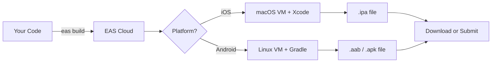
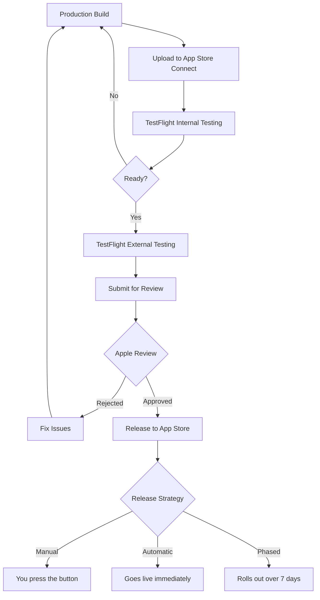
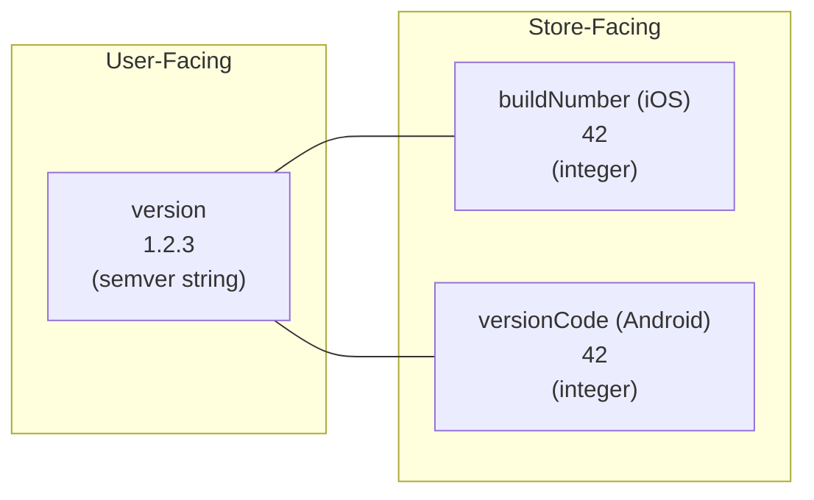
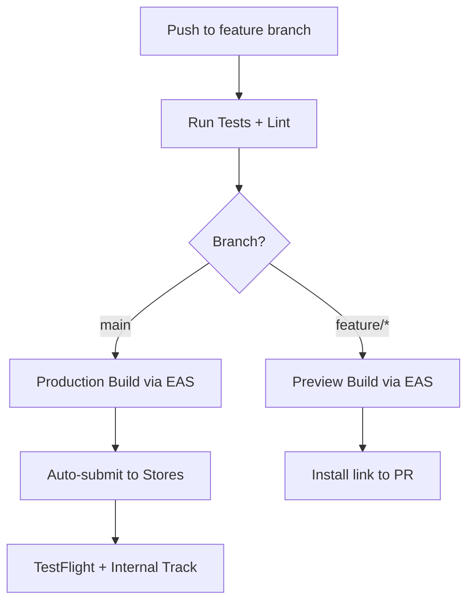

# Build and Deploy: From Code to App Stores

> EAS Build, app store submission, versioning, and CI/CD pipelines for shipping mobile apps.

---

## Table of Contents

1. [EAS Build](#1-eas-build)
2. [Local Builds](#2-local-builds)
3. [iOS Submission](#3-ios-submission)
4. [Android Submission](#4-android-submission)
5. [Versioning](#5-versioning)
6. [CI/CD](#6-cicd)

---

## 1. EAS Build

On the web, deploying is almost trivially simple: run a build command, upload static files to a CDN, done. Mobile is a different universe. You need Xcode (macOS only) for iOS, Android Studio and Gradle for Android, signing certificates, provisioning profiles, keystores... it is a gauntlet. EAS Build exists to make that gauntlet disappear.

### What EAS Build Actually Does

EAS (Expo Application Services) Build is a cloud-based build service. You push your code, Expo's servers compile your native binaries, and you download the result. No local Xcode. No Gradle daemon eating 8 GB of RAM. No "works on my machine" nightmares.



### Getting Started

Install the EAS CLI and configure your project:

```bash
npm install -g eas-cli
eas login
eas build:configure
```

That last command generates an `eas.json` file. This is where build profiles live:

```json
{
  "cli": {
    "version": ">= 5.0.0"
  },
  "build": {
    "development": {
      "developmentClient": true,
      "distribution": "internal",
      "ios": {
        "simulator": true
      }
    },
    "preview": {
      "distribution": "internal",
      "ios": {
        "simulator": false
      }
    },
    "production": {
      "autoIncrement": true
    }
  },
  "submit": {
    "production": {
      "ios": {
        "ascAppId": "your-app-store-connect-id"
      }
    }
  }
}
```

Three profiles is the sweet spot:

- **development** — includes the dev client, runs on simulators, fast iteration.
- **preview** — a real build you can install on physical devices for QA. Think of it like a staging environment.
- **production** — the store-ready binary, optimized, minified, signed with production credentials.

### Running a Build

```bash
# Development build for iOS simulator
eas build --platform ios --profile development

# Production build for both platforms
eas build --platform all --profile production
```

### Credentials Management

This is the killer feature. On the web, there are no signing certificates. In mobile, iOS requires provisioning profiles and distribution certificates; Android requires a keystore. EAS manages all of this for you. On your first build, it will ask whether you want EAS to handle credentials automatically. Say yes. It generates and stores them securely. You never touch a `.p12` file or a `keystore.jks` unless you want to.

> **Gotcha**: If you already have existing credentials (maybe from a pre-Expo project), you can import them with `eas credentials`. Do not let EAS generate new ones if you have an existing app in the store — you will not be able to update it.

### Pricing Reality

EAS Build has a free tier: 30 builds per month on a shared queue (builds can take 20-40 minutes waiting). For a side project, this is plenty. For a team shipping daily, the paid tiers give priority queues and faster machines. Compared to maintaining your own macOS CI runners (which Apple's license requires for iOS builds), it is a bargain.

---

## 2. Local Builds

Sometimes you need local builds. Maybe you are debugging a native module crash. Maybe your company policy forbids sending code to third-party servers. Maybe you just want faster iteration on native changes.

### iOS: Xcode + Fastlane

You need a Mac. There is no way around this — Apple requires Xcode, and Xcode only runs on macOS.

```bash
# Generate the native iOS project
npx expo prebuild --platform ios

# Open in Xcode
open ios/*.xcworkspace
```

From Xcode, you can build and run on a simulator or a physical device. But for automated builds, Fastlane is the standard tool:

```bash
# Install Fastlane
brew install fastlane

# Inside the ios/ directory
cd ios
fastlane init
```

A typical `Fastfile` for building and uploading to TestFlight:

```bash
# ios/fastlane/Fastfile
default_platform(:ios)

platform :ios do
  desc "Build and upload to TestFlight"
  lane :beta do
    increment_build_number
    build_app(
      workspace: "YourApp.xcworkspace",
      scheme: "YourApp",
      export_method: "app-store"
    )
    upload_to_testflight
  end
end
```

### Android: Gradle + Fastlane

Android is more forgiving — Gradle runs on any OS.

```bash
# Generate the native Android project
npx expo prebuild --platform android

# Build an APK for testing
cd android
./gradlew assembleRelease

# Or build an AAB for the Play Store
./gradlew bundleRelease
```

The release APK lands in `android/app/build/outputs/apk/release/`. The AAB in `android/app/build/outputs/bundle/release/`.

Fastlane works for Android too:

```bash
# android/fastlane/Fastfile
default_platform(:android)

platform :android do
  desc "Build and upload to Play Store internal track"
  lane :internal do
    gradle(task: "bundleRelease")
    upload_to_play_store(
      track: "internal",
      aab: "app/build/outputs/bundle/release/app-release.aab"
    )
  end
end
```

### When to Use Local vs EAS

| Scenario | Use |
|---|---|
| Standard app builds | EAS Build |
| Debugging native crashes | Local (Xcode/Android Studio) |
| Company restricts cloud builds | Local + Fastlane |
| Custom native module development | Local during dev, EAS for release |
| Open source project | EAS (free tier is generous) |

> **Opinion**: Default to EAS Build. Drop to local builds only when you have a specific reason. The time you save not debugging Xcode signing issues alone justifies it.

---

## 3. iOS Submission

Shipping to the App Store is a process. Not a difficult one, but a process with specific steps and requirements that, if you miss any of them, will bounce your submission back.

### Prerequisites

- **Apple Developer Program**: $99/year. Non-negotiable. You cannot submit without it.
- **App Store Connect**: Apple's portal for managing apps, TestFlight, and submissions.
- A production `.ipa` built with a distribution certificate.

### The Submission Flow



### Using EAS Submit

The easiest path:

```bash
# Build and submit in one step
eas build --platform ios --profile production --auto-submit

# Or submit a previously completed build
eas submit --platform ios
```

EAS Submit handles uploading the binary and filling in most of the metadata. But you still need to configure everything in App Store Connect: screenshots, description, privacy policy URL, and the privacy nutrition labels.

### TestFlight

TestFlight is Apple's beta testing service. Two modes:

- **Internal testing**: Up to 100 testers from your team. Builds are available immediately — no review needed. Use this for daily QA.
- **External testing**: Up to 10,000 testers. Requires a lightweight beta review (usually a few hours). Use this for beta programs.

### The Privacy Manifest

Since Spring 2024, Apple requires a `PrivacyInfo.xcprivacy` file in your app bundle. This declares which "required reason APIs" your app uses (things like `UserDefaults`, disk space APIs, system boot time). If you use any of these APIs (and you almost certainly do — React Native itself uses some), you must declare the reason.

```bash
# If using Expo, add the privacy manifest via a config plugin
npx expo install expo-privacy-manifest-polyfill-plugin
```

In your `app.json`:

```json
{
  "expo": {
    "plugins": [
      "expo-privacy-manifest-polyfill-plugin"
    ]
  }
}
```

> **Gotcha**: Apple will reject your build silently if the privacy manifest is missing or incomplete. You will get a generic email about "missing API declarations" with no specifics. Check the Expo docs for the latest list of required declarations.

### App Review Timeline

Expect 24 hours for a straightforward app. Complex apps or first-time submissions can take up to 7 days. Common rejection reasons: crashes on launch, placeholder content, broken links in the privacy policy, and requesting permissions without a clear explanation string.

---

## 4. Android Submission

Google's process is less opaque than Apple's, but has its own set of requirements that trip people up.

### Prerequisites

- **Google Play Console**: $25 one-time fee. Pay once, publish forever.
- A signed `.aab` (Android App Bundle) file. Google strongly prefers AAB over APK for store submissions.

### Play Store Tracks

Google uses a track system for gradual rollouts:

| Track | Purpose | Testers |
|---|---|---|
| Internal | Team testing, instant availability | Up to 100 |
| Closed | Beta with invite links | Unlimited (via email lists) |
| Open | Public beta, anyone can join | Unlimited |
| Production | Full release | Everyone |

The smart path: Internal track first for smoke testing, closed track for a wider beta, then production. You can skip straight to production, but you should not.

### EAS Submit for Android

```bash
# Submit to Google Play
eas submit --platform android

# Or auto-submit after build
eas build --platform android --profile production --auto-submit
```

For the first submission, you need to create the app in the Google Play Console manually and upload the first build through the web UI. After that, EAS Submit can handle subsequent uploads.

### Play App Signing

Google Play App Signing is now required for new apps. Google holds the actual signing key; you sign your upload with an upload key. This means if you lose your upload key, Google can issue you a new one. Compare this to iOS, where losing your distribution certificate is a genuine catastrophe.

```bash
# EAS handles Play App Signing automatically
# If you need to export the upload keystore:
eas credentials --platform android
```

### Data Safety Form

Google requires a Data Safety form declaring what data your app collects, whether it is shared with third parties, and how it is secured. This is the Android equivalent of Apple's privacy nutrition labels.

You fill this out in the Google Play Console. Common data types to declare for a typical React Native app:

- **Device identifiers** (if you use analytics)
- **Crash logs** (if you use Sentry, Crashlytics, etc.)
- **App interactions** (if you track screen views)

> **Gotcha**: Google does not reject builds for an incorrect Data Safety form — but they will flag your app later in policy reviews, and enforcement can mean app removal with little warning.

### Target API Level Requirements

Google raises the minimum target SDK level annually. As of 2025, new apps must target API level 34 (Android 14). Updates to existing apps must target API level 34 as well. If your `targetSdkVersion` is lower, Google will reject your submission.

In your `app.json` (Expo managed workflow):

```json
{
  "expo": {
    "android": {
      "targetSdkVersion": 35
    }
  }
}
```

> **Tip**: Always target one level above the minimum. When Google bumps the requirement, you are already compliant.

---

## 5. Versioning

On the web, versioning is mostly cosmetic — users always get the latest deploy. In mobile, versioning is enforced by the stores and determines whether a user can update.

### Two Numbers, Two Purposes

Every mobile app has two version identifiers:



- **`version`** (e.g., `1.2.3`): What users see in the store. Follows semver conventions. You bump this when you ship a meaningful update.
- **`buildNumber`** (iOS) / **`versionCode`** (Android): A monotonically increasing integer. The store uses this to determine whether a binary is "newer." You bump this on every single build you submit.

In `app.json`:

```json
{
  "expo": {
    "version": "1.2.3",
    "ios": {
      "buildNumber": "42"
    },
    "android": {
      "versionCode": 42
    }
  }
}
```

### The Golden Rule

The `buildNumber` / `versionCode` must always increase. If you submit build 42, the next submission must be 43 or higher. Submitting 41 will be rejected. The `version` string can technically stay the same across multiple builds (useful for resubmitting a rejected build with fixes), but the build number must always go up.

### Auto-Increment with EAS

Manually tracking build numbers is error-prone. Let EAS handle it:

```json
{
  "build": {
    "production": {
      "autoIncrement": true
    }
  }
}
```

With `autoIncrement: true`, EAS queries the app stores for the latest build number and increments it. You never think about it.

> **Gotcha**: If you switch between local builds and EAS builds, the auto-increment can get confused because EAS does not know about builds you submitted manually. Pick one system and stick with it.

### A Practical Versioning Strategy

```bash
# Major: breaking changes, redesigns
1.0.0 -> 2.0.0

# Minor: new features
1.0.0 -> 1.1.0

# Patch: bug fixes
1.0.0 -> 1.0.1

# Build number: every submission, automated
buildNumber: 1, 2, 3, 4, 5...
```

Unlike the web where you can hotfix a deploy in minutes, a mobile update goes through store review. Version thoughtfully — users on version 1.0.0 might be there for days until the update propagates.

---

## 6. CI/CD

On the web, CI/CD for deployments is mature — push to main, Vercel or Netlify deploys automatically. In mobile, you can achieve the same workflow, but it takes deliberate setup.

### The Goal



### GitHub Actions + EAS

Here is a production-ready workflow. Create `.github/workflows/build.yml`:

```bash
name: Mobile Build & Deploy

on:
  push:
    branches: [main]
  pull_request:
    branches: [main]

jobs:
  build:
    runs-on: ubuntu-latest
    steps:
      - name: Checkout
        uses: actions/checkout@v4

      - name: Setup Node
        uses: actions/setup-node@v4
        with:
          node-version: 20
          cache: npm

      - name: Install dependencies
        run: npm ci

      - name: Run tests
        run: npm test

      - name: Setup EAS
        uses: expo/expo-github-action@v8
        with:
          eas-version: latest
          token: ${{ secrets.EXPO_TOKEN }}

      - name: Build Preview (PR)
        if: github.event_name == 'pull_request'
        run: eas build --platform all --profile preview --non-interactive

      - name: Build Production (main)
        if: github.ref == 'refs/heads/main'
        run: eas build --platform all --profile production --auto-submit --non-interactive
```

### Setting Up the EXPO_TOKEN

```bash
# Generate a token at expo.dev
# Then add it to your GitHub repo secrets:
# Settings > Secrets and variables > Actions > New repository secret
# Name: EXPO_TOKEN
# Value: your-token-here
```

### Branch-Based Preview Builds

For pull requests, preview builds let QA test changes before they hit main. EAS supports update channels that map to branches:

```json
{
  "build": {
    "preview": {
      "distribution": "internal",
      "channel": "preview"
    },
    "production": {
      "channel": "production"
    }
  }
}
```

Pair this with `eas update` for OTA (over-the-air) updates to preview builds. Reviewers install the preview build once, and subsequent pushes to the PR branch update the app without rebuilding:

```bash
# In your PR workflow
eas update --branch preview-pr-${{ github.event.pull_request.number }} --message "PR #${{ github.event.pull_request.number }}"
```

### Auto-Submit on Main Merge

The `--auto-submit` flag on `eas build` will automatically submit the finished binary to the App Store and Google Play after a successful build. Combined with the GitHub Actions workflow above, merging a PR to main triggers: build on both platforms, submit to both stores, land in TestFlight and Internal track. No human intervention.

### EAS Webhooks for Notifications

EAS can fire webhooks when builds complete or fail:

```bash
# Register a webhook
eas webhook:create --event BUILD --url https://your-server.com/eas-webhook --secret your-webhook-secret
```

Route these to Slack, Discord, or your team's notification channel. You want to know immediately when a production build fails, not discover it the next morning.

> **Common Mistake**: Not pinning your EAS CLI version in CI. EAS CLI updates can introduce breaking changes. Always pin it in your workflow or use `eas-version: latest` with caution. A safer approach is to specify an exact version like `eas-version: 12.x.x` and update deliberately.

### The Complete Pipeline

Putting it all together, a mature React Native CI/CD pipeline looks like this:

1. **PR opened** — lint, typecheck, unit tests, preview build.
2. **PR approved** — QA installs preview build, tests on device.
3. **Merged to main** — production build, auto-submit to stores.
4. **Build completes** — webhook fires, team notified.
5. **Store review passes** — app goes live (automatically or manually, your choice).

This is the same push-to-deploy philosophy you know from the web, adapted for the realities of app store review and native binary compilation. It takes a Saturday afternoon to set up. It saves hundreds of hours over the life of a project.

---