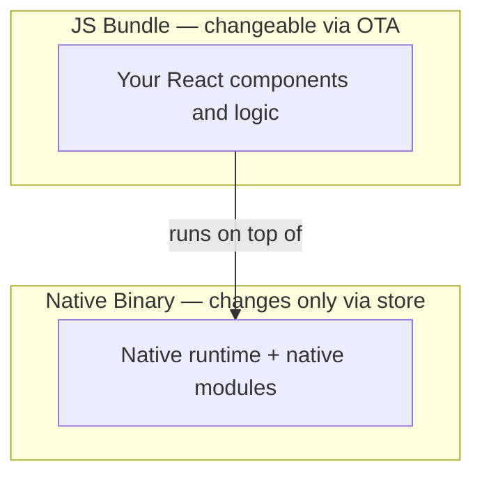
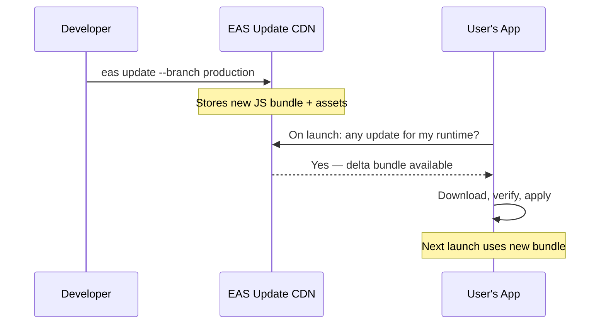
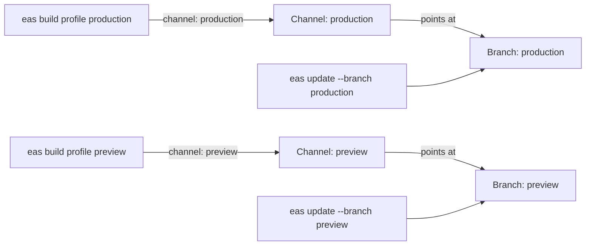
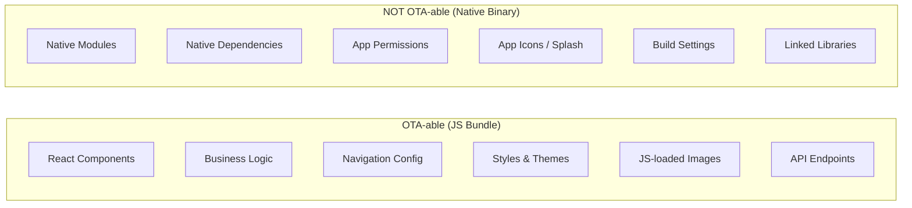
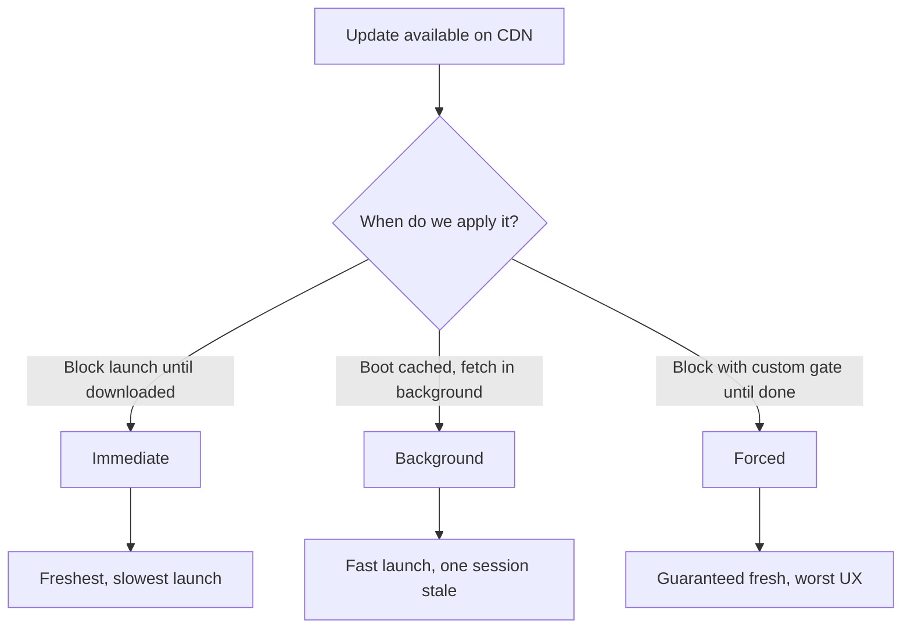
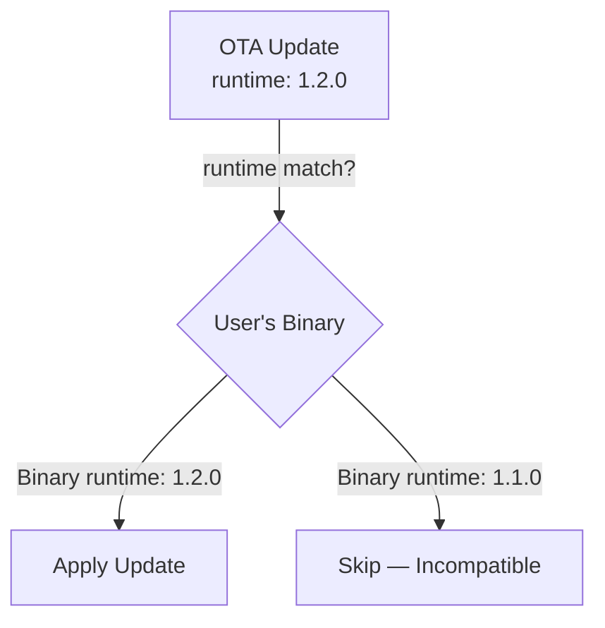
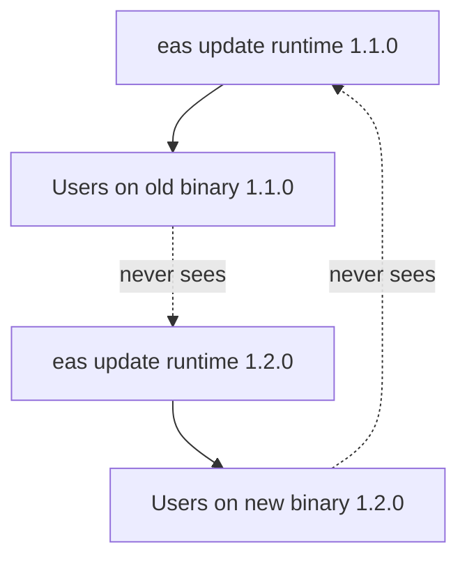
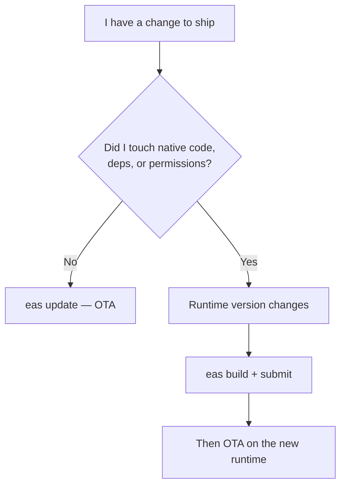
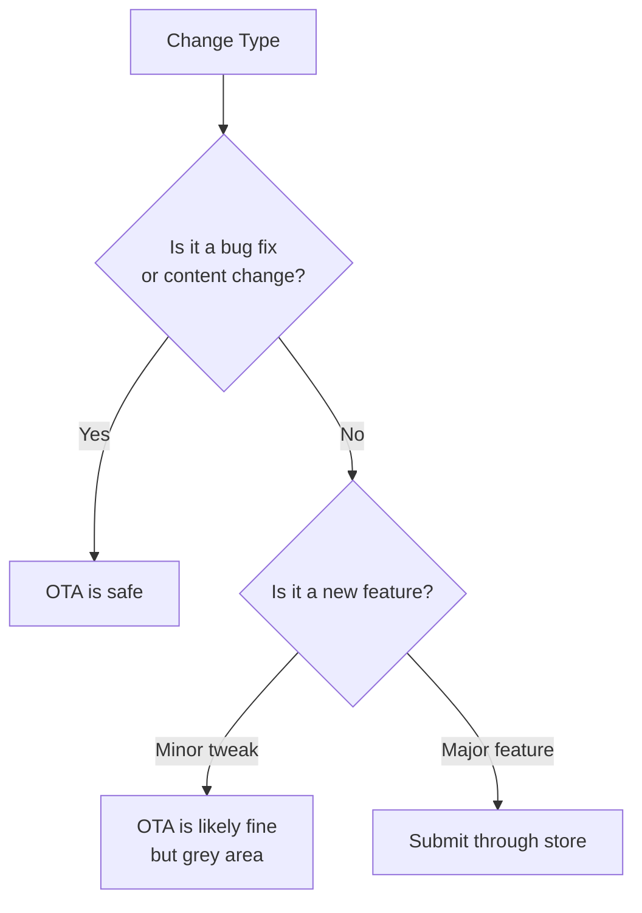

# OTA Updates: Shipping Without the App Store

> EAS Update, delta downloads, runtime versioning, and the compliance rules you must follow.

---

## Table of Contents

1. [EAS Update](#1-eas-update)
2. [What Can Be OTA'd](#2-what-can-be-otad)
3. [Update Strategy](#3-update-strategy)
4. [Versioning OTA with Native](#4-versioning-ota-with-native)
5. [Compliance](#5-compliance)

---

## 1. EAS Update

On the web, shipping a fix is trivial. You push a new bundle to your CDN, the next page load picks it up, and your users never know the difference. There is no gatekeeper between you and your users — the browser downloads fresh HTML, CSS, and JavaScript every time, so "deploy" and "live" mean the same thing. In mobile, the default path is brutal: build, submit, wait for review, wait for users to update. A typo fix can take days to reach your audience.

Why is mobile so different? Because a native app is a **compiled binary** installed on the device, not a document fetched from a server. To change anything in that binary, the operating system requires a new signed package, and both Apple and Google insert a review step before that package reaches users. OTA ("over-the-air") updates exist to claw back some of the web's agility by treating the JavaScript portion of your app like a web bundle that can be swapped out independently of the binary.

### The Mental Model

Think of a React Native app as having two layers stacked on top of each other:



The **native binary** is the engine: the React Native runtime, the JavaScript engine (Hermes), and any native modules (camera, maps, payments). It changes only through the App Store / Play Store. The **JS bundle** is the script that the engine runs — your components, business logic, and styles. EAS Update lets you replace that script without touching the engine.

> **Analogy**: The native binary is a games console. The JS bundle is the game cartridge's data. OTA updates let you patch the game's logic without shipping users a new console — but you can never add a new controller port (native capability) over the air.

EAS Update gives you the web-style deployment loop for the JavaScript side of your React Native app. You push an update from your terminal, and the next time a user opens your app, they get the new bundle — no store review, no version bump, no waiting.

### How It Works

Under the hood, EAS Update uploads your JS bundle and assets to Expo's CDN. When your app boots, the `expo-updates` library checks the server for a newer bundle that matches the current runtime version. If one exists, it downloads it (using delta compression when possible) and applies it according to your chosen strategy.

**Delta downloads** are an important efficiency trick: rather than re-downloading your entire multi-megabyte bundle, the client tells the server which assets it already has, and the server sends only the changed pieces. A one-line copy fix might be a few kilobytes over the wire instead of the whole app. This is conceptually similar to how a `git pull` only fetches new commits rather than re-cloning the repo.



### Setting It Up

First, install the updates library and configure your project:

```bash
npx expo install expo-updates
eas update:configure
```

This adds the necessary config to your `app.json` (an `updates` block plus a project ID that ties your app to Expo's servers). Now you can push updates:

```bash
# Push to a specific branch
eas update --branch production --message "Fix checkout crash"

# Push to a channel (maps branches to builds)
eas update --channel production --message "Fix checkout crash"
```

Each `eas update` produces an immutable, content-addressed update with its own ID. You never overwrite a previous update — you publish a new one and point the branch at it. This is what makes rollback instant: the old update still exists on the CDN, untouched.

### Channels and Branches

This is the part beginners find most confusing, so let's be precise. There are two related concepts:

- A **branch** is a moving line of updates (much like a Git branch). You publish updates to a branch, and the latest one is what clients receive.
- A **channel** is a label baked into a build that decides *which branch that build listens to*. Channels are the glue between your builds and your updates.

Think of channels like deployment targets:

- **production** — linked to your App Store / Play Store builds
- **preview** — linked to internal testing builds
- **staging** — linked to QA builds

A build is compiled with a specific channel baked in. When that build checks for updates, it only sees updates published to its channel's branch. This means you can push a risky fix to `staging`, verify it, then push the same bundle to `production`.



```bash
# Build with a channel
eas build --profile production  # channel: production
eas build --profile preview     # channel: preview

# Push update to staging first
eas update --channel staging --message "Test new cart logic"

# After QA passes, push to production
eas update --channel production --message "Fix cart total rounding"
```

> **Pro tip**: Because a channel is decoupled from a branch, you can re-point a channel at a different branch from the Expo dashboard without rebuilding. This is the mechanism behind promotion workflows: QA approves the branch, and you point `production`'s channel at it.

### Rollbacks

Pushed a bad update? Roll back instantly:

```bash
# Roll back to the previous update on a branch
eas update:rollback --branch production
```

No store review. No waiting. Your users get the previous good bundle on their next launch. This alone justifies using OTA updates — the safety net of instant rollback is worth the setup cost. On the web, your rollback story is "redeploy the previous build"; with EAS Update you get the same speed on native.

> **Gotcha**: Rollback reverts to the previous JS bundle, not the embedded bundle that shipped with the binary. If you need to go all the way back to the original, you will need to republish the original bundle as a new update.

> **Pro tip**: A "rollback" is itself just another publish event under the hood — it tells clients to revert. Users only see it on their *next* update check, so rollback is fast but not instantaneous for a user mid-session. Combine it with your update strategy (next section) to understand exactly when users will recover.

---

## 2. What Can Be OTA'd

This is the single most important concept to internalize. Get it wrong and your app crashes for every user who has not updated through the store.

### The Rule

OTA updates replace your **JavaScript bundle and loadable assets**. They cannot touch anything compiled into the native binary.

The reason traces directly back to the two-layer model from Section 1. The JS bundle is *data* the native engine reads at runtime, so it can be swapped freely. Native code is *machine instructions* baked into the signed binary; the OS will not let you alter those without a fresh, re-signed package going through review.



### What You CAN Push OTA

- **React components** — new screens, layout changes, UI tweaks
- **Business logic** — calculation fixes, validation rules, state management
- **Navigation structure** — reordering tabs, adding screens (if the navigator is JS-only)
- **Styles and themes** — colors, spacing, fonts (if loaded via JS)
- **Asset bundles** — images imported via `require()` or bundled JSON data
- **API endpoint changes** — switching URLs, adding headers, modifying request logic

### What You CANNOT Push OTA

- **New native modules** — installing `react-native-vision-camera` requires a store build
- **Native dependency upgrades** — bumping a native SDK version requires recompilation
- **Permission changes** — adding location or push notification permissions lives in native config
- **App icons and splash screens** — compiled into the binary at build time
- **Expo SDK upgrades** — these often change native code under the hood

### A Quick Reference Table

| Change | OTA-able? | Why |
|---|---|---|
| Fix a `.tsx` component bug | Yes | Pure JS, lives in the bundle |
| Change a color or spacing value | Yes | JS-evaluated style |
| Swap an API base URL | Yes | Just a string in JS |
| Add an image via `require()` | Yes | Loadable asset, shipped with bundle |
| `npx expo install react-native-maps` | No | Adds native code to the binary |
| Add camera permission | No | Declared in native `Info.plist` / manifest |
| Change the app icon | No | Compiled into the binary |
| Upgrade Expo SDK 50 → 51 | No | Changes the native runtime |

### The Practical Test

Before pushing an OTA update, ask yourself: "Did I run `npx expo install` or modify anything in `ios/` or `android/`?" If yes, you need a store build. If you only touched `.ts`, `.tsx`, or `.js` files and their imported assets, OTA is safe.

A useful habit: run `npx expo-doctor` or inspect your `git diff` before publishing. If the diff touches `package.json` dependencies, `app.json`'s native config, or anything under `ios/`/`android/`, treat it as a binary change and build, don't OTA.

> **Common mistake**: Installing a package with `npm install` that includes native code, then pushing an OTA update. The JS bundle references a native module that does not exist in the user's binary. Result: instant crash on launch for every user. Always check whether a new dependency has native code before deciding on OTA vs. store update.

> **Pro tip**: Prefer `npx expo install` over `npm install` for native packages. The Expo CLI knows which packages contain native code and will warn you, and it picks versions compatible with your Expo SDK — a small habit that prevents the crash above.

---

## 3. Update Strategy

How and when your app applies an update matters more than you might think. A poor strategy means users staring at loading spinners or missing critical fixes for days. The core tension is always the same: **freshness** (running the newest code) versus **launch speed** (not blocking the user while you download). Every strategy below is just a different point on that trade-off.



### Strategy Comparison

| Strategy | Startup cost | User sees new code | Best for |
|---|---|---|---|
| Immediate | High (waits to download) | This launch | Critical bug affecting core flows |
| Background | None | Next launch | Default — almost everything |
| Forced | High + blocking UI | This launch, guaranteed | Breaking API change, security fix |

### The Three Strategies

#### Immediate: Fetch and Apply on Launch

The app checks for updates at startup, downloads the new bundle, and restarts itself to apply it — all before the user sees the main screen.

```tsx
// app.json
{
  "expo": {
    "updates": {
      "checkAutomatically": "ON_LAUNCH",
      "fallbackToCacheTimeout": 3000
    }
  }
}
```

**Pros**: Users always run the latest code. Critical fixes land instantly.

**Cons**: Adds startup latency. If the download is slow, users wait. The `fallbackToCacheTimeout` sets a ceiling — after 3 seconds, the app loads the cached bundle regardless. Think of it as a deadline: "wait up to 3 seconds for a fresh bundle, then give up and boot what we have."

**Use when**: You have a critical bug that affects core functionality and you need every user on the fix immediately.

#### Background: Download Silently, Apply Next Launch

The app launches with whatever bundle it has, then checks for updates in the background. If a new bundle is available, it downloads silently. The update applies the next time the user opens the app.

```tsx
// app.json
{
  "expo": {
    "updates": {
      "checkAutomatically": "ON_LAUNCH",
      "fallbackToCacheTimeout": 0
    }
  }
}
```

Setting `fallbackToCacheTimeout` to `0` means the app never waits — it always boots the cached bundle immediately, then fetches in the background.

**Pros**: Zero startup penalty. Invisible to users. Best overall experience.

**Cons**: Users run stale code for one session after you push an update. In practice, the second time they open the app they are current.

**This is the strategy you should use by default.** The vast majority of updates are not so urgent that they justify slowing down every app launch.

You can also nudge users who are still on the old bundle by listening for the background download event and offering a gentle reload prompt:

```tsx
import * as Updates from 'expo-updates';
import { useEffect } from 'react';
import { Alert } from 'react-native';

// expo-updates emits events as background downloads progress
function useReloadPrompt() {
  useEffect(() => {
    const sub = Updates.addUpdatesStateChangeListener((event) => {
      if (event.context.isUpdatePending) {
        // A new bundle finished downloading in the background
        Alert.alert('Update ready', 'Restart to get the latest version?', [
          { text: 'Later' },
          { text: 'Restart', onPress: () => Updates.reloadAsync() },
        ]);
      }
    });
    return () => sub.remove();
  }, []);
}
```

#### Forced: Block Until Updated

The app shows a blocking screen and refuses to proceed until the update is downloaded and applied. This requires custom code:

```tsx
import * as Updates from 'expo-updates';
import { View, Text, ActivityIndicator } from 'react-native';
import { useEffect, useState } from 'react';

function ForceUpdateGate({ children }: { children: React.ReactNode }) {
  const [isUpdating, setIsUpdating] = useState(true);

  useEffect(() => {
    async function checkForUpdate() {
      try {
        const update = await Updates.checkForUpdateAsync();
        if (update.isAvailable) {
          await Updates.fetchUpdateAsync();
          await Updates.reloadAsync(); // Restarts the app
        }
      } catch (e) {
        // Update check failed — let the user through
        console.warn('Update check failed:', e);
      } finally {
        setIsUpdating(false);
      }
    }

    if (!__DEV__) {
      checkForUpdate();
    } else {
      setIsUpdating(false);
    }
  }, []);

  if (isUpdating) {
    return (
      <View style={{ flex: 1, justifyContent: 'center', alignItems: 'center' }}>
        <ActivityIndicator size="large" />
        <Text style={{ marginTop: 16 }}>Updating app…</Text>
      </View>
    );
  }

  return <>{children}</>;
}
```

Note the `if (!__DEV__)` guard: update checks are disabled in development because there is no published update to fetch and you do not want to block your own dev loop. This is the React Native equivalent of gating analytics or error reporting behind `process.env.NODE_ENV === 'production'` on the web.

**Use sparingly.** This is appropriate when an API contract has changed server-side and old clients will break, or when a security vulnerability makes running old code dangerous. Never use it for cosmetic updates.

> **Gotcha**: Always wrap update checks in a try/catch. If the user has no network and your forced update gate has no fallback, they are locked out of your app entirely. Always provide a timeout or a "continue anyway" escape hatch.

> **Pro tip**: For truly breaking changes, pair OTA with a server-driven "minimum supported version" check. The server returns a flag, and the client either hard-blocks with a "please update from the store" screen (for native-level breaks) or triggers a forced OTA (for JS-level breaks). OTA alone cannot fix a problem that lives in the native binary.

---

## 4. Versioning OTA with Native

This is where most teams stumble. You push a JS update that references a native module added in a recent build, but half your users are still on the old binary. Their app crashes. You panic. You rollback. You question your career choices.

Runtime versioning prevents this entirely. The core idea: an update should only ever land on a binary that is *capable of running it*. The runtime version is the compatibility contract that enforces this.

### How Runtime Versions Work

Every native build is stamped with a **runtime version**. Every OTA update is also stamped with a runtime version. The `expo-updates` library will only apply an update if the runtime versions match. If they do not match, the update is simply invisible to that binary — the client behaves as if no update exists, which is exactly the safe behavior you want.

> **Analogy**: A runtime version is like a save-file format version in a video game. A save (the OTA update) made for format `1.2.0` can only be loaded by a game engine (the binary) that understands format `1.2.0`. Hand it to an older engine and it refuses, rather than crashing halfway through loading.



This is why you can safely have *multiple* binary versions in the wild at once. Users on the old `1.1.0` binary keep receiving `1.1.0` updates; users who upgraded to the `1.2.0` binary receive `1.2.0` updates. Each population gets compatible JS.



### Configuring Runtime Version

In your `app.json`, set the runtime version explicitly:

```tsx
{
  "expo": {
    "runtimeVersion": "1.2.0"
  }
}
```

Or use the automatic policy that derives it from your native dependencies:

```tsx
{
  "expo": {
    "runtimeVersion": {
      "policy": "fingerprint"
    }
  }
}
```

The `fingerprint` policy hashes your native dependencies, native project files, and Expo config to generate a deterministic runtime version. If any native dependency changes, the fingerprint changes, and old binaries will not pick up the new update. This is the safest option — it removes human error from the equation, because the compatibility decision is computed from what's actually in your native layer rather than from a number a human remembered to bump.

### Runtime Version Policies Compared

| Policy | How the version is derived | When to use |
|---|---|---|
| Explicit string (`"1.2.0"`) | You set it manually | Small teams who reliably remember to bump on native changes |
| `appVersion` | Tracks your app's `version` field | Simple apps where every release bumps the version |
| `fingerprint` | Hash of native deps + config + native dirs | **Recommended default** — automatic and crash-proof |

### When to Bump Runtime Version

If you manage runtime versions manually, follow this rule:

| Change | Bump Runtime? |
|---|---|
| Fix a typo in a component | No |
| Change business logic in JS | No |
| Add a new JS-only library | No |
| Install a library with native code | **Yes** |
| Upgrade Expo SDK | **Yes** |
| Modify `ios/` or `android/` directly | **Yes** |
| Change app permissions | **Yes** |

### The Workflow

Here is the complete flow for a team shipping both store builds and OTA updates:

```bash
# 1. Normal JS-only fix — OTA is fine
git commit -m "fix: correct tax calculation"
eas update --channel production --message "Fix tax calc"

# 2. Adding a native dependency — need a store build
npx expo install react-native-maps
# Runtime version changes automatically with fingerprint policy
eas build --profile production
# Submit new binary to stores
eas submit --platform all
# Now OTA updates target the new runtime version
eas update --channel production --message "Add store locator map"
```

The decision of "OTA or build?" comes down to a single question, visualized below:



> **Common mistake**: Using a static runtime version like `"1.0.0"` and never bumping it. You install a native library, push an OTA update, and every user on the old binary crashes. Use the `fingerprint` policy unless you have a specific reason not to — it handles this automatically.

---

## 5. Compliance

You can build the most elegant OTA pipeline in the world, and Apple can still reject your app or pull it from the store if you violate their guidelines. This section is not optional reading. The stakes are higher than a rejected build: repeated or deliberate abuse can get your developer account terminated, which takes *all* your apps down with it.

### Why the Rules Exist

App Review is Apple's promise to users that what they install has been vetted. OTA updates let you change the app *after* review, so Apple's rules exist to ensure you can't use OTA to smuggle in something they would have rejected. The mental model that keeps you safe: **OTA is your hotfix lane, the store is your release process.** As long as your over-the-air changes stay within the spirit of "fixes and improvements to a reviewed app," you are fine.

### Apple's Rules

Apple's App Store Review Guidelines (specifically section 3.3.2) allow executable code to be downloaded to an app **only** if the code:

- Does not change the primary purpose of the app
- Does not create a store or storefront within the app
- Is used for **bug fixes and improvements** — not to bypass App Review by adding features

The practical interpretation: you can push bug fixes, performance improvements, copy changes, and minor UI tweaks via OTA. You should **not** use OTA to ship entirely new features that would change the experience Apple reviewed.

### Google's Rules

Google Play is more lenient. Their policy allows downloading executable code as long as it complies with the Developer Program Policies. In practice, Google rarely enforces restrictions on JS bundle updates. But "rarely enforces" is not "never enforces" — stay within the spirit of the rules. Designing your process around Apple's stricter rules means you are automatically compliant with Google's, so use Apple as your baseline.

### What This Means in Practice



**Safe for OTA:**
- Fixing a crash or bug
- Updating text, translations, copy
- Changing colors, spacing, layout tweaks
- Adjusting business logic (tax calculations, validation rules)
- Swapping API endpoints
- A/B test variations (if the feature was already reviewed)

**Grey area:**
- Adding a new screen to an existing flow
- Changing navigation structure
- Enabling a feature flag for something not yet reviewed

**Requires store submission:**
- Adding an entirely new feature (e.g., a chat system, payment flow)
- Changing the app's core purpose or functionality
- Adding new permission requirements (even if the native side already declared them)

### Recommendations

1. **Use OTA for fixes, store for features.** This is not just a compliance rule — it is good practice. New features deserve the QA cycle that a full build provides.

2. **Keep a changelog.** If Apple ever questions your OTA usage, you want to demonstrate that your updates are bug fixes and improvements, not feature smuggling. Your `--message` on each `eas update` doubles as this audit trail.

3. **Do not use OTA to bypass review intentionally.** Some teams ship a skeleton app, get it approved, then OTA the real app on top. Apple has gotten wise to this. If they catch you, you risk account termination — not just app removal.

4. **Feature flags are fine** — as long as the features behind them were submitted for review at some point. Toggling a reviewed feature on via OTA is standard practice. Shipping unreviewable code behind a flag is not.

> **The bottom line**: OTA updates are a deployment mechanism, not a way to avoid App Review. Treat store submissions as your release process for new features, and OTA as your hotfix lane. If you follow that mental model, you will never have a compliance problem.