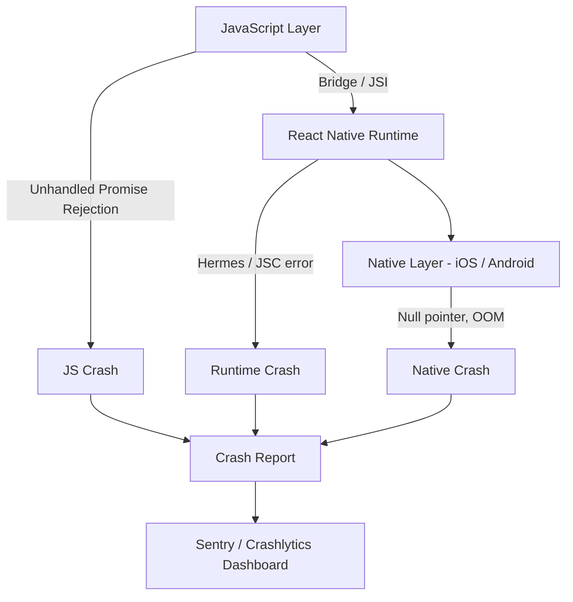
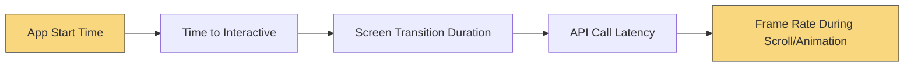
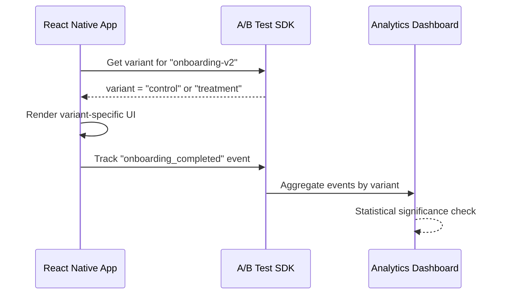

# Monitoring and Production: Keeping Your App Healthy

> Crash reporting, analytics, feature flags, and the observability stack for production mobile apps.

---

## Table of Contents

1. [Crash Reporting](#1-crash-reporting)
2. [Analytics](#2-analytics)
3. [Performance Monitoring](#3-performance-monitoring)
4. [Feature Flags and Remote Config](#4-feature-flags-and-remote-config)
5. [Logging](#5-logging)
6. [A/B Testing](#6-ab-testing)

---

## 1. Crash Reporting

On the web, an unhandled exception shows a white screen and maybe hits your error boundary. The user refreshes, life goes on. On mobile, an unhandled exception kills the app. The user sees the OS home screen. No stack trace, no network tab, no reproduction steps. If you don't have crash reporting, you are flying blind.

### Why Crashes Are Harder on Mobile

A React Native app has three layers where things can go wrong:



A JavaScript error, a native null pointer, a Hermes engine crash — each produces a different kind of stack trace, and each needs different tooling to symbolicate.

### Sentry: The Gold Standard

Sentry is the best option for React Native crash reporting. It captures JS exceptions, native crashes on both platforms, and gives you source-mapped stack traces if you upload your maps.

```bash
npx expo install @sentry/react-native
```

```tsx
// App.tsx
import * as Sentry from "@sentry/react-native";

Sentry.init({
  dsn: "https://your-dsn@sentry.io/project-id",
  tracesSampleRate: 0.2, // 20% of transactions for performance
  enableAutoSessionTracking: true,
  attachStacktrace: true,
});

export default Sentry.wrap(function App() {
  return <RootNavigator />;
});
```

The critical step most people skip: **upload source maps**. Without them, your JS stack traces are minified garbage.

```bash
# For Expo EAS builds — add the Sentry plugin in app.json
{
  "expo": {
    "plugins": [
      ["@sentry/react-native/expo", {
        "organization": "your-org",
        "project": "your-project"
      }]
    ]
  }
}
```

For bare React Native, add the Sentry Gradle and Xcode build phase scripts. The `@sentry/react-native` docs walk you through it, but the gist is: the build process uploads maps automatically when you build a release.

### Alternatives

**Firebase Crashlytics** is free and excellent for native crashes. It integrates tightly with the Firebase ecosystem. The downside: its JavaScript crash support is weaker than Sentry's. Many teams run both — Crashlytics for native layer visibility and Sentry for JS.

**Bugsnag** is solid but less popular in the RN community. Fewer tutorials, fewer community integrations.

### Common Gotchas

- **Forgetting to test release builds locally.** Debug builds behave differently. Crashes that only happen in release mode will surprise you if you never run `npx expo run:ios --configuration Release`.
- **Not setting up an error boundary.** Crash reporters catch the exception, but your app still dies. Wrap your root component in an error boundary that shows a "something went wrong" screen and a restart button.
- **Promise rejections.** Unhandled promise rejections don't always crash the app, but they should. Enable the `enablePromiseRejectionTracking` option in Sentry so they appear in your dashboard.

---

## 2. Analytics

You shipped the app. People are downloading it. But are they using it? Analytics answers the questions crash reports can't: what features get used, where users drop off, and which flows are broken without technically crashing.

### Choosing a Tool

| Tool | Strength | Price | Best For |
|------|----------|-------|----------|
| **PostHog** | Product analytics + feature flags + session replay | Free tier, then usage-based | Startups wanting an all-in-one |
| **Mixpanel** | Events + funnels + retention | Free tier up to 20M events | Teams focused on conversion funnels |
| **Amplitude** | Cohort analysis + behavioral segmentation | Free tier | Data-heavy product teams |
| **Firebase Analytics** | Free, integrates FCM and Crashlytics | Free | Budget-conscious or Google-stack teams |
| **Segment** | Not an analytics tool — it's a pipe | Usage-based | Teams sending data to 5+ destinations |

My recommendation: start with **PostHog** if you want product analytics, feature flags, and session replay from one SDK. Use **Segment** if you already know you'll need data flowing to multiple destinations (your data warehouse, marketing tools, support tools).

### Basic Setup with PostHog

```bash
npx expo install posthog-react-native
```

```tsx
// App.tsx
import { PostHogProvider } from "posthog-react-native";

export default function App() {
  return (
    <PostHogProvider
      apiKey="phc_your_key"
      options={{
        host: "https://us.i.posthog.com", // or eu.i.posthog.com
      }}
    >
      <RootNavigator />
    </PostHogProvider>
  );
}
```

```tsx
// Inside any component
import { usePostHog } from "posthog-react-native";

function CheckoutScreen() {
  const posthog = usePostHog();

  const handlePurchase = (item: CartItem) => {
    posthog.capture("purchase_completed", {
      item_id: item.id,
      price: item.price,
      currency: "USD",
    });
  };

  return <Button onPress={() => handlePurchase(item)} title="Buy" />;
}
```

On the web, you might use `window.analytics` or a `<script>` tag. In React Native, you install an SDK and wrap your app in a provider — same pattern as any React context.

### What to Track

Don't track everything. Track decisions:

- **Screen views** — which screens do users actually visit?
- **Core action completions** — sign-up, purchase, share, bookmark.
- **Funnel drop-offs** — started checkout but didn't finish, opened onboarding but skipped.
- **Error states** — API failures the user experienced (not just crashes).

> Resist the urge to track every button tap. You'll drown in data and find nothing. Start with 10-15 events that map to your product's key flows, then expand.

---

## 3. Performance Monitoring

Your app doesn't crash, but it feels slow. Screens take 2 seconds to render. Animations stutter. The user doesn't file a bug report — they just leave a 2-star review.

Performance monitoring answers: how fast is my app for real users on real devices?

### What to Measure



**App start time** — cold start (app wasn't in memory) vs. warm start (app was backgrounded). On Android especially, cold start can be painfully slow if your JS bundle is large.

**Slow renders** — React re-renders that block the JS thread. Sentry Performance can detect these automatically.

**API latency as the user experiences it** — not what your server logs say, but how long the user waited.

### Sentry Performance

If you already use Sentry for crash reporting, enabling performance monitoring is one config change:

```tsx
Sentry.init({
  dsn: "your-dsn",
  tracesSampleRate: 0.2,
  enableAutoPerformanceTracing: true, // auto-instruments navigation
});
```

This gives you automatic traces for screen transitions (if you use React Navigation), HTTP request spans, and slow JS frame detection.

For custom measurements:

```tsx
const transaction = Sentry.startTransaction({ name: "load-feed" });
const span = transaction.startChild({ op: "api.fetch", description: "GET /feed" });

const data = await fetchFeed();

span.finish();
transaction.finish();
```

### Alternatives

**Firebase Performance Monitoring** — free, gives you network request traces and screen rendering time. Less granular than Sentry for JS-thread analysis, but the price is right.

**Datadog RUM** — the enterprise option. If your backend already uses Datadog, adding mobile RUM gives you end-to-end traces from button tap to database query. Expensive, but the unified view is powerful.

### Common Gotchas

- **Sampling rate too high.** Setting `tracesSampleRate: 1.0` in production will cost you money and slow your app. Start at 0.1–0.2 and increase for specific flows you want to investigate.
- **Ignoring Android low-end devices.** Your iPhone 15 Pro runs everything fast. Test on a 3-year-old Android phone with 3GB of RAM. That's your real user.
- **Not measuring what matters.** "Average screen load time" is a vanity metric. Measure the P95 (95th percentile) — what's the experience for your slowest 5% of users?

---

## 4. Feature Flags and Remote Config

You want to roll out a new checkout flow, but only to 10% of users first. Or you want to disable a feature instantly when something breaks, without pushing an app update and waiting 24 hours for App Store review.

Feature flags let you change behavior without deploying code. Remote config lets you change values (copy, thresholds, URLs) without deploying code. They overlap significantly.

### The Options

**PostHog** — if you already use it for analytics, feature flags are built in. Evaluations happen server-side or via the SDK. Tight integration with their analytics means you can see how flag variants affect metrics.

**LaunchDarkly** — the most mature feature flag platform. Rich targeting rules, audit logs, enterprise governance. Expensive, but battle-tested at scale.

**Statsig** — strong focus on experimentation. Feature flags are a means to run A/B tests. Good free tier.

**Firebase Remote Config** — free, simple key-value remote config. Not true feature flags (no percentage rollouts out of the box), but good enough for simple toggles and config values.

### PostHog Feature Flags in Practice

```tsx
import { useFeatureFlag } from "posthog-react-native";

function CheckoutScreen() {
  const showNewCheckout = useFeatureFlag("new-checkout-flow");

  if (showNewCheckout) {
    return <NewCheckoutFlow />;
  }

  return <LegacyCheckoutFlow />;
}
```

That's it. The flag evaluates against the current user's properties (device, country, cohort, whatever you configure in the PostHog dashboard). Change the rollout percentage from 10% to 100% in the dashboard, no deploy needed.

### Kill Switches

Every production app should have at least one kill switch: a feature flag that disables a broken feature instantly.

```tsx
function PaymentScreen() {
  const paymentsEnabled = useFeatureFlag("payments-enabled");

  if (!paymentsEnabled) {
    return (
      <View style={styles.center}>
        <Text>Payments are temporarily unavailable. Please try again later.</Text>
      </View>
    );
  }

  return <PaymentForm />;
}
```

When your payment provider has an outage at 2 AM, you flip the flag in a dashboard instead of pushing a hotfix through app review.

> On the web, you can deploy a fix in minutes. On mobile, even with OTA updates, propagation takes time. Feature flags are your instant escape hatch.

### Common Gotchas

- **Stale flags on cold start.** Most SDKs cache flag values locally. On first launch, the SDK might not have fetched flags yet. Always define sensible defaults.
- **Flag sprawl.** Teams create flags and never clean them up. After a feature is 100% rolled out for two weeks, remove the flag from your code and archive it in the dashboard.

---

## 5. Logging

`console.log` is your best friend in development and your worst enemy in production. It leaks information, clutters device logs, and in some cases can actually slow your app.

### The Problem

On the web, `console.log` goes to the browser DevTools. Only developers see it. On mobile, `console.log` writes to the system log — which other apps and crash reporters can potentially read. More importantly, excessive logging on the JS thread blocks rendering.

### Strip Logs in Production

The simplest approach: use Babel to strip them.

```bash
npm install --save-dev babel-plugin-transform-remove-console
```

```js
// babel.config.js
module.exports = function (api) {
  api.cache(true);
  const plugins = [];

  if (process.env.NODE_ENV === "production") {
    plugins.push("transform-remove-console");
  }

  return {
    presets: ["babel-preset-expo"],
    plugins,
  };
};
```

Now every `console.log`, `console.warn`, and `console.error` is removed from your production bundle. Zero cost, zero leakage.

### Structured Logging with react-native-logs

For anything beyond `console.log`, use a proper logging library:

```bash
npm install react-native-logs
```

```tsx
import { logger, consoleTransport } from "react-native-logs";

const log = logger.createLogger({
  severity: __DEV__ ? "debug" : "warn",
  transport: consoleTransport,
  transportOptions: {
    colors: {
      debug: "white",
      info: "blueBright",
      warn: "yellowBright",
      error: "redBright",
    },
  },
});

// Usage
log.debug("Fetching user profile", { userId: 42 });
log.warn("API responded slowly", { latency: 3200 });
log.error("Payment failed", { code: "CARD_DECLINED" });
```

### Piping Logs to Sentry Breadcrumbs

The real power: connect your logger to Sentry so that when a crash happens, you get the last N log entries as breadcrumbs.

```tsx
import * as Sentry from "@sentry/react-native";
import { logger } from "react-native-logs";

const sentryTransport = (props: { msg: string; rawMsg: unknown[]; level: { text: string } }) => {
  Sentry.addBreadcrumb({
    message: props.msg,
    level: props.level.text as Sentry.SeverityLevel,
    category: "app.log",
  });
};

const log = logger.createLogger({
  severity: __DEV__ ? "debug" : "info",
  transport: __DEV__ ? consoleTransport : sentryTransport,
});
```

Now in development you see colored console output. In production, logs become Sentry breadcrumbs — invisible to the user, but visible to you when investigating a crash.

### Common Gotchas

- **Logging sensitive data.** Never log auth tokens, passwords, or PII. In production breadcrumbs, this data ends up on Sentry's servers.
- **Logging inside hot loops.** A `console.log` inside a `FlatList` render function will fire hundreds of times and block the JS thread.
- **Not logging enough.** The opposite mistake. When a crash happens and you have zero breadcrumbs, you'll wish you had logged key state transitions.

---

## 6. A/B Testing

Feature flags tell you "is this enabled?" A/B testing tells you "is this better?" The mechanics overlap — both show different experiences to different users — but the goal is different: measurement over control.

### How It Works on Mobile



The app asks the SDK which variant the user is in. The app renders accordingly. The app tracks outcome events. The dashboard crunches the numbers and tells you which variant won.

### Tools

**PostHog Experiments** — built on their feature flags and analytics. Define an experiment, set the metric you want to improve, and PostHog handles variant assignment and statistical analysis.

**Statsig** — purpose-built for experimentation. Their free tier is generous and their stats engine is rigorous. If A/B testing is a core part of your product culture, Statsig is worth evaluating.

**LaunchDarkly Experimentation** — adds experiment tracking on top of their feature flag infrastructure. Good if you already pay for LaunchDarkly.

### Combining A/B Tests with EAS Update

Here's a powerful pattern unique to React Native with Expo: use feature flags to gate code paths, then use EAS Update to push different JS bundles to different update channels.

```tsx
// This component renders based on a feature flag
function OnboardingFlow() {
  const variant = useFeatureFlag("onboarding-experiment");

  if (variant === "streamlined") {
    return <StreamlinedOnboarding />;
  }

  return <OriginalOnboarding />;
}
```

The flag controls which path runs. But both code paths ship in the same bundle. For larger experiments where you want entirely different code, you can publish different EAS Update bundles to different channels — though flag-based branching within a single bundle is simpler and preferred for most cases.

### Practical Tips

- **Choose one primary metric per experiment.** "Does the new onboarding increase 7-day retention?" Not "does it improve retention AND engagement AND revenue?" You can track secondary metrics, but statistical rigor requires a single primary.
- **Run experiments long enough.** Mobile users behave differently on weekdays vs. weekends. Run for at least two full weeks.
- **Account for app update lag.** Unlike the web, not all users are on the same version. Filter your experiment results by app version to avoid mixing signals.

> The biggest mistake teams make with A/B testing: shipping the losing variant's code for months because nobody cleaned it up. Treat experiment code like a branch — merge the winner, delete the loser.

---