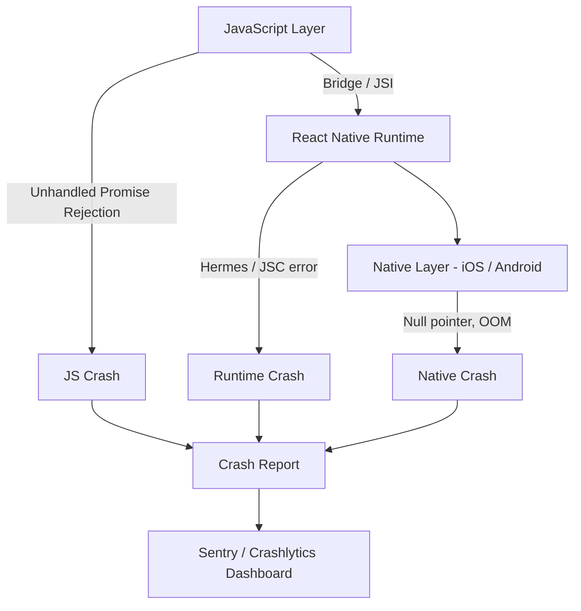
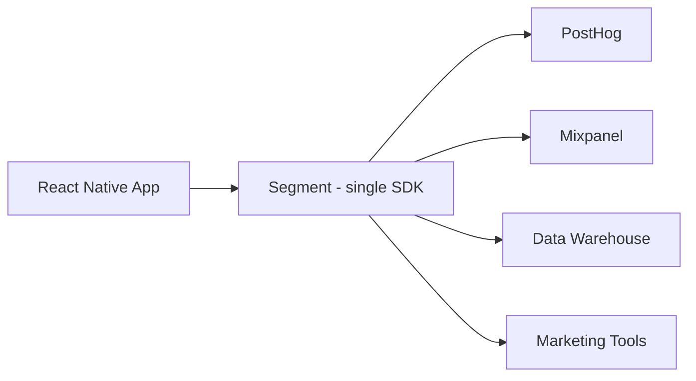
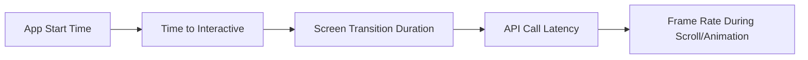
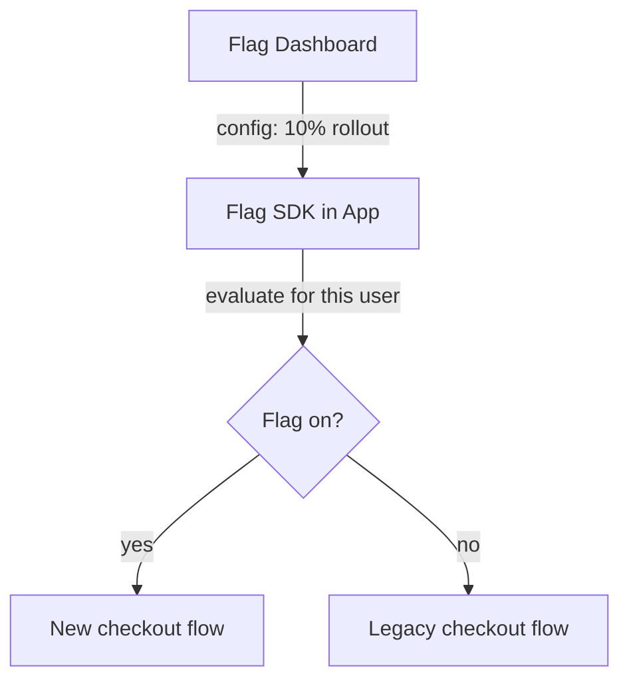
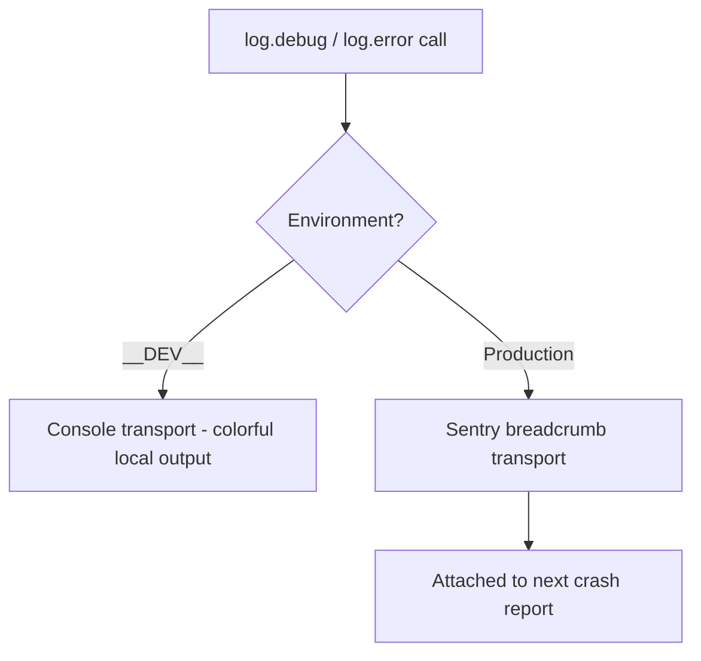
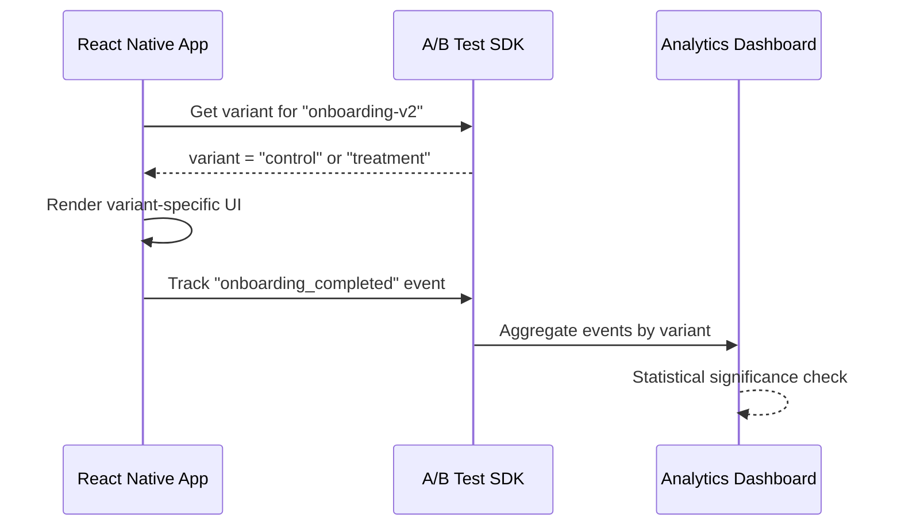

# Monitoring and Production: Keeping Your App Healthy

> Crash reporting, analytics, feature flags, and the observability stack for production mobile apps.

---

## Table of Contents

1. [Crash Reporting](#1-crash-reporting)
2. [Analytics](#2-analytics)
3. [Performance Monitoring](#3-performance-monitoring)
4. [Feature Flags and Remote Config](#4-feature-flags-and-remote-config)
5. [Logging](#5-logging)
6. [A/B Testing](#6-ab-testing)

---

## 1. Crash Reporting

On the web, an unhandled exception shows a white screen and maybe hits your error boundary. The user refreshes, life goes on. On mobile, an unhandled exception kills the app. The user sees the OS home screen. No stack trace, no network tab, no reproduction steps. If you don't have crash reporting, you are flying blind.

Think of crash reporting as the airplane's black box. You can't stand behind every user watching their screen, so instead you install a recorder that captures the final moments before a crash — the error, the device, the OS version, the recent user actions — and ships that report back to you. Without it, your only feedback loop is a one-star review that says "keeps crashing" with no detail you can act on.

### Why You Can't Just Use a Try/Catch

On the web you can wrap risky code in `try/catch` and recover. That still works in React Native for synchronous JS errors — but most production crashes are *not* in code you wrapped. They come from a render that throws, a background timer, a native module, or the OS killing your app for using too much memory. You cannot wrap those. You need a tool that hooks into the global error handlers of all three layers below.

### Why Crashes Are Harder on Mobile

A React Native app has three layers where things can go wrong:



A JavaScript error, a native null pointer, a Hermes engine crash — each produces a different kind of stack trace, and each needs different tooling to symbolicate. "Symbolicate" means turning the cryptic addresses and minified names in a raw crash dump back into the real file names, function names, and line numbers you wrote. A raw native crash looks like `0x00012f4a`; symbolicated, it reads `PaymentScreen.tsx:42`. The whole game of crash reporting is getting from the former to the latter.

| Layer | Example crash | What you need to read it |
|-------|---------------|--------------------------|
| JavaScript | `undefined is not a function`, unhandled promise rejection | **Source maps** (maps minified JS back to your source) |
| RN Runtime | Hermes engine error, bad JSI call | Source maps + RN symbols |
| Native (iOS/Android) | Null pointer, out-of-memory (OOM) kill | **dSYM** files (iOS) / **ProGuard mapping** (Android) |

> The single most common reason a crash report is useless: the uploaded build had no source maps or symbol files, so every line reads `<anonymous>:1:148293`. Wire up symbol upload on day one, before you ship.

### Sentry: The Gold Standard

Sentry is the best option for React Native crash reporting. It captures JS exceptions, native crashes on both platforms, and gives you source-mapped stack traces if you upload your maps.

```bash
npx expo install @sentry/react-native
```

```tsx
// App.tsx
import * as Sentry from "@sentry/react-native";

Sentry.init({
  dsn: "https://your-dsn@sentry.io/project-id",
  tracesSampleRate: 0.2,              // 20% of transactions for performance
  enableAutoSessionTracking: true,    // tracks "crash-free session" rate
  attachStacktrace: true,             // include a stack trace on captureMessage too
  environment: __DEV__ ? "development" : "production", // separate dev noise from real crashes
});

export default Sentry.wrap(function App() {
  return <RootNavigator />;
});
```

The `Sentry.wrap()` call is doing the heavy lifting: it installs a global error handler so any uncaught error anywhere in your component tree gets reported automatically — you do not have to manually catch anything. The `dsn` (Data Source Name) is just the address that tells the SDK which Sentry project to send reports to; it is safe to ship in your app.

You can also report handled errors explicitly, which is great for "this shouldn't happen but didn't crash" situations:

```tsx
try {
  await syncOfflineQueue();
} catch (err) {
  // The app keeps working, but you still want to know this failed
  Sentry.captureException(err, {
    tags: { feature: "offline-sync" },
    extra: { queueLength: queue.length },
  });
}

// Attach context so reports are debuggable. Never include passwords/tokens here.
Sentry.setUser({ id: user.id }); // id only — not email/name if avoidable
```

The critical step most people skip: **upload source maps**. Without them, your JS stack traces are minified garbage.

```bash
# For Expo EAS builds — add the Sentry plugin in app.json
{
  "expo": {
    "plugins": [
      ["@sentry/react-native/expo", {
        "organization": "your-org",
        "project": "your-project"
      }]
    ]
  }
}
```

For bare React Native, add the Sentry Gradle and Xcode build phase scripts. The `@sentry/react-native` docs walk you through it, but the gist is: the build process uploads maps automatically when you build a release.

### Alternatives

**Firebase Crashlytics** is free and excellent for native crashes. It integrates tightly with the Firebase ecosystem. The downside: its JavaScript crash support is weaker than Sentry's. Many teams run both — Crashlytics for native layer visibility and Sentry for JS.

**Bugsnag** is solid but less popular in the RN community. Fewer tutorials, fewer community integrations.

| Tool | JS crash quality | Native crash quality | Price | When to use |
|------|------------------|----------------------|-------|-------------|
| **Sentry** | Excellent | Excellent | Free tier, then usage-based | Default choice; best end-to-end JS + native + performance |
| **Firebase Crashlytics** | Weaker | Excellent | Free | Already on the Firebase/Google stack, or tight budget |
| **Bugsnag** | Good | Good | Paid | Existing org standard; otherwise less RN community support |

> Pro tip: don't run two full crash reporters by accident. Two SDKs both installing global error handlers can double-report or fight over the handler. If you run Crashlytics for native and Sentry for JS, scope each deliberately rather than letting both grab everything.

### Common Gotchas

- **Forgetting to test release builds locally.** Debug builds behave differently — they keep the dev menu, full logs, and unminified code. Crashes that only happen in release mode will surprise you if you never run `npx expo run:ios --configuration Release`.
- **Not setting up an error boundary.** Crash reporters catch the exception, but your app still dies. Wrap your root component in an error boundary that shows a "something went wrong" screen and a restart button. This is the same React error-boundary pattern you'd use on the web — except here it's the difference between a graceful recovery screen and the user being dumped to the home screen.
- **Promise rejections.** Unhandled promise rejections don't always crash the app, but they should. Enable the `enablePromiseRejectionTracking` option in Sentry so they appear in your dashboard.

```tsx
// A minimal root error boundary that reports to Sentry, then offers a way out
import * as Sentry from "@sentry/react-native";

class RootErrorBoundary extends React.Component<{ children: React.ReactNode }, { hasError: boolean }> {
  state = { hasError: false };

  static getDerivedStateFromError() {
    return { hasError: true };
  }

  componentDidCatch(error: Error, info: React.ErrorInfo) {
    Sentry.captureException(error, { extra: { componentStack: info.componentStack } });
  }

  render() {
    if (this.state.hasError) {
      return <FallbackScreen onRestart={() => this.setState({ hasError: false })} />;
    }
    return this.props.children;
  }
}
```

---

## 2. Analytics

You shipped the app. People are downloading it. But are they using it? Analytics answers the questions crash reports can't: what features get used, where users drop off, and which flows are broken without technically crashing.

The mental model: crash reporting tells you what *broke*; analytics tells you what *happened*. A checkout that silently fails to convert isn't a crash — nothing threw — but it's just as fatal to your business. Analytics is how you see the invisible failures: the screen nobody opens, the button nobody taps, the form everyone abandons on step three.

### Events, Properties, and Identity — the Core Vocabulary

Almost every analytics tool shares three concepts:

- **Event** — a named thing that happened: `"purchase_completed"`, `"screen_viewed"`. This is the verb.
- **Properties** — key/value details attached to an event: `{ price: 9.99, currency: "USD" }`. These are the adjectives that let you slice the data later ("revenue from EUR users only").
- **Identity** — tying events to a user via `identify(userId)` so you can follow one person's journey across sessions and devices.

If you internalize just those three, you can pick up any analytics SDK in an afternoon.

### Choosing a Tool

| Tool | Strength | Price | Best For |
|------|----------|-------|----------|
| **PostHog** | Product analytics + feature flags + session replay | Free tier, then usage-based | Startups wanting an all-in-one |
| **Mixpanel** | Events + funnels + retention | Free tier up to 20M events | Teams focused on conversion funnels |
| **Amplitude** | Cohort analysis + behavioral segmentation | Free tier | Data-heavy product teams |
| **Firebase Analytics** | Free, integrates FCM and Crashlytics | Free | Budget-conscious or Google-stack teams |
| **Segment** | Not an analytics tool — it's a pipe | Usage-based | Teams sending data to 5+ destinations |

My recommendation: start with **PostHog** if you want product analytics, feature flags, and session replay from one SDK. Use **Segment** if you already know you'll need data flowing to multiple destinations (your data warehouse, marketing tools, support tools).

The Segment distinction trips people up, so here's the picture. Segment doesn't *analyze* anything — it's plumbing. You send each event once to Segment, and it fans that event out to all your destinations. The alternative is installing five SDKs and calling `capture()` five times for every event.



### Basic Setup with PostHog

```bash
npx expo install posthog-react-native
```

```tsx
// App.tsx
import { PostHogProvider } from "posthog-react-native";

export default function App() {
  return (
    <PostHogProvider
      apiKey="phc_your_key"
      options={{
        host: "https://us.i.posthog.com", // or eu.i.posthog.com for EU data residency
      }}
    >
      <RootNavigator />
    </PostHogProvider>
  );
}
```

```tsx
// Inside any component
import { usePostHog } from "posthog-react-native";

function CheckoutScreen() {
  const posthog = usePostHog();

  const handlePurchase = (item: CartItem) => {
    // Event name = the verb. Properties = the details you'll slice by later.
    posthog.capture("purchase_completed", {
      item_id: item.id,
      price: item.price,
      currency: "USD",
    });
  };

  return <Button onPress={() => handlePurchase(item)} title="Buy" />;
}
```

```tsx
// After login, tie all future events to this user
posthog.identify(user.id, {
  plan: user.plan,        // person properties — used for cohorts and flag targeting
  signup_date: user.createdAt,
});

// On logout, reset so the next user's events aren't merged with this one
posthog.reset();
```

On the web, you might use `window.analytics` or a `<script>` tag. In React Native, you install an SDK and wrap your app in a provider — same pattern as any React context. One mobile-specific difference: there is no URL bar, so "page views" become **screen views**, which you wire into your navigation library rather than getting for free from the browser.

### What to Track

Don't track everything. Track decisions:

- **Screen views** — which screens do users actually visit?
- **Core action completions** — sign-up, purchase, share, bookmark.
- **Funnel drop-offs** — started checkout but didn't finish, opened onboarding but skipped.
- **Error states** — API failures the user experienced (not just crashes).

A good naming convention saves you months of pain. Pick `object_action` in `snake_case` (`cart_viewed`, `checkout_started`, `payment_failed`) and stick to it everywhere. Mixed conventions like `ViewedCart`, `cart-view`, and `cartViewed` will fragment your funnels into uselessness because the dashboard treats them as three different events.

> Resist the urge to track every button tap. You'll drown in data and find nothing. Start with 10-15 events that map to your product's key flows, then expand.

> Pro tip: agree on the event taxonomy in a shared doc *before* you write the first `capture()` call. Renaming an event later doesn't retroactively fix the millions of old events already recorded under the old name.

---

## 3. Performance Monitoring

Your app doesn't crash, but it feels slow. Screens take 2 seconds to render. Animations stutter. The user doesn't file a bug report — they just leave a 2-star review.

Performance monitoring answers: how fast is my app for real users on real devices? The "real" matters. Your dev machine is a flagship phone on office Wi-Fi. Your median user is on a three-year-old Android over spotty mobile data. RUM — **Real User Monitoring** — is the term for measuring what actual users experience in the wild, as opposed to synthetic benchmarks on your own device.

### Why "Smooth" Means 60fps — and Why the JS Thread Matters

Mobile screens repaint 60 times a second (newer devices, 120). That gives each frame about **16 milliseconds** to be ready. If your JavaScript is busy computing something for 50ms, several frames get skipped — the user sees a stutter, called "jank." In React Native, layout, gestures, and your component logic all share one JS thread, so a single expensive render can freeze the whole UI. This is why "what's slow" on mobile is usually "what's blocking the JS thread," a concept that has no exact web equivalent because browsers offload more to separate threads.

### What to Measure



**App start time** — cold start (app wasn't in memory) vs. warm start (app was backgrounded). On Android especially, cold start can be painfully slow if your JS bundle is large.

**Slow renders** — React re-renders that block the JS thread. Sentry Performance can detect these automatically.

**API latency as the user experiences it** — not what your server logs say, but how long the user waited. Your server might report a 40ms response, but the user on a subway with one bar waited 4 seconds. Only client-side measurement captures that.

| Metric | What it tells you | Good target (rough) |
|--------|-------------------|---------------------|
| Cold start time | How long from tap-icon to usable | < 2s |
| Time to interactive | When the user can actually tap things | < 1s after first screen |
| Screen transition | Navigation feels instant or laggy | < 300ms |
| Frame rate (scroll/animation) | Visual smoothness ("jank") | 60fps (no dropped frames) |
| API latency (P95) | Real wait time for the slow tail | < 1s |

### Sentry Performance

If you already use Sentry for crash reporting, enabling performance monitoring is one config change:

```tsx
Sentry.init({
  dsn: "your-dsn",
  tracesSampleRate: 0.2,
  enableAutoPerformanceTracing: true, // auto-instruments navigation
});
```

This gives you automatic traces for screen transitions (if you use React Navigation), HTTP request spans, and slow JS frame detection. A "trace" is a timed recording of an operation; "spans" are the sub-steps inside it. Think of a trace as a stopwatch for "load the feed" and each span as a lap time for "fetch data," "parse JSON," "render list."

For custom measurements:

```tsx
const transaction = Sentry.startTransaction({ name: "load-feed" });
const span = transaction.startChild({ op: "api.fetch", description: "GET /feed" });

const data = await fetchFeed();

span.finish();        // stop the lap timer for the fetch
transaction.finish(); // stop the overall stopwatch — Sentry now has the breakdown
```

### Alternatives

**Firebase Performance Monitoring** — free, gives you network request traces and screen rendering time. Less granular than Sentry for JS-thread analysis, but the price is right.

**Datadog RUM** — the enterprise option. If your backend already uses Datadog, adding mobile RUM gives you end-to-end traces from button tap to database query. Expensive, but the unified view is powerful.

| Tool | Granularity | Price | When to use |
|------|-------------|-------|-------------|
| **Sentry Performance** | High (JS thread + spans) | Free tier, then usage-based | Already using Sentry; want JS-level detail |
| **Firebase Perf** | Medium (network + render) | Free | Budget-conscious, already on Firebase |
| **Datadog RUM** | Very high (end-to-end) | Expensive | Backend already on Datadog; want one pane of glass |

### Common Gotchas

- **Sampling rate too high.** Setting `tracesSampleRate: 1.0` in production will cost you money and slow your app — every traced transaction is data sent over the network. Start at 0.1–0.2 and increase for specific flows you want to investigate.
- **Ignoring Android low-end devices.** Your iPhone 15 Pro runs everything fast. Test on a 3-year-old Android phone with 3GB of RAM. That's your real user.
- **Not measuring what matters.** "Average screen load time" is a vanity metric. Measure the **P95** (95th percentile) — what's the experience for your slowest 5% of users? An average of 400ms can hide a P95 of 6 seconds, and it's that slow tail that writes the angry reviews.

> Pro tip: averages lie because a few very fast sessions cancel out a few very slow ones. Percentiles don't. P95 and P99 are where the pain actually lives — optimize for the tail, not the mean.

---

## 4. Feature Flags and Remote Config

You want to roll out a new checkout flow, but only to 10% of users first. Or you want to disable a feature instantly when something breaks, without pushing an app update and waiting 24 hours for App Store review.

Feature flags let you change behavior without deploying code. Remote config lets you change values (copy, thresholds, URLs) without deploying code. They overlap significantly.

The core idea: separate **deploying code** from **releasing a feature**. The new code ships to everyone inside the app bundle, but it stays dark behind an `if (flag)` check until you turn the flag on from a dashboard. Picture a dimmer switch on the wall: the wiring (your code) is already in the building, and you control how much light reaches each room without rewiring anything.



### Why This Matters So Much More on Mobile

On the web, a fix is a deploy away — minutes. On mobile, a native code fix must clear App Store / Play Store review (hours to days), and even then users have to *download* the update. A flag flips for everyone the next time their app fetches config, with no review and no download. That gap is exactly why mobile teams lean on flags far harder than web teams do.

### The Options

**PostHog** — if you already use it for analytics, feature flags are built in. Evaluations happen server-side or via the SDK. Tight integration with their analytics means you can see how flag variants affect metrics.

**LaunchDarkly** — the most mature feature flag platform. Rich targeting rules, audit logs, enterprise governance. Expensive, but battle-tested at scale.

**Statsig** — strong focus on experimentation. Feature flags are a means to run A/B tests. Good free tier.

**Firebase Remote Config** — free, simple key-value remote config. Not true feature flags (no percentage rollouts out of the box), but good enough for simple toggles and config values.

| Tool | Percentage rollouts | Targeting rules | Built-in experiments | Price | When to use |
|------|--------------------|-----------------|----------------------|-------|-------------|
| **PostHog** | Yes | Good | Yes | Free tier | Already using PostHog analytics |
| **LaunchDarkly** | Yes | Excellent | Add-on | Expensive | Enterprise, audit/governance needs |
| **Statsig** | Yes | Good | Yes (core focus) | Generous free | Experiment-heavy product culture |
| **Firebase Remote Config** | Limited | Basic | No | Free | Simple toggles, config values, on Firebase |

### PostHog Feature Flags in Practice

```tsx
import { useFeatureFlag } from "posthog-react-native";

function CheckoutScreen() {
  const showNewCheckout = useFeatureFlag("new-checkout-flow");

  if (showNewCheckout) {
    return <NewCheckoutFlow />;
  }

  return <LegacyCheckoutFlow />;
}
```

That's it. The flag evaluates against the current user's properties (device, country, cohort, whatever you configure in the PostHog dashboard). Change the rollout percentage from 10% to 100% in the dashboard, no deploy needed.

Remote config (a *value*, not a boolean) works the same way — handy for things like a server-controlled API endpoint or a tunable threshold:

```tsx
// A multivariate flag can return a payload, not just true/false
const payload = posthog.getFeatureFlagPayload("checkout-config");
const maxRetries = (payload as { maxRetries?: number })?.maxRetries ?? 3; // default!
```

### Kill Switches

Every production app should have at least one kill switch: a feature flag that disables a broken feature instantly.

```tsx
function PaymentScreen() {
  const paymentsEnabled = useFeatureFlag("payments-enabled");

  if (!paymentsEnabled) {
    return (
      <View style={styles.center}>
        <Text>Payments are temporarily unavailable. Please try again later.</Text>
      </View>
    );
  }

  return <PaymentForm />;
}
```

When your payment provider has an outage at 2 AM, you flip the flag in a dashboard instead of pushing a hotfix through app review.

> On the web, you can deploy a fix in minutes. On mobile, even with OTA updates, propagation takes time. Feature flags are your instant escape hatch.

### Common Gotchas

- **Stale flags on cold start.** Most SDKs cache flag values locally and fetch fresh values over the network a moment after launch. On the very first launch — or offline — the SDK might not have any value yet. Always define a sensible default so your UI doesn't flicker or break while flags load.
- **Flag sprawl.** Teams create flags and never clean them up. After a feature is 100% rolled out for two weeks, remove the flag from your code and archive it in the dashboard. Every dead flag is a forgotten `if` branch that someone will eventually break.

> Pro tip: treat the *default* value of a flag as the safe state. For a kill switch, the safe default is usually "feature on" so a flag-fetch failure doesn't accidentally disable a working feature for everyone — but for risky new code, default to "off." Decide deliberately which direction "fail" should point.

---

## 5. Logging

`console.log` is your best friend in development and your worst enemy in production. It leaks information, clutters device logs, and in some cases can actually slow your app.

### The Problem

On the web, `console.log` goes to the browser DevTools. Only developers see it. On mobile, `console.log` writes to the system log — which other apps and crash reporters can potentially read. More importantly, excessive logging on the JS thread blocks rendering. Remember the 16ms-per-frame budget from the performance section: each `console.log` serializes its arguments and crosses into native, and doing that hundreds of times during a scroll is enough to drop frames.

So mobile logging has two distinct goals that pull in opposite directions: in **development** you want loud, colorful, detailed logs; in **production** you want them silent to the user but still *recoverable by you* when something goes wrong. The rest of this section builds exactly that setup.



### Strip Logs in Production

The simplest approach: use Babel to strip them. Babel is the compiler that already transforms your JSX and modern JS; a plugin can delete `console.*` calls at build time so they never exist in the shipped bundle.

```bash
npm install --save-dev babel-plugin-transform-remove-console
```

```js
// babel.config.js
module.exports = function (api) {
  api.cache(true);
  const plugins = [];

  if (process.env.NODE_ENV === "production") {
    plugins.push("transform-remove-console"); // physically removes console.* from the bundle
  }

  return {
    presets: ["babel-preset-expo"],
    plugins,
  };
};
```

Now every `console.log`, `console.warn`, and `console.error` is removed from your production bundle. Zero cost, zero leakage. Because the calls are *gone* (not just silenced), there's no runtime overhead at all.

> Gotcha: stripping happens at build time based on `NODE_ENV`. If you accidentally build production with `NODE_ENV` unset, the logs survive. Verify by searching your release bundle for a known log string.

### Structured Logging with react-native-logs

For anything beyond `console.log`, use a proper logging library. "Structured" means each log has a **severity level** (debug/info/warn/error) and attached data, so you can filter by importance instead of eyeballing a wall of text:

```bash
npm install react-native-logs
```

```tsx
import { logger, consoleTransport } from "react-native-logs";

const log = logger.createLogger({
  severity: __DEV__ ? "debug" : "warn", // dev: show everything; prod: only warn+ matters
  transport: consoleTransport,
  transportOptions: {
    colors: {
      debug: "white",
      info: "blueBright",
      warn: "yellowBright",
      error: "redBright",
    },
  },
});

// Usage — the second argument is structured context, not string concatenation
log.debug("Fetching user profile", { userId: 42 });
log.warn("API responded slowly", { latency: 3200 });
log.error("Payment failed", { code: "CARD_DECLINED" });
```

A "transport" is just *where the log goes*. The console transport prints to your terminal; you can swap in a different transport to send logs somewhere else entirely — which is exactly what we do next.

### Piping Logs to Sentry Breadcrumbs

The real power: connect your logger to Sentry so that when a crash happens, you get the last N log entries as breadcrumbs. A **breadcrumb** is a small recorded event leading up to a crash — like a trail of breadcrumbs showing the path the user took. When you open the crash in Sentry, you see "navigated to Checkout → tapped Pay → API responded slowly → *crash*," which is often enough to diagnose the bug without a single reproduction step.

```tsx
import * as Sentry from "@sentry/react-native";
import { logger } from "react-native-logs";

const sentryTransport = (props: { msg: string; rawMsg: unknown[]; level: { text: string } }) => {
  Sentry.addBreadcrumb({
    message: props.msg,
    level: props.level.text as Sentry.SeverityLevel,
    category: "app.log",
  });
};

const log = logger.createLogger({
  severity: __DEV__ ? "debug" : "info",
  transport: __DEV__ ? consoleTransport : sentryTransport, // swap transport by environment
});
```

Now in development you see colored console output. In production, logs become Sentry breadcrumbs — invisible to the user, but visible to you when investigating a crash. Note that breadcrumbs are only *uploaded* if a crash actually occurs, so they're cheap: no data leaves the device during a normal, crash-free session.

### Common Gotchas

- **Logging sensitive data.** Never log auth tokens, passwords, or PII (personally identifiable information — emails, addresses, payment details). In production breadcrumbs, this data ends up on Sentry's servers, which can itself become a compliance problem under GDPR/CCPA.
- **Logging inside hot loops.** A `console.log` inside a `FlatList` render function will fire hundreds of times and block the JS thread — the exact frame-budget killer from the performance section.
- **Not logging enough.** The opposite mistake. When a crash happens and you have zero breadcrumbs, you'll wish you had logged key state transitions like login, navigation, and network failures.

> Pro tip: log *transitions and decisions* ("entered checkout," "retrying payment, attempt 2," "falling back to cached data"), not raw data dumps. Those one-line state changes are what make a crash trail readable; a dumped 500-field object is not.

---

## 6. A/B Testing

Feature flags tell you "is this enabled?" A/B testing tells you "is this better?" The mechanics overlap — both show different experiences to different users — but the goal is different: measurement over control.

Here's the everyday analogy: a restaurant prints two versions of a menu, gives each to half its tables at random, and counts which version sells more dessert. That randomized split is the entire scientific basis of an A/B test. The random assignment is what lets you claim the *menu* caused the difference, not the weather or the day of the week — because both groups experienced everything else equally.

### Vocabulary You Need

- **Control** — the existing experience (version "A").
- **Treatment / variant** — the new experience you're testing (version "B").
- **Primary metric** — the single outcome you're trying to move (e.g. "completed onboarding").
- **Statistical significance** — the math that says "this difference is real, not random noise." Tools compute this for you; your job is to wait until they say so before declaring a winner.

### How It Works on Mobile



The app asks the SDK which variant the user is in. The app renders accordingly. The app tracks outcome events. The dashboard crunches the numbers and tells you which variant won. Notice this is the same flag-evaluation machinery from section 4 — an A/B test is essentially a feature flag plus disciplined measurement of an outcome.

> Critical detail: variant assignment must be **sticky**. Once a user lands in "treatment," they must stay in "treatment" on every launch — otherwise their experience flickers between versions and their data is meaningless. Good SDKs guarantee this by hashing the stable user id, so the same user always maps to the same bucket.

### Tools

**PostHog Experiments** — built on their feature flags and analytics. Define an experiment, set the metric you want to improve, and PostHog handles variant assignment and statistical analysis.

**Statsig** — purpose-built for experimentation. Their free tier is generous and their stats engine is rigorous. If A/B testing is a core part of your product culture, Statsig is worth evaluating.

**LaunchDarkly Experimentation** — adds experiment tracking on top of their feature flag infrastructure. Good if you already pay for LaunchDarkly.

| Tool | Stats rigor | Setup effort | Price | When to use |
|------|-------------|--------------|-------|-------------|
| **PostHog Experiments** | Good | Low (if already on PostHog) | Free tier | All-in-one analytics + flags + experiments |
| **Statsig** | Excellent | Medium | Generous free | Experimentation is core to your culture |
| **LaunchDarkly** | Good (add-on) | Low (if already on LD) | Expensive | Already paying for LaunchDarkly flags |

### Combining A/B Tests with EAS Update

Here's a powerful pattern unique to React Native with Expo: use feature flags to gate code paths, then use EAS Update to push different JS bundles to different update channels. EAS Update is Expo's over-the-air (OTA) update system — it ships a new JS bundle straight to users without an app-store release, the way the web ships a new deploy.

```tsx
// This component renders based on a feature flag
function OnboardingFlow() {
  const variant = useFeatureFlag("onboarding-experiment");

  if (variant === "streamlined") {
    return <StreamlinedOnboarding />;
  }

  return <OriginalOnboarding />;
}
```

The flag controls which path runs. But both code paths ship in the same bundle. For larger experiments where you want entirely different code, you can publish different EAS Update bundles to different channels — though flag-based branching within a single bundle is simpler and preferred for most cases.

| Approach | Both variants in one bundle? | Best for |
|----------|------------------------------|----------|
| **Flag-based branching** | Yes | Most experiments; small-to-medium UI changes |
| **Separate EAS Update channels** | No (different bundles) | Large divergent code paths; reducing bundle size |

### Practical Tips

- **Choose one primary metric per experiment.** "Does the new onboarding increase 7-day retention?" Not "does it improve retention AND engagement AND revenue?" You can track secondary metrics, but statistical rigor requires a single primary. Testing many metrics at once inflates the odds that one looks like a "winner" purely by chance.
- **Run experiments long enough.** Mobile users behave differently on weekdays vs. weekends. Run for at least two full weeks so each day of the week appears at least twice.
- **Account for app update lag.** Unlike the web, not all users are on the same version. Filter your experiment results by app version to avoid mixing signals from old and new builds.

> The biggest mistake teams make with A/B testing: shipping the losing variant's code for months because nobody cleaned it up. Treat experiment code like a branch — merge the winner, delete the loser.

> Pro tip: resist "peeking" at results and stopping the moment the test looks significant. Early in an experiment the numbers swing wildly; calling it on day two is how you ship a "winner" that was really just noise. Pick the duration up front and wait it out.

---