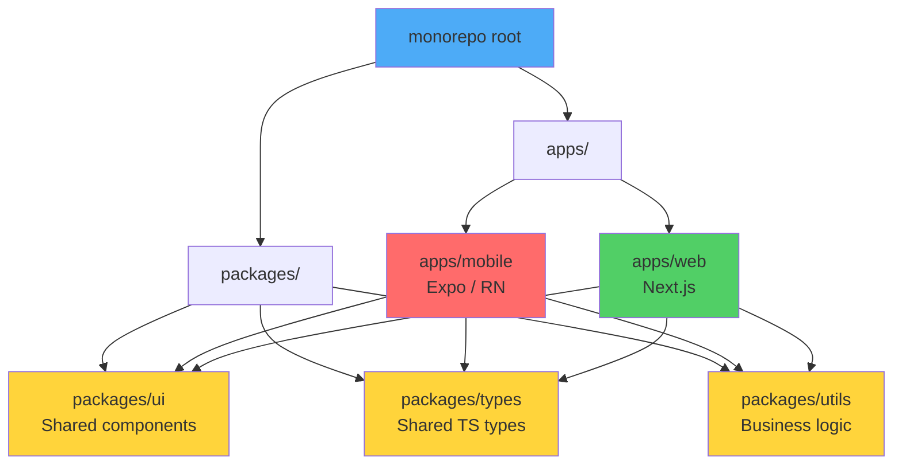

# Advanced Topics for Complex Apps

> Monorepo setup, cross-platform sharing, i18n, accessibility, maps, payments, and architecture at scale.

---

## Table of Contents

1. [Monorepo](#1-monorepo)
2. [Cross-Platform Code Sharing](#2-cross-platform-code-sharing)
3. [Internationalization](#3-internationalization)
4. [Accessibility](#4-accessibility)
5. [Animations at Scale](#5-animations-at-scale)
6. [Audio / Video at Scale](#6-audio--video-at-scale)
7. [Maps](#7-maps)
8. [Bluetooth / NFC / Hardware](#8-bluetooth--nfc--hardware)
9. [Payments](#9-payments)
10. [Architecture Patterns](#10-architecture-patterns)
11. [Multi-Environment](#11-multi-environment)
12. [App Size Optimization](#12-app-size-optimization)
13. [App Store Optimization](#13-app-store-optimization)

---

## 1. Monorepo

### Why a Monorepo?

Once your product has a mobile app, a web app, a shared design system, and shared TypeScript types, managing four separate repos becomes a coordination nightmare. Pull requests that touch the shared button component require synchronized merges across repos. Versioning drifts. Developers lose hours.

A monorepo solves this by placing everything in a single repository while keeping logical boundaries through **workspaces**.



### Tooling: Turborepo + pnpm Workspaces

Turborepo handles task orchestration (build, lint, test) with intelligent caching. pnpm workspaces handle dependency resolution. This is the combination I recommend over Nx for React Native projects because Turborepo stays out of your way -- it does not impose plugin systems or code generators.

```bash
# Scaffold
pnpm dlx create-turbo@latest my-app --package-manager pnpm

# Resulting structure
my-app/
  apps/
    mobile/       # Expo app
    web/          # Next.js app
  packages/
    ui/           # Shared React components
    types/        # Shared TypeScript interfaces
    tsconfig/     # Shared tsconfig bases
  turbo.json
  pnpm-workspace.yaml
```

Your `pnpm-workspace.yaml`:

```yaml
packages:
  - "apps/*"
  - "packages/*"
```

And `turbo.json`:

```json
{
  "tasks": {
    "build": {
      "dependsOn": ["^build"],
      "outputs": ["dist/**", ".expo/**"]
    },
    "dev": {
      "persistent": true,
      "cache": false
    },
    "lint": {},
    "typecheck": {}
  }
}
```

### Sharing Code Between packages/ui and Both Apps

The key challenge: React Native does not understand `import from '../../../packages/ui'` out of the box. Expo's Metro bundler needs to be told where to find workspace packages.

In `apps/mobile/metro.config.js`:

```tsx
const { getDefaultConfig } = require("expo/metro-config");
const path = require("path");

const projectRoot = __dirname;
const monorepoRoot = path.resolve(projectRoot, "../..");

const config = getDefaultConfig(projectRoot);

// Watch all files in the monorepo
config.watchFolders = [monorepoRoot];

// Resolve packages from the monorepo root
config.resolver.nodeModulesPaths = [
  path.resolve(projectRoot, "node_modules"),
  path.resolve(monorepoRoot, "node_modules"),
];

module.exports = config;
```

> **Gotcha**: Every package in `packages/` must have a valid `package.json` with a `main` or `exports` field pointing to its entry file. If Metro cannot resolve a workspace package, this is almost always the reason.

---

## 2. Cross-Platform Code Sharing

### The Problem

You want one codebase for iOS, Android, and the web. On the web you would use `react-router-dom` and `<div>`. In RN you use `react-navigation` and `<View>`. These are fundamentally different abstractions. How do you share 80% of logic without maintaining three separate apps?

### Solito: Universal Navigation

Solito gives you a single navigation API that works across Next.js and React Navigation. You write `useRouter()` once, and it dispatches to the correct native implementation.

```tsx
// packages/app/features/home/screen.tsx
import { useRouter } from "solito/router";
import { View, Text, Pressable } from "react-native";

export function HomeScreen() {
  const router = useRouter();

  return (
    <View style={{ flex: 1, justifyContent: "center", alignItems: "center" }}>
      <Text>Home Screen</Text>
      <Pressable onPress={() => router.push("/user/123")}>
        <Text>Go to user</Text>
      </Pressable>
    </View>
  );
}
```

This same component renders in Next.js as a page and in Expo as a React Navigation screen.

### Tamagui: Universal Styling

Tamagui gives you a styled-components-like API that compiles to optimized native code on mobile and atomic CSS on the web. It replaces the need for maintaining separate StyleSheet and CSS approaches.

```tsx
import { Button, YStack, H1 } from "tamagui";

export function LandingSection() {
  return (
    <YStack padding="$4" gap="$3" alignItems="center">
      <H1>Welcome</H1>
      <Button size="$5" theme="active" onPress={() => {}}>
        Get Started
      </Button>
    </YStack>
  );
}
```

> **My recommendation**: Start with Solito + Tamagui if you need true cross-platform from day one. If you only need iOS + Android, skip the web layer entirely -- it adds complexity you will not use.

---

## 3. Internationalization

### i18next + react-i18next

On the web you probably used `react-intl` or `i18next`. In React Native the same `i18next` library works, paired with `expo-localization` to detect the device locale.

```bash
npx expo install expo-localization i18next react-i18next
```

```tsx
// i18n/index.ts
import i18n from "i18next";
import { initReactI18next } from "react-i18next";
import { getLocales } from "expo-localization";

import en from "./locales/en.json";
import fr from "./locales/fr.json";
import ar from "./locales/ar.json";

const deviceLocale = getLocales()[0]?.languageCode ?? "en";

i18n.use(initReactI18next).init({
  resources: { en: { translation: en }, fr: { translation: fr }, ar: { translation: ar } },
  lng: deviceLocale,
  fallbackLng: "en",
  interpolation: { escapeValue: false },
});

export default i18n;
```

### ICU Message Format

For plurals, gender, and complex formatting, use the ICU MessageFormat syntax via `i18next-icu`:

```json
{
  "items_count": "{count, plural, =0 {No items} one {# item} other {# items}}",
  "greeting": "Hello {name}, you have {count, plural, one {# message} other {# messages}}"
}
```

### RTL Handling

Arabic, Hebrew, and other RTL languages need layout mirroring. React Native supports this natively, but you must opt in:

```tsx
import { I18nManager } from "react-native";

// Call this when the user switches to an RTL language, then restart
I18nManager.forceRTL(true);
// On Expo, use expo-updates to reload:
// Updates.reloadAsync();
```

> **Gotcha**: `I18nManager.forceRTL` does not take effect until the app restarts. You cannot toggle RTL live. Plan your UX around a restart prompt.

---

## 4. Accessibility

### Why This Is Non-Negotiable

Accessibility is not a nice-to-have. Roughly 15% of the world's population has some form of disability. In many jurisdictions, inaccessible apps create legal liability. And from a product perspective, accessible apps are simply better-designed apps.

### Core Props

React Native provides accessibility props that map directly to iOS VoiceOver and Android TalkBack:

```tsx
<Pressable
  accessibilityLabel="Add item to cart"
  accessibilityHint="Double-tap to add this product to your shopping cart"
  accessibilityRole="button"
  onPress={handleAddToCart}
>
  <PlusIcon />
</Pressable>
```

| Prop | Purpose |
|------|---------|
| `accessibilityLabel` | What the element IS (read aloud by screen readers) |
| `accessibilityHint` | What will HAPPEN when you interact |
| `accessibilityRole` | Semantic role: `button`, `link`, `header`, `image`, `search` |
| `accessibilityState` | Dynamic state: `{ disabled, selected, checked, busy, expanded }` |

### Dynamic Font Sizing

Respect the user's system font size setting. Never use fixed pixel values for text:

```tsx
// ❌ BAD: Fixed font size
<Text style={{ fontSize: 16 }}>Hello</Text>

// ✅ GOOD: Let the system scale
// React Native handles this by default -- but do NOT set
// allowFontScaling={false} unless you have a very good reason.
<Text allowFontScaling={true} maxFontSizeMultiplier={1.5}>
  Hello
</Text>
```

### Color Contrast and Reduce Motion

Target WCAG AA: 4.5:1 contrast ratio for normal text, 3:1 for large text. Use tools like the Accessibility Inspector on macOS to verify.

For animations, respect the system-level "reduce motion" preference:

```tsx
import { useReducedMotion } from "react-native-reanimated";

function AnimatedCard() {
  const reducedMotion = useReducedMotion();

  const animatedStyle = useAnimatedStyle(() => ({
    transform: [{ scale: reducedMotion ? 1 : withSpring(scale.value) }],
  }));

  return <Animated.View style={animatedStyle} />;
}
```

> **Testing**: Run VoiceOver on iOS Simulator (Cmd + F5) and TalkBack on Android Emulator (Settings > Accessibility). Do this before every release. Automated accessibility audits miss half the real-world issues.

---

## 5. Animations at Scale

### Shared Element Transitions

The "hero" animation where a list thumbnail grows into a detail image. On the web you would use the View Transitions API. In React Native, `react-native-shared-element` or the built-in `react-navigation` shared element transitions handle this.

With React Navigation 7+:

```tsx
// In your stack navigator
<Stack.Screen
  name="Detail"
  component={DetailScreen}
  options={{
    animation: "fade",
  }}
/>

// In the source screen
<SharedElement id={`item.${item.id}.photo`}>
  <Image source={{ uri: item.photo }} style={styles.thumbnail} />
</SharedElement>
```

### Skia + Reanimated

For complex, canvas-level animations (graphs, particle effects, custom drawing), combine `@shopify/react-native-skia` with Reanimated. Skia runs on a separate thread and gives you a GPU-accelerated 2D canvas.

```tsx
import { Canvas, Circle, useValue } from "@shopify/react-native-skia";
import { useSharedValue, useDerivedValue } from "react-native-reanimated";

function PulsingDot() {
  const radius = useSharedValue(20);

  // Animate on the UI thread -- no bridge crossing
  useEffect(() => {
    radius.value = withRepeat(withTiming(40, { duration: 1000 }), -1, true);
  }, []);

  return (
    <Canvas style={{ width: 100, height: 100 }}>
      <Circle cx={50} cy={50} r={radius} color="dodgerblue" />
    </Canvas>
  );
}
```

> **Rule of thumb**: Use Reanimated alone for UI-level animations (opacity, translate, scale). Add Skia when you need custom drawing, gradients, blur effects, or path animations that `Animated.View` cannot express.

---

## 6. Audio / Video at Scale

### Audio: react-native-track-player

For music/podcast apps that need background playback, lock screen controls, and queue management, `react-native-track-player` is the only serious option.

```tsx
import TrackPlayer, { useProgress } from "react-native-track-player";

await TrackPlayer.setupPlayer();
await TrackPlayer.add({
  id: "episode-1",
  url: "https://example.com/episode1.mp3",
  title: "Episode 1",
  artist: "My Podcast",
});
await TrackPlayer.play();

// In a component
function ProgressBar() {
  const { position, duration } = useProgress();
  return <Slider value={position} maximumValue={duration} />;
}
```

### Video: expo-video with PiP

`expo-video` (Expo SDK 51+) replaces the older `expo-av` for video. It supports Picture-in-Picture, DRM, and HLS streaming out of the box.

```tsx
import { VideoView, useVideoPlayer } from "expo-video";

function VideoScreen() {
  const player = useVideoPlayer(
    "https://example.com/stream.m3u8", // HLS stream
    (player) => {
      player.loop = false;
      player.allowsExternalPlayback = true; // AirPlay
    }
  );

  return <VideoView player={player} style={{ width: "100%", aspectRatio: 16 / 9 }} />;
}
```

### Camera: VisionCamera + Frame Processors

`react-native-vision-camera` gives you direct access to camera frames for real-time ML processing (barcode scanning, face detection, OCR):

```tsx
import { Camera, useCameraDevice, useFrameProcessor } from "react-native-vision-camera";
import { useBarcodeScanner } from "vision-camera-code-scanner";

function Scanner() {
  const device = useCameraDevice("back");
  const frameProcessor = useFrameProcessor((frame) => {
    "worklet";
    const barcodes = scanBarcodes(frame);
    if (barcodes.length > 0) {
      runOnJS(onBarcodeDetected)(barcodes[0].value);
    }
  }, []);

  return <Camera device={device} isActive frameProcessor={frameProcessor} />;
}
```

---

## 7. Maps

### react-native-maps

The most mature option. Uses Apple Maps on iOS and Google Maps on Android by default.

```tsx
import MapView, { Marker, Callout } from "react-native-maps";

function StoreLocator({ stores }) {
  return (
    <MapView
      style={{ flex: 1 }}
      initialRegion={{
        latitude: 48.8566,
        longitude: 2.3522,
        latitudeDelta: 0.05,
        longitudeDelta: 0.05,
      }}
    >
      {stores.map((store) => (
        <Marker key={store.id} coordinate={store.location}>
          <Callout>
            <Text>{store.name}</Text>
          </Callout>
        </Marker>
      ))}
    </MapView>
  );
}
```

### MapLibre / Mapbox

If you need custom map styles, 3D terrain, or offline maps, use `@maplibre/maplibre-react-native` (free, open-source) or `@rnmapbox/maps` (Mapbox, requires API key and has pricing tiers). MapLibre is the fork to use if you want to avoid Mapbox licensing costs.

> **Gotcha with react-native-maps**: On Android, Google Maps requires a valid API key in `AndroidManifest.xml`. Without it, you get a blank gray screen with no error message. This trips up every team at least once.

---

## 8. Bluetooth / NFC / Hardware

### BLE: react-native-ble-plx

For Bluetooth Low Energy devices (fitness trackers, IoT sensors, medical devices):

```tsx
import { BleManager } from "react-native-ble-plx";

const manager = new BleManager();

function scanForDevices() {
  manager.startDeviceScan(null, null, (error, device) => {
    if (device?.name?.includes("HeartRate")) {
      manager.stopDeviceScan();
      connectToDevice(device);
    }
  });
}

async function connectToDevice(device) {
  const connected = await device.connect();
  const discovered = await connected.discoverAllServicesAndCharacteristics();
  // Read heart rate characteristic
  const characteristic = await discovered.readCharacteristicForService(
    "0000180d-0000-1000-8000-00805f9b34fb", // Heart Rate Service UUID
    "00002a37-0000-1000-8000-00805f9b34fb"  // Heart Rate Measurement UUID
  );
}
```

### NFC: react-native-nfc-manager

For tap-to-pay, badge scanning, and tag reading:

```tsx
import NfcManager, { NfcTech } from "react-native-nfc-manager";

async function readNfcTag() {
  await NfcManager.start();
  await NfcManager.requestTechnology(NfcTech.Ndef);
  const tag = await NfcManager.getTag();
  console.log("Tag UID:", tag?.id);
  NfcManager.cancelTechnologyRequest();
}
```

> **Hardware gotchas**: BLE requires runtime permissions on both platforms. On iOS, you must add `NSBluetoothAlwaysUsageDescription` to `Info.plist`. On Android 12+, you need `BLUETOOTH_SCAN` and `BLUETOOTH_CONNECT` permissions. NFC is not available on all Android devices and requires `NfcAdapter` presence checks.

---

## 9. Payments

### Stripe React Native

For card payments, Apple Pay, and Google Pay, `@stripe/stripe-react-native` is the standard. It provides PCI-compliant UI components so you never handle raw card numbers.

```tsx
import { StripeProvider, CardField, useStripe } from "@stripe/stripe-react-native";

function CheckoutScreen() {
  const { confirmPayment } = useStripe();

  const handlePay = async () => {
    // Your backend creates a PaymentIntent and returns the clientSecret
    const { clientSecret } = await api.createPaymentIntent({ amount: 2999 });

    const { error, paymentIntent } = await confirmPayment(clientSecret, {
      paymentMethodType: "Card",
    });

    if (error) Alert.alert("Payment failed", error.message);
    else if (paymentIntent) Alert.alert("Success", "Payment confirmed!");
  };

  return (
    <StripeProvider publishableKey="pk_test_...">
      <CardField style={{ height: 50, marginVertical: 20 }} />
      <Button title="Pay $29.99" onPress={handlePay} />
    </StripeProvider>
  );
}
```

### RevenueCat for Subscriptions

If your app sells subscriptions, RevenueCat abstracts away the differences between App Store and Google Play billing. It handles receipt validation, trial management, and cross-platform entitlements.

```tsx
import Purchases from "react-native-purchases";

// Initialize once at app start
Purchases.configure({ apiKey: "your_revenuecat_api_key" });

// Fetch available packages
const offerings = await Purchases.getOfferings();
const monthly = offerings.current?.monthly;

// Purchase
const { customerInfo } = await Purchases.purchasePackage(monthly);
const isPremium = customerInfo.entitlements.active["premium"] !== undefined;
```

> **Critical IAP rule**: Apple and Google require you to use their in-app purchase systems for **digital goods and subscriptions**. You cannot use Stripe for digital content sold inside the app. Physical goods and services (Uber rides, food delivery) can use Stripe. Violating this gets your app rejected.

---

## 10. Architecture Patterns

### Feature-First Folder Structure

Stop organizing by file type (`/components`, `/screens`, `/hooks`). Organize by feature so that everything related to "checkout" lives together:

```
src/
  features/
    auth/
      screens/LoginScreen.tsx
      hooks/useAuth.ts
      api/authApi.ts
      components/AuthForm.tsx
      types.ts
    checkout/
      screens/CheckoutScreen.tsx
      hooks/useCart.ts
      api/paymentApi.ts
      components/CartItem.tsx
      types.ts
  shared/
    components/Button.tsx
    hooks/useDebounce.ts
    utils/format.ts
```

### Repository Pattern

Decouple your data layer from your UI. Your screens should never know whether data comes from an API, local database, or cache:

```tsx
// domain/repositories/ProductRepository.ts
interface ProductRepository {
  getAll(): Promise<Product[]>;
  getById(id: string): Promise<Product>;
}

// data/repositories/ProductRepositoryImpl.ts
class ProductRepositoryImpl implements ProductRepository {
  constructor(private api: ProductApi, private cache: ProductCache) {}

  async getAll(): Promise<Product[]> {
    const cached = await this.cache.getAll();
    if (cached) return cached;
    const products = await this.api.fetchAll();
    await this.cache.setAll(products);
    return products;
  }
}
```

### Dependency Injection with tsyringe

Use `tsyringe` to wire up dependencies without manual constructor threading:

```tsx
import { injectable, inject, container } from "tsyringe";

@injectable()
class ProductService {
  constructor(
    @inject("ProductRepository") private repo: ProductRepository
  ) {}
}

// Register once at app startup
container.register("ProductRepository", { useClass: ProductRepositoryImpl });

// Resolve anywhere
const service = container.resolve(ProductService);
```

> On the web you might rely on React context for DI. In React Native, where you often need services outside the component tree (background tasks, push notification handlers), a proper DI container pays for itself quickly.

---

## 11. Multi-Environment

### The Problem

You need `dev`, `staging`, and `production` environments with different API URLs, bundle identifiers, and app icons. On the web you use `.env` files. In React Native, it is more involved because bundle IDs affect native build configuration.

### Expo Config Flavors

Use `app.config.ts` (dynamic config) with environment variables from EAS:

```tsx
// app.config.ts
const IS_DEV = process.env.APP_VARIANT === "development";
const IS_STAGING = process.env.APP_VARIANT === "staging";

export default {
  name: IS_DEV ? "MyApp (Dev)" : IS_STAGING ? "MyApp (Staging)" : "MyApp",
  slug: "my-app",
  ios: {
    bundleIdentifier: IS_DEV
      ? "com.myapp.dev"
      : IS_STAGING
        ? "com.myapp.staging"
        : "com.myapp",
  },
  android: {
    package: IS_DEV
      ? "com.myapp.dev"
      : IS_STAGING
        ? "com.myapp.staging"
        : "com.myapp",
  },
  extra: {
    apiUrl: IS_DEV
      ? "https://api-dev.myapp.com"
      : IS_STAGING
        ? "https://api-staging.myapp.com"
        : "https://api.myapp.com",
  },
};
```

Access values at runtime via `expo-constants`:

```tsx
import Constants from "expo-constants";
const API_URL = Constants.expoConfig?.extra?.apiUrl;
```

Store secrets in EAS:

```bash
eas secret:create --name API_SECRET --value "sk_live_..." --scope project
```

> **Per-env app icons**: Use different `icon` paths in your config per variant. This way your testers instantly see which build they are running -- a small detail that prevents painful "I was testing against production" incidents.

---

## 12. App Size Optimization

### Why Size Matters

Every 6 MB increase in app size reduces install conversion by roughly 1%. On emerging markets with slow connections, a 100 MB app simply will not get installed.

### Hermes Bytecode

Hermes pre-compiles JavaScript to bytecode at build time, reducing both bundle size and startup time. With Expo SDK 49+, Hermes is enabled by default. Verify it is active:

```tsx
const isHermes = () => !!global.HermesInternal;
console.log("Hermes enabled:", isHermes());
```

### Android: App Bundle (.aab)

Always ship an `.aab` (Android App Bundle) instead of a universal `.apk`. Google Play generates device-specific APKs, stripping unused architectures and resources. This alone can cut download size by 30-50%.

```bash
# EAS Build produces .aab by default for production
eas build --platform android --profile production
```

### iOS: App Thinning

iOS App Thinning (slicing, bitcode, on-demand resources) is automatic when distributing through the App Store. But you can help by stripping unused architectures from third-party frameworks:

```bash
# In your Podfile's post_install hook
post_install do |installer|
  installer.pods_project.targets.each do |target|
    target.build_configurations.each do |config|
      config.build_settings['EXCLUDED_ARCHS[sdk=iphonesimulator*]'] = 'arm64'
    end
  end
end
```

### General Strategies

- Audit dependencies with `npx react-native-bundle-visualizer` to find bloated packages
- Replace moment.js with date-fns or dayjs (saves ~200 KB)
- Use `expo-image` instead of the core `Image` component -- it handles caching and memory better
- Lazy-load heavy screens with `React.lazy` in your navigation stack

---

## 13. App Store Optimization

### Keywords and Metadata

ASO is the mobile equivalent of SEO. Your app title and subtitle (iOS) or short description (Android) are the most weighted keyword fields.

- **Title**: Include your primary keyword. "Meditate - Sleep & Calm" outranks "MeditApp" every time.
- **Subtitle (iOS)** / **Short Description (Android)**: Secondary keywords here. Do not repeat the title.
- **Keyword field (iOS only)**: 100 characters. Use commas, no spaces, no duplicates from the title.

### Screenshots and Preview Videos

Your first two screenshots determine whether users scroll further. Lead with your strongest feature, not a splash screen. Use device frames, short captions, and consistent branding. Preview videos (up to 30 seconds on iOS) auto-play in search results and dramatically improve conversion.

### Localized Listings

Translate your store listing into every language where you have users. You can localize metadata separately from your app's UI -- a French store listing can drive installs even if the app itself is English-only at first.

### Ratings Prompts

Use `expo-store-review` to prompt for ratings at the right moment -- after a positive experience, never during onboarding or after an error:

```tsx
import * as StoreReview from "expo-store-review";

async function maybeRequestReview() {
  const isAvailable = await StoreReview.isAvailableAsync();
  if (isAvailable) {
    // iOS rate-limits this to 3 times per 365 days per device
    await StoreReview.requestReview();
  }
}

// Call after a successful action
async function onOrderDelivered() {
  await saveDeliveryConfirmation();
  await maybeRequestReview(); // Happy moment = good time to ask
}
```

> **Gotcha**: On iOS, Apple's `SKStoreReviewController` silently no-ops if it has already been shown too recently. You cannot force the prompt. Do not build UI that says "Rate us now!" and then calls this API -- the dialog might simply not appear, confusing your users.

---