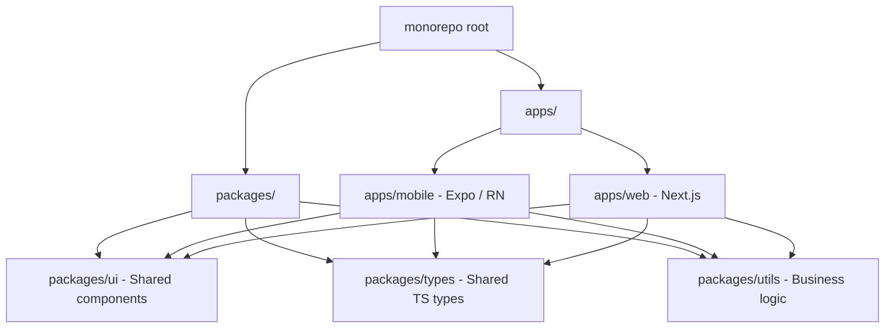
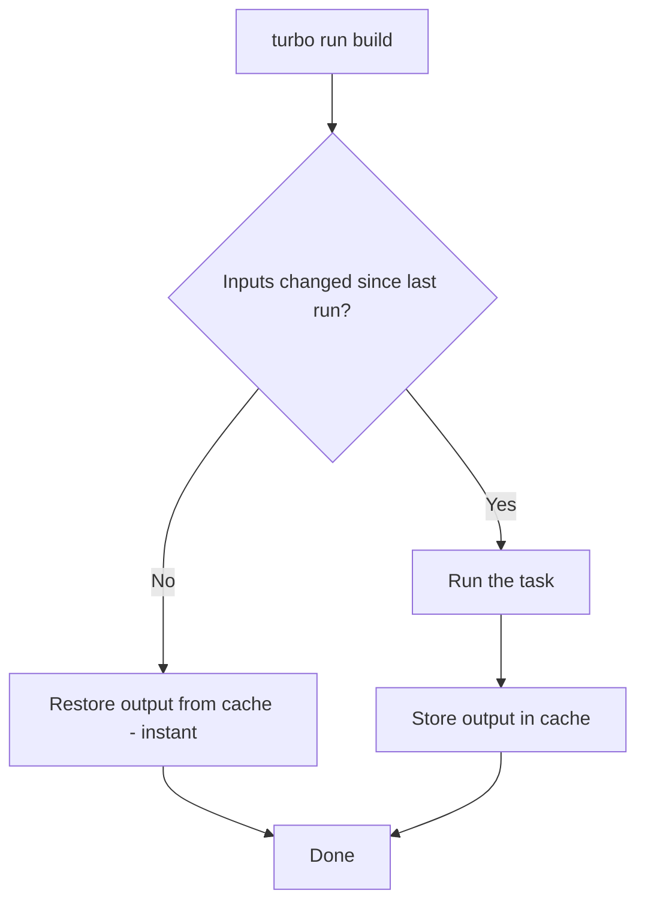
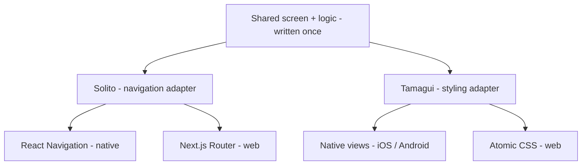
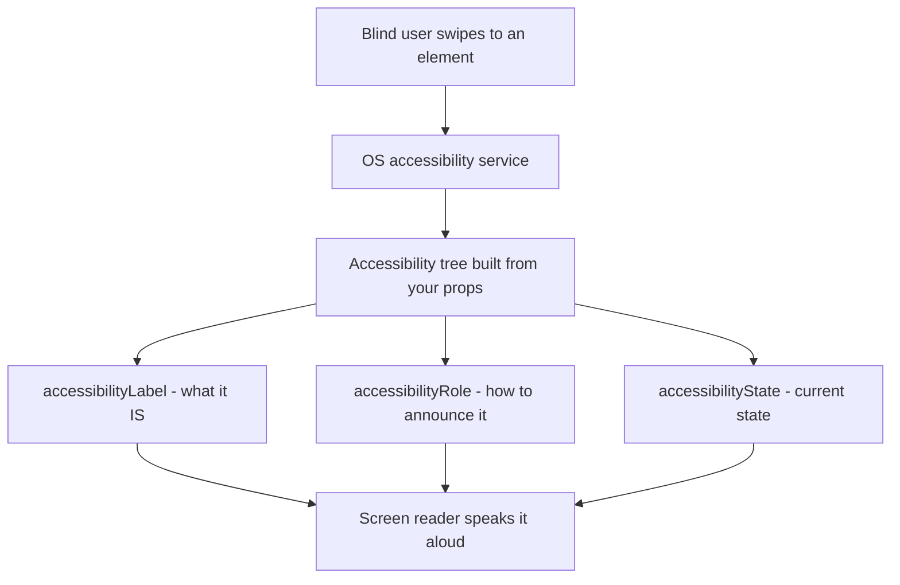
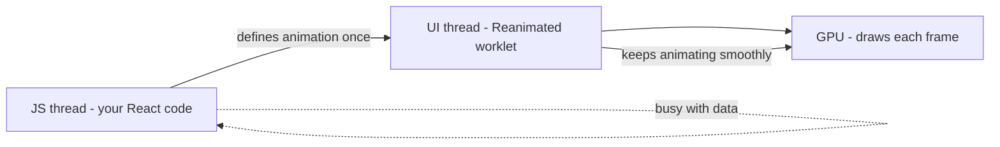
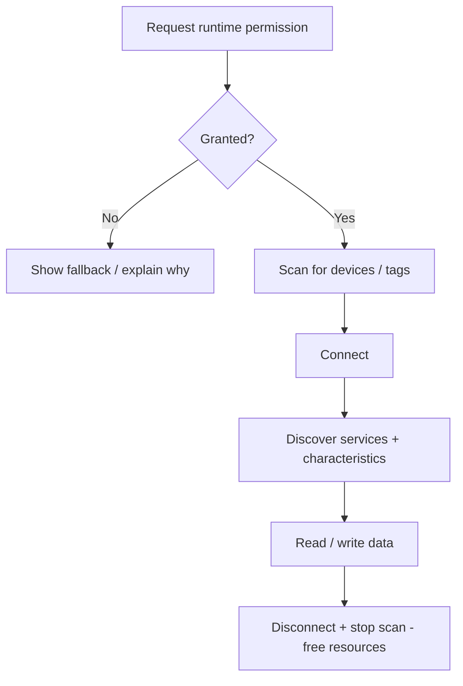
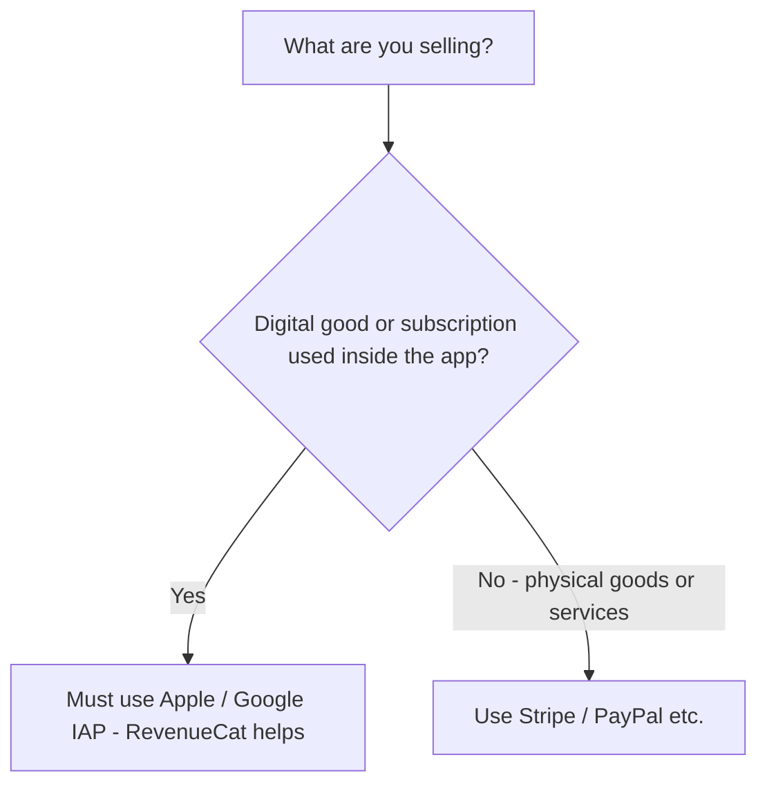
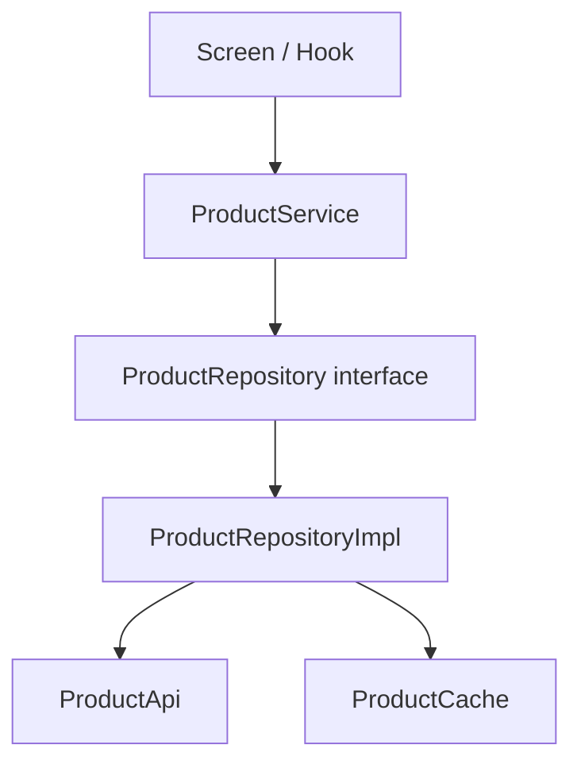
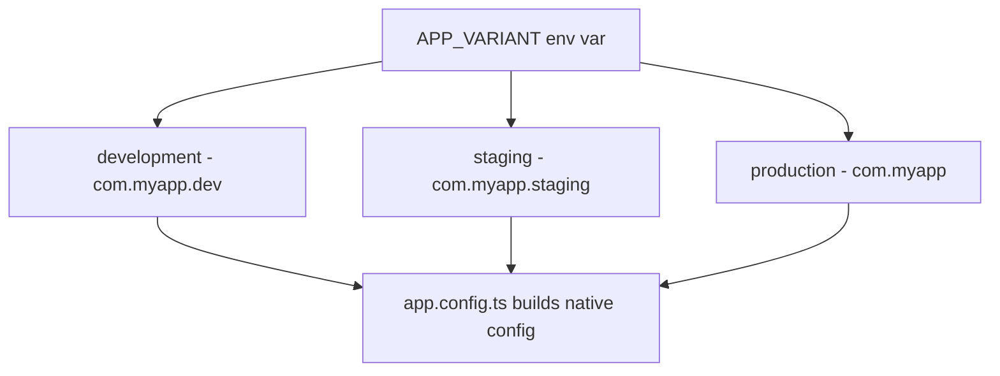
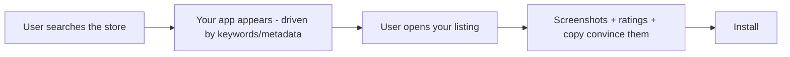

# Advanced Topics for Complex Apps

> Monorepo setup, cross-platform sharing, i18n, accessibility, maps, payments, and architecture at scale.

---

## Table of Contents

1. [Monorepo](#1-monorepo)
2. [Cross-Platform Code Sharing](#2-cross-platform-code-sharing)
3. [Internationalization](#3-internationalization)
4. [Accessibility](#4-accessibility)
5. [Animations at Scale](#5-animations-at-scale)
6. [Audio / Video at Scale](#6-audio--video-at-scale)
7. [Maps](#7-maps)
8. [Bluetooth / NFC / Hardware](#8-bluetooth--nfc--hardware)
9. [Payments](#9-payments)
10. [Architecture Patterns](#10-architecture-patterns)
11. [Multi-Environment](#11-multi-environment)
12. [App Size Optimization](#12-app-size-optimization)
13. [App Store Optimization](#13-app-store-optimization)

---

## 1. Monorepo

### Why a Monorepo?

Once your product has a mobile app, a web app, a shared design system, and shared TypeScript types, managing four separate repos becomes a coordination nightmare. Pull requests that touch the shared button component require synchronized merges across repos. Versioning drifts. Developers lose hours.

A monorepo solves this by placing everything in a single repository while keeping logical boundaries through **workspaces**.

Think of it like a house. Separate repos are four houses on four different streets — every time you change the shared plumbing you have to drive to each house and fix it separately, hoping you did them all the same way. A monorepo is one house with several rooms: the shared plumbing runs through the walls and every room gets the fix the moment you make it.

### What is a "workspace"?

A **workspace** is just a folder inside the repo that has its own `package.json` and is registered with your package manager as a first-class package. Once registered, `apps/mobile` can write `import { Button } from "@myapp/ui"` exactly as if `@myapp/ui` were published to npm — but it resolves to the local `packages/ui` folder on disk. No publishing, no version bumps, instant changes.

> On the web you may have used a single repo with one `package.json`. A monorepo is the same idea scaled up: **many** `package.json` files, one lockfile, one `node_modules` tree shared at the root.



### Tooling: Turborepo + pnpm Workspaces

Two different jobs, two different tools:

- **pnpm workspaces** answer *"where does this import live?"* — they install dependencies and link the local packages together.
- **Turborepo** answers *"what do I need to rebuild?"* — it orchestrates tasks (build, lint, test) and caches the results so unchanged packages are never rebuilt.

Turborepo is the combination I recommend over Nx for React Native projects because it stays out of your way — it does not impose plugin systems or code generators.

| Tool | Role | When to reach for it |
|------|------|----------------------|
| **pnpm workspaces** | Dependency linking + install | Always — it is the foundation |
| **Turborepo** | Task running + caching | When builds/lint/test get slow or repetitive |
| **Nx** | Task running + generators + plugins | Large teams wanting opinionated scaffolding and a plugin ecosystem |
| **Yarn / npm workspaces** | Dependency linking | If you cannot adopt pnpm; slower, larger `node_modules` |

```bash
# Scaffold
pnpm dlx create-turbo@latest my-app --package-manager pnpm

# Resulting structure
my-app/
  apps/
    mobile/       # Expo app
    web/          # Next.js app
  packages/
    ui/           # Shared React components
    types/        # Shared TypeScript interfaces
    tsconfig/     # Shared tsconfig bases
  turbo.json
  pnpm-workspace.yaml
```

Your `pnpm-workspace.yaml` tells pnpm which folders are workspaces:

```yaml
packages:
  - "apps/*"
  - "packages/*"
```

And `turbo.json` describes the task graph. The `^build` syntax means "build my dependencies first" — so `packages/ui` always builds before `apps/mobile` that depends on it:

```json
{
  "tasks": {
    "build": {
      "dependsOn": ["^build"],
      "outputs": ["dist/**", ".expo/**"]
    },
    "dev": {
      "persistent": true,
      "cache": false
    },
    "lint": {},
    "typecheck": {}
  }
}
```

How caching saves you time:



> **Pro tip**: Turborepo hashes the inputs of each task (source files, dependencies, env vars). If nothing changed, it replays the previous output in milliseconds instead of rebuilding. Add `--remote-only` with a remote cache and your CI and teammates share the same cache — a colleague's build becomes your instant download.

### Sharing Code Between packages/ui and Both Apps

The key challenge: React Native does not understand `import from '../../../packages/ui'` out of the box. Expo's Metro bundler needs to be told where to find workspace packages. Metro defaults to assuming everything lives under one app folder; in a monorepo your code lives two levels up and your dependencies may be hoisted to the repo root.

In `apps/mobile/metro.config.js`:

```tsx
const { getDefaultConfig } = require("expo/metro-config");
const path = require("path");

const projectRoot = __dirname;
const monorepoRoot = path.resolve(projectRoot, "../..");

const config = getDefaultConfig(projectRoot);

// 1. Watch all files in the monorepo so edits in packages/ trigger reloads
config.watchFolders = [monorepoRoot];

// 2. Look for node_modules both locally and at the repo root (pnpm hoists here)
config.resolver.nodeModulesPaths = [
  path.resolve(projectRoot, "node_modules"),
  path.resolve(monorepoRoot, "node_modules"),
];

module.exports = config;
```

> **Gotcha**: Every package in `packages/` must have a valid `package.json` with a `main` or `exports` field pointing to its entry file. If Metro cannot resolve a workspace package (`Unable to resolve module @myapp/ui`), this is almost always the reason. Double-check the package name in its `package.json` matches the name you import.

> **Common mistake**: Forgetting to add the workspace package as a dependency of the app. Even local packages must be listed in `apps/mobile/package.json` as `"@myapp/ui": "workspace:*"` so pnpm creates the symlink.

---

## 2. Cross-Platform Code Sharing

### The Problem

You want one codebase for iOS, Android, and the web. On the web you would use `react-router-dom` and `<div>`. In RN you use `react-navigation` and `<View>`. These are fundamentally different abstractions — different navigation, different primitive elements, different styling engines. How do you share 80% of logic without maintaining three separate apps?

The trick is to draw a line. Everything *above* the line (business logic, data fetching, screen composition) can be shared. Everything *below* the line (the actual `<div>` vs `<View>`, the router) gets a thin platform-specific adapter. Cross-platform libraries provide those adapters so you write the top once.



### Solito: Universal Navigation

Solito gives you a single navigation API that works across Next.js and React Navigation. You write `useRouter()` once, and it dispatches to the correct native implementation — like a universal power adapter that fits whichever socket the country uses.

```tsx
// packages/app/features/home/screen.tsx
import { useRouter } from "solito/router";
import { View, Text, Pressable } from "react-native";

export function HomeScreen() {
  const router = useRouter();

  return (
    <View style={{ flex: 1, justifyContent: "center", alignItems: "center" }}>
      <Text>Home Screen</Text>
      {/* On web this becomes a client-side route push; on native a stack.push */}
      <Pressable onPress={() => router.push("/user/123")}>
        <Text>Go to user</Text>
      </Pressable>
    </View>
  );
}
```

This same component renders in Next.js as a page and in Expo as a React Navigation screen. You define the route once; each platform's file-based routing points at it.

### Tamagui: Universal Styling

Tamagui gives you a styled-components-like API that compiles to optimized native code on mobile and atomic CSS on the web. It replaces the need for maintaining separate StyleSheet and CSS approaches. The `$4` tokens are design-system values (spacing, color) defined once and resolved per platform.

```tsx
import { Button, YStack, H1 } from "tamagui";

export function LandingSection() {
  return (
    // YStack = vertical flex container; "$4" reads from your theme tokens
    <YStack padding="$4" gap="$3" alignItems="center">
      <H1>Welcome</H1>
      <Button size="$5" theme="active" onPress={() => {}}>
        Get Started
      </Button>
    </YStack>
  );
}
```

### Choosing an approach

| Approach | Shares | Best for | Cost |
|----------|--------|----------|------|
| **Solito + Tamagui** | Navigation + styling + logic | True iOS + Android + Web from one codebase | Steeper setup, opinionated stack |
| **Expo + react-native-web** | Components + logic (you wire routing) | Mostly-mobile apps that also need a basic web view | More manual platform branching |
| **Separate native + web apps, shared `packages/`** | Logic, types, API only | Web and mobile UX differ a lot | Two UI layers to maintain |

> **My recommendation**: Start with Solito + Tamagui if you need true cross-platform from day one. If you only need iOS + Android, skip the web layer entirely — it adds complexity you will not use. You can always share logic-only packages later without committing to a universal UI library.

> **Gotcha**: `react-native-web` maps `<View>` to `<div>` and `<Text>` to `<span>`, but native-only APIs (haptics, BLE, camera) have no web equivalent. Guard them with `Platform.OS === "web"` or `.native.tsx` / `.web.tsx` file extensions so Metro and the web bundler each pick the right file.

---

## 3. Internationalization

### i18next + react-i18next

On the web you probably used `react-intl` or `i18next`. In React Native the same `i18next` library works, paired with `expo-localization` to detect the device locale. **Internationalization (i18n)** is the engineering work of making the app *able* to display any language; **localization (l10n)** is the act of actually supplying each translation.

```bash
npx expo install expo-localization i18next react-i18next
```

```tsx
// i18n/index.ts
import i18n from "i18next";
import { initReactI18next } from "react-i18next";
import { getLocales } from "expo-localization";

import en from "./locales/en.json";
import fr from "./locales/fr.json";
import ar from "./locales/ar.json";

// Read the phone's language setting, e.g. "fr" — fall back to English
const deviceLocale = getLocales()[0]?.languageCode ?? "en";

i18n.use(initReactI18next).init({
  resources: { en: { translation: en }, fr: { translation: fr }, ar: { translation: ar } },
  lng: deviceLocale,
  fallbackLng: "en", // if a key is missing in fr, show the English text
  interpolation: { escapeValue: false }, // RN has no XSS risk, so skip escaping
});

export default i18n;
```

Using it in a component looks just like the web:

```tsx
import { useTranslation } from "react-i18next";

function Greeting() {
  const { t, i18n } = useTranslation();
  return (
    <>
      <Text>{t("greeting", { name: "Amina", count: 3 })}</Text>
      {/* Switch language at runtime — most strings update live */}
      <Button title="Français" onPress={() => i18n.changeLanguage("fr")} />
    </>
  );
}
```

### ICU Message Format

The naive approach — `"You have " + count + " messages"` — breaks in most languages because plural rules differ (Arabic has six plural forms, not two). **ICU MessageFormat** moves those rules into the translation string itself, so translators control the grammar. Enable it via `i18next-icu`:

```json
{
  "items_count": "{count, plural, =0 {No items} one {# item} other {# items}}",
  "greeting": "Hello {name}, you have {count, plural, one {# message} other {# messages}}"
}
```

The `#` is replaced with the number, and the right branch (`one`, `other`, `=0`) is chosen automatically by the locale's plural rules.

### Formatting numbers, dates, and currency

Never hand-format these. `12,000.50` is `12.000,50` in German and `12 000,50` in French. Use the built-in `Intl` API:

```tsx
new Intl.NumberFormat("de-DE", { style: "currency", currency: "EUR" }).format(1234.5);
// "1.234,50 €"
new Intl.DateTimeFormat("ar-EG").format(new Date()); // Arabic calendar digits
```

> **Gotcha**: Older React Native (pre-Hermes-Intl) had an incomplete `Intl`. On modern Expo, Hermes ships full `Intl` support — but if you target very old devices, add the `@formatjs/intl-*` polyfills.

### RTL Handling

Arabic, Hebrew, and other RTL languages need the whole layout *mirrored* — text aligns right, the back arrow points right, rows reverse. React Native supports this natively, but you must opt in:

```tsx
import { I18nManager } from "react-native";

// Call this when the user switches to an RTL language, then restart
I18nManager.forceRTL(true);
// On Expo, use expo-updates to reload:
// Updates.reloadAsync();
```

To stay mirror-safe, use **logical** style props instead of physical ones, so they flip automatically:

```tsx
// ❌ Hardcodes left — stays on the left even in Arabic
<View style={{ marginLeft: 16, alignItems: "flex-start" }} />

// ✅ Flips automatically with the writing direction
<View style={{ marginStart: 16 }} /> // start = left in LTR, right in RTL
```

> **Gotcha**: `I18nManager.forceRTL` does not take effect until the app restarts. You cannot toggle RTL live. Plan your UX around a restart prompt ("Restart to apply Arabic").

---

## 4. Accessibility

### Why This Is Non-Negotiable

Accessibility is not a nice-to-have. Roughly 15% of the world's population has some form of disability. In many jurisdictions, inaccessible apps create legal liability. And from a product perspective, accessible apps are simply better-designed apps — the same labels that help a screen reader also power voice control and automated UI tests.

A screen reader (VoiceOver on iOS, TalkBack on Android) walks the screen element by element and reads each one aloud. It can only read what you tell it: a bare icon button says "button" with no further detail unless you supply a label. Your job is to give every interactive element a clear name, role, and state.



### Core Props

React Native provides accessibility props that map directly to iOS VoiceOver and Android TalkBack:

```tsx
<Pressable
  accessibilityLabel="Add item to cart"
  accessibilityHint="Double-tap to add this product to your shopping cart"
  accessibilityRole="button"
  accessibilityState={{ disabled: false }}
  onPress={handleAddToCart}
>
  <PlusIcon />
</Pressable>
```

| Prop | Purpose |
|------|---------|
| `accessibilityLabel` | What the element IS (read aloud by screen readers) |
| `accessibilityHint` | What will HAPPEN when you interact |
| `accessibilityRole` | Semantic role: `button`, `link`, `header`, `image`, `search` |
| `accessibilityState` | Dynamic state: `{ disabled, selected, checked, busy, expanded }` |

> Compared to the web: `accessibilityLabel` is RN's `aria-label`, `accessibilityRole` is `role`, and `accessibilityState` is the family of `aria-checked` / `aria-disabled` / `aria-expanded`. Same concepts, RN-flavored names.

> **Pro tip**: Group related elements with `accessible={true}` on a parent `View`. A card with a title, price, and image should be announced as one unit ("Running shoes, $99, image") rather than three separate swipes.

### Dynamic Font Sizing

Respect the user's system font size setting. Many users bump their font size up for readability; if you lock pixel values, your app ignores them.

```tsx
// ❌ BAD: Fixed font size that ignores user settings — but acceptable as a base
<Text style={{ fontSize: 16 }}>Hello</Text>

// ✅ GOOD: Let the system scale, but cap how far so layouts don't explode
// React Native scales text by default -- do NOT set
// allowFontScaling={false} unless you have a very good reason.
<Text allowFontScaling={true} maxFontSizeMultiplier={1.5}>
  Hello
</Text>
```

### Color Contrast and Reduce Motion

Target WCAG AA: 4.5:1 contrast ratio for normal text, 3:1 for large text. Use tools like the Accessibility Inspector on macOS to verify. Light gray text on white may look elegant in your design tool and be unreadable in sunlight or for low-vision users.

For animations, respect the system-level "reduce motion" preference — large parallax and spin effects can trigger nausea or vertigo for some users:

```tsx
import { useReducedMotion, useAnimatedStyle, withSpring } from "react-native-reanimated";

function AnimatedCard() {
  const reducedMotion = useReducedMotion();

  const animatedStyle = useAnimatedStyle(() => ({
    // Skip the springy scale when the user asked for less motion
    transform: [{ scale: reducedMotion ? 1 : withSpring(scale.value) }],
  }));

  return <Animated.View style={animatedStyle} />;
}
```

> **Testing**: Run VoiceOver on iOS Simulator (Cmd + F5) and TalkBack on Android Emulator (Settings > Accessibility). Do this before every release. Automated accessibility audits miss half the real-world issues — a label can be technically present but say "icon-32" instead of "Add to cart".

---

## 5. Animations at Scale

Before reaching for heavy tools, remember the core principle: animations must run on the **UI thread**, not the JS thread. If an animation depends on JavaScript running each frame, a busy JS thread (data parsing, re-renders) makes it stutter. Reanimated and Skia both push work onto the UI/GPU thread so animations stay buttery at 60fps even while JS is busy.



### Shared Element Transitions

The "hero" animation where a list thumbnail grows into a detail image. On the web you would use the View Transitions API. In React Native, `react-native-shared-element` or the built-in `react-navigation` shared element transitions handle this — they measure the element in screen A, measure its twin in screen B, and interpolate between the two positions during the navigation.

With React Navigation 7+:

```tsx
// In your stack navigator
<Stack.Screen
  name="Detail"
  component={DetailScreen}
  options={{
    animation: "fade",
  }}
/>

// Same id on both screens links the source and destination element
<SharedElement id={`item.${item.id}.photo`}>
  <Image source={{ uri: item.photo }} style={styles.thumbnail} />
</SharedElement>
```

### Skia + Reanimated

For complex, canvas-level animations (graphs, particle effects, custom drawing), combine `@shopify/react-native-skia` with Reanimated. Skia runs on a separate thread and gives you a GPU-accelerated 2D canvas — the same rendering engine Chrome and Flutter use under the hood.

```tsx
import { Canvas, Circle } from "@shopify/react-native-skia";
import { useSharedValue, withRepeat, withTiming } from "react-native-reanimated";

function PulsingDot() {
  const radius = useSharedValue(20);

  // Animate on the UI thread -- no bridge crossing, no JS-thread dependency
  useEffect(() => {
    radius.value = withRepeat(withTiming(40, { duration: 1000 }), -1, true);
  }, []);

  return (
    <Canvas style={{ width: 100, height: 100 }}>
      <Circle cx={50} cy={50} r={radius} color="dodgerblue" />
    </Canvas>
  );
}
```

### Choosing your animation tool

| Tool | Best for | Avoid when |
|------|----------|-----------|
| `Animated` (core) | Simple one-off fades/slides | You need gesture-driven or 60fps-critical work |
| **Reanimated** | Opacity, translate, scale, gestures | You need custom shapes/gradients |
| **Skia** | Custom drawing, blur, paths, charts | A simple `Animated.View` would do |
| **Lottie** | Designer-made vector animations (JSON) | The animation is data-driven/interactive |

> **Rule of thumb**: Use Reanimated alone for UI-level animations (opacity, translate, scale). Add Skia when you need custom drawing, gradients, blur effects, or path animations that `Animated.View` cannot express. Reaching for Skia to fade a button is over-engineering.

---

## 6. Audio / Video at Scale

### Audio: react-native-track-player

For music/podcast apps that need background playback, lock screen controls, and queue management, `react-native-track-player` is the only serious option. The reason you cannot just use a simple sound API: background audio requires the OS to keep your process alive and wire up the lock-screen / Control Center widgets, which needs a dedicated native playback service.

```tsx
import TrackPlayer, { useProgress } from "react-native-track-player";

await TrackPlayer.setupPlayer();
await TrackPlayer.add({
  id: "episode-1",
  url: "https://example.com/episode1.mp3",
  title: "Episode 1",   // shows on the lock screen
  artist: "My Podcast", // shows on the lock screen
});
await TrackPlayer.play();

// In a component — useProgress polls position on the UI side
function ProgressBar() {
  const { position, duration } = useProgress();
  return <Slider value={position} maximumValue={duration} />;
}
```

> **Gotcha**: Background audio needs a capability declared in native config — `UIBackgroundModes: ["audio"]` on iOS and a foreground service on Android. Forget it and playback dies the moment the screen locks.

### Video: expo-video with PiP

`expo-video` (Expo SDK 51+) replaces the older `expo-av` for video. It supports Picture-in-Picture, DRM, and HLS streaming out of the box. **HLS** (the `.m3u8` URL) is adaptive streaming: the server offers several quality levels and the player switches based on bandwidth, so video doesn't stall on a weak connection.

```tsx
import { VideoView, useVideoPlayer } from "expo-video";

function VideoScreen() {
  const player = useVideoPlayer(
    "https://example.com/stream.m3u8", // HLS stream (adaptive bitrate)
    (player) => {
      player.loop = false;
      player.allowsExternalPlayback = true; // AirPlay to a TV
    }
  );

  return <VideoView player={player} style={{ width: "100%", aspectRatio: 16 / 9 }} />;
}
```

| Library | Use it for |
|---------|-----------|
| `expo-video` | Most apps — playback, HLS, PiP, AirPlay |
| `react-native-track-player` | Background audio, podcasts, music queues |
| `react-native-video` | Bare workflow, fine-grained native control, ads/DRM edge cases |

### Camera: VisionCamera + Frame Processors

`react-native-vision-camera` gives you direct access to camera frames for real-time ML processing (barcode scanning, face detection, OCR). A **frame processor** is a function that runs on every camera frame on a separate thread — the `"worklet"` directive tells Reanimated to run it off the JS thread, and `runOnJS` hops back to JS only when you have a result, so the camera preview never stutters.

```tsx
import { Camera, useCameraDevice, useFrameProcessor } from "react-native-vision-camera";
import { useBarcodeScanner } from "vision-camera-code-scanner";

function Scanner() {
  const device = useCameraDevice("back");
  const frameProcessor = useFrameProcessor((frame) => {
    "worklet"; // runs on the frame-processing thread, not JS
    const barcodes = scanBarcodes(frame);
    if (barcodes.length > 0) {
      runOnJS(onBarcodeDetected)(barcodes[0].value); // hop back to JS with the result
    }
  }, []);

  return <Camera device={device} isActive frameProcessor={frameProcessor} />;
}
```

> **Gotcha**: Camera and microphone need permission strings in native config (`NSCameraUsageDescription` on iOS) plus a runtime permission request, or the app crashes on first use with no useful message.

---

## 7. Maps

### react-native-maps

The most mature option. Uses Apple Maps on iOS and Google Maps on Android by default. The map renders as a true **native view** embedded in your React tree — that is why it scrolls and zooms at 60fps; it is not an HTML iframe.

```tsx
import MapView, { Marker, Callout } from "react-native-maps";

function StoreLocator({ stores }) {
  return (
    <MapView
      style={{ flex: 1 }}
      // region = center + how much area to show. Smaller delta = more zoomed in
      initialRegion={{
        latitude: 48.8566,
        longitude: 2.3522,
        latitudeDelta: 0.05,
        longitudeDelta: 0.05,
      }}
    >
      {stores.map((store) => (
        <Marker key={store.id} coordinate={store.location}>
          <Callout>
            <Text>{store.name}</Text>
          </Callout>
        </Marker>
      ))}
    </MapView>
  );
}
```

> **Pro tip**: Rendering hundreds of `<Marker>`s tanks performance. Use marker **clustering** (`react-native-map-clustering`) so nearby pins collapse into a single numbered bubble until you zoom in.

### MapLibre / Mapbox

If you need custom map styles, 3D terrain, or offline maps, use `@maplibre/maplibre-react-native` (free, open-source) or `@rnmapbox/maps` (Mapbox, requires API key and has pricing tiers). MapLibre is the fork to use if you want to avoid Mapbox licensing costs.

| Library | Cost | Custom styles | Offline | Best for |
|---------|------|---------------|---------|----------|
| **react-native-maps** | Free (Google quota for some features) | Limited | No | Standard "pins on a map" apps |
| **MapLibre RN** | Free / open-source | Full vector styling | Yes | Custom-branded or offline maps, no vendor lock-in |
| **Mapbox RN** | Paid tiers | Full + 3D terrain | Yes | Premium map UX, navigation, willing to pay |

> **Gotcha with react-native-maps**: On Android, Google Maps requires a valid API key in `AndroidManifest.xml`. Without it, you get a blank gray screen with no error message. This trips up every team at least once — if your map is gray, check the API key first.

---

## 8. Bluetooth / NFC / Hardware

Hardware APIs share a common shape: **request permission → scan/discover → connect → read/write → clean up**. Skipping any step (especially permissions and cleanup) is the usual cause of "it works on my phone but not theirs" bugs.



### BLE: react-native-ble-plx

For Bluetooth Low Energy devices (fitness trackers, IoT sensors, medical devices). BLE organizes data as **services** (a heart-rate service) that each contain **characteristics** (the actual heart-rate value), addressed by long UUIDs defined by the Bluetooth standard.

```tsx
import { BleManager } from "react-native-ble-plx";

const manager = new BleManager();

function scanForDevices() {
  manager.startDeviceScan(null, null, (error, device) => {
    if (device?.name?.includes("HeartRate")) {
      manager.stopDeviceScan(); // stop scanning to save battery once found
      connectToDevice(device);
    }
  });
}

async function connectToDevice(device) {
  const connected = await device.connect();
  const discovered = await connected.discoverAllServicesAndCharacteristics();
  // Read heart rate characteristic
  const characteristic = await discovered.readCharacteristicForService(
    "0000180d-0000-1000-8000-00805f9b34fb", // Heart Rate Service UUID
    "00002a37-0000-1000-8000-00805f9b34fb"  // Heart Rate Measurement UUID
  );
}
```

### NFC: react-native-nfc-manager

For tap-to-pay, badge scanning, and tag reading:

```tsx
import NfcManager, { NfcTech } from "react-native-nfc-manager";

async function readNfcTag() {
  await NfcManager.start();
  await NfcManager.requestTechnology(NfcTech.Ndef); // ask the OS for an NFC session
  const tag = await NfcManager.getTag();
  console.log("Tag UID:", tag?.id);
  NfcManager.cancelTechnologyRequest(); // always release the session
}
```

> **Hardware gotchas**: BLE requires runtime permissions on both platforms. On iOS, you must add `NSBluetoothAlwaysUsageDescription` to `Info.plist`. On Android 12+, you need `BLUETOOTH_SCAN` and `BLUETOOTH_CONNECT` permissions (and location permission on older Android, because BLE scanning can infer location). NFC is not available on all Android devices and requires `NfcAdapter` presence checks before you offer the feature.

> **Common mistake**: Testing hardware on a simulator. BLE, NFC, and the camera do **not** work on the iOS Simulator or Android Emulator — you must use a real device.

---

## 9. Payments

The single most important rule comes first: **what you sell decides which payment tool you are allowed to use.** Apple and Google take a cut of *digital* goods and force you through their billing; *physical* goods and real-world services may use any processor.



### Stripe React Native

For card payments, Apple Pay, and Google Pay, `@stripe/stripe-react-native` is the standard. It provides PCI-compliant UI components so you never handle raw card numbers — the card details go straight from Stripe's component to Stripe's servers, and your code only sees a token. That is what keeps you out of PCI compliance scope.

```tsx
import { StripeProvider, CardField, useStripe } from "@stripe/stripe-react-native";

function CheckoutScreen() {
  const { confirmPayment } = useStripe();

  const handlePay = async () => {
    // Your backend creates a PaymentIntent and returns the clientSecret.
    // The amount lives on the server so the client can't tamper with the price.
    const { clientSecret } = await api.createPaymentIntent({ amount: 2999 });

    const { error, paymentIntent } = await confirmPayment(clientSecret, {
      paymentMethodType: "Card",
    });

    if (error) Alert.alert("Payment failed", error.message);
    else if (paymentIntent) Alert.alert("Success", "Payment confirmed!");
  };

  return (
    <StripeProvider publishableKey="pk_test_...">
      <CardField style={{ height: 50, marginVertical: 20 }} />
      <Button title="Pay $29.99" onPress={handlePay} />
    </StripeProvider>
  );
}
```

### RevenueCat for Subscriptions

If your app sells subscriptions, RevenueCat abstracts away the differences between App Store and Google Play billing. Native IAP APIs are notoriously fiddly (receipt validation, restoring purchases, grace periods, family sharing); RevenueCat wraps all of it and gives you one concept — an **entitlement** — that means "this user currently has premium".

```tsx
import Purchases from "react-native-purchases";

// Initialize once at app start
Purchases.configure({ apiKey: "your_revenuecat_api_key" });

// Fetch available packages (configured in the RevenueCat dashboard)
const offerings = await Purchases.getOfferings();
const monthly = offerings.current?.monthly;

// Purchase — RevenueCat triggers the native Apple/Google payment sheet
const { customerInfo } = await Purchases.purchasePackage(monthly);
const isPremium = customerInfo.entitlements.active["premium"] !== undefined;
```

| Tool | Sells | Handles |
|------|-------|---------|
| **Stripe RN** | Physical goods, real-world services | Cards, Apple/Google Pay, PCI compliance |
| **RevenueCat** | Digital subscriptions, in-app content | Receipt validation, entitlements, cross-platform restore |
| **Raw expo-in-app-purchases / native IAP** | Digital, if you want no third party | Everything yourself (rarely worth it) |

> **Critical IAP rule**: Apple and Google require you to use their in-app purchase systems for **digital goods and subscriptions**. You cannot use Stripe for digital content sold inside the app. Physical goods and services (Uber rides, food delivery) can use Stripe. Violating this gets your app rejected — and it is one of the most common rejection reasons for first-time publishers.

---

## 10. Architecture Patterns

As an app grows past a handful of screens, *how* you organize code matters more than any single library choice. The goal of every pattern below is the same: keep changes **local** — when you edit the checkout flow, you should not have to touch fifteen unrelated files.

### Feature-First Folder Structure

Stop organizing by file type (`/components`, `/screens`, `/hooks`). That spreads one feature across the whole tree, so a "checkout" change forces you to jump between four top-level folders. Organize by feature so that everything related to "checkout" lives together:

```
src/
  features/
    auth/
      screens/LoginScreen.tsx
      hooks/useAuth.ts
      api/authApi.ts
      components/AuthForm.tsx
      types.ts
    checkout/
      screens/CheckoutScreen.tsx
      hooks/useCart.ts
      api/paymentApi.ts
      components/CartItem.tsx
      types.ts
  shared/
    components/Button.tsx
    hooks/useDebounce.ts
    utils/format.ts
```

> **Pro tip**: A good test of the structure — deleting a feature should be as simple as deleting its folder. If removing `checkout/` leaves dangling imports scattered everywhere, your boundaries are leaking.

### Repository Pattern

Decouple your data layer from your UI. Your screens should never know whether data comes from an API, local database, or cache — they ask a repository for `getAll()` and the repository decides where the data actually comes from. Swap the API for GraphQL later and the UI never changes.

```tsx
// domain/repositories/ProductRepository.ts — the contract (what the UI sees)
interface ProductRepository {
  getAll(): Promise<Product[]>;
  getById(id: string): Promise<Product>;
}

// data/repositories/ProductRepositoryImpl.ts — the implementation (hidden detail)
class ProductRepositoryImpl implements ProductRepository {
  constructor(private api: ProductApi, private cache: ProductCache) {}

  async getAll(): Promise<Product[]> {
    const cached = await this.cache.getAll();
    if (cached) return cached;                 // serve from cache when possible
    const products = await this.api.fetchAll(); // otherwise hit the network
    await this.cache.setAll(products);          // and refresh the cache
    return products;
  }
}
```

### Dependency Injection with tsyringe

"Dependency injection" sounds fancy but means one thing: a class does not create its own collaborators, it *receives* them. That makes it trivial to swap a real API for a fake one in tests. Use `tsyringe` to wire up dependencies without manually passing them through every constructor:

```tsx
import { injectable, inject, container } from "tsyringe";

@injectable()
class ProductService {
  constructor(
    @inject("ProductRepository") private repo: ProductRepository
  ) {}
}

// Register once at app startup — "when someone asks for ProductRepository, give them this"
container.register("ProductRepository", { useClass: ProductRepositoryImpl });

// Resolve anywhere — the container builds the whole dependency chain for you
const service = container.resolve(ProductService);
```



> On the web you might rely on React context for DI. In React Native, where you often need services outside the component tree (background tasks, push notification handlers, deep-link processors that run before any component mounts), a proper DI container pays for itself quickly.

> **Common mistake**: Reaching for this machinery in a small app. Repositories and DI containers earn their keep at scale; for a five-screen app they are ceremony. Adopt them when you feel the pain, not preemptively.

---

## 11. Multi-Environment

### The Problem

You need `dev`, `staging`, and `production` environments with different API URLs, bundle identifiers, and app icons. On the web you use `.env` files and you are done. In React Native, it is more involved because the bundle identifier (`com.myapp`) is baked into the **native** build — and two apps with the same bundle ID cannot coexist on one device. To run dev and production side by side, each variant needs its *own* bundle ID, name, and icon.



### Expo Config Flavors

Use `app.config.ts` (dynamic config) with environment variables from EAS. Because it is a real TypeScript file, you can branch on an env var to produce different native config per variant:

```tsx
// app.config.ts
const IS_DEV = process.env.APP_VARIANT === "development";
const IS_STAGING = process.env.APP_VARIANT === "staging";

export default {
  name: IS_DEV ? "MyApp (Dev)" : IS_STAGING ? "MyApp (Staging)" : "MyApp",
  slug: "my-app",
  ios: {
    // Unique bundle ID per variant so all three can install side by side
    bundleIdentifier: IS_DEV
      ? "com.myapp.dev"
      : IS_STAGING
        ? "com.myapp.staging"
        : "com.myapp",
  },
  android: {
    package: IS_DEV
      ? "com.myapp.dev"
      : IS_STAGING
        ? "com.myapp.staging"
        : "com.myapp",
  },
  extra: {
    // Non-secret runtime values travel here
    apiUrl: IS_DEV
      ? "https://api-dev.myapp.com"
      : IS_STAGING
        ? "https://api-staging.myapp.com"
        : "https://api.myapp.com",
  },
};
```

Access values at runtime via `expo-constants`:

```tsx
import Constants from "expo-constants";
const API_URL = Constants.expoConfig?.extra?.apiUrl;
```

Store **secrets** in EAS, never in `app.config.ts` (which ships in the bundle and is readable by anyone who unzips your app):

```bash
eas secret:create --name API_SECRET --value "sk_live_..." --scope project
```

| Where it goes | Use for | Visible in shipped app? |
|---------------|---------|-------------------------|
| `extra` in app.config | API base URLs, feature flags | Yes — assume public |
| EAS secrets / env | Signing keys, server secrets used at build time | No |
| Your backend | Anything truly sensitive at runtime | No — never embed in the client |

> **Per-env app icons**: Use different `icon` paths in your config per variant. This way your testers instantly see which build they are running — a small detail that prevents painful "I was testing against production" incidents.

---

## 12. App Size Optimization

### Why Size Matters

Every 6 MB increase in app size reduces install conversion by roughly 1%. On emerging markets with slow connections or capped data plans, a 100 MB app simply will not get installed. App size also affects update adoption — smaller updates download faster and more users stay current.

### Hermes Bytecode

By default, an RN app ships your JavaScript as text that the device must parse at launch. **Hermes** pre-compiles that JavaScript to bytecode *at build time*, so the device skips the parse step — that means a smaller bundle and a faster cold start. With Expo SDK 49+, Hermes is enabled by default. Verify it is active:

```tsx
const isHermes = () => !!global.HermesInternal;
console.log("Hermes enabled:", isHermes());
```

### Android: App Bundle (.aab)

Always ship an `.aab` (Android App Bundle) instead of a universal `.apk`. A universal `.apk` contains code and resources for *every* device (all CPU architectures, all screen densities); the user downloads it all and uses a fraction. With an `.aab`, Google Play generates a device-specific APK on the fly, stripping unused architectures and resources. This alone can cut download size by 30-50%.

```bash
# EAS Build produces .aab by default for production
eas build --platform android --profile production
```

### iOS: App Thinning

iOS App Thinning (slicing, on-demand resources) is the Apple equivalent — the App Store delivers each device only the slice it needs. It is automatic when distributing through the App Store. But you can help by stripping unused architectures from third-party frameworks:

```bash
# In your Podfile's post_install hook
post_install do |installer|
  installer.pods_project.targets.each do |target|
    target.build_configurations.each do |config|
      config.build_settings['EXCLUDED_ARCHS[sdk=iphonesimulator*]'] = 'arm64'
    end
  end
end
```

### General Strategies

- **Audit dependencies** with `npx react-native-bundle-visualizer` to see which packages eat the most space — fixes are most effective when you target the biggest offenders first.
- **Replace heavy libraries**: swap moment.js for date-fns or dayjs (saves ~200 KB), and prefer small focused utilities over `lodash`'s entire bundle.
- **Use `expo-image`** instead of the core `Image` component — it handles caching, memory, and modern formats (WebP/AVIF) better.
- **Lazy-load heavy screens** with `React.lazy` in your navigation stack so rarely-visited screens are not part of the initial parse.
- **Compress assets**: ship WebP images and remove unused fonts and icon sets.

| Strategy | Typical saving | Effort |
|----------|----------------|--------|
| Ship `.aab` (Android) | 30–50% download | Free — default in EAS |
| Hermes bytecode | Smaller bundle + faster start | Free — default |
| Replace moment.js | ~200 KB | Low |
| Audit + drop unused deps | Varies, often large | Medium |
| WebP/AVIF images | Often 25–50% of image weight | Low |

---

## 13. App Store Optimization

ASO is the mobile equivalent of SEO: it is the set of levers that decide whether your app *appears* and whether people *tap install* once it does. Two pieces matter — **discoverability** (keywords and metadata that surface you in search) and **conversion** (screenshots, ratings, and copy that turn a listing view into an install).



### Keywords and Metadata

Your app title and subtitle (iOS) or short description (Android) are the most weighted keyword fields.

- **Title**: Include your primary keyword. "Meditate - Sleep & Calm" outranks "MeditApp" every time because the words people actually search for are in it.
- **Subtitle (iOS)** / **Short Description (Android)**: Secondary keywords here. Do not repeat the title — duplicated words are wasted space.
- **Keyword field (iOS only)**: 100 characters. Use commas, no spaces, no duplicates from the title (Apple already indexes the title, so repeating wastes the budget).

### Screenshots and Preview Videos

Your first two screenshots determine whether users scroll further. Lead with your strongest feature, not a splash screen — a logo on a blank screen tells the user nothing. Use device frames, short captions ("Track every workout"), and consistent branding. Preview videos (up to 30 seconds on iOS) auto-play in search results and dramatically improve conversion.

> **Pro tip**: Treat your first screenshot like an ad headline. Most users decide from the search results page before ever opening your listing — that thumbnail is doing more work than any feature you ship.

### Localized Listings

Translate your store listing into every language where you have users. You can localize metadata separately from your app's UI — a French store listing can drive installs even if the app itself is English-only at first. Each localized keyword set also expands the searches you rank for.

### Ratings Prompts

Use `expo-store-review` to prompt for ratings at the right moment — after a positive experience, never during onboarding or after an error. Timing is everything: a prompt after a frustrating moment harvests one-star reviews.

```tsx
import * as StoreReview from "expo-store-review";

async function maybeRequestReview() {
  const isAvailable = await StoreReview.isAvailableAsync();
  if (isAvailable) {
    // iOS rate-limits this to 3 times per 365 days per device
    await StoreReview.requestReview();
  }
}

// Call after a successful action — a genuinely happy moment
async function onOrderDelivered() {
  await saveDeliveryConfirmation();
  await maybeRequestReview(); // Happy moment = good time to ask
}
```

> **Gotcha**: On iOS, Apple's `SKStoreReviewController` silently no-ops if it has already been shown too recently. You cannot force the prompt. Do not build UI that says "Rate us now!" and then calls this API — the dialog might simply not appear, confusing your users. Trigger it quietly after a success and let the OS decide whether to show it.